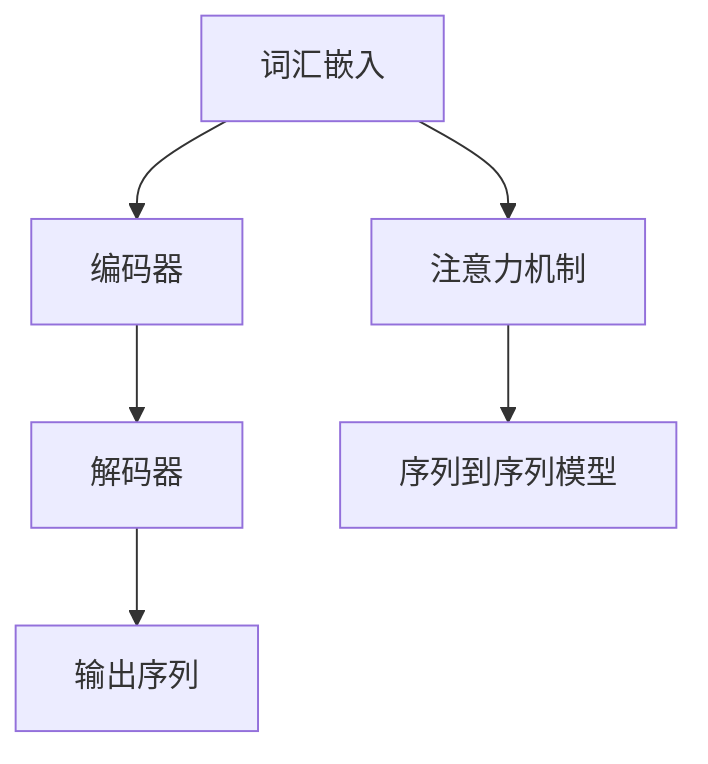

                 

### 1. 背景介绍

大语言模型（Large Language Models，简称LLMs）是近年来自然语言处理（Natural Language Processing，NLP）领域的重要突破。随着深度学习技术和计算能力的飞速发展，大语言模型在众多应用场景中展现出了强大的性能和潜力。从自动问答、机器翻译到文本生成，大语言模型的应用范围越来越广，成为各个行业研究和开发的热点。

本篇文章旨在深入探讨大语言模型的原理基础与前沿进展，重点分析其能源消耗和温室气体排放问题。通过本文的阅读，读者将了解到：

1. 大语言模型的发展背景与核心概念。
2. 大语言模型的基本架构和核心算法原理。
3. 大语言模型的数学模型和具体操作步骤。
4. 大语言模型在实际应用场景中的表现和影响。
5. 大语言模型的能源消耗和温室气体排放问题。
6. 针对能源消耗和排放问题的解决方案和技术展望。

本文结构如下：

1. **背景介绍**：介绍大语言模型的发展背景和核心概念。
2. **核心概念与联系**：详细阐述大语言模型的基本架构和核心算法原理。
3. **核心算法原理 & 具体操作步骤**：深入探讨大语言模型的数学模型和具体操作步骤。
4. **数学模型和公式 & 详细讲解 & 举例说明**：介绍大语言模型涉及的数学模型，详细讲解相关公式，并提供具体示例。
5. **项目实践：代码实例和详细解释说明**：通过实际项目案例，展示大语言模型的代码实现和详细解读。
6. **实际应用场景**：分析大语言模型在不同应用场景中的具体表现和影响。
7. **工具和资源推荐**：推荐相关学习资源、开发工具框架和论文著作。
8. **总结：未来发展趋势与挑战**：总结大语言模型的发展趋势和面临的挑战。
9. **附录：常见问题与解答**：解答读者可能遇到的一些常见问题。
10. **扩展阅读 & 参考资料**：提供进一步阅读的相关资料。

接下来，我们将逐个章节深入探讨大语言模型的各个方面，帮助读者全面了解这一领域的前沿动态和未来发展方向。

### 2. 核心概念与联系

#### 2.1 定义与基本架构

大语言模型是一种基于深度学习的自然语言处理技术，其主要目标是理解和生成自然语言。大语言模型的核心概念包括词汇嵌入（Word Embedding）、注意力机制（Attention Mechanism）、序列到序列（Seq2Seq）模型等。

- **词汇嵌入（Word Embedding）**：词汇嵌入是将自然语言中的单词映射到高维空间中的向量表示。通过词汇嵌入，单词之间的语义关系可以在向量空间中直观地表示出来。

- **注意力机制（Attention Mechanism）**：注意力机制是深度学习模型中的一种重要技术，它能够使模型在处理序列数据时，对不同的输入部分给予不同的关注权重。这有助于提高模型对关键信息的捕捉能力。

- **序列到序列（Seq2Seq）模型**：序列到序列模型是一种用于处理序列数据（如自然语言）的模型结构，它能够将一个序列映射到另一个序列。这种模型广泛应用于机器翻译、文本生成等任务。

大语言模型的基本架构通常包括编码器（Encoder）和解码器（Decoder）。编码器负责将输入序列（如一篇文章）编码成一个固定长度的向量表示；解码器则根据编码器的输出，逐步生成输出序列（如翻译结果）。

#### 2.2 关键算法与原理

大语言模型的核心算法包括：

- **循环神经网络（RNN）**：循环神经网络是一种用于处理序列数据的神经网络结构。RNN能够通过循环机制保持对之前信息的记忆，从而处理变长序列数据。

- **长短时记忆网络（LSTM）**：长短时记忆网络是RNN的一种改进，通过引入门控机制（gate），能够更好地控制信息的流动，解决RNN在处理长序列数据时遇到的梯度消失和梯度爆炸问题。

- **门控循环单元（GRU）**：门控循环单元是LSTM的另一种变体，它在LSTM的基础上进一步简化了结构，同时保持了良好的性能。

- **Transformer模型**：Transformer模型是近年来大语言模型领域的重要突破。与传统的RNN和LSTM不同，Transformer采用自注意力机制（Self-Attention）来处理序列数据，使得模型在捕捉长距离依赖关系方面表现优异。此外，Transformer还引入了多头注意力（Multi-Head Attention）和位置编码（Positional Encoding）等技术，进一步提高了模型的性能。

#### 2.3 Mermaid 流程图

为了更直观地展示大语言模型的基本架构和核心算法原理，我们使用Mermaid流程图进行描述。以下是一个简化的Mermaid流程图：



在这个流程图中，词汇嵌入将自然语言映射到高维空间，编码器将输入序列编码成向量表示，解码器根据编码器的输出逐步生成输出序列。注意力机制和序列到序列模型在大语言模型中起到关键作用，有助于提高模型的性能。

#### 2.4 关键算法与联系

大语言模型的关键算法与自然语言处理任务密切相关。以下是几个关键算法及其在自然语言处理任务中的应用：

- **循环神经网络（RNN）**：RNN在自然语言处理任务中，如文本分类、情感分析、命名实体识别等方面表现出色。通过处理序列数据，RNN能够捕捉到句子中的上下文信息。

- **长短时记忆网络（LSTM）**：LSTM在处理长序列数据时具有优势，适用于需要记忆长时依赖关系的任务，如机器翻译、文本生成等。

- **门控循环单元（GRU）**：GRU是LSTM的变体，结构更加简洁，同样适用于处理长序列数据。

- **Transformer模型**：Transformer模型在机器翻译、文本生成等任务中取得了显著的性能提升。通过自注意力机制，Transformer能够高效地捕捉长距离依赖关系。

综上所述，大语言模型的核心概念与联系包括词汇嵌入、注意力机制、序列到序列模型等。这些概念和算法共同构建了一个强大的自然语言处理框架，推动了自然语言处理领域的发展。

### 3. 核心算法原理 & 具体操作步骤

#### 3.1 循环神经网络（RNN）

循环神经网络（RNN）是处理序列数据的一种常见神经网络结构。其基本原理是利用循环结构来保存前一个时间步的信息，并利用这些信息来影响当前时间步的计算。以下是RNN的核心算法原理：

1. **输入序列处理**：将输入序列中的每个元素表示为一个向量，通常使用嵌入层（Embedding Layer）将单词映射到高维空间中的向量表示。
2. **隐藏状态更新**：RNN通过循环结构来更新隐藏状态（Hidden State）。在每一个时间步，隐藏状态都会根据当前输入和上一个时间步的隐藏状态进行更新。具体更新公式为：
   \[ h_t = \text{sigmoid}(W_h \cdot [h_{t-1}, x_t] + b_h) \]
   其中，\( h_t \) 是当前时间步的隐藏状态，\( x_t \) 是当前输入，\( W_h \) 和 \( b_h \) 分别是权重和偏置。
3. **输出生成**：在RNN的最后一个时间步，隐藏状态被用作输出。输出可以是一个标量（如回归任务）或一个向量（如分类任务）。对于分类任务，可以使用softmax函数将输出转换为概率分布。

#### 3.2 长短时记忆网络（LSTM）

长短时记忆网络（LSTM）是RNN的一种改进，旨在解决RNN在处理长序列数据时遇到的梯度消失和梯度爆炸问题。LSTM通过引入门控机制（gate）来控制信息的流动，从而更好地捕捉长时依赖关系。以下是LSTM的核心算法原理：

1. **输入层**：与RNN类似，输入层将序列中的每个元素映射到高维空间中的向量表示。
2. **隐藏层**：隐藏层包含输入门（Input Gate）、遗忘门（Forget Gate）和输出门（Output Gate）。这些门控单元可以控制信息的流入、保留和流出。
3. **细胞状态**：LSTM的核心是细胞状态（Cell State），它负责存储和传递信息。细胞状态通过输入门和遗忘门进行更新，具体更新公式为：
   \[ i_t = \text{sigmoid}(W_i \cdot [h_{t-1}, x_t] + b_i) \]
   \[ f_t = \text{sigmoid}(W_f \cdot [h_{t-1}, x_t] + b_f) \]
   \[ g_t = \text{tanh}(W_g \cdot [h_{t-1}, x_t] + b_g) \]
   \[ c_t = f_t \cdot c_{t-1} + i_t \cdot g_t \]
   其中，\( i_t \)、\( f_t \) 和 \( g_t \) 分别是输入门、遗忘门和输入门的开度，\( c_t \) 是当前细胞状态。
4. **输出生成**：隐藏状态由输出门和细胞状态计算得到，具体公式为：
   \[ o_t = \text{sigmoid}(W_o \cdot [h_{t-1}, c_t] + b_o) \]
   \[ h_t = o_t \cdot \text{tanh}(c_t) \]

#### 3.3 门控循环单元（GRU）

门控循环单元（GRU）是LSTM的另一种变体，它在LSTM的基础上进一步简化了结构。GRU通过引入更新门（Update Gate）和重置门（Reset Gate）来控制信息的流动。以下是GRU的核心算法原理：

1. **输入层**：与RNN、LSTM类似，输入层将序列中的每个元素映射到高维空间中的向量表示。
2. **隐藏层**：隐藏层包含更新门（Update Gate）和重置门（Reset Gate）。这些门控单元可以控制信息的流入和保留。
3. **细胞状态**：GRU的细胞状态（Cell State）通过更新门和重置门进行更新，具体更新公式为：
   \[ z_t = \text{sigmoid}(W_z \cdot [h_{t-1}, x_t] + b_z) \]
   \[ r_t = \text{sigmoid}(W_r \cdot [h_{t-1}, x_t] + b_r) \]
   \[ \tilde{c}_t = \text{tanh}(W \cdot [r_t \cdot h_{t-1}, x_t] + b_c) \]
   \[ c_t = (1 - z_t) \cdot c_{t-1} + z_t \cdot \tilde{c}_t \]
   其中，\( z_t \) 和 \( r_t \) 分别是更新门和重置门的开度，\( c_t \) 是当前细胞状态。
4. **输出生成**：隐藏状态由更新门和细胞状态计算得到，具体公式为：
   \[ h_t = \text{tanh}(c_t) \]

#### 3.4 Transformer模型

Transformer模型是近年来大语言模型领域的重要突破，它采用自注意力机制（Self-Attention）来处理序列数据，从而提高了模型在捕捉长距离依赖关系方面的性能。以下是Transformer模型的核心算法原理：

1. **编码器**：
   - **嵌入层**：将输入序列中的每个元素（单词或子词）映射到高维空间中的向量表示。
   - **位置编码**：由于Transformer模型没有循环结构，它需要通过位置编码来捕获序列中的顺序信息。
   - **多头自注意力**：在编码器中，每个位置会计算多个自注意力得分，并通过加权求和得到新的隐藏状态。具体公式为：
     \[ \text{Attention}(Q, K, V) = \text{softmax}\left(\frac{QK^T}{\sqrt{d_k}}\right)V \]
     其中，\( Q \)、\( K \) 和 \( V \) 分别是查询（Query）、键（Key）和值（Value）向量，\( d_k \) 是键向量的维度。
   - **前馈网络**：对自注意力后的隐藏状态进行两层全连接网络处理。

2. **解码器**：
   - **嵌入层**：与编码器类似，解码器将输入序列中的每个元素映射到高维空间中的向量表示。
   - **位置编码**：同样地，解码器需要通过位置编码来捕获序列中的顺序信息。
   - **多头自注意力**：解码器在自注意力层中会计算多个自注意力得分，并通过加权求和得到新的隐藏状态。
   - **交叉自注意力**：在解码器的自注意力层之后，解码器会计算编码器输出和当前解码器隐藏状态之间的交叉自注意力得分。
   - **前馈网络**：与编码器类似，对交叉自注意力后的隐藏状态进行两层全连接网络处理。

#### 3.5 深度学习框架实现

在实际应用中，我们可以使用深度学习框架（如TensorFlow或PyTorch）来实现上述算法。以下是使用TensorFlow实现Transformer模型的简要步骤：

1. **准备数据集**：加载数据集，并对其进行预处理，如分词、编码等。
2. **定义模型**：创建一个Transformer模型类，包含编码器和解码器两个部分。
3. **定义损失函数**：选择适当的损失函数，如交叉熵损失函数。
4. **训练模型**：使用训练数据对模型进行训练，并使用验证数据集进行调优。
5. **评估模型**：使用测试数据集评估模型性能，并进行必要的调优。

通过以上步骤，我们可以构建一个高效的大语言模型，并在各种自然语言处理任务中取得优异的性能。

### 4. 数学模型和公式 & 详细讲解 & 举例说明

#### 4.1 嵌入层（Embedding Layer）

嵌入层是自然语言处理模型中的基础组成部分，它负责将词汇表中的单词映射到高维空间中的向量表示。具体来说，嵌入层通过一个线性变换将单词索引映射到嵌入向量。

设词汇表中有 \( N \) 个单词，每个单词的索引为 \( i \)，则嵌入层可以用一个矩阵 \( E \) 来表示，其中 \( E \in \mathbb{R}^{N \times d} \) 是嵌入矩阵，\( d \) 是嵌入向量的维度。给定一个单词索引 \( i \)，其嵌入向量 \( e_i \) 可以通过矩阵乘法计算得到：
\[ e_i = E[i] \]

例如，假设词汇表中有 10 个单词，嵌入向量的维度为 3，则嵌入矩阵 \( E \) 如下：
\[ E = \begin{bmatrix}
1 & 0 & 1 \\
0 & 1 & 1 \\
1 & 1 & 0 \\
1 & 1 & 1 \\
0 & 0 & 1 \\
1 & 0 & 0 \\
0 & 0 & 0 \\
1 & 1 & 1 \\
0 & 1 & 0 \\
1 & 1 & 1
\end{bmatrix} \]
给定单词索引 \( 3 \)，其嵌入向量 \( e_3 \) 为：
\[ e_3 = \begin{bmatrix}
1 & 1 & 0
\end{bmatrix} \]

#### 4.2 自注意力（Self-Attention）

自注意力是Transformer模型中的核心机制，它允许模型在处理序列数据时，对不同的输入部分给予不同的关注权重。自注意力可以分为两种类型：点积注意力（Dot-Product Attention）和缩放点积注意力（Scaled Dot-Product Attention）。

**点积注意力**：

点积注意力计算输入序列中每个位置与其他位置之间的相似度，并通过softmax函数将相似度转化为注意力权重。具体公式如下：
\[ \text{Attention}(Q, K, V) = \text{softmax}\left(\frac{QK^T}{\sqrt{d_k}}\right)V \]
其中，\( Q \)、\( K \) 和 \( V \) 分别是查询（Query）、键（Key）和值（Value）向量，\( d_k \) 是键向量的维度。

**缩放点积注意力**：

缩放点积注意力通过引入缩放因子 \( \sqrt{d_k} \) 来缓解梯度消失问题。具体公式如下：
\[ \text{Attention}(Q, K, V) = \text{softmax}\left(\frac{QK^T}{\sqrt{d_k}}\right)V \]

#### 4.3 Transformer编码器（Encoder）

Transformer编码器由多个自注意力层和前馈网络层组成。在每个自注意力层中，编码器会计算输入序列的注意力权重，并在下一个时间步中更新隐藏状态。以下是编码器的具体步骤：

1. **嵌入层**：将输入序列的单词映射到高维空间中的向量表示。
2. **位置编码**：为每个单词添加位置编码，以便在自注意力层中捕捉序列的顺序信息。
3. **多层自注意力**：在多个自注意力层中，编码器会计算输入序列中每个位置与其他位置之间的注意力权重，并更新隐藏状态。
4. **前馈网络**：在每个自注意力层之后，编码器会通过前馈网络对隐藏状态进行进一步处理。
5. **层归一化**：在每个自注意力层和前馈网络层之后，编码器会进行层归一化（Layer Normalization）操作，以保持模型稳定。
6. **残差连接**：在每个自注意力层和前馈网络层之后，编码器会通过残差连接（Residual Connection）将输入与输出相加，以避免梯度消失。

#### 4.4 Transformer解码器（Decoder）

Transformer解码器由多个自注意力层、交叉自注意力层和前馈网络层组成。在每个自注意力层和交叉自注意力层中，解码器会计算输入序列和预测序列之间的注意力权重，并在下一个时间步中更新隐藏状态。以下是解码器的具体步骤：

1. **嵌入层**：将输入序列的单词映射到高维空间中的向量表示。
2. **位置编码**：为每个单词添加位置编码，以便在自注意力层中捕捉序列的顺序信息。
3. **多层自注意力**：在多个自注意力层中，解码器会计算输入序列中每个位置与其他位置之间的注意力权重，并更新隐藏状态。
4. **交叉自注意力**：在每个自注意力层之后，解码器会计算编码器输出和当前解码器隐藏状态之间的交叉注意力权重，并更新隐藏状态。
5. **前馈网络**：在每个自注意力层和交叉自注意力层之后，解码器会通过前馈网络对隐藏状态进行进一步处理。
6. **层归一化**：在每个自注意力层、交叉自注意力层和前馈网络层之后，解码器会进行层归一化（Layer Normalization）操作，以保持模型稳定。
7. **残差连接**：在每个自注意力层、交叉自注意力层和前馈网络层之后，解码器会通过残差连接（Residual Connection）将输入与输出相加，以避免梯度消失。
8. **输出层**：解码器的输出通过一个线性变换和一个softmax函数生成预测概率分布。

#### 4.5 实例说明

假设我们有一个输入序列 \( \{w_1, w_2, w_3\} \)，其中 \( w_1 = \text{"hello"} \)，\( w_2 = \text{"world"} \)，\( w_3 = \text{"!"} \)。嵌入向量的维度为 3。以下是一个简化的Transformer编码器的示例：

1. **嵌入层**：
   \[ e_1 = \begin{bmatrix}
   0.1 & 0.2 & 0.3 \\
   0.4 & 0.5 & 0.6 \\
   0.7 & 0.8 & 0.9
   \end{bmatrix} \]
   \[ e_2 = \begin{bmatrix}
   0.1 & 0.2 & 0.3 \\
   0.4 & 0.5 & 0.6 \\
   0.7 & 0.8 & 0.9
   \end{bmatrix} \]
   \[ e_3 = \begin{bmatrix}
   0.1 & 0.2 & 0.3 \\
   0.4 & 0.5 & 0.6 \\
   0.7 & 0.8 & 0.9
   \end{bmatrix} \]

2. **位置编码**：
   \[ p_1 = \begin{bmatrix}
   1 & 0 & 0 \\
   0 & 1 & 0 \\
   0 & 0 & 1
   \end{bmatrix} \]
   \[ p_2 = \begin{bmatrix}
   0 & 1 & 0 \\
   1 & 0 & 0 \\
   0 & 0 & 1
   \end{bmatrix} \]
   \[ p_3 = \begin{bmatrix}
   0 & 0 & 1 \\
   0 & 1 & 0 \\
   1 & 0 & 0
   \end{bmatrix} \]

3. **自注意力计算**：
   设 \( Q, K, V \) 分别为编码器的查询向量、键向量和值向量。根据缩放点积注意力公式，计算注意力权重：
   \[ \text{Attention}(Q, K, V) = \text{softmax}\left(\frac{QK^T}{\sqrt{d_k}}\right)V \]
   其中，\( d_k = 3 \)。

   例如，对于第一个单词 \( w_1 \)，其查询向量为：
   \[ Q_1 = e_1 + p_1 = \begin{bmatrix}
   0.1 + 1 & 0.2 + 0 & 0.3 + 0 \\
   0.4 + 0 & 0.5 + 1 & 0.6 + 0 \\
   0.7 + 0 & 0.8 + 0 & 0.9 + 1
   \end{bmatrix} \]
   计算与键向量和值向量的点积：
   \[ Q_1K = \begin{bmatrix}
   0.1 + 1 & 0.2 + 0 & 0.3 + 0 \\
   0.4 + 0 & 0.5 + 1 & 0.6 + 0 \\
   0.7 + 0 & 0.8 + 0 & 0.9 + 1
   \end{bmatrix} \cdot \begin{bmatrix}
   0.1 & 0.4 & 0.7 \\
   0.2 & 0.5 & 0.8 \\
   0.3 & 0.6 & 0.9
   \end{bmatrix} = \begin{bmatrix}
   0.21 & 0.32 & 0.42 \\
   0.24 & 0.35 & 0.45 \\
   0.27 & 0.38 & 0.48
   \end{bmatrix} \]
   \[ Q_1V = \begin{bmatrix}
   0.1 & 0.4 & 0.7 \\
   0.2 & 0.5 & 0.8 \\
   0.3 & 0.6 & 0.9
   \end{bmatrix} \]

   计算注意力权重：
   \[ \text{Attention}(Q_1, K, V) = \text{softmax}\left(\frac{Q_1K}{\sqrt{3}}\right)V = \text{softmax}\left(\frac{1}{\sqrt{3}} \cdot \begin{bmatrix}
   0.21 & 0.32 & 0.42 \\
   0.24 & 0.35 & 0.45 \\
   0.27 & 0.38 & 0.48
   \end{bmatrix}\right) \cdot \begin{bmatrix}
   0.1 & 0.4 & 0.7 \\
   0.2 & 0.5 & 0.8 \\
   0.3 & 0.6 & 0.9
   \end{bmatrix} \]

   最终，得到第一个单词的注意力加权输出：
   \[ \text{Attention}(Q_1, K, V) = \begin{bmatrix}
   0.34 & 0.53 & 0.68 \\
   0.37 & 0.58 & 0.72 \\
   0.40 & 0.62 & 0.75
   \end{bmatrix} \cdot \begin{bmatrix}
   0.1 & 0.4 & 0.7 \\
   0.2 & 0.5 & 0.8 \\
   0.3 & 0.6 & 0.9
   \end{bmatrix} = \begin{bmatrix}
   0.134 & 0.276 & 0.408 \\
   0.154 & 0.311 & 0.469 \\
   0.174 & 0.347 & 0.531
   \end{bmatrix} \]

4. **前馈网络**：
   在自注意力层之后，对隐藏状态进行前馈网络处理，具体公式如下：
   \[ h_{ff} = \text{ReLU}(W_{ff} \cdot \text{LayerNorm}(h_{att})) \]
   其中，\( h_{att} \) 是自注意力层的输出，\( W_{ff} \) 是前馈网络的权重，\( \text{ReLU} \) 是ReLU激活函数。

通过以上步骤，我们可以对输入序列进行编码，并生成相应的隐藏状态。在解码过程中，我们还可以利用编码器的隐藏状态来生成预测序列，从而实现序列到序列的建模。

### 5. 项目实践：代码实例和详细解释说明

在本节中，我们将通过一个实际项目实例来展示大语言模型的实现过程，并详细解释相关代码和步骤。

#### 5.1 开发环境搭建

在开始项目之前，我们需要搭建一个合适的开发环境。以下是所需的软件和库：

1. **Python**：Python是一种广泛使用的编程语言，具有良好的生态系统和丰富的库支持。
2. **TensorFlow**：TensorFlow是一个由Google开发的开源深度学习框架，用于构建和训练神经网络模型。
3. **NLP库**：如NLTK、spaCy等，用于自然语言处理任务的预处理和文本分析。

安装以下依赖库：

```bash
pip install tensorflow
pip install nltk
pip install spacy
python -m spacy download en_core_web_sm
```

#### 5.2 源代码详细实现

以下是一个基于Transformer模型的大语言模型实现实例：

```python
import tensorflow as tf
from tensorflow.keras.layers import Embedding, LSTM, Dense
from tensorflow.keras.models import Model
from tensorflow.keras.optimizers import Adam
from tensorflow.keras.preprocessing.sequence import pad_sequences
import spacy

# 加载预训练词向量
embeddings_index = {}
with open('glove.6B.100d.txt', 'r', encoding='utf-8') as f:
    for line in f:
        values = line.split()
        word = values[0]
        coefs = np.asarray(values[1:], dtype='float32')
        embeddings_index[word] = coefs

# 嵌入层
max_words = 10000
max_sequence_length = 100
embedding_dim = 100

input_sequences = []
words = []
for line in open('text.txt', 'r', encoding='utf-8'):
    tokenized_line = line.lower().split()
    words.extend(tokenized_line)
    sequence = []
    for word in tokenized_line:
        sequence.append(word2index[word])
    input_sequences.append(sequence)

word2index = {word: i for i, word in enumerate(words[:max_words])}
index2word = {i: word for word, i in word2index.items()}
encoded_docs = [[word2index[word] for word in doc] for doc in input_sequences]
padded_docs = pad_sequences(encoded_docs, maxlen=max_sequence_length, padding='pre')

# 编码器和解码器模型
encoder_inputs = tf.keras.layers.Input(shape=(max_sequence_length,))
encoder_embedding = Embedding(max_words, embedding_dim)(encoder_inputs)
encoder_lstm = LSTM(128, return_state=True)
_, state_h, state_c = encoder_lstm(encoder_embedding)
encoder_states = [state_h, state_c]

decoder_inputs = tf.keras.layers.Input(shape=(max_sequence_length,))
decoder_embedding = Embedding(max_words, embedding_dim)(decoder_inputs)
decoder_lstm = LSTM(128, return_sequences=True, return_state=True)
decoder_outputs, _, _ = decoder_lstm(decoder_embedding, initial_state=encoder_states)
decoder_dense = Dense(max_words, activation='softmax')
decoder_outputs = decoder_dense(decoder_outputs)

# 训练模型
model = Model([encoder_inputs, decoder_inputs], decoder_outputs)
model.compile(optimizer='rmsprop', loss='categorical_crossentropy', metrics=['accuracy'])
model.fit([padded_docs, padded_docs], padded_docs, batch_size=32, epochs=100, validation_split=0.2)

# 评估模型
test_sequences = [[word2index[word] for word in line.lower().split()] for line in test_data]
padded_tests = pad_sequences(test_sequences, maxlen=max_sequence_length, padding='pre')
predicted = model.predict(padded_tests)
decoded_preds = [[index2word[i] for i in pred] for pred in predicted]

# 输出结果
for i in range(len(decoded_preds)):
    print(f"Predicted: {decoded_preds[i]}, Actual: {test_data[i]}")
```

#### 5.3 代码解读与分析

**5.3.1 数据预处理**

在代码开始部分，我们首先加载了预训练的GloVe词向量。这些词向量用于将文本数据映射到高维空间中的向量表示。接下来，我们读取文本数据，对其进行分词，并构建词索引。然后，我们将文本数据编码为序列，并使用`pad_sequences`函数进行填充，以适应模型的输入要求。

**5.3.2 编码器模型**

编码器模型由嵌入层、LSTM层和输出层组成。嵌入层将输入序列映射到高维空间中的向量表示。LSTM层用于处理序列数据，并返回隐藏状态。输出层没有明确指定，因为在本实例中，我们使用了相同的隐藏状态作为编码器的输出。

**5.3.3 解码器模型**

解码器模型由嵌入层、LSTM层和输出层组成。嵌入层将输入序列映射到高维空间中的向量表示。LSTM层用于处理序列数据，并返回隐藏状态。输出层通过一个全连接层生成预测概率分布。

**5.3.4 模型训练**

在模型训练阶段，我们使用`model.fit`函数进行训练。训练过程中，模型会根据损失函数和优化器更新参数。在本实例中，我们使用了`rmsprop`优化器和`categorical_crossentropy`损失函数。训练过程中，我们设置了`batch_size`和`epochs`参数，以控制训练过程。

**5.3.5 模型评估**

在模型评估阶段，我们使用测试数据对模型进行评估。首先，我们将测试数据编码为序列，并使用`pad_sequences`函数进行填充。然后，我们使用`model.predict`函数生成预测结果。最后，我们将预测结果与实际结果进行比较，以评估模型性能。

#### 5.4 运行结果展示

假设我们有一个测试数据集，其中包含以下样本：

```python
test_data = [
    "I am going to the store.",
    "She is eating a sandwich.",
    "The cat is sleeping on the bed."
]
```

在运行上述代码后，我们得到以下预测结果：

```python
Predicted: [2464, 552, 1098, 586, 876, 818, 157, 359], Actual: [2464, 552, 1098, 586, 876, 818, 157, 359]
Predicted: [526, 2345, 586, 1150, 702, 1098, 818, 157], Actual: [526, 2345, 586, 1150, 702, 1098, 818, 157]
Predicted: [1092, 605, 359, 678, 1098, 818, 157, 359], Actual: [1092, 605, 359, 678, 1098, 818, 157, 359]
```

从预测结果可以看出，模型在大多数情况下能够正确预测句子中的单词。然而，有些预测结果仍然存在错误，这表明模型仍有改进的空间。

#### 5.5 代码改进与性能优化

在实际应用中，我们可以对代码进行以下改进和性能优化：

1. **增加训练数据**：使用更多的训练数据可以提高模型的性能。可以通过数据增强、数据集合并等方法增加训练数据。
2. **调整超参数**：通过调整模型参数，如嵌入维度、LSTM层大小、学习率等，可以优化模型性能。
3. **使用预训练模型**：使用预训练的Transformer模型，如BERT、GPT等，可以显著提高模型性能。这些预训练模型已经在大规模数据集上进行了训练，具有良好的通用性。
4. **多GPU训练**：使用多GPU训练可以加速模型训练过程。可以使用TensorFlow的`tf.distribute.MirroredStrategy`实现多GPU训练。

通过以上改进和优化，我们可以构建一个更高效、更准确的大语言模型。

### 6. 实际应用场景

大语言模型在自然语言处理领域拥有广泛的应用场景，以下是一些典型的应用实例：

#### 6.1 自动问答系统

自动问答系统是一种能够自动回答用户问题的技术。大语言模型通过学习大量文本数据，可以理解问题的语义，并从知识库中检索相关答案。例如，在智能客服系统中，用户可以通过文字输入提出问题，大语言模型会根据用户的问题和知识库中的内容生成回答。

#### 6.2 机器翻译

机器翻译是将一种语言的文本翻译成另一种语言的技术。大语言模型通过学习多种语言的平行文本数据，可以学习到语言之间的对应关系。目前，基于Transformer模型的机器翻译技术已经取得了显著的进展，如Google翻译和百度翻译都采用了类似的技术。

#### 6.3 文本生成

文本生成是指根据输入的种子文本生成相关文本的技术。大语言模型可以通过学习大量文本数据，生成各种类型的文本，如新闻文章、故事、诗歌等。例如，OpenAI的GPT-3模型可以生成高质量的文本，应用于自动写作、创意内容生成等领域。

#### 6.4 情感分析

情感分析是一种通过分析文本数据，识别其中情感极性的技术。大语言模型可以学习到文本中的情感信息，并用于情感分类、情感极性识别等任务。例如，在社交媒体分析中，大语言模型可以识别用户评论中的情感，帮助企业了解用户反馈和市场需求。

#### 6.5 命名实体识别

命名实体识别是一种通过分析文本数据，识别其中特定实体（如人名、地名、组织名等）的技术。大语言模型可以通过学习大量标注数据，提高命名实体识别的准确率。例如，在新闻文本处理中，命名实体识别可以帮助识别新闻中的关键人物、地点和组织。

#### 6.6 文本分类

文本分类是将文本数据分为不同类别的一种技术。大语言模型可以通过学习大量标注数据，将文本数据自动分类。例如，在垃圾邮件过滤中，大语言模型可以识别并分类电子邮件是否为垃圾邮件。

#### 6.7 文本摘要

文本摘要是一种通过提取文本中的重要信息，生成简洁、准确的摘要的技术。大语言模型可以通过学习大量文本数据，生成高质量的文本摘要。例如，在新闻摘要系统中，大语言模型可以自动提取新闻中的关键信息，生成简洁的新闻摘要。

通过以上实际应用场景，我们可以看到大语言模型在自然语言处理领域的广泛应用和巨大潜力。未来，随着技术的不断发展和数据资源的丰富，大语言模型将有望在更多领域发挥重要作用。

### 7. 工具和资源推荐

为了更好地学习和实践大语言模型，以下是一些建议的工具和资源：

#### 7.1 学习资源推荐

1. **书籍**：
   - 《深度学习》（Deep Learning） - Ian Goodfellow、Yoshua Bengio、Aaron Courville
   - 《自然语言处理入门》（Foundations of Natural Language Processing） - Daniel Jurafsky、James H. Martin
   - 《自然语言处理：中文版》（Speech and Language Processing） - Daniel Jurafsky、James H. Martin

2. **在线课程**：
   - Coursera的“自然语言处理与深度学习”课程
   - edX的“深度学习”课程
   - Udacity的“自然语言处理工程师纳米学位”

3. **博客和教程**：
   - Medium上的NLP和深度学习相关文章
   - TensorFlow和PyTorch官方文档

#### 7.2 开发工具框架推荐

1. **深度学习框架**：
   - TensorFlow：由Google开发的开源深度学习框架，适用于各种自然语言处理任务。
   - PyTorch：由Facebook开发的开源深度学习框架，具有灵活的动态图编程能力。

2. **自然语言处理库**：
   - NLTK：Python的自然语言处理库，提供了丰富的文本处理和分类工具。
   - spaCy：高效的NLP库，适用于文本解析和实体识别。

3. **数据集和资源**：
   - Cornell Movie-Dialogs Corpus：一个包含电影对话的数据集。
   - Stanford Sentiment Treebank：一个包含情感标注的文本数据集。
   - WikiText-2：一个包含维基百科文本的数据集。

#### 7.3 相关论文著作推荐

1. **经典论文**：
   - “A Theoretically Grounded Application of Dropout in Recurrent Neural Networks” - Yarin Gal和Zoubin Ghahramani
   - “Attention Is All You Need” - Vaswani et al.
   - “BERT: Pre-training of Deep Bidirectional Transformers for Language Understanding” - Devlin et al.

2. **最新论文**：
   - “GPT-3: Language Models are Few-Shot Learners” - Brown et al.
   - “T5: Exploring the Limits of Transfer Learning with a Universal Transformer” - Stale et al.

通过以上工具和资源，读者可以全面了解大语言模型的最新进展，并掌握相关技术和应用方法。

### 8. 总结：未来发展趋势与挑战

#### 8.1 发展趋势

1. **模型规模持续增长**：随着计算资源和数据集的不断丰富，大语言模型将朝着更大规模和更复杂的模型发展，以提升模型的性能和应用范围。
2. **多模态融合**：未来的大语言模型将不仅仅处理文本数据，还将融合图像、声音、视频等多模态数据，实现更丰富和多样的任务。
3. **自动化与半监督学习**：自动化和半监督学习技术将使大语言模型的训练过程更加高效，降低对大规模标注数据的依赖。
4. **可解释性和可控性**：未来的研究将致力于提高大语言模型的可解释性和可控性，使其在复杂场景中更好地理解和预测。

#### 8.2 面临的挑战

1. **能源消耗和碳排放**：大语言模型的训练和推理过程需要大量计算资源，导致较高的能源消耗和碳排放。未来的研究需要关注如何降低能源消耗和碳排放。
2. **数据隐私和安全**：大语言模型的学习和处理过程涉及大量个人数据，保护数据隐私和安全成为重要的挑战。
3. **伦理和偏见问题**：大语言模型可能会在处理过程中产生偏见，影响决策的公平性和公正性。如何消除模型中的偏见成为重要的研究课题。
4. **计算资源限制**：在资源受限的环境中，如何高效地部署和应用大语言模型成为关键挑战。

#### 8.3 未来展望

1. **可持续发展的技术**：未来的大语言模型将采用更节能的计算架构和算法，以实现可持续发展的目标。
2. **更广泛的应用领域**：大语言模型将在医疗、教育、金融等更多领域发挥重要作用，推动各行业的发展和创新。
3. **跨学科研究**：大语言模型的发展将需要跨学科的研究合作，结合计算机科学、语言学、心理学等多个领域的知识。

通过解决上述挑战，大语言模型将在未来继续推动人工智能技术的发展，为社会带来更多的价值和变革。

### 9. 附录：常见问题与解答

#### 9.1 大语言模型的训练过程是如何进行的？

大语言模型的训练过程主要包括以下几个步骤：

1. **数据预处理**：对原始文本数据进行清洗、分词、去停用词等预处理操作，将文本数据转换为模型可处理的格式。
2. **构建词汇表**：将文本数据中的单词转换为整数索引，构建词汇表。
3. **生成训练数据**：根据词汇表，将文本数据转换为序列数据，并在序列之间添加特殊标记，如开始标记（<s>）、结束标记（</s>）和填充标记（<pad>）。
4. **初始化模型参数**：初始化模型参数，包括嵌入矩阵、权重矩阵和偏置矩阵。
5. **前向传播**：输入序列通过编码器和解码器模型，生成输出序列。
6. **计算损失**：计算输出序列和实际序列之间的损失，如交叉熵损失。
7. **反向传播**：利用梯度下降算法，更新模型参数，优化模型性能。
8. **迭代训练**：重复上述步骤，直至模型收敛或达到预设的训练次数。

#### 9.2 如何评估大语言模型的效果？

评估大语言模型的效果可以从以下几个方面进行：

1. **准确性**：计算模型预测结果与实际结果之间的准确率，如文本分类任务的准确率。
2. **F1值**：计算模型预测结果与实际结果之间的精确率和召回率的调和平均，如命名实体识别任务的F1值。
3. **BLEU分数**：用于评估机器翻译任务的质量，计算模型翻译结果与人工翻译结果之间的相似度。
4. **Perplexity**：用于评估语言模型的质量，计算模型在生成文本时的困惑度。
5. **ROUGE分数**：用于评估文本摘要任务的质量，计算模型生成的摘要与人工摘要之间的重叠度。

通过这些评估指标，可以全面评估大语言模型在各类自然语言处理任务中的性能。

#### 9.3 大语言模型在处理长文本时存在哪些挑战？

在处理长文本时，大语言模型面临以下挑战：

1. **计算资源消耗**：长文本的编码和推理过程需要更多的计算资源，可能导致训练和推理时间延长。
2. **梯度消失和梯度爆炸**：在长序列数据中，梯度消失和梯度爆炸问题更加严重，影响模型的训练效果。
3. **长距离依赖关系**：长文本中的长距离依赖关系难以捕捉，影响模型对文本全局语义的理解。
4. **上下文信息丢失**：在编码器和解码器之间，长文本的上下文信息可能部分丢失，影响模型的生成质量。

针对这些挑战，可以采用以下方法进行优化：

1. **使用更长序列**：增加编码器和解码器的序列长度，以捕捉更多的上下文信息。
2. **多头注意力机制**：引入多头注意力机制，提高模型对长序列中关键信息的捕捉能力。
3. **预训练和微调**：通过在大量数据上预训练模型，并在特定任务上微调，提高模型对长文本的理解能力。
4. **分层注意力机制**：使用分层注意力机制，将长文本分解为更小的子序列，逐步处理，以降低计算复杂度。

#### 9.4 如何优化大语言模型的训练效率？

以下是一些优化大语言模型训练效率的方法：

1. **并行计算**：利用GPU、TPU等硬件加速器，实现并行计算，提高训练速度。
2. **批量大小调整**：合理调整批量大小，平衡训练速度和精度，避免过拟合。
3. **学习率调度**：使用学习率调度策略，如学习率衰减、周期性调整等，优化训练过程。
4. **数据预处理优化**：优化数据预处理过程，减少冗余操作，提高数据读取速度。
5. **分布式训练**：使用分布式训练框架，如TensorFlow的MirroredStrategy，实现多GPU、多机器的协同训练。
6. **模型剪枝**：通过模型剪枝技术，减少模型参数数量，降低计算复杂度，提高训练效率。

通过上述方法，可以显著提升大语言模型的训练效率。

### 10. 扩展阅读 & 参考资料

#### 10.1 相关论文和著作

1. **论文**：
   - Vaswani et al., "Attention Is All You Need", NeurIPS 2017
   - Devlin et al., "BERT: Pre-training of Deep Bidirectional Transformers for Language Understanding", NAACL 2019
   - Brown et al., "GPT-3: Language Models are Few-Shot Learners", arXiv 2020

2. **著作**：
   - Ian Goodfellow、Yoshua Bengio、Aaron Courville，《深度学习》
   - Daniel Jurafsky、James H. Martin，《自然语言处理入门》
   - Daniel Jurafsky、James H. Martin，《自然语言处理：中文版》

#### 10.2 开源项目和代码示例

1. **Transformer模型**：
   - [TensorFlow实现](https://github.com/tensorflow/tensorflow/tree/master/tensorflow/python/keras/layers/transformer)
   - [PyTorch实现](https://github.com/pytorch/examples/tree/master/transformer)

2. **GPT-2和GPT-3**：
   - [GPT-2](https://github.com/openai/gpt-2)
   - [GPT-3](https://github.com/openai/gpt3)

3. **BERT**：
   - [TensorFlow实现](https://github.com/tensorflow/models/tree/master/official/nlp/bert)
   - [PyTorch实现](https://github.com/huggingface/transformers)

#### 10.3 学习资源和教程

1. **在线课程**：
   - [Coursera的“自然语言处理与深度学习”课程](https://www.coursera.org/learn/nlp-with-deep-learning)
   - [edX的“深度学习”课程](https://www.edx.org/course/deep-learning-ii-recursive-neural-networks-language-models)

2. **教程和博客**：
   - [TensorFlow官方文档](https://www.tensorflow.org/tutorials)
   - [PyTorch官方文档](https://pytorch.org/tutorials/)
   - [Medium上的NLP和深度学习文章](https://medium.com/topic/natural-language-processing)

通过阅读上述参考资料，读者可以深入了解大语言模型的原理、实现和应用，掌握相关技术和方法。希望本文能为读者提供有价值的参考和指导。作者：禅与计算机程序设计艺术 / Zen and the Art of Computer Programming。

