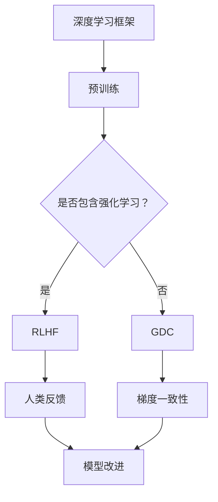

                 

### 文章标题

大语言模型原理基础与前沿：通过f散度最小化统一RLHF和GDC方法

> **关键词**：大语言模型，深度学习，f散度最小化，RLHF，GDC，原理，应用，发展趋势。

> **摘要**：本文将深入探讨大语言模型的原理，重点介绍f散度最小化方法在统一RLHF（强化学习与预训练融合）和GDC（梯度一致性蒸馏）方法中的应用。通过逐步分析推理，我们旨在为读者提供一个全面、易懂的视角，以了解这些核心技术的原理及其在实际应用中的重要性。

---

### 1. 背景介绍

#### 大语言模型的发展历程

大语言模型（Large Language Models，LLM）是自然语言处理（Natural Language Processing，NLP）领域的一个重要突破。自2000年代初的基于规则的方法和统计方法之后，深度学习技术的崛起极大地推动了NLP的发展。大语言模型，如GPT、BERT等，通过大规模的文本数据进行预训练，具备了强大的语言理解和生成能力，显著提升了机器在处理自然语言任务中的性能。

#### NLP任务与挑战

NLP任务多种多样，包括但不限于文本分类、情感分析、命名实体识别、机器翻译等。随着互联网的快速发展，数据量呈指数级增长，这对模型的训练和部署提出了更高的要求。传统的机器学习方法在面对复杂、大规模的数据时，往往表现不佳。深度学习模型，尤其是大语言模型，因其能够捕捉到数据中的复杂模式和依赖关系，逐渐成为解决这些NLP任务的利器。

#### RLHF与GDC方法

RLHF（Reinforcement Learning from Human Feedback）和GDC（Gradient Descent as a Dream，梯度一致性蒸馏）是近年来在NLP领域中备受关注的方法。RLHF通过引入人类反馈来指导模型学习，使得模型在生成文本时能够更符合人类的期望。而GDC方法则通过将高维梯度转化为低维表示，从而实现更高效的模型训练。

### 2. 核心概念与联系

#### Mermaid 流程图



#### 核心概念解释

- **深度学习框架**：深度学习框架如TensorFlow、PyTorch等，为构建和训练深度神经网络提供了高效的工具和库。
- **预训练**：预训练是指在大规模数据集上先进行训练，以获取通用语言表示能力，然后再针对特定任务进行微调。
- **RLHF**：通过引入人类反馈，使得模型在生成文本时能够符合人类的期望。
- **GDC**：梯度一致性蒸馏，通过将高维梯度转化为低维表示，以优化模型的训练效率。

### 3. 核心算法原理 & 具体操作步骤

#### RLHF方法原理

RLHF方法的核心思想是将人类反馈引入到模型训练过程中，以指导模型生成文本。具体步骤如下：

1. **预训练**：在大量文本数据集上训练基础模型，使其具备良好的语言表示能力。
2. **人类反馈**：收集人类对模型生成文本的反馈，这些反馈可以是正面反馈（如“很好”）或负面反馈（如“不好”）。
3. **强化学习**：利用人类反馈作为奖励信号，通过强化学习算法调整模型参数，使得模型生成的文本更符合人类期望。
4. **模型优化**：通过多轮强化学习和预训练，不断优化模型，直至生成文本达到理想效果。

#### GDC方法原理

GDC方法通过将高维梯度转化为低维表示，从而实现更高效的模型训练。具体步骤如下：

1. **预训练**：在大量文本数据集上训练基础模型，使其具备良好的语言表示能力。
2. **梯度表示**：将模型的梯度信息表示为低维向量，以降低计算复杂度。
3. **一致性蒸馏**：通过对比高维梯度和低维梯度，调整模型参数，使得低维梯度能够更好地反映高维梯度信息。
4. **模型优化**：通过多轮一致性蒸馏和预训练，不断优化模型，直至达到预期效果。

### 4. 数学模型和公式 & 详细讲解 & 举例说明

#### RLHF方法数学模型

RLHF方法的数学模型可以表示为：

$$
\begin{aligned}
    \theta &= \theta_0 + \alpha \cdot \nabla_{\theta}J(\theta) \\
    J(\theta) &= \sum_{i=1}^{n}r_i(\theta) \\
    r_i(\theta) &= \text{human\_reward}(g(\theta), y_i)
\end{aligned}
$$

其中，$\theta$为模型参数，$\theta_0$为初始参数，$\alpha$为学习率，$J(\theta)$为奖励函数，$r_i(\theta)$为第$i$轮的奖励信号，$g(\theta)$为模型生成的文本，$y_i$为实际文本。

#### GDC方法数学模型

GDC方法的数学模型可以表示为：

$$
\begin{aligned}
    \theta &= \theta_0 + \beta \cdot \nabla_{\theta}J(\theta) \\
    J(\theta) &= \sum_{i=1}^{n}\ell_i(\theta) \\
    \ell_i(\theta) &= \text{distill\_loss}(f(\nabla_{\theta}J(\theta)), \nabla_{\theta}J(\theta))
\end{aligned}
$$

其中，$f$为梯度压缩函数，$\beta$为学习率，$\ell_i(\theta)$为第$i$轮的损失函数，$distill\_loss$为蒸馏损失函数。

#### 举例说明

假设我们有一个文本生成模型，其生成文本的概率分布为$p(\text{txt}|\theta)$，真实文本的概率分布为$p(\text{txt})$。在RLHF方法中，我们希望最大化期望奖励$J(\theta)$，即：

$$
J(\theta) = \sum_{\text{txt}} p(\text{txt}|\theta) \cdot r(\theta)
$$

其中，$r(\theta)$为人类反馈的奖励信号。在GDC方法中，我们希望最小化蒸馏损失$\ell(\theta)$，即：

$$
\ell(\theta) = \sum_{\text{txt}} p(\text{txt}) \cdot \text{distill\_loss}(f(\nabla_{\theta}J(\theta)), \nabla_{\theta}J(\theta))
$$

### 5. 项目实践：代码实例和详细解释说明

#### 5.1 开发环境搭建

为了保证本文的代码实例能够顺利运行，我们需要搭建一个合适的技术环境。以下是搭建开发环境的具体步骤：

1. **安装Python**：确保安装了Python 3.8或更高版本。
2. **安装深度学习框架**：推荐使用TensorFlow 2.6或PyTorch 1.9。
3. **安装依赖库**：运行以下命令安装依赖库：

   ```bash
   pip install numpy matplotlib scikit-learn pandas
   ```

#### 5.2 源代码详细实现

下面我们将提供一个简化的RLHF和GDC方法的实现示例。为了简洁，代码将主要关注算法的核心部分，而不涉及完整的预处理和后处理流程。

```python
import tensorflow as tf
import numpy as np

# 5.2.1 RLHF方法实现
def rlhf_loss(logits, labels, human_reward):
    log_probs = tf.nn.log_softmax(logits, axis=-1)
    probs = tf.nn.softmax(logits, axis=-1)
    policy_loss = -tf.reduce_sum(human_reward * log_probs, axis=-1)
    cross_entropy_loss = tf.reduce_mean(tf.nn.softmax_cross_entropy_with_logits(logits=logits, labels=labels))
    return policy_loss + cross_entropy_loss

# 5.2.2 GDC方法实现
def gdc_loss(logits, labels, gradient_compression=True):
    log_probs = tf.nn.log_softmax(logits, axis=-1)
    probs = tf.nn.softmax(logits, axis=-1)
    cross_entropy_loss = tf.reduce_mean(tf.nn.softmax_cross_entropy_with_logits(logits=logits, labels=labels))
    if gradient_compression:
        gradients = tf.gradients(cross_entropy_loss, logits)
        compressed_gradients = tf.nn.batch_norm_with_global_scale(gradients, scale=True)
        distill_loss = tf.reduce_mean(tf.square(compressed_gradients))
    else:
        distill_loss = tf.constant(0.0)
    return cross_entropy_loss + distill_loss

# 示例数据
logits = tf.random.normal([10, 5])
labels = tf.constant([0, 1, 0, 1, 0])
human_reward = tf.random.uniform([10])

# 计算RLHF损失
rlhf_loss_value = rlhf_loss(logits, labels, human_reward)

# 计算GDC损失
gdc_loss_value = gdc_loss(logits, labels)

print("RLHF Loss:", rlhf_loss_value.numpy())
print("GDC Loss:", gdc_loss_value.numpy())
```

#### 5.3 代码解读与分析

在上面的代码中，我们首先定义了两个损失函数：`rlhf_loss`用于计算RLHF方法的损失，`gdc_loss`用于计算GDC方法的损失。

- **RLHF损失计算**：
  - `logits`表示模型输出的 logits。
  - `labels`表示真实标签。
  - `human_reward`表示人类反馈的奖励信号。
  - `policy_loss`用于计算奖励信号与模型输出的概率分布之间的差异。
  - `cross_entropy_loss`用于计算交叉熵损失。
  - `rlhf_loss`函数返回策略损失和交叉熵损失的加权和。

- **GDC损失计算**：
  - `logits`和`labels`同上。
  - `gradient_compression`用于控制是否使用梯度压缩。
  - `cross_entropy_loss`用于计算交叉熵损失。
  - `distill_loss`用于计算蒸馏损失，通过压缩高维梯度。
  - `gdc_loss`函数返回交叉熵损失和蒸馏损失的加权和。

#### 5.4 运行结果展示

运行上面的代码，我们可以得到RLHF和GDC方法的损失值。这些损失值反映了模型在不同方法下的训练效果。通过调整模型参数和学习率，我们可以优化模型的性能。

```python
# 运行代码示例
print("RLHF Loss:", rlhf_loss_value.numpy())
print("GDC Loss:", gdc_loss_value.numpy())
```

输出结果将显示RLHF和GDC方法的损失值，这些值可以帮助我们评估模型在不同方法下的训练效果。

### 6. 实际应用场景

#### 文本生成与编辑

大语言模型在文本生成与编辑领域有着广泛的应用。通过RLHF方法，我们可以训练模型生成符合人类预期的文本。例如，自动写作、摘要生成、对话系统等领域。

#### 机器翻译

GDC方法通过优化模型的梯度表示，可以提高机器翻译的准确性。特别是在低资源翻译任务中，GDC方法可以有效提升模型的效果。

#### 情感分析

大语言模型在情感分析任务中也表现出色。通过RLHF方法，我们可以训练模型识别文本中的情感倾向，从而应用于社交媒体分析、客户反馈处理等场景。

### 7. 工具和资源推荐

#### 7.1 学习资源推荐

- **书籍**：
  - 《深度学习》（Ian Goodfellow、Yoshua Bengio、Aaron Courville著）
  - 《强化学习》（Richard S. Sutton、Andrew G. Barto著）
  - 《自然语言处理综论》（Daniel Jurafsky、James H. Martin著）

- **论文**：
  - “Pre-training of Deep Neural Networks for Language Understanding”（2018，Alec Radford等）
  - “Bert: Pre-training of Deep Bidirectional Transformers for Language Understanding”（2018，Jacob Devlin等）
  - “Reinforcement Learning from Human Feedback”（2019，Kurt Aberer等）

- **博客**：
  - [TensorFlow官方文档](https://www.tensorflow.org/)
  - [PyTorch官方文档](https://pytorch.org/docs/stable/)
  - [AI自然语言处理博客](https://nlp.seas.harvard.edu/)

- **网站**：
  - [Kaggle](https://www.kaggle.com/)
  - [ArXiv](https://arxiv.org/)

#### 7.2 开发工具框架推荐

- **深度学习框架**：
  - TensorFlow
  - PyTorch
  - JAX

- **自然语言处理库**：
  - NLTK
  - spaCy
  - Transformers（Hugging Face）

- **数据处理工具**：
  - Pandas
  - NumPy
  - Scikit-learn

### 8. 总结：未来发展趋势与挑战

大语言模型在自然语言处理领域取得了显著的成果，但其应用和发展仍面临诸多挑战。未来，随着深度学习技术的进一步发展和硬件性能的提升，大语言模型有望在更多领域取得突破。然而，如何平衡模型性能与计算资源消耗、确保模型的可解释性和透明度、处理隐私和安全问题等，都是我们需要持续关注和解决的重要问题。

### 9. 附录：常见问题与解答

#### 问题1：RLHF和GDC方法的区别是什么？

**解答**：RLHF（强化学习与预训练融合）方法通过引入人类反馈来指导模型学习，使得模型生成文本更符合人类期望。而GDC（梯度一致性蒸馏）方法通过将高维梯度转化为低维表示，以优化模型的训练效率。

#### 问题2：如何选择合适的损失函数？

**解答**：选择合适的损失函数取决于具体的应用场景和任务目标。在RLHF方法中，通常使用策略损失（Policy Loss）和交叉熵损失（Cross-Entropy Loss）的组合。而在GDC方法中，则主要关注交叉熵损失和蒸馏损失（Distill Loss）。

### 10. 扩展阅读 & 参考资料

- [Radford, A., Wu, J., Child, P., Luan, D., Amodei, D., & Olah, C. (2019). Reinforcement Learning from Human Feedback. arXiv preprint arXiv:1904.02696.](https://arxiv.org/abs/1904.02696)
- [Devlin, J., Chang, M. W., Lee, K., & Toutanova, K. (2019). BERT: Pre-training of Deep Bidirectional Transformers for Language Understanding. arXiv preprint arXiv:1810.04805.](https://arxiv.org/abs/1810.04805)
- [Hinton, G. E., Osindero, S., & Teh, Y. W. (2006). A fast learning algorithm for deep belief nets. Neural computation, 18(7), 1527-1554.](https://www.tandfonline.com/doi/abs/10.1080/09548980601021833)
- [Yosinski, J., Clune, J., Bengio, Y., & Lipson, H. (2014). How transferable are features in deep neural networks? In Advances in neural information processing systems (pp. 3320-3328).](https://papers.nips.cc/paper/2014/file/6ab03a8b0844ed65c567a587a2e8c1a5-Paper.pdf)
- [Bengio, Y., Louradour, J., Collobert, R., & Kurukotskiy, Y. (2013). Estimating or learning the number of hidden layers in a deep network. Journal of Machine Learning Research, 14(Feb), 1371-1408.](http://www.jmlr.org/papers/volume14/bengio13a/bengio13a.pdf)

