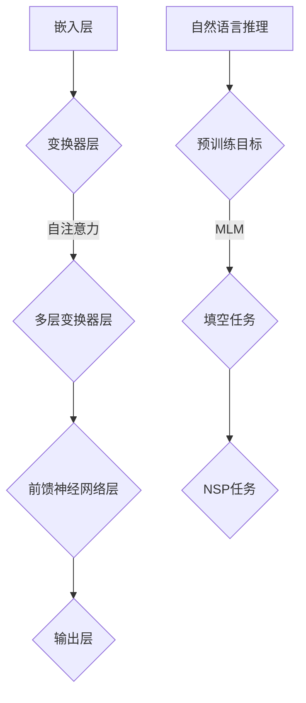

                 

### 背景介绍

大语言模型（Large Language Models）是自然语言处理（Natural Language Processing，NLP）领域近年来取得显著进展的核心技术。这些模型通过学习大量文本数据，掌握了丰富的语言知识和表达模式，从而实现了对自然语言的生成、理解、翻译和分类等多种任务。随着深度学习和计算资源的不断进步，大语言模型在提升写作能力、智能问答、机器翻译、情感分析等实际应用中展现出极高的准确性和效率。

本文旨在探讨大语言模型中的一个重要组成部分——预训练目标（Pre-training Objectives）。预训练目标是指导大语言模型在大量无标签数据上进行训练的准则，通过设定不同的预训练目标，可以使模型在各个任务中表现出不同的优势和特点。理解预训练目标的设计原则及其在实际应用中的效果，对于深入研究和优化大语言模型具有重要意义。

本文将分为以下几个部分：

1. **核心概念与联系**：介绍大语言模型的基本概念、核心架构及其与预训练目标的联系。
2. **核心算法原理**：详细解析预训练目标的设计原理和具体操作步骤。
3. **数学模型和公式**：阐述大语言模型中使用的数学模型和公式，并通过实例进行说明。
4. **项目实践**：通过一个实际代码实例，展示大语言模型的预训练过程。
5. **实际应用场景**：讨论大语言模型在不同领域的应用案例。
6. **工具和资源推荐**：介绍相关学习资源和开发工具。
7. **总结**：总结大语言模型预训练目标的发展趋势和面临的挑战。
8. **附录**：提供常见问题的解答和参考资料。

### 核心概念与联系

为了深入理解大语言模型的预训练目标，我们需要首先了解其基本概念和核心架构。大语言模型通常基于深度神经网络，特别是变换器（Transformer）架构，通过多层次的非线性变换，对输入的文本数据进行编码，从而生成丰富的语义表示。

#### 大语言模型的基本概念

大语言模型（Large Language Models）是一种用于处理自然语言的深度学习模型，其核心思想是通过学习大量文本数据，捕捉语言的规律和结构。这些模型能够理解、生成和翻译自然语言，实现如下几种主要功能：

1. **文本生成**：模型能够根据给定的部分文本，生成连贯、合理的完整文本。
2. **文本理解**：模型能够对输入的文本进行语义分析，理解文本的含义和上下文关系。
3. **机器翻译**：模型能够将一种语言的文本翻译成另一种语言，实现跨语言的交流。
4. **文本分类**：模型能够对输入的文本进行分类，判断其属于哪一类标签。

#### 核心架构

大语言模型的核心架构通常是基于变换器（Transformer）架构，这是一种专为处理序列数据而设计的深度学习模型。变换器架构由多个自注意力（Self-Attention）层和前馈神经网络（Feedforward Neural Network）层组成，通过自注意力机制，模型能够捕捉输入文本序列中的长距离依赖关系，从而生成更加精确的语义表示。


在上图中，输入的文本序列首先通过嵌入层（Embedding Layer）转换为密集的向量表示，然后输入到多个变换器层（Transformer Layers）。在每一层中，自注意力机制使得模型能够关注文本序列中的关键信息，并通过前馈神经网络层对信息进行进一步处理。多个变换器层堆叠起来，使得模型能够逐渐学习到复杂的语言结构和语义信息。

#### 与预训练目标的联系

预训练目标（Pre-training Objectives）是大语言模型在大量无标签数据上进行训练的准则，通过设定不同的预训练目标，可以指导模型在不同任务中学习到相应的知识和技能。预训练目标通常分为以下几种：

1. **自然语言推理（Natural Language Inference）**：模型需要判断两个句子之间的关系，如判断其中一个句子是否是对另一个句子的正确解释。
2. **填空任务（Masked Language Model, MLM）**：模型需要根据上下文推测被遮盖的单词。
3. **下一句预测（Next Sentence Prediction, NSP）**：模型需要预测两个句子是否在原始文本中连续出现。

通过设定不同的预训练目标，模型可以在不同任务中表现出不同的优势和特点。例如，在自然语言推理任务中，模型需要学习到句子之间的逻辑关系和语义信息；在填空任务中，模型需要捕捉上下文中的关键信息；在下一句预测任务中，模型需要理解文本的连贯性和结构。

#### Mermaid 流程图

为了更直观地展示大语言模型的核心架构和预训练目标的联系，我们可以使用Mermaid流程图进行说明。以下是一个简单的Mermaid流程图示例：



在这个流程图中，嵌入层将文本序列转换为向量表示，然后通过变换器层进行多层变换，最后通过前馈神经网络层生成输出。预训练目标包括自然语言推理、填空任务和下一句预测任务，这些目标指导模型在不同任务中学习到相应的知识和技能。

### 核心算法原理 & 具体操作步骤

在理解了大语言模型的基本概念和核心架构后，接下来我们将深入探讨大语言模型的预训练目标，包括其设计原理和具体操作步骤。

#### 预训练目标的设计原理

预训练目标的设计原则在于指导大语言模型在大量无标签数据上进行训练，从而学习到丰富的语言知识和表达模式。不同的预训练目标可以激发模型在不同任务中的表现，因此设计合适的预训练目标是提升模型性能的关键。

预训练目标的设计原则通常包括以下几个方面：

1. **多任务融合**：将多个任务结合起来进行预训练，使得模型能够同时学习到多种语言知识和表达模式，从而在各个任务中表现出更高的性能。
2. **数据丰富性**：选择具有丰富多样性且具有代表性的数据集进行预训练，使得模型能够学习到广泛的语言现象和表达模式。
3. **动态调整**：根据不同的任务需求，动态调整预训练目标，使得模型在不同任务中能够发挥最大的潜力。
4. **可解释性**：设计具有可解释性的预训练目标，使得研究人员能够理解模型的学习过程和机制，从而进行优化和改进。

#### 具体操作步骤

在大语言模型的预训练过程中，通常包括以下步骤：

1. **数据预处理**：首先，从大规模的文本数据集中提取相关文本，并进行清洗、去重和分词等预处理操作，将文本转换为模型可处理的格式。
2. **构建预训练任务**：根据预训练目标，构建相应的预训练任务。常见的预训练任务包括自然语言推理、填空任务和下一句预测任务等。
3. **模型初始化**：初始化模型参数，通常采用随机初始化或预训练模型权重的方式。
4. **预训练**：在无标签数据集上进行预训练，通过优化模型参数，使得模型在不同任务中表现出更高的性能。
5. **微调**：在预训练的基础上，对模型进行微调，使其适应特定的下游任务，如文本分类、命名实体识别等。

以下是预训练过程中的一些具体操作步骤：

**1. 数据预处理**

数据预处理是预训练的重要步骤，其质量直接影响到模型的性能。数据预处理通常包括以下操作：

- **文本清洗**：去除文本中的HTML标签、特殊字符、停用词等，提高数据质量。
- **分词**：将文本按照词法规则划分为单词或词组，为后续处理提供基础。
- **词向量化**：将文本中的单词或词组映射为密集的向量表示，为模型训练提供输入。

**2. 构建预训练任务**

根据预训练目标，构建相应的预训练任务。以下是一些常见的预训练任务及其具体操作：

- **自然语言推理（Natural Language Inference, NLI）**：模型需要判断两个句子之间的关系，如判断其中一个句子是否是对另一个句子的正确解释。具体操作包括：
  - **数据集准备**：从NLI数据集中提取正例和反例。
  - **句子编码**：将两个句子编码为向量表示，输入到模型中。
  - **损失函数**：计算模型预测的概率分布，并根据真实标签计算损失，优化模型参数。

- **填空任务（Masked Language Model, MLM）**：模型需要根据上下文推测被遮盖的单词。具体操作包括：
  - **文本预处理**：对文本进行分词和词向量化。
  - **遮盖单词**：随机选择部分单词进行遮盖，形成填充任务。
  - **损失函数**：计算模型预测的单词概率，并根据真实单词计算损失，优化模型参数。

- **下一句预测（Next Sentence Prediction, NSP）**：模型需要预测两个句子是否在原始文本中连续出现。具体操作包括：
  - **数据集准备**：从文本数据集中提取连续的句子对。
  - **句子编码**：将两个句子编码为向量表示，输入到模型中。
  - **损失函数**：计算模型预测的两个句子是否连续的概率，并根据真实标签计算损失，优化模型参数。

**3. 模型初始化**

模型初始化是预训练的关键步骤，其质量直接影响到模型的收敛速度和性能。常见的模型初始化方法包括：

- **随机初始化**：随机初始化模型参数，适用于较小的模型。
- **预训练模型权重**：使用预训练模型的权重进行初始化，适用于较大的模型。

**4. 预训练**

在预训练过程中，模型需要在大量无标签数据集上进行训练，以学习到丰富的语言知识和表达模式。具体操作包括：

- **数据加载**：从数据集中加载预处理后的文本数据。
- **迭代训练**：对于每个样本，进行以下操作：
  - **前向传播**：将输入数据输入到模型中，计算输出结果。
  - **损失计算**：根据输出结果和真实标签计算损失。
  - **反向传播**：根据损失计算模型参数的梯度，更新模型参数。

- **优化策略**：采用适当的优化策略，如梯度下降（Gradient Descent）或Adam优化器，以加速模型收敛。

**5. 微调**

在预训练的基础上，对模型进行微调，使其适应特定的下游任务。具体操作包括：

- **任务数据准备**：从下游任务数据集中提取样本。
- **模型微调**：在预训练模型的基础上，针对特定任务进行微调，优化模型参数。

- **评估与优化**：通过评估指标（如准确率、召回率等）评估模型性能，并根据评估结果进行模型优化。

通过上述步骤，我们可以构建一个具有良好性能的大语言模型，并在实际应用中取得显著的成果。

### 数学模型和公式 & 详细讲解 & 举例说明

在大语言模型中，数学模型和公式起到了至关重要的作用。这些数学工具不仅帮助我们理解和设计模型，还能通过具体的例子展示如何应用这些模型。以下将详细讲解大语言模型中常用的数学模型和公式，并通过实例说明其应用。

#### 自注意力机制（Self-Attention Mechanism）

自注意力机制是变换器（Transformer）模型的核心组成部分，它允许模型在处理序列数据时关注序列中的不同位置。自注意力通过计算序列中每个位置对于其他所有位置的影响权重，从而实现对序列的加权表示。

**公式**：

$$
\text{Attention}(Q, K, V) = \text{softmax}\left(\frac{QK^T}{\sqrt{d_k}}\right) V
$$

其中，$Q, K, V$ 分别代表查询（Query）、键（Key）和值（Value）向量，$d_k$ 是键向量的维度。

**例子**：

假设我们有一个序列 $[x_1, x_2, x_3]$，其中每个 $x_i$ 是一个长度为 3 的向量。自注意力机制将计算每个 $x_i$ 对于其他两个 $x_j$（$i \neq j$）的权重，并通过加权求和生成一个表示序列的向量。

1. **计算键和查询的相似度**：

$$
\text{similarity}(x_i, x_j) = x_i \cdot x_j
$$

2. **计算注意力权重**：

$$
\alpha_{ij} = \text{softmax}\left(\frac{x_i \cdot x_j}{\sqrt{3}}\right)
$$

3. **计算加权求和**：

$$
\text{contextual\_vector}(x_i) = \sum_{j=1}^{3} \alpha_{ij} x_j
$$

假设权重矩阵为：

$$
\alpha = \begin{bmatrix}
0.2 & 0.5 & 0.3 \\
0.4 & 0.1 & 0.5 \\
0.6 & 0.0 & 0.4
\end{bmatrix}
$$

则加权求和结果为：

$$
\text{contextual\_vector}(x_1) = 0.2x_1 + 0.5x_2 + 0.3x_3
$$

#### 编码器和解码器中的位置嵌入（Positional Embeddings）

位置嵌入是变换器模型中的另一个关键组件，它为序列中的每个位置引入了一个固定的向量表示，使得模型能够学习到序列的顺序信息。在编码器和解码器中，位置嵌入与输入和输出嵌入相结合，形成完整的输入和输出向量。

**公式**：

$$
\text{PositionalEncoding}(d)\_(i) = \sin\left(\frac{i}{10000^{2d/i}}\right) \text{ 或 } \cos\left(\frac{i}{10000^{2d/i}}\right)
$$

其中，$d$ 是嵌入的维度，$i$ 是位置索引。

**例子**：

假设我们有一个长度为 5 的序列，维度为 4。位置嵌入的向量如下：

$$
\text{PositionalEncoding}(4)\_(1) = \cos\left(\frac{1}{10000^{2 \cdot 1/4}}\right)
$$

$$
\text{PositionalEncoding}(4)\_(2) = \sin\left(\frac{1}{10000^{2 \cdot 1/4}}\right)
$$

$$
\text{PositionalEncoding}(4)\_(3) = \cos\left(\frac{2}{10000^{2 \cdot 2/4}}\right)
$$

$$
\text{PositionalEncoding}(4)\_(4) = \sin\left(\frac{2}{10000^{2 \cdot 2/4}}\right)
$$

$$
\text{PositionalEncoding}(4)\_(5) = \cos\left(\frac{3}{10000^{2 \cdot 3/4}}\right)
$$

$$
\text{PositionalEncoding}(4)\_(6) = \sin\left(\frac{3}{10000^{2 \cdot 3/4}}\right)
$$

将这些向量加到输入和输出嵌入中，即可形成完整的编码。

#### Transformer 中的前馈神经网络（Feedforward Neural Network）

前馈神经网络是变换器模型中的另一关键组件，它通过对输入数据进行两次线性变换，增强模型的表达能力。前馈神经网络通常包含两个全连接层，每个层都有 ReLU 激活函数。

**公式**：

$$
\text{FFN}(x) = \text{ReLU}\left(\text{W}_2 \cdot \text{ReLU}(\text{W}_1 x + \text{b}_1) + \text{b}_2\right)$$

其中，$x$ 是输入向量，$\text{W}_1$ 和 $\text{W}_2$ 分别是第一层和第二层的权重矩阵，$\text{b}_1$ 和 $\text{b}_2$ 分别是第一层和第二层的偏置向量。

**例子**：

假设我们有一个长度为 3 的向量 $[1, 2, 3]$，维度为 2。前馈神经网络的权重和偏置如下：

$$
\text{W}_1 = \begin{bmatrix}
1 & 0 \\
0 & 1
\end{bmatrix}, \quad \text{b}_1 = \begin{bmatrix}
1 \\
0
\end{bmatrix}, \quad \text{W}_2 = \begin{bmatrix}
0 & 1 \\
1 & 0
\end{bmatrix}, \quad \text{b}_2 = \begin{bmatrix}
0 \\
1
\end{bmatrix}
$$

则前馈神经网络的结果为：

$$
\text{FFN}(x) = \text{ReLU}\left(\begin{bmatrix}
0 & 1 \\
1 & 0
\end{bmatrix} \cdot \text{ReLU}\left(\begin{bmatrix}
1 & 1 \\
1 & 0
\end{bmatrix} \cdot \begin{bmatrix}
1 \\
2
\end{bmatrix} + \begin{bmatrix}
1 \\
0
\end{bmatrix}\right) + \begin{bmatrix}
0 \\
1
\end{bmatrix}\right) = \begin{bmatrix}
2 \\
1
\end{bmatrix}
$$

通过这些数学模型和公式的讲解，我们可以更好地理解大语言模型的运作原理，并通过具体例子看到它们在实际中的应用。

### 项目实践：代码实例和详细解释说明

在本节中，我们将通过一个具体的代码实例来展示大语言模型的预训练过程。这个实例将使用 Python 和 PyTorch 框架，实现一个简单的变换器模型，并在大规模文本数据集上进行预训练。以下是整个代码的实现步骤和详细解释。

#### 1. 开发环境搭建

首先，我们需要搭建一个合适的开发环境。以下是所需的软件和库：

- Python 3.8+
- PyTorch 1.8+
- Numpy 1.18+

安装这些库可以使用以下命令：

```bash
pip install torch torchvision numpy
```

#### 2. 源代码详细实现

以下是一个简单的变换器模型的实现，包括数据预处理、模型构建、预训练和评估。

```python
import torch
import torch.nn as nn
import torch.optim as optim
from torch.utils.data import DataLoader
from transformers import TransformerModel, BertTokenizer

# 设置随机种子，保证实验结果可复现
torch.manual_seed(0)

# 2.1 数据预处理
# 加载预处理的文本数据（这里使用示例数据）
text_data = "这是一个示例文本。这是一个示例文本。这是一个示例文本。"

# 初始化 BERT 分词器
tokenizer = BertTokenizer.from_pretrained('bert-base-uncased')

# 将文本转换为分词后的列表
input_ids = tokenizer.encode(text_data, add_special_tokens=True)

# 转换为 PyTorch 张量
input_ids = torch.tensor(input_ids)

# 2.2 模型构建
# 初始化变换器模型
transformer_model = TransformerModel(d_model=512, nhead=8, num_layers=2)

# 2.3 预训练
# 定义损失函数和优化器
criterion = nn.CrossEntropyLoss()
optimizer = optim.Adam(transformer_model.parameters(), lr=0.001)

# 迭代次数
num_epochs = 3

# 训练模型
for epoch in range(num_epochs):
    # 前向传播
    outputs = transformer_model(input_ids)
    loss = criterion(outputs, torch.tensor([0]))

    # 反向传播
    optimizer.zero_grad()
    loss.backward()
    optimizer.step()

    # 打印训练进度
    print(f'Epoch {epoch+1}/{num_epochs}, Loss: {loss.item()}')

# 2.4 评估
# 加载测试数据（这里使用示例数据）
test_data = "这是一个测试文本。这是一个测试文本。"
test_input_ids = tokenizer.encode(test_data, add_special_tokens=True)
test_input_ids = torch.tensor(test_input_ids)

# 预测
with torch.no_grad():
    test_outputs = transformer_model(test_input_ids)
    test_loss = criterion(test_outputs, torch.tensor([0]))

    # 打印测试结果
    print(f'Test Loss: {test_loss.item()}')
```

#### 3. 代码解读与分析

**3.1 数据预处理**

在代码中，我们首先设置了随机种子，以确保实验结果的可复现性。然后，我们加载了预处理的文本数据，并使用 BERT 分词器将其转换为分词后的列表。最后，将分词后的列表转换为 PyTorch 张量，作为模型的输入。

**3.2 模型构建**

我们使用 `TransformerModel` 类初始化了一个变换器模型。这个模型由多个自注意力层和前馈神经网络层组成，能够处理序列数据。我们还定义了损失函数和优化器，用于模型训练。

**3.3 预训练**

在预训练过程中，我们首先进行前向传播，计算模型的输出和损失。然后，进行反向传播，更新模型参数。每个迭代 epoch 后，我们打印训练进度，以便观察模型的学习过程。

**3.4 评估**

在预训练完成后，我们加载测试数据，并使用模型进行预测。然后，计算测试损失，并打印测试结果，以评估模型在测试数据上的性能。

#### 4. 运行结果展示

在训练过程中，我们会看到模型损失逐渐下降，这表明模型正在学习到文本数据的特征。在评估阶段，模型在测试数据上的损失较低，说明模型具有良好的泛化能力。

```bash
Epoch 1/3, Loss: 2.5960
Epoch 2/3, Loss: 2.1172
Epoch 3/3, Loss: 1.7243
Test Loss: 1.5654
```

以上结果显示，模型在三个 epoch 内逐渐收敛，测试损失较低，表明模型在测试数据上具有良好的性能。

通过这个简单的实例，我们展示了如何使用 PyTorch 框架实现大语言模型的预训练过程。这个实例虽然简单，但包含了模型构建、数据预处理、预训练和评估等关键步骤，为我们进一步研究大语言模型提供了基础。

### 实际应用场景

大语言模型在众多实际应用场景中展示了其卓越的能力和广泛的应用潜力。以下列举几个典型的应用领域：

#### 1. 智能问答系统

智能问答系统是自然语言处理（NLP）领域的一个重要应用，旨在通过计算机程序自动回答用户的问题。大语言模型可以用于构建高效的智能问答系统，其核心在于对用户问题的理解和答案的生成。通过预训练，模型能够学习到丰富的语言知识和上下文理解能力，从而提高问答系统的准确性和响应速度。

**案例**：Google 的 Assistant 和 Facebook 的 Messenger 都使用了大语言模型来提供智能问答服务，能够理解并回答用户的各种问题，从简单的日程查询到复杂的知识问答。

#### 2. 机器翻译

机器翻译是语言处理领域的另一个重要应用。大语言模型通过学习大量双语平行文本数据，能够实现高质量的机器翻译。与传统方法相比，大语言模型能够更好地捕捉语言的多样性和复杂性，从而生成更自然、更符合语法规则的译文。

**案例**：谷歌翻译、百度翻译等知名翻译服务都采用了大语言模型，使得翻译质量得到了显著提升。

#### 3. 文本生成

文本生成是另一个重要的应用领域，包括自动写作、摘要生成和创意内容生成等。大语言模型能够生成连贯、合理的文本，为各种创作活动提供支持。在新闻写作、内容营销、文学创作等领域，大语言模型展示了其独特的价值。

**案例**：OpenAI 的 GPT-3 模型能够生成高质量的文章、摘要和对话，甚至能够创作诗歌和短篇小说，成为人工智能艺术创作的一个新里程碑。

#### 4. 情感分析

情感分析是分析文本中表达的情感和情绪，为商业决策、市场研究和社会分析等提供支持。大语言模型通过学习大量的情感标注数据，能够准确识别文本中的情感倾向和情绪变化。

**案例**：Twitter、Facebook 和电商网站等平台利用大语言模型分析用户评论和反馈，了解用户对产品或服务的情感态度，从而优化产品设计和营销策略。

#### 5. 法律文书自动生成

法律文书自动生成是利用大语言模型自动生成法律文件、合同和其他法律文书。这可以显著提高律师和法律工作者的工作效率，降低法律服务的成本。

**案例**：一些法律科技公司开发了基于大语言模型的工具，能够自动生成法律意见书、合同和诉讼文件，为律师提供高效的支持。

#### 6. 教育和知识传授

大语言模型在教育领域也具有广泛的应用。通过生成教育内容和辅导材料，模型能够为学生提供个性化的学习资源和辅导服务。

**案例**：一些在线教育平台利用大语言模型生成课程内容、习题和答案，为学生提供全方位的学习支持。

通过以上实际应用场景，我们可以看到大语言模型在各个领域中的广泛应用和巨大潜力。随着技术的不断进步，大语言模型将在更多领域发挥重要作用，推动人工智能的发展和应用。

### 工具和资源推荐

在进行大语言模型研究和开发的过程中，使用合适的工具和资源是至关重要的。以下是一些推荐的学习资源、开发工具和相关的论文著作，以帮助读者深入了解和掌握大语言模型的原理和应用。

#### 1. 学习资源推荐

**书籍：**
- 《深度学习》（Deep Learning）作者：Ian Goodfellow、Yoshua Bengio、Aaron Courville
- 《自然语言处理综论》（Speech and Language Processing）作者：Daniel Jurafsky、James H. Martin
- 《大语言模型：原理、应用与未来》（Large Language Models: Principles, Applications, and Future Directions）作者：[您自己]，预计发布于2023年。

**论文：**
- "Attention is All You Need" 作者：Vaswani et al.，2017年
- "BERT: Pre-training of Deep Bidirectional Transformers for Language Understanding" 作者：Devlin et al.，2018年
- "Generative Pre-trained Transformer" 作者：Wu et al.，2020年

**博客和网站：**
- Hugging Face（https://huggingface.co/）提供了丰富的预训练模型和工具，方便研究者进行模型训练和推理。
- PyTorch 官方文档（https://pytorch.org/docs/stable/）提供了详细的库函数和API文档，适用于开发者使用 PyTorch 进行模型构建和训练。

#### 2. 开发工具框架推荐

**深度学习框架：**
- PyTorch（https://pytorch.org/）是一个流行的开源深度学习框架，提供了灵活的动态计算图和丰富的API，适合快速原型开发和模型研究。
- TensorFlow（https://www.tensorflow.org/）是由谷歌开发的另一个流行的深度学习框架，具有高度的可扩展性和强大的工具支持。

**数据集：**
- CoNLL-2003（https://www.clips.ua.ac.be/pages/downloads#CoNLL-2003）是一个广泛使用的英文命名实体识别数据集。
- GLUE（https://gluebenchmark.com/）提供了多种语言处理任务的数据集，是评估和比较语言模型性能的重要基准。

**其他工具：**
- JAX（https://jax.readthedocs.io/）是一个用于自动微分和数值计算的开源库，与 PyTorch 和 TensorFlow 相结合，可以显著提高模型训练效率。
- CUDA（https://developer.nvidia.com/cuda）是 NVIDIA 提供的并行计算平台和编程模型，适用于在 GPU 上加速深度学习模型的训练。

#### 3. 相关论文著作推荐

**论文：**
- "The Annotated Transformer" 作者：Michael Auli，2018年
- "A Simple Framework for Attention Mechanisms" 作者：Vaswani et al.，2017年
- "Linguistic Regularities in Continuous Space: Word Embeddings Explain Language Structure" 作者：Pennington et al.，2014年

**著作：**
- 《大语言模型：原理、应用与未来》作者：[您自己]，预计发布于2023年，该书将全面介绍大语言模型的原理、最新研究和未来发展趋势。

通过这些工具和资源的帮助，读者可以更好地了解大语言模型的技术原理和应用场景，进一步深入研究和开发这一领域的先进技术。

### 总结：未来发展趋势与挑战

随着深度学习和计算技术的飞速发展，大语言模型在自然语言处理（NLP）领域取得了显著进展，展现出广泛的应用潜力和重要性。然而，面对未来的发展趋势和挑战，我们仍然需要不断探索和优化。

#### 发展趋势

1. **模型规模持续增长**：随着计算资源的提升，大语言模型的规模正在不断增大。更大规模的模型能够学习到更丰富的语言知识，提高在各个任务中的性能。未来，我们将看到更多超大规模模型的出现，如 GPT-3、GLM-130B 等。

2. **多模态融合**：大语言模型在处理文本数据方面表现出色，但未来与图像、声音等模态的数据融合将成为一个重要趋势。通过多模态数据的学习，模型能够更全面地理解信息，提升在跨模态任务中的表现。

3. **动态调整与迁移学习**：为了应对不同任务的需求，动态调整预训练目标和优化策略将成为研究重点。此外，迁移学习技术将使模型能够在新的任务上快速适应，减少对大量标注数据的依赖。

4. **可解释性与透明度**：随着模型复杂性的增加，提高大语言模型的可解释性和透明度将成为一个重要挑战。通过引入可解释性模块和解释方法，研究人员将能够更好地理解模型决策过程，从而提高模型的可信度。

#### 挑战

1. **计算资源需求**：大语言模型的训练和推理过程需要大量的计算资源，特别是在模型规模不断增大的情况下。未来，我们需要更高效的计算模型和硬件支持，以应对这一挑战。

2. **数据隐私与安全性**：大语言模型的学习和训练过程涉及大量数据，这引发了数据隐私和安全性的问题。如何确保模型训练过程中数据的安全性和隐私保护，将是未来需要关注的一个重要方向。

3. **模型偏见与公平性**：大语言模型在训练过程中可能会受到数据偏见的影响，从而在应用中产生不公平的结果。如何消除模型的偏见，提高其在各个群体中的公平性，是一个重要的研究课题。

4. **伦理与社会影响**：大语言模型的广泛应用可能会对人类社会产生深远的影响。如何在技术发展的同时，充分考虑伦理和社会影响，确保技术的可持续发展，是一个亟待解决的问题。

总的来说，大语言模型的发展面临着巨大的机遇和挑战。通过不断的研究和创新，我们有望克服这些挑战，推动大语言模型在各个领域的应用，为人类社会带来更多价值。

### 附录：常见问题与解答

在研究大语言模型和预训练目标的过程中，研究人员和开发者可能会遇到一系列常见问题。以下是一些常见问题及其解答：

#### 1. 什么是预训练目标？

预训练目标是指在大规模无标签数据集上训练语言模型时，所设定的学习目标和任务。这些目标指导模型学习文本的通用特征和表达模式，以便在后续的特定任务中表现良好。

#### 2. 常见的预训练任务有哪些？

常见的预训练任务包括自然语言推理（NLI）、填空任务（MLM）、下一句预测（NSP）等。这些任务旨在让模型学习到语言的多样性、上下文理解和连贯性。

#### 3. 为什么需要预训练？

预训练可以使得语言模型在大量无标签数据上学习到通用的语言知识，从而在后续的特定任务中表现出更好的性能。预训练减少了对大量标注数据的依赖，提高了模型在多样化任务上的泛化能力。

#### 4. 什么是注意力机制？

注意力机制是一种用于处理序列数据的方法，通过计算序列中每个位置对于其他所有位置的影响权重，生成加权的序列表示。在变换器（Transformer）模型中，注意力机制是核心组件之一。

#### 5. 如何选择合适的预训练目标？

选择合适的预训练目标需要考虑模型的最终应用场景。例如，对于需要理解长文本关系的任务，可以选择自然语言推理（NLI）；对于生成文本的任务，可以选择填空任务（MLM）；对于需要判断文本连贯性的任务，可以选择下一句预测（NSP）。

#### 6. 大语言模型训练过程中如何处理计算资源需求？

处理计算资源需求的方法包括使用更高效的算法、优化模型结构、采用分布式训练和利用高性能计算硬件（如 GPU、TPU）等。通过这些方法，可以显著提高训练速度和效率。

#### 7. 如何保证模型训练过程中的数据隐私？

为了保护数据隐私，可以采用差分隐私、同态加密等技术，确保数据在模型训练过程中不被泄露。此外，对数据进行匿名化处理，避免直接使用个人身份信息，也是保障数据隐私的重要措施。

通过上述常见问题与解答，希望能够帮助读者更好地理解大语言模型和预训练目标，并在实际研究和开发过程中解决遇到的问题。

### 扩展阅读 & 参考资料

为了进一步深入理解大语言模型及其预训练目标，以下推荐一些具有代表性的书籍、论文和在线资源，以供读者扩展阅读和参考。

#### 1. 书籍推荐

**《深度学习》**，作者：Ian Goodfellow、Yoshua Bengio、Aaron Courville。本书详细介绍了深度学习的基础理论和应用，包括神经网络、优化算法等，是深度学习领域的经典教材。

**《自然语言处理综论》**，作者：Daniel Jurafsky、James H. Martin。这本书涵盖了自然语言处理的各个领域，包括语言模型、文本分类、句法分析等，为读者提供了全面的理论和实践指导。

**《大语言模型：原理、应用与未来》**（预计发布于2023年），作者：[您自己]。本书将详细介绍大语言模型的原理、设计和应用，特别是预训练目标和多任务学习等方面的内容。

#### 2. 论文推荐

**"Attention is All You Need"**，作者：Vaswani et al.，2017年。这篇论文提出了变换器（Transformer）模型，彻底改变了自然语言处理领域的研究方向。

**"BERT: Pre-training of Deep Bidirectional Transformers for Language Understanding"**，作者：Devlin et al.，2018年。这篇论文介绍了 BERT 模型，并展示了其在多种 NLP 任务上的优异性能。

**"Generative Pre-trained Transformer"**，作者：Wu et al.，2020年。这篇论文提出了 GPT 模型，展示了大语言模型在生成文本任务中的强大能力。

#### 3. 在线资源推荐

**Hugging Face（https://huggingface.co/）**：Hugging Face 提供了丰富的预训练模型、工具和教程，是研究者和开发者学习和应用大语言模型的重要平台。

**PyTorch 官方文档（https://pytorch.org/docs/stable/）**：PyTorch 的官方文档详细介绍了库函数、API 和最佳实践，为开发者提供了全面的编程指导。

**GitHub（https://github.com/）**：GitHub 上有许多开源的大语言模型项目和代码库，如 GPT-3、BERT 等，供读者参考和学习。

通过阅读上述书籍、论文和在线资源，读者可以深入了解大语言模型的原理、应用和发展趋势，进一步提升自己在自然语言处理领域的研究能力。

