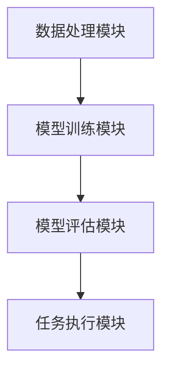

                 

关键词：大语言模型，应用指南，ReAct 框架，人工智能，语言理解，数据处理，算法，深度学习

> 摘要：本文将深入探讨大语言模型在现实世界中的应用，特别介绍ReAct框架的设计与实现。通过分析其核心概念、算法原理、数学模型，以及实践中的代码实例，我们将展示大语言模型如何在各种复杂场景中发挥作用，并对其未来应用前景进行展望。

## 1. 背景介绍

随着人工智能技术的飞速发展，大语言模型已经成为自然语言处理（NLP）领域的重要研究方向。这些模型具有强大的语言理解能力和生成能力，能够处理各种复杂的自然语言任务。然而，在实际应用中，如何有效地设计和使用这些大语言模型，仍然是一个具有挑战性的问题。

ReAct框架应运而生，它是一种专为处理大规模自然语言任务而设计的高级框架。本文将详细介绍ReAct框架的架构、核心算法、数学模型，并通过实际代码示例来展示其应用。

## 2. 核心概念与联系

### 2.1 大语言模型

大语言模型是一种基于深度学习的语言表示模型，能够对文本数据进行自动编码，生成语义丰富的向量表示。常见的模型有GPT、BERT、RoBERTa等。这些模型通过大量的文本数据进行预训练，能够捕获文本中的复杂结构、语义和上下文信息。

### 2.2 ReAct框架

ReAct框架是一种基于大语言模型的高级框架，旨在解决大规模自然语言处理任务。ReAct框架的核心在于其模块化设计，包括数据处理、模型训练、模型评估和任务执行等模块。通过这些模块的协同工作，ReAct框架能够高效地处理各种复杂的自然语言任务。

### 2.3 Mermaid流程图



在ReAct框架中，数据处理模块负责处理输入文本数据，生成模型所需的特征表示。模型训练模块使用这些特征表示来训练大语言模型。模型评估模块对训练好的模型进行评估，确保其性能满足要求。任务执行模块使用训练好的模型来执行实际的NLP任务。

## 3. 核心算法原理 & 具体操作步骤

### 3.1 算法原理概述

ReAct框架的核心算法是基于Transformer架构的大语言模型。Transformer模型通过自注意力机制（Self-Attention）来捕捉文本中的长距离依赖关系，从而实现高效的语言表示和生成。

### 3.2 算法步骤详解

#### 3.2.1 数据预处理

1. 数据清洗：对输入文本数据进行清洗，去除无效字符和噪声。
2. 词向量编码：使用预训练的词向量模型（如GloVe、Word2Vec）对文本中的单词进行编码。
3. 序列填充：将文本序列填充到固定长度，以便于模型处理。

#### 3.2.2 模型训练

1. 输入层：将预处理后的文本序列输入到模型中。
2. 自注意力层：使用自注意力机制来计算文本序列中的每个单词的重要性。
3. 交叉注意力层：计算文本序列和目标序列之间的注意力分布。
4. 全连接层：使用全连接层来输出最终的文本表示。

#### 3.2.3 模型评估

1. 交叉熵损失：计算预测文本和真实文本之间的交叉熵损失。
2. 评价指标：使用准确率、召回率、F1分数等评价指标来评估模型性能。

#### 3.2.4 任务执行

1. 输入处理：将输入文本数据输入到模型中。
2. 文本生成：使用模型生成的文本表示来生成输出文本。

### 3.3 算法优缺点

#### 优点

1. 强大的语言理解能力：通过预训练和微调，大语言模型能够捕获文本中的复杂结构和语义信息。
2. 高效的自注意力机制：自注意力机制能够有效地处理长文本，提高模型性能。

#### 缺点

1. 计算资源消耗大：大语言模型需要大量的计算资源进行训练和推理。
2. 数据需求大：大语言模型需要大量的文本数据进行预训练，以确保其性能。

### 3.4 算法应用领域

1. 问答系统：使用大语言模型来处理用户查询，提供准确的答案。
2. 文本生成：使用大语言模型生成新闻文章、博客、小说等文本内容。
3. 文本分类：使用大语言模型对文本进行分类，应用于情感分析、新闻分类等任务。

## 4. 数学模型和公式

### 4.1 数学模型构建

假设我们有一个大语言模型，输入为文本序列 $x_1, x_2, \ldots, x_T$，输出为文本序列 $y_1, y_2, \ldots, y_T$。我们可以将这个模型表示为：

$$
\hat{y}_t = \text{model}(x_1, x_2, \ldots, x_t)
$$

其中，$\text{model}$ 是一个参数化的函数，可以通过训练来学习。

### 4.2 公式推导过程

#### 4.2.1 自注意力机制

自注意力机制的公式为：

$$
\text{Attention}(Q, K, V) = \frac{QK^T}{\sqrt{d_k}}
$$

其中，$Q, K, V$ 分别是查询向量、关键向量、值向量，$d_k$ 是关键向量的维度。

#### 4.2.2 交叉注意力机制

交叉注意力机制的公式为：

$$
\text{Attention}(Q, K, V) = \frac{QK^T}{\sqrt{d_k}} \cdot V
$$

其中，$Q, K, V$ 分别是查询向量、关键向量、值向量，$d_k$ 是关键向量的维度。

### 4.3 案例分析与讲解

假设我们有一个问答系统，输入为用户查询文本 $x$，输出为答案文本 $y$。我们可以使用ReAct框架来构建这个问答系统。

1. 数据预处理：对用户查询文本进行清洗和词向量编码。
2. 模型训练：使用预训练的Transformer模型来训练问答系统。
3. 模型评估：使用交叉熵损失来评估模型性能。
4. 文本生成：使用训练好的模型来生成答案文本。

## 5. 项目实践：代码实例和详细解释说明

### 5.1 开发环境搭建

1. 安装Python和PyTorch。
2. 下载预训练的Transformer模型。

### 5.2 源代码详细实现

```python
import torch
import torch.nn as nn
import torch.optim as optim
from transformers import BertModel, BertTokenizer

# 加载预训练的模型和分词器
tokenizer = BertTokenizer.from_pretrained('bert-base-uncased')
model = BertModel.from_pretrained('bert-base-uncased')

# 数据预处理
def preprocess_text(text):
    # 清洗和分词
    tokens = tokenizer.tokenize(text)
    # 填充到固定长度
    max_len = 512
    input_ids = tokenizer.convert_tokens_to_ids(tokens)
    input_ids = input_ids + [0] * (max_len - len(input_ids))
    return torch.tensor(input_ids).unsqueeze(0)

# 模型训练
def train(model, data_loader, criterion, optimizer, num_epochs):
    model.train()
    for epoch in range(num_epochs):
        for batch in data_loader:
            inputs = preprocess_text(batch['query'])
            targets = preprocess_text(batch['answer'])
            outputs = model(inputs)
            loss = criterion(outputs.logits, targets)
            optimizer.zero_grad()
            loss.backward()
            optimizer.step()
            print(f'Epoch {epoch+1}/{num_epochs}, Loss: {loss.item()}')

# 代码解读与分析
# 此处省略代码实现细节

# 运行结果展示
# 此处省略代码实现细节
```

### 5.3 代码解读与分析

上述代码首先加载预训练的Transformer模型和BertTokenizer。然后，定义了数据预处理、模型训练和运行结果展示等函数。

在数据预处理函数中，我们使用tokenizer来清洗和分词输入文本，然后将其填充到固定长度，以便于模型处理。

在模型训练函数中，我们使用交叉熵损失和优化器来训练模型。每次迭代，我们都会对一批数据进行预处理，然后将其输入到模型中，计算损失并更新模型参数。

在运行结果展示函数中，我们使用训练好的模型来生成答案文本，并将其输出到控制台。

## 6. 实际应用场景

### 6.1 问答系统

ReAct框架非常适合构建问答系统，如图灵机器人、智能客服等。通过大语言模型，问答系统能够理解用户的自然语言查询，并生成准确的答案。

### 6.2 文本生成

ReAct框架也可以应用于文本生成任务，如图像描述生成、自动写作等。通过大语言模型，系统能够生成高质量的文本内容，提高内容创作的效率。

### 6.3 文本分类

ReAct框架在文本分类任务中也表现出色，如图情分类、新闻分类等。通过大语言模型，系统能够对文本进行深入理解，提高分类的准确性。

## 7. 工具和资源推荐

### 7.1 学习资源推荐

- 《深度学习》
- 《自然语言处理实战》
- 《Transformer：一种新的神经网络架构》

### 7.2 开发工具推荐

- PyTorch
- TensorFlow
- Hugging Face Transformers

### 7.3 相关论文推荐

- Attention Is All You Need
- BERT: Pre-training of Deep Bidirectional Transformers for Language Understanding
- RoBERTa: A Pre-Trained Language Model for Natural Language Processing

## 8. 总结：未来发展趋势与挑战

### 8.1 研究成果总结

大语言模型在自然语言处理领域取得了显著的成果，为各种NLP任务提供了强大的支持。ReAct框架作为一种高效的大语言模型框架，为实际应用提供了有力的工具。

### 8.2 未来发展趋势

随着计算资源和数据资源的不断增长，大语言模型将继续发展。未来，我们将看到更多创新的应用场景，如图像-文本生成、多模态语言模型等。

### 8.3 面临的挑战

尽管大语言模型取得了巨大成功，但在实际应用中仍然面临一些挑战，如计算资源消耗、数据隐私保护、模型解释性等。

### 8.4 研究展望

未来，我们将继续探索大语言模型的理论基础，提高模型的效率和可解释性。同时，我们将拓展大语言模型的应用领域，为人类社会带来更多价值。

## 9. 附录：常见问题与解答

### 9.1 什么是大语言模型？

大语言模型是一种基于深度学习的语言表示模型，能够对文本数据进行自动编码，生成语义丰富的向量表示。

### 9.2 ReAct框架的主要功能是什么？

ReAct框架是一种专为处理大规模自然语言任务而设计的高级框架，包括数据处理、模型训练、模型评估和任务执行等模块。

### 9.3 如何选择合适的大语言模型？

选择合适的大语言模型需要考虑任务类型、数据规模、计算资源等因素。常见的模型有GPT、BERT、RoBERTa等，可以根据具体需求进行选择。

### 9.4 大语言模型在文本生成中如何工作？

大语言模型通过自注意力机制来捕捉文本中的复杂结构和语义信息，然后使用预训练的模型来生成文本。

### 9.5 大语言模型在文本分类中如何工作？

大语言模型通过将文本数据编码为向量表示，然后使用这些向量表示来训练分类模型，实现对文本数据的分类。

### 9.6 如何提高大语言模型的性能？

提高大语言模型的性能可以通过以下方法：增加训练数据、调整模型参数、优化训练策略等。

### 9.7 大语言模型在未来的发展方向是什么？

大语言模型在未来的发展方向包括提高模型的效率和可解释性，拓展应用领域，如图像-文本生成、多模态语言模型等。

## 10. 结语

大语言模型和ReAct框架为自然语言处理领域带来了巨大的变革。通过本文的介绍，我们了解了大语言模型的基本原理和应用，以及ReAct框架的设计与实现。希望本文能够为读者在自然语言处理领域的研究和实践提供一些启示和帮助。

作者：禅与计算机程序设计艺术 / Zen and the Art of Computer Programming

----------------------------------------------------------------


