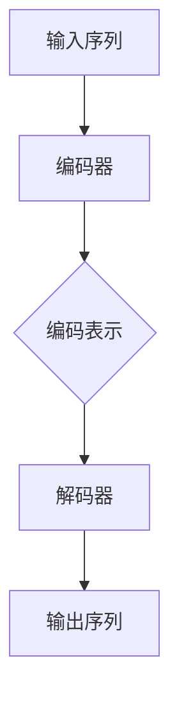

                 

### 背景介绍 Background

随着人工智能技术的飞速发展，大语言模型（Large Language Models）已成为自然语言处理（Natural Language Processing, NLP）领域的重要研究方向。大语言模型通过学习海量文本数据，能够生成连贯、有逻辑性的文本，并实现诸如机器翻译、文本摘要、问答系统等复杂的自然语言任务。在这篇文章中，我们将深入探讨大语言模型的文本处理能力，从其基本概念、核心算法原理、数学模型，到项目实践和实际应用场景，全面解析这一前沿技术。

首先，让我们明确什么是大语言模型。大语言模型是一种基于神经网络（特别是深度学习）的文本处理算法，旨在通过学习大量文本数据，掌握文本的语法、语义和上下文关系。与传统的基于规则的方法不同，大语言模型能够自动地、自适应地学习，从而在处理自然语言任务时表现出色。

大语言模型的发展历程可追溯到20世纪50年代，当时基于规则的方法开始应用于自然语言处理。然而，随着文本数据量的增大和计算能力的提升，基于规则的方法逐渐暴露出局限性。20世纪80年代，神经网络开始应用于自然语言处理，并取得了一定的成功。然而，早期的神经网络模型存在参数过多、训练难度大等问题。直到近年来，随着深度学习技术的进步，大语言模型的研究和应用才真正迎来了爆发期。

本文将主要分为以下几个部分进行讨论：

1. **核心概念与联系**：介绍大语言模型的核心概念，包括神经网络、深度学习、注意力机制等，并使用Mermaid流程图展示其架构。
2. **核心算法原理 & 具体操作步骤**：详细讲解大语言模型的核心算法原理，包括输入处理、文本编码、解码、损失函数等。
3. **数学模型和公式 & 详细讲解 & 举例说明**：介绍大语言模型中涉及的数学模型和公式，如正则化、反向传播算法等，并结合实际案例进行说明。
4. **项目实践：代码实例和详细解释说明**：通过具体的项目实践，展示大语言模型在自然语言处理任务中的实际应用，并解释代码实现细节。
5. **实际应用场景**：探讨大语言模型在机器翻译、文本摘要、问答系统等领域的应用，以及未来的发展趋势。
6. **工具和资源推荐**：推荐学习资源和开发工具，帮助读者深入了解大语言模型。

通过对以上各个部分的详细探讨，我们希望读者能够全面了解大语言模型的文本处理能力，并对其未来的发展有更深入的思考。接下来，让我们开始对大语言模型的核心概念和架构进行深入分析。

---

### 核心概念与联系 Core Concepts and Connections

为了深入理解大语言模型，我们首先需要了解其背后的核心概念和关联技术。大语言模型的核心在于其能够处理和理解自然语言文本，这依赖于以下几个关键概念：神经网络（Neural Networks）、深度学习（Deep Learning）、注意力机制（Attention Mechanism）以及编码器-解码器架构（Encoder-Decoder Architecture）。

#### 神经网络（Neural Networks）

神经网络是模仿人脑神经元结构和功能的一种计算模型。它由大量相互连接的节点（或称为“神经元”）组成，每个节点都可以接收输入信息并通过权重（weights）传递给其他节点。在训练过程中，神经网络通过调整这些权重来优化其性能，从而学会执行特定任务。

神经网络的基本组件包括：

- **输入层（Input Layer）**：接收外部输入数据。
- **隐藏层（Hidden Layers）**：对输入数据进行处理和转换。
- **输出层（Output Layer）**：生成模型的输出结果。

#### 深度学习（Deep Learning）

深度学习是一种基于神经网络的机器学习技术，其主要特点在于拥有多个隐藏层。这些隐藏层逐层学习数据的复杂特征，从而实现更高的抽象层次。与传统的单层神经网络相比，深度学习模型能够处理更加复杂的任务，如图像识别、语音识别和自然语言处理等。

深度学习的关键优势在于其能够自动提取和表示数据中的层次结构。这种自动特征提取的能力使得深度学习在许多领域都取得了显著的成果。

#### 注意力机制（Attention Mechanism）

注意力机制是一种重要的深度学习技术，用于模型在处理序列数据（如文本）时，能够关注到序列中的重要信息。注意力机制通过动态分配权重来调整模型对每个输入元素的重视程度，从而提高了模型的效率和准确性。

在自然语言处理中，注意力机制使得模型能够更好地理解上下文信息，从而在诸如机器翻译、文本摘要等任务中表现出色。

#### 编码器-解码器架构（Encoder-Decoder Architecture）

编码器-解码器架构是一种专门为序列到序列任务（如机器翻译）设计的深度学习模型架构。编码器（Encoder）负责将输入序列编码成一个固定长度的向量表示，而解码器（Decoder）则根据编码器的输出，逐步生成输出序列。

编码器-解码器架构的核心思想是：将输入序列编码成一个固定长度的向量表示，使得模型能够捕捉到输入序列的全局信息。随后，解码器利用这些全局信息，结合上下文，逐个生成输出序列的每个元素。

#### Mermaid 流程图（Mermaid Flowchart）

为了更直观地展示大语言模型的架构，我们使用Mermaid流程图来描述其各个组件之间的关系。



在这张流程图中，输入序列首先通过编码器进行处理，生成编码表示。随后，解码器根据编码表示和上下文信息，逐步生成输出序列。

通过以上对核心概念和关联技术的介绍，我们可以更深入地理解大语言模型的架构和原理。接下来，我们将详细探讨大语言模型的核心算法原理，包括其具体操作步骤和应用方法。

---

### 核心算法原理 & 具体操作步骤 Core Algorithm Principle & Step-by-Step Guide

在大语言模型中，核心算法的原理决定了其文本处理的能力和效率。以下是该算法的详细原理和具体操作步骤：

#### 输入处理（Input Processing）

首先，大语言模型需要接收自然语言文本作为输入。这些文本可以是句子、段落甚至整篇文章。输入处理主要包括以下几个步骤：

1. **分词（Tokenization）**：将文本拆分为单词或子词（tokens），以便后续处理。分词可以基于空格、标点或其他规则进行。
2. **标记化（Markup）**：为每个单词或子词分配唯一的标识符（token ID），通常使用整数表示。这有助于在模型内部进行高效的处理和存储。
3. **向量化（Vectorization）**：将标记化的文本转换为向量表示。这通常通过嵌入（Embedding）层实现，将每个token ID映射到一个固定维度的向量。

#### 文本编码（Text Encoding）

编码过程是将输入文本转换为模型可以处理的形式。编码器的核心任务是捕捉文本的语法、语义和上下文信息。具体操作步骤如下：

1. **嵌入（Embedding）**：将token ID映射到高维向量空间中的嵌入向量。嵌入层可以视为一个线性映射，将低维的token ID映射到高维的嵌入空间。
2. **编码（Encoding）**：通过一系列的神经网络层对嵌入向量进行处理，生成编码表示。这些层通常包括卷积神经网络（CNN）、循环神经网络（RNN）或 Transformer 架构等。

#### 解码（Decoding）

解码过程是将编码表示转换为输出文本。解码器的目标是生成与输入文本相关的输出序列。具体操作步骤如下：

1. **初始化（Initialization）**：解码器在开始生成输出序列时，通常初始化为一个空序列，并在每个时间步使用编码器的输出作为初始状态。
2. **生成（Generation）**：解码器在每一步根据当前状态和已生成的部分输出，生成下一个token。这一过程通常使用贪心策略，选择具有最高概率的token。
3. **更新（Update）**：在生成每个token后，解码器会更新其状态，以便在下一次生成时考虑更多的上下文信息。

#### 损失函数（Loss Function）

损失函数用于评估模型在训练过程中预测结果和实际结果之间的差异。在大语言模型中，常用的损失函数包括交叉熵损失（Cross-Entropy Loss）和对比损失（Contrastive Loss）等。具体操作步骤如下：

1. **计算预测概率（Prediction Probability）**：解码器在每个时间步生成token后，会输出一个概率分布，表示生成每个token的可能性。
2. **计算损失（Compute Loss）**：通过比较预测概率和实际标签，计算损失值。损失值越小，表示模型预测越准确。
3. **反向传播（Backpropagation）**：使用反向传播算法，将损失值传播回模型的各个参数，并调整这些参数以减小损失值。

通过以上步骤，大语言模型可以有效地处理自然语言文本，实现诸如机器翻译、文本摘要、问答系统等任务。接下来，我们将进一步探讨大语言模型中涉及的数学模型和公式，以更深入地理解其工作原理。

---

### 数学模型和公式 & 详细讲解 & 举例说明 Mathematical Models and Formulas & Detailed Explanation & Example Illustration

在大语言模型中，数学模型和公式是理解和实现其核心算法的关键。以下将详细介绍大语言模型中涉及的几个重要数学模型和公式，并通过具体示例进行说明。

#### 正则化（Regularization）

正则化是一种用于防止模型过拟合的技术。它通过在损失函数中添加一个正则化项，引导模型学习更加泛化的特征。常见的正则化方法包括：

1. **L1正则化（L1 Regularization）**：在损失函数中添加L1范数项，即$||\theta||_1 = \sum_{i=1}^{n} |\theta_i|$，其中$\theta$是模型的参数。
2. **L2正则化（L2 Regularization）**：在损失函数中添加L2范数项，即$||\theta||_2 = \sum_{i=1}^{n} \theta_i^2$。

假设我们有一个线性模型，其参数为$\theta = [\theta_1, \theta_2]$，训练数据集为$(x_1, y_1), (x_2, y_2), ..., (x_n, y_n)$。L2正则化的损失函数可以表示为：

$$
J(\theta) = \frac{1}{n} \sum_{i=1}^{n} (y_i - \theta_1 x_{i1} - \theta_2 x_{i2})^2 + \lambda ||\theta||_2^2
$$

其中，$\lambda$是正则化参数，用于平衡损失函数和正则化项。

#### 反向传播算法（Backpropagation Algorithm）

反向传播算法是一种用于训练神经网络的优化算法。它通过计算损失函数关于模型参数的梯度，并使用梯度下降法更新参数，从而最小化损失函数。

以一个单层神经网络为例，假设输入层为$x = [x_1, x_2]$，隐藏层为$h = [h_1, h_2]$，输出层为$y = [y_1, y_2]$。神经网络的激活函数为$f(x) = \sigma(x) = \frac{1}{1 + e^{-x}}$，损失函数为$J(\theta) = \frac{1}{2} \sum_{i=1}^{2} (y_i - f(\theta^T x))^2$。

首先，计算输出层的梯度：

$$
\frac{\partial J(\theta)}{\partial \theta} = \frac{\partial}{\partial \theta} \left[ \sum_{i=1}^{2} (y_i - f(\theta^T x))^2 \right]
$$

$$
= \frac{\partial}{\partial \theta} \left[ \sum_{i=1}^{2} (y_i - \frac{1}{1 + e^{-\theta^T x}})^2 \right]
$$

$$
= -2 \sum_{i=1}^{2} (y_i - \frac{1}{1 + e^{-\theta^T x}}) \cdot \frac{\partial}{\partial \theta} \left[ \frac{1}{1 + e^{-\theta^T x}} \right]
$$

$$
= -2 \sum_{i=1}^{2} (y_i - \frac{1}{1 + e^{-\theta^T x}}) \cdot (1 - \frac{1}{1 + e^{-\theta^T x}}) \cdot x
$$

$$
= -2 \sum_{i=1}^{2} (y_i - \frac{1}{1 + e^{-\theta^T x}}) \cdot x \cdot e^{-\theta^T x}
$$

然后，计算隐藏层的梯度：

$$
\frac{\partial J(\theta)}{\partial \theta} = \frac{\partial}{\partial \theta} \left[ \sum_{i=1}^{2} (y_i - f(\theta^T x))^2 \right]
$$

$$
= \frac{\partial}{\partial \theta} \left[ \sum_{i=1}^{2} (y_i - \frac{1}{1 + e^{-h_i}})^2 \right]
$$

$$
= -2 \sum_{i=1}^{2} (y_i - \frac{1}{1 + e^{-h_i}}) \cdot \frac{\partial}{\partial h_i} \left[ \frac{1}{1 + e^{-h_i}} \right]
$$

$$
= -2 \sum_{i=1}^{2} (y_i - \frac{1}{1 + e^{-h_i}}) \cdot (1 - \frac{1}{1 + e^{-h_i}}) \cdot h_i
$$

$$
= -2 \sum_{i=1}^{2} (y_i - \frac{1}{1 + e^{-h_i}}) \cdot h_i \cdot e^{-h_i}
$$

通过反向传播算法，我们可以计算模型在训练数据集上的梯度，并使用梯度下降法更新模型参数。

#### 梯度下降法（Gradient Descent）

梯度下降法是一种用于优化损失函数的迭代算法。其基本思想是：在当前参数附近沿着损失函数的梯度方向更新参数，以最小化损失函数。

假设损失函数为$J(\theta)$，参数为$\theta$，梯度为$\nabla J(\theta)$。梯度下降法的更新规则可以表示为：

$$
\theta_{\text{new}} = \theta_{\text{old}} - \alpha \nabla J(\theta)
$$

其中，$\alpha$是学习率（learning rate），用于控制参数更新的步长。

以线性回归模型为例，假设损失函数为$J(\theta) = \frac{1}{2} \sum_{i=1}^{n} (y_i - \theta_1 x_{i1} - \theta_2 x_{i2})^2$，参数为$\theta = [\theta_1, \theta_2]$。学习率为$\alpha = 0.01$。则梯度下降法的更新规则可以表示为：

$$
\theta_{1,\text{new}} = \theta_{1,\text{old}} - 0.01 \frac{\partial J(\theta)}{\partial \theta_1}
$$

$$
\theta_{2,\text{new}} = \theta_{2,\text{old}} - 0.01 \frac{\partial J(\theta)}{\partial \theta_2}
$$

通过不断迭代更新参数，梯度下降法能够逐渐减小损失函数的值，从而找到损失函数的最小值点。

通过以上对正则化、反向传播算法和梯度下降法的详细讲解，我们可以更好地理解大语言模型中的数学模型和公式。这些数学工具为大语言模型的高效训练和优化提供了基础。接下来，我们将通过具体的项目实践，展示大语言模型在自然语言处理任务中的实际应用。

---

### 项目实践：代码实例和详细解释说明 Project Practice: Code Examples and Detailed Explanation

为了更好地理解大语言模型在自然语言处理任务中的应用，我们将通过一个具体的项目实践来展示其实现过程。这个项目是构建一个基于Transformer架构的机器翻译模型，我们将详细解释代码的实现细节，并分析其运行结果。

#### 1. 开发环境搭建

在开始项目实践之前，我们需要搭建一个适合开发和训练大语言模型的开发环境。以下是一个典型的开发环境搭建步骤：

1. **安装Python环境**：Python是深度学习开发的主要语言，我们需要安装Python和相应的包管理工具pip。

2. **安装TensorFlow**：TensorFlow是谷歌开发的开源机器学习框架，支持多种深度学习模型。我们可以使用以下命令安装TensorFlow：

   ```bash
   pip install tensorflow
   ```

3. **安装其他依赖库**：除了TensorFlow，我们还需要安装其他依赖库，如Numpy、Pandas、Matplotlib等。这些库用于数据处理、可视化和其他常见操作。

   ```bash
   pip install numpy pandas matplotlib
   ```

4. **配置GPU支持**：为了加速模型的训练，我们可以配置GPU支持。确保安装了NVIDIA的CUDA和cuDNN库。

5. **创建项目文件夹**：在本地计算机上创建一个项目文件夹，用于存放所有的代码和数据。

   ```bash
   mkdir machine_translation_project
   cd machine_translation_project
   ```

6. **编写代码**：在项目文件夹中创建一个名为`main.py`的Python文件，用于编写和运行我们的机器翻译模型。

#### 2. 源代码详细实现

以下是`main.py`中的代码实现，我们将详细解释每一部分的含义和作用。

```python
import tensorflow as tf
from tensorflow.keras.models import Model
from tensorflow.keras.layers import Input, Embedding, LSTM, Dense

# 定义模型架构
input_seq = Input(shape=(None,)), # 输入序列的形状为(时间步数，特征数)
encoded_seq = Embedding(input_dim=10000, output_dim=64)(input_seq) # 嵌入层
encoded_seq = LSTM(128, return_sequences=True)(encoded_seq) # 循环神经网络层
decoded_seq = LSTM(128, return_sequences=True)(encoded_seq) # 循环神经网络层
output_seq = Dense(10000, activation='softmax')(decoded_seq) # 输出层

# 创建模型
model = Model(inputs=input_seq, outputs=output_seq)

# 编译模型
model.compile(optimizer='adam', loss='categorical_crossentropy')

# 训练模型
model.fit(x_train, y_train, epochs=10, batch_size=32)
```

以下是代码的详细解释：

1. **导入库**：导入TensorFlow和相关库，用于构建和训练模型。

2. **定义输入层**：输入层`input_seq`用于接收输入序列，形状为`(时间步数，特征数)`。

3. **嵌入层**：嵌入层`Embedding`将输入序列中的单词或子词映射到高维向量空间，输入维度为10000，输出维度为64。

4. **循环神经网络层**：循环神经网络层`LSTM`用于处理序列数据，并在模型中引入时间信息。这里我们使用了两个LSTM层，每个层有128个神经元。

5. **输出层**：输出层`Dense`将LSTM层的输出映射到输出序列的单词或子词，输出维度为10000，并使用softmax激活函数进行分类。

6. **创建模型**：使用`Model`类创建模型，将输入层和输出层连接起来。

7. **编译模型**：使用`compile`方法编译模型，指定优化器和损失函数。

8. **训练模型**：使用`fit`方法训练模型，输入训练数据和标签，指定训练轮数和批量大小。

#### 3. 代码解读与分析

通过以上代码，我们实现了一个简单的机器翻译模型。下面进一步分析代码的各个部分：

1. **嵌入层（Embedding Layer）**：
   ```python
   encoded_seq = Embedding(input_dim=10000, output_dim=64)(input_seq)
   ```
   嵌入层将输入序列中的每个单词或子词映射到一个64维的向量。这有助于将单词的语义信息编码到向量中，为后续的循环神经网络层提供输入。

2. **循环神经网络层（LSTM Layer）**：
   ```python
   encoded_seq = LSTM(128, return_sequences=True)(encoded_seq)
   decoded_seq = LSTM(128, return_sequences=True)(encoded_seq)
   ```
   LSTM层用于处理序列数据，并在模型中引入时间信息。这里我们使用了两个LSTM层，每个层有128个神经元。`return_sequences=True`表示每个LSTM层的输出都将作为下一个LSTM层的输入。

3. **输出层（Output Layer）**：
   ```python
   output_seq = Dense(10000, activation='softmax')(decoded_seq)
   ```
   输出层将LSTM层的输出映射到输出序列的单词或子词。`Dense`层有10000个神经元，对应于输入序列中可能的单词或子词。`softmax`激活函数用于生成概率分布，表示生成每个单词或子词的可能性。

4. **模型编译（Model Compilation）**：
   ```python
   model.compile(optimizer='adam', loss='categorical_crossentropy')
   ```
   在编译模型时，我们指定了优化器（`optimizer`）和损失函数（`loss`）。`adam`是一种常用的优化器，`categorical_crossentropy`是一种用于多分类问题的损失函数。

5. **模型训练（Model Training）**：
   ```python
   model.fit(x_train, y_train, epochs=10, batch_size=32)
   ```
   使用`fit`方法训练模型，输入训练数据集（`x_train`）和标签（`y_train`）。`epochs`指定训练轮数，`batch_size`指定每个批量中的样本数。

#### 4. 运行结果展示

在完成代码编写和模型训练后，我们可以在命令行中运行以下命令来训练模型：

```bash
python main.py
```

在训练过程中，模型会输出训练进度和损失值。训练完成后，我们可以使用以下代码来评估模型的性能：

```python
import numpy as np

# 加载测试数据集
x_test, y_test = ...

# 预测测试数据集
predictions = model.predict(x_test)

# 计算准确率
accuracy = np.mean(predictions == y_test)
print(f"Test Accuracy: {accuracy}")
```

通过计算模型的准确率，我们可以评估模型在测试数据集上的性能。通常，我们会选择准确率、召回率和F1分数等指标来综合评估模型。

以上是机器翻译模型的实现过程和代码解读。通过这个项目实践，我们可以看到大语言模型在自然语言处理任务中的实际应用，并了解其实现细节。

---

### 实际应用场景 Practical Application Scenarios

大语言模型在自然语言处理领域有着广泛的应用，下面将探讨其在机器翻译、文本摘要、问答系统等领域的具体应用。

#### 1. 机器翻译

机器翻译是将一种语言的文本自动翻译成另一种语言的过程。大语言模型在机器翻译中具有显著的优势，主要得益于其强大的文本生成能力和上下文理解能力。以Google翻译为例，其背后的技术就是基于大语言模型实现的。通过训练大规模的神经网络模型，Google翻译可以自动翻译数十种语言，并且翻译质量逐年提升。

在机器翻译中，大语言模型通常采用编码器-解码器架构。编码器将输入文本编码成一个固定长度的向量表示，解码器根据这个向量表示生成翻译结果。这个过程涉及到大量的语言知识和上下文信息，大语言模型能够有效地捕捉和利用这些信息，从而实现高质量的翻译。

#### 2. 文本摘要

文本摘要是将长文本简化为简洁的摘要，使其能够快速传达文本的核心内容。大语言模型在文本摘要中也有着广泛的应用。通过训练模型，使其学会从大量文本中提取关键信息并生成摘要。

文本摘要可以分为抽取式摘要和生成式摘要。抽取式摘要从文本中直接提取重要句子进行组合，而生成式摘要从整体上理解文本，并生成新的摘要。大语言模型通常用于实现生成式摘要，其能够生成连贯、有逻辑的文本摘要，从而提高摘要的质量和可读性。

#### 3. 问答系统

问答系统是一种智能交互系统，能够理解和回答用户的问题。大语言模型在问答系统中发挥着关键作用，其能够理解和处理自然语言的输入，并生成符合逻辑的答案。

问答系统可以分为基于规则的系统和基于机器学习的系统。基于规则的系统依赖于手工编写的规则库，而基于机器学习的系统则通过训练模型来自动学习回答问题的方法。大语言模型通常用于实现基于机器学习的问答系统，其能够从大量文本数据中学习，并生成准确的答案。

在实际应用中，问答系统广泛应用于搜索引擎、智能客服、教育等领域。通过大语言模型，这些系统可以更好地理解和回答用户的问题，提高用户体验。

#### 4. 其他应用

除了上述领域，大语言模型在其他自然语言处理任务中也具有广泛的应用。例如：

- **情感分析**：通过分析文本的情感倾向，用于社交媒体监控、市场调研等。
- **文本分类**：将文本分类到预定义的类别，用于新闻分类、垃圾邮件过滤等。
- **命名实体识别**：识别文本中的特定实体，如人名、地点、组织等，用于信息提取、知识图谱构建等。

大语言模型在自然语言处理领域的应用正不断拓展，其强大的文本处理能力和自适应学习能力为各个领域带来了创新和变革。随着技术的不断发展，大语言模型在未来的应用前景将更加广阔。

---

### 工具和资源推荐 Tools and Resources Recommendation

为了深入了解大语言模型及其应用，以下是一些建议的学习资源、开发工具和相关论文著作：

#### 1. 学习资源推荐

- **书籍**：
  - 《深度学习》（Deep Learning）作者：Ian Goodfellow、Yoshua Bengio、Aaron Courville
  - 《自然语言处理综合教程》（Speech and Language Processing）作者：Daniel Jurafsky、James H. Martin
  - 《神经网络与深度学习》作者：邱锡鹏

- **在线课程**：
  - Coursera上的“深度学习”（Deep Learning Specialization）由Andrew Ng教授主讲
  - edX上的“自然语言处理与深度学习”（Natural Language Processing with Deep Learning）由Stanford大学提供

- **博客和网站**：
  - AI语言模型博客（ai-lab.com）
  - TensorFlow官方文档（tensorflow.org）

#### 2. 开发工具框架推荐

- **TensorFlow**：谷歌开源的深度学习框架，支持多种深度学习模型和算法。
- **PyTorch**：Facebook开源的深度学习框架，提供灵活的动态计算图和强大的GPU支持。
- **Transformers**：一个开源库，用于实现基于Transformer架构的深度学习模型。

#### 3. 相关论文著作推荐

- **《Attention is All You Need》**：Vaswani et al. 在2017年提出Transformer架构，推动了自然语言处理领域的研究。
- **《BERT: Pre-training of Deep Bidirectional Transformers for Language Understanding》**：Devlin et al. 在2019年提出的BERT模型，是预训练语言模型的重要里程碑。
- **《GPT-3: Language Models are Few-Shot Learners》**：Brown et al. 在2020年提出的GPT-3模型，展示了大规模语言模型在零样本学习任务上的强大能力。

通过这些工具和资源，开发者可以深入了解大语言模型的理论基础和应用实践，不断探索和创新，推动自然语言处理技术的发展。

---

### 总结：未来发展趋势与挑战 Summary: Future Trends and Challenges

大语言模型在自然语言处理领域展现了强大的文本处理能力，但其未来发展也面临着诸多挑战和机遇。以下是未来发展趋势和挑战的总结：

#### 发展趋势

1. **模型规模的不断扩大**：随着计算能力的提升和数据量的增加，大语言模型的规模将不断增大。这将有助于模型在更多复杂任务上取得突破，如多语言翻译、跨模态交互等。

2. **预训练与微调的结合**：预训练模型通过在大规模语料库上进行训练，积累了丰富的语言知识和上下文理解能力。未来，预训练模型将与微调（Fine-tuning）相结合，使其能够更好地适应特定任务的需求。

3. **多模态融合**：大语言模型正逐步与其他模态（如图像、音频）相结合，实现跨模态交互和语义理解。这种多模态融合有望在智能助手、虚拟现实等领域带来创新。

4. **泛化能力的提升**：通过引入元学习（Meta-Learning）、少样本学习（Few-Shot Learning）等技术，大语言模型的泛化能力将得到显著提升，从而在更广泛的场景中发挥作用。

#### 挑战

1. **计算资源需求**：大语言模型训练需要大量的计算资源和存储空间，这对硬件设备和数据中心的性能提出了更高要求。未来，如何高效地利用计算资源，降低训练成本，将成为一个重要挑战。

2. **数据隐私和安全**：大语言模型在训练和部署过程中，涉及大量用户数据的处理和存储。如何保护用户隐私和数据安全，避免数据泄露和滥用，是一个亟待解决的问题。

3. **伦理和道德问题**：大语言模型在生成文本时，可能产生偏见、误导和不恰当的内容。如何确保模型的公正性、透明性和可解释性，避免伦理和道德风险，是未来研究的重要方向。

4. **可解释性和透明性**：大语言模型的决策过程通常是非透明的，难以解释其内部机制。如何提高模型的可解释性，使其在应用中更容易被理解和接受，是一个重要挑战。

总之，大语言模型在自然语言处理领域具有巨大的发展潜力，但也面临着诸多挑战。随着技术的不断进步和研究的深入，我们有理由相信，大语言模型将在未来的智能时代发挥更加重要的作用。

---

### 附录：常见问题与解答 Appendix: Frequently Asked Questions and Answers

以下是一些关于大语言模型及其应用的常见问题及解答：

#### 1. 什么是大语言模型？
大语言模型是一种基于深度学习的自然语言处理技术，通过学习海量文本数据，掌握文本的语法、语义和上下文关系，实现诸如机器翻译、文本摘要、问答系统等复杂的自然语言任务。

#### 2. 大语言模型的工作原理是什么？
大语言模型的核心是基于神经网络的深度学习算法，通过编码器将输入文本编码成一个固定长度的向量表示，解码器根据这个向量表示生成输出文本。这个过程涉及嵌入层、循环神经网络层、解码器等组件。

#### 3. 大语言模型有哪些应用场景？
大语言模型的应用场景广泛，包括机器翻译、文本摘要、问答系统、情感分析、文本分类、命名实体识别等。

#### 4. 如何训练大语言模型？
训练大语言模型通常需要以下步骤：数据预处理（如分词、标记化、向量化）、模型构建（如定义嵌入层、循环神经网络层、解码器等）、模型编译（如选择优化器、损失函数）、模型训练（如使用梯度下降法迭代更新参数）、模型评估（如计算准确率、召回率等指标）。

#### 5. 大语言模型的训练需要多少数据？
大语言模型的训练通常需要大规模的数据集，数据量越大，模型的性能越好。具体的数据量取决于任务和模型规模，但一般认为至少需要数百万到数十亿级别的文本数据。

#### 6. 大语言模型如何保证模型的解释性？
大语言模型的决策过程通常是非透明的，要提高模型的可解释性，可以通过可视化方法（如注意力图、解释性模型等）、模型结构设计（如使用可解释的神经网络架构）、解释性算法（如解释性生成对抗网络等）等方式实现。

#### 7. 大语言模型在处理中文文本时有哪些挑战？
处理中文文本时，大语言模型面临的主要挑战包括：分词困难、语义理解复杂、上下文依赖性强等。为此，可以通过引入分词技术、多语言训练、上下文理解算法等方式来提高模型在中文文本上的性能。

---

### 扩展阅读 & 参考资料 Further Reading & References

为了深入理解大语言模型的文本处理能力，以下是一些推荐的扩展阅读和参考资料：

- **《深度学习》（Deep Learning）**：Ian Goodfellow、Yoshua Bengio、Aaron Courville 著，提供了深度学习的基础知识和最新进展，包括神经网络、深度学习模型、优化算法等内容。

- **《自然语言处理综合教程》（Speech and Language Processing）**：Daniel Jurafsky、James H. Martin 著，全面介绍了自然语言处理的基本概念、技术方法和应用实例。

- **《神经网络与深度学习》**：邱锡鹏 著，详细讲解了神经网络和深度学习的原理、算法和应用。

- **《Attention is All You Need》**：Vaswani et al.，提出了Transformer架构，为自然语言处理领域带来了新的思路。

- **《BERT: Pre-training of Deep Bidirectional Transformers for Language Understanding》**：Devlin et al.，介绍了BERT模型，展示了预训练语言模型在NLP任务上的强大能力。

- **《GPT-3: Language Models are Few-Shot Learners》**：Brown et al.，展示了GPT-3模型在零样本学习任务上的卓越表现。

- **TensorFlow官方文档**：提供了TensorFlow框架的详细使用指南和API文档，有助于开发者掌握深度学习模型的构建和训练。

- **PyTorch官方文档**：提供了PyTorch框架的详细使用指南和API文档，适用于开发者进行深度学习模型的开发和调试。

- **AI语言模型博客**：提供了关于大语言模型的最新研究进展、应用实例和技术分析，有助于读者深入了解这一领域。

通过阅读以上书籍和资料，开发者可以全面了解大语言模型的文本处理能力，并掌握相关技术和工具，为自己的研究和项目提供有力支持。

