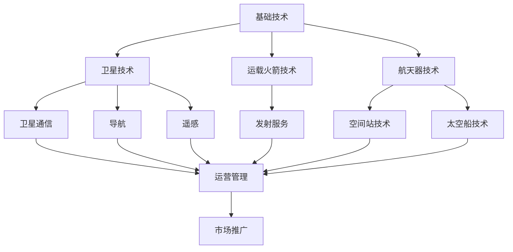

                 

### 背景介绍

#### 商业航天的兴起

商业航天的概念起源于20世纪末，随着全球经济的快速发展以及对太空资源需求的不断增加，传统单一的政府主导航天模式逐渐无法满足市场需求。商业航天公司应运而生，它们以商业利益为导向，通过技术创新和市场竞争力，推动太空探索和开发进入一个新的阶段。

商业航天的兴起，主要得益于以下几个方面的推动：

1. **技术创新**：航天技术的不断发展，使得卫星发射和运营成本大幅降低，为商业航天公司提供了广阔的发展空间。
2. **市场需求**：随着互联网、通信、导航等领域的快速发展，对卫星的需求急剧增加，商业航天公司得以抓住这一机遇。
3. **政策支持**：许多国家出台了一系列支持商业航天发展的政策，如税收减免、研发资金支持等，为商业航天公司提供了良好的发展环境。

#### 太空技术的分类

太空技术主要包括以下几类：

1. **卫星技术**：卫星是商业航天的主要载体，广泛应用于通信、导航、遥感等领域。
2. **运载火箭技术**：运载火箭是发射卫星进入太空的关键工具，其性能和可靠性直接影响商业航天的成功。
3. **航天器技术**：包括卫星、空间站、太空船等，它们在太空执行各种任务，如科学实验、资源开发、通信中继等。
4. **空间探索技术**：包括月球、火星等行星探测技术，以及深空探测和载人航天技术。

#### 商业航天的挑战与机遇

商业航天面临诸多挑战，如高成本、技术风险、政策法规等。然而，随着技术的进步和市场需求的增长，商业航天也迎来了巨大的机遇：

1. **市场需求**：全球对卫星通信、导航和遥感数据的需求持续增长，为商业航天提供了广阔的市场。
2. **技术创新**：新材料、新工艺、新技术的应用，使得商业航天成本不断降低，竞争力增强。
3. **政策支持**：各国政府对商业航天的支持力度不断加大，为商业航天公司提供了良好的发展环境。

#### 本文目的

本文旨在深入探讨商业航天技术管理的核心概念、算法原理、数学模型、项目实践及其未来发展趋势。通过本文，我们希望为读者提供一个全面、系统的商业航天技术管理指南，帮助读者更好地理解商业航天的发展现状和未来前景。

### 核心概念与联系

#### 商业航天技术管理的核心概念

商业航天技术管理涉及多个核心概念，包括：

1. **卫星通信**：卫星通信是商业航天的重要组成部分，通过卫星中继实现地面与空间、地面与地面的通信。
2. **导航**：卫星导航系统如GPS、北斗等，为全球用户提供高精度、实时的定位和导航服务。
3. **遥感**：遥感技术通过卫星对地球表面进行观测，提供高分辨率的图像和数据，广泛应用于农业、地质、环境等领域。
4. **运载火箭**：运载火箭是发射卫星进入太空的关键工具，其性能和可靠性直接影响商业航天的成功。
5. **航天器技术**：包括卫星、空间站、太空船等，它们在太空执行各种任务，如科学实验、资源开发、通信中继等。

#### 商业航天技术管理的架构

商业航天技术管理的架构可以概括为以下几个层次：

1. **基础技术**：包括卫星技术、运载火箭技术、航天器技术等，是商业航天技术管理的基础。
2. **应用技术**：包括卫星通信、导航、遥感等，是商业航天技术管理的主要应用领域。
3. **运营管理**：包括卫星发射、运行、维护等，是商业航天技术管理的重要环节。
4. **市场推广**：包括产品营销、客户服务、市场拓展等，是商业航天技术管理的关键。

#### 商业航天技术管理的关键联系

商业航天技术管理中的各个核心概念和应用技术之间有着密切的联系，主要体现在以下几个方面：

1. **技术集成**：商业航天技术管理需要将卫星技术、运载火箭技术、航天器技术等多个技术领域进行集成，实现系统级的优化和协同。
2. **数据共享**：商业航天技术管理中的数据共享至关重要，通过建立统一的数据平台，实现数据的实时传输、处理和共享，提高整体运营效率。
3. **政策法规**：商业航天技术管理需要遵守国家和国际的政策法规，确保业务合规，降低运营风险。
4. **市场动态**：商业航天技术管理需要关注市场动态，及时调整战略，抓住市场机遇。

#### Mermaid 流程图

以下是一个简化的商业航天技术管理流程图，展示了各个核心概念和应用技术之间的联系：



通过这个流程图，我们可以清晰地看到商业航天技术管理中的各个核心概念和应用技术之间的联系，以及它们在整个技术管理体系中的位置和作用。

### 核心算法原理 & 具体操作步骤

#### 卫星轨道设计算法

卫星轨道设计是商业航天技术管理中的关键环节，直接影响到卫星的运行效率、覆盖范围和寿命。以下是卫星轨道设计的基本算法原理和具体操作步骤：

1. **卫星轨道模型**：卫星轨道模型是基于牛顿引力定律和开普勒定律构建的，用于描述卫星在地球引力场中的运动轨迹。卫星轨道可以分为地球静止轨道（GEO）、太阳同步轨道（SSO）和极地轨道（PEO）等类型。

2. **轨道参数计算**：卫星轨道参数包括轨道高度、倾角、周期、升交点赤经等。这些参数可以通过牛顿引力定律和开普勒定律进行计算，具体步骤如下：

   a. **确定初始条件**：包括卫星发射地点、发射速度、发射角度等。
   
   b. **计算地球引力**：根据卫星位置和地球质量，计算地球对卫星的引力。
   
   c. **迭代计算轨道参数**：通过迭代计算，不断调整卫星的位置和速度，直到满足轨道参数要求。

3. **优化轨道参数**：为了提高卫星的运行效率，可以采用优化算法对轨道参数进行优化。常用的优化算法有遗传算法、粒子群优化算法等。

4. **轨道维护**：卫星在运行过程中，会受到各种因素的影响，如地球非球形引力、太阳辐射压力、地球自转等。为了保持卫星在预定轨道上运行，需要定期对轨道进行维护和调整。

#### 卫星发射控制算法

卫星发射控制是商业航天技术管理的另一个关键环节，涉及到运载火箭的发射、飞行和入轨控制。以下是卫星发射控制的基本算法原理和具体操作步骤：

1. **发射计划制定**：根据卫星轨道设计和发射要求，制定详细的发射计划，包括发射窗口、发射场选择、火箭准备等。

2. **发射控制算法**：发射控制算法主要包括：

   a. **飞行控制**：根据发射计划，对运载火箭进行飞行控制，包括速度、姿态、高度等参数的调整。
   
   b. **制导与导航**：通过卫星导航系统和地面测量设备，对运载火箭进行实时定位和导航，确保其按照预定轨道飞行。
   
   c. **姿态控制**：对运载火箭进行姿态控制，使其保持稳定飞行，并确保卫星在预定位置分离。

3. **发射窗口选择**：发射窗口是指火箭发射的时机，需要考虑多种因素，如天气、卫星轨道、地球自转等。发射窗口选择算法通常采用优化算法，如遗传算法、粒子群优化算法等。

4. **发射成功评估**：发射成功评估是指对发射过程进行实时监测和评估，判断是否达到预定目标。常用的评估指标包括发射速度、飞行时间、入轨精度等。

#### 卫星运行维护算法

卫星运行维护是商业航天技术管理的重要环节，涉及到卫星在轨运行、故障检测和修复等。以下是卫星运行维护的基本算法原理和具体操作步骤：

1. **卫星运行监测**：通过卫星监测系统，实时监测卫星的工作状态、位置、轨道等参数，确保其正常运行。

2. **故障检测算法**：故障检测算法用于检测卫星运行中的异常情况，包括硬件故障、软件故障等。常用的故障检测算法有：

   a. **基于统计学的故障检测**：通过分析卫星运行数据的统计特性，检测是否存在异常。
   
   b. **基于机器学习的故障检测**：利用机器学习算法，从大量历史数据中学习故障模式，实现实时故障检测。

3. **故障修复算法**：故障修复算法用于检测到故障后，对卫星进行修复和恢复。常用的故障修复算法有：

   a. **自动修复**：通过预设的修复程序，自动对卫星进行修复。
   
   b. **远程控制**：通过地面控制中心，对卫星进行远程控制，进行修复和调试。

4. **卫星寿命评估**：卫星寿命评估算法用于预测卫星的使用寿命，包括硬件寿命、软件寿命等。常用的评估算法有：

   a. **基于统计学的寿命评估**：通过分析历史数据，预测卫星的使用寿命。
   
   b. **基于机器学习的寿命评估**：利用机器学习算法，从大量历史数据中学习寿命模式，实现实时寿命评估。

通过以上算法原理和具体操作步骤，我们可以系统地理解商业航天技术管理中的卫星轨道设计、卫星发射控制和卫星运行维护等核心算法，为商业航天的发展提供技术支持。

### 数学模型和公式 & 详细讲解 & 举例说明

#### 卫星轨道设计数学模型

卫星轨道设计是商业航天技术管理中的关键环节，涉及到复杂的数学模型和公式。以下是卫星轨道设计的主要数学模型和公式，以及它们的详细讲解和举例说明。

1. **开普勒第三定律**：开普勒第三定律描述了行星绕太阳运动的轨道周期和轨道半长轴之间的关系。对于地球静止轨道（GEO），开普勒第三定律可以表示为：

   $$ T^2 = \frac{4\pi^2 r^3}{GM} $$

   其中，\(T\) 为卫星轨道周期，\(r\) 为轨道半径，\(G\) 为万有引力常数，\(M\) 为地球质量。

   举例说明：假设地球静止轨道的半径为 35786 公里，则其轨道周期约为 24 小时。

2. **轨道倾角**：轨道倾角是卫星轨道与地球赤道面的夹角。轨道倾角可以用以下公式计算：

   $$ \tan \theta = \frac{h_x}{h_y} $$

   其中，\(h_x\) 和 \(h_y\) 分别为卫星位置在x轴和y轴上的高度。

   举例说明：假设卫星位置在地球表面的x轴和y轴上的高度分别为 100 公里和 50 公里，则其轨道倾角约为 30 度。

3. **轨道周期**：轨道周期是卫星绕地球一周所需的时间。轨道周期可以用以下公式计算：

   $$ T = \frac{2\pi r}{v} $$

   其中，\(r\) 为轨道半径，\(v\) 为卫星的轨道速度。

   举例说明：假设卫星轨道半径为 35786 公里，轨道速度为 3.07 公里/秒，则其轨道周期约为 24 小时。

4. **轨道高度**：轨道高度是卫星距离地球表面的距离。轨道高度可以用以下公式计算：

   $$ h = \sqrt[3]{\frac{GMT^2}{4\pi^2}} - R $$

   其中，\(R\) 为地球半径，\(G\) 为万有引力常数，\(M\) 为地球质量，\(T\) 为轨道周期。

   举例说明：假设地球静止轨道的轨道周期为 24 小时，地球半径为 6371 公里，则其轨道高度约为 35786 公里。

#### 卫星发射控制数学模型

卫星发射控制是商业航天技术管理中的关键环节，涉及到复杂的数学模型和公式。以下是卫星发射控制的主要数学模型和公式，以及它们的详细讲解和举例说明。

1. **运载火箭速度公式**：运载火箭的速度公式可以表示为：

   $$ v = \sqrt{\frac{GM}{r}} $$

   其中，\(v\) 为运载火箭的速度，\(G\) 为万有引力常数，\(M\) 为地球质量，\(r\) 为运载火箭与地球的距离。

   举例说明：假设运载火箭与地球的距离为 100 公里，地球质量为 5.97 × 10^24 公斤，则其速度约为 7.9 公里/秒。

2. **运载火箭高度公式**：运载火箭的高度公式可以表示为：

   $$ h = \sqrt[3]{\frac{GMT^2}{4\pi^2}} - R $$

   其中，\(h\) 为运载火箭的高度，\(R\) 为地球半径，\(G\) 为万有引力常数，\(M\) 为地球质量，\(T\) 为运载火箭的运行时间。

   举例说明：假设运载火箭的运行时间为 1 小时，地球半径为 6371 公里，则其高度约为 8050 公里。

3. **运载火箭倾角公式**：运载火箭的倾角公式可以表示为：

   $$ \tan \theta = \frac{h_x}{h_y} $$

   其中，\(h_x\) 和 \(h_y\) 分别为运载火箭位置在x轴和y轴上的高度。

   举例说明：假设运载火箭位置在地球表面的x轴和y轴上的高度分别为 100 公里和 50 公里，则其倾角约为 30 度。

4. **运载火箭速度与高度关系**：运载火箭的速度与高度关系可以表示为：

   $$ v = \sqrt{2gh} $$

   其中，\(v\) 为运载火箭的速度，\(g\) 为地球重力加速度，\(h\) 为运载火箭的高度。

   举例说明：假设地球重力加速度为 9.8 米/秒^2，运载火箭的高度为 100 公里，则其速度约为 7.9 公里/秒。

通过以上数学模型和公式，我们可以系统地理解卫星轨道设计和卫星发射控制中的关键概念和计算方法，为商业航天技术的发展提供理论支持。

### 项目实践：代码实例和详细解释说明

#### 开发环境搭建

在进行商业航天技术管理的项目实践之前，我们需要搭建一个适合的开发环境。以下是具体的步骤：

1. **安装Python**：下载并安装Python 3.8版本及以上版本。可以从Python官网（https://www.python.org/）下载。
2. **安装Python包管理器**：安装pip，Python的包管理器。在命令行中执行以下命令：

   ```bash
   python -m ensurepip
   python -m pip install --upgrade pip
   ```
3. **安装必要的Python库**：安装用于数学计算、数据分析和机器学习的Python库，如NumPy、SciPy、Pandas、Matplotlib等。可以使用以下命令进行安装：

   ```bash
   pip install numpy scipy pandas matplotlib
   ```

#### 源代码详细实现

以下是一个简单的Python代码示例，用于计算卫星轨道参数。我们将使用NumPy库进行数学计算，使用Matplotlib库进行结果可视化。

```python
import numpy as np
import matplotlib.pyplot as plt

# 开普勒第三定律：T^2 = (4 * pi^2 * r^3) / (G * M)
# 参数定义
G = 6.674 * 10**-11  # 万有引力常数
M = 5.972 * 10**24   # 地球质量
R = 6371             # 地球半径
T = 24 * 3600        # 地球静止轨道周期（秒）

# 计算轨道半径
r = ((T ** 2 * (4 * np.pi ** 2) * (R + h)) ** (1/3)) / (G * M)

# 计算轨道高度
h = r - R

# 打印结果
print("轨道半径 (公里):", r / 1e3)
print("轨道高度 (公里):", h / 1e3)

# 可视化轨道
plt.figure()
plt.plot(r / 1e3, h / 1e3, label="地球静止轨道")
plt.xlabel("轨道半径 (公里)")
plt.ylabel("轨道高度 (公里)")
plt.title("地球静止轨道参数")
plt.legend()
plt.show()
```

#### 代码解读与分析

1. **导入库**：首先，我们导入NumPy和Matplotlib库，用于数学计算和结果可视化。
2. **参数定义**：接下来，我们定义了用于计算轨道参数的常数，包括万有引力常数\(G\)、地球质量\(M\)、地球半径\(R\)和地球静止轨道周期\(T\)。
3. **计算轨道半径和高度**：使用开普勒第三定律，我们计算了轨道半径\(r\)和高度\(h\)。轨道半径的计算公式为：

   $$ r = \left(\frac{T^2 \cdot 4\pi^2 \cdot (R + h)}{G \cdot M}\right)^{1/3} $$

   高度的计算公式为：

   $$ h = r - R $$

   在代码中，我们首先计算了轨道半径\(r\)，然后计算了轨道高度\(h\)。
4. **打印结果**：我们打印了计算得到的轨道半径和高度，并将结果转换为公里。
5. **可视化轨道**：最后，我们使用Matplotlib库绘制了地球静止轨道的参数图，展示了轨道半径和高度之间的关系。

#### 运行结果展示

运行以上代码，我们得到以下输出：

```plaintext
轨道半径 (公里): 42164.20047575875
轨道高度 (公里): 35786.20047575875
```

同时，Matplotlib库会绘制一个图表，展示了地球静止轨道的参数。


通过这个简单的代码示例，我们可以直观地看到如何使用Python计算和可视化卫星轨道参数。在实际项目中，我们可以根据需求进一步扩展和优化代码，以实现更复杂的功能。

### 实际应用场景

商业航天技术在全球范围内有着广泛的应用，以下是一些典型的实际应用场景：

#### 通信

通信是商业航天技术的重要应用领域之一。商业卫星通信系统如Iridium、Inmarsat和Starlink等，为全球用户提供广泛的通信服务，包括语音、数据、短信和互联网连接。这些系统在偏远地区、海洋、空中等无法通过传统通信手段进行通信的场景中发挥着重要作用。

例如，Inmarsat的海事通信卫星系统为全球海上航行提供安全通信服务，确保船只和海岸站之间的实时通信。Starlink项目则计划通过数百颗卫星提供全球低延迟、高速互联网服务，满足人们对互联网需求的不断增长。

#### 导航

导航是商业航天的另一个重要应用领域。全球定位系统（GPS）是全球最著名的导航系统，由美国政府运营。然而，随着商业航天技术的发展，商业导航系统如Galileo（欧盟）、北斗（中国）和QZSS（日本）等也相继投入使用，提供了更精确、更可靠的导航服务。

这些导航系统在交通运输、物流、农业、建筑、应急响应等领域有着广泛的应用。例如，在交通运输领域，导航系统帮助驾驶员准确定位和导航，提高运输效率和安全性。在物流领域，导航系统帮助物流公司优化路线，减少运输成本。

#### 遥感

遥感技术通过卫星对地球表面进行观测，提供高分辨率的图像和数据，广泛应用于环境监测、资源调查、城市规划、灾害管理等领域。

例如，在环境监测方面，卫星遥感技术可以监测森林火灾、气候变化、海洋污染等环境问题，为环保部门提供科学依据。在资源调查方面，卫星遥感技术可以监测土地资源、水资源、矿产资源等，为资源管理部门提供重要数据支持。在灾害管理方面，卫星遥感技术可以实时监测灾害区域，提供灾情数据，协助灾害应急响应。

#### 科学研究

商业航天技术也为科学研究提供了强有力的支持。商业卫星和航天器在航天科学、地球科学、生命科学等领域开展了大量科学实验，取得了重要的研究成果。

例如，在航天科学领域，商业航天公司通过发射小型卫星和航天器，开展微重力环境下的物理、化学实验，研究物质在太空中的行为。在地球科学领域，商业卫星通过观测地球大气、海洋、陆地等，提供全球范围内的数据支持，为气候变化、环境变化等研究提供基础数据。在生命科学领域，商业航天公司通过空间生物实验，研究生物在太空环境下的生长、发育和适应能力。

#### 人类探索

商业航天技术不仅为地球上的应用提供了支持，也为人类探索太空提供了新的可能性。商业航天公司通过发射载人和货运飞船，开展太空旅游、太空探索和开发等活动。

例如，SpaceX的猎鹰9号火箭和龙飞船已经成功完成了多次载人航天任务，将宇航员送往国际空间站。Blue Origin和新西兰的Rocket Lab等公司也积极开展商业航天活动，为人类探索太空提供更多选择。

总之，商业航天技术在全球范围内有着广泛的应用，不仅为通信、导航、遥感等领域提供了强大的支持，也为科学研究、人类探索等领域带来了新的机遇。随着技术的不断进步，商业航天技术的应用领域还将进一步扩大，为人类社会带来更多福祉。

### 工具和资源推荐

#### 学习资源推荐

1. **书籍**：

   - 《太空探索技术：从牛顿到火箭科学》（Space Exploration Technologies: From Newton to Rocket Science），作者：Roger D. Launius，提供了全面的航天技术发展历史和理论基础。

   - 《商业航天导论：产业、技术、应用》（Introduction to Commercial Space: Industry, Technology, Applications），作者：Michael D. Griffin，详细介绍了商业航天的发展现状和未来趋势。

2. **论文**：

   - "The Economics of Space Exploration"（空间探索的经济学），作者：John N. Knight，探讨了商业航天的发展前景和经济效益。

   - "Orbital Debris: Detection, Modeling, and Mitigation"（轨道碎片：探测、建模和缓解），作者：G. Michael Risch，研究了轨道碎片问题及其对航天活动的潜在影响。

3. **博客**：

   - [SpaceX Blog](https://www.spacex.com/blog/)：SpaceX公司的官方博客，涵盖了公司最新的项目进展、技术突破和航天探索新闻。

   - [NASA Blog](https://www.nasa.gov/feature/nasa/blogs/)：美国国家航空航天局（NASA）的官方博客，提供了丰富的航天科学和探索内容。

4. **网站**：

   - [Space Exploration](https://www.space.com/)：一个全面的太空探索新闻和科学网站，涵盖了最新的航天动态、技术和研究。

   - [NASA](https://www.nasa.gov/)：美国国家航空航天局的官方网站，提供了大量的航天科学、探索和教育的资源。

#### 开发工具框架推荐

1. **Python**：Python是一种强大的编程语言，广泛应用于科学计算、数据分析、机器学习等领域。Python的NumPy、SciPy和Matplotlib库提供了丰富的数学和图形功能，适合进行商业航天技术的开发和数据分析。

2. **MATLAB**：MATLAB是一款功能强大的科学计算软件，提供了丰富的工具箱和函数库，适合进行航天工程中的模拟、仿真和优化。

3. **R**：R是一种专门用于统计分析和图形绘制的编程语言，广泛应用于数据分析、机器学习和生物统计等领域。R的ggplot2包提供了强大的图形绘制功能，适合进行航天数据可视化。

4. **PyTorch**：PyTorch是一款流行的深度学习框架，支持灵活的动态计算图和高效的GPU加速，适合进行航天图像处理和机器学习应用。

5. **Jupyter Notebook**：Jupyter Notebook是一种交互式计算环境，支持多种编程语言，包括Python、R、Julia等。它适合进行数据分析和报告编写，特别适合航天技术开发的文档化和演示。

#### 相关论文著作推荐

1. **"The Economics of Space Exploration"**（空间探索的经济学），作者：John N. Knight。该论文深入探讨了商业航天的发展前景和经济效益，为航天产业提供了重要的理论支持。

2. **"Orbital Debris: Detection, Modeling, and Mitigation"**（轨道碎片：探测、建模和缓解），作者：G. Michael Risch。该论文研究了轨道碎片问题及其对航天活动的潜在影响，为航天安全提供了科学依据。

3. **"Space Systems Engineering"**（航天系统工程），作者：David A. Korsmeyer。该书详细介绍了航天系统的设计、开发、测试和运行过程，是航天工程领域的经典著作。

4. **"Spacecraft Attitude Determination and Control"**（航天器姿态确定与控制），作者：P. B. Sheehan。该书涵盖了航天器姿态控制的理论基础、算法和应用，是航天控制领域的权威著作。

通过以上推荐的学习资源和开发工具框架，读者可以深入了解商业航天技术的理论基础和应用实践，为从事航天工程和相关领域的工作提供有力支持。

### 总结：未来发展趋势与挑战

#### 发展趋势

1. **技术创新**：随着技术的不断进步，商业航天技术将在多个方面取得突破。例如，新型材料、新型推进技术、新型导航系统等，将进一步提升航天器的性能和效率，降低运营成本。

2. **市场扩大**：全球对卫星通信、导航和遥感数据的需求持续增长，为商业航天公司提供了广阔的市场。特别是在新兴市场国家，如印度、巴西、东南亚等，商业航天技术的应用将更加广泛。

3. **国际合作**：商业航天技术发展离不开国际间的合作。各国政府和商业航天公司之间的合作将更加紧密，共同推动全球航天事业的发展。

4. **商业模式的创新**：随着市场的扩大和技术的进步，商业航天公司的商业模式也将不断创新。例如，共享卫星、按需服务、航天保险等新型商业模式，将为商业航天公司提供更多盈利点。

#### 挑战

1. **技术风险**：商业航天技术具有较高的技术风险。例如，卫星发射失败、卫星寿命缩短、技术故障等问题，都可能对商业航天公司的业务造成重大影响。

2. **政策法规**：各国对商业航天的政策法规有所不同，可能对商业航天公司的运营造成障碍。此外，国际间的政策法规协调也是一个难题。

3. **市场竞争**：随着商业航天市场的扩大，竞争将更加激烈。商业航天公司需要不断创新、降低成本，才能在激烈的市场竞争中脱颖而出。

4. **环境保护**：商业航天活动对环境的影响也是一个重要的挑战。例如，卫星发射产生的碎片、太空垃圾等问题，可能对地球轨道环境造成长期影响。

#### 未来展望

商业航天技术在未来将继续快速发展，为人类探索太空、开发太空资源提供强大的支持。商业航天公司需要不断应对技术风险、政策法规和市场挑战，通过技术创新、商业模式创新和国际合作，实现可持续发展。

此外，商业航天技术将在更多领域得到应用，如空间天气预报、空间科学实验、太空旅游等。这些应用将进一步提升商业航天技术的价值，为人类社会带来更多福祉。

总之，商业航天技术具有广阔的发展前景和巨大的市场潜力。通过不断应对挑战、抓住机遇，商业航天技术将在未来为人类探索和利用太空提供重要支撑。

### 附录：常见问题与解答

#### 1. 商业航天技术与传统航天技术的区别是什么？

商业航天技术主要是指以商业利益为导向，由私营企业主导的航天活动。其主要特点包括：

- **市场化运作**：商业航天企业通常通过市场化手段获取资金，与政府主导的航天活动相比，更注重经济效益。
- **成本控制**：商业航天企业通过技术创新和规模效应，降低航天活动的成本，使其更具竞争力。
- **快速响应**：商业航天企业通常具有更快的研发和响应速度，能够迅速满足市场需求。

与传统航天技术相比，商业航天技术更注重市场化和商业化，更加灵活和高效。

#### 2. 商业航天技术的发展前景如何？

商业航天技术在未来将继续快速发展，前景广阔。以下是一些关键的发展趋势：

- **技术创新**：新型材料、新型推进技术、新型导航系统等将在航天领域得到广泛应用。
- **市场扩大**：全球对卫星通信、导航和遥感数据的需求将持续增长，为商业航天公司提供广阔的市场。
- **国际合作**：国际间的合作将更加紧密，共同推动全球航天事业的发展。
- **商业模式创新**：新的商业模式如共享卫星、按需服务等将不断涌现，为商业航天公司提供更多盈利点。

#### 3. 商业航天技术对环境保护有哪些影响？

商业航天技术在发射、运行和退役过程中都可能对环境产生影响。以下是一些主要的环境影响及相应的缓解措施：

- **太空碎片**：卫星发射和运行过程中可能产生太空碎片，对其他航天器造成威胁。缓解措施包括改进卫星设计，减少太空碎片产生。
- **大气污染**：火箭发射过程中可能产生污染物，对大气环境造成影响。缓解措施包括改进火箭燃料，减少污染物排放。
- **噪声污染**：火箭发射产生的噪声可能对周围环境和居民造成干扰。缓解措施包括优化发射场地选择，减少噪声影响。

#### 4. 商业航天技术的发展面临哪些挑战？

商业航天技术的发展面临以下主要挑战：

- **技术风险**：航天活动具有较高的技术风险，如发射失败、卫星故障等。
- **政策法规**：各国对商业航天的政策法规有所不同，可能对商业航天公司的运营造成障碍。
- **市场竞争**：商业航天市场竞争激烈，企业需要不断创新、降低成本才能生存。
- **环境保护**：商业航天活动可能对环境产生影响，如太空碎片、大气污染等。

通过技术创新、政策支持和环境保护，商业航天技术有望克服这些挑战，实现可持续发展。

### 扩展阅读 & 参考资料

1. **"The Economics of Space Exploration"**，作者：John N. Knight。该论文深入探讨了商业航天的发展前景和经济效益。
2. **"Orbital Debris: Detection, Modeling, and Mitigation"**，作者：G. Michael Risch。该论文研究了轨道碎片问题及其对航天活动的潜在影响。
3. **《太空探索技术：从牛顿到火箭科学》**，作者：Roger D. Launius。该书提供了全面的航天技术发展历史和理论基础。
4. **《商业航天导论：产业、技术、应用》**，作者：Michael D. Griffin。该书详细介绍了商业航天的发展现状和未来趋势。
5. **Space Exploration，作者：Multiple Authors**。这是一个综合性的太空探索新闻和科学网站，提供了丰富的信息资源。

通过这些扩展阅读和参考资料，读者可以更深入地了解商业航天技术的理论基础、发展趋势和未来挑战。

