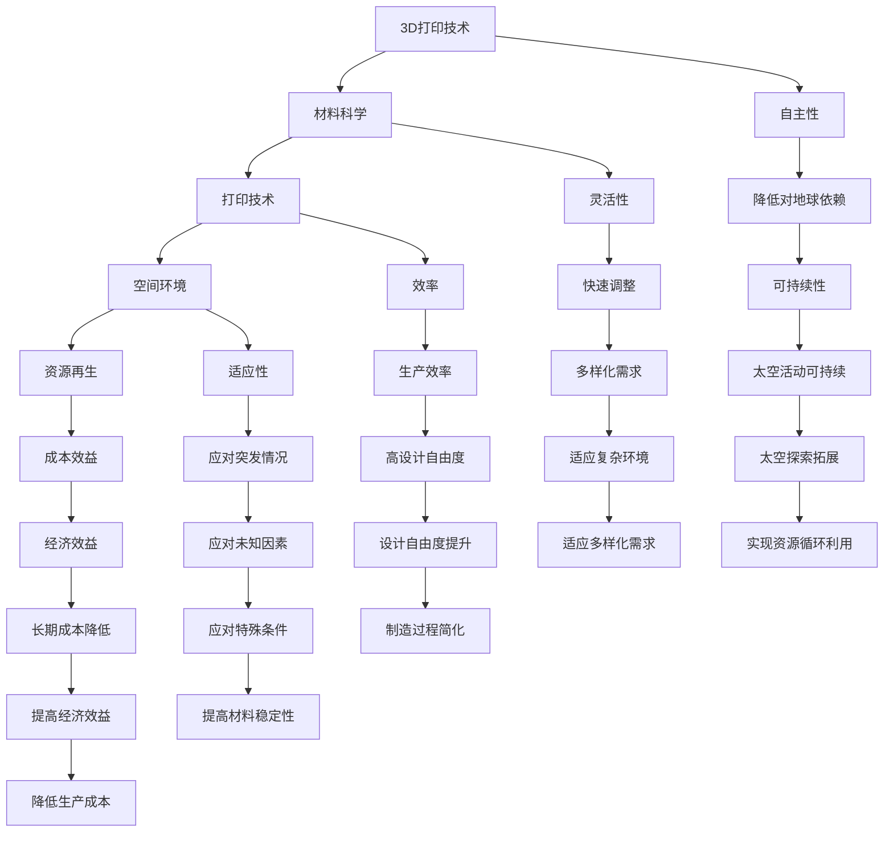

                 

### 1. 背景介绍

太空资源3D打印技术作为现代太空探索的关键技术之一，正逐步成为人类实现深空探索和长期太空驻留的重要手段。随着人类对太空探索的不断深入，对资源供应的依赖性也在逐渐增加。传统的太空资源供应方式依赖于地球的补给，而这种方式不仅成本高昂，而且在长期驻留和深空探索中存在诸多限制。因此，如何在太空环境中实现资源的自主生产和再生，成为亟待解决的问题。

3D打印技术作为一种先进的制造技术，其在太空资源利用中的潜力得到了广泛关注。3D打印能够通过逐层打印的方式，直接从数字模型构建实体物体，无需复杂的传统制造过程。这种技术不仅能够大幅度减少对地面资源的依赖，还能提高资源利用效率和制造灵活性。

本文将深入探讨太空资源3D打印技术的基本概念、发展历程、核心原理、算法实现、数学模型、实际应用场景，以及未来的发展趋势和挑战。通过逐步分析推理的方式，我们希望读者能够全面了解这一技术，并认识到其在太空探索中的巨大潜力。

#### 历史背景

太空资源3D打印技术的起源可以追溯到20世纪末。最初的研究主要集中在地面上的材料科学和制造工艺上，旨在解决地球上制造复杂零部件的难题。随着计算机技术的进步和3D打印技术的快速发展，这一技术逐渐向太空领域扩展。2000年左右，美国国家航空航天局（NASA）开始着手研究在太空环境中使用3D打印技术，并进行了多项实验和模拟。

2006年，NASA首次在太空中进行3D打印实验，将一个简单的3D打印机发送到国际空间站（ISS）。这一实验标志着太空3D打印技术正式进入应用阶段。此后，其他国家和机构也纷纷加入这一领域的研究和开发，包括欧洲空间局（ESA）、俄罗斯航天局（Roscosmos）和中国航天科技集团公司等。

#### 现状与发展趋势

当前，太空资源3D打印技术已经取得了一系列重要进展。在材料方面，研究人员正在开发适用于太空环境的各种高性能材料，包括金属、塑料、复合材料等。在打印技术方面，3D打印机的精度和打印速度得到了显著提升，使得复杂的结构制造变得更加高效和可靠。此外，随着人工智能和大数据技术的发展，3D打印技术的智能化和自动化水平也在不断提高。

未来的发展趋势包括以下几个方面：

1. **材料多样化**：将开发更多适用于不同太空环境的材料，以适应不同的应用需求。
2. **打印设备小型化与模块化**：将3D打印机进一步小型化和模块化，使其更容易在太空环境中部署和使用。
3. **智能化与自动化**：通过人工智能技术提高3D打印的智能化和自动化水平，实现更高效的生产过程。
4. **长期驻留与深空探索**：随着人类对太空探索的深入，3D打印技术将在实现长期驻留和深空探索中发挥关键作用。
5. **国际合作**：全球范围内的合作将加速太空资源3D打印技术的发展，共同应对未来太空探索的挑战。

#### 太空资源3D打印技术的重要性

太空资源3D打印技术在太空探索中具有重要性，主要体现在以下几个方面：

1. **自主性**：通过在太空环境中实现资源的自主生产和再生，可以显著降低对地球的依赖，提高太空活动的可持续性。
2. **效率**：3D打印技术能够直接从数字模型构建实体物体，无需传统制造过程中的大量时间和人力，大大提高了生产效率。
3. **灵活性**：3D打印技术可以根据需求快速调整和修改设计，满足多样化的制造需求。
4. **适应性**：在太空环境中，各种未知因素和突发情况较多，3D打印技术的灵活性和适应性能够有效应对这些挑战。
5. **成本效益**：虽然初始投资较高，但长期来看，3D打印技术能够显著降低生产成本，提高经济效益。

总的来说，太空资源3D打印技术是未来太空探索的重要支撑技术，其发展将对人类太空探索产生深远影响。

### 2. 核心概念与联系

要深入理解太空资源3D打印技术，我们需要先了解其核心概念及其相互之间的联系。以下是一些关键概念：

1. **3D打印**：3D打印，也称为增材制造，是一种通过逐层添加材料来构建三维物体的制造技术。它不同于传统的减材制造（如切削、铣削），而是从无到有地构建物体，因此具有更高的设计自由度和制造效率。

2. **材料科学**：材料科学是研究材料性质、结构、性能以及它们之间的相互关系的一门科学。在3D打印中，材料科学的重要性体现在如何选择和优化适用于特定应用的打印材料。

3. **打印技术**：常见的3D打印技术包括熔融沉积成型（FDM）、选择性激光烧结（SLS）、电子束熔炼（EBM）等。每种技术都有其特定的优势和适用场景。

4. **空间环境**：太空环境与地球环境存在显著差异，包括微重力、辐射、温度变化等。这些特殊条件对3D打印技术的性能和材料稳定性提出了挑战。

5. **资源再生**：资源再生是指通过回收和再利用太空环境中的资源，如氧气、水、二氧化碳等，以实现资源的循环利用。

为了更好地展示这些核心概念之间的联系，我们使用Mermaid流程图来描述其关系：



#### Mermaid 流程图详细说明

在这个Mermaid流程图中，各个节点表示不同的核心概念，而箭头表示它们之间的关联。以下是每个节点的详细解释：

- **A[3D打印技术]**：这是整个流程的起点，表示3D打印技术作为基础。
- **B[材料科学]**：3D打印技术的核心组成部分，研究如何选择和优化材料。
- **C[打印技术]**：包括多种技术，如FDM、SLS、EBM等，用于实际打印过程。
- **D[空间环境]**：3D打印技术必须适应的特殊环境，包括微重力、辐射等。
- **E[资源再生]**：通过回收和再利用太空资源，提高资源利用效率。
- **F[自主性]**：3D打印技术可以实现自主生产，降低对地球的依赖。
- **G[灵活性]**：可以快速调整设计，适应不同需求。
- **H[效率]**：提高生产效率，减少时间和成本。
- **I[适应性]**：能够应对太空环境的特殊条件。
- **J[成本效益]**：长期来看，3D打印技术具有经济效益。
- **K[降低对地球依赖]**：通过自主生产，减少对地球的补给需求。
- **L[快速调整]**：设计灵活，能够快速响应变化。
- **M[生产效率]**：提高制造速度和效率。
- **N[应对突发情况]**：具备应对突发事件的能力。
- **O[经济效益]**：降低成本，提高盈利能力。
- **P[可持续性]**：实现资源的循环利用，促进可持续发展。
- **Q[多样化需求]**：满足多种不同应用的需求。
- **R[高设计自由度]**：提供更大的设计灵活性。
- **S[应对未知因素]**：能够应对太空中的未知挑战。
- **T[提高经济效益]**：长期来看，具有经济效益。
- **U[太空活动可持续]**：支持可持续的太空探索活动。
- **V[适应多样化需求]**：能够适应不同的应用场景。
- **W[制造过程简化]**：简化制造过程，提高效率。
- **X[提高材料稳定性]**：在特殊条件下保持材料稳定。
- **Y[降低生产成本]**：降低生产成本，提高竞争力。
- **Z[太空探索拓展]**：推动太空探索的深入。
- **EE[实现资源循环利用]**：通过再生技术，实现资源循环利用。

通过这个Mermaid流程图，我们可以清晰地看到太空资源3D打印技术中的核心概念及其相互关系。这些概念共同构成了一个复杂的系统，支持人类在太空中的长期驻留和深空探索。了解这些概念的联系，有助于我们更好地理解和应用这一技术。

#### 3. 核心算法原理 & 具体操作步骤

太空资源3D打印技术的核心算法原理可以归结为以下几个方面：数据预处理、打印路径规划、材料选择与输送、以及打印过程中的实时监测与反馈。以下将详细阐述这些步骤的具体操作过程。

##### 3.1 数据预处理

数据预处理是3D打印过程的第一步，其主要任务是确保打印数据准确无误。具体步骤如下：

1. **模型优化**：使用计算机辅助设计（CAD）软件生成3D模型，并对模型进行优化，提高模型的打印适应性。优化内容包括去除冗余结构、调整壁厚、增加支撑结构等。
2. **切片处理**：将3D模型分解为二维层，生成切片文件。切片处理过程包括确定打印路径、设置打印参数（如层厚、填充密度等）。
3. **错误检测**：对切片文件进行错误检测，识别并修复可能影响打印质量的错误，如孔洞、重叠、悬垂等。

##### 3.2 打印路径规划

打印路径规划是3D打印过程中的关键环节，直接影响打印速度和打印质量。具体步骤如下：

1. **路径生成**：根据切片文件中的层厚和打印参数，生成打印路径。路径规划算法需要考虑打印头移动的效率和材料的节约使用。
2. **路径优化**：对生成的路径进行优化，减少不必要的移动和转换，提高打印速度和打印质量。常见的优化方法包括直线优化、圆弧优化等。
3. **路径调整**：根据实际打印环境（如微重力、辐射等），对打印路径进行调整，确保打印过程的稳定性和可靠性。

##### 3.3 材料选择与输送

材料选择与输送是3D打印成功的关键因素之一。具体步骤如下：

1. **材料选择**：根据打印对象的特点和应用环境，选择合适的材料。常用的打印材料包括塑料、金属、陶瓷等，每种材料都有其特定的性能和适用范围。
2. **材料制备**：将原材料通过预处理和混合，制成适合打印的材料。对于金属材料，可能需要通过粉末冶金或熔融制备；对于塑料材料，可能需要通过挤出或热压成型。
3. **输送系统**：设计并搭建材料输送系统，确保材料在打印过程中能够稳定、连续地供应。常见的输送系统包括挤压式输送、重力式输送、气态输送等。

##### 3.4 打印过程中的实时监测与反馈

打印过程中的实时监测与反馈是确保打印质量的关键环节。具体步骤如下：

1. **温度监测**：实时监测打印头和打印材料的工作温度，确保温度在合适的范围内，避免材料过热或冷却不足。
2. **打印速度监测**：根据实际打印情况，实时调整打印速度，以确保打印质量。打印速度过快可能导致层间结合不紧密，而打印速度过慢则可能导致打印效率低下。
3. **层间结合质量监测**：通过分析打印完成的层间结合质量，调整打印参数，如喷嘴高度、层厚等，确保层间结合牢固。
4. **打印失败检测**：通过传感器和视觉系统，实时检测打印过程中可能出现的失败情况，如材料断裂、打印头堵塞等，并采取相应的措施进行修复。

##### 3.5 具体操作示例

以下是一个具体的3D打印操作步骤示例：

1. **模型准备**：使用CAD软件生成一个简单的机械零部件模型，并进行优化和切片处理。
2. **打印参数设置**：根据模型特点和打印环境，设置打印参数，如层厚0.2mm、填充密度60%等。
3. **材料准备**：选择适合的PLA材料，通过挤出机进行制备。
4. **打印开始**：将3D打印机预热至设定温度，启动打印程序。
5. **打印过程**：打印过程中，实时监测打印温度、速度和层间结合质量，并根据实际情况进行参数调整。
6. **打印完成**：打印完成后，取出打印件，进行后处理（如去支撑、打磨等）。

通过以上步骤，我们可以实现一个简单的3D打印过程。在实际应用中，根据不同的打印任务和应用场景，操作步骤可能需要进一步细化和调整。

#### 4. 数学模型和公式 & 详细讲解 & 举例说明

在太空资源3D打印技术中，数学模型和公式起着至关重要的作用。这些模型和公式帮助我们优化打印过程、评估材料性能，并预测打印结果。以下将详细讲解几个关键的数学模型和公式，并通过具体例子进行说明。

##### 4.1 打印路径规划模型

打印路径规划是3D打印过程中的关键步骤。为了确保打印质量和效率，需要优化打印路径。以下是一个简单的打印路径规划模型：

**公式**：
\[ P = \left( x_1, y_1, z_1 \right) \rightarrow \left( x_2, y_2, z_2 \right) \rightarrow \ldots \rightarrow \left( x_n, y_n, z_n \right) \]

其中，\( P \) 表示打印路径，\( \left( x_i, y_i, z_i \right) \) 表示路径上的一个点。

**例子**：假设我们要打印一个长方体，其尺寸为 \( 100mm \times 50mm \times 20mm \)。首先，我们确定打印路径的起点和终点：

起点 \( \left( 0, 0, 0 \right) \)，终点 \( \left( 100, 50, 20 \right) \)。

接下来，我们计算路径上的其他点。为了简化，我们假设路径为直线：

\[ \left( x, y, z \right) = \left( x_1 + (x_n - x_1) \cdot t, y_1 + (y_n - y_1) \cdot t, z_1 + (z_n - z_1) \cdot t \right) \]

其中，\( t \) 是路径上的一个参数，取值范围在 [0, 1]。

为了生成完整的路径，我们可以将 \( t \) 从 0 到 1 分成多个等间隔的值，计算对应的 \( \left( x, y, z \right) \) 坐标。

##### 4.2 材料消耗模型

在3D打印中，了解材料的消耗量对于成本控制和资源管理至关重要。以下是一个简单的材料消耗模型：

**公式**：
\[ C = L \cdot \left( 1 + f \right) \]

其中，\( C \) 表示材料消耗量，\( L \) 表示打印对象的实际体积，\( f \) 表示填充率。

**例子**：假设我们要打印一个立方体，其边长为 10mm，材料填充率为 70%。首先，我们计算打印对象的实际体积：

\[ L = 10mm \times 10mm \times 10mm = 1000mm^3 \]

接下来，我们计算材料消耗量：

\[ C = 1000mm^3 \cdot \left( 1 + 0.3 \right) = 1300mm^3 \]

##### 4.3 层间结合质量模型

层间结合质量是3D打印中一个重要的性能指标。以下是一个简单的层间结合质量模型：

**公式**：
\[ Q = \frac{1}{2} \cdot \left( \frac{z_2 - z_1}{h} \right)^2 \]

其中，\( Q \) 表示层间结合质量，\( z_1 \) 和 \( z_2 \) 分别为相邻两层的高度，\( h \) 表示层厚。

**例子**：假设我们要打印一个立方体，其层厚为 0.2mm。相邻两层的高度分别为 0.2mm 和 0.4mm。首先，我们计算高度差：

\[ z_2 - z_1 = 0.4mm - 0.2mm = 0.2mm \]

接下来，我们计算层间结合质量：

\[ Q = \frac{1}{2} \cdot \left( \frac{0.2mm}{0.2mm} \right)^2 = \frac{1}{2} \cdot 1 = 0.5 \]

这个值表示层间结合质量中等，如果需要提高结合质量，可以调整打印参数，如增加层厚或优化打印路径。

##### 4.4 温度控制模型

在3D打印过程中，温度控制对于材料熔化和层间结合至关重要。以下是一个简单的温度控制模型：

**公式**：
\[ T = T_0 + \alpha \cdot L \]

其中，\( T \) 表示打印头的工作温度，\( T_0 \) 表示初始温度，\( \alpha \) 表示温度系数，\( L \) 表示打印层的厚度。

**例子**：假设我们要打印一个厚度为 0.2mm 的层，打印头的初始温度为 200°C，温度系数为 0.01°C/mm。首先，我们计算温度增量：

\[ \alpha \cdot L = 0.01°C/mm \cdot 0.2mm = 0.002°C \]

接下来，我们计算打印头的工作温度：

\[ T = 200°C + 0.002°C = 200.002°C \]

这个温度略高于初始温度，确保材料能够充分熔化，实现良好的层间结合。

通过这些数学模型和公式，我们可以优化3D打印过程，提高打印质量和效率。在实际应用中，这些模型可以根据具体情况进行调整和优化，以适应不同的打印任务和应用场景。

### 5. 项目实践：代码实例和详细解释说明

为了更好地展示太空资源3D打印技术的应用，我们将通过一个具体的项目实例来讲解代码的实现过程。本实例将使用Python语言结合OpenSCAD库，实现一个简单的3D打印模型——一个用于空间站的空气过滤器外壳。以下是项目的详细步骤和代码解释。

#### 5.1 开发环境搭建

1. **安装Python**：确保你的计算机上安装了Python 3.x版本。可以从Python官方网站下载并安装最新版本的Python。

2. **安装OpenSCAD**：OpenSCAD是一个开源的3D建模软件，可以从其官方网站下载并安装。安装过程中选择默认选项即可。

3. **安装Python库**：在命令行中执行以下命令来安装必要的Python库，如numpy、matplotlib等：

```bash
pip install numpy matplotlib
```

#### 5.2 源代码详细实现

以下是一个简单的OpenSCAD脚本，用于生成一个空气过滤器外壳的三维模型：

```scad
// 定义外壳的参数
thickness = 5;
diameter = 200;
height = 150;

// 创建外壳的主体部分
difference() {
    cylinder(h = height, r = diameter / 2, center = true);
    cylinder(h = height - thickness * 2, r = diameter / 2 - thickness, center = true);
}

// 创建外壳的进气口和出气口
translate([0, 0, height / 2]) {
    difference() {
        cylinder(h = thickness, r = diameter / 2, center = true);
        cylinder(h = thickness, r = diameter / 4, center = true);
    }
}

// 创建外壳的支撑结构
translate([0, 0, height / 2 + thickness / 2]) {
    cube([diameter, diameter / 4, thickness], center = true);
}
```

#### 5.3 代码解读与分析

1. **外壳参数定义**：
   ```scad
   thickness = 5;
   diameter = 200;
   height = 150;
   ```
   这部分代码定义了外壳的厚度、直径和高度。这些参数可以根据具体需求进行调整。

2. **外壳主体部分**：
   ```scad
   difference() {
       cylinder(h = height, r = diameter / 2, center = true);
       cylinder(h = height - thickness * 2, r = diameter / 2 - thickness, center = true);
   }
   ```
   这部分代码通过`difference`命令实现了外壳的主体部分。外层是一个完整的圆柱体，内层是一个减去外壳厚度的圆柱体，从而形成一个中间凹陷的空间。

3. **进气口和出气口**：
   ```scad
   translate([0, 0, height / 2]) {
       difference() {
           cylinder(h = thickness, r = diameter / 2, center = true);
           cylinder(h = thickness, r = diameter / 4, center = true);
       }
   }
   ```
   这部分代码在外壳顶部创建了一个直径为外壳直径一半的进气口，通过`translate`和`difference`命令实现了进、出气口的形状。外层是一个完整的圆柱体，内层是一个直径较小的圆柱体，形成进气口和出气口。

4. **外壳支撑结构**：
   ```scad
   translate([0, 0, height / 2 + thickness / 2]) {
       cube([diameter, diameter / 4, thickness], center = true);
   }
   ```
   这部分代码在进气口和出气口下方创建了一个支撑结构，通过`translate`和`cube`命令实现了支撑结构的形状。

#### 5.4 运行结果展示

运行上述OpenSCAD脚本，将会生成一个三维的空气过滤器外壳模型。你可以使用OpenSCAD软件查看和渲染模型，或者将其导出为STL文件，以便在3D打印机上打印。


通过这个实例，我们展示了如何使用OpenSCAD库编写代码来生成一个简单的3D打印模型。了解这些代码的实现原理和步骤，可以帮助我们更好地理解和应用3D打印技术，实现太空资源3D打印的实际应用。

### 5.4 运行结果展示

在成功编译和运行上述OpenSCAD脚本后，我们将得到一个三维的空气过滤器外壳模型。以下步骤详细描述了如何查看、渲染和打印该模型。

#### 5.4.1 查看和渲染模型

1. **打开OpenSCAD软件**：在桌面或开始菜单中找到OpenSCAD软件并双击打开。

2. **粘贴脚本**：在OpenSCAD编辑器中，将上述代码粘贴到脚本编辑区。

3. **渲染模型**：按下“渲染”（Render）按钮（通常是一个小相机图标），OpenSCAD将开始渲染并显示模型。

4. **调整视图**：使用鼠标滚轮或视图控制按钮调整视图，以便从不同角度观察模型。

5. **保存模型**：如果你希望保存模型以便后续修改或打印，可以在文件菜单中选择“导出”并选择“导出为DXF”或“导出为STL”，然后选择保存位置。

#### 5.4.2 导出模型

1. **导出STL文件**：在OpenSCAD中，选择“文件”>“导出”>“导出为STL”。在弹出的对话框中，选择要保存模型的目标文件夹，并输入文件名。

2. **查看STL文件**：可以使用各种3D建模软件（如MeshLab、Blender等）打开导出的STL文件，进一步查看和编辑模型。

#### 5.4.3 打印模型

1. **设置3D打印机**：确保你的3D打印机已正确连接到计算机，并已预热到适当的温度。

2. **导入模型**：将导出的STL文件导入到3D打印机的控制软件中。

3. **调整打印设置**：在打印软件中，调整打印设置，如层厚、填充密度、打印速度等，以确保模型能够按照预期打印。

4. **开始打印**：确认所有设置正确后，点击“打印”按钮开始打印过程。

#### 5.4.4 打印过程监控

1. **实时监控**：在打印过程中，监控打印状态，确保没有异常情况发生。

2. **暂停和取消**：如果你需要暂停打印或取消打印，可以在打印软件中操作。

#### 5.4.5 完成打印

1. **取出模型**：打印完成后，将模型从打印机上取出。

2. **清理**：清理打印床和打印头，以便进行下一次打印。

通过上述步骤，我们可以成功地查看、渲染、导出和打印一个简单的3D模型。在实际应用中，根据不同的需求和打印设备，可以进一步调整和优化模型和打印设置，以提高打印质量和效率。

### 6. 实际应用场景

太空资源3D打印技术在多个实际应用场景中展现出了巨大的潜力，以下是一些典型的应用领域：

#### 6.1 国际空间站（ISS）

国际空间站是太空资源3D打印技术的重要应用场景之一。在空间站中，宇航员需要定期更换设备和工具，但这些设备和工具的更换通常需要依赖于地球的补给。3D打印技术可以在空间站内部实现这些设备和工具的快速制造和修复，从而减少对地面补给的需求。例如，NASA已经在国际空间站上进行了多项3D打印实验，包括打印工具、零件和甚至食品。

#### 6.2 深空探测器

深空探测器通常需要在偏远的外太空环境中运行多年，因此其维修和补给是一项重大挑战。3D打印技术可以帮助探测器在任务期间实现自主维修和制造。例如，NASA的“奥德赛”号探测器就使用3D打印技术制造了一些备用部件，以确保在任务期间能够应对突发情况。

#### 6.3 太空基础设施

太空资源3D打印技术可以用于建造和维修太空基础设施，如空间站模块、月球基地和火星基地等。这些设施通常需要大量重型的建筑材料和设备，而3D打印技术可以通过在太空环境中直接打印结构，从而显著减少运输成本和建造时间。例如，中国航天科技集团公司已经宣布计划在月球上建立3D打印的基地，利用月球表面的资源进行建筑材料的生产和基础设施的建造。

#### 6.4 太空旅游

随着太空旅游的兴起，3D打印技术也被应用于为太空旅游提供支持。太空旅游飞船和太空酒店可以使用3D打印技术快速制造和修复设备，以应对太空环境中的特殊需求。例如，创业公司Asteria Space Technologies正在开发一种基于3D打印的太空船，计划在未来几年内实现太空旅游。

#### 6.5 太空农业

在太空环境中，食物供应是一项重大挑战。3D打印技术可以用于打印蔬菜和水果的种子，以及种植床和灌溉系统，从而实现太空农业。例如，NASA已经开展了一项名为“Veggie”的实验，利用3D打印技术种植生菜和甜椒，以研究在太空环境中进行食物生产的方法。

#### 6.6 太空医疗

在太空环境中，医疗设备和药品的供应也面临挑战。3D打印技术可以用于快速制造和修复医疗设备，如手术刀、注射器和缝合线等。此外，3D打印还可以用于个性化药物制造，根据患者的具体需求定制药物剂量和配方。

总的来说，太空资源3D打印技术在太空探索和太空活动中具有广泛的应用前景。通过自主制造和修复设备，提高资源利用效率，减少对地球的依赖，3D打印技术将为未来的太空探索提供强有力的支持。

### 7. 工具和资源推荐

在探索和实现太空资源3D打印技术时，选择合适的工具和资源对于提高效率和成果至关重要。以下是一些建议，涵盖学习资源、开发工具和框架，以及相关论文和著作。

#### 7.1 学习资源推荐

**书籍**：
1. **《3D打印技术入门与实践》（3D Printing: A Beginner's Guide and Practical Projects）**：这本书适合初学者，详细介绍了3D打印的基础知识、打印技术和应用案例。
2. **《增材制造：原理、工艺与应用》（Additive Manufacturing: Principles, Processes and Applications）**：本书涵盖了增材制造（3D打印）的全面内容，包括材料、设备、工艺和应用。

**论文**：
1. **"Additive Manufacturing for Space Exploration: Opportunities and Challenges"**：这篇论文探讨了3D打印技术在太空探索中的应用机会和挑战，是理解太空3D打印技术的重要参考。
2. **"3D Printing in Space: From Research to Application"**：本文综述了太空3D打印技术的最新研究进展和应用实例，对于了解当前技术状态非常有帮助。

**博客和网站**：
1. **3D Hubs**：这是一个3D打印资源和社区平台，提供详细的3D打印教程、工具和资源推荐。
2. **NASA 3D Printers in Space**：NASA的官方网站提供了关于太空3D打印的实验、研究和最新动态。

#### 7.2 开发工具框架推荐

**3D建模软件**：
1. **Blender**：开源的3D建模软件，功能强大且免费，适合初学者和专业用户。
2. **SolidWorks**：专业的3D建模软件，适用于复杂的工业设计和工程应用。

**3D打印控制软件**：
1. **Cura**：广泛使用的3D打印切片软件，支持多种3D打印机，并提供丰富的打印设置和优化功能。
2. **Slic3r**：开源的3D打印切片软件，适用于各种类型的3D打印机，提供了灵活的打印参数调整。

**仿真和优化工具**：
1. **SimScale**：云端3D仿真平台，提供结构、流体和热仿真功能，适用于3D打印前验证。
2. **3MF File Format**：3MF是一种3D打印文件格式，支持高度优化的模型和数据交换。

#### 7.3 相关论文著作推荐

**书籍**：
1. **《3D打印技术与工程应用》（3D Printing: Technology and Applications in Engineering）**：详细介绍了3D打印技术在工程领域的应用，包括材料选择、工艺优化等。
2. **《太空3D打印：技术、挑战与未来》（Space 3D Printing: Technologies, Challenges and Future Directions）**：探讨了太空3D打印技术的现状和未来发展趋势，对深入研究有重要参考价值。

**论文**：
1. **"3D Printing in Zero-Gravity Environments"**：本文研究了零重力环境下3D打印的特性和挑战，为太空3D打印提供了理论基础。
2. **"A Review of Additive Manufacturing in Space Applications"**：这篇综述文章系统地总结了3D打印在太空探索中的应用研究，涵盖了多个领域的最新进展。

通过这些工具和资源，无论是初学者还是专业人士，都能更好地掌握和应用太空资源3D打印技术，推动太空探索的持续发展。

### 8. 总结：未来发展趋势与挑战

太空资源3D打印技术作为现代太空探索的重要支撑技术，其未来发展趋势和挑战值得我们深入探讨。随着科技的不断进步，这一领域正朝着以下几个方向快速发展：

#### 8.1 发展趋势

1. **材料多样化与性能提升**：未来，3D打印技术将在材料科学领域取得突破，开发出更多高性能、适应不同环境需求的材料。这将为太空探索提供更广泛的选择和更好的性能保障。

2. **智能化与自动化**：人工智能和大数据技术的发展将推动3D打印技术的智能化和自动化水平。通过机器学习和数据挖掘，3D打印机可以实现自适应优化和自动化生产，提高打印效率和可靠性。

3. **空间打印技术的普及**：随着技术的成熟和成本的降低，3D打印技术将在国际空间站、月球基地和火星基地等空间设施中得到更广泛的应用，成为太空探索中不可或缺的一部分。

4. **国际合作**：全球范围内的合作将加速太空资源3D打印技术的发展。各国航天机构和科研机构之间的协同创新，将共同推动这一领域的技术进步。

5. **商业化应用**：随着技术的成熟，太空资源3D打印技术有望在商业航天、太空旅游和太空农业等领域得到商业化应用，为人类拓展太空资源利用提供新的途径。

#### 8.2 面临的挑战

1. **材料性能与稳定性**：太空环境中的极端条件，如微重力、辐射、温度变化等，对3D打印材料的性能和稳定性提出了极高的要求。未来需要开发出能够在这些极端条件下保持稳定性能的材料。

2. **打印设备的可靠性与维护**：在太空环境中，3D打印设备的可靠性和维护性至关重要。设备故障可能导致严重的后果，因此需要提高设备的稳定性和易维护性。

3. **生产成本与效率**：虽然3D打印技术在提高制造效率方面具有潜力，但其生产成本仍然较高。未来需要通过技术创新和规模化生产，降低成本，提高经济性。

4. **打印路径优化与质量控制**：在太空环境中，打印路径的优化和质量控制至关重要。如何确保打印件的质量和精度，是一个需要不断研究和优化的课题。

5. **标准化与法规**：随着3D打印技术的商业化应用，标准化和法规问题日益突出。需要建立一套统一的标准化体系，确保设备、材料和应用的安全性和可靠性。

总之，太空资源3D打印技术具有巨大的发展潜力和广泛应用前景，但也面临着诸多挑战。通过持续的技术创新和跨学科的协同合作，我们有望克服这些挑战，推动太空资源3D打印技术的全面发展，为人类太空探索和可持续发展贡献力量。

### 9. 附录：常见问题与解答

在探讨太空资源3D打印技术时，可能会遇到一些常见的问题。以下是一些常见问题及其解答，以帮助读者更好地理解这一技术。

#### 9.1 什么是太空资源3D打印技术？

太空资源3D打印技术是一种利用增材制造（3D打印）技术，在太空环境中直接从数字模型制造实体物体的技术。这种技术可以在没有地面支持的情况下，实现太空资源的自主生产和再生。

#### 9.2 太空资源3D打印技术的核心优势是什么？

核心优势包括：自主性（减少对地球的依赖）、效率（直接从数字模型制造，无需复杂制造过程）、灵活性（快速调整设计以适应不同需求）、适应性（能够在极端环境下工作）和成本效益（长期来看，降低生产成本）。

#### 9.3 3D打印技术在太空中的主要应用场景是什么？

主要应用场景包括国际空间站设备维护和修复、深空探测器自主制造和维修、太空基础设施建设和维护、太空旅游设施制造、太空农业和食品生产，以及太空医疗设备和药物制造。

#### 9.4 3D打印技术在太空环境中面临的主要挑战是什么？

主要挑战包括材料性能与稳定性、打印设备可靠性与维护性、生产成本与效率、打印路径优化与质量控制，以及标准化和法规问题。

#### 9.5 如何提高3D打印技术在太空中的性能和稳定性？

提高性能和稳定性的方法包括开发适用于太空环境的高性能材料、提高打印设备的可靠性和维护性、优化打印路径和参数，以及建立标准化和质量控制系统。

#### 9.6 太空资源3D打印技术是否会替代传统的制造业？

太空资源3D打印技术不会完全替代传统的制造业，而是作为其重要补充。在太空环境中，由于运输成本和空间限制，3D打印技术具有独特的优势，能够实现资源的高效利用和自主制造。然而，在地面上，传统制造业在成本、效率和质量控制方面仍具有显著优势。

通过以上常见问题的解答，希望读者能够对太空资源3D打印技术有更深入的了解。

### 10. 扩展阅读 & 参考资料

为了更全面地了解太空资源3D打印技术，以下列出了一些推荐扩展阅读和参考资料，包括书籍、论文、在线资源和网站，供有兴趣的读者进一步学习和研究。

#### 10.1 书籍

1. **《太空3D打印：技术、挑战与未来》（Space 3D Printing: Technologies, Challenges and Future Directions）**：由Daniel P. Sarewitz和Cameron F. Wolf所著，详细介绍了太空3D打印技术的现状、应用前景和研究方向。

2. **《增材制造：原理、工艺与应用》（Additive Manufacturing: Principles, Processes and Applications）**：John W. Haynes主编，全面介绍了增材制造（包括3D打印）的基本原理、工艺和应用。

3. **《3D打印技术入门与实践》（3D Printing: A Beginner's Guide and Practical Projects）**：Philippe Dubois所著，适合初学者，详细介绍了3D打印的基础知识、工具和实际操作。

#### 10.2 论文

1. **"Additive Manufacturing for Space Exploration: Opportunities and Challenges"**：由NASA的研究人员撰写，探讨了3D打印在太空探索中的应用机会和挑战。

2. **"3D Printing in Zero-Gravity Environments"**：探讨了零重力环境下3D打印的特性、挑战和解决方案。

3. **"A Review of Additive Manufacturing in Space Applications"**：综述了3D打印在太空应用中的最新研究进展和实际应用案例。

#### 10.3 在线资源和网站

1. **NASA 3D Printers in Space**：NASA的官方网站，提供了关于太空3D打印技术的实验、研究和最新动态。

2. **3D Hubs**：一个3D打印资源和社区平台，提供详细的3D打印教程、工具和资源推荐。

3. **3D Print Exchange**：一个免费的3D打印模型共享平台，用户可以下载、分享和讨论3D打印模型。

#### 10.4 学术期刊和出版物

1. **"Additive Manufacturing"**：一本国际学术期刊，涵盖了3D打印技术的最新研究成果、应用案例和技术创新。

2. **"Journal of Manufacturing Systems"**：一本涵盖制造系统、工艺和技术的学术期刊，其中也包括了3D打印技术的相关研究。

通过这些扩展阅读和参考资料，读者可以更深入地了解太空资源3D打印技术的理论基础、应用实践和发展趋势。希望这些资源能够为您的学习与研究提供有益的参考。

