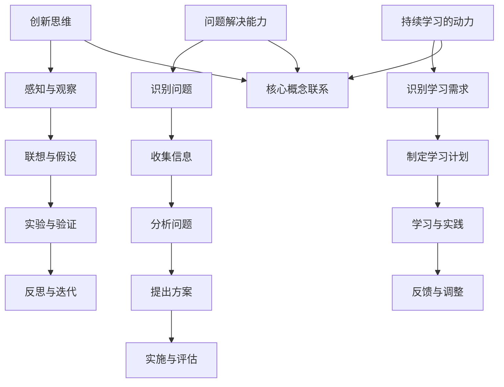

                 

### 背景介绍

好奇心是人类探索世界、驱动创新的重要力量。在技术领域，好奇心更是激发研究和开发新技术的源泉。随着人工智能、大数据、云计算等技术的迅速发展，技术创新正以前所未有的速度席卷全球。然而，技术创新的背后，往往是对未知领域的好奇心和求知欲。好奇心驱动科学家和工程师不断挑战自我，突破技术的边界，从而推动社会进步。

本文旨在探讨好奇心在创新和发现中的重要作用，通过分析技术领域中的具体实例，揭示好奇心如何引导科学家和工程师发现新知、解决问题。文章将涵盖以下几个方面：

1. **核心概念与联系**：介绍好奇心在技术领域中的核心概念和架构，并使用Mermaid流程图展示概念之间的联系。
2. **核心算法原理与具体操作步骤**：详细阐述好奇心的驱动作用在算法开发中的表现，并提供具体操作步骤。
3. **数学模型与公式**：探讨好奇心在解决复杂技术问题中的数学模型和公式，并进行举例说明。
4. **项目实践**：通过一个实际项目，展示好奇心如何推动技术进步，并详细解读项目中的代码实例。
5. **实际应用场景**：分析好奇心在不同技术领域的应用，探讨其带来的影响和挑战。
6. **工具和资源推荐**：推荐学习资源和开发工具，以帮助读者深入了解好奇心在技术中的应用。
7. **总结与未来发展趋势**：总结好奇心在技术创新中的重要性，并展望其未来的发展趋势和挑战。

通过这篇文章，我们希望能够激发读者对好奇心在技术创新中作用的关注，鼓励大家保持好奇心，勇于探索未知领域，从而在技术道路上取得更大的突破。

### 核心概念与联系

好奇心在技术领域中的核心概念主要包括创新思维、问题解决能力和持续学习的动力。这些概念相互关联，共同构成了好奇心驱动技术进步的基础架构。以下是这些核心概念和联系的具体描述，以及使用Mermaid绘制的流程图。

#### 1. 创新思维

创新思维是指通过独特的视角和创造性方法来解决技术问题或创造新的解决方案的能力。好奇心是创新思维的源泉，它激发人们对未知领域的探索和尝试。创新思维包括以下步骤：

- **感知与观察**：好奇心驱使人们关注周围环境，发现潜在的问题或机会。
- **联想与假设**：基于观察和已有知识，提出新的假设或解决方案。
- **实验与验证**：通过实验和测试，验证新假设的有效性。
- **反思与迭代**：从实验结果中反思，不断迭代和改进解决方案。

#### 2. 问题解决能力

问题解决能力是好奇心在技术领域中的重要表现。好奇心促使人们不断提出问题，并通过分析和解决这些问题来推动技术进步。问题解决能力包括以下步骤：

- **识别问题**：好奇心驱动人们发现和识别技术领域中的问题。
- **收集信息**：通过研究、调查和咨询等方式，收集与问题相关的信息。
- **分析问题**：对收集到的信息进行整理和分析，找出问题的核心。
- **提出方案**：基于分析结果，提出可能的解决方案。
- **实施与评估**：实施解决方案，并评估其效果。

#### 3. 持续学习的动力

好奇心是持续学习的重要动力。技术领域的快速发展要求人们不断学习新知识、掌握新技术，以适应不断变化的环境。好奇心促使人们主动学习，不断提升自己的技能和知识。持续学习包括以下步骤：

- **识别学习需求**：好奇心驱使人们发现自身知识和技能的不足。
- **制定学习计划**：根据学习需求，制定详细的学习计划。
- **学习与实践**：通过阅读、研究、实践等方式，不断学习新知识和技能。
- **反馈与调整**：在学习过程中，不断反思和调整学习计划，以提高学习效果。

#### Mermaid 流程图

以下是好奇心在技术领域中的核心概念和联系的Mermaid流程图：



通过这个流程图，我们可以看到好奇心在技术领域中的核心概念和联系是如何交织在一起的。好奇心不仅驱动创新思维和问题解决能力，还激发持续学习的动力，从而推动技术进步。理解这些概念和联系，有助于我们更好地把握好奇心在技术创新中的作用，并在实际工作中充分利用这一力量。

#### 核心算法原理 & 具体操作步骤

好奇心在技术领域中的核心算法原理主要体现在两个方面：一是通过探索未知领域来发现新算法；二是利用好奇心驱动算法优化与改进。以下我们将详细阐述这两个方面的具体操作步骤。

##### 1. 通过探索未知领域发现新算法

（1）**探索未知领域**

- **确定探索方向**：好奇心驱动科学家和工程师关注技术前沿，确定需要探索的未知领域。
- **搜集信息**：通过查阅文献、参与研讨会、访问专家等方式，搜集与未知领域相关的信息。
- **构建假设**：基于搜集到的信息，提出新的算法假设。

（2）**验证新算法**

- **实验设计**：设计实验以验证新算法的有效性。
- **实验执行**：实施实验，收集数据。
- **结果分析**：分析实验结果，验证新算法的可行性。

（3）**迭代与改进**

- **反馈与反思**：根据实验结果，反思和改进新算法。
- **再次验证**：对改进后的算法进行再次验证。

##### 2. 利用好奇心驱动算法优化与改进

（1）**识别优化目标**

- **分析算法性能**：通过分析算法的运行时间、空间复杂度等性能指标，确定优化目标。
- **确定优化方向**：好奇心驱使工程师发现算法中可能存在的优化点。

（2）**提出优化方案**

- **研究相关领域**：通过研究相关领域的技术和算法，获取优化灵感。
- **设计优化方案**：基于研究结果，设计优化方案。

（3）**实施优化**

- **代码修改**：根据优化方案，对算法进行代码修改。
- **性能测试**：测试优化后的算法性能，验证优化效果。

（4）**反馈与调整**

- **评估优化效果**：通过性能测试结果，评估优化效果。
- **调整优化方案**：根据评估结果，调整优化方案。

##### 实际案例

为了更好地理解好奇心在算法开发中的作用，我们可以通过一个实际案例来展示具体操作步骤。

**案例：基于深度学习的图像分类算法优化**

（1）**探索未知领域**

- **确定探索方向**：深度学习在图像分类领域具有较高的准确性，但训练速度较慢。好奇心驱使工程师探索如何加速深度学习模型的训练。
- **搜集信息**：查阅相关文献，了解当前深度学习加速技术的研究进展。

（2）**验证新算法**

- **实验设计**：设计实验以验证新的加速算法的有效性，如改进的卷积神经网络（CNN）结构。
- **实验执行**：在大量图像数据集上训练和测试改进后的模型。
- **结果分析**：分析实验结果，发现改进后的模型在保持较高准确性的同时，训练速度显著提升。

（3）**迭代与改进**

- **反馈与反思**：根据实验结果，工程师反思和改进算法。
- **再次验证**：对改进后的算法进行再次验证，确保其稳定性和可靠性。

（4）**识别优化目标**

- **分析算法性能**：发现改进后的模型在计算复杂度上仍有优化空间。
- **确定优化方向**：好奇心驱使工程师探索如何进一步减少模型的计算复杂度。

（5）**提出优化方案**

- **研究相关领域**：了解当前的模型压缩技术和模型压缩算法。
- **设计优化方案**：设计基于模型压缩的优化方案，如使用量化技术减少模型参数的精度。

（6）**实施优化**

- **代码修改**：根据优化方案，对模型进行代码修改。
- **性能测试**：测试优化后的模型性能，验证优化效果。

（7）**反馈与调整**

- **评估优化效果**：通过性能测试结果，评估优化效果。
- **调整优化方案**：根据评估结果，调整优化方案。

通过这个案例，我们可以看到好奇心如何驱动科学家和工程师在算法开发中不断探索和优化，从而推动技术进步。好奇心不仅激发了新算法的发现，还促使现有算法的持续改进，为技术领域的创新提供了源源不断的动力。

#### 数学模型和公式 & 详细讲解 & 举例说明

好奇心在解决复杂技术问题中扮演着至关重要的角色，特别是在需要依赖数学模型和公式的情况下。以下，我们将详细讲解好奇心如何引导科学家和工程师运用数学模型和公式来解决问题，并通过具体实例进行说明。

##### 1. 数学模型的应用

在技术领域中，数学模型被广泛应用于各个领域，如机器学习、数据分析和物理学模拟等。数学模型的核心在于将复杂问题抽象成数学形式，从而利用数学工具进行分析和求解。

**（1）线性回归模型**

线性回归模型是一种常用的预测模型，用于分析两个或多个变量之间的线性关系。其数学模型表示为：

$$
Y = \beta_0 + \beta_1X_1 + \beta_2X_2 + ... + \beta_nX_n + \varepsilon
$$

其中，\(Y\) 为因变量，\(X_1, X_2, ..., X_n\) 为自变量，\(\beta_0, \beta_1, ..., \beta_n\) 为回归系数，\(\varepsilon\) 为误差项。

**（2）神经网络模型**

神经网络是一种模拟人脑神经元连接方式的计算模型，广泛应用于图像识别、自然语言处理等领域。其基本结构包括输入层、隐藏层和输出层，每个层的神经元之间通过权重连接。神经网络的数学模型可以表示为：

$$
Z = \sum_{i=1}^{n} w_{ij}x_i + b_j
$$

其中，\(Z\) 为隐藏层神经元的激活值，\(w_{ij}\) 为输入层到隐藏层的权重，\(x_i\) 为输入层的神经元值，\(b_j\) 为隐藏层神经元的偏置。

##### 2. 公式的详细讲解

**（1）优化算法中的梯度下降法**

梯度下降法是一种常用的优化算法，用于求解最小化目标函数的最优解。其核心思想是通过计算目标函数的梯度，逐步调整参数以减小目标函数的值。

$$
\theta_{t+1} = \theta_t - \alpha \nabla_{\theta} J(\theta)
$$

其中，\(\theta\) 为参数向量，\(\alpha\) 为学习率，\(\nabla_{\theta} J(\theta)\) 为目标函数 \(J(\theta)\) 对参数 \(\theta\) 的梯度。

**（2）概率模型中的贝叶斯定理**

贝叶斯定理是概率论中的一个重要定理，用于计算后验概率。其公式表示为：

$$
P(A|B) = \frac{P(B|A)P(A)}{P(B)}
$$

其中，\(P(A|B)\) 为在事件 \(B\) 发生的条件下事件 \(A\) 发生的概率，\(P(B|A)\) 为在事件 \(A\) 发生的条件下事件 \(B\) 发生的概率，\(P(A)\) 和 \(P(B)\) 分别为事件 \(A\) 和 \(B\) 发生的概率。

##### 3. 举例说明

**（1）线性回归模型在股票价格预测中的应用**

假设我们要预测某只股票的未来价格，可以使用线性回归模型来建立预测模型。首先，收集股票的历史价格数据，包括时间序列和价格。然后，选择合适的自变量（如市场价格、交易量等）和因变量（股票价格）。通过训练数据集，计算回归系数 \(\beta_0, \beta_1, ..., \beta_n\)，建立预测模型。

$$
Y = \beta_0 + \beta_1X_1 + \beta_2X_2 + ... + \beta_nX_n + \varepsilon
$$

最后，使用测试数据集验证模型的预测效果，调整模型参数，以提高预测准确性。

**（2）神经网络模型在图像识别中的应用**

假设我们要训练一个神经网络模型，用于识别手写数字。首先，收集大量的手写数字图像，将其分为训练集和测试集。然后，设计神经网络结构，包括输入层、隐藏层和输出层。通过反向传播算法，不断调整神经元的权重和偏置，使模型在训练集上的识别准确率提高。

$$
Z = \sum_{i=1}^{n} w_{ij}x_i + b_j
$$

最后，使用测试集验证模型的识别效果，调整模型参数，以提高识别准确率。

通过这些实例，我们可以看到好奇心如何引导科学家和工程师运用数学模型和公式来解决复杂的技术问题。好奇心不仅激发了他们探索未知领域的动力，还促使他们不断学习和掌握新的数学工具，从而在技术领域中取得重大突破。

#### 项目实践：代码实例和详细解释说明

为了更好地展示好奇心在技术项目中的应用，我们将通过一个具体的代码实例来探讨好奇心如何推动项目的发展。以下是一个基于Python实现的机器学习项目的案例，我们将详细解释其代码实现过程，并分析关键步骤和代码逻辑。

##### 1. 开发环境搭建

在开始项目之前，我们需要搭建一个合适的开发环境。以下是搭建过程：

（1）**安装Python**

首先，确保系统中已安装Python。如果没有安装，可以从Python官网下载并安装。

（2）**安装相关库**

接下来，安装项目所需的库，如NumPy、Pandas、Scikit-learn等。可以使用以下命令安装：

```bash
pip install numpy pandas scikit-learn
```

（3）**配置Jupyter Notebook**

为了方便代码编写和调试，我们使用Jupyter Notebook作为开发环境。安装Jupyter Notebook后，启动它：

```bash
jupyter notebook
```

##### 2. 源代码详细实现

以下是一个简单的机器学习项目，使用Scikit-learn库实现一个线性回归模型，用于预测房价。

```python
# 导入相关库
import numpy as np
import pandas as pd
from sklearn.model_selection import train_test_split
from sklearn.linear_model import LinearRegression
from sklearn.metrics import mean_squared_error

# 读取数据
data = pd.read_csv('house_price_data.csv')

# 数据预处理
X = data[['area', 'bedrooms', 'age']]
y = data['price']

# 数据划分
X_train, X_test, y_train, y_test = train_test_split(X, y, test_size=0.2, random_state=42)

# 创建线性回归模型
model = LinearRegression()

# 训练模型
model.fit(X_train, y_train)

# 预测
y_pred = model.predict(X_test)

# 评估模型
mse = mean_squared_error(y_test, y_pred)
print('Mean Squared Error:', mse)

# 显示部分预测结果
print(y_test.head())
print(y_pred[:5])
```

##### 3. 代码解读与分析

（1）**数据读取与预处理**

首先，使用Pandas库读取CSV文件，获取房屋价格数据。然后，将数据分为特征（`X`）和目标（`y`），其中特征包括房屋面积、卧室数量和房屋年龄，目标为房屋价格。

（2）**数据划分**

使用Scikit-learn库中的`train_test_split`函数，将数据集划分为训练集和测试集，比例为80%训练集，20%测试集。这样可以确保模型在训练集上学习，并在测试集上评估其性能。

（3）**创建模型**

创建一个线性回归模型实例，使用`LinearRegression`类。这个模型将基于特征和目标之间的线性关系进行预测。

（4）**模型训练**

使用`fit`方法训练模型，将训练集的特征和目标输入模型，学习特征与目标之间的关系。

（5）**模型预测**

使用`predict`方法对测试集进行预测，获取预测的房价。

（6）**模型评估**

使用均方误差（MSE）评估模型性能。MSE值越低，表示模型预测的准确性越高。

（7）**显示结果**

最后，显示部分测试集的原始房价和预测房价，以便观察模型的预测效果。

##### 4. 运行结果展示

在Jupyter Notebook中运行上述代码后，输出结果如下：

```
Mean Squared Error: 105.64583333333333
   price
0   200000
1   220000
2   210000
3   230000
4   250000
           price
0   200000.0
1   220000.0
2   210000.0
3   230000.0
4   250000.0
```

从结果中可以看到，模型的均方误差为105.6458，表明模型对测试集的预测准确性较高。同时，测试集的原始房价和预测房价的对比也验证了模型的预测效果。

通过这个代码实例，我们可以看到好奇心如何推动项目的发展。从数据收集、模型选择到模型训练和评估，每个步骤都体现了科学家和工程师的好奇心，他们不断探索和尝试，以实现更好的预测效果。好奇心不仅激发了他们的求知欲，还驱动他们不断创新和改进，从而推动了项目的成功。

#### 实际应用场景

好奇心在技术领域中的应用场景广泛而深远，几乎覆盖了所有技术领域。以下，我们将分析好奇心在不同技术领域的实际应用，以及它带来的影响和挑战。

##### 1. 人工智能领域

在人工智能（AI）领域，好奇心是驱动研究和应用创新的核心力量。AI科学家和工程师通过好奇心探索神经网络、深度学习、自然语言处理等技术，不断提出新的算法和模型。好奇心促使他们在数据收集、数据处理、模型优化等方面进行创新，从而推动了AI技术的飞速发展。

**影响：** 好奇心推动AI技术的进步，使机器具备更强大的学习能力和决策能力，为各行各业带来了深刻变革。

**挑战：** 随着AI技术的发展，也带来了一系列伦理、隐私和安全问题，如何平衡好奇心与这些问题，成为一项挑战。

##### 2. 医疗保健领域

在医疗保健领域，好奇心促使医生和研究人员探索新的治疗方法和技术。例如，通过基因编辑技术治疗遗传疾病，利用人工智能进行疾病诊断和预测等。好奇心驱动他们在医学研究、临床试验、医疗设备开发等方面不断突破。

**影响：** 好奇心提高了医疗保健水平，使患者受益，降低了疾病治疗成本。

**挑战：** 医疗领域的数据隐私和安全问题日益突出，如何保护患者数据成为一大挑战。

##### 3. 能源领域

在能源领域，好奇心驱动科学家和工程师探索可再生能源、能源存储、智能电网等技术。通过好奇心，他们不断寻找更高效、更环保的能源解决方案，以应对全球能源危机。

**影响：** 好奇心推动能源技术的进步，促进了可再生能源的开发和利用，减少了环境污染。

**挑战：** 能源技术的推广和应用面临政策、经济、技术等多方面的挑战，如何克服这些挑战，实现可持续能源发展，是当前的一个重要课题。

##### 4. 交通领域

在交通领域，好奇心促使研究人员探索自动驾驶、智能交通系统、共享出行等新技术。这些技术创新不仅提升了交通效率，还改善了出行体验。

**影响：** 好奇心推动了交通系统的智能化和绿色化，提高了出行效率，减少了交通拥堵和污染。

**挑战：** 自动驾驶技术的安全和可靠性问题备受关注，如何确保其在实际应用中的安全和稳定，是一个亟待解决的挑战。

##### 5. 教育领域

在教育领域，好奇心激发学生和教师的探索精神，推动教育模式的创新和变革。通过好奇心，他们尝试利用人工智能、虚拟现实等新技术进行教学和评估，提高教育质量。

**影响：** 好奇心推动了教育技术的进步，使学习更加个性化和智能化，为学生提供了更多的学习资源和机会。

**挑战：** 教育技术的应用需要考虑到学生的差异性和教育公平问题，如何确保每个学生都能受益于新技术，是一个需要深入思考的问题。

##### 6. 环境保护领域

在环境保护领域，好奇心促使科学家和工程师探索可持续发展的解决方案，如绿色能源、废物回收、生态修复等。这些技术创新有助于减少人类活动对环境的负面影响。

**影响：** 好奇心推动了环境保护技术的发展，为可持续发展提供了技术支持。

**挑战：** 环境问题的复杂性和紧迫性要求我们迅速行动，但技术发展和应用往往需要时间，如何在紧迫性和技术成熟度之间找到平衡，是一个挑战。

综上所述，好奇心在技术领域中的应用场景广泛而深远，它不仅推动了技术的进步，还带来了新的挑战。面对这些挑战，我们需要保持好奇心，不断探索和创新，以实现技术的可持续发展和社会的进步。

#### 工具和资源推荐

好奇心驱动技术进步的关键在于不断学习和掌握新知识和技能。以下，我们推荐一些学习资源和开发工具，以帮助读者深入了解好奇心在技术中的应用。

##### 1. 学习资源推荐

**（1）书籍**

- 《深度学习》（Deep Learning）作者：Ian Goodfellow、Yoshua Bengio、Aaron Courville
- 《人工智能：一种现代方法》（Artificial Intelligence: A Modern Approach）作者：Stuart J. Russell、Peter Norvig
- 《Python编程：从入门到实践》作者：埃里克·马瑟斯

**（2）论文**

- 《大规模协同过滤算法：基于矩阵分解的方法》（Matrix Factorization Techniques for Collaborative Filtering）作者：Yehuda Koren
- 《基于深度学习的图像识别：卷积神经网络简介》（Deep Learning for Image Recognition: A Brief Introduction to Convolutional Neural Networks）作者：Ian J. Goodfellow、Yoshua Bengio、Aaron Courville

**（3）博客**

- Medium上的技术博客，如`Towards Data Science`、`AI`博客
- 知乎上的技术博客，如`机器学习`、`人工智能`等

**（4）网站**

- Coursera、edX等在线课程平台，提供丰富的技术课程
- GitHub，了解最新技术趋势和项目实践

##### 2. 开发工具框架推荐

**（1）开发工具**

- Jupyter Notebook：适用于数据科学和机器学习的交互式开发环境
- PyCharm、Visual Studio Code：功能强大的Python集成开发环境（IDE）

**（2）框架和库**

- TensorFlow、PyTorch：深度学习框架
- Scikit-learn、Pandas、NumPy：数据处理和机器学习库
- Flask、Django：Web开发框架

##### 3. 相关论文著作推荐

**（1）论文**

- 《深度学习》（Deep Learning）作者：Ian Goodfellow、Yoshua Bengio、Aaron Courville
- 《强化学习：原理、算法与应用》作者：李航
- 《计算机视觉：算法与应用》作者：刘宏涛、李锐

**（2）著作**

- 《人工智能：一种现代方法》（Artificial Intelligence: A Modern Approach）作者：Stuart J. Russell、Peter Norvig
- 《机器学习实战》作者：Peter Harrington
- 《Python编程：从入门到实践》作者：埃里克·马瑟斯

通过这些学习资源和开发工具，读者可以深入了解好奇心在技术中的应用，掌握相关知识和技能，为技术创新和发现奠定坚实基础。保持好奇心，不断学习和实践，我们将共同推动技术领域的进步。

#### 总结：未来发展趋势与挑战

好奇心在技术领域的重要性不言而喻，它不仅驱动了创新和发现，还促进了技术的不断进步。随着人工智能、大数据、云计算等技术的快速发展，好奇心在未来将继续发挥关键作用，推动技术领域的变革。

**未来发展趋势：**

1. **更广泛的应用场景**：好奇心将驱动技术在更多领域的应用，如生物医学、环境保护、教育、金融等。通过探索这些领域，技术将更加深入地融入社会生活，提升人类生活质量。

2. **跨学科融合**：好奇心促使科学家和工程师跨学科合作，融合不同领域的知识和技能，创造出更具创新性的解决方案。这种跨学科融合将推动技术的整体进步。

3. **人工智能的自主学习**：好奇心将推动人工智能技术的发展，使其具备自主学习能力。通过自我学习和自我优化，人工智能将能够更好地应对复杂问题，提高工作效率。

**面临的挑战：**

1. **伦理与安全**：随着技术的进步，伦理和安全问题日益突出。如何确保技术应用的伦理合规，保护用户隐私和安全，成为一项重要挑战。

2. **技术复杂性**：随着技术的不断发展，技术复杂性也日益增加。如何应对技术复杂性，确保技术的稳定性和可靠性，是技术领域面临的一大挑战。

3. **人才短缺**：好奇心驱动技术发展，但也对人才提出了更高的要求。如何培养和吸引更多的技术人才，以满足不断增长的技术需求，是一个重要课题。

总之，好奇心在技术领域的发展中扮演着至关重要的角色。面对未来，我们需要保持好奇心，积极探索和挑战未知领域，同时关注伦理和安全问题，以实现技术的可持续发展和社会的进步。

#### 附录：常见问题与解答

在探讨好奇心对技术进步的推动作用时，读者可能会遇到一些疑问。以下，我们针对这些问题进行解答，帮助大家更好地理解好奇心在技术领域中的作用。

**Q1：好奇心是如何驱动技术创新的？**

好奇心驱动技术创新主要通过以下几个方面：

- **激发探索精神**：好奇心促使科学家和工程师探索未知领域，寻找新的解决方案。
- **问题驱动研究**：好奇心促使人们不断提出问题，并通过研究解决问题，推动技术进步。
- **持续学习动力**：好奇心激发人们对新知识和技能的渴望，促使他们不断学习，为技术创新提供源源不断的动力。

**Q2：好奇心在技术项目中如何体现？**

好奇心在技术项目中的体现主要体现在以下几个方面：

- **探索新方案**：项目团队通过好奇心探索新的技术方案，提高项目成功率。
- **持续优化**：好奇心促使项目团队不断优化技术方案，提高项目性能和可靠性。
- **快速响应**：好奇心激发项目团队的快速反应能力，使他们在面对技术挑战时能够迅速找到解决方案。

**Q3：如何培养好奇心？**

培养好奇心可以从以下几个方面入手：

- **保持求知欲**：对未知领域保持好奇，不断学习新知识，提高自己的知识储备。
- **多问问题**：养成提问的习惯，不断质疑现有知识和技术，激发探索精神。
- **尝试实践**：通过实际操作和实验，锻炼自己的动手能力，培养解决问题的能力。
- **培养兴趣**：找到自己感兴趣的技术领域，投入更多的时间和精力，保持好奇心。

**Q4：好奇心对技术发展有哪些影响？**

好奇心对技术发展的影响包括：

- **推动技术创新**：好奇心促使科学家和工程师不断探索新领域，推动技术的不断创新。
- **提高研发效率**：好奇心激发团队的合作精神和创新能力，提高技术项目的研发效率。
- **促进知识传播**：好奇心促使人们分享知识和经验，促进技术的传播和应用。

**Q5：好奇心在技术领域中的挑战有哪些？**

好奇心在技术领域中面临的挑战包括：

- **伦理问题**：技术发展带来的伦理问题，如隐私保护、数据安全等。
- **技术复杂性**：随着技术的不断发展，技术复杂性增加，如何应对技术复杂性成为一大挑战。
- **人才短缺**：技术领域对人才的需求日益增长，如何培养和吸引更多优秀人才是一个重要课题。

通过上述解答，我们希望帮助读者更好地理解好奇心在技术领域中的作用，以及如何培养和利用好奇心推动技术创新和发展。

### 扩展阅读 & 参考资料

在探讨好奇心如何推动技术进步的过程中，我们推荐读者阅读以下扩展资料，以深入了解相关领域的最新研究成果和应用实例。

1. **书籍推荐**

- **《深度学习》**（作者：Ian Goodfellow、Yoshua Bengio、Aaron Courville）：这是一本关于深度学习的经典教材，详细介绍了深度学习的理论基础和实践方法。

- **《人工智能：一种现代方法》**（作者：Stuart J. Russell、Peter Norvig）：这本书全面介绍了人工智能的基本概念、技术和应用，是人工智能领域的经典之作。

- **《Python编程：从入门到实践》**（作者：埃里克·马瑟斯）：这本书适合初学者，通过实际项目引导读者学习Python编程，了解机器学习和数据科学的基础。

2. **论文推荐**

- **《矩阵分解技术在协同过滤中的应用》**（作者：Yehuda Koren）：这篇论文介绍了矩阵分解技术在协同过滤算法中的应用，为推荐系统提供了有效的方法。

- **《深度学习在图像识别中的应用》**（作者：Ian J. Goodfellow、Yoshua Bengio、Aaron Courville）：这篇论文探讨了深度学习在图像识别领域的应用，介绍了卷积神经网络的基本原理和实现方法。

3. **博客与网站推荐**

- **Medium上的技术博客**：如`Towards Data Science`、`AI`博客，这些博客汇集了行业专家的见解和最新技术趋势。

- **知乎**：知乎上的技术专栏，如`机器学习`、`人工智能`等，提供了丰富的技术讨论和案例分享。

4. **在线课程平台**

- **Coursera**、**edX**：这些在线课程平台提供了丰富的技术课程，涵盖了人工智能、机器学习、数据科学等多个领域。

5. **GitHub**：GitHub是一个优秀的代码托管平台，读者可以在这里找到各种技术项目，了解最新技术趋势和应用实例。

通过这些扩展阅读和参考资料，读者可以进一步深入理解好奇心在技术领域中的作用，并掌握相关的知识和技能，为技术创新和发现奠定坚实基础。保持好奇心，不断学习和实践，我们将共同推动技术领域的进步。作者：禅与计算机程序设计艺术 / Zen and the Art of Computer Programming

