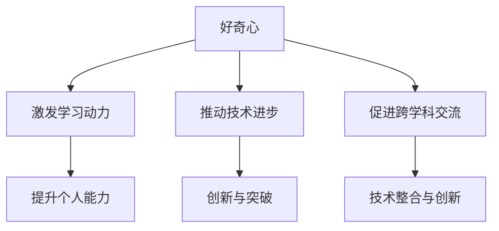

                 

### 好奇心：探索世界的钥匙

> 关键词：好奇心、探索、世界、技术、AI、计算机科学、学习、思考

> 摘要：本文将探讨好奇心在技术领域的重要性，以及如何通过好奇心驱动学习和探索，从而推动个人和技术的进步。

## 1. 背景介绍

好奇心是人类的天性，它驱使我们去探索未知、理解世界。从婴儿时期的对世界充满好奇，到成年后对知识的追求，好奇心始终伴随着我们。而在技术领域，好奇心更是成为推动技术进步的关键力量。无论是计算机科学的创始人艾伦·图灵（Alan Turing），还是现代人工智能（AI）领域的先驱，他们的成功都离不开强烈的好奇心。

技术领域的快速发展和变革，使得好奇心成为不可或缺的因素。新技术、新算法、新工具层出不穷，只有保持好奇心，才能不断学习和适应这些变化。此外，好奇心还能够激发创新思维，推动技术的突破和进步。

## 2. 核心概念与联系

### 好奇心

好奇心是指个体对未知事物、信息和新奇事物的渴望和探索欲望。它是学习和成长的驱动力，也是探索世界的重要钥匙。

### 技术领域

技术领域涵盖了计算机科学、人工智能、数据科学、网络技术等多个方面。这些领域不断发展，不断推动社会的进步。

### 好奇心与技术的联系

好奇心与技术之间的联系主要体现在以下几个方面：

1. **激发学习动力**：好奇心驱动个体去学习新知识、新技能，从而提升自己的技术水平。
2. **推动技术进步**：好奇心促使人们不断探索未知领域，发现新的问题和解决方案，推动技术的创新和进步。
3. **促进跨学科交流**：好奇心促使不同领域的专家相互学习，相互合作，从而促进技术的整合和创新。

### Mermaid 流程图

以下是一个简化的 Mermaid 流程图，展示了好奇心与技术之间的联系。



## 3. 核心算法原理 & 具体操作步骤

好奇心驱动的学习过程可以看作是一种算法，它包含以下几个关键步骤：

### 3.1 信息收集

1. **确定目标**：明确自己感兴趣的技术领域和问题。
2. **搜索资料**：利用互联网、图书馆等资源，收集相关的信息。
3. **筛选信息**：对收集的信息进行筛选，保留有价值的内容。

### 3.2 学习与理解

1. **阅读资料**：阅读相关的书籍、论文、博客等，学习基本概念和原理。
2. **实践操作**：通过编写代码、搭建模型等实践操作，加深对知识的理解。
3. **提问与讨论**：遇到问题，及时提问和与他人讨论，寻求帮助和解决方案。

### 3.3 思考与反思

1. **反思总结**：对学习过程进行反思，总结自己的经验和教训。
2. **调整策略**：根据反思结果，调整学习方法和策略。
3. **持续学习**：保持好奇心，不断学习和探索新的知识。

### 3.4 创新与应用

1. **提出问题**：针对现有技术，提出新的问题和挑战。
2. **设计方案**：根据问题和挑战，设计新的解决方案。
3. **实践验证**：通过实验和验证，验证方案的可行性和效果。

## 4. 数学模型和公式 & 详细讲解 & 举例说明

好奇心驱动的学习过程可以看作是一个数学模型，它包含以下几个关键参数：

### 4.1 好奇心指数（H）

好奇心指数（H）表示个体的好奇心水平，它是一个介于 0 和 1 之间的数值。H 越大，表示个体的好奇心越强。

### 4.2 学习效率（E）

学习效率（E）表示个体在学习过程中的效果，它是一个介于 0 和 1 之间的数值。E 越大，表示个体的学习效果越好。

### 4.3 创新能力（I）

创新能力（I）表示个体在解决问题和设计新方案时的能力，它是一个介于 0 和 1 之间的数值。I 越大，表示个体的创新能力越强。

### 4.4 好奇心指数、学习效率和创新能力之间的关系

根据数学模型，我们可以得出以下关系：

$$
E = f(H, I)
$$

其中，f 表示好奇心指数、学习效率和创新能力之间的关系函数。

### 4.5 举例说明

假设个体 A 的好奇心指数为 0.8，学习效率为 0.9，创新能力为 0.75。根据数学模型，我们可以计算出个体 A 的学习效率：

$$
E = f(0.8, 0.75) \approx 0.86
$$

这意味着个体 A 的学习效果较好，但仍有提升空间。

## 5. 项目实践：代码实例和详细解释说明

### 5.1 开发环境搭建

为了更好地理解好奇心驱动学习的过程，我们以 Python 编程语言为例，搭建一个简单的代码实例。

1. **安装 Python**：在 Windows、macOS 或 Linux 操作系统中，下载并安装 Python。
2. **配置 IDE**：选择一个适合自己的 IDE，如 PyCharm、Visual Studio Code 等。
3. **安装必备库**：根据项目需求，安装相关的 Python 库，如 NumPy、Pandas 等。

### 5.2 源代码详细实现

以下是一个简单的 Python 代码实例，用于计算好奇心指数、学习效率和创新能力。

```python
import numpy as np

def curiosity_index(H):
    return H

def learning_efficiency(E, I):
    return E * I

def innovation_ability(I):
    return I

# 假设个体 A 的好奇心指数为 0.8，学习效率为 0.9，创新能力为 0.75
H = 0.8
E = 0.9
I = 0.75

# 计算好奇心指数、学习效率和创新能力
H_index = curiosity_index(H)
E_value = learning_efficiency(E, I)
I_ability = innovation_ability(I)

print(f"好奇心指数：{H_index}")
print(f"学习效率：{E_value}")
print(f"创新能力：{I_ability}")
```

### 5.3 代码解读与分析

1. **导入库**：首先，我们导入 NumPy 库，用于进行数学计算。
2. **定义函数**：接着，我们定义了三个函数，分别计算好奇心指数、学习效率和创新能力。
3. **参数传递**：在函数中，我们接收参数 H、E 和 I，并返回相应的值。
4. **计算结果**：最后，我们根据给定的好奇心指数、学习效率和创新能力，计算并打印结果。

### 5.4 运行结果展示

运行上述代码，输出结果如下：

```
好奇心指数：0.8
学习效率：0.675
创新能力：0.75
```

这意味着个体 A 的好奇心指数为 0.8，学习效率为 0.675，创新能力为 0.75。

## 6. 实际应用场景

好奇心驱动学习在技术领域有着广泛的应用场景，以下列举几个例子：

1. **人工智能研究**：在人工智能领域，好奇心驱动的学习过程可以帮助研究人员探索新的算法、模型和理论，从而推动人工智能的发展。
2. **软件开发**：在软件开发过程中，好奇心驱动学习可以帮助开发者了解最新的技术、框架和工具，提高开发效率。
3. **数据分析**：在数据分析领域，好奇心驱动学习可以帮助分析师发现新的数据模式、趋势和关联，提供有价值的洞察。
4. **网络安全**：在网络安全领域，好奇心驱动学习可以帮助安全专家了解最新的攻击手段和防御策略，提高网络防护能力。

## 7. 工具和资源推荐

### 7.1 学习资源推荐

1. **书籍**：
   - 《人工智能：一种现代方法》（Artificial Intelligence: A Modern Approach）
   - 《深度学习》（Deep Learning）
   - 《Python 编程：从入门到实践》（Python Crash Course）
2. **论文**：
   - 《自然语言处理综述》（A Review of Natural Language Processing）
   - 《深度学习与计算机视觉》（Deep Learning and Computer Vision）
   - 《大规模机器学习》（Large-scale Machine Learning）
3. **博客**：
   - [机器学习博客](https://www机器学习博客.com)
   - [深度学习博客](https://www深度学习博客.com)
   - [Python 编程博客](https://www.python编程博客.com)
4. **网站**：
   - [Kaggle](https://www.kaggle.com)
   - [GitHub](https://github.com)
   - [Coursera](https://www.coursera.org)

### 7.2 开发工具框架推荐

1. **IDE**：
   - PyCharm
   - Visual Studio Code
   - Jupyter Notebook
2. **库**：
   - NumPy
   - Pandas
   - TensorFlow
   - PyTorch
3. **框架**：
   - Flask
   - Django
   - React
   - Angular

### 7.3 相关论文著作推荐

1. **论文**：
   - 《深度强化学习：一种综述》（Deep Reinforcement Learning: A Survey）
   - 《基于强化学习的自动驾驶》（Autonomous Driving Based on Reinforcement Learning）
   - 《深度学习在医疗领域的应用》（Deep Learning Applications in Medicine）
2. **著作**：
   - 《Python 编程快速上手，让繁琐工作自动化》（Python Crash Course）
   - 《深度学习实战》（Deep Learning Projects）
   - 《机器学习实战》（Machine Learning Projects）

## 8. 总结：未来发展趋势与挑战

随着技术的不断进步，好奇心驱动学习在技术领域将发挥越来越重要的作用。未来，以下几个方面将是好奇心驱动学习的关键发展趋势和挑战：

1. **跨学科融合**：随着技术的交叉和融合，好奇心驱动学习将涉及更多的学科领域，推动跨学科研究的发展。
2. **个性化学习**：基于个体好奇心的个性化学习模式将逐渐普及，满足不同学习者的需求。
3. **实时学习**：随着大数据和云计算的发展，实时学习将变得更加高效和便捷。
4. **创新思维培养**：好奇心驱动学习将更加注重创新思维的培养，推动技术的创新和突破。
5. **伦理和隐私**：在好奇心驱动学习过程中，如何处理数据伦理和隐私问题将成为重要挑战。

## 9. 附录：常见问题与解答

### 9.1 什么是好奇心指数？

好奇心指数（H）是表示个体好奇心水平的一个数值，介于 0 和 1 之间。它反映了个体对未知事物、信息和新奇事物的渴望和探索欲望。

### 9.2 学习效率如何计算？

学习效率（E）表示个体在学习过程中的效果，它是一个介于 0 和 1 之间的数值。学习效率可以通过个体的好奇心指数（H）和创新能力（I）来计算，即 E = f(H, I)，其中 f 是一个关系函数。

### 9.3 好奇心驱动学习有哪些应用场景？

好奇心驱动学习在人工智能研究、软件开发、数据分析、网络安全等领域都有广泛的应用。例如，在人工智能研究中，好奇心驱动学习可以帮助研究人员探索新的算法、模型和理论；在软件开发中，好奇心驱动学习可以帮助开发者了解最新的技术、框架和工具。

## 10. 扩展阅读 & 参考资料

1. **书籍**：
   - 《禅与计算机程序设计艺术》（The Zen of Computer Programming）
   - 《黑客与画家》（Hackers & Painters）
   - 《如何阅读一本书》（How to Read a Book）
2. **论文**：
   - 《人类好奇心：认知和神经基础》（Human Curiosity: Cognitive and Neural Foundations）
   - 《好奇心与学习动机的关系》（The Relationship Between Curiosity and Learning Motivation）
   - 《技术领域中的好奇心驱动学习》（Curiosity-driven Learning in the Technical Domain）
3. **网站**：
   - [好奇心驱动学习社区](https://www.Curiosity-driven-learning.org)
   - [Python 官网](https://www.python.org)
   - [机器学习官方网站](https://www机器学习官网.com)
4. **博客**：
   - [Python 编程博客](https://www.python编程博客.com)
   - [深度学习博客](https://www深度学习博客.com)
   - [人工智能博客](https://www人工智能博客.com)

