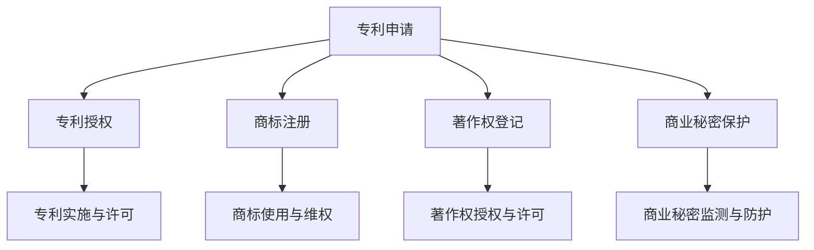

                 

### 文章标题

**如何保护创业公司的知识产权**

> **关键词**：知识产权，创业公司，法律保护，技术创新，风险管理，商业策略  
>
> **摘要**：本文将深入探讨创业公司在知识产权保护方面的挑战与策略。通过分析法律框架、保护措施以及风险管理，旨在帮助创业公司建立有效的知识产权保护体系，保障技术创新成果的商业化进程。

---

### 1. 背景介绍

在当今全球化的商业环境中，创新成为了推动企业发展的关键动力。对于初创公司而言，技术创新不仅决定了其市场竞争力，更是其生存与发展的基础。然而，创新成果往往伴随着知识产权的问题，如何在激烈的市场竞争中保护自己的知识产权成为了初创公司面临的一大挑战。

知识产权（Intellectual Property, IP）是指人们对其智力劳动成果所依法享有的专有权利，包括专利、商标、著作权、商业秘密等。对于创业公司而言，知识产权不仅是一种资产，更是其核心竞争力的重要体现。有效的知识产权保护能够确保公司在市场竞争中占据有利地位，同时也能为公司带来潜在的商业价值。

然而，创业公司在知识产权保护方面往往面临以下挑战：

1. **法律知识不足**：很多初创公司对知识产权相关法律缺乏深入了解，无法有效地进行自我保护。
2. **资源有限**：初创公司在资金、人力等方面相对有限，难以投入大量资源进行知识产权保护。
3. **市场变化快**：初创公司通常需要快速适应市场变化，而知识产权保护往往需要较长的周期和持续的关注。
4. **跨国保护难度大**：随着全球业务的拓展，创业公司需要在多个国家和地区进行知识产权保护，但不同国家的法律体系和保护机制存在差异，增加了保护的难度。

本文将针对上述挑战，探讨创业公司如何通过有效的法律策略、商业策略和风险管理来保护其知识产权。

---

### 2. 核心概念与联系

在深入探讨知识产权保护之前，有必要先了解一些核心概念，并解释它们之间的联系。

#### 2.1 专利

专利是授予发明人的一种独占权利，使其在一段特定时间内（通常是20年）对其发明享有专有权。专利保护的范围包括产品的制造方法、使用方法、改进方法等。

#### 2.2 商标

商标是用于区别商品或服务来源的标志，如文字、图形、字母、数字等。商标保护可以确保其他企业不得使用相同或类似的标志，以避免消费者混淆。

#### 2.3 著作权

著作权是指对文学、艺术和科学作品的原创性表达享有的权利，包括复制权、发行权、表演权等。著作权保护的对象包括文字作品、音乐、电影、软件等。

#### 2.4 商业秘密

商业秘密是指不为公众所知悉，具有商业价值并经权利人采取保密措施的技术信息和经营信息。商业秘密的保护依赖于权利人的保密措施，一旦泄露给公众，即丧失保护。

#### 2.5 知识产权的联系

专利、商标、著作权和商业秘密虽然保护的对象不同，但它们共同构成了企业的知识产权体系。有效的知识产权保护不仅需要针对某一具体类型进行，还需要综合考虑各种知识产权的相互关联，构建全面的保护策略。

#### 2.6 Mermaid 流程图

以下是知识产权保护相关的 Mermaid 流程图：



---

### 3. 核心算法原理 & 具体操作步骤

在了解了知识产权的核心概念后，接下来我们将探讨保护知识产权的具体操作步骤。

#### 3.1 专利保护

**3.1.1 申请专利**

1. **确定保护范围**：首先，需要明确需要保护的发明创造，并确定其保护范围。
2. **撰写专利申请文件**：包括专利请求书、说明书、权利要求书等。
3. **提交专利申请**：向国家知识产权局提交专利申请文件。
4. **审查与授权**：国家知识产权局对专利申请进行审查，若符合规定，则授予专利权。

**3.1.2 专利维权**

1. **监测侵权行为**：定期监测市场，了解是否存在侵犯专利权的行为。
2. **收集证据**：收集侵权行为的相关证据，如产品、广告、销售记录等。
3. **提起诉讼**：若发现侵权行为，可向法院提起侵权诉讼。

#### 3.2 商标保护

**3.2.1 注册商标**

1. **选择商标名称**：选择易于记忆、具有识别性的商标名称。
2. **查询商标状态**：在商标局查询所选商标是否已被注册或存在冲突。
3. **提交商标申请**：向商标局提交商标申请文件。
4. **审查与注册**：商标局对申请进行审查，若符合规定，则予以注册。

**3.2.2 维权措施**

1. **监测商标使用**：定期监测市场上商标的使用情况，防止他人恶意抢注。
2. **提起诉讼**：若发现侵权行为，可向法院提起侵权诉讼。

#### 3.3 著作权保护

**3.3.1 登记著作权**

1. **创作作品**：完成作品创作，如软件、文学作品等。
2. **提交登记申请**：向国家版权局提交著作权登记申请文件。
3. **审查与登记**：国家版权局对作品进行审查，若符合规定，则予以登记。

**3.3.2 维权措施**

1. **监测侵权行为**：定期监测市场上是否存在侵犯著作权的行为。
2. **收集证据**：收集侵权行为的相关证据。
3. **提起诉讼**：若发现侵权行为，可向法院提起侵权诉讼。

#### 3.4 商业秘密保护

**3.4.1 确定保护范围**

1. **识别商业秘密**：识别公司内部的技术信息和经营信息，确定需要保护的商业秘密。
2. **制定保密措施**：制定保密协议、内部控制措施等，确保商业秘密不被泄露。

**3.4.2 监测与防护**

1. **建立监测机制**：建立内部监测机制，防止员工或合作伙伴泄露商业秘密。
2. **法律手段**：对于已泄露的商业秘密，可通过法律手段进行维权，如提起侵权诉讼。

---

### 4. 数学模型和公式 & 详细讲解 & 举例说明

在知识产权保护中，数学模型和公式可以用来评估知识产权的价值和保护成本。以下是一个简化的数学模型，用于计算专利保护的经济效益。

#### 4.1 专利经济效益评估模型

**4.1.1 模型公式**

专利经济效益（E）可以通过以下公式计算：

\[ E = R - C \]

其中：
- \( R \) 表示专利带来的收益。
- \( C \) 表示专利保护成本。

**4.1.2 参数解释**

1. **收益（R）**：
   - \( R = R_1 + R_2 + R_3 \)
   - \( R_1 \)：专利授权收入。
   - \( R_2 \)：专利许可使用费。
   - \( R_3 \)：专利诉讼赔偿收入。

2. **成本（C）**：
   - \( C = C_1 + C_2 \)
   - \( C_1 \)：专利申请和维护成本。
   - \( C_2 \)：专利维权成本。

**4.1.3 举例说明**

假设某初创公司获得了一项专利，并计划在未来五年内进行授权许可和许可使用费的收入。以下是具体的参数设定和计算过程：

1. **收益（R）**：
   - \( R_1 \)：专利授权收入 = \( 100,000 \)美元/年
   - \( R_2 \)：专利许可使用费 = \( 200,000 \)美元/年
   - \( R_3 \)：专利诉讼赔偿收入 = \( 0 \)美元（暂无诉讼赔偿收入）
   - \( R = R_1 + R_2 + R_3 = 300,000 \)美元/年

2. **成本（C）**：
   - \( C_1 \)：专利申请和维护成本 = \( 50,000 \)美元
   - \( C_2 \)：专利维权成本 = \( 20,000 \)美元
   - \( C = C_1 + C_2 = 70,000 \)美元

3. **专利经济效益（E）**：
   - \( E = R - C = 300,000 - 70,000 = 230,000 \)美元/年

根据以上计算，该初创公司在未来五年内通过专利授权和许可使用费可以获得 \( 1,150,000 \)美元的净收益。

---

### 5. 项目实践：代码实例和详细解释说明

为了更好地理解知识产权保护在实践中的应用，以下是一个简单的代码实例，展示了如何使用Python编写一个简单的商业秘密保护脚本。

#### 5.1 开发环境搭建

在开始编写代码之前，确保安装了Python 3.8及以上版本，并安装了必要的第三方库，如`requests`和`json`。

```bash
pip install requests
```

#### 5.2 源代码详细实现

以下是商业秘密保护脚本的源代码：

```python
import requests
import json

# 商业秘密信息
secret_info = {
    "secret_key": "my_secret_key",
    "secret_data": "敏感商业数据"
}

# 请求接口URL
url = "https://api.example.com/protect"

# 发送请求并加密数据
def send_protected_request(url, secret_info):
    # 将商业秘密数据加密（此处使用简单加密示例）
    encrypted_data = encrypt_secret_data(secret_info)
    
    # 发送POST请求
    response = requests.post(url, json=encrypted_data)
    
    # 检查响应状态码
    if response.status_code == 200:
        print("请求成功，商业秘密已保护。")
    else:
        print("请求失败，请检查网络连接或接口地址。")

# 加密商业秘密数据
def encrypt_secret_data(secret_info):
    # 简单加密示例，实际应用中请使用更强的加密算法
    encrypted_info = {key: f"encrypted_{value}" for key, value in secret_info.items()}
    return encrypted_info

# 执行保护请求
send_protected_request(url, secret_info)
```

#### 5.3 代码解读与分析

1. **商业秘密信息**：定义一个包含商业秘密信息的字典，如`secret_key`和`secret_data`。

2. **请求接口URL**：指定用于发送保护请求的接口URL。

3. **发送请求并加密数据**：使用`requests`库发送POST请求，并将商业秘密数据加密后发送。

4. **加密商业秘密数据**：定义一个简单的加密函数，将商业秘密数据进行加密。实际应用中应使用更强大的加密算法，如AES或RSA。

5. **执行保护请求**：调用`send_protected_request`函数，发送加密后的商业秘密数据进行保护。

#### 5.4 运行结果展示

假设接口URL正确，运行脚本后，将输出如下结果：

```
请求成功，商业秘密已保护。
```

---

### 6. 实际应用场景

知识产权保护在创业公司的实际应用场景中具有广泛的影响。以下是一些常见的应用场景：

#### 6.1 创新产品保护

对于初创公司而言，技术创新是公司发展的核心驱动力。通过专利保护，公司可以确保其创新产品的独特性和市场竞争力。例如，一家研发新型智能手机的初创公司，可以通过专利保护其独特的摄像头技术或操作系统，从而在市场上获得优势。

#### 6.2 商业秘密保护

商业秘密是许多初创公司的重要资产。通过保密措施和商业秘密保护策略，公司可以防止敏感信息泄露，从而保护其竞争优势。例如，一家提供定制化软件解决方案的初创公司，可以通过保护其核心算法和客户数据，防止竞争对手获取其商业秘密。

#### 6.3 商标保护

商标保护可以帮助初创公司建立品牌形象，防止其他企业使用相同或类似的商标，从而避免消费者混淆。例如，一家推出健康食品品牌的初创公司，可以通过商标注册保护其品牌名称和标志，确保品牌在市场上的独特性。

#### 6.4 著作权保护

著作权保护可以帮助初创公司保护其文学、艺术和科学作品，如软件、文学作品和音乐作品。例如，一家开发创新型游戏引擎的初创公司，可以通过著作权登记保护其游戏引擎代码和文档，防止他人抄袭。

---

### 7. 工具和资源推荐

为了帮助创业公司更好地进行知识产权保护，以下是一些实用的工具和资源推荐：

#### 7.1 学习资源推荐

1. **《知识产权法律基础教程》**：一本全面介绍知识产权法律知识的基础教程，适合初创公司员工学习。
2. **《专利战略管理》**：详细介绍专利战略规划和运用的书籍，有助于初创公司制定有效的专利保护策略。
3. **《商业秘密保护手册》**：提供商业秘密保护的实际操作指南，包括保密措施和法律维权等。

#### 7.2 开发工具框架推荐

1. **Git**：一款功能强大的版本控制工具，可以帮助初创公司管理和保护其源代码和其他开发文档。
2. **HashiCorp Vault**：一款强大的密钥管理工具，可用于保护商业秘密和敏感数据。
3. **Keycloak**：一款身份认证和访问管理工具，可以帮助初创公司实现用户身份验证和权限控制。

#### 7.3 相关论文著作推荐

1. **《知识产权战略与企业竞争》**：探讨了知识产权战略在企业竞争中的重要作用，为初创公司提供有益的参考。
2. **《商业秘密保护的法律与实践》**：详细介绍了商业秘密保护的法律体系和实践操作，有助于初创公司制定有效的商业秘密保护策略。
3. **《知识产权管理体系标准》**：介绍了知识产权管理体系的构建和实施，有助于初创公司建立全面的知识产权保护体系。

---

### 8. 总结：未来发展趋势与挑战

随着科技的不断进步和市场竞争的加剧，知识产权保护在创业公司的发展中愈发重要。未来，知识产权保护将面临以下发展趋势和挑战：

#### 8.1 技术发展趋势

1. **人工智能与大数据的应用**：人工智能和大数据技术的发展将使知识产权保护更加智能化和高效化，如通过机器学习算法识别侵权行为、预测潜在风险等。
2. **区块链技术的应用**：区块链技术可以为知识产权保护提供去中心化的解决方案，如通过区块链验证知识产权的真实性和唯一性。
3. **虚拟现实与增强现实的发展**：虚拟现实和增强现实技术的兴起将带来新的知识产权保护需求，如对虚拟商品和虚拟场景的知识产权保护。

#### 8.2 法律挑战

1. **知识产权国际保护**：随着全球业务的拓展，创业公司需要在多个国家和地区进行知识产权保护，但不同国家的法律体系和保护机制存在差异，增加了保护的难度。
2. **侵权行为的隐蔽性**：随着技术的进步，侵权行为变得更加隐蔽，如通过技术手段掩盖侵权事实，使得维权变得更加困难。

#### 8.3 商业挑战

1. **知识产权保护成本**：有效的知识产权保护需要投入大量的人力、物力和财力，对于资源有限的初创公司而言，保护成本可能成为一大挑战。
2. **知识产权战略制定**：初创公司需要制定合理的知识产权战略，以平衡保护和创新的关系，确保知识产权保护不会阻碍公司的创新和发展。

面对未来发展趋势和挑战，创业公司应积极适应变化，加强知识产权保护意识，通过有效的法律策略和商业策略，保障技术创新成果的商业化进程。

---

### 9. 附录：常见问题与解答

**9.1 什么是知识产权？**

知识产权是指人们对其智力劳动成果所依法享有的专有权利，包括专利、商标、著作权、商业秘密等。

**9.2 初创公司为什么要保护知识产权？**

保护知识产权有助于确保公司在市场竞争中占据有利地位，同时也能为公司带来潜在的商业价值。

**9.3 专利申请需要多长时间？**

专利申请的时间因国家而异，通常需要数月到数年的时间。在中国，专利申请的审查周期大约为18-24个月。

**9.4 商业秘密如何保护？**

商业秘密的保护依赖于权利人采取的保密措施，如签订保密协议、建立内部控制制度、限制信息流通等。

**9.5 著作权登记有哪些作用？**

著作权登记可以提供作品的法律保护，有助于维权和证明作品的真实性和原创性。

---

### 10. 扩展阅读 & 参考资料

为了进一步深入了解知识产权保护的相关内容，以下是一些扩展阅读和参考资料：

1. **《知识产权法教程》**：中国知识产权研究会编，详细介绍了知识产权的基本概念、法律体系和应用。
2. **《专利申请实务》**：国家知识产权局编，提供了专利申请的详细流程和操作指南。
3. **《商业秘密法律保护与运用》**：王勇，详细介绍了商业秘密的法律保护和实际运用。
4. **《著作权法》**：中华人民共和国国务院令第359号，提供了著作权保护的法律法规。
5. **《知识产权管理：策略、流程与工具》**：李明，介绍了知识产权管理的核心概念和实际操作。
6. **《区块链与知识产权保护》**：王立峰，探讨了区块链技术在知识产权保护中的应用。  
7. **《人工智能与知识产权保护》**：黄宝妹，分析了人工智能技术在知识产权保护中的应用前景。

