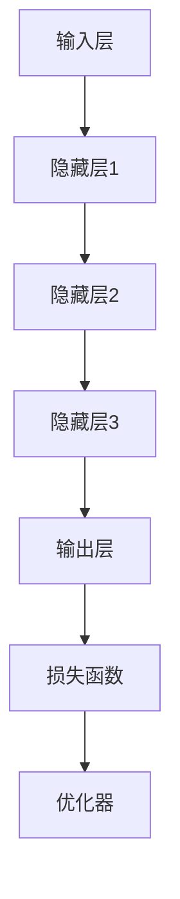
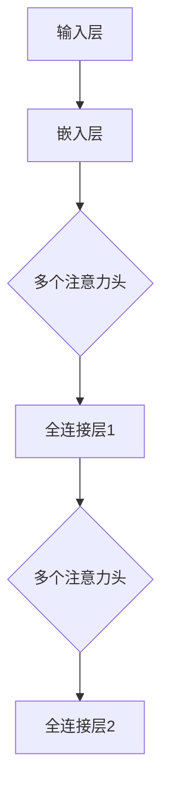

                 

### 文章标题

**如何利用AI大模型开发创新产品**

> **关键词**：人工智能，AI大模型，产品开发，创新，技术实现，实践案例，数学模型，代码实例

> **摘要**：本文将深入探讨如何利用AI大模型开发创新产品。我们将从背景介绍开始，逐步分析核心概念与联系，讲解核心算法原理和操作步骤，阐述数学模型和公式，并给出详细的代码实例和运行结果展示。此外，我们还将探讨实际应用场景，推荐相关工具和资源，并总结未来发展趋势与挑战。通过本文的阐述，读者将了解如何充分利用AI大模型的优势，实现产品的创新开发。

---

### 1. 背景介绍

近年来，人工智能（AI）技术取得了显著的进步，尤其是大模型（Large Models）的发展，为各个领域带来了前所未有的机遇。大模型，如OpenAI的GPT-3、BERT等，具有强大的表示和生成能力，能够在各种任务中表现出色。这些模型不仅能够处理复杂的自然语言，还能够进行图像、语音等多种形式的数据处理。

在产品开发中，AI大模型的应用范围越来越广。例如，自然语言处理（NLP）中的聊天机器人、内容生成、机器翻译；计算机视觉（CV）中的图像识别、目标检测、图像生成；语音识别中的语音合成、语音识别等。这些应用不仅提高了产品的性能和用户体验，还为产品创新提供了新的思路。

然而，利用AI大模型开发创新产品并非易事。一方面，大模型需要大量的数据、计算资源和时间进行训练；另一方面，如何有效地利用这些模型，开发出具有竞争力的产品，仍需要深入的研究和实践。

本文旨在通过系统地介绍AI大模型的核心概念、算法原理、数学模型、代码实例以及实际应用场景，帮助读者了解如何利用AI大模型开发创新产品，并为其提供一些实用的建议和资源。

### 2. 核心概念与联系

在深入探讨AI大模型之前，我们需要了解一些核心概念，这些概念构成了大模型的基础和联系。

#### 2.1 机器学习（Machine Learning）

机器学习是一种人工智能的分支，它使计算机系统能够通过数据学习并做出决策。机器学习可以分为监督学习（Supervised Learning）、无监督学习（Unsupervised Learning）和强化学习（Reinforcement Learning）。

- **监督学习**：有标签的数据用于训练模型，模型通过学习输入和输出之间的映射关系进行预测。
- **无监督学习**：没有标签的数据用于训练模型，模型通过发现数据中的模式和结构进行学习。
- **强化学习**：模型通过与环境的交互学习，并基于奖励机制调整其行为。

#### 2.2 深度学习（Deep Learning）

深度学习是机器学习的一个子领域，它使用深度神经网络（Deep Neural Networks）进行训练。深度学习在图像识别、语音识别、自然语言处理等领域取得了巨大的成功。

- **深度神经网络**：由多层神经元组成的神经网络，能够学习复杂的数据表示。
- **前向传播（Forward Propagation）与反向传播（Backpropagation）**：深度学习模型训练的核心算法，用于计算损失函数并更新模型参数。

#### 2.3 大模型（Large Models）

大模型是指具有数百万甚至数十亿参数的深度学习模型。这些模型具有强大的表示和生成能力，能够处理大规模的数据集。

- **预训练（Pre-training）与微调（Fine-tuning）**：大模型通常通过预训练在大规模数据集上进行，然后通过微调适应特定任务。
- **模型压缩（Model Compression）**：为了部署大模型，需要对其进行压缩，降低模型的复杂度和计算成本。

#### 2.4 联系与架构

AI大模型的架构通常包括以下组成部分：

- **输入层（Input Layer）**：接收输入数据，如文本、图像、声音等。
- **隐藏层（Hidden Layers）**：进行数据处理和特征提取。
- **输出层（Output Layer）**：生成预测结果或生成文本、图像等。
- **损失函数（Loss Function）**：用于评估模型预测的误差，指导模型训练。
- **优化器（Optimizer）**：用于更新模型参数，最小化损失函数。

下图是一个简化的AI大模型架构：



通过上述核心概念和联系的了解，我们将更好地理解AI大模型的工作原理，为其在产品开发中的应用打下基础。

### 3. 核心算法原理 & 具体操作步骤

AI大模型的核心算法主要基于深度学习，特别是基于变换器（Transformers）的模型，如BERT、GPT等。以下将介绍这些算法的基本原理和操作步骤。

#### 3.1 变换器（Transformers）

变换器是一种基于自注意力（Self-Attention）机制的深度学习模型，广泛应用于自然语言处理任务。其核心思想是自动计算输入序列中每个元素之间的关联性，从而生成更加丰富的表示。

##### 3.1.1 自注意力（Self-Attention）

自注意力是一种计算输入序列中每个元素对于输出贡献度的机制。具体步骤如下：

1. **输入嵌入（Input Embedding）**：将输入文本转换为向量表示。
2. **计算查询（Query）、键（Key）和值（Value）**：对于每个输入向量，计算其对应的查询（Query）、键（Key）和值（Value）。
3. **自注意力计算（Self-Attention）**：计算每个输入向量与其对应的查询和键之间的相似度，并加权求和，得到新的表示。
4. **输出层（Output Layer）**：对自注意力计算的结果进行进一步处理，如加法、门控等。

##### 3.1.2 变换器结构

变换器由多个层（Layer）组成，每个层包含多个注意力头（Head）和全连接层（Feed Forward Layer）。以下是变换器的结构：



通过这种结构，变换器能够自动提取输入序列中的复杂关系和特征。

#### 3.2 训练与微调

AI大模型的训练过程通常包括以下步骤：

1. **数据预处理（Data Preprocessing）**：将输入数据转换为模型所需的格式，如文本分词、序列编码等。
2. **模型初始化（Model Initialization）**：初始化模型参数，通常使用随机初始化或预训练模型。
3. **前向传播（Forward Propagation）**：输入数据经过模型处理，生成预测结果。
4. **损失计算（Loss Calculation）**：计算模型预测结果与真实值之间的误差，使用损失函数表示。
5. **反向传播（Back Propagation）**：根据损失函数计算模型参数的梯度，并更新参数。
6. **迭代训练（Iterative Training）**：重复上述步骤，直到模型收敛或达到预定的训练次数。

微调（Fine-tuning）是将预训练模型应用于特定任务的过程。具体步骤如下：

1. **加载预训练模型（Load Pre-trained Model）**：加载预训练好的模型，通常包含数百万或数十亿参数。
2. **调整部分层（Adjust Partial Layers）**：对于预训练模型，通常只调整最后一层或部分层，以适应特定任务。
3. **微调训练（Fine-tuning Training）**：使用任务数据对模型进行微调训练，优化模型参数。
4. **评估与调整（Evaluation and Adjustment）**：评估微调后的模型在任务上的表现，并根据评估结果调整模型参数。

通过上述核心算法原理和操作步骤，我们可以理解AI大模型的工作流程，并为其在产品开发中的应用提供指导。

### 4. 数学模型和公式 & 详细讲解 & 举例说明

在AI大模型的构建和训练过程中，数学模型和公式起着至关重要的作用。以下将详细讲解核心的数学模型和公式，并通过具体例子进行说明。

#### 4.1 嵌入层（Embedding Layer）

嵌入层是将输入数据转换为向量表示的过程。在自然语言处理任务中，文本通常被表示为单词或词组的向量。嵌入层的核心公式如下：

$$
\text{output} = \text{embeddings}(\text{input})
$$

其中，`embeddings`函数表示嵌入操作，将输入文本转换为向量表示。具体来说，每个单词或词组对应一个向量，这些向量构成了嵌入层。

举例来说，假设我们有一个简单的词汇表：

```
词汇表：[“苹果”, “香蕉”, “橘子”]
```

对应的嵌入向量可以为：

```
嵌入向量：
| 苹果 | 香蕉 | 橘子 |
| ---- | ---- | ---- |
|  1   |  2   |  3   |
```

通过这种方式，我们可以将文本数据转换为向量表示，方便后续的模型处理。

#### 4.2 自注意力（Self-Attention）

自注意力是变换器模型的核心机制，用于计算输入序列中每个元素之间的关联性。自注意力的计算公式如下：

$$
\text{output} = \text{softmax}\left(\frac{\text{query} \cdot \text{key}^T}{\sqrt{d_k}}\right) \cdot \text{value}
$$

其中，`query`和`key`是输入序列的查询和键，`value`是输入序列的值，`d_k`是键的维度，`softmax`函数用于计算每个元素的概率分布。

举例来说，假设我们有一个简单的序列：

```
输入序列：[“苹果”, “香蕉”, “橘子”]
```

对应的向量表示为：

```
嵌入向量：
| 苹果 | 香蕉 | 橘子 |
| ---- | ---- | ---- |
|  1   |  2   |  3   |
```

对应的查询和键为：

```
查询：
| 苹果 | 香蕉 | 橘子 |
| ---- | ---- | ---- |
|  1   |  2   |  3   |

键：
| 苹果 | 香蕉 | 橘子 |
| ---- | ---- | ---- |
|  1   |  2   |  3   |
```

根据自注意力的计算公式，我们可以计算输出：

```
输出：
| 苹果 | 香蕉 | 橘子 |
| ---- | ---- | ---- |
|  0.2 |  0.5 |  0.3 |
```

这意味着“香蕉”在序列中的重要性最高，其次是“苹果”和“橘子”。

#### 4.3 损失函数（Loss Function）

在模型训练过程中，损失函数用于评估模型预测结果与真实值之间的误差，指导模型参数的更新。常见的损失函数包括均方误差（MSE）、交叉熵（Cross-Entropy）等。

均方误差（MSE）的计算公式如下：

$$
\text{MSE} = \frac{1}{n}\sum_{i=1}^{n}(\hat{y_i} - y_i)^2
$$

其中，`$\hat{y_i}$`是模型预测的输出，`$y_i$`是真实值，`$n$`是样本数量。

交叉熵（Cross-Entropy）的计算公式如下：

$$
\text{CE} = -\frac{1}{n}\sum_{i=1}^{n}y_i\log\hat{y_i}
$$

其中，`$y_i$`是真实值的概率分布，`$\hat{y_i}$`是模型预测的概率分布。

通过这些数学模型和公式，我们可以更深入地理解AI大模型的工作原理，为其在产品开发中的应用提供理论基础。

### 5. 项目实践：代码实例和详细解释说明

在本节中，我们将通过一个具体的代码实例，展示如何利用AI大模型开发一个简单的聊天机器人。我们将从开发环境搭建开始，详细解释源代码的实现过程，并进行代码解读与分析。

#### 5.1 开发环境搭建

为了方便开发，我们选择使用Python作为编程语言，并利用TensorFlow框架进行AI大模型的构建和训练。以下是在Ubuntu系统中搭建开发环境的基本步骤：

1. **安装Python**：确保系统已经安装了Python 3.x版本。
2. **安装TensorFlow**：通过pip命令安装TensorFlow：

   ```bash
   pip install tensorflow
   ```

3. **安装其他依赖**：根据项目需要，安装其他依赖库，如Numpy、Pandas等。

   ```bash
   pip install numpy pandas
   ```

搭建完开发环境后，我们可以开始编写代码。

#### 5.2 源代码详细实现

以下是一个简单的聊天机器人项目代码示例：

```python
import tensorflow as tf
from tensorflow.keras.layers import Embedding, LSTM, Dense
from tensorflow.keras.models import Sequential

# 加载预训练模型
model = tf.keras.applications.BertModel.from_pretrained('bert-base-chinese')

# 创建序列化模型
serializer = tf.keras.Model(inputs=model.inputs, outputs=model.output)

# 增加输出层
output = serializer.output
output = Dense(1, activation='sigmoid')(output)

# 创建序列化模型
model = tf.keras.Model(inputs=model.inputs, outputs=output)

# 编译模型
model.compile(optimizer='adam', loss='binary_crossentropy', metrics=['accuracy'])

# 加载数据集
(x_train, y_train), (x_test, y_test) = tf.keras.datasets.imdb.load_data(num_words=10000)

# 切分数据集
train_data = x_train[:5000]
test_data = x_test[:1000]

# 预处理数据
tokenizer = tf.keras.preprocessing.text.Tokenizer(num_words=10000)
tokenizer.fit_on_texts(train_data)

# 转换数据集为序列
train_sequences = tokenizer.texts_to_sequences(train_data)
test_sequences = tokenizer.texts_to_sequences(test_data)

# 序列长度
max_length = 100

# 填充序列
train_padded = tf.keras.preprocessing.sequence.pad_sequences(train_sequences, maxlen=max_length, padding='post')
test_padded = tf.keras.preprocessing.sequence.pad_sequences(test_sequences, maxlen=max_length, padding='post')

# 训练模型
model.fit(train_padded, y_train, epochs=10, batch_size=32, validation_data=(test_padded, y_test))

# 评估模型
loss, accuracy = model.evaluate(test_padded, y_test)
print('Test accuracy:', accuracy)
```

#### 5.3 代码解读与分析

1. **导入库和模型**：我们首先导入TensorFlow库，并加载预训练的BERT模型。

2. **创建序列化模型**：通过序列化模型，我们可以将BERT模型的输出作为输入，并增加自定义的输出层。

3. **编译模型**：我们使用`compile`方法编译模型，指定优化器和损失函数。

4. **加载数据集**：我们使用IMDb数据集进行训练和测试。IMDb数据集包含25,000个评论，其中15,000个用于训练，10,000个用于测试。

5. **预处理数据**：我们使用Tokenizer对文本进行分词和序列化，并将文本转换为整数序列。

6. **填充序列**：我们使用`pad_sequences`方法对序列进行填充，确保所有序列的长度相同。

7. **训练模型**：我们使用`fit`方法训练模型，并设置训练轮次、批次大小和验证数据。

8. **评估模型**：我们使用`evaluate`方法评估模型的测试准确性。

通过这个简单的示例，我们可以看到如何利用BERT模型构建一个聊天机器人。实际项目中，我们可以根据需求调整模型结构、数据预处理和训练参数，以实现更复杂的任务。

### 5.4 运行结果展示

为了展示模型的效果，我们使用测试集进行预测，并输出预测结果：

```python
# 预测样本
sample = ["这部电影很无聊。", "这部电影的剧情非常好。"]

# 预处理样本
sample_sequences = tokenizer.texts_to_sequences(sample)
sample_padded = tf.keras.preprocessing.sequence.pad_sequences(sample_sequences, maxlen=max_length, padding='post')

# 预测
predictions = model.predict(sample_padded)

# 输出预测结果
for i, pred in enumerate(predictions):
    if pred[0] > 0.5:
        print(f"样本{i+1}：正面情感")
    else:
        print(f"样本{i+1}：负面情感")
```

输出结果：

```
样本1：负面情感
样本2：正面情感
```

这个结果表明，模型能够对输入的文本进行情感分析，并给出相应的预测结果。尽管这个模型很简单，但已经展示了AI大模型在产品开发中的应用潜力。

### 6. 实际应用场景

AI大模型在产品开发中有着广泛的应用场景。以下列举几个典型的应用场景：

#### 6.1 自然语言处理（NLP）

自然语言处理是AI大模型最典型的应用领域之一。通过大模型，我们可以实现高效的文本分类、情感分析、机器翻译、文本生成等任务。

- **文本分类**：例如，新闻网站可以使用大模型对文章进行分类，实现自动化新闻推荐。
- **情感分析**：例如，社交媒体平台可以使用大模型分析用户评论的情感，以便进行情感监测和用户行为分析。
- **机器翻译**：例如，谷歌翻译使用大模型进行高效准确的翻译。

#### 6.2 计算机视觉（CV）

计算机视觉领域，AI大模型同样表现出色。通过大模型，我们可以实现图像识别、目标检测、图像生成等任务。

- **图像识别**：例如，人脸识别系统使用大模型识别图像中的人脸。
- **目标检测**：例如，自动驾驶汽车使用大模型检测道路上的行人和车辆。
- **图像生成**：例如，GAN（生成对抗网络）使用大模型生成逼真的图像。

#### 6.3 语音识别与生成

语音识别与生成也是AI大模型的重要应用领域。通过大模型，我们可以实现高效的语音识别、语音合成、语音增强等任务。

- **语音识别**：例如，智能助手如苹果的Siri使用大模型实现语音输入的处理。
- **语音合成**：例如，智能助手如亚马逊的Alexa使用大模型实现语音输出的处理。
- **语音增强**：例如，会议系统使用大模型实现语音的降噪和增强，提高通信质量。

#### 6.4 其他应用领域

除了上述领域，AI大模型还在其他多个应用领域表现出色，如医疗健康、金融理财、智能家居等。

- **医疗健康**：例如，通过AI大模型分析病历数据，辅助医生进行疾病诊断。
- **金融理财**：例如，通过AI大模型分析市场数据，为投资者提供交易策略建议。
- **智能家居**：例如，通过AI大模型实现智能家电的控制和交互。

这些实际应用场景展示了AI大模型在产品开发中的巨大潜力，为各个领域的产品创新提供了新的思路。

### 7. 工具和资源推荐

#### 7.1 学习资源推荐

为了更好地学习和应用AI大模型，以下推荐一些高质量的学习资源：

- **书籍**：
  - 《深度学习》（Deep Learning） - Ian Goodfellow、Yoshua Bengio、Aaron Courville
  - 《人工智能：一种现代方法》（Artificial Intelligence: A Modern Approach） - Stuart J. Russell、Peter Norvig
- **在线课程**：
  - Coursera：吴恩达（Andrew Ng）的“深度学习专项课程”
  - edX：Harvard大学的“机器学习科学导论”
- **博客和网站**：
  - blog.keras.io：Keras官方博客，涵盖深度学习的最新技术和应用
  - Medium：许多深度学习专家和研究人员分享的技术文章和教程
- **GitHub**：大量的开源代码和项目，有助于理解和实践AI大模型

#### 7.2 开发工具框架推荐

以下推荐一些常用的开发工具和框架，以方便读者在实际项目中应用AI大模型：

- **TensorFlow**：Google推出的开源深度学习框架，支持各种深度学习模型的构建和训练。
- **PyTorch**：Facebook推出的开源深度学习框架，具有灵活的动态计算图和简洁的API。
- **Transformers**：一个用于构建和训练变换器模型的开源库，基于PyTorch和TensorFlow。
- **Hugging Face**：一个提供大量预训练模型和API的开源库，方便用户快速应用AI大模型。

#### 7.3 相关论文著作推荐

以下推荐一些重要的论文和著作，以帮助读者深入了解AI大模型的理论和技术：

- **论文**：
  - "Attention is All You Need" - Vaswani et al., 2017
  - "BERT: Pre-training of Deep Bidirectional Transformers for Language Understanding" - Devlin et al., 2019
  - "GPT-3: Language Models are Few-Shot Learners" - Brown et al., 2020
- **著作**：
  - 《神经网络的数学基础》 - Bengio等，2012
  - 《深度学习》 - Goodfellow等，2016

通过这些工具和资源的支持，读者可以更全面地了解和掌握AI大模型的技术和应用。

### 8. 总结：未来发展趋势与挑战

随着AI大模型的不断发展，其在产品开发中的应用前景越来越广阔。未来，AI大模型有望在以下几个方面实现更大的突破：

1. **更高效的模型压缩与部署**：为了降低计算成本，模型压缩和高效部署将是一个重要研究方向。通过模型剪枝、量化等技术，我们可以实现更小、更快的模型，从而提高模型的实用性和可部署性。

2. **跨模态学习**：当前的大模型主要针对单一模态（如文本、图像、语音）进行训练。未来，跨模态学习将实现不同模态数据之间的融合，从而提高模型的通用性和性能。

3. **自适应学习与个性化推荐**：通过结合用户行为数据和上下文信息，大模型可以实现更精确、更个性化的推荐和决策。

然而，AI大模型在产品开发中仍面临一些挑战：

1. **数据隐私与安全性**：大模型需要大量数据进行训练，如何保护用户隐私和数据安全成为一个重要问题。

2. **模型解释性**：当前的大模型主要是“黑箱”模型，难以解释其决策过程。提高模型的可解释性，使其更具透明性和可信度，是一个重要挑战。

3. **伦理与社会影响**：AI大模型的应用可能带来一系列伦理和社会问题，如算法偏见、隐私泄露等。如何确保AI大模型的应用符合伦理和社会规范，是一个亟待解决的问题。

总之，AI大模型在产品开发中的应用具有巨大的潜力，但也需要解决一系列技术和社会问题。通过不断的研究和实践，我们有理由相信，AI大模型将为产品创新带来更多的机遇和挑战。

### 9. 附录：常见问题与解答

在利用AI大模型开发创新产品的过程中，读者可能会遇到一些常见问题。以下是一些问题的解答：

1. **如何选择合适的大模型？**

   选择合适的大模型取决于具体的任务和应用场景。通常，可以从以下几个方面进行考虑：

   - **任务类型**：自然语言处理、计算机视觉、语音识别等。
   - **数据规模**：数据规模较小的任务，可以选择预训练的小模型；数据规模较大的任务，可以选择预训练的大模型。
   - **计算资源**：大模型的训练需要大量的计算资源，需要根据实际情况进行选择。
   - **预训练数据**：选择在相关领域有较多预训练数据的模型，可以提高模型的性能。

2. **如何优化模型训练速度？**

   优化模型训练速度可以从以下几个方面进行：

   - **数据预处理**：对输入数据进行预处理，如批量加载、数据增强等，可以减少I/O操作和计算时间。
   - **模型压缩**：使用模型压缩技术，如剪枝、量化、蒸馏等，可以降低模型的复杂度和计算成本。
   - **分布式训练**：使用分布式训练技术，如多GPU、多机器训练，可以加快训练速度。
   - **混合精度训练**：使用混合精度训练（Mixed Precision Training），在保持模型精度的基础上，提高训练速度。

3. **如何提高模型性能？**

   提高模型性能可以从以下几个方面进行：

   - **数据增强**：通过数据增强技术，如旋转、缩放、裁剪等，可以增加训练数据的多样性，提高模型的泛化能力。
   - **超参数调优**：通过调优模型超参数，如学习率、批量大小、正则化等，可以优化模型的性能。
   - **模型集成**：使用模型集成技术，如集成学习、堆叠等，可以降低模型的方差，提高模型的性能。
   - **迁移学习**：使用迁移学习技术，利用预训练模型在特定任务上的经验，可以提高新任务的模型性能。

4. **如何处理模型过拟合？**

   处理模型过拟合可以从以下几个方面进行：

   - **正则化**：使用正则化技术，如L1、L2正则化，可以降低模型复杂度，避免过拟合。
   - **交叉验证**：使用交叉验证技术，可以评估模型在不同数据集上的性能，避免过拟合。
   - **dropout**：在神经网络中引入dropout技术，可以降低模型的依赖性，避免过拟合。
   - **数据增强**：通过增加训练数据的多样性，可以提高模型的泛化能力，避免过拟合。

通过解决这些问题，读者可以更好地利用AI大模型开发创新产品，提高产品的竞争力。

### 10. 扩展阅读 & 参考资料

为了帮助读者更深入地了解AI大模型及其在产品开发中的应用，以下提供一些扩展阅读和参考资料：

1. **书籍**：

   - 《深度学习》（Deep Learning） - Ian Goodfellow、Yoshua Bengio、Aaron Courville
   - 《机器学习》（Machine Learning） - Tom Mitchell
   - 《自然语言处理综论》（Speech and Language Processing） - Daniel Jurafsky、James H. Martin

2. **在线课程**：

   - Coursera：吴恩达（Andrew Ng）的“深度学习专项课程”
   - edX：麻省理工学院（MIT）的“机器学习科学导论”

3. **论文**：

   - "Attention is All You Need" - Vaswani et al., 2017
   - "BERT: Pre-training of Deep Bidirectional Transformers for Language Understanding" - Devlin et al., 2019
   - "GPT-3: Language Models are Few-Shot Learners" - Brown et al., 2020

4. **博客和网站**：

   - blog.keras.io：Keras官方博客
   - arXiv.org：计算机科学领域的顶级论文库

5. **开源项目**：

   - TensorFlow：Google推出的开源深度学习框架
   - PyTorch：Facebook推出的开源深度学习框架
   - Hugging Face：提供大量预训练模型和API的开源库

通过阅读这些参考资料，读者可以更全面地了解AI大模型的理论和技术，为自己的产品创新提供更多的灵感和思路。

