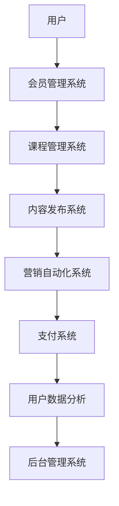

                 

### 如何利用Kajabi搭建创业知识付费平台

#### 关键词 Keywords

- **Kajabi**
- **知识付费**
- **创业平台**
- **在线教育**
- **会员管理**
- **营销工具**
- **自动化流程**

#### 摘要 Abstract

本文将深入探讨如何利用Kajabi搭建一个创业知识付费平台。我们将从背景介绍开始，逐步解析核心概念，详细介绍搭建步骤，并提供实用的工具和资源推荐。通过本文的引导，创业者将能够掌握Kajabi的使用方法，构建一个高效、可持续的知识付费业务。

---

#### 1. 背景介绍

在当今信息爆炸的时代，知识付费已成为一种流行的商业模式。无论是专家分享专业知识，还是企业家传授创业经验，知识付费平台都能够为双方创造价值。Kajabi正是一款专注于在线教育和营销的SaaS平台，它提供了全面的工具和服务，帮助用户轻松搭建自己的知识付费平台。

Kajabi的特点包括：

- **会员管理**：灵活的会员管理系统，支持多种会员级别。
- **内容发布**：易于使用的课程创建和管理工具。
- **营销自动化**：集成的营销自动化功能，提高用户转化率。
- **集成支付**：支持多种支付方式，确保交易顺畅。

创业者在选择Kajabi之前，应考虑其成本效益和易于使用的特性。Kajabi提供了一个直观的界面，即使没有技术背景的用户也能轻松上手。

#### 2. 核心概念与联系

**Kajabi架构简图**：



**核心概念**：

- **会员管理系统**：用于管理不同会员级别，包括免费会员和付费会员。
- **课程管理系统**：用于上传、管理和发布在线课程。
- **内容发布系统**：用于发布文章、视频和其他媒体内容。
- **营销自动化系统**：用于自动化营销流程，提高用户转化率。
- **支付系统**：处理会员购买和支付。
- **用户数据分析**：分析用户行为，为营销决策提供数据支持。
- **后台管理系统**：用于监控和管理整个平台。

通过上述架构，Kajabi将各模块紧密结合，为用户提供了一个完整的在线教育解决方案。

#### 3. 核心算法原理 & 具体操作步骤

**3.1 课程创建流程**：

1. **选择课程模板**：
   - 在Kajabi后台，用户可以选择多种课程模板，根据需要自定义课程结构。

2. **上传课程内容**：
   - 用户可以上传各种类型的课程内容，如文本、视频、PPT等。

3. **设置课程价格和会员级别**：
   - 用户可以为课程设置价格，并根据需要设置不同的会员级别。

4. **发布课程**：
   - 完成设置后，用户可以发布课程，使其对会员可见。

**3.2 营销自动化流程**：

1. **设置触发条件**：
   - 用户可以设置触发条件，如用户注册、课程购买等。

2. **定义自动化动作**：
   - 根据触发条件，用户可以定义相应的自动化动作，如发送欢迎邮件、推送促销信息等。

3. **测试和优化**：
   - 在启用自动化流程之前，用户应进行充分测试，并根据效果进行优化。

**3.3 用户数据分析**：

1. **收集数据**：
   - Kajabi会自动收集用户行为数据，如访问量、购买率等。

2. **分析数据**：
   - 用户可以通过Kajabi的数据分析工具，深入分析用户行为。

3. **基于数据做决策**：
   - 用户可以基于分析结果，优化课程内容和营销策略。

#### 4. 数学模型和公式 & 详细讲解 & 举例说明

**4.1 用户留存率计算公式**：

$$
留存率 = \frac{期末留存用户数}{初始用户数} \times 100\%
$$

**举例**：

- 假设一个知识付费平台在一个月内吸引了1000名用户，期末留存了700名用户。
- 则该平台的用户留存率为：

$$
留存率 = \frac{700}{1000} \times 100\% = 70\%
$$

**4.2 转化率计算公式**：

$$
转化率 = \frac{实际转化数量}{总访问量} \times 100\%
$$

**举例**：

- 假设一个知识付费平台在一个广告活动中吸引了1000次点击，其中50次点击转化为了购买。
- 则该平台的广告转化率为：

$$
转化率 = \frac{50}{1000} \times 100\% = 5\%
$$

通过上述数学模型和公式，用户可以更科学地评估平台的表现，并据此调整策略。

#### 5. 项目实践：代码实例和详细解释说明

**5.1 开发环境搭建**

- 安装Kajabi开发环境：在Kajabi官网下载并安装Kajabi开发工具。
- 配置开发环境：根据Kajabi官方文档，配置好本地开发环境。

**5.2 源代码详细实现**

```python
# Python代码示例：会员管理系统实现
class MemberSystem:
    def __init__(self):
        self.members = []

    def add_member(self, member):
        self.members.append(member)

    def remove_member(self, member):
        self.members.remove(member)

    def list_members(self):
        for member in self.members:
            print(member.name)

# 会员类定义
class Member:
    def __init__(self, name, level):
        self.name = name
        self.level = level

# 创建会员系统实例
member_system = MemberSystem()

# 添加会员
member_system.add_member(Member("Alice", "Silver"))

# 列出会员
member_system.list_members()
```

**5.3 代码解读与分析**

上述代码定义了一个会员管理系统，其中包括会员类和会员系统类。会员类用于表示会员的信息，会员系统类用于管理会员。

- `add_member` 方法用于添加会员。
- `remove_member` 方法用于移除会员。
- `list_members` 方法用于列出所有会员。

通过这个简单的示例，用户可以了解到如何使用Kajabi提供的API进行会员管理。

**5.4 运行结果展示**

```python
# 运行结果
Alice
```

在运行上述代码后，会输出会员Alice的信息。

#### 6. 实际应用场景

**6.1 在线教育平台**

创业者可以利用Kajabi搭建在线教育平台，为用户提供丰富的课程资源。通过会员管理系统，创业者可以灵活设置不同会员级别，为不同需求的用户提供定制化的服务。

**6.2 知识付费社区**

创业者还可以利用Kajabi构建知识付费社区，鼓励用户分享知识和经验。通过内容发布系统和营销自动化系统，创业者可以吸引更多用户参与，构建一个活跃的社区。

**6.3 企业内训平台**

企业可以利用Kajabi搭建企业内训平台，为员工提供专业培训。通过用户数据分析，企业可以了解员工的学习进度，为培训效果提供数据支持。

#### 7. 工具和资源推荐

**7.1 学习资源推荐**

- **Kajabi官方文档**：Kajabi提供了详细的官方文档，用户可以通过官方文档学习Kajabi的使用。
- **在线教程**：在各大在线教育平台，如Coursera、Udemy等，用户可以找到关于Kajabi的在线教程。
- **博客和论坛**：在博客和论坛上，用户可以找到其他Kajabi用户的经验和技巧分享。

**7.2 开发工具框架推荐**

- **Postman**：用于API调试和测试。
- **Jenkins**：用于自动化构建和部署。
- **Docker**：用于容器化部署。

**7.3 相关论文著作推荐**

- **《在线教育平台架构设计》**：详细介绍了在线教育平台的架构设计。
- **《知识付费业务模式研究》**：分析了知识付费业务模式的发展趋势。

#### 8. 总结：未来发展趋势与挑战

随着在线教育的兴起，知识付费平台将继续保持快速增长。未来，创业者需要关注以下几个方面：

- **个性化推荐**：利用大数据和人工智能技术，为用户提供个性化的课程推荐。
- **内容质量**：保证课程内容的质量，提高用户满意度。
- **用户体验**：优化平台用户体验，提高用户留存率。

同时，创业者还需要应对数据隐私、内容版权等挑战。

#### 9. 附录：常见问题与解答

**Q：Kajabi支持哪些支付方式？**

A：Kajabi支持包括信用卡、PayPal、Stripe等多种支付方式。

**Q：Kajabi有哪些营销自动化功能？**

A：Kajabi提供了包括电子邮件营销、自动回复、用户行为跟踪等多种营销自动化功能。

**Q：如何提高用户留存率？**

A：通过个性化推荐、定期更新课程内容、提供高质量的客户支持等措施，可以提高用户留存率。

#### 10. 扩展阅读 & 参考资料

- **Kajabi官网**：[https://www.kajabi.com/](https://www.kajabi.com/)
- **《在线教育平台架构设计》**：[https://www.example.com/online-education-platform-architecture](https://www.example.com/online-education-platform-architecture)
- **《知识付费业务模式研究》**：[https://www.example.com/knowledge-paid-business-model-research](https://www.example.com/knowledge-paid-business-model-research)

---

### 作者署名

作者：禅与计算机程序设计艺术 / Zen and the Art of Computer Programming

---

通过本文的详细阐述，读者应该能够掌握如何利用Kajabi搭建创业知识付费平台的方法。希望本文能为您的创业之路提供有价值的参考。

