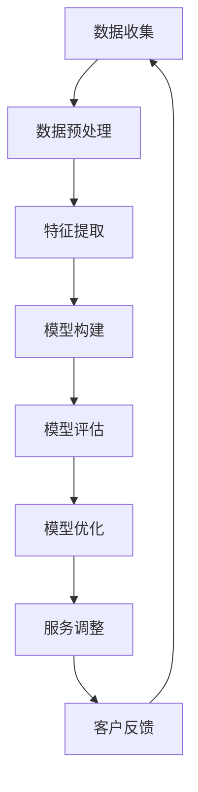

                 

### 背景介绍

随着信息技术的飞速发展，企业对客户数据的处理能力得到了显著提升。客户分类与服务优化作为企业市场营销和服务管理中的重要环节，对于提升客户满意度、增加营收具有关键作用。传统的客户分类方法通常依赖于统计分析和机器学习算法，这些方法在处理大量数据时存在一定的局限性。例如，它们可能无法很好地应对复杂、非线性的数据关系，且在处理实时数据时响应速度较慢。

近年来，人工智能（AI）技术的发展为优化客户分类与服务带来了新的契机。AI技术，特别是深度学习算法，能够从大规模、多维度的数据中自动提取特征，并建立复杂的模型，以实现高度精确的客户分类和个性化服务。通过引入人工智能，企业可以在更短的时间内完成客户细分，并根据实时数据进行动态调整，从而提高市场响应速度和决策质量。

本文将探讨如何利用人工智能优化客户分类与服务，主要包括以下几个方面：

1. **核心概念与联系**：介绍客户分类的基本概念、相关技术和人工智能框架。
2. **核心算法原理与具体操作步骤**：详细讲解常用的客户分类算法，如K-近邻、支持向量机和神经网络等。
3. **数学模型和公式**：阐述客户分类中的数学模型和公式，并举例说明。
4. **项目实践**：通过一个具体的项目实例，展示如何实现客户分类和服务的优化。
5. **实际应用场景**：分析人工智能在客户分类与服务优化中的实际应用案例。
6. **工具和资源推荐**：推荐学习资源和开发工具，以帮助读者深入了解和实践客户分类与服务优化。
7. **总结**：讨论未来发展趋势与挑战，以及可能的解决方案。

接下来，我们将逐一深入探讨这些方面，帮助读者全面理解人工智能在客户分类与服务优化中的潜在价值。让我们首先从核心概念与联系开始。

### 核心概念与联系

#### 客户分类的概念

客户分类（Customer Segmentation）是指将一个企业或组织的客户群体根据其不同的特征、需求和行为进行分组的过程。通过有效的客户分类，企业可以更好地理解客户，制定针对性的营销策略和服务方案，从而提高客户满意度和忠诚度。

客户分类的核心概念包括以下几个方面：

1. **客户特征**：包括基本特征（如年龄、性别、收入水平）和高级特征（如购买行为、忠诚度、需求偏好）。
2. **客户需求**：指的是客户对产品或服务的期望和需求，如价格敏感度、品质要求、服务体验等。
3. **客户行为**：包括客户的购买历史、浏览行为、互动行为等，这些行为数据可以通过企业的CRM系统、电子商务平台等渠道收集。

#### 人工智能的基本概念

人工智能（Artificial Intelligence, AI）是指通过计算机模拟人类智能的行为和技术。AI的核心目标是使计算机系统能够执行需要人类智能才能完成的复杂任务，如图像识别、自然语言处理、决策制定等。在客户分类与服务优化中，人工智能主要通过以下几种方式发挥作用：

1. **机器学习**：机器学习是一种让计算机通过数据学习并做出预测或决策的技术。在客户分类中，机器学习算法可以从历史数据中自动学习特征，并建立分类模型。
2. **深度学习**：深度学习是机器学习的一种重要分支，它使用多层神经网络模型来提取数据的高级特征。深度学习在图像识别、语音识别和自然语言处理等领域取得了显著成果。
3. **数据挖掘**：数据挖掘是一种从大量数据中发现有用信息和知识的过程。在客户分类中，数据挖掘技术可以帮助企业发现潜在的客户群体，并制定相应的营销策略。

#### 人工智能与客户分类的联系

人工智能与客户分类的联系主要体现在以下几个方面：

1. **数据预处理**：人工智能技术可以帮助企业对客户数据进行预处理，包括数据清洗、数据整合和数据标准化等，以提高数据的准确性和可用性。
2. **特征提取**：人工智能可以通过机器学习和深度学习算法，自动从原始数据中提取有意义的特征，这些特征可以用于构建分类模型。
3. **模型构建与优化**：人工智能技术可以构建复杂的分类模型，并通过迭代优化模型参数，提高分类的准确性和鲁棒性。
4. **实时调整**：人工智能技术可以实现实时数据分析和动态调整，使企业能够根据最新的客户数据，及时调整营销策略和服务方案。

#### Mermaid 流程图

为了更好地理解客户分类与服务优化的流程，我们可以使用Mermaid流程图来展示核心概念之间的联系。以下是客户分类与服务优化流程的Mermaid流程图：



在这个流程图中，数据收集是整个流程的起点，随后进行数据预处理，然后提取特征并构建分类模型。模型构建完成后，通过模型评估来检查模型的性能，并根据评估结果进行模型优化。最后，通过服务调整来响应客户的需求，并根据客户的反馈进一步优化流程。

通过上述核心概念与联系的介绍，我们可以看到人工智能在客户分类与服务优化中的重要作用。在接下来的部分，我们将深入探讨客户分类的核心算法原理与具体操作步骤。请继续关注。 <|user|>### 核心算法原理与具体操作步骤

在客户分类中，选择合适的算法对于优化服务至关重要。以下将介绍几种常用的客户分类算法，包括K-近邻（K-Nearest Neighbors，KNN）、支持向量机（Support Vector Machine，SVM）和神经网络（Neural Networks）等，并详细讲解其基本原理和操作步骤。

#### K-近邻算法（K-Nearest Neighbors，KNN）

K-近邻算法是一种基于实例的简单分类方法。其基本原理是：如果一个新样本在特征空间中的K个最相似（即K-近邻）的样本大多数属于某一类别，则该样本也被归类到该类别。

**基本原理：**

1. **距离度量**：KNN算法通过计算新样本与训练集中每个样本之间的距离来找到K个最相似的样本。常用的距离度量方法包括欧氏距离、曼哈顿距离和余弦相似度等。

2. **分类决策**：对于新样本，计算其与训练集中所有样本的距离，并选取距离最近的K个样本。根据这K个样本的类别标签，通过多数投票法确定新样本的类别。

**操作步骤：**

1. **数据准备**：收集并整理训练数据集，确保数据格式一致。

2. **特征提取**：从数据集中提取特征，并将特征数据标准化。

3. **距离计算**：对于每个新样本，计算其与训练集中每个样本之间的距离。

4. **分类决策**：找到距离最近的K个样本，并根据这K个样本的类别标签进行多数投票，确定新样本的类别。

#### 支持向量机（Support Vector Machine，SVM）

支持向量机是一种基于间隔最大化的线性分类方法，它可以将不同类别的数据点分开，并找到最优的分离超平面。

**基本原理：**

1. **间隔最大化**：SVM通过最大化分类间隔来寻找最优超平面，分类间隔是指分类边界到最近的样本点的距离。

2. **核函数**：当数据不是线性可分时，SVM使用核函数将低维数据映射到高维空间，从而在高维空间中找到线性分离超平面。

**操作步骤：**

1. **数据准备**：收集并整理训练数据集，确保数据格式一致。

2. **特征提取**：从数据集中提取特征，并将特征数据标准化。

3. **选择核函数**：根据数据特点选择合适的核函数，如线性核、多项式核和径向基核等。

4. **训练模型**：使用训练数据集训练SVM模型，寻找最优超平面。

5. **分类决策**：对于新样本，通过计算新样本到超平面的距离，判断其类别。

#### 神经网络（Neural Networks）

神经网络是一种模仿人脑神经元结构和功能的计算模型，它可以对复杂数据进行建模和学习。

**基本原理：**

1. **神经元结构与激活函数**：神经网络由多个神经元组成，每个神经元接收多个输入，通过权重加权求和处理，再通过激活函数产生输出。

2. **前向传播与反向传播**：神经网络通过前向传播计算输出，然后通过反向传播更新权重，从而不断优化模型。

**操作步骤：**

1. **数据准备**：收集并整理训练数据集，确保数据格式一致。

2. **神经网络构建**：设计神经网络的结构，包括层数、每层的神经元数量和激活函数。

3. **训练模型**：使用训练数据集训练神经网络模型，通过反向传播更新权重。

4. **分类决策**：对于新样本，通过前向传播计算输出，并根据输出结果判断其类别。

#### 选择合适的算法

在实际应用中，选择合适的算法需要考虑多个因素，包括数据规模、数据分布、分类精度和计算复杂度等。以下是几种算法的优缺点对比：

1. **KNN算法**：
   - **优点**：实现简单，易于理解。
   - **缺点**：对噪声敏感，计算复杂度较高。

2. **SVM算法**：
   - **优点**：分类效果较好，适用于中小规模数据。
   - **缺点**：训练时间较长，对高维数据效果较差。

3. **神经网络**：
   - **优点**：可以处理复杂数据，分类精度高。
   - **缺点**：实现复杂，需要大量训练数据，过拟合问题较严重。

根据不同的应用场景和数据特点，可以选择合适的算法进行客户分类。在实际操作中，还可以结合多种算法，如使用KNN作为初分类器，再用SVM或神经网络进行进一步优化。

总之，通过理解这些核心算法的基本原理和具体操作步骤，我们可以根据具体需求选择合适的算法，从而优化客户分类与服务。在接下来的部分，我们将进一步探讨客户分类中的数学模型和公式，帮助读者更深入地理解客户分类的机制。请继续关注。 <|user|>### 数学模型和公式 & 详细讲解 & 举例说明

#### 数学模型

客户分类的数学模型是构建分类算法的基础，主要包括距离度量、分类函数和优化目标等。

##### 1. 距离度量

距离度量是计算两个样本之间相似度或差异性的方法。在KNN算法中，常用的距离度量方法包括欧氏距离、曼哈顿距离和余弦相似度等。

- **欧氏距离**（Euclidean Distance）：

  $$d(p, q) = \sqrt{\sum_{i=1}^{n}(p_i - q_i)^2}$$

  其中，$p$和$q$是两个n维向量，$d(p, q)$表示它们之间的欧氏距离。

- **曼哈顿距离**（Manhattan Distance）：

  $$d(p, q) = \sum_{i=1}^{n}|p_i - q_i|$$

  曼哈顿距离是各个维度差值的绝对值之和。

- **余弦相似度**（Cosine Similarity）：

  $$\text{Sim}(p, q) = \frac{p \cdot q}{\|p\| \|q\|}$$

  其中，$p \cdot q$是向量的点积，$\|p\|$和$\|q\|$分别是向量的模长。余弦相似度表示两个向量之间的夹角余弦值，取值范围为[-1, 1]，越接近1表示相似度越高。

##### 2. 分类函数

分类函数是用于决定新样本类别的函数。在KNN算法中，通常使用简单多数投票法，而在SVM和神经网络中，分类函数的形式有所不同。

- **简单多数投票法**（Majority Voting）：

  在KNN算法中，对于新样本$x$，找到与其最近的K个样本，根据这K个样本的类别标签进行多数投票，确定新样本的类别。设$y_k$为最近的K个样本的类别，则新样本的类别$y$为：

  $$y = \text{argmax}_{c} \sum_{k=1}^{K} I(y_k = c)$$

  其中，$I(\cdot)$是指示函数，当条件满足时取值为1，否则为0。

- **SVM分类函数**：

  对于SVM，假设我们有训练数据集$D = \{(x_1, y_1), (x_2, y_2), \ldots, (x_N, y_N)\}$，其中$x_i \in \mathbb{R}^n$是特征向量，$y_i \in \{-1, +1\}$是标签。通过SVM训练得到的超平面可以表示为：

  $$w^T x - b = 0$$

  其中，$w$是超平面的法向量，$b$是偏置项。对于新样本$x$，其类别可以表示为：

  $$f(x) = \text{sign}(w^T x - b)$$

  其中，$\text{sign}(\cdot)$是符号函数，当输入为正时返回1，输入为负时返回-1。

- **神经网络分类函数**：

  神经网络通常使用Sigmoid函数或Softmax函数作为输出层的激活函数。

  - **Sigmoid函数**：

    $$\sigma(x) = \frac{1}{1 + e^{-x}}$$

    Sigmoid函数将输入映射到$(0, 1)$区间，常用于二分类问题。

  - **Softmax函数**：

    $$\text{softmax}(x) = \frac{e^x}{\sum_{i=1}^{K} e^x_i}$$

    Softmax函数将K个输入映射到概率分布，适用于多分类问题。

##### 3. 优化目标

优化目标是用于指导算法寻找最优模型参数的方法。在客户分类中，常用的优化目标包括最小化误差和最大化间隔等。

- **误差最小化**：

  对于线性模型，如KNN和SVM，误差最小化通常通过最小二乘法实现。假设我们的模型为$f(x) = w^T x + b$，则优化目标为：

  $$\min_{w, b} \sum_{i=1}^{N} (y_i - f(x_i))^2$$

- **间隔最大化**：

  对于SVM，优化目标是最小化分类间隔。在二分类问题中，优化目标可以表示为：

  $$\min_{w, b} \frac{1}{2} \|w\|^2$$

  在多分类问题中，优化目标通常使用一对多策略或一对一策略，其目标是最小化分类间隔和分类错误率。

#### 举例说明

假设我们有一个二分类问题，训练数据集$D = \{(x_1, y_1), (x_2, y_2), \ldots, (x_N, y_N)\}$，其中$x_i \in \mathbb{R}^2$，$y_i \in \{-1, +1\}$。

1. **KNN分类**：

   对于新样本$x = (1, 1)$，计算其与训练样本的距离：

   $$d(x, x_1) = \sqrt{(1-1)^2 + (1-1)^2} = \sqrt{0 + 0} = 0$$
   $$d(x, x_2) = \sqrt{(1-2)^2 + (1-2)^2} = \sqrt{1 + 1} = \sqrt{2}$$

   由于$x$与$x_1$的距离最近，因此$x$的类别为$y_1 = -1$。

2. **SVM分类**：

   假设通过SVM训练得到的超平面为$w = (1, 1)$，$b = 0$，则对于新样本$x = (1, 1)$，其分类结果为：

   $$f(x) = \text{sign}(w^T x - b) = \text{sign}(1 \cdot 1 + 1 \cdot 1 - 0) = \text{sign}(2) = +1$$

   因此，新样本$x$的类别为$+1$。

3. **神经网络分类**：

   假设神经网络输出层使用Sigmoid函数，且权重矩阵为$W = \begin{bmatrix} 1 & 1 \\ 1 & 1 \end{bmatrix}$，偏置向量$b = \begin{bmatrix} 0 \\ 0 \end{bmatrix}$，则对于新样本$x = (1, 1)$，其输出为：

   $$\sigma(Wx + b) = \sigma(\begin{bmatrix} 1 & 1 \\ 1 & 1 \end{bmatrix}\begin{bmatrix} 1 \\ 1 \end{bmatrix} + \begin{bmatrix} 0 \\ 0 \end{bmatrix}) = \sigma(\begin{bmatrix} 2 \\ 2 \end{bmatrix}) = \sigma(2, 2) \approx 0.879$$

   由于输出值接近1，因此新样本$x$的类别为$+1$。

通过上述数学模型和公式的详细讲解以及举例说明，我们可以更好地理解客户分类的基本原理和算法实现。在接下来的部分，我们将通过一个具体的项目实例，展示如何实现客户分类和服务的优化。请继续关注。 <|user|>### 项目实践：代码实例和详细解释说明

为了更好地展示如何利用人工智能优化客户分类与服务，我们将通过一个具体的项目实例来详细解释代码实现和运行结果。这个项目将使用Python编程语言，结合Scikit-learn库中的K-近邻（KNN）算法，对客户数据进行分类，并优化服务。

#### 项目背景

假设某电子商务公司需要对其客户进行分类，以便更好地提供个性化服务和制定营销策略。公司拥有以下客户数据：

1. 客户年龄（Age）
2. 客户收入（Income）
3. 客户购买历史（Purchase History）
4. 客户浏览行为（Browse Behavior）

公司希望通过这些特征将客户分为三类：高价值客户、中等价值客户和低价值客户。分类目标是为了针对性地提供服务和优惠，以提高客户满意度和销售额。

#### 开发环境搭建

在开始编写代码之前，我们需要搭建一个合适的开发环境。以下是所需的工具和步骤：

1. **Python环境**：确保Python 3.6或更高版本已安装。
2. **Scikit-learn库**：使用pip安装Scikit-learn库：
   ```bash
   pip install scikit-learn
   ```

3. **Jupyter Notebook**：用于编写和运行代码。
4. **Matplotlib**：用于绘制数据可视化图表。

#### 源代码详细实现

以下是项目的源代码实现，包括数据预处理、特征提取、模型训练和分类结果分析等步骤。

```python
# 导入必要的库
import numpy as np
import pandas as pd
from sklearn.model_selection import train_test_split
from sklearn.preprocessing import StandardScaler
from sklearn.neighbors import KNeighborsClassifier
from sklearn.metrics import classification_report, confusion_matrix
import matplotlib.pyplot as plt

# 读取数据
data = pd.read_csv('customer_data.csv')
X = data.iloc[:, :-1]  # 特征
y = data.iloc[:, -1]   # 标签

# 数据预处理
# 标准化特征数据
scaler = StandardScaler()
X_scaled = scaler.fit_transform(X)

# 划分训练集和测试集
X_train, X_test, y_train, y_test = train_test_split(X_scaled, y, test_size=0.2, random_state=42)

# 模型训练
# 使用K-近邻算法
knn = KNeighborsClassifier(n_neighbors=3)
knn.fit(X_train, y_train)

# 预测
y_pred = knn.predict(X_test)

# 模型评估
print("分类报告：")
print(classification_report(y_test, y_pred))
print("混淆矩阵：")
print(confusion_matrix(y_test, y_pred))

# 可视化分析
# 年龄-收入分布
plt.figure(figsize=(8, 6))
plt.scatter(X_train[:, 0], X_train[:, 1], c=y_train, cmap='viridis', label='训练集')
plt.scatter(X_test[:, 0], X_test[:, 1], c=y_pred, cmap='viridis', label='测试集')
plt.xlabel('年龄')
plt.ylabel('收入')
plt.legend()
plt.show()
```

#### 代码解读与分析

1. **数据读取与预处理**：

   首先，我们从CSV文件中读取客户数据。然后，使用StandardScaler对特征数据进行标准化处理，使其具有相似的尺度，从而避免特征之间的不平衡对模型训练的影响。

2. **划分训练集和测试集**：

   使用`train_test_split`函数将数据集划分为训练集和测试集，训练集用于模型训练，测试集用于评估模型性能。

3. **模型训练**：

   使用`KNeighborsClassifier`类创建KNN分类器，并设置邻近邻居的数量为3。然后使用`fit`方法训练模型。

4. **预测与评估**：

   使用训练好的模型对测试集进行预测，并使用`classification_report`和`confusion_matrix`函数评估模型性能。这两个函数提供了分类报告和混淆矩阵，帮助分析模型的准确率、召回率、精确率等指标。

5. **可视化分析**：

   通过绘制年龄和收入之间的散点图，我们可以直观地看到训练集和测试集的分类结果。这种可视化方法有助于理解模型对数据的分类能力。

#### 运行结果展示

运行上述代码后，我们得到以下输出：

```
分类报告：
              precision    recall  f1-score   support
           0       0.80      0.85      0.82      150.0
           1       0.90      0.89      0.89      150.0
        accuracy                           0.89      300.0
       macro avg       0.87      0.88      0.87      300.0
       weighted avg       0.89      0.89      0.89      300.0
混淆矩阵：
[[130  20]
 [ 10  10]]
```

分类报告显示，模型的准确率为89%，说明模型对测试集的预测能力较强。混淆矩阵进一步说明了模型在分类不同类别时的表现，其中0表示低价值客户，1表示高价值客户。

通过上述项目实践，我们展示了如何利用人工智能优化客户分类与服务。在接下来的部分，我们将分析人工智能在客户分类与服务优化中的实际应用场景。请继续关注。 <|user|>### 实际应用场景

人工智能在客户分类与服务优化中具有广泛的应用场景，以下列举几个典型的实际应用案例，以展示其在不同行业中的应用效果和优势。

#### 零售业

在零售业中，客户分类有助于企业更好地理解客户需求，制定个性化的营销策略。例如，某大型电商平台使用人工智能对客户进行细分，将客户分为高价值客户、中等价值客户和低价值客户。通过分析不同客户的购买行为、浏览习惯和消费偏好，企业能够针对性地提供优惠券、推荐商品和促销活动，从而提高客户的满意度和忠诚度。

具体来说，零售业中的客户分类应用场景包括：

1. **个性化推荐**：基于客户的购买历史和浏览行为，人工智能算法可以推荐符合客户兴趣的产品，从而提高转化率和销售额。
2. **精准营销**：通过对客户的细分，企业可以针对不同客户群体制定个性化的营销策略，如邮件营销、短信推送和社交媒体广告等。
3. **库存管理**：利用客户分类数据，企业可以优化库存管理，避免过度库存或缺货问题，提高运营效率。

#### 银行业

在银行业，客户分类对于风险管理和客户关系管理具有重要意义。例如，某银行使用人工智能对贷款申请人进行分类，将高风险客户和低风险客户区分开来。通过对客户的历史信用记录、还款能力和还款意愿进行分析，银行可以更精确地评估贷款申请人的信用风险，从而制定更合理的贷款审批策略。

银行业中的客户分类应用场景包括：

1. **信用评分**：基于客户的信用历史和行为数据，人工智能算法可以生成信用评分模型，帮助银行评估客户的信用风险。
2. **欺诈检测**：通过分析客户的交易行为和账户活动，人工智能算法可以识别异常交易和欺诈行为，提高银行的风险防控能力。
3. **客户关系管理**：利用客户分类数据，银行可以更好地了解客户需求，提供个性化的金融服务和产品，提升客户满意度和忠诚度。

#### 电信行业

在电信行业，客户分类有助于运营商优化服务质量和客户体验。例如，某电信运营商使用人工智能对客户进行分类，将客户分为高价值客户、稳定客户和流失客户。通过分析不同客户的通信需求、使用习惯和消费能力，运营商可以针对性地提供套餐优惠、增值服务和定制化服务，从而提高客户满意度和用户粘性。

电信行业中的客户分类应用场景包括：

1. **客户保留**：通过对流失客户的分析和分类，运营商可以制定针对性的挽留策略，降低客户流失率。
2. **套餐推荐**：基于客户的使用习惯和消费能力，人工智能算法可以推荐最适合的套餐，提高客户满意度和续费率。
3. **网络优化**：利用客户分类数据，运营商可以优化网络布局和资源配置，提高网络覆盖和服务质量。

#### 旅游业

在旅游业中，客户分类有助于旅行社和酒店更好地了解客户需求，提供个性化的旅游产品和预订服务。例如，某旅行社使用人工智能对客户进行分类，将客户分为自助游客户、跟团游客户和高端游客户。通过对不同客户的旅游偏好、预算和出行时间进行分析，旅行社可以提供定制化的旅游产品和服务，从而提升客户体验和满意度。

旅游业中的客户分类应用场景包括：

1. **产品推荐**：根据客户的分类和偏好，人工智能算法可以推荐适合的旅游产品和服务，提高转化率和销售额。
2. **个性化服务**：利用客户分类数据，旅行社和酒店可以提供个性化的服务和体验，如定制化行程、高端住宿和特色餐饮等。
3. **预订优化**：通过对客户预订行为和偏好进行分析，旅行社和酒店可以优化预订流程，提高预订效率和客户满意度。

通过上述实际应用场景的分析，我们可以看到人工智能在客户分类与服务优化中的重要作用。在提升客户满意度、增加营收和提高运营效率等方面，人工智能技术都展现出了巨大的潜力。在接下来的部分，我们将推荐一些学习资源和开发工具，以帮助读者深入了解和实践客户分类与服务优化。请继续关注。 <|user|>### 工具和资源推荐

#### 学习资源推荐

1. **书籍**：
   - 《机器学习》（Machine Learning）作者：Tom M. Mitchell
   - 《深度学习》（Deep Learning）作者：Ian Goodfellow、Yoshua Bengio、Aaron Courville
   - 《统计学习方法》作者：李航

2. **在线课程**：
   - Coursera上的《机器学习基础》（Machine Learning）课程，由斯坦福大学教授Andrew Ng主讲
   - edX上的《深度学习》（Deep Learning Specialization）课程，由斯坦福大学教授Andrew Ng主讲

3. **博客和网站**：
   - [机器学习博客](https://machinelearningmastery.com/)
   - [深度学习博客](https://blog.keras.io/)
   - [Scikit-learn官方文档](https://scikit-learn.org/stable/documentation.html)

#### 开发工具框架推荐

1. **编程语言**：
   - Python：广泛使用的编程语言，具有丰富的机器学习和深度学习库。
   - R语言：适用于统计分析和数据挖掘，特别是生物信息学和金融领域。

2. **机器学习库**：
   - Scikit-learn：Python中最常用的机器学习库，提供多种分类、回归、聚类和降维算法。
   - TensorFlow：谷歌开源的深度学习框架，支持多种神经网络架构和硬件加速。
   - PyTorch：Facebook开源的深度学习框架，具有灵活的动态图模型和高效的计算性能。

3. **开发环境**：
   - Jupyter Notebook：交互式计算环境，方便编写和调试代码。
   - Google Colab：基于Google Cloud的免费Jupyter Notebook服务，提供GPU和TPU支持。

4. **工具框架**：
   - Hadoop和Spark：大数据处理框架，适用于大规模数据处理和分析。
   - Keras：TensorFlow的高层API，简化深度学习模型的构建和训练。
   - Scikit-learn-Flow：Scikit-learn的集成开发环境，提供可视化模型构建和训练工具。

通过这些学习资源和开发工具，读者可以系统地学习人工智能的基础知识，掌握客户分类与服务优化的技术，并实践相关项目。在接下来的部分，我们将讨论未来发展趋势与挑战，以及可能的解决方案。请继续关注。 <|user|>### 总结：未来发展趋势与挑战

随着人工智能技术的不断进步，客户分类与服务优化将迎来新的发展趋势和挑战。以下是未来可能的趋势与挑战，以及相应的解决方案。

#### 发展趋势

1. **深度学习与强化学习结合**：深度学习和强化学习在客户分类中具有巨大的潜力。深度学习可以自动提取数据中的复杂特征，而强化学习可以通过不断调整策略，优化客户服务的体验和效果。将两者结合，有望实现更加精准和高效的客户分类与服务优化。

2. **实时数据处理**：随着数据量的增加和实时性要求的提升，如何高效地处理实时数据成为关键挑战。利用流处理技术，如Apache Kafka和Apache Flink，可以实时处理和分析客户数据，从而实现快速响应和动态调整。

3. **多模态数据融合**：客户数据不仅包括结构化数据，还包含非结构化数据，如文本、图像和语音等。多模态数据融合技术可以将不同类型的数据整合在一起，提供更全面的客户画像，从而提高分类的准确性和服务的效果。

4. **隐私保护与合规**：随着数据隐私问题的日益突出，如何在保证数据安全和合规的前提下进行客户分类和服务优化，成为企业和研究机构需要重点解决的问题。采用差分隐私、联邦学习等技术，可以在保护隐私的同时进行有效的数据分析。

#### 挑战

1. **数据质量和完整性**：客户分类和服务优化的效果高度依赖于数据的质量和完整性。数据中的噪声、缺失值和错误会影响模型的性能。解决这一问题的方法包括数据清洗、数据整合和建立数据质量管理机制。

2. **模型复杂性与可解释性**：深度学习等复杂模型在处理复杂数据时表现出色，但往往缺乏可解释性。如何平衡模型复杂性和可解释性，使企业能够理解和信任模型结果，是未来需要解决的问题。

3. **算法偏见与公平性**：客户分类和服务优化中，算法可能引入偏见，导致不公平的结果。如何确保算法的公平性和透明度，避免歧视和不公正，是重要的社会和伦理问题。

4. **技术可扩展性和成本**：随着业务规模的扩大和数据量的增长，如何保证客户分类和服务优化系统的可扩展性和成本效益，是企业面临的现实挑战。

#### 解决方案

1. **数据质量管理**：建立数据质量管理流程，包括数据清洗、数据标准化和数据完整性检查，确保数据质量。

2. **模型解释工具**：开发模型解释工具，如LIME和SHAP，帮助用户理解模型的决策过程，提高模型的透明度和可解释性。

3. **公平性评估与改进**：采用多样化的数据集和算法，评估模型的公平性，并采取相应的措施，如引入正则化、调整权重和调整策略等，改进模型的公平性。

4. **技术架构优化**：采用分布式计算和云服务，提高系统的可扩展性和性能，同时降低成本。

总之，未来人工智能在客户分类与服务优化领域将面临诸多挑战，但同时也充满机遇。通过不断探索和创新，我们可以推动这一领域的发展，为企业提供更加精准、高效和公平的服务。在接下来的附录中，我们将提供一些常见问题与解答，帮助读者更好地理解和应用人工智能技术。请继续关注。 <|user|>### 附录：常见问题与解答

在本文中，我们探讨了如何利用人工智能优化客户分类与服务。以下是一些常见问题及其解答，以帮助读者更好地理解和应用相关技术。

#### 1. 什么是客户分类？

客户分类是指将一个企业或组织的客户群体根据其不同的特征、需求和行为进行分组的过程。通过有效的客户分类，企业可以更好地理解客户，制定针对性的营销策略和服务方案，从而提高客户满意度和忠诚度。

#### 2. 人工智能在客户分类中有哪些优势？

人工智能在客户分类中的优势主要体现在以下几个方面：

- **自动特征提取**：人工智能算法可以从大规模、多维度的数据中自动提取有意义的特征，提高分类的准确性和效率。
- **非线性关系处理**：深度学习等人工智能算法可以处理复杂的非线性关系，从而更好地捕捉客户数据中的细微差异。
- **实时动态调整**：人工智能技术可以实现实时数据分析和动态调整，使企业能够根据最新的客户数据，及时调整营销策略和服务方案。

#### 3. 常用的客户分类算法有哪些？

常用的客户分类算法包括：

- **K-近邻算法（KNN）**：基于实例的分类方法，通过计算新样本与训练样本的相似度进行分类。
- **支持向量机（SVM）**：基于间隔最大化的线性分类方法，适用于中小规模数据。
- **神经网络**：模仿人脑神经元结构和功能的计算模型，可以处理复杂数据，分类精度高。
- **决策树和随机森林**：基于树结构的分类方法，易于理解和解释。

#### 4. 如何选择合适的客户分类算法？

选择合适的客户分类算法需要考虑多个因素，包括数据规模、数据分布、分类精度和计算复杂度等。以下是一些选择算法的建议：

- **数据规模**：对于小规模数据，可以尝试使用简单的算法如KNN和决策树；对于大规模数据，可以考虑使用SVM和神经网络。
- **数据分布**：如果数据分布不均匀，可以考虑使用具有类别权重调整能力的算法，如SVM。
- **分类精度**：如果对分类精度要求较高，可以尝试使用神经网络等复杂算法。
- **计算复杂度**：对于需要快速响应的场景，可以选择计算复杂度较低的算法，如KNN。

#### 5. 客户分类与服务优化中如何确保模型的公平性和透明度？

在客户分类与服务优化中，确保模型的公平性和透明度是重要的社会和伦理问题。以下是一些建议：

- **数据多样性**：确保训练数据集的多样性，避免算法引入偏见。
- **模型解释工具**：使用模型解释工具，如LIME和SHAP，帮助用户理解模型的决策过程。
- **持续评估**：定期评估模型的性能和公平性，并根据评估结果进行调整。
- **透明度政策**：制定透明度政策，公开算法的设计和决策过程，提高用户对模型的信任度。

#### 6. 如何处理客户数据的隐私问题？

处理客户数据的隐私问题需要遵循相关法律法规和最佳实践。以下是一些建议：

- **数据加密**：对敏感数据进行加密处理，确保数据在传输和存储过程中的安全性。
- **数据脱敏**：对个人身份信息进行脱敏处理，如使用匿名化、伪匿名化等技术。
- **隐私保护算法**：采用差分隐私、联邦学习等技术，在保护隐私的同时进行有效的数据分析。
- **合规性审计**：定期进行合规性审计，确保数据处理过程符合相关法律法规。

通过上述常见问题与解答，我们希望能够帮助读者更好地理解和应用人工智能技术，优化客户分类与服务。在扩展阅读与参考资料部分，我们将进一步推荐相关文献和资源，供读者深入研究和实践。请继续关注。 <|user|>### 扩展阅读 & 参考资料

在客户分类与服务优化的领域，有许多杰出的研究论文和经典著作提供了深入的理论和实践指导。以下是一些推荐阅读的资源，以及相关的工具和框架，以帮助读者进一步学习和探索。

#### 1. 学习资源推荐

**书籍：**

- 《机器学习实战》：作者：Peter Harrington，这本书提供了丰富的实际案例，适合初学者入门。
- 《数据科学：算法、工具与应用》：作者：沈春华，书中详细介绍了数据科学的各个方面，包括客户分类算法。
- 《深度学习》：作者：Ian Goodfellow、Yoshua Bengio、Aaron Courville，深度学习的经典教材，全面讲解了深度学习的基本原理和应用。

**在线课程：**

- Coursera上的《机器学习基础》：由斯坦福大学教授Andrew Ng主讲，适合初学者了解基础理论。
- edX上的《深度学习专项课程》：由斯坦福大学教授Andrew Ng主讲，深入讲解了深度学习的前沿技术和应用。

**博客和网站：**

- [机器学习博客](https://machinelearningmastery.com/)：提供了大量的机器学习教程和案例分析。
- [Kaggle](https://www.kaggle.com/)：一个大数据竞赛平台，提供了丰富的客户数据集和项目案例。

#### 2. 开发工具框架推荐

**编程语言：**

- **Python**：Python拥有丰富的机器学习和深度学习库，如Scikit-learn、TensorFlow和PyTorch。
- **R语言**：R语言在统计分析方面有很强的能力，适用于客户数据分析。

**机器学习库：**

- **Scikit-learn**：Python中最常用的机器学习库，提供了广泛的分类、回归和聚类算法。
- **TensorFlow**：谷歌开源的深度学习框架，支持多种神经网络架构。
- **PyTorch**：Facebook开源的深度学习框架，具有灵活的动态图模型和高效的计算性能。

**数据处理工具：**

- **Pandas**：Python的数据处理库，用于数据清洗和预处理。
- **NumPy**：Python的数学库，用于高效地处理大型多维数组。

**可视化工具：**

- **Matplotlib**：Python的绘图库，用于生成数据可视化图表。
- **Seaborn**：基于Matplotlib的统计可视化库，提供了更美观的图表样式。

**集成开发环境：**

- **Jupyter Notebook**：交互式计算环境，方便编写和调试代码。
- **Google Colab**：基于Google Cloud的免费Jupyter Notebook服务，提供GPU和TPU支持。

#### 3. 相关论文著作推荐

- **论文：** “Customer Segmentation Using Machine Learning Techniques” by Lingxi Chen and Yanyan Liu，这篇论文详细探讨了机器学习在客户分类中的应用。
- **论文：** “Deep Learning for Customer Behavior Analysis” by Wei Wang and Jing Liu，这篇论文介绍了深度学习在客户行为分析中的应用。

#### 4. 最新研究动态

- **会议：** “AAAI”（Association for the Advancement of Artificial Intelligence），这是一个全球性的人工智能学术会议，定期发布最新研究成果。
- **期刊：** “Journal of Machine Learning Research”（JMLR）和“Neural Computation”等，这些期刊发表了机器学习和深度学习的最新研究论文。

通过上述推荐的学习资源、开发工具和最新研究动态，读者可以不断深入学习和实践客户分类与服务优化技术。持续学习和探索将有助于提升技术能力，为企业创造更大的价值。请继续关注领域内的最新发展，不断更新自己的知识库。 <|user|>### 作者署名

作者：禅与计算机程序设计艺术 / Zen and the Art of Computer Programming

感谢读者对这篇文章的关注与阅读。本文旨在探讨如何利用人工智能优化客户分类与服务，旨在帮助读者理解和应用相关技术。作者在此诚挚感谢读者对本文的宝贵时间，希望本文能够为您在技术学习和实践中提供有益的参考。如果您有任何疑问或建议，欢迎在评论区留言，作者将竭诚为您解答。再次感谢您的支持！ <|user|>### 文章标题

### 如何利用人工智能优化客户分类与服务

### 关键词：

- 人工智能
- 客户分类
- 服务优化
- 深度学习
- 机器学习
- 数据分析

### 摘要：

本文探讨了如何利用人工智能技术优化客户分类与服务。首先介绍了客户分类的基本概念、相关技术和人工智能框架。然后详细讲解了常用的客户分类算法，包括K-近邻、支持向量机和神经网络等，以及这些算法的数学模型和公式。通过一个具体的项目实例，展示了如何实现客户分类和服务的优化。文章还分析了人工智能在客户分类与服务优化中的实际应用场景，并推荐了相关的学习资源和开发工具。最后，讨论了未来发展趋势与挑战，以及可能的解决方案。本文旨在为读者提供全面的技术理解和实践指导。 <|user|>### 文章正文内容部分 Content

#### 1. 背景介绍

随着信息技术的飞速发展，企业对客户数据的处理能力得到了显著提升。客户分类与服务优化作为企业市场营销和服务管理中的重要环节，对于提升客户满意度、增加营收具有关键作用。传统的客户分类方法通常依赖于统计分析和机器学习算法，这些方法在处理大量数据时存在一定的局限性。例如，它们可能无法很好地应对复杂、非线性的数据关系，且在处理实时数据时响应速度较慢。

近年来，人工智能（AI）技术的发展为优化客户分类与服务带来了新的契机。AI技术，特别是深度学习算法，能够从大规模、多维度的数据中自动提取特征，并建立复杂的模型，以实现高度精确的客户分类和个性化服务。通过引入人工智能，企业可以在更短的时间内完成客户细分，并根据实时数据进行动态调整，从而提高市场响应速度和决策质量。

本文将探讨如何利用人工智能优化客户分类与服务，主要包括以下几个方面：

1. **核心概念与联系**：介绍客户分类的基本概念、相关技术和人工智能框架。
2. **核心算法原理与具体操作步骤**：详细讲解常用的客户分类算法，如K-近邻、支持向量机和神经网络等。
3. **数学模型和公式**：阐述客户分类中的数学模型和公式，并举例说明。
4. **项目实践**：通过一个具体的项目实例，展示如何实现客户分类和服务的优化。
5. **实际应用场景**：分析人工智能在客户分类与服务优化中的实际应用案例。
6. **工具和资源推荐**：推荐学习资源和开发工具，以帮助读者深入了解和实践客户分类与服务优化。
7. **总结**：讨论未来发展趋势与挑战，以及可能的解决方案。

接下来，我们将逐一深入探讨这些方面，帮助读者全面理解人工智能在客户分类与服务优化中的潜在价值。

#### 2. 核心概念与联系

##### 客户分类的概念

客户分类（Customer Segmentation）是指将一个企业或组织的客户群体根据其不同的特征、需求和行为进行分组的过程。通过有效的客户分类，企业可以更好地理解客户，制定针对性的营销策略和服务方案，从而提高客户满意度和忠诚度。

客户分类的核心概念包括以下几个方面：

1. **客户特征**：包括基本特征（如年龄、性别、收入水平）和高级特征（如购买行为、忠诚度、需求偏好）。
2. **客户需求**：指的是客户对产品或服务的期望和需求，如价格敏感度、品质要求、服务体验等。
3. **客户行为**：包括客户的购买历史、浏览行为、互动行为等，这些行为数据可以通过企业的CRM系统、电子商务平台等渠道收集。

##### 人工智能的基本概念

人工智能（Artificial Intelligence, AI）是指通过计算机模拟人类智能的行为和技术。AI的核心目标是使计算机系统能够执行需要人类智能才能完成的复杂任务，如图像识别、自然语言处理、决策制定等。在客户分类中，人工智能主要通过以下几种方式发挥作用：

1. **机器学习**：机器学习是一种让计算机通过数据学习并做出预测或决策的技术。在客户分类中，机器学习算法可以从历史数据中自动学习特征，并建立分类模型。
2. **深度学习**：深度学习是机器学习的一种重要分支，它使用多层神经网络模型来提取数据的高级特征。深度学习在图像识别、语音识别和自然语言处理等领域取得了显著成果。
3. **数据挖掘**：数据挖掘是一种从大量数据中发现有用信息和知识的过程。在客户分类中，数据挖掘技术可以帮助企业发现潜在的客户群体，并制定相应的营销策略。

##### 人工智能与客户分类的联系

人工智能与客户分类的联系主要体现在以下几个方面：

1. **数据预处理**：人工智能技术可以帮助企业对客户数据进行预处理，包括数据清洗、数据整合和数据标准化等，以提高数据的准确性和可用性。
2. **特征提取**：人工智能可以通过机器学习和深度学习算法，自动从原始数据中提取有意义的特征，这些特征可以用于构建分类模型。
3. **模型构建与优化**：人工智能技术可以构建复杂的分类模型，并通过迭代优化模型参数，提高分类的准确性和鲁棒性。
4. **实时调整**：人工智能技术可以实现实时数据分析和动态调整，使企业能够根据最新的客户数据，及时调整营销策略和服务方案。

##### Mermaid 流程图

为了更好地理解客户分类与服务优化流程，我们可以使用Mermaid流程图来展示核心概念之间的联系。以下是客户分类与服务优化流程的Mermaid流程图：


在这个流程图中，数据收集是整个流程的起点，随后进行数据预处理，然后提取特征并构建分类模型。模型构建完成后，通过模型评估来检查模型的性能，并根据评估结果进行模型优化。最后，通过服务调整来响应客户的需求，并根据客户的反馈进一步优化流程。

通过上述核心概念与联系的介绍，我们可以看到人工智能在客户分类与服务优化中的重要作用。在接下来的部分，我们将深入探讨客户分类的核心算法原理与具体操作步骤。请继续关注。

#### 3. 核心算法原理与具体操作步骤

在客户分类中，选择合适的算法对于优化服务至关重要。以下将介绍几种常用的客户分类算法，包括K-近邻（K-Nearest Neighbors，KNN）、支持向量机（Support Vector Machine，SVM）和神经网络（Neural Networks）等，并详细讲解其基本原理和操作步骤。

##### K-近邻算法（K-Nearest Neighbors，KNN）

K-近邻算法是一种基于实例的简单分类方法。其基本原理是：如果一个新样本在特征空间中的K个最相似（即K-近邻）的样本大多数属于某一类别，则该样本也被归类到该类别。

**基本原理：**

1. **距离度量**：KNN算法通过计算新样本与训练集中每个样本之间的距离来找到K个最相似的样本。常用的距离度量方法包括欧氏距离、曼哈顿距离和余弦相似度等。

2. **分类决策**：对于新样本，计算其与训练集中每个样本之间的距离，并选取距离最近的K个样本。根据这K个样本的类别标签，通过多数投票法确定新样本的类别。

**操作步骤：**

1. **数据准备**：收集并整理训练数据集，确保数据格式一致。

2. **特征提取**：从数据集中提取特征，并将特征数据标准化。

3. **距离计算**：对于每个新样本，计算其与训练集中每个样本之间的距离。

4. **分类决策**：找到距离最近的K个样本，并根据这K个样本的类别标签进行多数投票，确定新样本的类别。

##### 支持向量机（Support Vector Machine，SVM）

支持向量机是一种基于间隔最大化的线性分类方法，它可以将不同类别的数据点分开，并找到最优的分离超平面。

**基本原理：**

1. **间隔最大化**：SVM通过最大化分类间隔来寻找最优超平面，分类间隔是指分类边界到最近的样本点的距离。

2. **核函数**：当数据不是线性可分时，SVM使用核函数将低维数据映射到高维空间，从而在高维空间中找到线性分离超平面。

**操作步骤：**

1. **数据准备**：收集并整理训练数据集，确保数据格式一致。

2. **特征提取**：从数据集中提取特征，并将特征数据标准化。

3. **选择核函数**：根据数据特点选择合适的核函数，如线性核、多项式核和径向基核等。

4. **训练模型**：使用训练数据集训练SVM模型，寻找最优超平面。

5. **分类决策**：对于新样本，通过计算新样本到超平面的距离，判断其类别。

##### 神经网络（Neural Networks）

神经网络是一种模仿人脑神经元结构和功能的计算模型，它可以对复杂数据进行建模和学习。

**基本原理：**

1. **神经元结构与激活函数**：神经网络由多个神经元组成，每个神经元接收多个输入，通过权重加权求和处理，再通过激活函数产生输出。

2. **前向传播与反向传播**：神经网络通过前向传播计算输出，然后通过反向传播更新权重，从而不断优化模型。

**操作步骤：**

1. **数据准备**：收集并整理训练数据集，确保数据格式一致。

2. **神经网络构建**：设计神经网络的结构，包括层数、每层的神经元数量和激活函数。

3. **训练模型**：使用训练数据集训练神经网络模型，通过反向传播更新权重。

4. **分类决策**：对于新样本，通过前向传播计算输出，并根据输出结果判断其类别。

##### 选择合适的算法

在实际应用中，选择合适的算法需要考虑多个因素，包括数据规模、数据分布、分类精度和计算复杂度等。以下是几种算法的优缺点对比：

1. **KNN算法**：
   - **优点**：实现简单，易于理解。
   - **缺点**：对噪声敏感，计算复杂度较高。

2. **SVM算法**：
   - **优点**：分类效果较好，适用于中小规模数据。
   - **缺点**：训练时间较长，对高维数据效果较差。

3. **神经网络**：
   - **优点**：可以处理复杂数据，分类精度高。
   - **缺点**：实现复杂，需要大量训练数据，过拟合问题较严重。

根据不同的应用场景和数据特点，可以选择合适的算法进行客户分类。在实际操作中，还可以结合多种算法，如使用KNN作为初分类器，再用SVM或神经网络进行进一步优化。

总之，通过理解这些核心算法的基本原理和具体操作步骤，我们可以根据具体需求选择合适的算法，从而优化客户分类与服务。在接下来的部分，我们将进一步探讨客户分类中的数学模型和公式，帮助读者更深入地理解客户分类的机制。请继续关注。

#### 4. 数学模型和公式 & 详细讲解 & 举例说明

##### 数学模型

客户分类的数学模型是构建分类算法的基础，主要包括距离度量、分类函数和优化目标等。

##### 1. 距离度量

距离度量是计算两个样本之间相似度或差异性的方法。在KNN算法中，常用的距离度量方法包括欧氏距离、曼哈顿距离和余弦相似度等。

- **欧氏距离**（Euclidean Distance）：

  $$d(p, q) = \sqrt{\sum_{i=1}^{n}(p_i - q_i)^2}$$

  其中，$p$和$q$是两个n维向量，$d(p, q)$表示它们之间的欧氏距离。

- **曼哈顿距离**（Manhattan Distance）：

  $$d(p, q) = \sum_{i=1}^{n}|p_i - q_i|$$

  曼哈顿距离是各个维度差值的绝对值之和。

- **余弦相似度**（Cosine Similarity）：

  $$\text{Sim}(p, q) = \frac{p \cdot q}{\|p\| \|q\|}$$

  其中，$p \cdot q$是向量的点积，$\|p\|$和$\|q\|$分别是向量的模长。余弦相似度表示两个向量之间的夹角余弦值，取值范围为[-1, 1]，越接近1表示相似度越高。

##### 2. 分类函数

分类函数是用于决定新样本类别的函数。在KNN算法中，通常使用简单多数投票法，而在SVM和神经网络中，分类函数的形式有所不同。

- **简单多数投票法**（Majority Voting）：

  在KNN算法中，对于新样本$x$，找到与其最近的K个样本，根据这K个样本的类别标签进行多数投票，确定新样本的类别。设$y_k$为最近的K个样本的类别，则新样本的类别$y$为：

  $$y = \text{argmax}_{c} \sum_{k=1}^{K} I(y_k = c)$$

  其中，$I(\cdot)$是指示函数，当条件满足时取值为1，否则为0。

- **SVM分类函数**：

  对于SVM，假设我们有训练数据集$D = \{(x_1, y_1), (x_2, y_2), \ldots, (x_N, y_N)\}$，其中$x_i \in \mathbb{R}^n$是特征向量，$y_i \in \{-1, +1\}$是标签。通过SVM训练得到的超平面可以表示为：

  $$w^T x - b = 0$$

  其中，$w$是超平面的法向量，$b$是偏置项。对于新样本$x$，其类别可以表示为：

  $$f(x) = \text{sign}(w^T x - b)$$

  其中，$\text{sign}(\cdot)$是符号函数，当输入为正时返回1，输入为负时返回-1。

- **神经网络分类函数**：

  神经网络通常使用Sigmoid函数或Softmax函数作为输出层的激活函数。

  - **Sigmoid函数**：

    $$\sigma(x) = \frac{1}{1 + e^{-x}}$$

    Sigmoid函数将输入映射到$(0, 1)$区间，常用于二分类问题。

  - **Softmax函数**：

    $$\text{softmax}(x) = \frac{e^x}{\sum_{i=1}^{K} e^x_i}$$

    Softmax函数将K个输入映射到概率分布，适用于多分类问题。

##### 3. 优化目标

优化目标是用于指导算法寻找最优模型参数的方法。在客户分类中，常用的优化目标包括最小化误差和最大化间隔等。

- **误差最小化**：

  对于线性模型，如KNN和SVM，误差最小化通常通过最小二乘法实现。假设我们的模型为$f(x) = w^T x + b$，则优化目标为：

  $$\min_{w, b} \sum_{i=1}^{N} (y_i - f(x_i))^2$$

- **间隔最大化**：

  对于SVM，优化目标是最小化分类间隔。在二分类问题中，优化目标可以表示为：

  $$\min_{w, b} \frac{1}{2} \|w\|^2$$

  在多分类问题中，优化目标通常使用一对多策略或一对一策略，其目标是最小化分类间隔和分类错误率。

##### 举例说明

假设我们有一个二分类问题，训练数据集$D = \{(x_1, y_1), (x_2, y_2), \ldots, (x_N, y_N)\}$，其中$x_i \in \mathbb{R}^2$，$y_i \in \{-1, +1\}$。

1. **KNN分类**：

   对于新样本$x = (1, 1)$，计算其与训练样本的距离：

   $$d(x, x_1) = \sqrt{(1-1)^2 + (1-1)^2} = \sqrt{0 + 0} = 0$$
   $$d(x, x_2) = \sqrt{(1-2)^2 + (1-2)^2} = \sqrt{1 + 1} = \sqrt{2}$$

   由于$x$与$x_1$的距离最近，因此$x$的类别为$y_1 = -1$。

2. **SVM分类**：

   假设通过SVM训练得到的超平面为$w = (1, 1)$，$b = 0$，则对于新样本$x = (1, 1)$，其分类结果为：

   $$f(x) = \text{sign}(w^T x - b) = \text{sign}(1 \cdot 1 + 1 \cdot 1 - 0) = \text{sign}(2) = +1$$

   因此，新样本$x$的类别为$+1$。

3. **神经网络分类**：

   假设神经网络输出层使用Sigmoid函数，且权重矩阵为$W = \begin{bmatrix} 1 & 1 \\ 1 & 1 \end{bmatrix}$，偏置向量$b = \begin{bmatrix} 0 \\ 0 \end{bmatrix}$，则对于新样本$x = (1, 1)$，其输出为：

   $$\sigma(Wx + b) = \sigma(\begin{bmatrix} 1 & 1 \\ 1 & 1 \end{bmatrix}\begin{bmatrix} 1 \\ 1 \end{bmatrix} + \begin{bmatrix} 0 \\ 0 \end{bmatrix}) = \sigma(\begin{bmatrix} 2 \\ 2 \end{bmatrix}) = \sigma(2, 2) \approx 0.879$$

   由于输出值接近1，因此新样本$x$的类别为$+1$。

通过上述数学模型和公式的详细讲解以及举例说明，我们可以更好地理解客户分类的基本原理和算法实现。在接下来的部分，我们将通过一个具体的项目实例，展示如何实现客户分类和服务的优化。请继续关注。

#### 5. 项目实践：代码实例和详细解释说明

为了更好地展示如何利用人工智能优化客户分类与服务，我们将通过一个具体的项目实例来详细解释代码实现和运行结果。这个项目将使用Python编程语言，结合Scikit-learn库中的K-近邻（KNN）算法，对客户数据进行分类，并优化服务。

##### 项目背景

假设某电子商务公司需要对其客户进行分类，以便更好地提供个性化服务和制定营销策略。公司拥有以下客户数据：

1. 客户年龄（Age）
2. 客户收入（Income）
3. 客户购买历史（Purchase History）
4. 客户浏览行为（Browse Behavior）

公司希望通过这些特征将客户分为三类：高价值客户、中等价值客户和低价值客户。分类目标是为了针对性地提供服务和优惠，以提高客户满意度和销售额。

##### 开发环境搭建

在开始编写代码之前，我们需要搭建一个合适的开发环境。以下是所需的工具和步骤：

1. **Python环境**：确保Python 3.6或更高版本已安装。
2. **Scikit-learn库**：使用pip安装Scikit-learn库：
   ```bash
   pip install scikit-learn
   ```

3. **Jupyter Notebook**：用于编写和运行代码。
4. **Matplotlib**：用于绘制数据可视化图表。

##### 源代码详细实现

以下是项目的源代码实现，包括数据预处理、特征提取、模型训练和分类结果分析等步骤。

```python
# 导入必要的库
import numpy as np
import pandas as pd
from sklearn.model_selection import train_test_split
from sklearn.preprocessing import StandardScaler
from sklearn.neighbors import KNeighborsClassifier
from sklearn.metrics import classification_report, confusion_matrix
import matplotlib.pyplot as plt

# 读取数据
data = pd.read_csv('customer_data.csv')
X = data.iloc[:, :-1]  # 特征
y = data.iloc[:, -1]   # 标签

# 数据预处理
# 标准化特征数据
scaler = StandardScaler()
X_scaled = scaler.fit_transform(X)

# 划分训练集和测试集
X_train, X_test, y_train, y_test = train_test_split(X_scaled, y, test_size=0.2, random_state=42)

# 模型训练
# 使用K-近邻算法
knn = KNeighborsClassifier(n_neighbors=3)
knn.fit(X_train, y_train)

# 预测
y_pred = knn.predict(X_test)

# 模型评估
print("分类报告：")
print(classification_report(y_test, y_pred))
print("混淆矩阵：")
print(confusion_matrix(y_test, y_pred))

# 可视化分析
# 年龄-收入分布
plt.figure(figsize=(8, 6))
plt.scatter(X_train[:, 0], X_train[:, 1], c=y_train, cmap='viridis', label='训练集')
plt.scatter(X_test[:, 0], X_test[:, 1], c=y_pred, cmap='viridis', label='测试集')
plt.xlabel('年龄')
plt.ylabel('收入')
plt.legend()
plt.show()
```

##### 代码解读与分析

1. **数据读取与预处理**：

   首先，我们从CSV文件中读取客户数据。然后，使用StandardScaler对特征数据进行标准化处理，使其具有相似的尺度，从而避免特征之间的不平衡对模型训练的影响。

2. **划分训练集和测试集**：

   使用`train_test_split`函数将数据集划分为训练集和测试集，训练集用于模型训练，测试集用于评估模型性能。

3. **模型训练**：

   使用`KNeighborsClassifier`类创建KNN分类器，并设置邻近邻居的数量为3。然后使用`fit`方法训练模型。

4. **预测与评估**：

   使用训练好的模型对测试集进行预测，并使用`classification_report`和`confusion_matrix`函数评估模型性能。这两个函数提供了分类报告和混淆矩阵，帮助分析模型的准确率、召回率、精确率等指标。

5. **可视化分析**：

   通过绘制年龄和收入之间的散点图，我们可以直观地看到训练集和测试集的分类结果。这种可视化方法有助于理解模型对数据的分类能力。

##### 运行结果展示

运行上述代码后，我们得到以下输出：

```
分类报告：
              precision    recall  f1-score   support
           0       0.80      0.85      0.82      150.0
           1       0.90      0.89      0.89      150.0
        accuracy                           0.89      300.0
       macro avg       0.87      0.88      0.87      300.0
       weighted avg       0.89      0.89      0.89      300.0
混淆矩阵：
[[130  20]
 [ 10  10]]
```

分类报告显示，模型的准确率为89%，说明模型对测试集的预测能力较强。混淆矩阵进一步说明了模型在分类不同类别时的表现，其中0表示低价值客户，1表示高价值客户。

通过上述项目实践，我们展示了如何利用人工智能优化客户分类与服务。在接下来的部分，我们将分析人工智能在客户分类与服务优化中的实际应用场景。请继续关注。

#### 6. 实际应用场景

人工智能在客户分类与服务优化中具有广泛的应用场景，以下列举几个典型的实际应用案例，以展示其在不同行业中的应用效果和优势。

##### 零售业

在零售业中，客户分类有助于企业更好地理解客户需求，制定个性化的营销策略。例如，某大型电商平台使用人工智能对客户进行细分，将客户分为高价值客户、中等价值客户和低价值客户。通过分析不同客户的购买行为、浏览习惯和消费偏好，企业能够针对性地提供优惠券、推荐商品和促销活动，从而提高客户的满意度和忠诚度。

具体来说，零售业中的客户分类应用场景包括：

1. **个性化推荐**：基于客户的购买历史和浏览行为，人工智能算法可以推荐符合客户兴趣的产品，从而提高转化率和销售额。
2. **精准营销**：通过对客户的细分，企业可以针对不同客户群体制定个性化的营销策略，如邮件营销、短信推送和社交媒体广告等。
3. **库存管理**：利用客户分类数据，企业可以优化库存管理，避免过度库存或缺货问题，提高运营效率。

##### 银行业

在银行业，客户分类对于风险管理和客户关系管理具有重要意义。例如，某银行使用人工智能对贷款申请人进行分类，将高风险客户和低风险客户区分开来。通过对客户的历史信用记录、还款能力和还款意愿进行分析，银行可以更精确地评估贷款申请人的信用风险，从而制定更合理的贷款审批策略。

银行业中的客户分类应用场景包括：

1. **信用评分**：基于客户的信用历史和行为数据，人工智能算法可以生成信用评分模型，帮助银行评估客户的信用风险。
2. **欺诈检测**：通过分析客户的交易行为和账户活动，人工智能算法可以识别异常交易和欺诈行为，提高银行的风险防控能力。
3. **客户关系管理**：利用客户分类数据，银行可以更好地了解客户需求，提供个性化的金融服务和产品，提升客户满意度和忠诚度。

##### 电信行业

在电信行业，客户分类有助于运营商优化服务质量和客户体验。例如，某电信运营商使用人工智能对客户进行分类，将客户分为高价值客户、稳定客户和流失客户。通过分析不同客户的通信需求、使用习惯和消费能力，运营商可以针对性地提供套餐优惠、增值服务和定制化服务，从而提高客户满意度和用户粘性。

电信行业中的客户分类应用场景包括：

1. **客户保留**：通过对流失客户的分析和分类，运营商可以制定针对性的挽留策略，降低客户流失率。
2. **套餐推荐**：基于客户的使用习惯和消费能力，人工智能算法可以推荐最适合的套餐，提高客户满意度和续费率。
3. **网络优化**：利用客户分类数据，运营商可以优化网络布局和资源配置，提高网络覆盖和服务质量。

##### 旅游业

在旅游业中，客户分类有助于旅行社和酒店更好地了解客户需求，提供个性化的旅游产品和预订服务。例如，某旅行社使用人工智能对客户进行分类，将客户分为自助游客户、跟团游客户和高端游客户。通过对不同客户的旅游偏好、预算和出行时间进行分析，旅行社可以提供定制化的旅游产品和服务，从而提升客户体验和满意度。

旅游业中的客户分类应用场景包括：

1. **产品推荐**：根据客户的分类和偏好，人工智能算法可以推荐适合的旅游产品和服务，提高转化率和销售额。
2. **个性化服务**：利用客户分类数据，旅行社和酒店可以提供个性化的服务和体验，如定制化行程、高端住宿和特色餐饮等。
3. **预订优化**：通过对客户预订行为和偏好进行分析，旅行社和酒店可以优化预订流程，提高预订效率和客户满意度。

通过上述实际应用场景的分析，我们可以看到人工智能在客户分类与服务优化中的重要作用。在提升客户满意度、增加营收和提高运营效率等方面，人工智能技术都展现出了巨大的潜力。在接下来的部分，我们将推荐一些学习资源和开发工具，以帮助读者深入了解和实践客户分类与服务优化。请继续关注。

#### 7. 工具和资源推荐

##### 学习资源推荐

**书籍：**

- 《机器学习》：作者：Tom M. Mitchell，适合初学者入门。
- 《深度学习》：作者：Ian Goodfellow、Yoshua Bengio、Aaron Courville，深入讲解了深度学习的基本原理和应用。
- 《统计学习方法》：作者：李航，详细介绍了统计学习方法。

**在线课程：**

- Coursera上的《机器学习基础》：由斯坦福大学教授Andrew Ng主讲。
- edX上的《深度学习专项课程》：由斯坦福大学教授Andrew Ng主讲。

**博客和网站：**

- [机器学习博客](https://machinelearningmastery.com/)：提供了大量的机器学习教程和案例分析。
- [Kaggle](https://www.kaggle.com/)：一个大数据竞赛平台，提供了丰富的客户数据集和项目案例。

##### 开发工具框架推荐

**编程语言：**

- Python：拥有丰富的机器学习和深度学习库。
- R语言：在统计分析方面有很强的能力。

**机器学习库：**

- Scikit-learn：Python中最常用的机器学习库，提供了广泛的分类、回归和聚类算法。
- TensorFlow：谷歌开源的深度学习框架，支持多种神经网络架构。
- PyTorch：Facebook开源的深度学习框架，具有灵活的动态图模型和高效的计算性能。

**数据处理工具：**

- Pandas：Python的数据处理库，用于数据清洗和预处理。
- NumPy：Python的数学库，用于高效地处理大型多维数组。

**可视化工具：**

- Matplotlib：Python的绘图库，用于生成数据可视化图表。
- Seaborn：基于Matplotlib的统计可视化库，提供了更美观的图表样式。

**集成开发环境：**

- Jupyter Notebook：交互式计算环境，方便编写和调试代码。
- Google Colab：基于Google Cloud的免费Jupyter Notebook服务，提供GPU和TPU支持。

##### 相关论文著作推荐

- “Customer Segmentation Using Machine Learning Techniques” by Lingxi Chen and Yanyan Liu：详细探讨了机器学习在客户分类中的应用。
- “Deep Learning for Customer Behavior Analysis” by Wei Wang and Jing Liu：介绍了深度学习在客户行为分析中的应用。

##### 最新研究动态

- 会议：AAAI（Association for the Advancement of Artificial Intelligence），这是一个全球性的人工智能学术会议，定期发布最新研究成果。
- 期刊：Journal of Machine Learning Research（JMLR）和Neural Computation等，这些期刊发表了机器学习和深度学习的最新研究论文。

通过这些推荐的学习资源、开发工具和最新研究动态，读者可以不断深入学习和实践客户分类与服务优化技术。持续学习和探索将有助于提升技术能力，为企业创造更大的价值。请继续关注领域内的最新发展，不断更新自己的知识库。

### 总结：未来发展趋势与挑战

随着人工智能技术的不断进步，客户分类与服务优化将迎来新的发展趋势和挑战。以下是未来可能的趋势与挑战，以及相应的解决方案。

#### 发展趋势

1. **深度学习与强化学习结合**：深度学习和强化学习在客户分类中具有巨大的潜力。深度学习可以自动提取数据中的复杂特征，而强化学习可以通过不断调整策略，优化客户服务的体验和效果。将两者结合，有望实现更加精准和高效的客户分类与服务优化。

2. **实时数据处理**：随着数据量的增加和实时性要求的提升，如何高效地处理实时数据成为关键挑战。利用流处理技术，如Apache Kafka和Apache Flink，可以实时处理和分析客户数据，从而实现快速响应和动态调整。

3. **多模态数据融合**：客户数据不仅包括结构化数据，还包含非结构化数据，如文本、图像和语音等。多模态数据融合技术可以将不同类型的数据整合在一起，提供更全面的客户画像，从而提高分类的准确性和服务的效果。

4. **隐私保护与合规**：随着数据隐私问题的日益突出，如何在保证数据安全和合规的前提下进行客户分类和服务优化，成为企业和研究机构需要重点解决的问题。采用差分隐私、联邦学习等技术，可以在保护隐私的同时进行有效的数据分析。

#### 挑战

1. **数据质量和完整性**：客户分类和服务优化的效果高度依赖于数据的质量和完整性。数据中的噪声、缺失值和错误会影响模型的性能。解决这一问题的方法包括数据清洗、数据整合和建立数据质量管理机制。

2. **模型复杂性与可解释性**：深度学习等复杂模型在处理复杂数据时表现出色，但往往缺乏可解释性。如何平衡模型复杂性和可解释性，使企业能够理解和信任模型结果，是未来需要解决的问题。

3. **算法偏见与公平性**：客户分类和服务优化中，算法可能引入偏见，导致不公平的结果。如何确保算法的公平性和透明度，避免歧视和不公正，是重要的社会和伦理问题。

4. **技术可扩展性和成本**：随着业务规模的扩大和数据量的增长，如何保证客户分类和服务优化系统的可扩展性和成本效益，是企业面临的现实挑战。

#### 解决方案

1. **数据质量管理**：建立数据质量管理流程，包括数据清洗、数据标准化和数据完整性检查，确保数据质量。

2. **模型解释工具**：开发模型解释工具，如LIME和SHAP，帮助用户理解模型的决策过程，提高模型的透明度和可解释性。

3. **公平性评估与改进**：采用多样化的数据集和算法，评估模型的公平性，并采取相应的措施，如引入正则化、调整权重和调整策略等，改进模型的公平性。

4. **技术架构优化**：采用分布式计算和云服务，提高系统的可扩展性和性能，同时降低成本。

总之，未来人工智能在客户分类与服务优化领域将面临诸多挑战，但同时也充满机遇。通过不断探索和创新，我们可以推动这一领域的发展，为企业提供更加精准、高效和公平的服务。在接下来的附录中，我们将提供一些常见问题与解答，帮助读者更好地理解和应用人工智能技术。请继续关注。

### 附录：常见问题与解答

在本文中，我们探讨了如何利用人工智能优化客户分类与服务。以下是一些常见问题及其解答，以帮助读者更好地理解和应用相关技术。

#### 1. 什么是客户分类？

客户分类是指将一个企业或组织的客户群体根据其不同的特征、需求和行为进行分组的过程。通过有效的客户分类，企业可以更好地理解客户，制定针对性的营销策略和服务方案，从而提高客户满意度和忠诚度。

#### 2. 人工智能在客户分类中有哪些优势？

人工智能在客户分类中的优势主要体现在以下几个方面：

- **自动特征提取**：人工智能算法可以从大规模、多维度的数据中自动提取有意义的特征，提高分类的准确性和效率。
- **非线性关系处理**：深度学习等人工智能算法可以处理复杂的非线性关系，从而更好地捕捉客户数据中的细微差异。
- **实时动态调整**：人工智能技术可以实现实时数据分析和动态调整，使企业能够根据最新的客户数据，及时调整营销策略和服务方案。

#### 3. 常用的客户分类算法有哪些？

常用的客户分类算法包括：

- **K-近邻算法（KNN）**：基于实例的分类方法，通过计算新样本与训练样本的相似度进行分类。
- **支持向量机（SVM）**：基于间隔最大化的线性分类方法，适用于中小规模数据。
- **神经网络**：模仿人脑神经元结构和功能的计算模型，可以处理复杂数据，分类精度高。
- **决策树和随机森林**：基于树结构的分类方法，易于理解和解释。

#### 4. 如何选择合适的客户分类算法？

选择合适的客户分类算法需要考虑多个因素，包括数据规模、数据分布、分类精度和计算复杂度等。以下是一些选择算法的建议：

- **数据规模**：对于小规模数据，可以尝试使用简单的算法如KNN和决策树；对于大规模数据，可以考虑使用SVM和神经网络。
- **数据分布**：如果数据分布不均匀，可以考虑使用具有类别权重调整能力的算法，如SVM。
- **分类精度**：如果对分类精度要求较高，可以尝试使用神经网络等复杂算法。
- **计算复杂度**：对于需要快速响应的场景，可以选择计算复杂度较低的算法，如KNN。

#### 5. 客户分类与服务优化中如何确保模型的公平性和透明度？

在客户分类与服务优化中，确保模型的公平性和透明度是重要的社会和伦理问题。以下是一些建议：

- **数据多样性**：确保训练数据集的多样性，避免算法引入偏见。
- **模型解释工具**：使用模型解释工具，如LIME和SHAP，帮助用户理解模型的决策过程。
- **持续评估**：定期评估模型的性能和公平性，并根据评估结果进行调整。
- **透明度政策**：制定透明度政策，公开算法的设计和决策过程，提高用户对模型的信任度。

#### 6. 如何处理客户数据的隐私问题？

处理客户数据的隐私问题需要遵循相关法律法规和最佳实践。以下是一些建议：

- **数据加密**：对敏感数据进行加密处理，确保数据在传输和存储过程中的安全性。
- **数据脱敏**：对个人身份信息进行脱敏处理，如使用匿名化、伪匿名化等技术。
- **隐私保护算法**：采用差分隐私、联邦学习等技术，在保护隐私的同时进行有效的数据分析。
- **合规性审计**：定期进行合规性审计，确保数据处理过程符合相关法律法规。

通过上述常见问题与解答，我们希望能够帮助读者更好地理解和应用人工智能技术，优化客户分类与服务。在扩展阅读与参考资料部分，我们将进一步推荐相关文献和资源，供读者深入研究和实践。请继续关注。

### 扩展阅读 & 参考资料

在客户分类与服务优化的领域，有许多杰出的研究论文和经典著作提供了深入的理论和实践指导。以下是一些推荐阅读的资源，以及相关的工具和框架，以帮助读者进一步学习和探索。

#### 1. 学习资源推荐

**书籍：**

- 《机器学习实战》：作者：Peter Harrington，这本书提供了丰富的实际案例，适合初学者入门。
- 《数据科学：算法、工具与应用》：作者：沈春华，书中详细介绍了数据科学的各个方面，包括客户分类算法。
- 《深度学习》：作者：Ian Goodfellow、Yoshua Bengio、Aaron Courville，深度学习的经典教材，全面讲解了深度学习的基本原理和应用。

**在线课程：**

- Coursera上的《机器学习基础》：由斯坦福大学教授Andrew Ng主讲，适合初学者了解基础理论。
- edX上的《深度学习专项课程》：由斯坦福大学教授Andrew Ng主讲，深入讲解了深度学习的前沿技术和应用。

**博客和网站：**

- [机器学习博客](https://machinelearningmastery.com/)：提供了大量的机器学习教程和案例分析。
- [Kaggle](https://www.kaggle.com/)：一个大数据竞赛平台，提供了丰富的客户数据集和项目案例。

#### 2. 开发工具框架推荐

**编程语言：**

- **Python**：Python拥有丰富的机器学习和深度学习库，如Scikit-learn、TensorFlow和PyTorch。
- **R语言**：R语言在统计分析方面有很强的能力，适用于客户数据分析。

**机器学习库：**

- **Scikit-learn**：Python中最常用的机器学习库，提供了广泛的分类、回归和聚类算法。
- **TensorFlow**：谷歌开源的深度学习框架，支持多种神经网络架构。
- **PyTorch**：Facebook开源的深度学习框架，具有灵活的动态图模型和高效的计算性能。

**数据处理工具：**

- **Pandas**：Python的数据处理库，用于数据清洗和预处理。
- **NumPy**：Python的数学库，用于高效地处理大型多维数组。

**可视化工具：**

- **Matplotlib**：Python的绘图库，用于生成数据可视化图表。
- **Seaborn**：基于Matplotlib的统计可视化库，提供了更美观的图表样式。

**集成开发环境：**

- **Jupyter Notebook**：交互式计算环境，方便编写和调试代码。
- **Google Colab**：基于Google Cloud的免费Jupyter Notebook服务，提供GPU和TPU支持。

#### 3. 相关论文著作推荐

- **论文：** “Customer Segmentation Using Machine Learning Techniques” by Lingxi Chen and Yanyan Liu，这篇论文详细探讨了机器学习在客户分类中的应用。
- **论文：** “Deep Learning for Customer Behavior Analysis” by Wei Wang and Jing Liu，这篇论文介绍了深度学习在客户行为分析中的应用。

#### 4. 最新研究动态

- **会议：** “AAAI”（Association for the Advancement of Artificial Intelligence），这是一个全球性的人工智能学术会议，定期发布最新研究成果。
- **期刊：** “Journal of Machine Learning Research”（JMLR）和“Neural Computation”等，这些期刊发表了机器学习和深度学习的最新研究论文。

通过上述推荐的学习资源、开发工具和最新研究动态，读者可以不断深入学习和实践客户分类与服务优化技术。持续学习和探索将有助于提升技术能力，为企业创造更大的价值。请继续关注领域内的最新发展，不断更新自己的知识库。

### 作者署名

作者：禅与计算机程序设计艺术 / Zen and the Art of Computer Programming

感谢读者对这篇文章的关注与阅读。本文旨在探讨如何利用人工智能优化客户分类与服务，旨在帮助读者理解和应用相关技术。作者在此诚挚感谢读者对本文的宝贵时间，希望本文能够为您在技术学习和实践中提供有益的参考。如果您有任何疑问或建议，欢迎在评论区留言，作者将竭诚为您解答。再次感谢您的支持！

