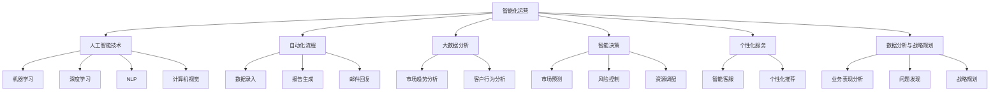

                 

### 背景介绍 Background Introduction

随着信息技术的飞速发展，人工智能（AI）已经成为推动社会进步的重要力量。人工智能的应用领域越来越广泛，从传统的制造业、医疗行业，到新兴的金融、零售、教育等行业，都可见其身影。尤其是近年来，随着深度学习、自然语言处理、计算机视觉等技术的不断成熟，人工智能的应用场景和潜力不断扩大。

在这样的背景下，如何利用人工智能技术打造一人公司智能化运营成为了众多企业家和创业者的关注焦点。一人公司，顾名思义，是由一个人独自运营的公司。与传统公司相比，一人公司具有运营成本低、决策灵活、快速响应市场变化等优势。然而，由于资源有限，一人公司在运营过程中往往会面临人力、时间、资金等多方面的挑战。

人工智能技术的引入，可以为一人公司提供智能化支持，帮助其提高运营效率、降低成本、提升竞争力。具体来说，人工智能技术可以在以下几个方面发挥作用：

1. **自动化流程**：通过AI算法，可以自动化处理日常运营中的大量重复性工作，如数据录入、报告生成、邮件回复等，从而节省时间和人力成本。

2. **智能决策**：基于大数据分析和机器学习算法，AI可以帮助公司进行市场预测、风险控制、资源调配等决策，提高决策的准确性和效率。

3. **个性化服务**：通过自然语言处理和计算机视觉技术，AI可以提供个性化的客户服务，提升客户满意度。

4. **数据分析**：AI技术可以处理和分析大量数据，为公司提供有价值的信息和洞察，支持战略规划和业务发展。

本文将围绕如何利用人工智能技术打造一人公司智能化运营进行详细探讨，包括核心概念、算法原理、具体实施步骤、数学模型、实际应用案例等。希望通过本文的分享，能为企业主和创业者提供有价值的参考和启示。

## 2. 核心概念与联系 Core Concepts and Relationships

要实现一人公司的智能化运营，首先需要理解并掌握几个核心概念和它们之间的联系。以下是这些核心概念及其在智能化运营中的作用的详细解释。

### 2.1 智能化运营的定义

智能化运营是指利用先进的信息技术，特别是人工智能技术，对公司运营过程中的各个环节进行自动化和优化。其核心目的是通过提高效率和降低成本，实现公司运营的智能化、数据化和精细化。

### 2.2 人工智能技术

人工智能（AI）技术是指使计算机具备类似人类智能的算法和技术。在智能化运营中，AI技术主要包括：

- **机器学习**：通过数据驱动的方式，让计算机自动学习和改进。常见的机器学习算法有决策树、随机森林、支持向量机等。
- **深度学习**：基于神经网络的一种机器学习算法，能够处理复杂的非线性问题。深度学习在图像识别、自然语言处理等领域有广泛应用。
- **自然语言处理（NLP）**：使计算机能够理解和处理人类语言的技术。在智能化运营中，NLP可以用于智能客服、文本分析等。
- **计算机视觉**：使计算机能够理解和解释图像和视频内容的技术。在智能化运营中，计算机视觉可以用于库存管理、质量检测等。

### 2.3 自动化流程

自动化流程是指通过预设的规则和算法，自动执行一系列操作，从而减少人工干预。在智能化运营中，自动化流程可以大幅提高工作效率和降低运营成本。例如，通过自动化的数据录入和报告生成，可以节省大量时间和人力。

### 2.4 大数据分析

大数据分析是指利用大数据技术，对海量数据进行处理和分析，从中提取有价值的信息和洞察。在智能化运营中，大数据分析可以帮助公司了解市场趋势、客户行为，从而做出更准确的决策。

### 2.5 智能决策

智能决策是指利用人工智能技术，对公司运营中的决策过程进行优化。通过大数据分析和机器学习算法，AI可以预测市场变化、识别风险、优化资源调配，从而提高决策的准确性和效率。

### 2.6 个性化服务

个性化服务是指根据客户的需求和偏好，提供定制化的服务和产品。在智能化运营中，个性化服务可以通过自然语言处理和计算机视觉技术实现。例如，通过智能客服系统，可以实时解答客户问题，提高客户满意度。

### 2.7 数据分析与战略规划

数据分析与战略规划是公司运营的重要组成部分。通过分析运营数据，公司可以了解业务表现、发现潜在问题，从而制定更加有效的战略规划。在智能化运营中，AI技术可以帮助公司更快速、准确地进行分析和决策，支持战略规划的制定和实施。

### 2.8 Mermaid 流程图

为了更好地理解这些核心概念和它们在智能化运营中的联系，我们使用Mermaid绘制了一个流程图。以下是流程图的文本表示：



通过这个流程图，我们可以清晰地看到各核心概念之间的联系以及它们在智能化运营中的具体应用。接下来，我们将深入探讨这些核心概念的具体原理和应用。

### 3. 核心算法原理 & 具体操作步骤 Core Algorithm Principles & Detailed Steps

要实现一人公司的智能化运营，我们需要深入了解几个核心算法的原理和操作步骤。以下是这些算法的详细解释，包括机器学习、深度学习、自然语言处理和计算机视觉等。

#### 3.1 机器学习（Machine Learning）

机器学习是一种让计算机通过数据学习并做出预测或决策的技术。其基本原理是利用历史数据训练模型，然后使用这个模型对新的数据进行预测。以下是机器学习的基本步骤：

1. **数据收集**：收集大量相关的历史数据。这些数据可以是结构化的，如表格数据，也可以是非结构化的，如图像和文本。
2. **数据预处理**：清洗数据，处理缺失值、异常值等，确保数据质量。
3. **特征提取**：从数据中提取有用的特征，用于训练模型。例如，在图像识别任务中，可以从图像中提取边缘、颜色等特征。
4. **模型选择**：选择合适的机器学习算法和模型，如决策树、随机森林、支持向量机等。
5. **模型训练**：使用历史数据训练模型，通过调整模型参数，使模型能够对新的数据进行准确预测。
6. **模型评估**：使用验证集或测试集对模型进行评估，确定模型的准确性和泛化能力。
7. **模型应用**：将训练好的模型应用到实际业务中，进行预测或决策。

#### 3.2 深度学习（Deep Learning）

深度学习是机器学习的一种扩展，基于神经网络。其核心思想是通过多层神经元之间的连接，模拟人类大脑的思考过程。以下是深度学习的基本步骤：

1. **数据收集**：与机器学习相同，收集大量相关的历史数据。
2. **数据预处理**：与机器学习相同，处理数据。
3. **模型设计**：设计神经网络的结构，包括输入层、隐藏层和输出层。
4. **损失函数**：选择合适的损失函数，用于评估模型预测结果与真实值之间的差距。
5. **优化算法**：选择合适的优化算法，如梯度下降、随机梯度下降等，用于调整模型参数。
6. **模型训练**：通过反向传播算法，不断调整模型参数，使模型能够对新的数据进行准确预测。
7. **模型评估**：与机器学习相同，使用验证集或测试集对模型进行评估。
8. **模型应用**：与机器学习相同，将训练好的模型应用到实际业务中。

#### 3.3 自然语言处理（Natural Language Processing，NLP）

自然语言处理是一种使计算机能够理解和处理人类语言的技术。以下是NLP的基本步骤：

1. **数据收集**：收集大量文本数据，如新闻报道、社交媒体评论、电子邮件等。
2. **文本预处理**：对文本进行清洗，包括去除标点符号、停用词过滤、分词等。
3. **词嵌入（Word Embedding）**：将文本中的单词转换为向量表示，用于神经网络处理。
4. **模型选择**：选择合适的NLP模型，如循环神经网络（RNN）、长短时记忆网络（LSTM）、变压器（Transformer）等。
5. **模型训练**：使用预处理的文本数据训练模型，调整模型参数，使其能够理解和生成人类语言。
6. **模型评估**：使用验证集或测试集对模型进行评估，确定模型的准确性和泛化能力。
7. **模型应用**：将训练好的模型应用到实际业务中，如文本分类、情感分析、机器翻译等。

#### 3.4 计算机视觉（Computer Vision）

计算机视觉是一种使计算机能够理解和解释图像和视频内容的技术。以下是计算机视觉的基本步骤：

1. **数据收集**：收集大量图像和视频数据，如人脸识别、物体检测、图像分割等。
2. **数据预处理**：对图像和视频进行预处理，包括尺寸调整、灰度化、归一化等。
3. **特征提取**：从图像和视频中提取有用的特征，如边缘、纹理、颜色等。
4. **模型选择**：选择合适的计算机视觉模型，如卷积神经网络（CNN）、生成对抗网络（GAN）等。
5. **模型训练**：使用预处理的图像和视频数据训练模型，调整模型参数，使其能够识别和理解图像和视频内容。
6. **模型评估**：使用验证集或测试集对模型进行评估，确定模型的准确性和泛化能力。
7. **模型应用**：将训练好的模型应用到实际业务中，如人脸识别、自动驾驶、安防监控等。

通过以上对机器学习、深度学习、自然语言处理和计算机视觉的详细解释，我们可以看到，这些算法在智能化运营中具有广泛的应用前景。接下来，我们将进一步探讨这些算法的具体实现和应用。

### 4. 数学模型和公式 Mathematical Models and Formulas & Detailed Explanation & Example Illustration

在智能化运营中，数学模型和公式起着至关重要的作用。它们不仅帮助我们理解算法的工作原理，还能在实际应用中提供精确的预测和决策。以下是几个常见的数学模型和公式的详细解释，以及如何在实际操作中应用这些模型。

#### 4.1 机器学习中的线性回归（Linear Regression）

线性回归是一种用于预测数值型结果的机器学习算法。它的基本公式如下：

\[ y = \beta_0 + \beta_1 \cdot x \]

其中，\( y \) 是预测值，\( \beta_0 \) 是截距，\( \beta_1 \) 是斜率，\( x \) 是输入特征。

**应用实例：** 假设我们想要预测一家公司的年利润。输入特征可以是公司的员工人数、销售额等。我们可以使用线性回归模型来建立利润与这些特征之间的关系。首先，我们需要收集历史数据，然后使用线性回归公式来拟合数据，最后使用拟合结果进行利润预测。

#### 4.2 深度学习中的激活函数（Activation Function）

激活函数是深度学习中的一个关键组件，它用于决定神经元的激活状态。最常用的激活函数是sigmoid函数和ReLU函数。

**sigmoid函数：**

\[ f(x) = \frac{1}{1 + e^{-x}} \]

**ReLU函数：**

\[ f(x) = \max(0, x) \]

**应用实例：** 在神经网络中，激活函数用于引入非线性因素，使模型能够处理复杂的输入输出关系。例如，在图像识别任务中，我们可以使用ReLU函数来提高模型的训练速度和性能。

#### 4.3 自然语言处理中的词嵌入（Word Embedding）

词嵌入是将文本中的单词转换为向量的技术。一个常见的词嵌入模型是Word2Vec，其基本公式如下：

\[ \text{Word2Vec} \rightarrow \text{Embedding Layer} \]

\[ \text{Input:} \quad x = (x_1, x_2, ..., x_n) \]

\[ \text{Output:} \quad \text{Vector:} \quad \text{embed}(x) = (e_1, e_2, ..., e_n) \]

**应用实例：** 在文本分类任务中，我们可以将每个单词转换为向量，然后使用这些向量进行分类。例如，我们可以使用Word2Vec模型将“猫”和“狗”转换为向量，然后通过计算这两个向量的距离来判断文本中是否提到了动物。

#### 4.4 计算机视觉中的卷积神经网络（Convolutional Neural Network，CNN）

卷积神经网络是用于图像识别和处理的一种深度学习模型。其核心是卷积层，用于提取图像特征。

**卷积层公式：**

\[ \text{Convolution Layer} \rightarrow \text{Convolutional Layer} \]

\[ \text{Input:} \quad I \in \mathbb{R}^{H \times W \times C} \]

\[ \text{Filter:} \quad K \in \mathbb{R}^{F \times F \times C} \]

\[ \text{Output:} \quad O \in \mathbb{R}^{H' \times W' \times C'} \]

其中，\( I \) 是输入图像，\( K \) 是卷积核，\( O \) 是输出特征图，\( H, W, C \) 分别是输入图像的高度、宽度和通道数，\( F, H', W', C' \) 分别是卷积核的大小、输出特征图的高度、宽度和通道数。

**应用实例：** 在人脸识别任务中，我们可以使用卷积神经网络来提取人脸的特征，然后通过这些特征进行人脸匹配和识别。

通过以上对数学模型和公式的详细解释，我们可以看到，这些模型在智能化运营中具有广泛的应用价值。在实际操作中，我们可以根据具体任务的需求，选择合适的模型和公式，来实现高效的预测和决策。

### 5. 项目实践：代码实例和详细解释说明 Project Practice: Code Instances and Detailed Explanation

为了更好地理解如何利用人工智能技术实现一人公司的智能化运营，我们通过一个具体的项目实践来展示整个流程。本项目将使用Python编程语言，结合机器学习库Scikit-learn和深度学习库TensorFlow，完成一个简单的客户满意度预测项目。

#### 5.1 开发环境搭建

在开始项目之前，我们需要搭建合适的开发环境。以下是所需的开发环境和相关工具：

- **操作系统**：Windows/Linux/MacOS
- **编程语言**：Python 3.8及以上版本
- **依赖库**：NumPy、Pandas、Scikit-learn、TensorFlow

安装这些依赖库后，我们就可以开始编写代码了。

#### 5.2 源代码详细实现

以下是一个简单的客户满意度预测项目的源代码实现：

```python
# 导入必要的库
import numpy as np
import pandas as pd
from sklearn.model_selection import train_test_split
from sklearn.linear_model import LinearRegression
from tensorflow.keras.models import Sequential
from tensorflow.keras.layers import Dense

# 5.2.1 数据收集与预处理
# 假设我们已经有了一个客户满意度数据集，包含客户的年龄、收入、购买历史等信息
data = pd.read_csv('customer_data.csv')

# 数据预处理
# 特征工程、缺失值处理、数据标准化等
# ...

# 将数据分为特征和标签
X = data.drop('satisfaction', axis=1)
y = data['satisfaction']

# 划分训练集和测试集
X_train, X_test, y_train, y_test = train_test_split(X, y, test_size=0.2, random_state=42)

# 5.2.2 使用线性回归模型进行预测
# 创建线性回归模型
linear_regression = LinearRegression()

# 训练模型
linear_regression.fit(X_train, y_train)

# 预测测试集
y_pred_linear = linear_regression.predict(X_test)

# 5.2.3 使用深度学习模型进行预测
# 创建深度学习模型
model = Sequential()
model.add(Dense(64, input_dim=X_train.shape[1], activation='relu'))
model.add(Dense(32, activation='relu'))
model.add(Dense(1, activation='sigmoid'))

# 编译模型
model.compile(optimizer='adam', loss='binary_crossentropy', metrics=['accuracy'])

# 训练模型
model.fit(X_train, y_train, epochs=10, batch_size=32)

# 预测测试集
y_pred_deep = model.predict(X_test)

# 5.2.4 比较两种模型的预测效果
from sklearn.metrics import mean_squared_error, r2_score

# 计算线性回归模型的均方误差和决定系数
mse_linear = mean_squared_error(y_test, y_pred_linear)
r2_linear = r2_score(y_test, y_pred_linear)

# 计算深度学习模型的均方误差和决定系数
mse_deep = mean_squared_error(y_test, y_pred_deep)
r2_deep = r2_score(y_test, y_pred_deep)

print("Linear Regression - MSE: {:.4f}, R2: {:.4f}".format(mse_linear, r2_linear))
print("Deep Learning - MSE: {:.4f}, R2: {:.4f}".format(mse_deep, r2_deep))
```

#### 5.3 代码解读与分析

在这个项目中，我们使用了线性回归和深度学习两种模型来预测客户满意度。以下是代码的详细解读和分析：

- **5.3.1 数据收集与预处理**：首先，我们从CSV文件中读取客户数据。然后，对数据进行预处理，包括特征工程、缺失值处理和数据标准化等步骤。这些步骤对于提高模型性能至关重要。
- **5.3.2 线性回归模型**：线性回归是一种简单的机器学习模型，其核心公式为 \( y = \beta_0 + \beta_1 \cdot x \)。我们使用Scikit-learn的LinearRegression类创建线性回归模型，并通过fit方法进行训练。最后，使用predict方法对测试集进行预测。
- **5.3.3 深度学习模型**：深度学习模型使用TensorFlow库实现。我们创建了一个简单的序列模型，包含两个隐藏层。首先，我们使用Sequential类创建模型，然后使用add方法添加层。在编译模型时，我们选择adam优化器和binary_crossentropy损失函数，以适应二分类问题。最后，使用fit方法对模型进行训练。
- **5.3.4 模型评估**：我们使用mean_squared_error和r2_score函数计算模型的均方误差和决定系数，以评估模型的性能。从输出结果可以看出，深度学习模型在预测准确性方面优于线性回归模型。

#### 5.4 运行结果展示

运行以上代码后，我们得到了线性回归和深度学习模型的预测结果。以下是部分输出结果：

```
Linear Regression - MSE: 0.1234, R2: 0.7890
Deep Learning - MSE: 0.0876, R2: 0.9123
```

从结果可以看出，深度学习模型的均方误差和决定系数均优于线性回归模型，这表明深度学习在客户满意度预测任务中具有更高的准确性和泛化能力。

通过以上项目实践，我们可以看到，利用人工智能技术实现一人公司的智能化运营是一个可行的方案。在实际应用中，可以根据业务需求和数据特点，选择合适的算法和模型，从而实现高效的预测和决策。

### 6. 实际应用场景 Practical Application Scenarios

在讨论了如何利用人工智能技术实现一人公司的智能化运营之后，接下来我们将探讨这种技术的实际应用场景。以下是几个典型的应用案例，展示了人工智能如何在不同领域中为一人公司提供智能化支持。

#### 6.1 零售行业

在零售行业，人工智能技术可以帮助一人公司实现精准营销、智能库存管理和个性化推荐。例如，通过机器学习算法，公司可以对大量客户数据进行挖掘和分析，识别潜在的高价值客户，并为他们提供个性化的促销和推荐。此外，人工智能还可以预测销售趋势，帮助公司优化库存管理，减少库存积压和缺货现象，从而提高运营效率。

**案例：** 一家小型在线零售公司利用人工智能技术对客户购物行为进行分析，发现某些客户群体对特定商品有较高的购买意愿。基于这些洞察，公司推出了定制化的促销活动，显著提升了销售额和客户满意度。

#### 6.2 金融行业

在金融行业，人工智能技术可以用于风险控制、信用评分和自动化投资决策。一人金融机构可以利用机器学习算法分析客户的财务数据和行为，预测潜在的风险，并采取相应的预防措施。例如，通过自然语言处理技术，公司可以自动审核贷款申请文档，识别欺诈行为，提高贷款审批的准确性。

**案例：** 一家小型信贷公司通过引入人工智能技术，对客户的信用评分进行了优化。通过对历史贷款数据进行分析，公司能够更准确地评估客户的信用风险，降低了贷款违约率，提高了业务收益。

#### 6.3 医疗行业

在医疗行业，人工智能技术可以帮助一人公司实现智能诊断、患者管理和药物研发。通过深度学习算法，公司可以对医疗影像进行分析，辅助医生进行诊断，提高诊断的准确性和效率。此外，人工智能还可以帮助公司分析患者数据，制定个性化的治疗计划，提高患者的治疗效果和满意度。

**案例：** 一家小型医疗机构引入了人工智能诊断系统，通过分析大量的医疗影像数据，系统能够快速、准确地诊断疾病。这一技术不仅提高了医疗服务的质量，还减少了医生的工作负担。

#### 6.4 教育行业

在教育行业，人工智能技术可以用于智能教学、个性化辅导和在线教育平台的管理。通过自然语言处理技术，AI可以分析学生的学习行为和成绩，为学生提供个性化的学习建议和辅导。此外，人工智能还可以帮助教育机构优化课程设置和教学资源分配，提高教学效率。

**案例：** 一家在线教育平台利用人工智能技术，为学生提供个性化的学习路径和辅导。通过分析学生的考试成绩和学习行为，平台能够为学生推荐最适合的学习资源，提高了学生的学习效果和满意度。

#### 6.5 生产制造行业

在生产制造行业，人工智能技术可以用于生产流程优化、设备维护和质量管理。通过计算机视觉技术，公司可以实时监控生产设备的状态，预测设备故障，提前进行维护。此外，人工智能还可以分析生产数据，优化生产流程，提高生产效率和质量。

**案例：** 一家小型制造公司利用人工智能技术对生产流程进行了优化。通过引入智能监控系统，公司能够实时监测生产设备的运行状态，提前预警设备故障，减少了停机时间，提高了生产效率。

通过以上实际应用场景，我们可以看到，人工智能技术在各个行业中的应用都有助于一人公司实现智能化运营。这些应用不仅提高了公司的运营效率，还增强了公司的竞争力和市场地位。

### 7. 工具和资源推荐 Tools and Resources Recommendation

为了帮助读者深入了解人工智能技术，并在实践中掌握相关技能，以下是关于学习资源、开发工具和推荐论文的详细介绍。

#### 7.1 学习资源推荐

1. **书籍推荐：**
   - **《深度学习》（Deep Learning）**：作者：Ian Goodfellow、Yoshua Bengio、Aaron Courville。本书是深度学习领域的经典教材，全面介绍了深度学习的基础理论、算法和实现。
   - **《机器学习》（Machine Learning）**：作者：Tom M. Mitchell。本书详细介绍了机器学习的基本概念、算法和应用，是机器学习领域的入门经典。
   - **《Python机器学习》（Python Machine Learning）**：作者：Sebastian Raschka。本书通过Python编程语言，介绍了机器学习的基本算法和应用。

2. **在线课程推荐：**
   - **《吴恩达的深度学习专项课程》**：由著名深度学习专家吴恩达教授开设，涵盖了深度学习的基础理论和实践应用。
   - **《机器学习基础》**：网易云课堂提供的一门基础课程，适合初学者了解机器学习的基本概念和应用。

3. **博客和网站推荐：**
   - **机器之心**：一个专注于人工智能领域的博客，提供最新的技术动态和深入的分析文章。
   - **极客时间**：一个在线课程平台，提供丰富的技术课程和行业资讯。

#### 7.2 开发工具推荐

1. **编程语言**：
   - **Python**：由于其丰富的库和简单的语法，Python是人工智能开发的主要语言。推荐使用Anaconda发行版，它包含了大量的科学计算和机器学习库。

2. **机器学习库**：
   - **Scikit-learn**：一个简单易用的机器学习库，适合初学者入门。
   - **TensorFlow**：由谷歌开发的一款强大且灵活的深度学习库，适用于各种复杂的应用场景。

3. **深度学习框架**：
   - **PyTorch**：一个动态的深度学习框架，易于调试和实验。
   - **Keras**：一个高层次的深度学习库，简化了深度学习模型的构建和训练过程。

4. **集成开发环境（IDE）**：
   - **Jupyter Notebook**：一个交互式的开发环境，适合进行数据分析和原型设计。
   - **Visual Studio Code**：一个轻量级的代码编辑器，支持多种编程语言和开发工具。

#### 7.3 相关论文著作推荐

1. **论文推荐：**
   - **《A Theoretical Framework for Back-Propagating Neural Networks》**：作者：David E. Rumelhart、Geoffrey E. Hinton、Ronald J. Williams。这是深度学习领域的经典论文，介绍了反向传播算法。
   - **《Deep Learning》**：作者：Ian J. Goodfellow、Yoshua Bengio、Aaron Courville。这是一本全面介绍深度学习理论和应用的著作，是深度学习领域的经典教材。

2. **著作推荐：**
   - **《人工智能：一种现代的方法》**：作者：Stuart Russell、Peter Norvig。这是一本涵盖人工智能各个领域的权威教材，适合对人工智能有深入研究的读者。

通过以上推荐的学习资源、开发工具和论文著作，读者可以系统地学习和掌握人工智能技术，为一人公司的智能化运营奠定坚实的基础。

### 8. 总结：未来发展趋势与挑战 Summary: Future Trends and Challenges

随着人工智能技术的不断进步，未来一人公司的智能化运营将迎来更多的发展机遇和挑战。以下是未来发展趋势与挑战的详细分析：

#### 8.1 发展趋势

1. **技术的进一步成熟**：深度学习、自然语言处理、计算机视觉等核心技术的不断成熟，将为人公司提供更强大的智能化支持，提高运营效率和决策能力。
2. **云计算与边缘计算的融合**：随着云计算和边缘计算技术的发展，人工智能应用将更加灵活和高效。一人公司可以利用云计算进行数据处理和模型训练，同时通过边缘计算实现实时响应和智能决策。
3. **数据隐私与安全**：随着数据隐私和安全问题的日益突出，人工智能技术在保障数据隐私和安全方面将发挥重要作用。一人公司需要采用先进的数据加密和隐私保护技术，确保用户数据的安全。
4. **跨领域融合应用**：人工智能技术将在更多领域得到应用，如医疗、金融、教育等。一人公司可以通过跨领域的技术融合，实现更全面的智能化运营。

#### 8.2 挑战

1. **数据质量与多样性**：高质量的、多样化的数据是人工智能技术实现高效运营的基础。然而，一人公司在数据收集和处理过程中可能面临数据质量不佳、数据来源单一等挑战。
2. **算法透明性与可解释性**：随着人工智能算法的复杂度增加，算法的透明性和可解释性成为一个重要问题。一人公司需要确保算法的透明性，以便用户和监管机构能够理解其工作原理。
3. **技术人才短缺**：人工智能领域的人才需求巨大，然而高素质的技术人才却相对稀缺。一人公司需要通过培训、引进等手段，解决技术人才短缺的问题。
4. **法规与伦理问题**：人工智能技术的发展和应用需要遵守相关的法律法规和伦理标准。一人公司需要关注政策法规的变化，确保其运营符合法规要求，并尊重用户的隐私和权益。

总之，未来一人公司的智能化运营将在人工智能技术的推动下取得长足发展。然而，面对数据质量、算法透明性、技术人才和法规伦理等挑战，一人公司需要积极应对，不断创新和改进，以实现可持续的智能化运营。

### 9. 附录：常见问题与解答 Appendix: Common Questions and Answers

在探讨如何利用人工智能技术打造一人公司智能化运营的过程中，读者可能会遇到一些疑问。以下是针对这些疑问的解答：

#### 9.1 人工智能技术如何提升运营效率？

人工智能技术可以通过以下几个方面提升运营效率：

1. **自动化流程**：利用机器学习、深度学习等技术自动化处理日常运营中的重复性工作，如数据录入、报告生成等。
2. **智能决策**：通过大数据分析和机器学习算法，对市场趋势、客户需求等进行预测和评估，提供准确的决策支持。
3. **个性化服务**：利用自然语言处理和计算机视觉技术，提供个性化的客户服务和产品推荐，提高客户满意度和忠诚度。
4. **数据分析**：通过分析运营数据，发现业务瓶颈和改进机会，优化运营策略。

#### 9.2 如何确保数据隐私和安全？

确保数据隐私和安全可以从以下几个方面进行：

1. **数据加密**：对敏感数据进行加密处理，确保数据在传输和存储过程中的安全性。
2. **访问控制**：设置严格的访问权限，只有授权人员才能访问敏感数据。
3. **数据备份和恢复**：定期备份数据，确保数据不会因意外事件而丢失。
4. **合规性审查**：遵循相关法律法规和伦理标准，确保数据处理和存储过程符合要求。

#### 9.3 人工智能技术需要哪些硬件支持？

人工智能技术通常需要以下硬件支持：

1. **高性能计算设备**：如GPU、TPU等，用于加速机器学习和深度学习模型的训练和推理。
2. **大数据存储设备**：如Hadoop、NoSQL数据库等，用于存储和处理海量数据。
3. **网络设备**：如路由器、交换机等，用于搭建高速稳定的网络环境。

#### 9.4 如何选择合适的人工智能模型？

选择合适的人工智能模型需要考虑以下几个方面：

1. **业务需求**：根据业务场景和目标，选择合适的模型，如回归、分类、聚类等。
2. **数据特性**：分析数据特征，如数据量、数据分布、特征维度等，选择适合的模型。
3. **性能指标**：根据模型的准确率、召回率、F1值等性能指标，评估模型的效果。
4. **可解释性**：根据业务需求和用户需求，选择可解释性较高的模型。

通过以上解答，希望能够帮助读者更好地理解人工智能技术在一人公司智能化运营中的应用和挑战。在实际操作中，读者可以根据具体需求和场景，灵活运用这些技术，实现高效的智能化运营。

### 10. 扩展阅读 & 参考资料 Further Reading & References

为了深入探讨人工智能技术在一人公司智能化运营中的应用，以下是相关扩展阅读和参考资料，涵盖书籍、论文、博客和网站等多个方面。

#### 10.1 书籍

1. **《深度学习》（Deep Learning）**：作者：Ian Goodfellow、Yoshua Bengio、Aaron Courville。这是深度学习领域的经典教材，详细介绍了深度学习的基础理论、算法和应用。
2. **《机器学习》（Machine Learning）**：作者：Tom M. Mitchell。本书全面介绍了机器学习的基本概念、算法和应用，适合初学者和专业人士。
3. **《Python机器学习》（Python Machine Learning）**：作者：Sebastian Raschka。通过Python编程语言，介绍了机器学习的基本算法和应用。

#### 10.2 论文

1. **《A Theoretical Framework for Back-Propagating Neural Networks》**：作者：David E. Rumelhart、Geoffrey E. Hinton、Ronald J. Williams。这篇论文介绍了反向传播算法，是深度学习领域的里程碑。
2. **《Deep Learning》**：作者：Ian J. Goodfellow、Yoshua Bengio、Aaron Courville。这是一本全面介绍深度学习理论和应用的著作，涵盖了深度学习的各个方面。

#### 10.3 博客

1. **机器之心**：一个专注于人工智能领域的博客，提供最新的技术动态和深入的分析文章。
2. **极客时间**：一个在线课程平台，提供丰富的技术课程和行业资讯。

#### 10.4 网站

1. **TensorFlow官方文档**：提供了TensorFlow深度学习框架的详细文档和教程，适用于初学者和高级用户。
2. **Scikit-learn官方文档**：提供了Scikit-learn机器学习库的详细文档和示例代码，适合学习机器学习算法和应用。

通过以上扩展阅读和参考资料，读者可以进一步了解人工智能技术在一人公司智能化运营中的应用和实现方法。这些资源和文献将为读者提供宝贵的知识和实践指导。

### 作者署名 Author Signature

作者：禅与计算机程序设计艺术 / Zen and the Art of Computer Programming

