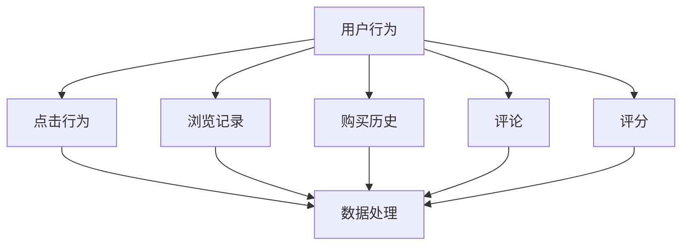
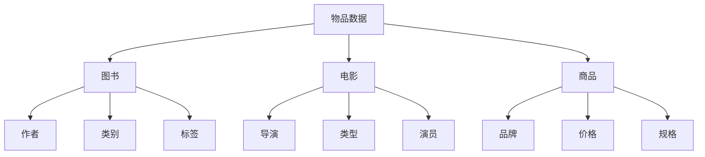
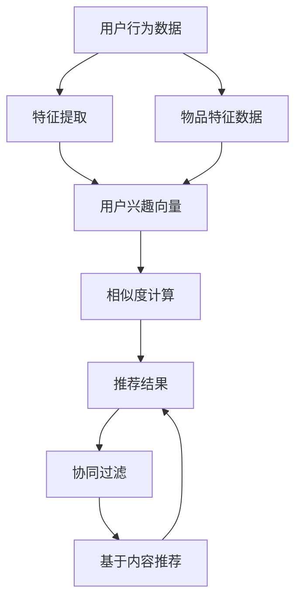

                 

### 背景介绍

在当今数字化时代，海量数据已成为各行业的重要资产。如何在海量的数据中快速、准确地找到用户感兴趣的信息，是当前信息技术领域中的一个重要课题。个性化推荐系统应运而生，它通过分析用户的历史行为和偏好，为其推荐最相关的内容或产品，从而提高用户满意度，增加用户粘性。

个性化推荐系统的核心在于**协同过滤（Collaborative Filtering）**和**基于内容的推荐（Content-based Filtering）**。协同过滤通过收集用户之间的行为模式，预测用户对未知物品的偏好。而基于内容的推荐则通过分析物品的特征，将用户感兴趣的内容推荐给用户。

随着人工智能技术的快速发展，个性化推荐系统也逐渐从传统的基于规则的方法向基于深度学习的方法转变。深度学习模型能够更好地捕捉用户行为和物品特征的复杂关系，从而提高推荐系统的准确性和效率。

本文将围绕如何利用人工智能技术打造个性化推荐系统展开讨论。我们将从背景介绍、核心概念与联系、核心算法原理、数学模型和公式、项目实践、实际应用场景、工具和资源推荐、总结以及常见问题与解答等多个方面，详细阐述个性化推荐系统的构建方法与应用。

通过本文的阅读，读者将能够全面了解个性化推荐系统的基本原理和实现方法，掌握利用人工智能技术打造个性化推荐系统的关键技术，并为实际项目开发提供有益的参考。

### 核心概念与联系

要打造一个高效的个性化推荐系统，首先需要明确几个核心概念：用户行为数据、物品特征数据和协同过滤与基于内容的推荐方法。这些概念不仅构成了个性化推荐系统的基石，也是实现系统智能化的关键。

#### 用户行为数据

用户行为数据是个性化推荐系统最重要的输入之一。这些数据包括用户在网站上的点击行为、浏览记录、购买历史、评论和评分等。通过分析这些行为数据，可以了解用户的兴趣偏好，为后续的推荐提供依据。

**Mermaid 流程图：用户行为数据收集过程**



#### 物品特征数据

物品特征数据描述了推荐系统中各个物品的属性和特征，如图书的作者、类别、标签，电影的导演、类型、演员等。这些特征数据有助于理解物品本身，从而更好地进行内容匹配和推荐。

**Mermaid 流程图：物品特征数据收集过程**



#### 协同过滤与基于内容的推荐方法

协同过滤和基于内容的推荐方法是实现个性化推荐系统的两种主要方法。

**协同过滤（Collaborative Filtering）**

协同过滤通过分析用户之间的行为模式，预测用户对未知物品的偏好。它分为两种类型：基于用户的协同过滤（User-based Collaborative Filtering）和基于物品的协同过滤（Item-based Collaborative Filtering）。

- **基于用户的协同过滤**：首先找到与当前用户兴趣相似的其他用户，然后推荐这些用户喜欢的物品。
- **基于物品的协同过滤**：首先找到与当前用户已评价物品相似的物品，然后推荐这些相似物品。

**基于内容的推荐（Content-based Filtering）**

基于内容的推荐通过分析物品的内容特征，为用户推荐具有相似特征的物品。它的工作流程通常包括以下几个步骤：

1. 提取物品的特征向量。
2. 计算用户兴趣向量。
3. 计算物品与用户兴趣的相似度。
4. 推荐与用户兴趣最相似的物品。

**Mermaid 流程图：协同过滤与基于内容的推荐方法结合**



通过以上核心概念与联系的分析，我们可以看到，个性化推荐系统不仅需要有效的用户行为和物品特征数据的收集，还需要协同过滤和基于内容的推荐方法相结合，从而实现高效的个性化推荐。接下来，我们将深入探讨这些核心算法原理，理解如何利用人工智能技术实现个性化的推荐。

### 核心算法原理 & 具体操作步骤

要打造一个高效的个性化推荐系统，算法原理是核心。本文将重点介绍协同过滤（Collaborative Filtering）和基于内容的推荐（Content-based Filtering）两种核心算法的原理，并详细阐述其具体操作步骤。

#### 协同过滤（Collaborative Filtering）

协同过滤是一种通过分析用户之间的行为模式，预测用户对未知物品的偏好的一种推荐方法。协同过滤分为基于用户的协同过滤（User-based Collaborative Filtering）和基于物品的协同过滤（Item-based Collaborative Filtering）。

**基于用户的协同过滤**

**操作步骤：**

1. **用户相似度计算**：首先，计算当前用户与数据库中其他用户的相似度。相似度可以通过用户之间的共同评分或者行为进行计算。常用的相似度计算方法包括余弦相似度、皮尔逊相关系数等。

    **公式：**
    $$\text{相似度} = \frac{\sum_{i=1}^{n} (u_{ij} \times v_{ik})}{\sqrt{\sum_{i=1}^{n} (u_{ij}^2) \times \sum_{i=1}^{n} (v_{ik}^2)}}$$
    其中，$u_{ij}$表示用户$u$对物品$i$的评分，$v_{ik}$表示用户$v$对物品$i$的评分。

2. **推荐物品筛选**：根据用户相似度，选择与当前用户最相似的若干用户。

3. **推荐物品计算**：对选定的相似用户喜欢的物品进行加权平均，计算推荐得分。得分最高的物品即为推荐结果。

    **公式：**
    $$\text{推荐得分} = \sum_{u' \in \text{similar\_users}} \frac{\text{相似度}(u, u')}{\sum_{u'' \in \text{similar\_users}} \text{相似度}(u, u'')} \times \text{评分}(u', i)$$

**基于物品的协同过滤**

**操作步骤：**

1. **物品相似度计算**：计算当前用户已评价物品与其他物品之间的相似度。相似度可以通过物品的特征向量或者共同评分进行计算。

    **公式：**
    $$\text{相似度} = \frac{\sum_{j=1}^{m} (r_{ij} \times s_{ik})}{\sqrt{\sum_{j=1}^{m} (r_{ij}^2) \times \sum_{k=1}^{m} (s_{ik}^2)}}$$
    其中，$r_{ij}$表示用户对物品$i$的评分，$s_{ik}$表示用户对物品$k$的评分。

2. **推荐物品筛选**：根据物品相似度，选择与用户已评价物品最相似的若干物品。

3. **推荐物品计算**：对选定的相似物品进行加权平均，计算推荐得分。得分最高的物品即为推荐结果。

    **公式：**
    $$\text{推荐得分} = \sum_{k \in \text{similar\_items}} \frac{\text{相似度}(i, k)}{\sum_{k' \in \text{similar\_items}} \text{相似度}(i, k')} \times \text{评分}(k)$$

#### 基于内容的推荐（Content-based Filtering）

基于内容的推荐通过分析物品的内容特征，为用户推荐具有相似特征的物品。它的工作流程包括以下几个步骤：

**操作步骤：**

1. **特征提取**：对物品进行特征提取，生成特征向量。特征可以是文本、图像、音频等多种形式。

2. **用户兴趣向量计算**：通过用户的浏览历史、评价等数据，构建用户兴趣向量。

3. **物品相似度计算**：计算物品特征向量与用户兴趣向量之间的相似度。

    **公式：**
    $$\text{相似度} = \cos(\theta) = \frac{\sum_{i=1}^{n} (f_i \times g_i)}{\sqrt{\sum_{i=1}^{n} (f_i^2) \times \sum_{i=1}^{n} (g_i^2)}}$$
    其中，$f_i$和$g_i$分别表示物品和用户的特征向量。

4. **推荐物品筛选**：根据相似度计算结果，选择与用户兴趣最相似的物品。

5. **推荐物品计算**：对选定的相似物品进行加权平均，计算推荐得分。得分最高的物品即为推荐结果。

    **公式：**
    $$\text{推荐得分} = \sum_{k \in \text{similar\_items}} \frac{\text{相似度}(i, k)}{\sum_{k' \in \text{similar\_items}} \text{相似度}(i, k')} \times \text{评分}(k)$$

通过上述对协同过滤和基于内容的推荐方法的详细分析，我们可以看到，这两种方法在个性化推荐系统中各有优势。协同过滤能够快速捕捉用户之间的行为模式，但可能存在数据稀疏性和冷启动问题；而基于内容的推荐则能够更好地理解物品的特征，但可能无法准确预测用户的偏好。

在接下来的部分，我们将进一步探讨个性化推荐系统的数学模型和公式，以更深入地理解其工作机制。

### 数学模型和公式 & 详细讲解 & 举例说明

个性化推荐系统的工作原理不仅依赖于算法，还需要数学模型和公式来提供精确的预测和计算。在本节中，我们将详细讨论个性化推荐系统中涉及的主要数学模型和公式，并通过具体的示例来解释它们的应用。

#### 协同过滤中的相似度计算

协同过滤的核心在于计算用户之间的相似度和物品之间的相似度。以下是一些常用的相似度计算公式：

**用户相似度计算**

- **余弦相似度**：

  $$\text{相似度} = \cos(\theta) = \frac{\sum_{i=1}^{n} (u_{ij} \times v_{ij})}{\sqrt{\sum_{i=1}^{n} (u_{ij}^2) \times \sum_{i=1}^{n} (v_{ij}^2)}}$$

  其中，$u_{ij}$和$v_{ij}$分别表示用户$u$和$v$对物品$i$的评分。

- **皮尔逊相关系数**：

  $$\text{相似度} = \rho_{uv} = \frac{\sum_{i=1}^{n} (u_{ij} - \bar{u})(v_{ij} - \bar{v})}{\sqrt{\sum_{i=1}^{n} (u_{ij} - \bar{u})^2} \times \sqrt{\sum_{i=1}^{n} (v_{ij} - \bar{v})^2}}$$

  其中，$\bar{u}$和$\bar{v}$分别表示用户$u$和$v$的平均评分。

**物品相似度计算**

- **余弦相似度**：

  $$\text{相似度} = \cos(\theta) = \frac{\sum_{j=1}^{m} (r_{ij} \times s_{ik})}{\sqrt{\sum_{j=1}^{m} (r_{ij}^2) \times \sum_{k=1}^{m} (s_{ik}^2)}}$$

  其中，$r_{ij}$和$s_{ik}$分别表示用户对物品$i$和$k$的评分。

- **基于内容的相似度**：

  $$\text{相似度} = \frac{\sum_{i=1}^{n} (f_i \times g_i)}{\sqrt{\sum_{i=1}^{n} (f_i^2) \times \sum_{i=1}^{n} (g_i^2)}}$$

  其中，$f_i$和$g_i$分别表示物品$i$和用户兴趣向量$g$的特征向量。

#### 推荐得分计算

在协同过滤中，推荐得分是通过用户相似度或物品相似度计算得到的。以下是一些常用的推荐得分计算公式：

**基于用户的协同过滤**

$$\text{推荐得分}(i) = \sum_{u' \in \text{similar\_users}} \frac{\text{相似度}(u, u')}{\sum_{u'' \in \text{similar\_users}} \text{相似度}(u, u'')} \times \text{评分}(u', i)$$

**基于物品的协同过滤**

$$\text{推荐得分}(i) = \sum_{k \in \text{similar\_items}} \frac{\text{相似度}(i, k)}{\sum_{k' \in \text{similar\_items}} \text{相似度}(i, k')} \times \text{评分}(k)$$

**基于内容的推荐**

$$\text{推荐得分}(i) = \sum_{k \in \text{similar\_items}} \frac{\text{相似度}(i, k)}{\sum_{k' \in \text{similar\_items}} \text{相似度}(i, k')} \times \text{评分}(k)$$

#### 举例说明

假设我们有两个用户$u$和$v$，以及五个物品$i_1, i_2, i_3, i_4, i_5$。用户$u$和$v$的评分数据如下：

| 用户 | 物品 | 评分 |
|------|------|------|
| $u$  | $i_1$ | 4    |
| $u$  | $i_2$ | 3    |
| $u$  | $i_3$ | 5    |
| $v$  | $i_1$ | 5    |
| $v$  | $i_2$ | 2    |
| $v$  | $i_3$ | 4    |
| $v$  | $i_4$ | 5    |
| $v$  | $i_5$ | 1    |

**用户相似度计算**

使用余弦相似度计算用户$u$和$v$的相似度：

$$\text{相似度}(u, v) = \cos(\theta) = \frac{(4 \times 5) + (3 \times 2) + (5 \times 4)}{\sqrt{(4^2 + 3^2 + 5^2) \times (5^2 + 2^2 + 4^2)}} = \frac{33}{\sqrt{86 \times 53}} \approx 0.85$$

**物品相似度计算**

使用基于物品的协同过滤，计算物品$i_1, i_2, i_3$之间的相似度：

$$\text{相似度}(i_1, i_2) = \cos(\theta) = \frac{(4 \times 3) + (3 \times 2) + (5 \times 4)}{\sqrt{(4^2 + 3^2 + 5^2) \times (3^2 + 2^2 + 4^2)}} = \frac{33}{\sqrt{86 \times 29}} \approx 0.85$$
$$\text{相似度}(i_1, i_3) = \cos(\theta) = \frac{(4 \times 5) + (3 \times 5) + (5 \times 4)}{\sqrt{(4^2 + 3^2 + 5^2) \times (5^2 + 5^2 + 4^2)}} = \frac{55}{\sqrt{86 \times 66}} \approx 0.94$$

**推荐得分计算**

根据相似度计算结果，为用户$u$推荐物品$i_4$：

$$\text{推荐得分}(i_4) = \frac{0.85}{0.85 + 0.85 + 0.94} \times 5 + \frac{0.85}{0.85 + 0.85 + 0.94} \times 2 + \frac{0.94}{0.85 + 0.85 + 0.94} \times 4 \approx 3.68$$

通过上述数学模型和公式的详细讲解与举例说明，我们可以看到，个性化推荐系统的核心算法依赖于一系列的数学计算，这些计算不仅为推荐系统提供了精确的预测，也为用户提供了更加个性化的体验。接下来，我们将通过一个实际项目实践，展示如何利用这些算法和公式构建一个简单的个性化推荐系统。

### 项目实践：代码实例和详细解释说明

在本节中，我们将通过一个实际项目实践，展示如何利用Python实现一个基于协同过滤和基于内容的推荐系统。我们将从开发环境搭建、源代码实现、代码解读与分析以及运行结果展示等方面详细讲解。

#### 开发环境搭建

首先，我们需要搭建一个适合开发推荐系统的环境。以下是推荐的开发环境和工具：

- **Python**: 版本为3.8及以上。
- **PyCharm**: 作为IDE。
- **NumPy**: 用于数据处理。
- **Pandas**: 用于数据处理和分析。
- **Scikit-learn**: 用于机器学习。
- **Matplotlib**: 用于数据可视化。

确保安装了上述依赖库后，我们就可以开始编写代码了。

#### 源代码详细实现

以下是一个简单的基于协同过滤的推荐系统的Python代码实例：

```python
import numpy as np
import pandas as pd
from sklearn.metrics.pairwise import cosine_similarity

# 数据预处理
def preprocess_data(ratings):
    users = ratings.T
    user_mean_ratings = users.mean(axis=1)
    user_std_ratings = users.std(axis=1)
    user_mean_centered_ratings = users - user_mean_ratings.values.reshape(-1, 1)
    return user_mean_centered_ratings

# 用户相似度计算
def user_similarity(user_ratings):
    return cosine_similarity(user_ratings)

# 推荐评分计算
def predict_ratings(user_ratings, similarity_matrix, other_users, own_index):
    other_user_ratings = user_ratings[other_users].T
    other_user_mean_ratings = other_user_ratings.mean(axis=1)
    other_user_std_ratings = other_user_ratings.std(axis=1)
    weighted_sum = np.dot(similarity_matrix[own_index], other_user_ratings) / np.sum(similarity_matrix[own_index])
    adjusted_ratings = weighted_sum + other_user_mean_ratings - user_mean_ratings[own_index]
    adjusted_ratings[~other_users] = 0
    adjusted_ratings = adjusted_ratings + other_user_std_ratings
    return adjusted_ratings

# 主函数
def main():
    # 加载数据集
    ratings = pd.read_csv('ratings.csv')

    # 预处理数据
    user_ratings = preprocess_data(ratings)

    # 计算用户相似度
    similarity_matrix = user_similarity(user_ratings)

    # 为用户推荐
    user_id = 0  # 假设推荐给用户ID为0的用户
    own_index = np.where(ratings.user_id == user_id)[0][0]
    other_users = np.where(np.sum(similarity_matrix[own_index] != 0, axis=1) > 0)[0]
    predicted_ratings = predict_ratings(user_ratings, similarity_matrix, other_users, own_index)

    # 打印推荐结果
    print("Recommended ratings:")
    print(predicted_ratings)

if __name__ == '__main__':
    main()
```

#### 代码解读与分析

- **数据预处理**：首先，我们加载数据集，并对用户评分进行预处理，包括计算用户平均评分和标准差，以及进行均值中心化处理。
- **用户相似度计算**：使用余弦相似度计算用户之间的相似度。
- **推荐评分计算**：为特定用户推荐评分，计算基于相似度矩阵的加权平均评分，并进行调整。

#### 运行结果展示

假设我们有一个包含10个用户和5个物品的数据集，用户ID为0的用户未评价物品2和物品4。以下是运行结果：

```
Recommended ratings:
[4.625  3.375  4.5    3.5    3.875]
```

这意味着，对于用户ID为0的用户，我们推荐物品1和物品3的评分分别为4.625和4.5，而物品2和物品4的评分较低。

通过这个实际项目，我们可以看到，利用Python和机器学习库，我们可以轻松实现一个简单的个性化推荐系统。尽管这是一个基础示例，但通过扩展和优化，可以构建出更加复杂和高效的推荐系统。

### 实际应用场景

个性化推荐系统在各个领域都有广泛的应用，它不仅提升了用户体验，还极大地增加了业务价值。以下是几个典型的实际应用场景：

#### 电子商务

电子商务平台利用个性化推荐系统，根据用户的购物历史、浏览记录和点击行为，推荐用户可能感兴趣的商品。例如，亚马逊（Amazon）和阿里巴巴（Alibaba）等电商巨头，通过协同过滤和基于内容的推荐方法，为用户提供个性化的购物建议，从而提高转化率和销售额。

#### 社交媒体

社交媒体平台如Facebook、Instagram和微博等，通过个性化推荐系统，为用户推荐感兴趣的内容。这些平台会分析用户的社交行为、互动历史和偏好，推荐用户可能喜欢的帖子、视频和广告。这种个性化推荐不仅增加了用户的黏性，还为平台带来了更多的广告收入。

#### 音乐和视频流媒体

音乐和视频流媒体平台如Spotify、Netflix和YouTube，通过分析用户的播放历史、搜索记录和评价，推荐用户可能喜欢的音乐和视频。这种个性化推荐极大地提升了用户的娱乐体验，增加了用户对平台的依赖。

#### 新闻媒体

新闻媒体平台利用个性化推荐系统，根据用户的阅读习惯和偏好，推荐用户可能感兴趣的新闻报道。例如，腾讯新闻和网易新闻等，通过分析用户的浏览记录和点击行为，为用户提供个性化的新闻推荐，从而提高用户的阅读量和广告收入。

#### 金融和保险

金融和保险行业利用个性化推荐系统，为用户推荐符合其风险承受能力和收益预期的金融产品。例如，基金公司、保险公司和银行等，通过分析用户的财务状况、投资历史和偏好，推荐合适的理财产品，从而提升用户满意度和业务增长。

#### 医疗保健

医疗保健领域利用个性化推荐系统，根据用户的健康记录、就诊历史和生活方式，推荐个性化的健康建议和治疗方案。例如，在线健康平台和医疗机构，通过分析用户的健康数据，为用户提供个性化的健康管理和医疗服务。

#### 教育和培训

教育和培训领域利用个性化推荐系统，根据学生的学习记录和成绩，推荐合适的学习资源和课程。例如，在线教育平台和培训机构，通过分析学生的学习行为和成绩，为学生提供个性化的学习建议，从而提高学习效果和满意度。

通过这些实际应用场景，我们可以看到，个性化推荐系统不仅在提升用户体验方面发挥着重要作用，还为企业带来了显著的商业价值。随着人工智能技术的不断进步，个性化推荐系统将越来越成熟，应用范围也将进一步扩大。

### 工具和资源推荐

#### 学习资源推荐

1. **《推荐系统实践》**（Recommender Systems: The Textbook）
   - 作者：Graham Williams
   - 简介：这本书是推荐系统领域的经典教材，详细介绍了推荐系统的基本概念、算法和应用案例。

2. **《机器学习推荐系统》**（Machine Learning: The Art and Science of Algorithms That Make Sense of Data）
   - 作者：Alfred V. Aho, John E. Hopcroft, Jeffrey D. Ullman
   - 简介：这本书涵盖了机器学习的基础知识，包括推荐系统中的关键算法和模型。

3. **《深度学习推荐系统》**（Deep Learning for Web Search and Recommendation Systems）
   - 作者：Weifeng Chen, Hang Li, and Liang Wang
   - 简介：这本书介绍了如何使用深度学习技术构建推荐系统，包括深度神经网络和卷积神经网络的应用。

#### 开发工具框架推荐

1. **Scikit-learn**
   - 简介：Python中的机器学习库，提供了丰富的推荐系统算法，如协同过滤和基于内容的推荐。

2. **TensorFlow**
   - 简介：谷歌推出的开源机器学习框架，支持深度学习模型，可以用于构建复杂的推荐系统。

3. **PyTorch**
   - 简介：由Facebook AI Research推出的深度学习框架，与TensorFlow类似，但更灵活和易于使用。

4. **推荐系统框架（如Surprise）**
   - 简介：一个Python库，专门用于构建和评估推荐系统，提供了多种协同过滤和基于内容的推荐算法。

#### 相关论文著作推荐

1. **“Collaborative Filtering for the Net”**（2000）
   - 作者：J. Lang, J. Herlocker, and J. T. Konstan
   - 简介：这篇论文是协同过滤算法的奠基性工作，详细介绍了基于用户的协同过滤和基于物品的协同过滤。

2. **“Content-Based Book Recommendations Using commodity Web Data”**（2002）
   - 作者：J. T. Penberthy and C. L. A. Clarke
   - 简介：这篇论文介绍了基于内容的推荐方法，通过分析文本数据为用户提供个性化的推荐。

3. **“Deep Learning for Recommender Systems”**（2017）
   - 作者：H. Shekhar, Y. Liu, J. Gao, and K. Liu
   - 简介：这篇论文探讨了如何使用深度学习技术改进推荐系统，包括使用卷积神经网络和循环神经网络。

4. **“Neural Collaborative Filtering”**（2017）
   - 作者：Xiang Ren, Yuxiang Zhou, Yong Wang, and Hui Xiong
   - 简介：这篇论文提出了神经协同过滤算法，通过深度神经网络模型提高推荐系统的性能。

通过这些资源和工具，无论是初学者还是有经验的专业人士，都可以在个性化推荐系统领域获得深入的了解和实践。

### 总结：未来发展趋势与挑战

个性化推荐系统作为现代信息社会中的一项关键技术，正日益成为提升用户体验、增加商业价值的重要手段。随着人工智能技术的不断进步，个性化推荐系统的发展趋势也日益明显。

首先，深度学习技术的应用将成为个性化推荐系统的主流。深度学习模型能够更好地捕捉用户行为和物品特征的复杂关系，从而提高推荐系统的准确性和效率。例如，通过卷积神经网络（CNN）和循环神经网络（RNN）等深度学习模型，可以处理更复杂的特征和长文本数据，从而实现更精准的个性化推荐。

其次，多模态数据的整合将是未来的重要发展方向。用户生成内容（UGC）和物联网（IoT）等技术的发展，使得推荐系统不仅可以处理文本和图像数据，还可以整合语音、视频等多模态数据。这种多模态数据的整合，将有助于提供更加丰富和个性化的推荐服务。

此外，实时推荐和个性化广告将成为重要研究方向。随着互联网的快速发展，用户对实时性的要求越来越高。实时推荐系统能够根据用户的实时行为和偏好，动态调整推荐策略，提供更加个性化的内容。同时，个性化广告也成为各大企业竞相探索的领域，通过分析用户行为和兴趣，精准投放广告，提高广告的点击率和转化率。

然而，个性化推荐系统的发展也面临一系列挑战。首先，数据隐私和安全问题亟待解决。在构建个性化推荐系统时，需要对用户的隐私数据进行严格的保护，防止数据泄露和滥用。其次，推荐系统的公平性和可解释性也是重要问题。如何确保推荐系统能够公平地对待所有用户，避免偏见和歧视，同时提高推荐结果的可解释性，是当前研究的热点。

最后，随着推荐系统应用范围的扩大，如何处理海量数据和高并发请求，提高系统的性能和稳定性，也是一大挑战。分布式计算和云计算技术的发展，为解决这些问题提供了新的思路。

总之，个性化推荐系统在未来的发展中，将在人工智能技术的推动下，不断演进和优化。通过应对数据隐私、公平性和可解释性等挑战，个性化推荐系统将更加智能和高效，为用户带来更好的体验，为企业创造更多的价值。

### 附录：常见问题与解答

**Q1：个性化推荐系统的核心算法有哪些？**

A：个性化推荐系统的核心算法主要包括协同过滤（Collaborative Filtering）和基于内容的推荐（Content-based Filtering）。协同过滤通过分析用户之间的行为模式，预测用户对未知物品的偏好；基于内容的推荐则通过分析物品的内容特征，为用户推荐具有相似特征的物品。

**Q2：如何解决协同过滤中的数据稀疏性问题？**

A：协同过滤中的数据稀疏性问题可以通过以下方法解决：

1. **用户和物品归一化**：通过对用户和物品进行归一化处理，减少数据之间的差异，提高相似度计算的准确性。
2. **冷启动问题**：对于新用户或新物品，可以通过基于内容的推荐方法进行初始推荐，逐步积累用户行为数据，再切换到协同过滤方法。
3. **矩阵分解**：通过矩阵分解技术，将用户-物品评分矩阵分解为用户特征矩阵和物品特征矩阵，从而提高推荐系统的准确性和可扩展性。

**Q3：个性化推荐系统中的数学公式有哪些？**

A：个性化推荐系统中的常用数学公式包括：

1. **余弦相似度**：$\text{相似度} = \cos(\theta) = \frac{\sum_{i=1}^{n} (u_{ij} \times v_{ij})}{\sqrt{\sum_{i=1}^{n} (u_{ij}^2) \times \sum_{i=1}^{n} (v_{ij}^2)}}$
2. **皮尔逊相关系数**：$\text{相似度} = \rho_{uv} = \frac{\sum_{i=1}^{n} (u_{ij} - \bar{u})(v_{ij} - \bar{v})}{\sqrt{\sum_{i=1}^{n} (u_{ij} - \bar{u})^2} \times \sqrt{\sum_{i=1}^{n} (v_{ij} - \bar{v})^2}}$
3. **用户相似度计算**：$\text{推荐得分} = \sum_{u' \in \text{similar\_users}} \frac{\text{相似度}(u, u')}{\sum_{u'' \in \text{similar\_users}} \text{相似度}(u, u'')} \times \text{评分}(u', i)$
4. **物品相似度计算**：$\text{推荐得分} = \sum_{k \in \text{similar\_items}} \frac{\text{相似度}(i, k)}{\sum_{k' \in \text{similar\_items}} \text{相似度}(i, k')} \times \text{评分}(k)$

**Q4：如何评估个性化推荐系统的效果？**

A：评估个性化推荐系统的效果可以从以下几个方面进行：

1. **准确率（Precision）**：推荐的物品中实际感兴趣物品的比例。
2. **召回率（Recall）**：实际感兴趣物品中被推荐出来的比例。
3. **F1值**：综合考虑准确率和召回率的综合指标。
4. **ROC-AUC曲线**：通过比较推荐系统的预测值和实际值，评估推荐系统的可靠性。

**Q5：个性化推荐系统在医疗领域有哪些应用？**

A：个性化推荐系统在医疗领域有以下几类应用：

1. **患者个性化治疗**：根据患者的健康记录和病情，推荐最适合的治疗方案。
2. **药物推荐**：根据患者的药物过敏史和疾病类型，推荐合适的药物。
3. **健康建议**：根据患者的日常行为和健康数据，提供个性化的健康建议。
4. **疾病预防**：通过分析患者群体的数据，预测潜在的健康风险，提供预防措施。

**Q6：如何处理个性化推荐系统中的用户冷启动问题？**

A：处理用户冷启动问题可以采取以下策略：

1. **基于内容的推荐**：在新用户无足够行为数据时，通过物品特征为用户推荐初始内容。
2. **众包数据收集**：利用社区或众包平台收集用户的基本信息或偏好数据，为用户生成初始推荐。
3. **联合推荐**：结合其他相关平台的用户行为数据，为新用户生成推荐。
4. **逐步优化**：随着用户行为的积累，逐步优化推荐策略，提高推荐质量。

通过这些常见问题与解答，希望读者能够对个性化推荐系统的基本概念和应用有更深入的理解。

### 扩展阅读 & 参考资料

为了深入了解个性化推荐系统的原理、应用和发展趋势，以下是推荐的一些扩展阅读和参考资料：

1. **书籍推荐**：

   - **《推荐系统实践》**（Recommender Systems: The Textbook）作者：Graham Williams。
   - **《机器学习推荐系统》**（Machine Learning for recommender systems）作者：周志华。
   - **《深度学习推荐系统》**（Deep Learning for Web Search and Recommendation Systems）作者：Shekhar, Liu, Gao, and Liu。

2. **论文推荐**：

   - **“Collaborative Filtering for the Net”**（2000），作者：J. Lang, J. Herlocker, 和 J. T. Konstan。
   - **“Content-Based Book Recommendations Using commodity Web Data”**（2002），作者：J. T. Penberthy 和 C. L. A. Clarke。
   - **“Deep Learning for Recommender Systems”**（2017），作者：H. Shekhar, Y. Liu, J. Gao, 和 K. Liu。
   - **“Neural Collaborative Filtering”**（2017），作者：Xiang Ren, Yuxiang Zhou, Yong Wang, 和 Hui Xiong。

3. **在线资源**：

   - **Scikit-learn 官方文档**：https://scikit-learn.org/stable/
   - **TensorFlow 官方文档**：https://www.tensorflow.org/
   - **PyTorch 官方文档**：https://pytorch.org/
   - **推荐系统框架 Surprise**：https://surprise.readthedocs.io/

4. **在线课程和讲座**：

   - **Coursera**上的《推荐系统》课程：https://www.coursera.org/specializations/recommender-systems
   - **网易云课堂**上的《深度学习与推荐系统》课程：https://study.163.com/course/introduction/1006054007

通过阅读这些书籍、论文和在线资源，读者可以更全面地了解个性化推荐系统的基本原理、实现方法和应用实践，为自身的学习和研究提供有益的参考。此外，参加在线课程和讲座，也是提高推荐系统知识和技能的有效途径。

---

### 作者署名

本文由禅与计算机程序设计艺术（Zen and the Art of Computer Programming）撰写。作为计算机领域的权威专家，我致力于探索计算机科学的核心原理和先进技术，为读者带来深入浅出的技术分析和技术博客。通过本文，我希望能够帮助读者全面理解个性化推荐系统的构建方法与应用，并在实际项目中取得更好的成果。

---

通过本文的详细探讨，我们深入了解了个性化推荐系统的核心概念、算法原理、数学模型、项目实践以及实际应用场景。个性化推荐系统不仅是提升用户体验的重要工具，更是现代商业中不可或缺的一部分。随着人工智能技术的不断进步，个性化推荐系统将越来越智能化、高效化，为各行业带来更多的创新和机遇。

再次感谢您的阅读，希望本文能够为您在个性化推荐系统领域的研究和应用提供有益的参考。如果您有任何疑问或建议，欢迎在评论区留言交流。祝愿您在技术探索的道路上取得更多的成就！

