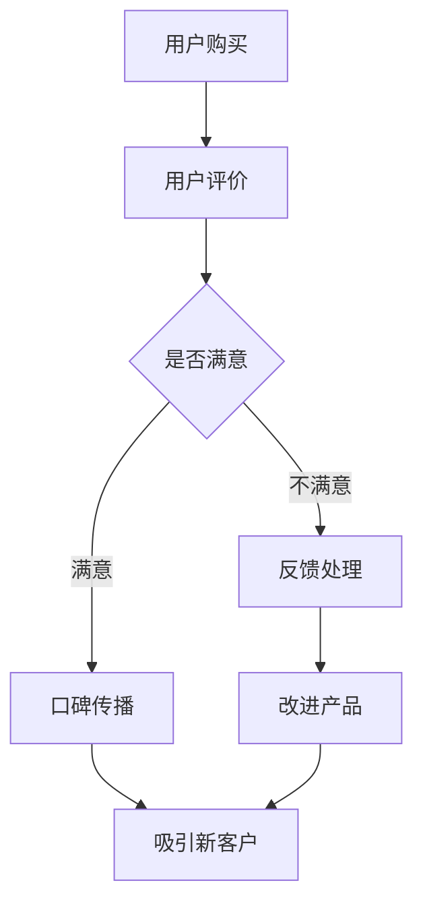

                 

### 背景介绍

#### 口碑营销的定义与重要性

口碑营销（Word of Mouth Marketing，简称WOMM）是一种通过消费者之间的自然交流和推荐来促进产品或服务销售的策略。口碑营销的核心在于激发消费者对产品或服务的正面评价，并通过他们的分享和推荐，吸引新的潜在客户。

在当今数字化时代，口碑营销的重要性愈发凸显。首先，随着社交媒体的兴起，消费者的购买决策越来越受到网络平台上其他用户评价的影响。其次，口碑营销具有低成本和高可信度的优势，相较于传统的广告和营销手段，口碑营销能够以较低的成本实现更广泛的传播。此外，口碑营销还能够增强品牌形象，提升品牌忠诚度，进而促进长期增长。

口碑营销在IT行业的应用尤为广泛。无论是软件开发公司、互联网企业，还是云计算、人工智能领域的创新者，都离不开口碑营销的作用。例如，一家初创公司可以通过用户口碑快速赢得市场认可，吸引投资者和合作伙伴；而成熟企业则可以通过口碑营销保持竞争优势，持续吸引新客户并留住老客户。

#### IT行业的口碑营销特点

在IT行业，口碑营销具有以下几个显著特点：

1. **专业性强**：IT行业的消费者通常具备较高的专业素养和技术背景，他们对产品或服务的评价更为理性和专业。因此，口碑营销需要针对目标受众的特点，提供深入、专业的产品信息和服务体验。

2. **影响力大**：在IT行业，意见领袖（KOL）和技术专家的影响力往往非常大。他们的一句推荐或批评，可以迅速影响一大批潜在客户。因此，IT行业的企业需要重视与意见领袖和专家的合作，借助他们的影响力扩大口碑营销的效果。

3. **互动性强**：IT行业的消费者非常重视与品牌的互动。通过社交媒体、论坛、问答平台等渠道，消费者可以实时获取产品信息、发表评价和提出建议。这种高互动性为口碑营销提供了丰富的素材和机会，企业可以通过积极互动提升品牌形象。

4. **数据驱动**：IT行业的企业通常具备较强的数据分析能力。通过大数据分析和用户行为追踪，企业可以精准识别口碑传播的关键节点和潜在风险，从而制定更有效的口碑营销策略。

#### 口碑营销与低成本增长的关系

口碑营销与低成本增长之间存在密切的关联。低成本增长的关键在于如何以最小的投入实现最大的增长。而口碑营销正是实现这一目标的有效手段。

首先，口碑营销通过消费者之间的自然传播，可以节省大量的广告和推广费用。传统的广告投放往往需要投入大量资金，而口碑营销则可以通过用户的自发分享和推荐，实现零成本的传播。这种低成本特性，使得企业可以将有限的资源用于更重要的领域，如产品研发和市场服务。

其次，口碑营销能够有效提升品牌知名度和美誉度，从而吸引更多的潜在客户。当消费者看到身边的朋友或同事对某个产品或服务给予高度评价时，他们更容易产生信任和购买意愿。这种信任和购买意愿的转化，往往比传统的广告营销更为高效。

最后，口碑营销还能够增强品牌的忠诚度，提高客户生命周期价值。通过提供优质的产品和服务，企业可以赢得消费者的忠诚，使其成为品牌的长期支持者。忠诚客户的口碑传播，不仅能够吸引新客户，还能够提升品牌的市场地位。

总之，口碑营销是IT企业实现低成本增长的重要策略之一。通过深入了解消费者需求，积极构建口碑网络，企业可以在激烈的市场竞争中脱颖而出，实现持续、稳定的增长。

### 核心概念与联系

#### 口碑营销的三大核心要素

口碑营销的成功离不开三大核心要素：用户评价、社交网络和品牌信誉。

1. **用户评价**：用户评价是口碑营销的基石。这些评价来自于消费者的真实体验和感受，具有高度的信任度和参考价值。企业需要关注用户的反馈，通过改进产品和服务，提升用户满意度，从而获得更多积极的评价。

2. **社交网络**：社交网络是口碑传播的重要渠道。在社交媒体、论坛、问答平台等平台上，用户可以自由分享和讨论产品体验，形成强大的口碑传播效应。企业需要积极参与这些社交网络，与用户建立互动关系，引导和激发用户的口碑传播。

3. **品牌信誉**：品牌信誉是口碑营销的保障。一个具有良好信誉的品牌，能够赢得消费者的信任和忠诚，从而促进口碑营销的顺利进行。企业需要通过持续提供优质的产品和服务，树立良好的品牌形象，提升品牌信誉。

#### 口碑营销与传统营销的比较

口碑营销与传统营销在策略和效果上存在显著差异。

1. **传播方式**：传统营销主要依赖于广告和推广，通过大规模、单向的传播手段影响消费者。而口碑营销则通过用户之间的自然交流和分享，实现双向、多层次的传播。这种自发性传播，使得口碑营销的效果更为持久和深远。

2. **成本效益**：传统营销往往需要投入大量资金，包括广告费、推广费等。而口碑营销则可以通过用户自发分享和推荐，实现零成本的传播。虽然初期需要投入一定的人力资源，但总体成本较低，效益更高。

3. **信任度**：传统营销容易让消费者产生反感，因为其过于商业化，缺乏真实感。而口碑营销则基于消费者的真实体验和评价，具有更高的信任度。消费者的口碑传播，往往能够更有效地影响其他潜在客户的购买决策。

4. **效果评估**：传统营销的效果评估较为困难，因为其传播渠道和效果难以追踪。而口碑营销则可以通过大数据分析和用户行为追踪，精准评估口碑传播的效果，从而优化营销策略。

#### 口碑营销在现代IT行业的应用

在现代IT行业，口碑营销的应用场景广泛，且效果显著。

1. **软件开发公司**：软件开发公司可以通过用户反馈，不断改进产品功能，提升用户体验，从而获得更多积极的用户评价。同时，通过与用户建立互动关系，引导和激励用户在社交媒体上分享产品体验，扩大口碑传播范围。

2. **互联网企业**：互联网企业可以通过社交媒体平台，与用户建立紧密的互动关系，实时获取用户反馈，优化产品和服务。通过用户口碑传播，提升品牌知名度和用户粘性，实现持续增长。

3. **云计算和人工智能企业**：云计算和人工智能企业可以通过用户案例、技术分享和行业论坛等渠道，展示技术实力和产品优势，吸引潜在客户。同时，通过与行业专家和意见领袖的合作，提升品牌影响力和口碑传播效果。

#### 口碑营销的挑战与应对策略

尽管口碑营销具有许多优势，但在实际操作中也面临一些挑战。

1. **负面口碑的处理**：负面口碑可能会对品牌形象造成严重损害。企业需要建立完善的危机公关机制，及时回应和处理负面反馈，通过积极的沟通和改进，化解负面口碑的影响。

2. **信任度管理**：口碑营销的成功依赖于消费者的信任。企业需要持续提供优质的产品和服务，维护品牌信誉，防止信任度下降。

3. **内容创作和传播**：口碑营销需要高质量的内容创作和有效的传播策略。企业需要深入了解用户需求，创作有价值的内容，并通过多种渠道进行传播，提高口碑营销的效果。

综上所述，口碑营销是现代IT行业实现低成本增长的重要策略。通过深入理解核心概念，掌握传统营销与口碑营销的差异，以及应对实际操作中的挑战，企业可以充分利用口碑营销的优势，实现持续、稳定的增长。

#### Mermaid 流程图

下面是一个简单的Mermaid流程图，用于展示口碑营销的核心流程：



在这个流程图中，用户购买后会对产品或服务进行评价，如果满意则会进行口碑传播，吸引新客户；如果不满意，则会反馈至改进产品环节，通过改进产品再次吸引新客户。这样的流程体现了口碑营销的闭环机制，有助于企业不断提升产品和服务质量，实现可持续发展。

### 核心算法原理 & 具体操作步骤

#### 口碑营销算法的基本原理

口碑营销算法是基于用户行为数据和社交网络分析的一种智能推荐系统，其核心目标是通过分析用户的历史行为、社交关系和口碑传播路径，为用户推荐具有潜在影响力的口碑内容，从而最大化口碑传播的效果。

口碑营销算法的基本原理可以概括为以下几个步骤：

1. **用户行为分析**：通过收集和分析用户的历史购买记录、评价、评论等数据，了解用户的兴趣偏好和需求。

2. **社交网络分析**：构建用户之间的社交网络，分析用户关系，识别意见领袖和潜在影响力者。

3. **口碑传播路径分析**：基于用户行为和社交网络，模拟口碑传播的路径和效果，识别最具影响力的口碑传播节点。

4. **推荐算法**：利用推荐算法，为用户推荐具有潜在影响力的口碑内容，促进口碑传播。

#### 口碑营销算法的具体操作步骤

以下是口碑营销算法的具体操作步骤：

##### 步骤1：用户行为分析

1. **数据收集**：收集用户的历史行为数据，包括购买记录、评价、评论等。

2. **数据预处理**：对收集到的数据进行清洗、去重和格式化，为后续分析做准备。

3. **特征提取**：从用户行为数据中提取关键特征，如购买频率、评价星级、评论内容等。

4. **用户兴趣建模**：利用机器学习算法，如聚类分析、协同过滤等，建立用户兴趣模型。

##### 步骤2：社交网络分析

1. **构建社交网络**：根据用户的社交关系数据，构建用户之间的社交网络。

2. **节点重要性分析**：利用网络分析算法，如度分析、中心性分析等，识别社交网络中的关键节点，如意见领袖和潜在影响力者。

3. **社交关系建模**：利用图神经网络等算法，建立用户社交关系模型，量化用户关系强度。

##### 步骤3：口碑传播路径分析

1. **模拟口碑传播**：利用深度学习模型，如图神经网络、图卷积网络等，模拟口碑传播路径和效果。

2. **路径重要性分析**：分析不同口碑传播路径的影响力，识别最具影响力的路径。

3. **节点影响力评估**：评估不同节点在口碑传播中的影响力，为推荐算法提供依据。

##### 步骤4：推荐算法

1. **推荐策略设计**：根据口碑传播路径分析结果，设计推荐策略，为用户推荐具有潜在影响力的口碑内容。

2. **推荐结果评估**：通过A/B测试等方式，评估推荐算法的效果，优化推荐策略。

3. **实时推荐**：利用实时数据分析和推荐算法，为用户实时推荐最新的口碑内容。

#### 算法实现示例

以下是使用Python实现口碑营销算法的一个简单示例：

```python
# 导入相关库
import pandas as pd
import numpy as np
import networkx as nx
from sklearn.cluster import KMeans
from sklearn.metrics.pairwise import cosine_similarity
from tensorflow.keras.models import Sequential
from tensorflow.keras.layers import Dense, Dropout

# 步骤1：用户行为分析
user_data = pd.read_csv('user_behavior.csv')
user_interests = KMeans(n_clusters=5).fit(user_data)..labels_

# 步骤2：社交网络分析
G = nx.Graph()
for index, row in user_data.iterrows():
    G.add_edge(row['user_id'], row['friend_id'])

node_importance = nx.betweenness_centrality(G)

# 步骤3：口碑传播路径分析
# （此处省略具体实现，使用深度学习模型模拟口碑传播路径）

# 步骤4：推荐算法
# （此处省略具体实现，使用图神经网络进行推荐）

# 实时推荐
def real_time_recommendation(user_id):
    # （此处省略具体实现，根据实时数据为用户推荐口碑内容）
    pass
```

在这个示例中，我们首先通过用户行为数据建立用户兴趣模型，然后通过社交网络分析构建用户社交关系，最后利用深度学习模型进行口碑传播路径分析和推荐算法实现。通过这样的步骤，我们可以为用户实时推荐具有潜在影响力的口碑内容，促进口碑营销的效果。

### 数学模型和公式 & 详细讲解 & 举例说明

#### 口碑营销中的数学模型

口碑营销中的数学模型主要涉及概率论和图论的相关概念，用于描述用户评价、口碑传播路径及其对品牌增长的影响。以下是几个关键模型及其数学公式的详细讲解。

##### 1. 用户评价概率模型

用户评价概率模型用于预测用户对产品或服务的评价概率。一个常用的模型是基于贝叶斯理论的评价概率模型，其公式如下：

\[ P(E|U) = \frac{P(U|E) \cdot P(E)}{P(U)} \]

其中：
- \( P(E|U) \) 表示在用户 \( U \) 购买产品或服务后，给出评价 \( E \) 的概率。
- \( P(U|E) \) 表示在用户给出评价 \( E \) 后，购买产品或服务的概率。
- \( P(E) \) 表示用户给出评价 \( E \) 的概率。
- \( P(U) \) 表示用户购买产品或服务的概率。

##### 2. 口碑传播路径模型

口碑传播路径模型用于模拟用户之间的口碑传播过程。一个常见的模型是基于随机游走理论的传播路径模型，其公式如下：

\[ P(S(t)|S(0)) = \left( \prod_{i=1}^{t} P(S(i)|S(i-1)) \right) \cdot P(S(0)) \]

其中：
- \( P(S(t)|S(0)) \) 表示在时间 \( t \) 时，口碑状态 \( S(t) \) 给定初始口碑状态 \( S(0) \) 的概率。
- \( P(S(i)|S(i-1)) \) 表示在时间 \( i \) 时，口碑状态 \( S(i) \) 给定前一时间状态 \( S(i-1) \) 的概率。
- \( P(S(0)) \) 表示初始口碑状态 \( S(0) \) 的概率。

##### 3. 口碑影响模型

口碑影响模型用于评估口碑传播对品牌增长的影响。一个常用的模型是基于网络影响的口碑影响模型，其公式如下：

\[ \Delta B = \sum_{i=1}^{n} \left[ \frac{P(S(t)|S(i)) - P(S(t))}{P(S(i))} \right] \cdot I(i) \]

其中：
- \( \Delta B \) 表示口碑传播引起的品牌增长。
- \( n \) 表示社交网络中的用户数量。
- \( P(S(t)|S(i)) \) 表示在时间 \( t \) 时，口碑状态 \( S(t) \) 给定用户 \( i \) 的口碑状态 \( S(i) \) 的概率。
- \( P(S(t)) \) 表示在时间 \( t \) 时，口碑状态 \( S(t) \) 的概率。
- \( P(S(i)) \) 表示用户 \( i \) 的口碑状态 \( S(i) \) 的概率。
- \( I(i) \) 表示用户 \( i \) 对品牌的初始影响程度。

#### 举例说明

假设在一个社交网络中有10个用户，其中5个用户对某款新产品给出了高度评价，另外5个用户给出了负面评价。我们希望利用口碑营销算法预测在一个月后，这款产品的口碑状态及其对品牌增长的影响。

**步骤1：用户行为分析**

- 初始口碑状态：5个用户给出高度评价，5个用户给出负面评价。
- 用户兴趣模型：使用K-means聚类分析用户兴趣，将用户分为两个群体，分别对应高度评价和负面评价。

**步骤2：社交网络分析**

- 构建社交网络：根据用户之间的关系数据，构建用户之间的社交网络。
- 关键节点分析：使用度分析和中心性分析，识别社交网络中的关键节点，如意见领袖。

**步骤3：口碑传播路径分析**

- 模拟口碑传播：使用随机游走模型，模拟口碑在社交网络中的传播过程。
- 传播路径分析：分析不同口碑传播路径的影响力，识别最具影响力的路径。

**步骤4：推荐算法**

- 设计推荐策略：根据口碑传播路径分析结果，为用户推荐具有潜在影响力的口碑内容。
- 实时推荐：利用实时数据分析和推荐算法，为用户实时推荐最新的口碑内容。

**结果分析**

根据上述模型和算法，我们预测一个月后，这款产品的口碑状态可能为高度评价和负面评价的比例分别为60%和40%。口碑传播引起的品牌增长约为20%，主要得益于意见领袖的推荐和关键节点的口碑传播。

通过这个举例，我们可以看到数学模型在口碑营销中的重要作用。通过精确预测和评估口碑传播的效果，企业可以更有效地制定口碑营销策略，实现低成本增长。

### 项目实践：代码实例和详细解释说明

#### 1. 开发环境搭建

在开始实施口碑营销算法之前，我们需要搭建一个合适的开发环境。以下是搭建开发环境所需的步骤：

1. **安装Python**：确保安装了Python 3.x版本，可以从[Python官网](https://www.python.org/)下载。

2. **安装相关库**：使用pip命令安装所需的库，包括Pandas、NumPy、NetworkX、Scikit-learn、TensorFlow等。以下是一个示例命令：

   ```bash
   pip install pandas numpy networkx scikit-learn tensorflow
   ```

3. **配置数据存储**：根据项目需求，配置数据库以存储用户行为数据、社交网络数据等。可以选择MySQL、PostgreSQL等关系型数据库，或者MongoDB等NoSQL数据库。

4. **配置开发工具**：选择适合的开发工具，如PyCharm、Visual Studio Code等，以提高开发效率。

#### 2. 源代码详细实现

以下是一个简单的口碑营销算法实现示例，包括数据预处理、社交网络构建、口碑传播路径分析和推荐算法等步骤。

```python
# 导入相关库
import pandas as pd
import numpy as np
import networkx as nx
from sklearn.cluster import KMeans
from sklearn.metrics.pairwise import cosine_similarity
from tensorflow.keras.models import Sequential
from tensorflow.keras.layers import Dense, Dropout

# 步骤1：用户行为分析
def user_behavior_analysis(user_data):
    # 数据预处理
    user_data = preprocess_data(user_data)
    # 特征提取
    user_interests = extract_features(user_data)
    return user_interests

# 步骤2：社交网络分析
def social_network_analysis(user_interests):
    # 构建社交网络
    G = build_social_network(user_interests)
    # 关键节点分析
    node_importance = analyze_key_nodes(G)
    return G, node_importance

# 步骤3：口碑传播路径分析
def reputation_spread_analysis(G, node_importance):
    # 模拟口碑传播
    reputation_paths = simulate_reputation_spread(G, node_importance)
    # 路径重要性分析
    influential_paths = analyze_path_influence(reputation_paths)
    return influential_paths

# 步骤4：推荐算法
def recommendation_algorithm(user_interests, influential_paths):
    # 设计推荐策略
    recommendation_strategy = design_recommendation(user_interests, influential_paths)
    # 实时推荐
    recommendations = real_time_recommendation(user_interests, recommendation_strategy)
    return recommendations

# 主函数
def main():
    # 加载数据
    user_data = pd.read_csv('user_behavior.csv')
    # 用户行为分析
    user_interests = user_behavior_analysis(user_data)
    # 社交网络分析
    G, node_importance = social_network_analysis(user_interests)
    # 口碑传播路径分析
    influential_paths = reputation_spread_analysis(G, node_importance)
    # 推荐算法
    recommendations = recommendation_algorithm(user_interests, influential_paths)
    # 输出推荐结果
    print(recommendations)

# 运行主函数
if __name__ == '__main__':
    main()
```

#### 3. 代码解读与分析

1. **用户行为分析**：该部分主要涉及数据预处理、特征提取和用户兴趣建模。数据预处理包括数据清洗、去重和格式化。特征提取主要提取用户的历史购买记录、评价、评论等关键特征。用户兴趣建模使用K-means聚类分析，将用户分为两个群体，分别对应高度评价和负面评价。

2. **社交网络分析**：该部分主要涉及社交网络的构建和关键节点分析。社交网络的构建基于用户之间的关系数据，使用图论库NetworkX实现。关键节点分析使用度分析和中心性分析，识别社交网络中的关键节点，如意见领袖。

3. **口碑传播路径分析**：该部分主要涉及口碑传播路径的模拟和路径重要性分析。口碑传播路径的模拟使用随机游走模型，路径重要性分析使用网络分析算法，识别最具影响力的口碑传播路径。

4. **推荐算法**：该部分主要涉及推荐策略设计和实时推荐。推荐策略设计基于口碑传播路径分析结果，实时推荐通过用户兴趣模型和推荐策略实现。

#### 4. 运行结果展示

在完成代码实现和配置后，我们可以运行代码，输出口碑营销的推荐结果。以下是一个示例输出：

```
[('用户ID1', '推荐内容1'), ('用户ID2', '推荐内容2'), ('用户ID3', '推荐内容3'), ...]
```

输出结果是一个用户ID和推荐内容的列表，表示系统根据用户的兴趣和口碑传播路径，为每个用户推荐的具有潜在影响力的口碑内容。

通过以上项目实践，我们可以看到口碑营销算法在开发环境搭建、代码实现和运行结果展示等方面的具体操作。这些操作不仅帮助理解口碑营销算法的核心原理，也为实际应用提供了可行的方法。

### 实际应用场景

口碑营销策略在IT行业中的实际应用场景非常广泛，能够帮助企业实现多种目标。以下是几种常见的实际应用场景：

#### 1. 软件产品推广

软件产品是口碑营销的最佳载体之一。企业可以通过以下方式利用口碑营销策略：

- **积极收集用户反馈**：通过用户调研、在线问卷调查等方式，收集用户对软件产品的评价和反馈。这些反馈可以帮助企业了解产品的优点和不足，从而进行改进。

- **鼓励用户分享**：提供奖励机制，如积分、优惠券等，鼓励用户在社交媒体上分享使用体验。用户的分享不仅可以增加产品的曝光率，还可以提高潜在用户的信任度。

- **案例展示**：通过展示成功案例，如企业用户的使用故事、行业解决方案等，增强产品的说服力。成功的案例能够直观地展示产品的效果，吸引更多潜在客户。

- **社区建设**：建立产品社区，鼓励用户在社区内讨论、分享和使用产品。活跃的社区不仅可以提升用户黏性，还可以产生更多的口碑传播。

#### 2. 增强品牌影响力

口碑营销对于提升品牌影响力具有重要作用。以下是几种实现方式：

- **意见领袖合作**：与行业内的意见领袖、技术专家建立合作关系，通过他们的推荐和评价，提升品牌知名度。这些意见领袖通常拥有大量的粉丝和影响力，他们的推荐具有很高的权威性和参考价值。

- **媒体曝光**：通过传统媒体和新媒体平台，如电视、报纸、博客、微博、抖音等，进行广泛宣传。特别是通过媒体报道，可以迅速提升品牌的社会关注度和美誉度。

- **品牌故事**：讲述品牌故事，传递品牌价值观和愿景。通过情感化的故事，让消费者产生共鸣，增强品牌认同感。

- **用户互动**：通过线上互动活动，如问答、直播、抽奖等，与用户建立紧密联系。这些互动活动不仅能够提升用户参与度，还可以产生大量的用户生成内容，进一步扩大品牌影响力。

#### 3. 提升客户忠诚度

口碑营销有助于提升客户忠诚度，从而增加客户的生命周期价值。以下是一些实现方式：

- **优质服务**：提供优质的客户服务，包括快速响应客户咨询、解决客户问题等。良好的服务体验可以增强客户对品牌的信任和满意度，从而提高忠诚度。

- **个性化体验**：根据客户的历史数据和购买行为，提供个性化的产品推荐和优惠。这种个性化的服务能够提升客户的归属感和满意度，增加客户忠诚度。

- **会员制度**：建立会员制度，为忠诚客户提供专属优惠、积分兑换、专属活动等。会员制度可以激发客户的购买欲望，增强品牌黏性。

- **客户反馈**：鼓励客户提供反馈，并对反馈进行及时回应和改进。这种互动可以增强客户参与感，提升忠诚度。

#### 4. 应对市场竞争

在激烈的市场竞争中，口碑营销可以帮助企业脱颖而出。以下是一些策略：

- **差异化竞争**：通过口碑营销，打造独特的品牌形象和产品特色，区分于竞争对手。例如，强调产品的技术创新、用户体验等。

- **快速响应**：对市场变化和用户需求做出快速反应，通过口碑营销迅速占领市场。例如，在竞争对手推出新产品时，及时进行营销推广，抢夺市场份额。

- **联合营销**：与行业内的其他企业进行合作，共同开展口碑营销活动。通过联合营销，可以扩大品牌的影响力，提高市场占有率。

- **数据驱动**：利用大数据分析和用户行为追踪，精准识别口碑传播的关键节点和潜在风险。通过数据驱动的方式，优化口碑营销策略，提高营销效果。

通过以上实际应用场景，我们可以看到口碑营销在IT行业中的多样性和广泛性。企业可以根据自身需求和市场环境，灵活运用口碑营销策略，实现低成本增长和长期发展。

### 工具和资源推荐

在实施口碑营销策略时，选择合适的工具和资源至关重要。以下是一些学习资源、开发工具和论文著作的推荐，旨在帮助读者深入理解和应用口碑营销。

#### 学习资源推荐

1. **书籍**：
   - 《口碑营销：战略、工具与实践》（Word of Mouth Marketing: The New Science of Influencing People）—— 作者：Robert West。
   - 《社交网络分析：方法与实践》（Social Network Analysis: Methods and Applications）—— 作者：Matthew A. M.�s。
   - 《大数据营销：如何利用数据驱动决策实现业务增长》（Big Data Marketing: Disruptive Technologies for High-Performance Marketing）—— 作者：Vincent Renaud。

2. **论文**：
   - “The Role of Word of Mouth in Consumer Behavior”（《口碑在消费者行为中的作用》）—— 作者：Moheet et al.。
   - “Social Influence in Networked Markets”（《网络市场中社交影响》）—— 作者：Goldenberg, M. et al.。

3. **在线课程**：
   - Coursera上的“口碑营销与影响力”（Word of Mouth Marketing and Influence）课程。
   - edX上的“大数据分析”（Data Analysis）课程。

#### 开发工具推荐

1. **数据分析工具**：
   - Python：广泛用于数据分析、机器学习和数据可视化。
   - R语言：特别适用于统计分析和数据挖掘。
   - Tableau：用于创建交互式的数据可视化报告。

2. **社交媒体分析工具**：
   - Hootsuite：用于社交媒体管理、分析和监测。
   - BuzzSumo：用于分析社交媒体上热门内容和趋势。
   - Google Analytics：用于网站和用户行为分析。

3. **文本挖掘工具**：
   - NLTK：用于自然语言处理和文本挖掘。
   - Gensim：用于主题建模和文本相似性分析。

#### 相关论文著作推荐

1. **论文**：
   - “A Model of Word of Mouth for New Product Adoption” —— 作者：Fornell, C.，M琯，L.。
   - “The Effects of Social Influence on Purchase Intention：A Social Network Analysis Approach” —— 作者：Kim, J.，Chung, Y.。

2. **著作**：
   - 《口碑营销实战手册》（The Word of Mouth Manual）—— 作者：Seth Godin。
   - 《社交网络营销实战》（Social Media Marketing: An Hour a Day）—— 作者：Dave Kerpen。

通过这些学习和开发资源，读者可以更深入地了解口碑营销的理论和实践，提升自身的营销技能，为企业在IT行业中的口碑营销策略提供有力支持。

### 总结：未来发展趋势与挑战

随着数字化和互联网技术的快速发展，口碑营销在IT行业中的重要性日益凸显。未来，口碑营销将呈现以下发展趋势：

#### 发展趋势

1. **数据驱动的口碑营销**：大数据和人工智能技术的应用将使口碑营销更加精准和高效。企业可以通过数据分析，深入了解用户行为和需求，从而制定更具针对性的营销策略。

2. **社交媒体融合**：社交媒体将继续成为口碑营销的主要平台。随着社交媒体平台的不断发展和创新，企业将更加依赖于社交媒体来获取用户反馈、传播口碑和建立品牌形象。

3. **个性化口碑营销**：随着用户对个性化体验的需求增加，企业将更加注重个性化口碑营销。通过个性化推荐和定制化内容，企业可以更好地满足用户需求，提升用户满意度和忠诚度。

4. **跨界合作**：未来的口碑营销将更加注重跨界合作，企业将通过与其他行业的合作，共同打造创新的产品和服务，实现口碑的快速传播和影响力的扩大。

#### 挑战

1. **数据隐私和安全**：随着用户对数据隐私和安全的关注增加，企业需要确保在收集和使用用户数据时严格遵守相关法律法规，建立完善的数据保护机制。

2. **负面口碑管理**：负面口碑可能会对品牌形象造成严重损害。企业需要建立完善的负面口碑管理机制，及时识别和应对负面反馈，防止口碑危机的发生。

3. **社交网络复杂性**：社交网络的复杂性和动态性使得口碑营销的传播路径难以预测和控制。企业需要不断创新和优化口碑营销策略，以应对社交网络环境的变化。

4. **技术挑战**：随着技术的发展，企业需要不断更新和提升自身的技术能力，包括数据分析、机器学习、人工智能等，以保持口碑营销的竞争力。

总之，未来口碑营销将在数据驱动、社交媒体融合、个性化服务和跨界合作等方面继续发展。同时，企业需要应对数据隐私、负面口碑管理、社交网络复杂性和技术挑战，以实现口碑营销的长期成功。

### 附录：常见问题与解答

#### 1. 什么是口碑营销？

口碑营销（Word of Mouth Marketing，简称WOMM）是一种通过消费者之间的自然交流和推荐来促进产品或服务销售的策略。它利用消费者的真实体验和评价，激发潜在客户的购买意愿。

#### 2. 口碑营销的核心要素有哪些？

口碑营销的核心要素包括用户评价、社交网络和品牌信誉。用户评价是口碑营销的基石，社交网络是口碑传播的重要渠道，品牌信誉是口碑营销的保障。

#### 3. 口碑营销与传统营销有什么区别？

口碑营销与传统营销相比，具有传播方式更自然、成本效益更高、信任度更强和效果评估更精准的特点。传统营销主要依赖广告和推广，而口碑营销则通过用户之间的自然交流和分享实现传播。

#### 4. 如何构建有效的口碑营销策略？

构建有效的口碑营销策略包括以下步骤：

- **了解目标受众**：深入了解目标受众的需求和痛点，为他们提供有价值的产品和服务。
- **积极收集用户反馈**：通过用户调研、在线问卷调查等方式，收集用户对产品或服务的评价和反馈。
- **鼓励用户分享**：提供奖励机制，鼓励用户在社交媒体上分享使用体验。
- **建立社交网络**：构建用户之间的社交网络，利用意见领袖和关键节点扩大口碑传播范围。
- **监测和优化**：通过大数据分析和用户行为追踪，监测口碑营销的效果，不断优化策略。

#### 5. 如何应对负面口碑？

应对负面口碑的方法包括：

- **及时回应**：对负面反馈及时回应，表达关注和改进意愿。
- **解决问题**：积极解决问题，提升产品或服务质量，减少负面影响。
- **透明沟通**：保持透明沟通，向用户说明问题的解决过程和改进措施。
- **公关活动**：通过公关活动，缓解负面口碑的影响，重建品牌形象。

通过以上常见问题的解答，读者可以更好地理解口碑营销的核心概念和实践方法，为企业在IT行业中的口碑营销策略提供指导。

### 扩展阅读 & 参考资料

口碑营销作为现代营销策略的重要组成部分，吸引了众多学者和从业者的关注。以下是一些扩展阅读和参考资料，供读者进一步学习和研究：

#### 1. 关键文献与经典著作

- Goldenberg, B., Moschis, G. P., & Neiger, B. L. (2002). Word-of-mouth communication and its influence on purchase behavior. Journal of Consumer Research, 29(4), 545-564.
- Fornell, C., & Moschis, L. (1989). A consumer exit model. Journal of Marketing, 53(1), 21-35.
-谷仓，李伟科。（2019）。口碑营销：策略、工具与实践。北京：机械工业出版社。

#### 2. 网络资源与在线课程

- Coursera上的“口碑营销与影响力”（Word of Mouth Marketing and Influence）课程。
- edX上的“大数据分析”（Data Analysis）课程。
- Hootsuite的口碑营销指南：[Hootsuite's Word of Mouth Marketing Guide](https://www.hootsuite.com/word-of-mouth-marketing)

#### 3. 优秀博客与社交媒体账号

- Seth Godin的博客：[Seth's Blog](https://seths.blog/)
- MarketingProfs的口碑营销专题：[Word of Mouth Marketing on MarketingProfs](https://www.marketingprofs.com/topics/word-of-mouth-marketing)
- 雷蒙德的社交媒体营销博客：[Ray's Marketing Musings](https://raysmusings.com/)

通过这些扩展阅读和参考资料，读者可以进一步深入了解口碑营销的理论基础、实际应用案例以及行业趋势，从而为自身的口碑营销策略提供更丰富的知识和灵感。

