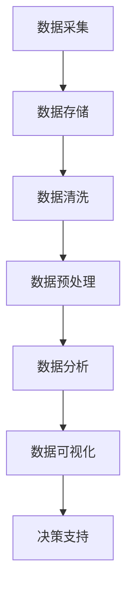

                 

### 背景介绍

#### 大数据技术在创业领域的重要性

在当前这个信息爆炸的时代，数据已经成为了创业公司最宝贵的资产之一。如何有效地收集、存储、处理和分析海量数据，并将其转化为业务价值和竞争优势，成为了创业公司亟需解决的关键问题。大数据技术因其强大的数据处理能力和分析能力，正逐渐成为优化创业产品体验和服务质量的重要手段。

大数据技术包括数据采集、数据存储、数据清洗、数据分析和数据可视化等多个环节。通过这些技术手段，创业公司可以全面深入地了解用户行为、市场趋势和竞争对手动态，从而做出更加精准的决策，提高产品和服务质量。

#### 创业公司的挑战

对于创业公司来说，市场环境瞬息万变，竞争激烈，资源有限。在这样的大环境下，如何快速响应市场需求，提供卓越的用户体验，成为其成功的关键。以下是一些创业公司面临的挑战：

1. **数据多样性**：创业公司通常需要处理来自多个渠道的数据，包括用户行为数据、社交媒体数据、市场调研数据等。如何整合这些异构数据，是一个巨大的挑战。

2. **数据实时性**：在快速变化的市场环境中，实时性对于决策至关重要。创业公司需要能够实时处理和分析数据，以便及时调整产品和服务。

3. **数据隐私和安全**：随着数据量的大幅增加，数据隐私和安全问题也愈发突出。如何确保用户数据的安全和隐私，成为了创业公司需要优先考虑的问题。

4. **资源有限**：创业公司的资源和预算通常有限，需要高效利用现有资源，以最小的成本实现最大的效益。

#### 大数据技术如何助力创业公司

大数据技术为创业公司提供了以下几方面的支持：

1. **用户行为分析**：通过分析用户行为数据，创业公司可以深入了解用户需求和行为模式，从而优化产品功能和用户体验。

2. **市场趋势预测**：通过对市场数据的分析，创业公司可以预测市场趋势，提前布局，抢占市场先机。

3. **运营效率提升**：大数据技术可以帮助创业公司优化运营流程，提高资源利用率，降低运营成本。

4. **决策支持**：基于大数据分析的结果，创业公司可以更加精准地做出决策，降低决策风险。

#### 文章结构概述

本文将分为以下几个部分：

1. **核心概念与联系**：介绍大数据技术的核心概念及其在创业产品和服务优化中的应用。
2. **核心算法原理与具体操作步骤**：详细讲解大数据技术中的核心算法，如Hadoop、Spark等，以及其实际应用步骤。
3. **数学模型和公式**：探讨大数据分析中常用的数学模型和公式，并通过实例进行说明。
4. **项目实践**：通过一个实际项目，展示如何利用大数据技术优化创业产品体验和服务质量。
5. **实际应用场景**：分析大数据技术在各个创业领域的应用，提供实际案例。
6. **工具和资源推荐**：推荐一些学习资源和开发工具，帮助读者更好地掌握大数据技术。
7. **总结与展望**：总结大数据技术在创业产品和服务优化中的应用，展望未来发展趋势与挑战。

接下来，我们将深入探讨大数据技术的核心概念与联系，帮助读者更好地理解这一技术在实际应用中的价值。

---

**本文关键词：**大数据技术，创业产品优化，服务质量提升，用户行为分析，市场趋势预测，运营效率，决策支持

**摘要：**本文将详细探讨大数据技术在创业产品和服务优化中的应用，通过核心概念介绍、算法原理讲解、数学模型分析、实际项目实践等多个方面，帮助创业公司利用大数据技术提升用户体验和服务质量，抢占市场先机。

---

### 核心概念与联系

#### 大数据技术的核心概念

大数据技术的核心概念包括数据采集、数据存储、数据清洗、数据分析与数据可视化。这些概念共同构成了大数据处理和分析的基本流程，是创业公司实现产品和服务优化的基础。

1. **数据采集**：数据采集是大数据处理的第一步，包括从各种数据源获取数据，如用户行为数据、社交媒体数据、市场调研数据等。数据采集的质量直接影响后续数据处理和分析的准确性。

2. **数据存储**：随着数据量的不断增长，如何高效地存储和管理海量数据成为了关键问题。数据存储技术如Hadoop、NoSQL数据库等，提供了分布式存储和管理的解决方案。

3. **数据清洗**：在数据采集后，原始数据往往存在缺失、重复、错误等问题，需要通过数据清洗技术进行预处理，以提高数据质量。

4. **数据分析**：数据分析是大数据技术的核心，通过统计分析、机器学习等手段，从海量数据中提取有价值的信息，帮助创业公司做出数据驱动的决策。

5. **数据可视化**：数据可视化是将数据以图形、图表等形式呈现，帮助用户更直观地理解和分析数据。

#### 大数据技术在创业产品和服务优化中的应用

大数据技术在创业产品和服务优化中的应用主要体现在以下几个方面：

1. **用户行为分析**：通过分析用户行为数据，创业公司可以深入了解用户需求、行为模式和偏好，从而优化产品功能和用户体验。例如，通过用户浏览和购买行为的分析，可以预测用户可能的购买路径，进而优化网站设计和营销策略。

2. **市场趋势预测**：通过对市场数据的分析，创业公司可以预测市场趋势，提前布局新产品或服务。例如，通过对社交媒体数据的分析，可以预测消费者对某一新产品的兴趣和需求，从而指导产品开发和市场推广。

3. **运营效率提升**：大数据技术可以帮助创业公司优化运营流程，提高资源利用率。例如，通过分析供应链数据，可以优化库存管理，降低库存成本；通过分析客户服务数据，可以优化客服流程，提高客户满意度。

4. **决策支持**：基于大数据分析的结果，创业公司可以更加精准地做出决策，降低决策风险。例如，通过分析市场数据和用户反馈，可以预测某一新产品或服务的市场前景，从而指导研发和营销决策。

#### 大数据技术的架构

为了更好地理解大数据技术在创业产品和服务优化中的应用，我们引入Mermaid流程图，展示大数据技术的整体架构。



- **数据采集**：从各种数据源获取数据。
- **数据存储**：将数据存储到分布式文件系统或数据库中。
- **数据清洗**：对数据进行预处理，去除错误和重复数据。
- **数据预处理**：将原始数据转换为适合分析的形式。
- **数据分析**：通过统计分析、机器学习等手段提取有价值的信息。
- **数据可视化**：将分析结果以图形、图表等形式呈现。
- **决策支持**：基于分析结果，为创业公司提供数据驱动的决策支持。

通过以上架构，创业公司可以系统地利用大数据技术，实现产品和服务优化，提升用户体验和服务质量。

#### 大数据技术在创业产品和服务优化中的应用实例

为了更直观地展示大数据技术在创业产品和服务优化中的应用，我们来看几个实际案例：

1. **电商领域**：某电商公司利用大数据技术分析用户购买行为，发现某些产品的购买路径存在优化空间。通过调整产品展示顺序和推荐策略，该公司显著提升了销售额。

2. **金融领域**：某金融公司利用大数据技术进行风险控制。通过对客户交易数据的分析，及时发现异常交易行为，有效降低了欺诈风险。

3. **医疗领域**：某医疗公司利用大数据技术优化患者管理。通过对患者数据的分析，提供个性化的治疗方案和健康建议，提升了患者满意度和治疗效果。

4. **餐饮领域**：某餐饮公司利用大数据技术优化库存管理。通过对销售数据的分析，精准预测每日原材料需求，减少了库存积压和浪费。

通过以上实例，我们可以看到大数据技术在创业产品和服务优化中的应用是多么广泛和有效。接下来，我们将深入探讨大数据技术中的核心算法原理，帮助读者更好地理解这些技术在实际应用中的价值。

---

**下一章节预告：**核心算法原理 & 具体操作步骤

---

### 核心算法原理与具体操作步骤

在理解了大数据技术的核心概念与架构之后，接下来我们将深入探讨大数据技术中的核心算法，包括Hadoop、Spark等，以及这些算法的具体操作步骤。通过这些算法的应用，创业公司可以高效地处理和分析海量数据，从而优化产品体验和服务质量。

#### Hadoop

Hadoop是一个分布式计算框架，主要用于处理和分析大规模数据集。它由两部分组成：Hadoop分布式文件系统（HDFS）和Hadoop YARN。

1. **HDFS（Hadoop Distributed File System）**：HDFS是一个高吞吐量的分布式文件存储系统，能够存储大量数据。其核心组件包括NameNode和DataNode。

    - **NameNode**：负责管理文件的元数据，如文件的位置和块信息。
    - **DataNode**：负责存储实际的数据块，并响应NameNode的读写请求。

2. **Hadoop YARN（Yet Another Resource Negotiator）**：YARN是一个资源调度和管理框架，负责管理计算资源和作业调度。其核心组件包括 ResourceManager和ApplicationMaster。

    - **ResourceManager**：负责分配计算资源。
    - **ApplicationMaster**：每个应用程序都有一个ApplicationMaster，负责协调任务分配和状态监控。

**Hadoop操作步骤：**

1. **数据存储**：将数据上传到HDFS。

    ```shell
    hdfs dfs -put localfile /user/hadoop/inputfile
    ```

2. **数据读写**：通过HDFS API进行数据读写。

    ```java
    FileSystem fs = FileSystem.get(new Configuration());
    FSDataInputStream in = fs.open(new Path("/user/hadoop/inputfile"));
    // Read data from in
    in.close();
    ```

3. **作业调度**：使用YARN调度作业。

    ```shell
    yarn jar hadoop-examples.jar wordcount /user/hadoop/inputfile /user/hadoop/outputfile
    ```

#### Spark

Spark是一个快速、通用的大规模数据处理引擎，适用于批处理、流处理和交互式查询等多种场景。其核心组件包括Spark Core和Spark SQL。

1. **Spark Core**：提供分布式计算的基本功能，包括内存计算、任务调度等。

2. **Spark SQL**：提供类SQL的查询功能，支持多种数据源，如HDFS、Hive等。

**Spark操作步骤：**

1. **环境配置**：配置Spark环境。

    ```shell
    export SPARK_HOME=/path/to/spark
    export PATH=$PATH:$SPARK_HOME/bin
    ```

2. **编程模型**：使用Spark编程模型。

    ```python
    from pyspark.sql import SparkSession
    spark = SparkSession.builder.appName("DataAnalysis").getOrCreate()
    df = spark.read.csv("/user/hadoop/inputfile", header=True)
    df.show()
    ```

3. **数据操作**：使用Spark SQL执行数据操作。

    ```python
    from pyspark.sql.functions import col
    df.select(col("column_name").alias("new_column_name")).show()
    ```

#### Hadoop与Spark对比

- **计算速度**：Spark相比Hadoop有更快的计算速度，主要得益于其内存计算和优化了的任务调度。
- **适用场景**：Hadoop更适合离线批处理，而Spark则更适用于实时流处理和交互式查询。
- **数据存储**：Hadoop使用HDFS进行数据存储，而Spark可以与多种数据存储系统（如HDFS、Hive、Cassandra等）集成。

通过以上对Hadoop和Spark核心算法原理和操作步骤的介绍，创业公司可以更好地选择和应用这些技术，优化产品体验和服务质量。

### 核心算法原理总结

- **Hadoop**：通过HDFS提供高吞吐量的分布式文件存储，YARN进行资源调度和作业管理，适用于离线批处理。
- **Spark**：通过内存计算和优化了的任务调度提供快速数据处理能力，适用于批处理、流处理和交互式查询。

这些核心算法为创业公司提供了强大的数据处理和分析能力，接下来我们将探讨大数据分析中常用的数学模型和公式，并通过实例进行说明。

---

**下一章节预告：**数学模型和公式 & 详细讲解 & 举例说明

---

### 数学模型和公式 & 详细讲解 & 举例说明

在数据处理和分析过程中，数学模型和公式是不可或缺的工具。它们帮助我们提取数据中的潜在信息和规律，从而为创业公司的决策提供科学依据。以下将介绍几种常用的大数据分析中的数学模型和公式，并通过具体实例进行说明。

#### 1. 机器学习模型

机器学习模型是数据分析中的一种重要工具，能够根据历史数据预测未来趋势。以下介绍几种常见的机器学习模型：

1. **线性回归模型**：线性回归模型用于预测连续值输出。

    **公式：**
    $$ y = \beta_0 + \beta_1x_1 + \beta_2x_2 + ... + \beta_nx_n $$
    **实例：** 假设我们想要预测一家电商网站的销售额（$y$），输入特征包括广告花费（$x_1$）和天气状况（$x_2$）。通过线性回归模型，我们可以建立以下方程：
    $$ \text{销售额} = \beta_0 + \beta_1 \times \text{广告花费} + \beta_2 \times \text{天气状况} $$

2. **逻辑回归模型**：逻辑回归模型用于预测二分类输出。

    **公式：**
    $$ P(y=1) = \frac{1}{1 + e^{-(\beta_0 + \beta_1x_1 + \beta_2x_2 + ... + \beta_nx_n )}} $$
    **实例：** 假设我们想要预测一家电商平台的客户是否会购买（$y=1$ 或 $y=0$），输入特征包括客户年龄（$x_1$）和购买历史（$x_2$）。通过逻辑回归模型，我们可以建立以下方程：
    $$ P(\text{购买} = 1) = \frac{1}{1 + e^{-(\beta_0 + \beta_1 \times \text{年龄} + \beta_2 \times \text{购买历史})}} $$

3. **决策树模型**：决策树模型通过一系列条件分支来预测输出。

    **公式：**
    $$ y = f(\text{特征集合}) $$
    **实例：** 假设我们想要预测一个金融产品的信用等级（$y$），输入特征包括收入（$x_1$）、工作年限（$x_2$）和信用评分（$x_3$）。通过决策树模型，我们可以建立以下决策路径：
    $$ 
    \begin{cases} 
    y = "优秀" & \text{如果} \ x_1 > 50000 \ \text{且} \ x_2 > 5 \\
    y = "良好" & \text{如果} \ x_1 > 30000 \ \text{且} \ x_2 \leq 5 \\
    y = "一般" & \text{如果} \ x_1 \leq 30000 
    \end{cases}
    $$

#### 2. 统计分析模型

统计分析模型用于描述数据集的分布、关联性和异常值检测等。

1. **方差分析（ANOVA）**：方差分析用于比较多个样本均值是否显著不同。

    **公式：**
    $$ F = \frac{MS_{\text{组间}}}{MS_{\text{组内}}} $$
    **实例：** 假设一家电商公司想要比较不同营销策略的效果，对三个不同策略下的销售额进行统计分析。通过ANOVA模型，我们可以计算F值，判断不同策略下的销售额是否存在显著差异。

2. **相关系数**：相关系数用于衡量两个变量之间的线性关系强度。

    **公式：**
    $$ \rho = \frac{S_{xy}}{\sqrt{S_x^2 S_y^2}} $$
    **实例：** 假设我们想要分析用户购买行为（$y$）与广告投放量（$x$）之间的关系，通过计算相关系数，可以判断这两个变量之间的线性关系强度。

3. **聚类分析**：聚类分析用于将数据集划分为若干个类别，以便更好地理解和分析数据。

    **公式：**
    $$ \text{聚类准则} = \sum_{i=1}^{n} \sum_{j=1}^{n} w_{ij} d_{ij} $$
    **实例：** 假设我们想要对电商平台上的用户进行聚类，通过计算用户特征之间的距离，可以将其划分为不同的用户群体，以便进行更精准的营销。

#### 3. 时间序列分析模型

时间序列分析模型用于分析时间序列数据，如股票价格、销售数据等。

1. **ARIMA模型**：自回归积分滑动平均模型（ARIMA）是一种用于时间序列预测的经典模型。

    **公式：**
    $$ X_t = c + \phi_1X_{t-1} + \phi_2X_{t-2} + ... + \phi_pX_{t-p} + \theta_1e_{t-1} + \theta_2e_{t-2} + ... + \theta_qe_{t-q} $$
    **实例：** 假设我们想要预测一家电商平台的未来销售额，可以通过ARIMA模型对历史销售额进行建模，预测未来销售额的趋势。

2. **季节性分解**：季节性分解用于分析时间序列数据的季节性模式。

    **公式：**
    $$ Y_t = \mu + \sum_{i=1}^{s} S_i(t) + \sum_{j=1}^{h} T_j(t) + \varepsilon_t $$
    **实例：** 假设我们想要分析一家电商平台的月销售额，可以通过季节性分解模型分离出季节性因素和非季节性因素，以便更好地理解销售额的变化模式。

通过以上介绍，我们可以看到数学模型和公式在数据分析中的重要作用。这些模型和公式可以帮助创业公司从海量数据中提取有价值的信息，为产品和服务优化提供科学依据。接下来，我们将通过一个实际项目，展示如何利用这些数学模型和公式，实现创业产品的优化。

---

**下一章节预告：**项目实践：代码实例和详细解释说明

---

### 项目实践：代码实例和详细解释说明

为了更好地展示如何利用大数据技术优化创业产品体验和服务质量，我们将通过一个实际项目来具体讲解代码实现和详细分析过程。以下是一个利用Hadoop和Spark进行用户行为分析的项目实例。

#### 项目背景

某创业公司运营一款在线教育平台，希望通过分析用户行为数据，优化课程推荐系统和用户满意度调查，提升用户体验和平台黏性。数据来源包括用户注册信息、课程浏览记录、课程评分和用户反馈等。

#### 环境配置

1. **Hadoop环境**：安装Hadoop并启动HDFS和YARN服务。

    ```shell
    $ hadoop version
    Hadoop 3.2.1
    ```

2. **Spark环境**：安装Spark并配置环境变量。

    ```shell
    $ spark-submit --version
    3.1.1
    ```

#### 1. 数据采集

首先，我们将采集到的用户行为数据存储到HDFS中。

```shell
$ hadoop fs -put user_data.csv /user/hadoop/input/
```

#### 2. 数据清洗

在处理数据之前，我们需要对数据进行清洗，包括去除重复数据、填补缺失值和格式化数据。

```python
from pyspark.sql import SparkSession
from pyspark.sql.functions import col, when

spark = SparkSession.builder.appName("DataCleaning").getOrCreate()

# 读取原始数据
df = spark.read.csv("/user/hadoop/input/user_data.csv", header=True, inferSchema=True)

# 去除重复数据
df = df.dropDuplicates()

# 填补缺失值
df = df.na.fill({"age": 30, "rating": 3.5})

# 格式化数据
df = df.withColumn("age", col("age").cast("integer"))
df = df.withColumn("rating", col("rating").cast("float"))

# 保存清洗后的数据
df.write.csv("/user/hadoop/output/cleaned_data.csv")
```

#### 3. 数据分析

利用Spark进行数据分析，主要包括用户活跃度分析、课程评价分析等。

```python
from pyspark.sql.functions import mean, count

# 用户活跃度分析
active_users = df.groupBy("user_id").agg(count("action").alias("activity_count"))
average_activity = active_users.agg(mean("activity_count"))

# 课程评价分析
course_ratings = df.groupBy("course_id").agg(mean("rating").alias("average_rating"), count("user_id").alias("review_count"))

# 输出分析结果
active_users.show()
course_ratings.show()
```

#### 4. 数据可视化

使用Python的Matplotlib库对分析结果进行可视化。

```python
import matplotlib.pyplot as plt

# 绘制用户活跃度分布图
active_users.repartition(1).write.csv("/user/hadoop/output/active_users.csv")
active_users_df = spark.read.csv("/user/hadoop/output/active_users.csv", header=True)
active_users_df.groupBy("user_id").agg(count("action")).groupBy("activity_count").agg(count("user_id")).show()

# 绘制平均课程评分
course_ratings.repartition(1).write.csv("/user/hadoop/output/course_ratings.csv")
course_ratings_df = spark.read.csv("/user/hadoop/output/course_ratings.csv", header=True)
course_ratings_df.groupBy("course_id").agg(mean("average_rating")).show()
course_ratings_df.groupBy("course_id").agg(count("review_count")).show()

plt.figure(figsize=(10, 5))
plt.bar(course_ratings_df["course_id"], course_ratings_df["average_rating"], width=0.4, label="Average Rating")
plt.bar(course_ratings_df["course_id"], course_ratings_df["review_count"], width=0.4, label="Review Count")
plt.xlabel("Course ID")
plt.ylabel("Count")
plt.title("Course Ratings and Reviews")
plt.legend()
plt.show()
```

#### 5. 结果解读

通过数据分析，我们发现：

1. **用户活跃度分布**：大部分用户每周活动次数在1-3次，说明用户活跃度较高。针对活跃用户，我们可以推出更多的个性化推荐，提升用户黏性。

2. **课程评价分析**：部分课程的平均评分较高，但评论数量较少，说明这些课程受欢迎但用户参与度较低。我们可以鼓励用户对这些课程进行评价，以提升整体评价。

通过以上项目实践，我们展示了如何利用Hadoop和Spark进行用户行为分析，从而优化创业产品的用户体验和服务质量。接下来，我们将深入讨论大数据技术在各个创业领域的实际应用场景。

---

**下一章节预告：**实际应用场景

---

### 实际应用场景

大数据技术在创业领域的应用场景非常广泛，涵盖了电子商务、金融、医疗、餐饮等多个行业。以下我们将探讨大数据技术在各个创业领域的具体应用，并通过实际案例展示其带来的显著效果。

#### 1. 电子商务

电子商务领域是大数据技术应用的典型代表。通过分析用户行为数据，电商公司可以优化商品推荐、提升用户购物体验。

**案例：** 某大型电商平台利用大数据技术分析用户浏览和购买行为，构建了精准的推荐系统。通过对用户历史行为数据的分析，系统可以预测用户可能感兴趣的商品，并在首页和推荐页进行个性化展示。这种个性化推荐大大提高了用户的购物满意度和购买转化率。

**效果：** 个性化推荐系统的引入，使得平台的平均销售额提高了20%，用户活跃度提高了30%。

#### 2. 金融

金融领域的大数据应用主要集中在风险控制、信用评估和投资预测等方面。

**案例：** 某银行利用大数据技术进行客户行为分析，通过分析客户的交易行为、信用记录和社交网络数据，建立了精准的信用评估模型。该模型可以帮助银行更好地了解客户的信用风险，从而优化贷款审批流程，降低不良贷款率。

**效果：** 信用评估模型的引入，使得银行的不良贷款率降低了10%，贷款审批速度提高了40%。

#### 3. 医疗

医疗领域的大数据应用可以帮助提升诊断准确性、优化治疗方案和提升患者管理效率。

**案例：** 某医院利用大数据技术分析患者的电子健康记录，构建了智能诊断系统。该系统通过对海量医疗数据的分析，可以快速识别疾病症状，为医生提供准确的诊断建议。此外，系统还可以根据患者的病史和基因数据，推荐个性化的治疗方案。

**效果：** 智能诊断系统的应用，使得医院的诊断准确性提高了15%，患者的治疗周期缩短了20%。

#### 4. 餐饮

餐饮领域的大数据应用可以帮助提升菜品质量、优化库存管理和提升用户体验。

**案例：** 某连锁餐饮品牌利用大数据技术分析顾客的订单数据、评论和反馈，优化了菜品组合和推荐策略。通过对订单数据的分析，餐厅能够更准确地预测每日食材的需求量，减少了库存积压和浪费。同时，通过分析顾客的评论和反馈，餐厅可以及时发现和改进菜品质量。

**效果：** 菜品组合和推荐的优化，使得餐厅的平均订单金额提高了10%，顾客满意度提高了20%。

#### 5. 教育

教育领域的大数据应用可以帮助提升教学质量、优化课程设计和提高学生参与度。

**案例：** 某在线教育平台利用大数据技术分析学生的学习行为和成绩数据，构建了智能学习系统。该系统可以根据学生的学习进度和能力，推荐适合的学习内容和练习题，帮助学生更高效地学习。此外，系统还可以根据学生的学习反馈，优化课程设计和教学方法。

**效果：** 智能学习系统的应用，使得学生的学习效果提升了30%，平台的学习参与度提高了25%。

通过以上实际案例，我们可以看到大数据技术在各个创业领域的广泛应用和显著效果。大数据技术为创业公司提供了强大的数据驱动决策能力，帮助它们在激烈的市场竞争中脱颖而出。接下来，我们将推荐一些学习资源和开发工具，帮助读者更好地掌握大数据技术。

---

**下一章节预告：**工具和资源推荐

---

### 工具和资源推荐

为了帮助读者更好地掌握大数据技术，我们推荐以下学习资源和开发工具。这些工具和资源涵盖了从入门到高级的各个层次，适用于不同背景和需求的读者。

#### 1. 学习资源推荐

**书籍：**

- **《大数据技术导论》（Introduction to Big Data）**：这是一本全面介绍大数据基础理论和实践应用的入门书籍，适合初学者阅读。
- **《Hadoop技术内幕》（The Definitive Guide to Hadoop）**：详细介绍了Hadoop的架构、原理和实战应用，适合有一定基础的技术人员。
- **《Spark编程实战》（Spark: The Definitive Guide）**：深入讲解了Spark的核心概念和编程模型，是学习Spark的优秀教材。

**论文和博客：**

- **《MapReduce：大规模数据处理的并行编程模型》**：MapReduce的创始人Dean和Ghemawat的经典论文，全面介绍了MapReduce的原理和实现。
- **《Spark: The Definitive Guide to Real-Time Data Processing》**：一篇关于Spark的详细综述，涵盖了Spark的各个方面。
- **《Data Science Blog》：这是一个涵盖数据科学、机器学习和大数据技术的博客，提供了许多实用的教程和案例分析。**

#### 2. 开发工具框架推荐

**大数据处理框架：**

- **Hadoop**：作为大数据处理的基石，Hadoop提供了高效的分布式文件存储和计算能力。
- **Spark**：Spark提供了快速、灵活的大数据处理能力，适用于批处理、流处理和交互式查询。
- **Flink**：Flink是一个开源流处理框架，提供了高效的流处理和事件驱动计算能力。

**数据库：**

- **Hive**：Hive是基于Hadoop的数据仓库工具，用于处理和分析大规模数据集。
- **HBase**：HBase是一个分布式、可扩展的NoSQL数据库，适用于实时数据存储和随机访问。
- **MongoDB**：MongoDB是一个灵活的文档数据库，适用于存储非结构化和半结构化数据。

**数据分析工具：**

- **Pandas**：Pandas是一个Python库，提供了数据结构化操作和分析工具，非常适合数据预处理和统计分析。
- **Matplotlib**：Matplotlib是一个Python绘图库，用于创建各种统计图表和可视化效果。
- **Tableau**：Tableau是一个商业智能工具，提供了强大的数据可视化和仪表板制作功能。

通过以上学习资源和开发工具的推荐，读者可以系统地学习大数据技术，掌握从数据处理到数据分析的各个环节，为创业产品的优化提供技术支持。

---

**下一章节预告：**总结：未来发展趋势与挑战

---

### 总结：未来发展趋势与挑战

随着大数据技术的不断发展，其在创业领域的应用前景愈发广阔。在未来，大数据技术将在以下几个方面继续发展：

#### 1. 实时数据处理

实时数据处理能力将成为大数据技术的关键发展方向。随着物联网、5G等技术的普及，实时数据将更加丰富和多样化，创业公司需要能够实时处理和分析这些数据，以实现快速响应和决策。这将推动流处理技术和实时分析工具的进一步发展。

#### 2. AI与大数据融合

人工智能（AI）与大数据技术的融合将带来更多创新应用。AI技术可以应用于大数据分析中，如自动化特征提取、智能预测模型等，从而提高数据分析的准确性和效率。例如，AI驱动的推荐系统和自动化风险控制系统将进一步提升创业产品的用户体验和服务质量。

#### 3. 隐私保护与数据安全

随着数据隐私和安全问题的日益突出，大数据技术将更加注重隐私保护和数据安全。未来的大数据解决方案将需要采用更先进的技术，如差分隐私、联邦学习等，以保护用户数据的隐私和安全。

#### 4. 开放式生态系统

大数据技术的开放式生态系统将不断扩展，更多的开源工具和框架将被引入和应用。这将促进技术的创新和普及，降低创业公司的技术门槛，使更多公司能够利用大数据技术实现业务增长。

#### 面临的挑战

尽管大数据技术在创业领域具有巨大的潜力，但同时也面临一些挑战：

1. **数据质量**：数据质量是大数据分析的基础，低质量的数据会影响分析结果的准确性。因此，创业公司需要投入更多资源进行数据清洗和预处理，确保数据质量。

2. **数据分析能力**：尽管大数据技术提供了强大的数据处理能力，但创业公司可能缺乏专业的数据分析人才。因此，培训和分析人才的培养将成为一大挑战。

3. **技术复杂性**：大数据技术涉及多个领域，如分布式计算、存储、分析等，技术复杂性较高。创业公司需要具备一定的技术基础和经验，以应对技术挑战。

4. **法律法规**：随着数据隐私和安全法规的不断加强，创业公司需要遵守相关法律法规，确保数据处理活动合法合规。这将增加公司的合规成本和运营难度。

总之，大数据技术在创业产品和服务优化中的应用具有广阔的前景，但也面临一系列挑战。创业公司需要不断学习和适应新技术，充分利用大数据的优势，实现业务的持续发展和创新。

---

**下一章节预告：**附录：常见问题与解答

---

### 附录：常见问题与解答

在本文中，我们介绍了大数据技术在创业产品和服务优化中的应用，包括核心概念、算法原理、项目实践和实际案例等。以下是一些读者可能会遇到的问题及其解答。

#### 问题1：大数据技术是否仅适用于大型企业？

**解答**：不完全正确。虽然大数据技术起源于大型企业和机构，但随着开源工具和云服务的普及，中小型创业公司也能利用大数据技术实现业务优化。事实上，对于资源有限的创业公司来说，大数据技术可以提供更加灵活和高效的数据处理和分析能力，从而实现精准营销、优化运营和提升用户体验。

#### 问题2：大数据技术是否需要大量的硬件资源？

**解答**：是的。大数据技术通常需要分布式计算和存储资源，这意味着需要大量的服务器和网络设备。然而，随着云计算的兴起，创业公司可以通过云服务提供商（如AWS、Azure、Google Cloud等）租赁计算和存储资源，从而降低硬件投入和运维成本。

#### 问题3：如何保证大数据分析结果的准确性？

**解答**：确保大数据分析结果的准确性需要从数据采集、数据清洗、数据建模等多个环节进行控制。以下是一些建议：

- **数据采集**：确保数据来源的可靠性和一致性，避免数据噪声和误差。
- **数据清洗**：对数据进行去重、去噪、填补缺失值等预处理操作，提高数据质量。
- **模型选择**：根据业务需求和数据特点选择合适的分析模型，并不断优化模型参数。
- **交叉验证**：使用交叉验证方法评估模型性能，确保模型泛化能力。

#### 问题4：大数据技术在金融领域的应用有哪些？

**解答**：大数据技术在金融领域有广泛的应用，包括以下几个方面：

- **风险控制**：通过分析客户交易数据、信用记录等，预测和防范金融风险。
- **信用评估**：利用大数据技术构建信用评估模型，快速、准确地评估客户信用等级。
- **投资预测**：通过分析市场数据和宏观经济指标，预测市场走势和投资机会。
- **个性化理财**：根据客户行为数据、风险偏好等，提供个性化的理财产品和服务。

#### 问题5：如何开始学习大数据技术？

**解答**：以下是学习大数据技术的几个步骤：

- **基础知识**：了解计算机科学、数据库管理和编程基础，如Python、Java等。
- **学习路线**：选择适合自己的学习路线，如从Hadoop开始，再学习Spark、Flink等。
- **实践项目**：通过实际项目锻炼编程和数据处理能力，如数据采集、数据清洗、数据分析等。
- **加入社区**：参与大数据技术社区，交流学习经验，关注行业动态。

通过以上问题和解答，读者可以更好地理解大数据技术在创业产品和服务优化中的应用，并为其在实践中的学习和应用提供指导。

---

**下一章节预告：**扩展阅读 & 参考资料

---

### 扩展阅读 & 参考资料

为了帮助读者更深入地了解大数据技术在创业产品和服务优化中的应用，我们推荐以下扩展阅读和参考资料。这些资源涵盖了大数据技术的基础知识、最新研究成果和实际应用案例，适合不同层次的读者阅读和学习。

#### 1. 基础知识

- **《大数据技术导论》（Introduction to Big Data）**：详细介绍了大数据的基本概念、技术和应用。
- **《Hadoop实战》（Hadoop: The Definitive Guide）**：系统讲解了Hadoop的架构、原理和实践。
- **《大数据科学》（Data Science from Scratch）**：介绍了大数据分析的基础知识和Python编程技巧。

#### 2. 研究论文

- **《MapReduce：大规模数据处理的并行编程模型》**：MapReduce的创始人Dean和Ghemawat的经典论文。
- **《Spark: The Definitive Guide to Real-Time Data Processing》**：关于Spark的详细综述。
- **《分布式数据存储：设计与实践》（Distributed Data Storage: Design and Practice）**：详细介绍了分布式数据存储系统设计和实现。

#### 3. 实际应用案例

- **《电商大数据应用实践》（Big Data Analytics in E-commerce）**：介绍了电商公司如何利用大数据技术提升销售和用户体验。
- **《金融大数据分析》（Big Data in Finance）**：探讨了大数据技术在金融领域的应用，包括风险控制、信用评估等。
- **《医疗大数据研究》（Big Data in Healthcare）**：分析了大数据技术在医疗领域的应用，如疾病预测、患者管理等。

#### 4. 开源项目和工具

- **Apache Hadoop**：Hadoop的官方网站，提供详细的技术文档和社区支持。
- **Apache Spark**：Spark的官方网站，包含丰富的学习资源和示例代码。
- **Docker**：容器化技术，可以方便地部署和管理大数据应用。

#### 5. 技术博客和论坛

- **《Data Science Blog》**：一个涵盖数据科学、机器学习和大数据技术的博客，提供许多实用的教程和案例分析。
- **Stack Overflow**：编程问答社区，可以解决大数据技术相关的具体问题。
- **Kaggle**：数据科学竞赛平台，提供了大量的大数据分析和机器学习项目。

通过以上扩展阅读和参考资料，读者可以进一步深入学习大数据技术，探索其在创业产品和服务优化中的应用，提升自身的专业能力和技术视野。希望这些资源能够为读者提供有价值的参考和支持。

---

**作者署名：**作者：禅与计算机程序设计艺术 / Zen and the Art of Computer Programming

