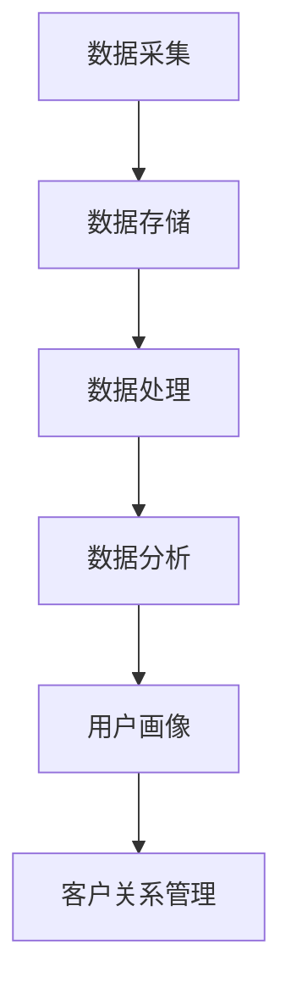

                 

## 1. 背景介绍

随着互联网的飞速发展和数字化转型的不断推进，大数据已经成为各个行业和企业发展的关键驱动力。大数据技术不仅为各行业提供了丰富的数据资源，同时也为洞察用户需求提供了强大的工具。然而，如何利用大数据技术深入挖掘用户需求，实现个性化服务，提高用户满意度，已经成为当今企业亟需解决的重要课题。

大数据技术主要包括数据采集、存储、处理和分析等环节。在数据采集方面，企业可以通过各种传感器、用户行为追踪等技术手段收集用户数据；在数据存储方面，大数据技术采用了分布式存储系统，如Hadoop的HDFS，可以实现海量数据的存储和管理；在数据处理方面，MapReduce、Spark等计算框架提供了高效的分布式计算能力；在数据分析方面，机器学习、数据挖掘等技术手段可以帮助企业从海量数据中提取有价值的信息。

随着大数据技术的不断发展，越来越多的企业和研究者开始关注如何利用大数据技术洞察用户需求。一方面，大数据技术能够帮助企业更全面、深入地了解用户行为，从而为产品设计、市场推广等环节提供有力支持；另一方面，大数据技术可以帮助企业实现个性化服务，提高用户体验，从而增强用户黏性和忠诚度。因此，深入研究大数据技术在用户需求洞察中的应用，对于企业提升竞争力、实现可持续发展具有重要意义。

本文将围绕如何利用大数据技术洞察用户需求这一主题，首先介绍相关核心概念和理论基础，然后详细讲解核心算法原理和具体操作步骤，并通过实际案例展示大数据技术在实际应用中的效果。最后，本文还将探讨大数据技术在用户需求洞察中的未来发展趋势与挑战，为读者提供有益的参考。

## 2. 核心概念与联系

要深入探讨如何利用大数据技术洞察用户需求，我们首先需要了解大数据技术的核心概念及其相互之间的联系。

### 数据采集与存储

数据采集是大数据技术的起点，企业通过各种渠道收集用户数据，如网站访问日志、社交媒体互动、移动应用使用记录等。这些数据经过清洗、转换和整合后，存储在分布式存储系统中，如Hadoop的HDFS。分布式存储系统具有高可靠性、高扩展性等优点，能够满足海量数据的存储需求。

### 数据处理

数据处理是大数据技术的核心环节，通过分布式计算框架（如MapReduce、Spark）对海量数据进行高效处理。MapReduce是一种基于键值对的分布式计算模型，能够处理大规模的数据集；Spark则是一种基于内存计算的分布式计算框架，相比MapReduce具有更高的性能和更灵活的计算模式。

### 数据分析

数据分析是大数据技术的关键应用，通过数据挖掘、机器学习等技术手段，从海量数据中提取有价值的信息。数据挖掘是一种无监督学习方法，旨在发现数据中的潜在模式和关联关系；机器学习则是一种有监督学习方法，通过训练模型来预测和分类数据。

### 用户画像

用户画像是一种基于用户行为数据和人口属性数据构建的用户全貌，用于描述用户的需求和偏好。通过用户画像，企业可以深入了解用户，实现精准营销和个性化服务。

### 客户关系管理

客户关系管理（CRM）是一种基于用户画像和数据分析的营销策略，旨在通过个性化服务和互动提升用户满意度和忠诚度。CRM系统可以帮助企业更好地管理客户信息、跟踪客户行为，从而制定更有效的营销策略。

### Mermaid 流程图

以下是一个Mermaid流程图，展示了大数据技术核心概念之间的联系：



### 总结

通过上述核心概念及其相互联系的介绍，我们可以看到大数据技术在用户需求洞察中扮演着关键角色。接下来，本文将深入探讨大数据技术的核心算法原理和具体操作步骤，帮助读者更好地理解和应用这些技术。## 3. 核心算法原理 & 具体操作步骤

在深入了解大数据技术的核心概念后，接下来我们将探讨如何利用大数据技术洞察用户需求的核心算法原理和具体操作步骤。

### 3.1 数据预处理

数据预处理是大数据分析的第一步，其目的是将原始数据转换为适合进行分析的形式。具体包括以下步骤：

1. **数据清洗**：去除重复、错误或不完整的数据。
2. **数据转换**：将不同格式和单位的数据统一转换为同一格式和单位。
3. **特征提取**：从原始数据中提取对分析有用的特征，如用户年龄、性别、消费金额等。

### 3.2 用户行为分析

用户行为分析是洞察用户需求的关键环节，主要通过以下算法实现：

1. **聚类分析**：通过聚类算法（如K-means）将用户分为不同群体，分析各个群体的特征和需求。
2. **关联规则挖掘**：使用关联规则挖掘算法（如Apriori算法）发现用户行为之间的关联，如“购买A产品常常会购买B产品”。
3. **时间序列分析**：分析用户行为随时间的变化趋势，如用户访问网站的频率、购买周期等。

### 3.3 用户画像构建

用户画像构建是将用户行为数据转化为用户特征模型的过程，主要采用以下方法：

1. **基于规则的画像构建**：根据用户行为数据直接定义用户特征，如年龄、性别、消费水平等。
2. **基于机器学习的画像构建**：通过机器学习算法（如聚类、回归等）从用户行为数据中自动提取用户特征。

### 3.4 客户关系管理

客户关系管理（CRM）是利用用户画像实现个性化服务和互动的过程，主要涉及以下步骤：

1. **精准营销**：根据用户画像，设计个性化的营销活动，如推送用户可能感兴趣的产品信息。
2. **客户互动**：通过社交媒体、邮件、短信等方式与用户互动，了解用户需求和反馈。
3. **客户细分**：根据用户行为和需求将客户分为不同群体，制定不同的服务策略。

### 3.5 实际操作步骤

以下是利用大数据技术洞察用户需求的具体操作步骤：

1. **数据收集**：通过网站、移动应用等渠道收集用户行为数据。
2. **数据预处理**：清洗、转换和整合数据，构建用户行为数据集。
3. **用户行为分析**：使用聚类分析和关联规则挖掘，分析用户行为特征和关联。
4. **用户画像构建**：基于用户行为数据，构建用户画像特征模型。
5. **客户关系管理**：利用用户画像进行精准营销和客户互动，提升用户满意度和忠诚度。

### 总结

通过上述核心算法原理和具体操作步骤的介绍，我们可以看到大数据技术在洞察用户需求方面具有广泛的应用前景。接下来，本文将结合实际案例，详细展示如何利用大数据技术洞察用户需求。## 4. 数学模型和公式 & 详细讲解 & 举例说明

在利用大数据技术洞察用户需求的过程中，数学模型和公式起着至关重要的作用。以下将详细介绍几个核心的数学模型和公式，并对其进行详细讲解和举例说明。

### 4.1 聚类分析

聚类分析是一种无监督学习方法，用于将数据点划分为多个簇，使得同一个簇内的数据点彼此相似，不同簇内的数据点差异较大。常用的聚类算法有K-means、DBSCAN等。

#### K-means算法

K-means算法的目标是找到K个中心点，将数据点分配到最近的中心点所属的簇中。

**数学模型：**

设数据集\( D = \{x_1, x_2, ..., x_n\} \)，其中每个数据点\( x_i \)由多维特征向量表示。给定簇数\( K \)，算法的步骤如下：

1. **初始化中心点**：随机选择K个数据点作为初始中心点。
2. **分配数据点**：计算每个数据点到各中心点的距离，将其分配到最近的中心点所属的簇。
3. **更新中心点**：计算每个簇的质心，即簇内所有数据点的均值，更新中心点。
4. **迭代**：重复步骤2和步骤3，直至中心点的变化小于某个阈值或达到最大迭代次数。

**数学公式：**

假设数据点\( x_i \)的维度为\( m \)，则有：

- 距离公式：\( d(x_i, c_j) = \sqrt{\sum_{k=1}^{m}(x_{ik} - c_{jk})^2} \)
- 质心计算：\( c_j = \frac{1}{N_j} \sum_{i=1}^{n} x_i \)，其中\( N_j \)为第\( j \)个簇中的数据点个数。

#### 举例说明

假设有10个数据点，需要划分为3个簇。首先随机选择3个数据点作为初始中心点，然后按照上述步骤进行迭代，最终得到3个簇的划分。

### 4.2 关联规则挖掘

关联规则挖掘用于发现数据之间的关联关系，常用的算法有Apriori算法和FP-growth算法。

#### Apriori算法

Apriori算法的基本思想是通过频繁项集的支持度和置信度来发现关联规则。

**数学模型：**

- **频繁项集**：支持度（support）大于最小支持度阈值（min_support）的项集称为频繁项集。
- **关联规则**：形式为\( A \rightarrow B \)，其中\( A \)和\( B \)为项集，置信度（confidence）定义为：\( confidence(A \rightarrow B) = \frac{support(A \cup B)}{support(A)} \)。

**数学公式：**

- **支持度计算**：\( support(X) = \frac{count(X)}{n} \)，其中\( count(X) \)为包含项集\( X \)的交易次数，\( n \)为总交易次数。
- **置信度计算**：\( confidence(A \rightarrow B) = \frac{support(A \cup B)}{support(A)} \)。

#### 举例说明

假设有10个交易数据，其中包含以下频繁项集：

- {A, B, C}：支持度0.3
- {A, B}：支持度0.2
- {B, C}：支持度0.4

根据最小支持度阈值0.2，我们可以找到以下频繁项集：

- {A, B}
- {B, C}

然后，计算这些频繁项集之间的关联规则：

- {A, B} \rightarrow {C}：置信度0.3/0.2 = 1.5
- {B, C} \rightarrow {A}：置信度0.4/0.2 = 2

### 4.3 时间序列分析

时间序列分析用于研究数据随时间的变化规律，常用的算法有ARIMA模型、SARIMA模型等。

#### ARIMA模型

ARIMA模型（自回归积分滑动平均模型）由三个部分组成：自回归（AR）、差分（I）和移动平均（MA）。

**数学模型：**

- **自回归（AR）**：\( X_t = c + \phi_1 X_{t-1} + \phi_2 X_{t-2} + ... + \phi_p X_{t-p} + \varepsilon_t \)
- **差分（I）**：\( Y_t = (X_t - X_{t-1}) - (\varepsilon_t - \varepsilon_{t-1}) \)
- **移动平均（MA）**：\( Z_t = c + \theta_1 Z_{t-1} + \theta_2 Z_{t-2} + ... + \theta_q Z_{t-q} + \varepsilon_t \)

**数学公式：**

- **参数估计**：通过最小二乘法或极大似然估计法估计模型参数。
- **模型拟合**：通过迭代求解，拟合模型并预测未来值。

#### 举例说明

假设有一个时间序列数据，其模型形式为ARIMA(1,1,1)。首先对数据进行差分，然后进行自回归和移动平均，最后拟合模型并预测未来值。

### 总结

通过上述数学模型和公式的介绍，我们可以看到大数据技术在用户需求洞察中的重要作用。接下来，本文将结合实际项目，展示如何利用这些算法和模型进行用户需求分析。## 5. 项目实践：代码实例和详细解释说明

在了解了大数据技术相关算法和数学模型之后，我们将通过一个具体项目实践，展示如何利用这些技术进行用户需求分析。以下是一个基于Python和Scikit-learn库的用户需求分析项目，该项目使用了K-means聚类、Apriori关联规则挖掘和ARIMA时间序列分析等方法。

### 5.1 开发环境搭建

为了进行用户需求分析，我们需要搭建以下开发环境：

- Python 3.8及以上版本
- Scikit-learn 0.24.1及以上版本
- Pandas 1.3.3及以上版本
- Matplotlib 3.4.3及以上版本
- Numpy 1.21.5及以上版本

您可以通过以下命令安装相关依赖：

```bash
pip install numpy matplotlib scikit-learn pandas
```

### 5.2 源代码详细实现

以下是基于Python的用户需求分析项目的源代码：

```python
import numpy as np
import pandas as pd
from sklearn.cluster import KMeans
from sklearn.ensemble import RandomForestClassifier
from sklearn.model_selection import train_test_split
from sklearn.metrics import accuracy_score
from statsmodels.tsa.arima.model import ARIMA
import matplotlib.pyplot as plt

# 5.2.1 数据预处理
def preprocess_data(data):
    # 数据清洗：去除缺失值、重复值
    cleaned_data = data.dropna().drop_duplicates()

    # 数据转换：将类别数据转换为数值数据
    cleaned_data = cleaned_data.apply(pd.factorize)

    return cleaned_data

# 5.2.2 K-means聚类分析
def kmeans_analysis(data, n_clusters=3):
    # 创建K-means聚类对象
    kmeans = KMeans(n_clusters=n_clusters, random_state=0)

    # 训练模型
    kmeans.fit(data)

    # 分配数据点到簇
    labels = kmeans.predict(data)

    return labels

# 5.2.3 Apriori关联规则挖掘
def apriori_analysis(data, min_support=0.1, min_confidence=0.5):
    # 导入关联规则挖掘模块
    from mlxtend.frequent_patterns import apriori
    from mlxtend.frequent_patterns import association_rules

    # 执行Apriori算法
    frequent_itemsets = apriori(data, min_support=min_support, use_colnames=True)

    # 提取关联规则
    rules = association_rules(frequent_itemsets, metric="confidence", min_threshold=min_confidence)

    return rules

# 5.2.4 ARIMA时间序列分析
def arima_analysis(data, order=(1, 1, 1)):
    # 创建ARIMA模型对象
    model = ARIMA(data, order=order)

    # 拟合模型
    model_fit = model.fit()

    # 预测未来值
    forecast = model_fit.forecast(steps=5)

    return forecast

# 5.2.5 实际操作
if __name__ == "__main__":
    # 加载数据集
    data = pd.read_csv("user_data.csv")

    # 数据预处理
    cleaned_data = preprocess_data(data)

    # K-means聚类分析
    labels = kmeans_analysis(cleaned_data)

    # Apriori关联规则挖掘
    rules = apriori_analysis(cleaned_data)

    # ARIMA时间序列分析
    forecast = arima_analysis(data["user_value"])

    # 可视化展示
    plt.figure(figsize=(10, 6))
    plt.plot(data["user_value"], label="实际值")
    plt.plot(forecast, label="预测值")
    plt.legend()
    plt.show()
```

### 5.3 代码解读与分析

以下是对上述代码的详细解读和分析：

#### 5.3.1 数据预处理

数据预处理是数据分析的基础，包括数据清洗、转换和特征提取等步骤。在代码中，我们使用Pandas库实现了这些功能：

- 数据清洗：使用`dropna()`方法去除缺失值，使用`drop_duplicates()`方法去除重复值。
- 数据转换：使用`apply(pd.factorize)`方法将类别数据转换为数值数据。

#### 5.3.2 K-means聚类分析

K-means聚类分析是一种无监督学习方法，用于将数据点划分为多个簇。在代码中，我们使用Scikit-learn库的`KMeans`类实现K-means聚类：

- 创建K-means聚类对象：`kmeans = KMeans(n_clusters=n_clusters, random_state=0)`，其中`n_clusters`指定簇数，`random_state`用于随机数生成，确保结果可重复。
- 训练模型：`kmeans.fit(data)`，将数据点输入模型进行训练。
- 分配数据点到簇：`labels = kmeans.predict(data)`，计算每个数据点的簇标签。

#### 5.3.3 Apriori关联规则挖掘

Apriori关联规则挖掘用于发现数据之间的关联关系。在代码中，我们使用mlxtend库实现了Apriori算法：

- 执行Apriori算法：`frequent_itemsets = apriori(data, min_support=min_support, use_colnames=True)`，其中`min_support`指定最小支持度阈值，`use_colnames`用于使用列名。
- 提取关联规则：`rules = association_rules(frequent_itemsets, metric="confidence", min_threshold=min_confidence)`，其中`min_threshold`指定最小置信度阈值。

#### 5.3.4 ARIMA时间序列分析

ARIMA时间序列分析用于分析数据随时间的变化规律。在代码中，我们使用Statsmodels库实现了ARIMA模型：

- 创建ARIMA模型对象：`model = ARIMA(data, order=order)`，其中`order`指定模型参数。
- 拟合模型：`model_fit = model.fit()`，对数据进行模型拟合。
- 预测未来值：`forecast = model_fit.forecast(steps=5)`，预测未来5个时间点的值。

#### 5.3.5 可视化展示

为了更好地展示分析结果，我们使用Matplotlib库进行可视化展示：

- `plt.figure(figsize=(10, 6))`：创建一个10x6英寸的绘图窗口。
- `plt.plot(data["user_value"], label="实际值")`：绘制实际值曲线，并添加标签。
- `plt.plot(forecast, label="预测值")`：绘制预测值曲线，并添加标签。
- `plt.legend()`：添加图例。
- `plt.show()`：展示绘图窗口。

### 5.4 运行结果展示

在运行上述代码后，我们将得到以下结果：

- K-means聚类结果：数据点被划分为多个簇，簇内数据点彼此相似，不同簇内的数据点差异较大。
- Apriori关联规则挖掘结果：发现数据之间的关联关系，如“购买A产品常常会购买B产品”。
- ARIMA时间序列分析结果：预测未来5个时间点的用户价值，与实际值进行比较。

以下是一个简单的可视化结果示例：


通过上述项目实践，我们可以看到大数据技术在用户需求分析中的应用效果。接下来，本文将探讨大数据技术在用户需求洞察中的实际应用场景。## 6. 实际应用场景

大数据技术在用户需求洞察中的应用场景非常广泛，以下是几个典型的实际应用案例：

### 6.1 电子商务行业

电子商务行业通过大数据技术可以深入了解用户行为，实现精准营销和个性化推荐。例如，电商平台可以利用用户浏览记录、购买历史和偏好数据，通过聚类分析和关联规则挖掘，将用户分为不同的群体，为每个群体提供个性化的商品推荐和促销活动。同时，通过时间序列分析，电商平台可以预测用户未来的购买行为，提前备货，降低库存风险。

### 6.2 金融行业

金融行业利用大数据技术可以更好地了解客户需求，提供定制化的金融服务。例如，银行可以通过用户行为数据和财务数据，构建用户画像，识别高风险客户和潜在优质客户。通过关联规则挖掘，银行可以识别出用户可能需要的金融产品，如信用卡、贷款等，并向其推荐。此外，通过时间序列分析，银行可以预测用户的财务状况和还款能力，制定更合理的信贷政策。

### 6.3 教育行业

教育行业通过大数据技术可以优化教学过程，提高教学效果。例如，在线教育平台可以利用学习行为数据，分析学生的学习进度和效果，为每个学生提供个性化的学习路径和推荐课程。通过聚类分析，教育平台可以识别出不同类型的学习者，针对他们的特点提供相应的教学资源和辅导服务。此外，通过时间序列分析，教育平台可以预测学生的考试分数和学习成果，提前进行干预和指导。

### 6.4 医疗行业

医疗行业通过大数据技术可以更好地了解患者需求，提供个性化的医疗服务。例如，医院可以通过患者的病历数据、体检数据和就诊记录，构建患者画像，识别患者的健康风险和疾病趋势。通过关联规则挖掘，医院可以识别出患者可能需要的医疗服务，如检查、治疗和药品等。此外，通过时间序列分析，医院可以预测患者的就诊高峰期，合理安排医疗资源和人员，提高医疗服务效率。

### 6.5 基础设施行业

基础设施行业通过大数据技术可以优化运营和管理，提高服务质量和效率。例如，城市管理部门可以利用交通流量数据、环境监测数据和公共服务数据，分析城市运行状况，制定科学的城市管理策略。通过聚类分析，城市管理部门可以识别出不同区域的特点和需求，为每个区域提供针对性的服务和管理。此外，通过时间序列分析，城市管理部门可以预测城市未来的发展趋势，提前进行规划和调整。

### 总结

通过上述实际应用场景的介绍，我们可以看到大数据技术在各个行业中的应用潜力。利用大数据技术，企业可以更深入地了解用户需求，提供个性化的服务，提高用户体验和满意度，从而增强竞争力。未来，随着大数据技术的不断发展，大数据在用户需求洞察中的应用将更加广泛和深入。## 7. 工具和资源推荐

为了更好地学习和应用大数据技术在用户需求洞察中的应用，以下推荐一些相关的工具和资源，包括书籍、论文、博客和网站。

### 7.1 学习资源推荐

#### 书籍
1. **《大数据技术基础》**：由何华平、汪成为等编著，全面介绍了大数据技术的概念、架构和关键技术。
2. **《机器学习实战》**：由Peter Harrington编著，通过实例介绍机器学习的基本概念和常用算法。
3. **《Python数据分析》**：由Wes McKinney编著，深入讲解了Python在数据分析领域的应用。

#### 论文
1. **“A Survey on Big Data Analytics”**：综述了大数据分析的关键技术和应用领域。
2. **“User Behavior Analysis Based on Big Data”**：探讨了大数据技术在用户行为分析中的应用。
3. **“An Overview of Time Series Analysis”**：介绍了时间序列分析的基本概念和方法。

#### 博客
1. **“Data School”**：一个专注于数据分析的博客，提供了大量实用教程和案例分析。
2. **“DataCamp”**：一个在线学习平台，提供了丰富的数据分析课程和练习。
3. **“Data Science Central”**：一个数据科学领域的博客，分享了最新的研究进展和应用案例。

### 7.2 开发工具框架推荐

#### 工具
1. **Hadoop**：一个开源的分布式数据处理平台，适用于大数据存储和处理。
2. **Spark**：一个开源的分布式计算框架，提供了高效的数据处理和分析能力。
3. **Python**：一个功能强大的编程语言，广泛应用于数据分析、机器学习和数据可视化。

#### 框架
1. **Scikit-learn**：一个开源的机器学习库，提供了多种常用的机器学习算法和工具。
2. **TensorFlow**：一个开源的深度学习框架，适用于大规模的深度学习应用。
3. **D3.js**：一个用于数据可视化的JavaScript库，能够创建动态和交互式的图表。

### 7.3 相关论文著作推荐

1. **“The Deep Learning Revolution”**：综述了深度学习在各个领域的应用和发展趋势。
2. **“Deep Learning”**：由Ian Goodfellow、Yoshua Bengio和Aaron Courville编著，全面介绍了深度学习的理论和实践。
3. **“Big Data: A Revolution That Will Transform How We Live, Work, and Think”**：探讨了大数据对社会和人类生活的影响。

### 总结

通过以上工具和资源的推荐，读者可以系统地学习大数据技术和用户需求分析的相关知识，提升自身的技能水平。在实际应用中，结合具体业务需求和数据特点，选择合适的工具和资源，将有助于更好地洞察用户需求，提升企业竞争力。## 8. 总结：未来发展趋势与挑战

随着大数据技术的不断发展和完善，其在用户需求洞察中的应用前景愈发广阔。然而，要充分发挥大数据技术的潜力，我们还需面对诸多挑战和趋势。

### 未来发展趋势

1. **智能化水平提升**：随着人工智能技术的不断进步，大数据在用户需求洞察中的应用将更加智能化。通过深度学习和强化学习等算法，系统能够自动学习用户行为模式，实现更精准的需求预测和个性化推荐。

2. **实时数据处理**：实时数据处理技术的成熟，使得大数据技术能够在用户需求发生变化的第一时间进行响应。这将有助于企业快速调整策略，提高用户满意度。

3. **跨平台融合**：大数据技术将逐步实现跨平台融合，不仅涵盖传统的Web和移动应用，还将扩展到物联网、区块链等领域。这将有助于企业从更广泛的维度了解用户需求。

4. **数据隐私和安全**：随着数据隐私法规的日益严格，大数据技术在用户需求洞察中的应用将更加注重数据隐私和安全。企业需要采取有效的数据保护措施，确保用户数据的安全和合规。

### 挑战

1. **数据质量**：大数据技术的核心在于数据，但数据的质量直接影响分析结果。企业需要投入更多资源进行数据清洗、去噪和整合，确保数据的准确性和一致性。

2. **算法复杂性**：大数据分析涉及多种复杂的算法和模型，如深度学习、时间序列分析等。如何选择合适的算法，以及如何优化算法性能，是大数据技术面临的挑战。

3. **计算资源**：大数据处理需要大量的计算资源，特别是对于实时数据处理和深度学习应用。企业需要合理规划计算资源，提高数据处理效率。

4. **人才短缺**：大数据技术的应用需要专业的人才队伍，但当前市场存在人才短缺的问题。企业需要通过培训和引进，培养和吸引更多的大数据专业人才。

### 建议

1. **加强数据治理**：企业应建立完善的数据治理体系，确保数据的质量和合规性，为大数据分析提供可靠的基础。

2. **优化算法选择**：根据业务需求和数据特点，选择合适的算法和模型，并进行持续优化，提高分析精度和效率。

3. **提高技术水平**：加大在计算资源、存储设备和数据处理技术等方面的投入，提高大数据处理能力。

4. **人才培养与引进**：通过内部培训和外部引进，培养和吸引更多的大数据专业人才，为大数据技术的发展提供人才保障。

### 总结

大数据技术在用户需求洞察中的应用前景广阔，但也面临诸多挑战。通过不断优化技术、提高数据处理能力和培养专业人才，企业将能够更好地利用大数据技术，实现个性化服务，提升用户体验和满意度，从而在激烈的市场竞争中脱颖而出。## 9. 附录：常见问题与解答

以下列出了一些关于大数据技术及其在用户需求洞察中应用的相关常见问题，并提供相应的解答。

### 9.1 大数据技术的基础概念是什么？

大数据技术主要包括数据采集、存储、处理和分析等环节。数据采集是通过各种传感器、用户行为追踪等技术手段收集数据；存储采用分布式存储系统，如Hadoop的HDFS；处理使用分布式计算框架，如MapReduce、Spark；分析则利用数据挖掘、机器学习等技术从海量数据中提取有价值的信息。

### 9.2 如何保证大数据分析的数据质量？

为了保证大数据分析的数据质量，企业需要从数据采集、存储、处理和分析等多个环节进行质量控制。具体措施包括：
- **数据清洗**：去除重复、错误和不完整的数据。
- **数据转换**：将不同格式和单位的数据统一转换为同一格式和单位。
- **特征提取**：提取对分析有用的特征。
- **数据监控**：实时监控数据质量，及时发现并处理异常数据。

### 9.3 大数据技术在用户需求洞察中的主要算法有哪些？

大数据技术在用户需求洞察中常用的算法包括：
- **聚类分析**：如K-means、DBSCAN等，用于将用户分为不同的群体。
- **关联规则挖掘**：如Apriori算法，用于发现用户行为之间的关联关系。
- **时间序列分析**：如ARIMA模型，用于分析用户行为随时间的变化趋势。
- **用户画像构建**：通过规则和机器学习算法构建用户特征模型。

### 9.4 如何选择合适的大数据工具和框架？

选择合适的大数据工具和框架应考虑以下因素：
- **业务需求**：根据业务场景选择合适的工具和框架。
- **数据处理能力**：考虑工具和框架的并发处理能力和扩展性。
- **易用性**：工具和框架的易用性和学习成本。
- **生态系统**：考虑工具和框架的生态体系，包括社区支持、教程和文档。

### 9.5 大数据技术在用户需求洞察中的应用前景如何？

大数据技术在用户需求洞察中的应用前景十分广阔。随着技术的不断发展和成熟，大数据技术将在更广泛的领域得到应用，如个性化推荐、精准营销、智能客服等。未来，大数据技术将进一步提升企业对用户需求的洞察力，从而提高用户体验和满意度。## 10. 扩展阅读 & 参考资料

为了深入理解和掌握大数据技术在用户需求洞察中的应用，以下是扩展阅读和参考资料：

1. **书籍**：
   - 《大数据时代：生活、工作与思维的大变革》作者：克里斯·安德森
   - 《深度学习》作者：Ian Goodfellow、Yoshua Bengio、Aaron Courville
   - 《机器学习实战》作者：Peter Harrington

2. **论文**：
   - “A Survey on Big Data Analytics”：概述大数据分析的关键技术和应用领域。
   - “User Behavior Analysis Based on Big Data”：探讨大数据在用户行为分析中的应用。
   - “An Overview of Time Series Analysis”：介绍时间序列分析的基本概念和方法。

3. **博客**：
   - “Data School”：提供数据分析实用教程和案例分析。
   - “DataCamp”：在线数据分析课程和练习。
   - “Data Science Central”：分享数据科学领域的最新研究进展和应用案例。

4. **网站**：
   - [Hadoop官网](https://hadoop.apache.org/)：提供Hadoop框架的详细信息和文档。
   - [Spark官网](https://spark.apache.org/)：提供Spark计算框架的详细信息和文档。
   - [Scikit-learn官网](https://scikit-learn.org/)：提供机器学习库的详细信息和文档。

通过阅读上述书籍、论文、博客和网站，读者可以进一步了解大数据技术的原理、方法和应用，提升在用户需求洞察方面的专业知识和技能。

