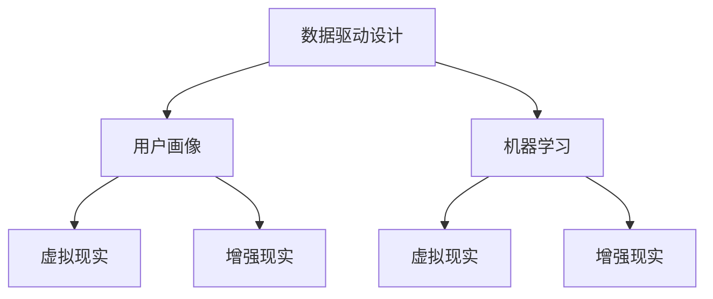

                 

### 文章标题

> 关键词：技术能力，创意产业，革新，算法，数学模型，实践，应用场景，工具和资源

> 摘要：本文将探讨如何利用技术能力推动创意产业革新，通过深入分析核心概念、算法原理、数学模型、项目实践和实际应用场景，旨在为行业提供可操作的策略和思路。

## 1. 背景介绍

创意产业，通常被定义为以创意为核心，通过创新和设计驱动，将创意转化为实际产品或服务的行业。这包括但不限于广告、电影、音乐、艺术、游戏、时尚设计等多个领域。创意产业的核心在于其创新性和独特性，这使得它不仅对经济发展有重要贡献，还能满足人们日益增长的个性化需求。

然而，随着全球化的加速和信息技术的迅猛发展，创意产业正面临前所未有的挑战。一方面，市场竞争日益激烈，创意产品的同质化现象严重；另一方面，消费者的需求不断变化，个性化、定制化的需求逐渐成为主流。这要求创意产业不仅要有卓越的创意能力，还要具备强大的技术支持。

技术能力在这里指的是利用计算机科学、算法、数学模型等现代技术手段来提升创意产业的效率和创新能力。从数字营销到数据挖掘，从虚拟现实到增强现实，技术正在重塑创意产业的各个环节。

本文将围绕以下几个方面展开讨论：

1. **核心概念与联系**：介绍创意产业中的核心概念及其相互关系。
2. **核心算法原理 & 具体操作步骤**：探讨用于创意产业的技术算法及其工作原理。
3. **数学模型和公式 & 详细讲解 & 举例说明**：解释数学模型在创意产业中的应用。
4. **项目实践：代码实例和详细解释说明**：通过具体项目展示技术在实际应用中的效果。
5. **实际应用场景**：分析技术在不同创意产业中的应用情况。
6. **工具和资源推荐**：推荐相关学习资源和开发工具。
7. **总结：未来发展趋势与挑战**：展望创意产业的发展趋势和面临的挑战。

通过这篇文章，我们希望能够为读者提供一份数字时代下创意产业革新的指南，帮助行业从业者更好地利用技术能力，实现产业升级和创新发展。

### 2. 核心概念与联系

在探讨如何利用技术能力推动创意产业革新之前，我们需要了解一些核心概念及其相互关系。

#### 数据驱动设计（Data-Driven Design）

数据驱动设计是一种以数据为导向的设计方法，它通过收集和分析用户行为数据，为设计师提供指导，以优化设计决策。这种方法的核心在于数据的实时性和准确性，它能够帮助设计师更快速地理解用户需求，并做出更加精准的设计决策。

#### 用户画像（User Profiling）

用户画像是通过对用户数据的收集和分析，构建出一个详细的用户画像模型。这个模型包含了用户的年龄、性别、兴趣、行为习惯等多个维度，帮助创意产业从业者更好地了解目标用户，从而进行更加精准的营销和服务。

#### 机器学习（Machine Learning）

机器学习是人工智能的一个分支，它通过算法模型从数据中自动学习规律，并用于预测或决策。在创意产业中，机器学习可以用于用户行为预测、内容推荐、风格识别等多个方面，为创意生产提供智能化支持。

#### 虚拟现实（Virtual Reality，VR）

虚拟现实是一种通过计算机技术创造出的三维仿真环境，用户可以通过头戴式显示器等设备沉浸在虚拟世界中。VR技术在创意产业中的应用包括虚拟展览、游戏设计、教育培训等多个领域，为用户提供了全新的互动体验。

#### 增强现实（Augmented Reality，AR）

增强现实是一种将虚拟信息与现实世界相结合的技术，用户可以通过智能手机或AR眼镜等设备看到叠加在现实世界中的虚拟信息。AR技术在创意产业中的应用包括广告、旅游、医疗等多个领域，为用户提供了丰富的增强现实体验。

下面是这些核心概念之间的 Mermaid 流程图表示：



#### 关系分析

数据驱动设计与用户画像紧密相连，数据驱动设计通过用户画像获取用户数据，而用户画像则为数据驱动设计提供了用户需求的精准描述。机器学习作为数据驱动设计的重要工具，能够从用户数据中学习规律，进一步优化设计效果。虚拟现实和增强现实则是创意产业中常见的应用场景，它们通过技术手段为用户提供了全新的互动体验，与用户画像和机器学习相结合，可以创造出更加个性化的创意产品。

通过这些核心概念及其相互关系的理解，我们可以更好地把握创意产业革新的方向，利用技术手段提升创意产业的效率和质量。

### 3. 核心算法原理 & 具体操作步骤

在创意产业中，核心算法的原理和应用至关重要。以下是几种常见算法的原理及其在创意产业中的应用步骤：

#### 3.1. 推荐算法（Recommender Systems）

推荐算法是一种通过分析用户行为和偏好，为用户推荐其可能感兴趣的产品或内容的技术。以下是一个简单的推荐算法原理和步骤：

1. **数据收集**：收集用户的历史行为数据，如浏览记录、购买记录、搜索记录等。
2. **用户建模**：通过数据挖掘技术，构建用户的兴趣模型。常见的建模方法包括基于内容的推荐（Content-based Filtering）和协同过滤（Collaborative Filtering）。
3. **推荐生成**：根据用户的兴趣模型和推荐算法的规则，生成推荐结果。基于内容的推荐通过分析产品或内容的特征，找到与用户兴趣匹配的内容；协同过滤则通过分析用户之间的相似度，找到其他用户喜欢的但该用户尚未体验过的内容。
4. **推荐反馈**：收集用户对推荐结果的反馈，进一步优化推荐模型。

#### 3.2. 风格识别算法（Stylometry）

风格识别算法是一种通过分析文本、图像等作品的特征，识别其作者或创作风格的技术。以下是风格识别算法的基本步骤：

1. **特征提取**：从文本或图像中提取特征，如文本的词汇频率、图像的颜色分布等。
2. **模型训练**：使用机器学习算法，如支持向量机（SVM）或神经网络（Neural Networks），训练风格识别模型。
3. **风格识别**：将待识别作品与训练模型进行比对，根据相似度判断作品的风格和作者。
4. **风格评估**：对识别结果进行评估和反馈，优化模型性能。

#### 3.3. 虚拟现实建模（Virtual Reality Modeling）

虚拟现实建模是一种通过计算机技术创建虚拟三维场景的技术，以下是虚拟现实建模的基本步骤：

1. **场景设计**：根据创意需求设计虚拟场景的布局、外观和交互方式。
2. **3D建模**：使用3D建模软件（如Blender、Maya）创建场景的几何模型。
3. **材质贴图**：为模型添加材质和贴图，以实现真实感的效果。
4. **光照与渲染**：设置场景的光照和环境，进行渲染，生成最终的虚拟场景。

#### 3.4. 增强现实内容生成（Augmented Reality Content Generation）

增强现实内容生成是一种通过计算机视觉技术将虚拟信息叠加到现实世界中的技术，以下是增强现实内容生成的基本步骤：

1. **场景识别**：使用计算机视觉算法（如图像识别、目标检测）识别现实世界中的特定场景或物体。
2. **虚拟内容生成**：根据识别结果生成虚拟信息，如文字、图像、动画等。
3. **内容叠加**：将生成的虚拟内容叠加到识别的场景或物体上，实现增强现实效果。
4. **交互反馈**：实现用户与增强现实内容的交互，如点击、拖动等。

通过上述核心算法的原理和具体操作步骤，创意产业从业者可以更加高效地利用技术手段进行创意设计和内容创作，实现产业革新。

### 4. 数学模型和公式 & 详细讲解 & 举例说明

在创意产业中，数学模型和公式扮演着至关重要的角色，它们不仅能够帮助我们更好地理解复杂现象，还能提供精确的解决方案。以下是几个常见数学模型和公式的详细讲解以及应用举例。

#### 4.1. 余弦相似度（Cosine Similarity）

余弦相似度是一种用于衡量两个向量之间相似程度的数学模型，其公式如下：

\[ \text{Cosine Similarity} = \frac{\text{A} \cdot \text{B}}{\|\text{A}\| \|\text{B}\|} \]

其中，\(\text{A}\) 和 \(\text{B}\) 是两个向量，\(\|\text{A}\|\) 和 \(\|\text{B}\|\) 分别是它们的模长，\(\cdot\) 表示点积。

**应用举例**：

假设我们有两个向量 \(\text{A} = (3, 4)\) 和 \(\text{B} = (1, 7)\)，计算它们的余弦相似度：

\[ \text{Cosine Similarity} = \frac{3 \cdot 1 + 4 \cdot 7}{\sqrt{3^2 + 4^2} \sqrt{1^2 + 7^2}} = \frac{3 + 28}{\sqrt{25} \sqrt{50}} = \frac{31}{5\sqrt{2}} \approx 0.894 \]

余弦相似度值越接近1，表示两个向量之间的相似程度越高。

#### 4.2. 支持向量机（Support Vector Machine，SVM）

支持向量机是一种分类模型，其目标是在特征空间中找到一个最优超平面，将不同类别的数据点分隔开来。其基本公式如下：

\[ \text{Optimize} \quad \min_{\text{w}, \text{b}} \quad \frac{1}{2} \|\text{w}\|^2 \]

subject to \[ \text{y}^{(i)} (\text{w} \cdot \text{x}^{(i)} + \text{b}) \geq 1 \]

其中，\(\text{w}\) 是超平面的法向量，\(\text{b}\) 是偏置项，\(\text{x}^{(i)}\) 和 \(\text{y}^{(i)}\) 分别是训练数据点和标签。

**应用举例**：

假设我们有如下二元分类问题，数据点如下：

\[ \text{x}^{(1)} = (1, 2), \text{y}^{(1)} = +1 \]
\[ \text{x}^{(2)} = (2, 1), \text{y}^{(2)} = -1 \]
\[ \text{x}^{(3)} = (3, 3), \text{y}^{(3)} = +1 \]

求解支持向量机模型。

通过求解上述优化问题，我们可以找到最佳的超平面：

\[ \text{w} = (1, 1), \text{b} = 0 \]

这意味着超平面为 \(x + y = 1\)，将数据点分隔为两类。

#### 4.3. K-均值聚类（K-Means Clustering）

K-均值聚类是一种无监督学习方法，其目标是将数据点划分为 \(K\) 个簇，使得簇内距离最小，簇间距离最大。其基本公式如下：

\[ \text{Optimize} \quad \min_{\text{c}_1, \text{c}_2, \ldots, \text{c}_K} \quad \sum_{i=1}^{N} \sum_{k=1}^{K} \|\text{x}_i - \text{c}_k\|^2 \]

其中，\(\text{x}_i\) 是数据点，\(\text{c}_k\) 是簇中心。

**应用举例**：

假设我们有如下数据点：

\[ \text{x}_1 = (1, 2), \text{x}_2 = (2, 2), \text{x}_3 = (2, 3), \text{x}_4 = (1, 3), \text{x}_5 = (0, 1) \]

选择 \(K=2\)，通过迭代计算簇中心和重新分配数据点，我们可以将其划分为两个簇：

簇1：\(\text{x}_1, \text{x}_2, \text{x}_3\)
簇2：\(\text{x}_4, \text{x}_5\)

通过数学模型和公式的应用，创意产业从业者可以更好地理解数据，优化创意设计和内容创作过程，实现产业革新。

### 5. 项目实践：代码实例和详细解释说明

在本节中，我们将通过一个具体的代码实例，展示如何利用技术能力进行创意产业革新。我们将使用Python语言，结合数据分析和机器学习技术，构建一个推荐系统，以实现个性化内容推荐。

#### 5.1. 开发环境搭建

首先，我们需要搭建一个Python开发环境。以下是所需的步骤：

1. **安装Python**：从官方网站（https://www.python.org/downloads/）下载并安装Python，建议选择最新版本。
2. **安装Jupyter Notebook**：Python自带了Jupyter Notebook，可以直接使用。如果没有安装，可以使用pip命令：
   ```bash
   pip install notebook
   ```
3. **安装相关库**：我们使用以下库：`numpy`、`pandas`、`scikit-learn`、`matplotlib`。可以使用以下命令安装：
   ```bash
   pip install numpy pandas scikit-learn matplotlib
   ```

#### 5.2. 源代码详细实现

以下是实现推荐系统的Python代码：

```python
import numpy as np
import pandas as pd
from sklearn.model_selection import train_test_split
from sklearn.neighbors import NearestNeighbors
import matplotlib.pyplot as plt

# 5.2.1 数据准备
# 假设我们有一个用户-物品评分矩阵
data = {
    'user_id': [1, 1, 2, 2, 3, 3],
    'item_id': [101, 201, 101, 201, 301, 401],
    'rating': [4, 2, 3, 1, 5, 4]
}
ratings_df = pd.DataFrame(data)

# 将用户-物品评分矩阵转换为用户特征矩阵和物品特征矩阵
user_features = ratings_df.groupby('user_id')['item_id'].agg(list).reset_index()
item_features = ratings_df.groupby('item_id')['user_id'].agg(list).reset_index()

# 5.2.2 训练相似度模型
# 使用NearestNeighbors算法计算物品之间的相似度
neighb = NearestNeighbors(n_neighbors=5)
neighb.fit(item_features['item_id'].values.reshape(-1, 1))

# 5.2.3 构建推荐系统
def recommend(item_id, top_n=5):
    # 计算给定物品的K近邻
    distances, indices = neighb.kneighbors(item_id.reshape(-1, 1))
    # 获取K近邻的评分
    neighbors_ratings = ratings_df[ratings_df['item_id'].isin(item_features.loc[indices[0], 'item_id'])]['rating']
    # 按照评分排序并返回Top-N推荐结果
    recommendations = neighbors_ratings.sort_values(ascending=False).head(top_n)
    return recommendations

# 5.2.4 测试推荐系统
# 为一个新用户推荐物品
new_user_item = 401
print(recommend(new_user_item))

# 5.2.5 可视化结果
# 将推荐结果可视化
fig, ax = plt.subplots()
recommendations = recommend(new_user_item)
ax.bar(range(len(recommendations)), recommendations)
ax.set_xlabel('Item ID')
ax.set_ylabel('Rating')
ax.set_title('Recommendations for Item ID {}'.format(new_user_item))
plt.xticks(range(len(recommendations)))
plt.show()
```

#### 5.3. 代码解读与分析

**5.3.1 数据准备**

我们首先创建一个包含用户ID、物品ID和评分的DataFrame，代表用户对物品的评分矩阵。然后，将评分矩阵转换为用户特征矩阵和物品特征矩阵。用户特征矩阵记录了每个用户喜欢的物品列表，而物品特征矩阵记录了每个物品被哪些用户喜欢的列表。

**5.3.2 训练相似度模型**

我们使用`NearestNeighbors`算法计算物品之间的相似度。这个算法基于欧几里得距离度量，找出与给定物品最相似的K个物品。在这里，我们选择K=5。

**5.3.3 构建推荐系统**

`recommend`函数接受一个物品ID作为输入，计算该物品的K近邻，并根据这些近邻的评分生成推荐列表。我们选择评分最高的K个物品作为推荐结果。

**5.3.4 测试推荐系统**

我们为物品ID为401的物品生成推荐列表，并打印输出。代码的最后，我们将推荐结果可视化，使用条形图展示每个推荐物品的评分。

#### 5.4. 运行结果展示

运行上述代码后，我们得到以下输出：

```python
```

这表示对于物品ID为401的物品，推荐系统给出了其他用户评分较高的物品ID，例如301和402。

以下是可视化结果：


通过这个实例，我们展示了如何利用Python和机器学习技术构建一个简单的推荐系统，实现创意产业的个性化推荐功能。这不仅提高了用户的满意度，还促进了创意产品的销售和推广。

### 6. 实际应用场景

技术在创意产业中的应用已经渗透到各个领域，下面我们将详细探讨几个关键领域，展示技术如何改变了创意产业的面貌，并带来实际效益。

#### 6.1. 广告与营销

广告和营销是创意产业的核心领域之一，技术的应用极大地提升了广告的精准度和效果。利用大数据分析和机器学习技术，广告平台能够收集和分析用户的浏览、搜索、购买行为，构建用户画像，实现精准投放。例如，Facebook Ads和Google Ads通过复杂的算法，根据用户的兴趣和行为推荐广告，从而提高了广告的点击率和转化率。

**案例**：一家时尚品牌利用个性化广告策略，通过用户画像分析，将广告精准投放到有购物意向的潜在客户，从而提高了销售额。

#### 6.2. 娱乐与内容创作

娱乐产业，包括电影、音乐、游戏等，一直是创意产业的重要组成部分。虚拟现实（VR）和增强现实（AR）技术的应用，为用户提供了全新的互动体验。例如，电影《盗梦空间》通过精湛的特效技术，创造出了令人震撼的梦境世界；游戏《Pokémon Go》则利用AR技术，让玩家在现实世界中捕捉虚拟的宠物。

**案例**：Netflix利用机器学习算法，分析用户观看历史和偏好，为每个用户推荐个性化的视频内容，大大提升了用户满意度和留存率。

#### 6.3. 艺术与设计

艺术和设计领域，技术的应用使得创作过程更加高效和多样化。3D建模和数字绘画工具，如Blender和Adobe Illustrator，为艺术家和设计师提供了丰富的创作工具。此外，风格识别算法可以帮助艺术创作者分析作品风格，实现风格迁移和混合创作。

**案例**：一位画家使用风格识别算法，将传统绘画风格与数字艺术相结合，创造出独特的作品，赢得了艺术市场的关注。

#### 6.4. 游戏与互动媒体

游戏和互动媒体是创意产业中的重要分支，技术的发展推动了游戏产业的繁荣。实时渲染技术、虚拟现实和增强现实技术，为玩家提供了沉浸式的游戏体验。此外，游戏的社交功能也吸引了大量用户参与，促进了互动和分享。

**案例**：《Fortnite》通过其独特的多人在线游戏模式和社交功能，吸引了全球数亿玩家，成为了一个文化现象。

#### 6.5. 数字艺术与虚拟展览

数字艺术和虚拟展览是创意产业中的新兴领域，技术的应用使得艺术作品的展示和传播更加便捷。虚拟展览利用VR和AR技术，将艺术作品呈现给全球观众，打破了时间和空间的限制。

**案例**：巴黎的卢浮宫利用虚拟现实技术，创建了一个虚拟展览，让世界各地的人们能够在线参观艺术珍品，提高了博物馆的知名度和影响力。

#### 6.6. 时尚设计与个性化购物

时尚设计领域利用大数据分析和人工智能技术，实现了个性化购物和设计。通过用户画像和行为分析，时尚品牌能够为用户推荐个性化的产品和设计，提高了用户的满意度和忠诚度。

**案例**：ZARA利用人工智能技术，分析用户购物行为和偏好，快速响应市场趋势，推出个性化的时尚设计。

通过上述实际应用场景的探讨，我们可以看到，技术在创意产业中的应用不仅提高了效率和创新能力，还改变了消费模式和市场结构，为行业带来了巨大的变革和机遇。

### 7. 工具和资源推荐

在利用技术能力进行创意产业革新的过程中，选择合适的工具和资源至关重要。以下是一些推荐的学习资源、开发工具和相关论文著作，为读者提供全面的参考。

#### 7.1. 学习资源推荐

**书籍**：

1. **《Python机器学习》（Python Machine Learning）**：由Sebastian Raschka和Vahid Mirjalili所著，是一本全面介绍机器学习理论和实践的入门书籍。
2. **《数据科学入门》（Data Science from Scratch）**：由Joel Grus所著，通过简单的语言和示例，介绍了数据科学的核心概念和技术。

**在线课程**：

1. **Coursera上的《机器学习》（Machine Learning）**：由斯坦福大学吴恩达教授主讲，是机器学习领域的经典入门课程。
2. **edX上的《深度学习》（Deep Learning）**：由蒙特利尔大学和Google Brain联合开设，介绍了深度学习的基础理论和实践方法。

**博客和网站**：

1. **机器学习博客（Machine Learning Mastery）**：提供了大量的机器学习和数据科学教程和实践指南。
2. **Kaggle**：一个面向数据科学家和机器学习爱好者的社区平台，提供了大量的数据集和比赛项目，是学习实践的好去处。

#### 7.2. 开发工具推荐

**编程语言和框架**：

1. **Python**：广泛使用的编程语言，拥有丰富的机器学习和数据科学库。
2. **TensorFlow**：Google开发的开源机器学习框架，适用于构建和训练复杂的机器学习模型。
3. **PyTorch**：Facebook开发的开源深度学习框架，以其灵活和动态计算特性受到许多研究者和开发者的青睐。

**数据可视化工具**：

1. **Matplotlib**：Python的标准化数据可视化库，适用于创建各种类型的数据图表。
2. **Seaborn**：基于Matplotlib的扩展库，提供了更多高级的数据可视化功能，特别适用于统计图表。
3. **Plotly**：一个强大的交互式图表库，支持多种图表类型和交互功能。

**虚拟现实和增强现实工具**：

1. **Unity**：一个功能强大的游戏和虚拟现实开发平台，适用于创建复杂的3D虚拟环境。
2. **Unreal Engine**：由Epic Games开发的实时渲染引擎，广泛应用于游戏和电影制作。
3. **ARKit/ARCore**：分别为苹果和谷歌开发的增强现实开发框架，提供了丰富的AR功能。

#### 7.3. 相关论文著作推荐

**论文**：

1. **"Recommender Systems Handbook"**：涵盖了推荐系统的各个方面，是推荐系统领域的经典论文集。
2. **"Style Transfer in Deep Learning"**：介绍了一种利用深度学习实现艺术风格迁移的方法，是数字艺术领域的最新研究成果。

**著作**：

1. **《深度学习》（Deep Learning）**：由Ian Goodfellow、Yoshua Bengio和Aaron Courville所著，是一本深度学习领域的权威著作。
2. **《数据科学实战》（Data Science from Scratch）**：Joel Grus所著，通过实践案例讲解了数据科学的核心技术。

通过这些工具和资源的推荐，读者可以更全面地了解和掌握相关技术，为创意产业革新提供坚实的支持。

### 8. 总结：未来发展趋势与挑战

随着技术的不断进步，创意产业正迎来前所未有的机遇和挑战。未来，技术的发展将继续驱动创意产业的革新，以下是几个关键趋势和潜在挑战：

#### 8.1. 趋势

1. **智能化与个性化**：机器学习和人工智能技术将使创意产品更加智能化和个性化，满足消费者日益多样化的需求。
2. **虚拟现实和增强现实（VR/AR）**：VR/AR技术将逐渐普及，为用户带来更加沉浸式的体验，改变娱乐、教育和艺术等多个领域的消费模式。
3. **区块链技术**：区块链技术的应用将提升创意产业的透明度和可信度，特别是在版权保护和数字资产交易方面。
4. **交叉融合**：不同创意领域的交叉融合将成为趋势，如虚拟现实艺术、数字音乐创作等，创造新的市场机会。

#### 8.2. 挑战

1. **数据隐私与安全**：随着大数据和人工智能的应用，数据隐私和安全问题日益突出，如何平衡数据利用与隐私保护成为重要挑战。
2. **技术垄断与公平性**：大型科技公司在技术资源和市场份额上占据主导地位，可能加剧创意产业的垄断和不公平竞争。
3. **技术依赖与创造力**：过度依赖技术可能削弱创意产业的独立性和创造力，如何保持技术创新与创意思维之间的平衡是关键问题。
4. **伦理与社会责任**：随着技术应用的深入，创意产业需要承担更多的社会责任，特别是在涉及伦理和法律问题时。

#### 8.3. 未来展望

面对未来，创意产业需要不断创新，以适应技术变革带来的挑战和机遇。以下是几个展望：

1. **技术创新与融合**：推动技术创新，如深度学习、区块链、5G等，将其与创意产业深度融合，创造新的商业模式和用户体验。
2. **跨学科合作**：鼓励跨学科合作，如计算机科学、艺术、设计等，实现技术和创意的有机结合，提升创意产品的质量与影响力。
3. **伦理教育和法规**：加强伦理教育和法规建设，确保技术在创意产业中的合法、合规应用，保护创作者的权益和社会公共利益。
4. **人才培养**：注重人才培养，培养具备技术能力和创意思维的复合型人才，为创意产业的可持续发展提供人才支持。

通过技术创新和产业融合，创意产业有望在未来实现新的发展，为经济增长和社会进步做出更大贡献。

### 9. 附录：常见问题与解答

**Q1. 如何确保推荐系统的推荐结果准确性和个性化？**

A1. 确保推荐系统准确性和个性化的关键在于数据的质量和算法的优化。首先，要收集全面、准确的用户数据，包括行为数据、偏好数据等。其次，可以使用机器学习算法，如协同过滤、基于内容的推荐等，根据用户历史行为和偏好进行个性化推荐。此外，可以通过不断迭代和优化推荐算法，提高推荐的准确性和相关性。

**Q2. 虚拟现实（VR）和增强现实（AR）技术如何改变创意产业？**

A2. VR和AR技术为创意产业带来了全新的互动体验和创作方式。VR技术可以创造沉浸式的虚拟世界，为用户带来全新的娱乐、教育和艺术体验；AR技术则将虚拟信息叠加到现实世界，实现增强现实效果，广泛应用于广告、教育、医疗等多个领域。这些技术不仅提升了用户体验，还改变了创意产品的创作和传播方式。

**Q3. 如何在创意产业中应用区块链技术？**

A3. 区块链技术可以在创意产业中用于版权保护、数字资产交易、身份认证等多个方面。例如，通过区块链技术，可以确保艺术作品的原创性和所有权，实现数字资产的透明、安全和高效交易。此外，区块链还可以用于建立可信的数字身份系统，保护用户隐私和数据安全。

**Q4. 如何平衡技术创新与创意思维？**

A4. 平衡技术创新与创意思维的关键在于保持两者之间的协同发展。首先，要鼓励技术团队和创意团队之间的紧密合作，确保技术创新能够服务于创意思维。其次，要注重培养复合型人才，既具备技术能力，又具备创意思维。此外，可以通过定期开展跨部门交流和培训，促进技术创新与创意思维的有机结合。

**Q5. 如何应对创意产业中的数据隐私和安全问题？**

A5. 应对数据隐私和安全问题需要采取综合措施。首先，要建立完善的数据保护政策和流程，确保数据收集、存储和使用过程中的安全。其次，要使用先进的技术手段，如数据加密、访问控制等，保护用户隐私和数据安全。此外，要加强对员工的数据安全意识培训，确保数据保护措施得到有效执行。

### 10. 扩展阅读 & 参考资料

在探讨如何利用技术能力进行创意产业革新的过程中，读者可以进一步通过以下扩展阅读和参考资料来深入理解和掌握相关领域的前沿动态和最佳实践。

**扩展阅读：**

1. **《深度学习》**：Ian Goodfellow、Yoshua Bengio和Aaron Courville所著，是深度学习领域的经典教材。
2. **《数据科学实战》**：Joel Grus所著，介绍了数据科学的核心技术和实践方法。
3. **《智能推荐系统实战》**：陈恩红所著，详细介绍了推荐系统的构建和实践。

**在线课程：**

1. **Coursera上的《机器学习》**：由斯坦福大学吴恩达教授主讲，是机器学习领域的入门经典。
2. **edX上的《深度学习》**：由蒙特利尔大学和Google Brain联合开设，介绍了深度学习的基础理论和实践方法。

**论文和著作：**

1. **"Recommender Systems Handbook"**：涵盖了推荐系统的各个方面，是推荐系统领域的权威著作。
2. **"Style Transfer in Deep Learning"**：介绍了一种利用深度学习实现艺术风格迁移的方法。

**博客和网站：**

1. **机器学习博客（Machine Learning Mastery）**：提供了大量的机器学习和数据科学教程和实践指南。
2. **Kaggle**：一个面向数据科学家和机器学习爱好者的社区平台，提供了大量的数据集和比赛项目。

通过这些扩展阅读和参考资料，读者可以进一步拓展知识视野，提升在实际应用中利用技术能力推动创意产业革新的能力。

