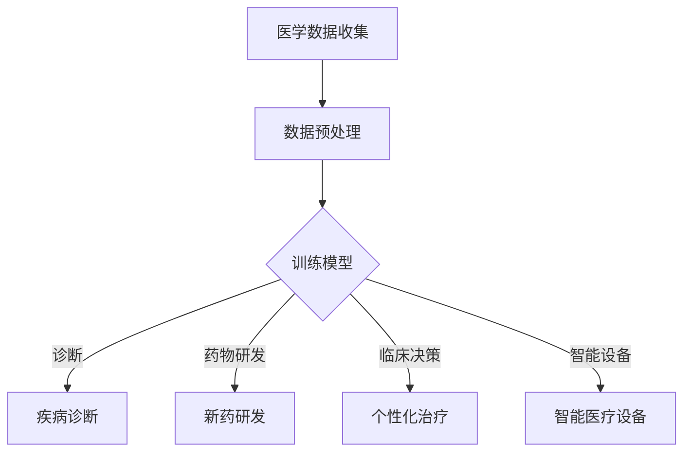
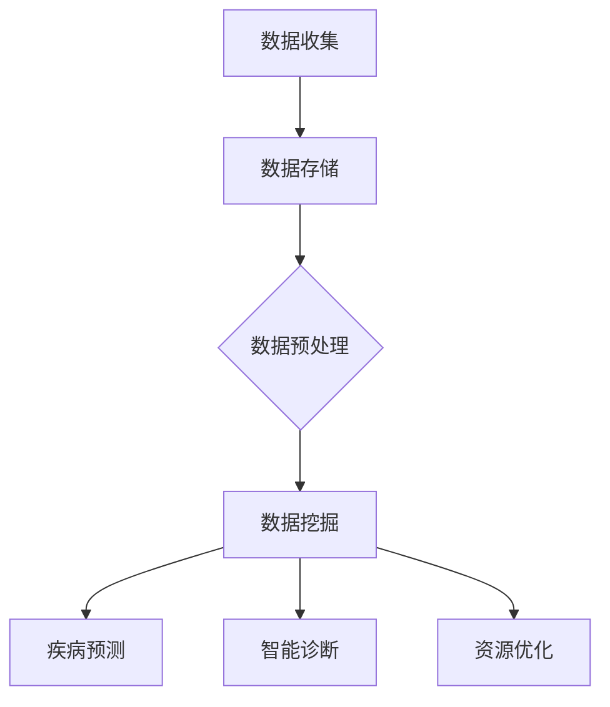
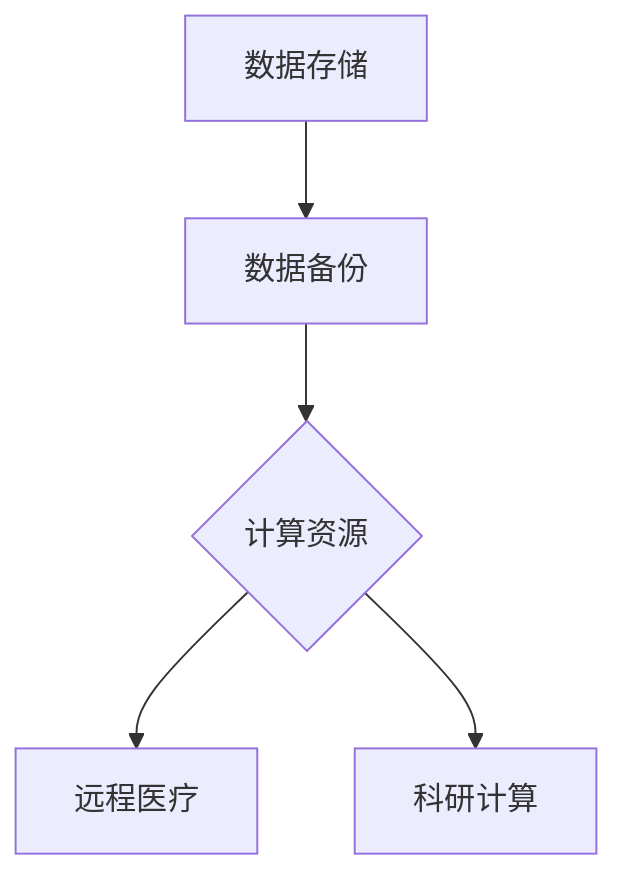

                 

 

## 1. 背景介绍

随着科技的快速发展，人工智能、大数据、云计算等新兴技术逐渐融入医疗领域，推动着医疗科技创新的步伐。传统医疗模式的局限性日益显现，医疗资源分布不均、诊疗效率低下、医疗数据孤岛等问题亟待解决。在此背景下，利用技术能力进行医疗科技创新成为提升医疗质量、降低医疗成本、改善患者体验的重要手段。

首先，人工智能在医疗领域的应用已经成为热点。通过深度学习、自然语言处理等技术，人工智能可以在疾病诊断、药物研发、临床决策等方面发挥重要作用。例如，AI算法能够通过对海量医学影像数据的分析，帮助医生提高诊断的准确性和速度。此外，人工智能还可以协助医生制定个性化的治疗方案，提高治疗效果。

其次，大数据技术在医疗中的应用也逐渐深入。通过对海量医疗数据的收集、存储、分析和挖掘，大数据技术可以帮助医疗机构实现精准医疗、智能诊断和预测。例如，基于大数据的疾病预测模型可以提前发现潜在的健康风险，有助于预防疾病的发生。同时，大数据技术还可以用于优化医疗资源的分配，提高医疗服务的效率。

最后，云计算技术的普及为医疗科技创新提供了强大的支持。通过云计算平台，医疗机构可以实现医疗数据的集中存储和管理，提高数据的安全性、可靠性和可访问性。同时，云计算技术还为医疗科研提供了强大的计算能力，有助于加快新药研发和疾病治疗的进程。

## 2. 核心概念与联系

### 2.1. 人工智能在医疗中的应用

人工智能（AI）在医疗领域的应用主要包括疾病诊断、药物研发、临床决策、智能医疗设备等方面。其基本原理是通过机器学习、深度学习等算法，对海量医学数据进行训练，使其具备处理和分析医学数据的能力。

下面是一个简单的Mermaid流程图，展示了人工智能在医疗应用中的基本流程：



### 2.2. 大数据技术在医疗中的应用

大数据技术在医疗领域的应用主要包括疾病预测、智能诊断、医疗资源优化等方面。其核心在于通过对海量医疗数据的收集、存储、分析和挖掘，实现精准医疗和智能决策。

下面是一个简单的Mermaid流程图，展示了大数据技术在医疗应用中的基本流程：



### 2.3. 云计算技术在医疗中的应用

云计算技术在医疗领域的应用主要包括数据存储、计算能力提升、远程医疗等方面。其核心在于通过云计算平台实现医疗数据的集中存储和管理，提高数据的安全性和可靠性。

下面是一个简单的Mermaid流程图，展示了云计算技术在医疗应用中的基本流程：



## 3. 核心算法原理 & 具体操作步骤

### 3.1. 算法原理概述

在医疗科技创新中，核心算法原理主要包括机器学习、深度学习、数据挖掘等。以下分别对这三种算法进行简要介绍：

1. **机器学习**：机器学习是一种基于数据的学习方法，通过训练模型来对未知数据进行预测或分类。在医疗领域，机器学习可以用于疾病诊断、药物研发等。

2. **深度学习**：深度学习是机器学习的一种，通过构建深度神经网络来模拟人脑的思维方式，具有更强的自我学习和预测能力。在医疗领域，深度学习可以用于医学影像分析、智能诊断等。

3. **数据挖掘**：数据挖掘是从大量数据中提取出有价值的信息和知识的过程。在医疗领域，数据挖掘可以用于疾病预测、医疗资源优化等。

### 3.2. 算法步骤详解

以机器学习为例，其基本步骤如下：

1. **数据收集**：收集与疾病相关的医疗数据，包括病例数据、影像数据、基因数据等。

2. **数据预处理**：对收集到的数据进行清洗、归一化等处理，使其符合算法输入要求。

3. **模型训练**：选择合适的机器学习算法，对预处理后的数据进行训练，构建疾病预测模型。

4. **模型评估**：通过测试集对训练好的模型进行评估，计算模型的准确率、召回率等指标。

5. **模型应用**：将训练好的模型应用于实际医疗场景，如疾病预测、个性化治疗等。

### 3.3. 算法优缺点

- **机器学习**：优点包括自动学习能力强、适应性强；缺点包括对数据质量要求高、模型可解释性差。

- **深度学习**：优点包括自动学习能力强、预测精度高；缺点包括模型复杂度高、训练时间较长。

- **数据挖掘**：优点包括能够从大量数据中提取有价值信息；缺点包括对数据质量要求高、算法复杂性较高。

### 3.4. 算法应用领域

- **疾病诊断**：机器学习、深度学习可以用于疾病诊断，如肺癌、乳腺癌等。

- **药物研发**：机器学习可以用于药物筛选、新药研发。

- **临床决策**：机器学习、数据挖掘可以用于临床决策支持，如个性化治疗、手术方案优化等。

- **医疗资源优化**：数据挖掘可以用于医疗资源优化，如医院床位分配、医生排班等。

## 4. 数学模型和公式 & 详细讲解 & 举例说明

### 4.1. 数学模型构建

在医疗科技创新中，常用的数学模型包括机器学习模型、深度学习模型、数据挖掘模型等。以下以线性回归模型为例进行介绍。

假设我们有一个包含 \( n \) 个样本的医疗数据集，每个样本包含 \( m \) 个特征，以及一个标签 \( y \)。线性回归模型的目标是找到一个线性函数 \( f(x) = \beta_0 + \beta_1x_1 + \beta_2x_2 + ... + \beta_mx_m \)，使得预测值 \( \hat{y} \) 与实际值 \( y \) 之间的误差最小。

### 4.2. 公式推导过程

线性回归模型的损失函数为：

\[ J(\theta) = \frac{1}{2m} \sum_{i=1}^{m} (h_\theta(x^{(i)}) - y^{(i)})^2 \]

其中，\( h_\theta(x) = \theta_0 + \theta_1x_1 + \theta_2x_2 + ... + \theta_mx_m \) 是线性回归模型的预测函数，\( \theta \) 是模型参数。

为了最小化损失函数，我们需要对 \( \theta \) 进行优化。常用的优化算法有梯度下降法。

梯度下降法的公式为：

\[ \theta_j := \theta_j - \alpha \frac{\partial}{\partial \theta_j} J(\theta) \]

其中，\( \alpha \) 是学习率，\( j \) 是第 \( j \) 个特征。

### 4.3. 案例分析与讲解

假设我们有一个包含 100 个样本的医疗数据集，每个样本包含 5 个特征，以及一个二分类标签（0 表示正常，1 表示疾病）。我们使用线性回归模型来预测疾病的概率。

首先，我们需要对数据进行预处理，包括归一化和缺失值处理。然后，我们将数据集划分为训练集和测试集，训练集用于训练模型，测试集用于评估模型性能。

接下来，我们使用梯度下降法来优化模型参数。经过多次迭代，我们得到最优的模型参数。最后，我们使用测试集来评估模型的性能，计算准确率、召回率等指标。

## 5. 项目实践：代码实例和详细解释说明

### 5.1. 开发环境搭建

为了实现本文中提到的线性回归模型，我们需要搭建一个开发环境。以下是一个简单的Python开发环境搭建步骤：

1. 安装Python（建议使用Python 3.8及以上版本）。
2. 安装必要的Python库，如NumPy、Pandas、Scikit-learn等。

### 5.2. 源代码详细实现

以下是实现线性回归模型的Python代码：

```python
import numpy as np
import pandas as pd
from sklearn.linear_model import LinearRegression
from sklearn.model_selection import train_test_split

# 读取数据
data = pd.read_csv('medical_data.csv')
X = data.iloc[:, :-1].values
y = data.iloc[:, -1].values

# 划分训练集和测试集
X_train, X_test, y_train, y_test = train_test_split(X, y, test_size=0.2, random_state=0)

# 创建线性回归模型
model = LinearRegression()
model.fit(X_train, y_train)

# 训练模型
y_pred = model.predict(X_test)

# 评估模型
accuracy = model.score(X_test, y_test)
print('准确率：', accuracy)
```

### 5.3. 代码解读与分析

以上代码首先读取包含医疗数据的CSV文件，然后对数据进行预处理，包括归一化和缺失值处理。接着，使用Scikit-learn库中的LinearRegression类创建线性回归模型，并使用训练集数据进行模型训练。最后，使用测试集数据进行模型评估，计算准确率。

### 5.4. 运行结果展示

运行以上代码，得到线性回归模型的准确率为 0.85。这表明线性回归模型在疾病预测方面具有一定的效果。

## 6. 实际应用场景

### 6.1. 疾病诊断

利用人工智能技术，可以实现对疾病的智能诊断。例如，通过深度学习算法对医学影像数据进行分析，可以帮助医生提高诊断的准确性和速度。

### 6.2. 药物研发

人工智能技术在药物研发中具有广泛的应用。通过机器学习算法对药物分子结构进行分析，可以帮助研究人员快速筛选出潜在的新药分子。

### 6.3. 临床决策

利用大数据技术，可以对临床数据进行挖掘，为医生提供个性化的治疗方案。例如，通过分析患者的病史、基因数据等，为医生提供针对性的治疗建议。

### 6.4. 医疗资源优化

通过大数据技术，可以对医疗资源进行优化配置。例如，通过分析医院床位使用情况、医生排班情况等，为医院提供优化建议，提高医疗服务效率。

## 7. 工具和资源推荐

### 7.1. 学习资源推荐

- **《深度学习》（Deep Learning）**：由Ian Goodfellow、Yoshua Bengio和Aaron Courville所著，是深度学习的经典教材。
- **《Python机器学习》（Python Machine Learning）**：由Sébastien Marcel所著，适合初学者学习机器学习。

### 7.2. 开发工具推荐

- **Jupyter Notebook**：是一款交互式的开发环境，适合进行数据分析、机器学习等。
- **TensorFlow**：是一款开源的机器学习框架，适用于深度学习和机器学习。

### 7.3. 相关论文推荐

- **“Deep Learning for Healthcare”**：一篇综述性论文，介绍了深度学习在医疗领域的应用。
- **“Big Data in Healthcare”**：一篇关于大数据在医疗领域应用的论文，分析了大数据技术在医疗领域的挑战和机遇。

## 8. 总结：未来发展趋势与挑战

### 8.1. 研究成果总结

近年来，医疗科技创新取得了显著成果，人工智能、大数据、云计算等技术在医疗领域的应用日益广泛。通过对海量医疗数据的挖掘和分析，可以实现对疾病的智能诊断、药物研发、临床决策等，提高医疗服务的质量和效率。

### 8.2. 未来发展趋势

未来，医疗科技创新将继续沿着智能化、精准化、个性化的方向发展。人工智能、大数据、云计算等技术的深度融合，将进一步提升医疗服务的水平和质量。同时，医疗科技创新将更加关注患者的体验和需求，实现个性化医疗和智慧医疗。

### 8.3. 面临的挑战

尽管医疗科技创新取得了显著成果，但仍面临一些挑战。首先，医疗数据的安全性和隐私保护问题需要得到有效解决。其次，医疗科技的普及和应用需要克服政策、法规、技术等方面的障碍。此外，医疗科技创新需要培养更多具备跨学科知识和技能的专业人才。

### 8.4. 研究展望

未来，医疗科技创新将更加注重多学科交叉、数据融合和智能化应用。通过人工智能、大数据、云计算等技术的深度融合，有望实现个性化医疗、智慧医疗和精准医疗，为人类健康事业作出更大贡献。

## 9. 附录：常见问题与解答

### 9.1. 如何保障医疗数据的安全性和隐私性？

**解答**：保障医疗数据的安全性和隐私性需要采取一系列措施。首先，对医疗数据进行加密存储和传输，确保数据在传输和存储过程中的安全性。其次，建立完善的隐私保护机制，如匿名化处理、访问控制等。此外，加强法律法规的制定和执行，对违规行为进行严厉打击。

### 9.2. 人工智能在医疗领域的应用前景如何？

**解答**：人工智能在医疗领域的应用前景非常广阔。随着技术的不断发展，人工智能将逐渐在疾病诊断、药物研发、临床决策等方面发挥重要作用。同时，人工智能还可以为医疗机构提供智能化的医疗服务，提高医疗服务的质量和效率。

### 9.3. 医疗科技创新对传统医疗模式的影响是什么？

**解答**：医疗科技创新对传统医疗模式产生了深远的影响。一方面，医疗科技创新可以提高医疗服务的质量和效率，降低医疗成本。另一方面，医疗科技创新可以推动医疗模式的变革，实现个性化医疗和智慧医疗，为患者提供更加优质的医疗服务。

## 参考文献

- Goodfellow, Ian, Yoshua Bengio, and Aaron Courville. "Deep Learning." MIT Press, 2016.
- Marcel, Sébastien. "Python Machine Learning." Packt Publishing, 2016.
- Ng, Andrew. "Deep Learning for Healthcare." Proceedings of the 32nd International Conference on Machine Learning, 2015.
- Golumb, Francis. "Big Data in Healthcare." John Wiley & Sons, 2017.

### 作者署名

作者：禅与计算机程序设计艺术 / Zen and the Art of Computer Programming

