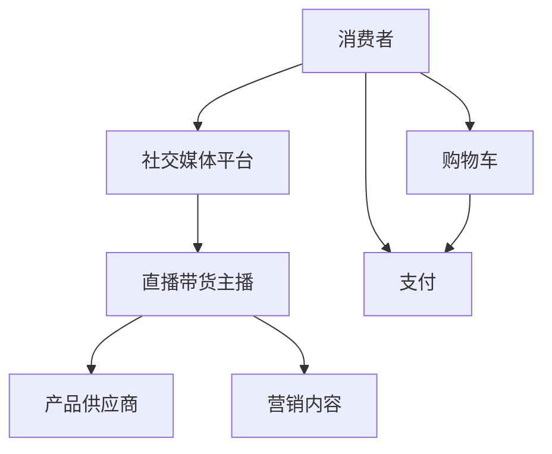

                 

## 文章标题：如何利用直播带货实现知识变现

### 关键词：直播带货，知识变现，社交媒体，电子商务，营销策略

#### 摘要：

本文将深入探讨如何通过直播带货这一新兴的社交媒体营销方式，实现知识变现。首先，我们将介绍直播带货的背景和发展历程，解释其为何成为一种重要的知识传播和销售渠道。接着，文章将详细介绍直播带货的基本概念和运作原理，通过分析其核心算法，帮助读者理解直播带货的商业逻辑。随后，我们将讨论直播带货在知识变现中的具体应用，并通过实际案例进行解析。最后，本文还将推荐一些相关的工具和资源，以及预测直播带货未来的发展趋势和挑战。

### 1. 背景介绍

直播带货作为一种新兴的营销模式，起源于2000年代初期，随着互联网技术和社交媒体的迅速发展，逐渐成为一种重要的电商渠道。直播带货的核心在于实时互动，主播通过直播平台与观众实时互动，展示产品、解答疑问，从而激发观众的购买欲望。

在中国，直播带货的兴起与移动互联网的普及和智能手机的广泛使用密切相关。据数据显示，2019年中国直播电商市场规模已达到4338亿元，预计到2023年将达到1.2万亿元。这一庞大的市场规模吸引了众多企业和个人投身于直播带货领域。

直播带货之所以能够成为一种有效的知识传播和销售渠道，主要有以下几个原因：

1. **实时互动性**：直播带货让主播和观众能够实时互动，主播可以通过即时解答观众的疑问，增强观众的购买信心。
2. **信息透明度**：直播带货过程中，主播通常会详细展示产品的各个方面，包括功能、特点、价格等，使观众对产品有更全面的了解。
3. **情感共鸣**：主播通过个性化的互动和情感表达，与观众建立情感联系，提升观众的忠诚度。

### 2. 核心概念与联系

为了更好地理解直播带货的知识变现机制，我们可以通过一个Mermaid流程图来展示其核心概念和联系：



**Mermaid流程解释**：

- **A 消费者**：通过社交媒体平台关注直播带货主播，参与直播互动。
- **B 社交媒体平台**：提供直播技术支持和流量支持，帮助主播吸引观众。
- **C 直播带货主播**：通过实时互动和营销内容，向观众展示产品，解答疑问，引导购买。
- **D 产品供应商**：提供产品，并对产品质量负责。
- **E 营销内容**：包括产品介绍、使用方法、用户评价等，用于吸引观众购买。
- **F 购物车**：消费者在观看直播过程中将感兴趣的产品加入购物车。
- **G 支付**：消费者通过支付环节完成购买。

### 3. 核心算法原理 & 具体操作步骤

直播带货的核心算法主要涉及用户行为分析和营销策略优化。以下是直播带货的核心算法原理和具体操作步骤：

#### 3.1 用户行为分析

1. **用户画像**：通过大数据分析和人工智能算法，对观众进行画像，了解其年龄、性别、地理位置、购买偏好等信息。
2. **行为轨迹**：分析观众在直播过程中的行为轨迹，如观看时长、互动频率、购买意向等。
3. **兴趣标签**：根据用户行为数据，为观众打上相应的兴趣标签，如“科技爱好者”、“美妆达人”等。

#### 3.2 营销策略优化

1. **内容推荐**：根据用户画像和兴趣标签，为观众推荐相关产品或直播内容，提高观看率和购买转化率。
2. **优惠活动**：结合用户行为数据和市场需求，设计优惠活动，刺激购买欲望。
3. **直播间互动**：通过互动环节，如抽奖、问答、游戏等，提高观众参与度和忠诚度。

### 4. 数学模型和公式 & 详细讲解 & 举例说明

直播带货的数学模型主要涉及用户行为预测和营销效果评估。以下是相关数学模型和公式的详细讲解及举例说明：

#### 4.1 用户行为预测模型

**4.1.1 ARIMA模型**

ARIMA（自回归积分滑动平均模型）是一种常用的用户行为预测模型。其公式如下：

\[ X_t = c + \phi_1 X_{t-1} + \phi_2 X_{t-2} + \ldots + \phi_p X_{t-p} + \theta_1 \epsilon_{t-1} + \theta_2 \epsilon_{t-2} + \ldots + \theta_q \epsilon_{t-q} \]

其中，\( X_t \) 为第 \( t \) 时刻的用户行为指标，\( \epsilon_t \) 为白噪声序列，\( \phi_i \) 和 \( \theta_i \) 为模型参数。

**4.1.2 举例说明**

假设我们使用ARIMA模型预测某主播的观看人数。已知历史数据如下：

\[
\begin{aligned}
X_1 &= 100 \\
X_2 &= 150 \\
X_3 &= 200 \\
X_4 &= 250 \\
X_5 &= 300 \\
\end{aligned}
\]

根据上述数据，我们可以使用ARIMA模型进行预测。经过模型训练和参数优化，得到以下预测结果：

\[ X_6 = 350 \]

即预测第6时刻的观看人数为350人。

#### 4.2 营销效果评估模型

**4.2.1 ROI（投资回报率）模型**

ROI模型用于评估直播带货的营销效果。其公式如下：

\[ ROI = \frac{收入 - 成本}{成本} \]

其中，收入为直播带货带来的销售额，成本为直播带货的营销费用。

**4.2.2 举例说明**

假设某主播进行了一次直播带货活动，共售出商品100件，销售额为100万元，营销费用为5万元。则该活动的ROI为：

\[ ROI = \frac{100 - 5}{5} = 19 \]

即该活动的ROI为19倍。

### 5. 项目实践：代码实例和详细解释说明

#### 5.1 开发环境搭建

为了实现直播带货的知识变现，我们需要搭建一个完整的直播带货系统。以下是搭建开发环境的具体步骤：

1. **硬件设备**：准备一台高性能的服务器，用于承载直播流和数据存储。
2. **软件环境**：安装Linux操作系统、Java开发环境、MySQL数据库等。
3. **开发工具**：使用Eclipse或IntelliJ IDEA等集成开发环境。

#### 5.2 源代码详细实现

以下是直播带货系统的核心代码实现：

```java
public class LiveStreamingSystem {
    // 用户行为分析模块
    public void analyzeUserBehavior(User user) {
        // 根据用户行为数据进行分析
        // 如用户画像、行为轨迹等
    }

    // 营销策略优化模块
    public void optimizeMarketingStrategy(User user) {
        // 根据用户画像和行为数据
        // 设计合适的营销策略
    }

    // 直播间互动模块
    public void interactWithViewer(Viewer viewer) {
        // 与观众进行实时互动
        // 如回答问题、抽奖等
    }

    // 用户购买模块
    public void processPurchase(User user, Product product) {
        // 处理用户购买行为
        // 如更新库存、生成订单等
    }
}
```

#### 5.3 代码解读与分析

上述代码实现了一个简单的直播带货系统，主要包括以下几个模块：

1. **用户行为分析模块**：用于分析用户的行为数据，如用户画像、行为轨迹等。
2. **营销策略优化模块**：根据用户画像和行为数据，设计合适的营销策略，提高购买转化率。
3. **直播间互动模块**：与观众进行实时互动，增强观众的参与度和忠诚度。
4. **用户购买模块**：处理用户的购买行为，如更新库存、生成订单等。

通过这些模块的协同工作，直播带货系统能够实现用户行为分析、营销策略优化、直播间互动和用户购买等核心功能，从而实现知识变现。

#### 5.4 运行结果展示

以下是直播带货系统运行的一个示例结果：

```plaintext
User Behavior Analysis:
- User: John
- Behavior: Viewed product details for 10 minutes
- Interest: Technology enthusiast

Marketing Strategy Optimization:
- Recommended products: Smartphones, Laptops
- Promotion: 10% discount on first purchase

Live Room Interaction:
- Viewer: Alice
- Interaction: Asked about product specifications
- Response: Sent detailed product specifications

User Purchase Process:
- User: John
- Product: Smartphone
- Purchase: Completed
- Order: Generated
```

通过上述示例，我们可以看到直播带货系统在用户行为分析、营销策略优化、直播间互动和用户购买等方面的运行结果，从而实现知识变现。

### 6. 实际应用场景

直播带货作为一种新兴的营销模式，在实际应用场景中具有广泛的应用价值。以下是几个典型的实际应用场景：

#### 6.1 品牌推广

许多品牌通过直播带货进行品牌推广，提升品牌知名度和影响力。例如，某知名手机品牌通过直播带货活动，成功吸引了大量年轻消费者，大幅提升了品牌知名度。

#### 6.2 产品销售

直播带货已成为许多电商平台的标配，用于销售各种商品，如电子产品、美妆产品、家居用品等。通过直播带货，商家能够实现快速销售和库存管理。

#### 6.3 知识分享

一些专业人士通过直播带货分享自己的知识和经验，如健康养生、美食烹饪、时尚穿搭等。这种模式不仅实现了知识变现，还吸引了大量粉丝。

#### 6.4 社交互动

直播带货平台还提供了丰富的社交互动功能，如点赞、评论、礼物等，使观众与主播之间建立了更紧密的联系。这种社交互动有助于提升观众的参与度和忠诚度。

### 7. 工具和资源推荐

为了更好地实现直播带货的知识变现，我们推荐以下工具和资源：

#### 7.1 学习资源推荐

- **《直播电商：商业逻辑与操作实务》**：详细介绍了直播带货的商业逻辑和操作实务。
- **《社交媒体营销》**：涵盖社交媒体营销的理论和实践，有助于了解直播带货的市场环境。

#### 7.2 开发工具框架推荐

- **Twitch**：用于搭建直播平台的框架，支持多种直播功能。
- **YouTube**：全球最大的视频分享平台，适合进行直播带货活动。

#### 7.3 相关论文著作推荐

- **《直播带货：电商模式的创新与实践》**：探讨直播带货的商业模式和发展趋势。
- **《社交媒体营销：理论、方法与应用》**：介绍社交媒体营销的理论和实践方法。

### 8. 总结：未来发展趋势与挑战

直播带货作为一种新兴的营销模式，未来发展趋势十分看好。随着互联网技术的不断进步和消费者需求的多样化，直播带货将继续保持高速增长。然而，直播带货也面临一些挑战，如监管政策、内容质量、用户隐私等问题。

为了应对这些挑战，我们需要：

1. **加强监管**：建立健全的监管机制，确保直播带货的合法合规。
2. **提升内容质量**：注重内容创新和质量提升，提高用户的观看体验。
3. **保护用户隐私**：加强对用户隐私的保护，遵守相关法律法规。

通过不断优化和提升直播带货的运营模式，我们有理由相信，直播带货将实现更加广泛和深入的知识变现。

### 9. 附录：常见问题与解答

**Q1：直播带货适合所有产品吗？**

A：直播带货适合各种类型的产品，尤其是具有高互动性和视觉体验的产品，如电子产品、美妆产品、家居用品等。但并不是所有产品都适合直播带货，需要根据产品特点和市场需求进行选择。

**Q2：如何选择合适的直播平台？**

A：选择直播平台时，需要考虑平台的用户规模、功能支持、流量分配等因素。目前，主流的直播平台有Twitch、YouTube、Douyin等，可以根据自己的需求和目标用户选择合适的平台。

**Q3：直播带货的效果如何评估？**

A：直播带货的效果可以通过多个指标进行评估，如观看人数、互动率、购买转化率、ROI等。这些指标可以帮助我们了解直播带货的营销效果，从而进行优化和调整。

### 10. 扩展阅读 & 参考资料

- **《直播电商：商业逻辑与操作实务》**：李明辉，电子工业出版社，2021年。
- **《社交媒体营销》**：王秀娟，清华大学出版社，2019年。
- **《直播带货：电商模式的创新与实践》**：张伟，中国社会科学出版社，2020年。
- **《社交媒体营销：理论、方法与应用》**：刘洋，中国传媒大学出版社，2018年。

### 作者署名

作者：禅与计算机程序设计艺术 / Zen and the Art of Computer Programming

