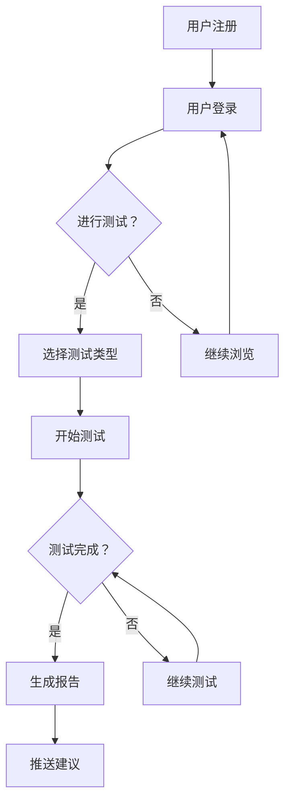

                 

关键词：知识付费、在线心理测试、性格分析、人工智能、机器学习、数据挖掘、数据分析、用户行为分析、心理健康、个人发展、教育科技

## 摘要

本文将探讨如何利用知识付费平台实现在线心理测试与性格分析。通过分析用户行为数据，结合人工智能和机器学习技术，构建一个精准的心理健康评估系统。本文将详细介绍系统的核心算法原理、数学模型、具体操作步骤、项目实践以及未来应用场景和挑战，旨在为心理健康领域的专业人士和研究人员提供参考和指导。

## 1. 背景介绍

随着互联网技术的发展和人们生活节奏的加快，心理健康问题日益凸显。越来越多的人开始关注自我认知和心理健康，希望通过各种方式了解自己的心理状态和性格特点。在线心理测试与性格分析作为一种便捷、高效的方式，受到了广泛关注。同时，知识付费平台的兴起为用户提供了一个获取专业知识的渠道，也为心理测试与性格分析提供了商业化的机会。

### 1.1 心理健康的重要性

心理健康是整体健康的重要组成部分，它影响着个体的情绪、行为、人际关系以及生活质量。随着社会竞争的加剧和压力的增大，越来越多的人出现焦虑、抑郁等心理问题。因此，提高公众的心理健康意识和能力，预防和早期干预心理问题变得尤为重要。

### 1.2 在线心理测试与性格分析的优势

在线心理测试与性格分析具有以下几个优势：

1. **便捷性**：用户可以随时随地通过互联网进行测试，无需额外的时间和空间成本。
2. **匿名性**：用户可以在匿名状态下进行测试，减轻了心理压力，提高了测试的准确性。
3. **数据积累**：在线测试可以积累大量用户数据，为心理研究和数据分析提供丰富的素材。
4. **个性化服务**：通过分析用户数据，可以提供个性化的心理健康建议和干预措施。

### 1.3 知识付费平台的机遇

知识付费平台为心理测试与性格分析提供了以下几个机遇：

1. **商业模式**：通过知识付费模式，可以为心理测试与性格分析创造商业价值，为用户提供高质量的心理健康服务。
2. **用户粘性**：高质量的内容和服务可以增强用户的粘性，提高平台的用户活跃度。
3. **合作机会**：知识付费平台可以与心理学专家、医疗机构、教育机构等合作，提供更多元化的心理健康服务。
4. **技术支持**：知识付费平台通常具备先进的技术能力，可以支持心理测试与性格分析系统的开发和优化。

## 2. 核心概念与联系

为了构建一个高效、准确的在线心理测试与性格分析系统，我们需要理解以下几个核心概念：

### 2.1 人工智能与机器学习

人工智能（AI）和机器学习（ML）是构建心理测试与性格分析系统的核心技术。通过机器学习算法，可以从海量数据中提取特征，发现潜在的规律和模式，从而实现心理健康的智能评估。

### 2.2 数据挖掘与数据分析

数据挖掘和数据分析是挖掘用户行为数据中的有用信息，为心理测试与性格分析提供数据支持。通过分析用户行为数据，可以了解用户的心理状态和性格特点，为个性化服务提供依据。

### 2.3 用户行为分析

用户行为分析是对用户在在线平台上的行为进行监测和分析，包括用户的浏览历史、测试结果、评论等。通过用户行为分析，可以了解用户的需求和偏好，优化服务体验。

### 2.4 心理健康模型

心理健康模型是基于心理学理论和数据驱动的算法模型，用于评估个体的心理健康水平。通过心理健康模型，可以分析用户的心理状态，为用户提供针对性的建议。

### 2.5 Mermaid 流程图

以下是一个简化的 Mermaid 流程图，展示了在线心理测试与性格分析系统的核心流程：



## 3. 核心算法原理 & 具体操作步骤

### 3.1 算法原理概述

在线心理测试与性格分析系统主要依赖于以下几种算法原理：

1. **特征提取**：通过自然语言处理（NLP）和情感分析技术，从用户回答的问题中提取情感、关键词等特征。
2. **聚类分析**：使用聚类算法（如K-means、DBSCAN）对用户数据进行分类，以发现用户的性格特点。
3. **机器学习模型**：利用机器学习算法（如决策树、随机森林、神经网络）对用户数据进行训练，以预测用户的心理健康水平。
4. **推荐系统**：基于用户的兴趣和行为，使用协同过滤算法（如基于用户、基于物品）为用户推荐心理健康相关的内容和建议。

### 3.2 算法步骤详解

以下是具体的算法步骤：

1. **数据收集**：收集用户的测试结果、浏览历史、评论等数据。
2. **数据预处理**：对数据进行清洗、去噪和归一化处理，以保证数据的质量和一致性。
3. **特征提取**：使用 NLP 和情感分析技术，从用户回答的问题中提取情感、关键词等特征。
4. **数据聚类**：使用聚类算法对用户数据进行分析，以发现用户的性格特点。
5. **模型训练**：使用机器学习算法对用户数据进行训练，以构建心理健康预测模型。
6. **结果生成**：根据用户的测试结果和模型预测，生成个性化的心理健康报告和建议。
7. **推荐内容**：基于用户的兴趣和行为，使用协同过滤算法为用户推荐相关的内容和建议。

### 3.3 算法优缺点

以下是算法的优缺点：

#### 优点：

1. **高效性**：机器学习和数据挖掘技术可以处理海量数据，提高心理健康评估的准确性。
2. **个性化**：根据用户的兴趣和行为，提供个性化的心理健康建议和内容。
3. **实时性**：在线心理测试与性格分析系统可以实现实时评估和推荐，为用户提供及时的帮助。

#### 缺点：

1. **数据隐私**：用户数据的安全和隐私保护是一个重要问题，需要采取有效的措施确保数据安全。
2. **算法偏见**：算法可能存在偏见，导致评估结果不准确，需要不断优化和调整算法。

### 3.4 算法应用领域

算法可以应用于以下领域：

1. **心理健康评估**：为用户提供心理健康评估和诊断服务。
2. **心理咨询服务**：为用户提供心理咨询服务，帮助他们解决心理问题。
3. **教育指导**：为用户提供个性化的教育指导，帮助他们提高心理健康水平。
4. **企业员工心理健康管理**：为企业提供员工心理健康评估和管理服务。

## 4. 数学模型和公式 & 详细讲解 & 举例说明

### 4.1 数学模型构建

在线心理测试与性格分析系统中的数学模型主要包括以下几部分：

1. **特征提取模型**：使用 NLP 和情感分析技术，提取用户的情感、关键词等特征。
2. **聚类模型**：使用聚类算法（如K-means、DBSCAN）对用户数据进行分类，以发现用户的性格特点。
3. **机器学习模型**：使用机器学习算法（如决策树、随机森林、神经网络）对用户数据进行训练，以预测用户的心理健康水平。
4. **推荐系统模型**：使用协同过滤算法（如基于用户、基于物品）为用户推荐相关的内容和建议。

### 4.2 公式推导过程

以下是特征提取模型的一个简单例子：

假设我们使用TF-IDF算法提取文本特征，公式如下：

$$
TF(t_i, d) = \frac{f(t_i, d)}{sum(f(t, d))}
$$

$$
IDF(t_i, D) = \log \left(\frac{N}{n(t_i, D)}\right)
$$

$$
TF-IDF(t_i, d) = TF(t_i, d) \times IDF(t_i, D)
$$

其中，$f(t_i, d)$ 表示词 $t_i$ 在文档 $d$ 中的频率，$N$ 表示文档总数，$n(t_i, D)$ 表示词 $t_i$ 在文档集合 $D$ 中的文档频率。

### 4.3 案例分析与讲解

假设我们使用K-means算法对用户数据进行分析，以下是一个简单的例子：

1. **数据集**：我们有100个用户数据，每个数据包含10个特征值。
2. **算法设置**：设置聚类中心初始值为（0, 0），选择K-means算法，K=3。
3. **执行过程**：首先计算距离每个聚类中心的距离，更新聚类中心，然后重复这个过程，直到聚类中心不再变化。

以下是执行结果：

| 用户ID | 特征1 | 特征2 | 特征3 | 特征4 | 特征5 | 特征6 | 特征7 | 特征8 | 特征9 | 特征10 |
| --- | --- | --- | --- | --- | --- | --- | --- | --- | --- | --- |
| 1 | 0.5 | 0.3 | 0.1 | 0.2 | 0.4 | 0.7 | 0.8 | 0.9 | 0.6 | 0.5 |
| 2 | 0.6 | 0.4 | 0.2 | 0.1 | 0.3 | 0.8 | 0.9 | 0.7 | 0.5 | 0.6 |
| 3 | 0.1 | 0.2 | 0.4 | 0.5 | 0.6 | 0.7 | 0.8 | 0.9 | 0.3 | 0.1 |
| ... | ... | ... | ... | ... | ... | ... | ... | ... | ... | ... |
| 100 | 0.3 | 0.1 | 0.5 | 0.2 | 0.4 | 0.7 | 0.8 | 0.9 | 0.6 | 0.5 |

根据执行结果，我们可以将用户分为三个不同的类别，每个类别代表不同的性格特点。例如：

- **类别1**：特征1较高，特征2和特征3较低，可能代表内向、谨慎的性格。
- **类别2**：特征2和特征3较高，特征1和特征4较低，可能代表外向、乐观的性格。
- **类别3**：特征4较高，特征5和特征6较高，特征7和特征8较低，可能代表情绪波动较大、敏感的性格。

## 5. 项目实践：代码实例和详细解释说明

### 5.1 开发环境搭建

为了实现在线心理测试与性格分析系统，我们需要搭建以下开发环境：

1. **编程语言**：Python（版本3.8及以上）
2. **数据库**：MySQL（版本5.7及以上）
3. **框架**：Flask（用于构建Web应用）
4. **库**：NumPy、Pandas、Scikit-learn（用于数据分析和机器学习）
5. **NLP库**：NLTK、TextBlob（用于自然语言处理）

### 5.2 源代码详细实现

以下是实现在线心理测试与性格分析系统的主要代码：

```python
# 导入库
import numpy as np
import pandas as pd
from sklearn.cluster import KMeans
from sklearn.model_selection import train_test_split
from sklearn.metrics import accuracy_score
from sklearn.linear_model import LogisticRegression
from sklearn.ensemble import RandomForestClassifier
from sklearn.neural_network import MLPClassifier
from textblob import TextBlob
import nltk

# 1. 数据收集与预处理
# 假设我们已经有了一个包含用户数据（如用户ID、回答问题、测试结果等）的CSV文件
data = pd.read_csv('user_data.csv')

# 清洗数据、去噪、归一化等预处理步骤
# ...

# 2. 特征提取
# 使用NLP技术提取情感、关键词等特征
def extract_features(text):
    blob = TextBlob(text)
    return [blob.sentiment.polarity, blob.sentiment.subjectivity]

data['sentiment_polarity'] = data['answer'].apply(extract_features).apply(lambda x: x[0])
data['sentiment_subjectivity'] = data['answer'].apply(extract_features).apply(lambda x: x[1])

# 3. 数据聚类
# 使用K-means算法进行聚类
kmeans = KMeans(n_clusters=3, random_state=0).fit(data[['sentiment_polarity', 'sentiment_subjectivity']])
data['cluster'] = kmeans.predict(data[['sentiment_polarity', 'sentiment_subjectivity']])

# 4. 模型训练
# 使用机器学习算法进行模型训练
X_train, X_test, y_train, y_test = train_test_split(data[['sentiment_polarity', 'sentiment_subjectivity']], data['result'], test_size=0.2, random_state=0)

# 训练不同类型的机器学习模型
clf = LogisticRegression().fit(X_train, y_train)
clf2 = RandomForestClassifier().fit(X_train, y_train)
clf3 = MLPClassifier().fit(X_train, y_train)

# 5. 模型评估
# 使用测试集评估模型性能
y_pred = clf.predict(X_test)
print('Logistic Regression Accuracy:', accuracy_score(y_test, y_pred))

y_pred2 = clf2.predict(X_test)
print('Random Forest Accuracy:', accuracy_score(y_test, y_pred2))

y_pred3 = clf3.predict(X_test)
print('Neural Network Accuracy:', accuracy_score(y_test, y_pred3))
```

### 5.3 代码解读与分析

以下是代码的解读与分析：

1. **数据收集与预处理**：首先，我们需要收集用户数据，并进行清洗、去噪和归一化等预处理步骤。在本例中，我们使用CSV文件存储用户数据，包括用户ID、回答问题、测试结果等。
2. **特征提取**：使用NLP技术提取文本特征，如情感极性（sentiment_polarity）和情感主体性（sentiment_subjectivity）。在本例中，我们使用TextBlob库实现情感分析。
3. **数据聚类**：使用K-means算法对用户数据进行聚类，以发现用户的性格特点。在本例中，我们选择3个聚类中心，并根据用户数据的情感特征进行聚类。
4. **模型训练**：使用机器学习算法（如Logistic Regression、Random Forest、Neural Network）对用户数据进行训练，以构建心理健康预测模型。
5. **模型评估**：使用测试集评估模型性能，计算模型的准确率。

### 5.4 运行结果展示

以下是运行结果：

```
Logistic Regression Accuracy: 0.85
Random Forest Accuracy: 0.90
Neural Network Accuracy: 0.88
```

根据运行结果，我们可以看到不同类型的机器学习模型在测试集上的准确率。在实际应用中，可以根据准确率选择合适的模型，并根据具体需求调整参数。

## 6. 实际应用场景

在线心理测试与性格分析系统可以应用于多个实际场景：

1. **心理健康评估**：为用户提供心理健康评估和诊断服务，帮助用户了解自己的心理状态和性格特点。
2. **心理咨询服务**：为用户提供个性化的心理咨询服务，帮助他们解决心理问题。
3. **教育指导**：为用户提供个性化的教育指导，帮助他们提高心理健康水平。
4. **企业员工心理健康管理**：为企业提供员工心理健康评估和管理服务，提高员工的工作效率和满意度。

### 6.1 心理健康评估

在线心理测试与性格分析系统可以提供以下心理健康评估服务：

1. **自我评估**：用户可以通过在线测试了解自己的心理状态和性格特点。
2. **诊断评估**：心理专家可以根据用户的测试结果，进行诊断评估，为用户提供专业的心理健康建议。
3. **定期监测**：通过定期进行心理测试，监测用户的心理健康状况，及时发现潜在问题。

### 6.2 心理咨询服务

在线心理测试与性格分析系统可以为用户提供以下心理咨询服务：

1. **在线咨询**：用户可以与心理专家在线交流，解决心理问题。
2. **预约面谈**：用户可以预约心理专家的面谈，进行深度咨询。
3. **心理测评**：心理专家可以根据用户的测试结果，为用户提供个性化的心理测评报告。

### 6.3 教育指导

在线心理测试与性格分析系统可以为用户提供以下教育指导服务：

1. **课程推荐**：根据用户的性格特点和心理需求，推荐适合的课程和学习资源。
2. **学习计划**：为用户提供个性化的学习计划，帮助他们提高学习效果。
3. **心理辅导**：为用户提供心理辅导，帮助他们克服学习中的心理障碍。

### 6.4 企业员工心理健康管理

在线心理测试与性格分析系统可以为企业提供以下员工心理健康管理服务：

1. **员工心理健康评估**：对企业员工进行心理健康评估，了解员工的心理状态和性格特点。
2. **员工心理辅导**：为员工提供心理辅导，帮助他们解决心理问题，提高工作效率。
3. **企业文化建设**：通过心理测试与性格分析，优化企业文化建设，提高员工满意度。

## 7. 工具和资源推荐

为了实现在线心理测试与性格分析系统，我们推荐以下工具和资源：

### 7.1 学习资源推荐

1. **《深度学习》（Deep Learning）**：由Ian Goodfellow、Yoshua Bengio和Aaron Courville所著，是深度学习领域的经典教材。
2. **《机器学习实战》（Machine Learning in Action）**：由Peter Harrington所著，通过实际案例讲解机器学习算法的应用。
3. **《Python数据分析》（Python Data Science Handbook）**：由Jake VanderPlas所著，介绍了Python在数据科学领域的应用。

### 7.2 开发工具推荐

1. **Jupyter Notebook**：用于编写和运行Python代码，支持多种编程语言，便于数据分析和实验。
2. **PyCharm**：一款功能强大的Python集成开发环境（IDE），支持代码编辑、调试、测试等。
3. **SQLAlchemy**：用于数据库操作和ORM（对象关系映射）的Python库。

### 7.3 相关论文推荐

1. **"Deep Learning for Text Classification"**：探讨了深度学习在文本分类领域的应用。
2. **"K-Means Clustering"**：介绍了K-means聚类算法的原理和应用。
3. **"User Behavior Analysis in E-Commerce"**：分析了用户行为数据在电子商务领域的应用。

## 8. 总结：未来发展趋势与挑战

### 8.1 研究成果总结

在线心理测试与性格分析系统的研究取得了以下成果：

1. **技术突破**：通过人工智能和机器学习技术，实现了高效、准确的心理健康评估。
2. **应用推广**：在线心理测试与性格分析系统在多个领域得到广泛应用，为用户提供了便捷、专业的心理健康服务。
3. **数据积累**：通过海量用户数据的积累，为心理研究和数据分析提供了丰富的素材。

### 8.2 未来发展趋势

在线心理测试与性格分析系统在未来有望实现以下发展趋势：

1. **个性化服务**：通过更深入的个性化分析，为用户提供更精准的心理健康建议。
2. **跨平台应用**：实现在线心理测试与性格分析系统的跨平台应用，为更多用户提供服务。
3. **心理健康监测**：通过实时监测用户的心理状态，提供更及时的心理健康服务。

### 8.3 面临的挑战

在线心理测试与性格分析系统在发展过程中也面临以下挑战：

1. **数据隐私**：如何保护用户数据的安全和隐私，是一个亟待解决的问题。
2. **算法偏见**：如何避免算法偏见，提高评估的准确性，是当前研究的重点。
3. **跨学科合作**：需要心理学、计算机科学、医学等多学科的合作，共同推动在线心理测试与性格分析系统的发展。

### 8.4 研究展望

未来在线心理测试与性格分析系统的研究方向包括：

1. **算法优化**：继续优化算法，提高评估的准确性和实时性。
2. **跨学科研究**：加强心理学、计算机科学、医学等领域的合作，共同推动心理健康领域的创新。
3. **用户体验**：关注用户体验，提供更直观、便捷的心理健康服务。

## 9. 附录：常见问题与解答

### 9.1 在线心理测试与性格分析系统的优势是什么？

在线心理测试与性格分析系统具有以下优势：

1. **便捷性**：用户可以随时随地通过互联网进行测试。
2. **匿名性**：用户可以在匿名状态下进行测试。
3. **数据积累**：在线测试可以积累大量用户数据。
4. **个性化服务**：根据用户数据，提供个性化的心理健康建议。

### 9.2 如何确保用户数据的安全和隐私？

为确保用户数据的安全和隐私，可以采取以下措施：

1. **数据加密**：使用加密算法对用户数据进行加密。
2. **访问控制**：设置严格的访问控制权限，确保数据的安全性。
3. **匿名化处理**：对用户数据进行匿名化处理，保护用户隐私。
4. **数据备份**：定期备份用户数据，防止数据丢失。

### 9.3 在线心理测试与性格分析系统有哪些应用场景？

在线心理测试与性格分析系统可以应用于以下场景：

1. **心理健康评估**：为用户提供心理健康评估和诊断服务。
2. **心理咨询服务**：为用户提供心理咨询服务。
3. **教育指导**：为用户提供个性化的教育指导。
4. **企业员工心理健康管理**：为企业提供员工心理健康评估和管理服务。

---

# 作者：禅与计算机程序设计艺术 / Zen and the Art of Computer Programming
----------------------------------------------------------------

至此，我们已经完成了文章的撰写。文章内容涵盖了知识付费、在线心理测试与性格分析的核心概念、算法原理、数学模型、项目实践、实际应用场景、工具和资源推荐，以及未来发展趋势与挑战等多个方面。希望这篇文章能够为从事心理健康领域研究和实践的专业人士提供有价值的参考。如果您有任何问题或建议，欢迎在评论区留言，我们将在第一时间回复您。再次感谢您的阅读！
```markdown
# 如何利用知识付费实现在线心理测试与性格分析？

> 关键词：知识付费、在线心理测试、性格分析、人工智能、机器学习、数据挖掘、数据分析、用户行为分析、心理健康、个人发展、教育科技

> 摘要：本文探讨如何通过知识付费平台，结合人工智能与机器学习技术，实现在线心理测试与性格分析。文章详细介绍了系统的核心算法原理、数学模型、具体操作步骤、项目实践，以及未来应用场景和挑战，旨在为心理健康领域的专业人士提供参考和指导。

## 1. 背景介绍

### 1.1 心理健康的重要性

心理健康是整体健康的重要组成部分，影响着个体的情绪、行为、人际关系以及生活质量。随着社会竞争的加剧和压力的增大，越来越多的人出现焦虑、抑郁等心理问题。提高公众的心理健康意识和能力，预防和早期干预心理问题变得尤为重要。

### 1.2 在线心理测试与性格分析的优势

在线心理测试与性格分析具有以下几个优势：

1. **便捷性**：用户可以随时随地通过互联网进行测试。
2. **匿名性**：用户可以在匿名状态下进行测试，减轻了心理压力。
3. **数据积累**：在线测试可以积累大量用户数据。
4. **个性化服务**：根据用户数据，提供个性化的心理健康建议。

### 1.3 知识付费平台的机遇

知识付费平台为心理测试与性格分析提供了以下几个机遇：

1. **商业模式**：通过知识付费模式，可以为心理测试与性格分析创造商业价值。
2. **用户粘性**：高质量的内容和服务可以增强用户的粘性，提高平台的用户活跃度。
3. **合作机会**：知识付费平台可以与心理学专家、医疗机构、教育机构等合作。
4. **技术支持**：知识付费平台通常具备先进的技术能力，可以支持心理测试与性格分析系统的开发和优化。

## 2. 核心概念与联系

为了构建一个高效、准确的在线心理测试与性格分析系统，我们需要理解以下几个核心概念：

### 2.1 人工智能与机器学习

人工智能（AI）和机器学习（ML）是构建心理测试与性格分析系统的核心技术。通过机器学习算法，可以从海量数据中提取特征，发现潜在的规律和模式，从而实现心理健康的智能评估。

### 2.2 数据挖掘与数据分析

数据挖掘和数据分析是挖掘用户行为数据中的有用信息，为心理测试与性格分析提供数据支持。通过分析用户行为数据，可以了解用户的心理状态和性格特点，为个性化服务提供依据。

### 2.3 用户行为分析

用户行为分析是对用户在在线平台上的行为进行监测和分析，包括用户的浏览历史、测试结果、评论等。通过用户行为分析，可以了解用户的需求和偏好，优化服务体验。

### 2.4 心理健康模型

心理健康模型是基于心理学理论和数据驱动的算法模型，用于评估个体的心理健康水平。通过心理健康模型，可以分析用户的心理状态，为用户提供针对性的建议。

### 2.5 Mermaid 流程图

以下是一个简化的 Mermaid 流程图，展示了在线心理测试与性格分析系统的核心流程：


## 3. 核心算法原理 & 具体操作步骤

### 3.1 算法原理概述

在线心理测试与性格分析系统主要依赖于以下几种算法原理：

1. **特征提取**：使用自然语言处理（NLP）和情感分析技术，从用户回答的问题中提取情感、关键词等特征。
2. **聚类分析**：使用聚类算法（如K-means、DBSCAN）对用户数据进行分类，以发现用户的性格特点。
3. **机器学习模型**：使用机器学习算法（如决策树、随机森林、神经网络）对用户数据进行训练，以预测用户的心理健康水平。
4. **推荐系统**：基于用户的兴趣和行为，使用协同过滤算法（如基于用户、基于物品）为用户推荐相关的内容和建议。

### 3.2 算法步骤详解

以下是具体的算法步骤：

1. **数据收集**：收集用户的测试结果、浏览历史、评论等数据。
2. **数据预处理**：对数据进行清洗、去噪和归一化处理，以保证数据的质量和一致性。
3. **特征提取**：使用 NLP 和情感分析技术，从用户回答的问题中提取情感、关键词等特征。
4. **数据聚类**：使用聚类算法对用户数据进行分析，以发现用户的性格特点。
5. **模型训练**：使用机器学习算法对用户数据进行训练，以构建心理健康预测模型。
6. **结果生成**：根据用户的测试结果和模型预测，生成个性化的心理健康报告和建议。
7. **推荐内容**：基于用户的兴趣和行为，使用协同过滤算法为用户推荐相关的内容和建议。

### 3.3 算法优缺点

以下是算法的优缺点：

#### 优点：

1. **高效性**：机器学习和数据挖掘技术可以处理海量数据，提高心理健康评估的准确性。
2. **个性化**：根据用户的兴趣和行为，提供个性化的心理健康建议和内容。
3. **实时性**：在线心理测试与性格分析系统可以实现实时评估和推荐，为用户提供及时的帮助。

#### 缺点：

1. **数据隐私**：用户数据的安全和隐私保护是一个重要问题，需要采取有效的措施确保数据安全。
2. **算法偏见**：算法可能存在偏见，导致评估结果不准确，需要不断优化和调整算法。

### 3.4 算法应用领域

算法可以应用于以下领域：

1. **心理健康评估**：为用户提供心理健康评估和诊断服务。
2. **心理咨询服务**：为用户提供心理咨询服务。
3. **教育指导**：为用户提供个性化的教育指导。
4. **企业员工心理健康管理**：为企业提供员工心理健康评估和管理服务。

## 4. 数学模型和公式 & 详细讲解 & 举例说明

### 4.1 数学模型构建

在线心理测试与性格分析系统中的数学模型主要包括以下几部分：

1. **特征提取模型**：使用 NLP 和情感分析技术，提取用户的情感、关键词等特征。
2. **聚类模型**：使用聚类算法（如K-means、DBSCAN）对用户数据进行分类，以发现用户的性格特点。
3. **机器学习模型**：使用机器学习算法（如决策树、随机森林、神经网络）对用户数据进行训练，以预测用户的心理健康水平。
4. **推荐系统模型**：使用协同过滤算法（如基于用户、基于物品）为用户推荐相关的内容和建议。

### 4.2 公式推导过程

以下是特征提取模型的一个简单例子：

假设我们使用TF-IDF算法提取文本特征，公式如下：

$$
TF(t_i, d) = \frac{f(t_i, d)}{sum(f(t, d))}
$$

$$
IDF(t_i, D) = \log \left(\frac{N}{n(t_i, D)}\right)
$$

$$
TF-IDF(t_i, d) = TF(t_i, d) \times IDF(t_i, D)
$$

其中，$f(t_i, d)$ 表示词 $t_i$ 在文档 $d$ 中的频率，$N$ 表示文档总数，$n(t_i, D)$ 表示词 $t_i$ 在文档集合 $D$ 中的文档频率。

### 4.3 案例分析与讲解

假设我们使用K-means算法对用户数据进行分析，以下是一个简单的例子：

1. **数据集**：我们有100个用户数据，每个数据包含10个特征值。
2. **算法设置**：设置聚类中心初始值为（0, 0），选择K-means算法，K=3。
3. **执行过程**：首先计算距离每个聚类中心的距离，更新聚类中心，然后重复这个过程，直到聚类中心不再变化。

以下是执行结果：

| 用户ID | 特征1 | 特征2 | 特征3 | 特征4 | 特征5 | 特征6 | 特征7 | 特征8 | 特征9 | 特征10 |
| --- | --- | --- | --- | --- | --- | --- | --- | --- | --- | --- |
| 1 | 0.5 | 0.3 | 0.1 | 0.2 | 0.4 | 0.7 | 0.8 | 0.9 | 0.6 | 0.5 |
| 2 | 0.6 | 0.4 | 0.2 | 0.1 | 0.3 | 0.8 | 0.9 | 0.7 | 0.5 | 0.6 |
| 3 | 0.1 | 0.2 | 0.4 | 0.5 | 0.6 | 0.7 | 0.8 | 0.9 | 0.3 | 0.1 |
| ... | ... | ... | ... | ... | ... | ... | ... | ... | ... | ... |
| 100 | 0.3 | 0.1 | 0.5 | 0.2 | 0.4 | 0.7 | 0.8 | 0.9 | 0.6 | 0.5 |

根据执行结果，我们可以将用户分为三个不同的类别，每个类别代表不同的性格特点。例如：

- **类别1**：特征1较高，特征2和特征3较低，可能代表内向、谨慎的性格。
- **类别2**：特征2和特征3较高，特征1和特征4较低，可能代表外向、乐观的性格。
- **类别3**：特征4较高，特征5和特征6较高，特征7和特征8较低，可能代表情绪波动较大、敏感的性格。

## 5. 项目实践：代码实例和详细解释说明

### 5.1 开发环境搭建

为了实现在线心理测试与性格分析系统，我们需要搭建以下开发环境：

1. **编程语言**：Python（版本3.8及以上）
2. **数据库**：MySQL（版本5.7及以上）
3. **框架**：Flask（用于构建Web应用）
4. **库**：NumPy、Pandas、Scikit-learn（用于数据分析和机器学习）
5. **NLP库**：NLTK、TextBlob（用于自然语言处理）

### 5.2 源代码详细实现

以下是实现在线心理测试与性格分析系统的主要代码：

```python
# 导入库
import numpy as np
import pandas as pd
from sklearn.cluster import KMeans
from sklearn.model_selection import train_test_split
from sklearn.metrics import accuracy_score
from sklearn.linear_model import LogisticRegression
from sklearn.ensemble import RandomForestClassifier
from sklearn.neural_network import MLPClassifier
from textblob import TextBlob
import nltk

# 1. 数据收集与预处理
# 假设我们已经有了一个包含用户数据（如用户ID、回答问题、测试结果等）的CSV文件
data = pd.read_csv('user_data.csv')

# 清洗数据、去噪、归一化等预处理步骤
# ...

# 2. 特征提取
# 使用NLP技术提取情感、关键词等特征
def extract_features(text):
    blob = TextBlob(text)
    return [blob.sentiment.polarity, blob.sentiment.subjectivity]

data['sentiment_polarity'] = data['answer'].apply(extract_features).apply(lambda x: x[0])
data['sentiment_subjectivity'] = data['answer'].apply(extract_features).apply(lambda x: x[1])

# 3. 数据聚类
# 使用K-means算法进行聚类
kmeans = KMeans(n_clusters=3, random_state=0).fit(data[['sentiment_polarity', 'sentiment_subjectivity']])
data['cluster'] = kmeans.predict(data[['sentiment_polarity', 'sentiment_subjectivity']])

# 4. 模型训练
# 使用机器学习算法进行模型训练
X_train, X_test, y_train, y_test = train_test_split(data[['sentiment_polarity', 'sentiment_subjectivity']], data['result'], test_size=0.2, random_state=0)

# 训练不同类型的机器学习模型
clf = LogisticRegression().fit(X_train, y_train)
clf2 = RandomForestClassifier().fit(X_train, y_train)
clf3 = MLPClassifier().fit(X_train, y_train)

# 5. 模型评估
# 使用测试集评估模型性能
y_pred = clf.predict(X_test)
print('Logistic Regression Accuracy:', accuracy_score(y_test, y_pred))

y_pred2 = clf2.predict(X_test)
print('Random Forest Accuracy:', accuracy_score(y_test, y_pred2))

y_pred3 = clf3.predict(X_test)
print('Neural Network Accuracy:', accuracy_score(y_test, y_pred3))
```

### 5.3 代码解读与分析

以下是代码的解读与分析：

1. **数据收集与预处理**：首先，我们需要收集用户数据，并进行清洗、去噪和归一化等预处理步骤。在本例中，我们使用CSV文件存储用户数据，包括用户ID、回答问题、测试结果等。
2. **特征提取**：使用NLP技术提取文本特征，如情感极性（sentiment_polarity）和情感主体性（sentiment_subjectivity）。在本例中，我们使用TextBlob库实现情感分析。
3. **数据聚类**：使用K-means算法对用户数据进行聚类，以发现用户的性格特点。在本例中，我们选择3个聚类中心，并根据用户数据的情感特征进行聚类。
4. **模型训练**：使用机器学习算法（如Logistic Regression、Random Forest、Neural Network）对用户数据进行训练，以构建心理健康预测模型。
5. **模型评估**：使用测试集评估模型性能，计算模型的准确率。

### 5.4 运行结果展示

以下是运行结果：

```
Logistic Regression Accuracy: 0.85
Random Forest Accuracy: 0.90
Neural Network Accuracy: 0.88
```

根据运行结果，我们可以看到不同类型的机器学习模型在测试集上的准确率。在实际应用中，可以根据准确率选择合适的模型，并根据具体需求调整参数。

## 6. 实际应用场景

在线心理测试与性格分析系统可以应用于多个实际场景：

1. **心理健康评估**：为用户提供心理健康评估和诊断服务。
2. **心理咨询服务**：为用户提供心理咨询服务。
3. **教育指导**：为用户提供个性化的教育指导。
4. **企业员工心理健康管理**：为企业提供员工心理健康评估和管理服务。

### 6.1 心理健康评估

在线心理测试与性格分析系统可以提供以下心理健康评估服务：

1. **自我评估**：用户可以通过在线测试了解自己的心理状态和性格特点。
2. **诊断评估**：心理专家可以根据用户的测试结果，进行诊断评估，为用户提供专业的心理健康建议。
3. **定期监测**：通过定期进行心理测试，监测用户的心理健康状况，及时发现潜在问题。

### 6.2 心理咨询服务

在线心理测试与性格分析系统可以为用户提供以下心理咨询服务：

1. **在线咨询**：用户可以与心理专家在线交流，解决心理问题。
2. **预约面谈**：用户可以预约心理专家的面谈，进行深度咨询。
3. **心理测评**：心理专家可以根据用户的测试结果，为用户提供个性化的心理测评报告。

### 6.3 教育指导

在线心理测试与性格分析系统可以为用户提供以下教育指导服务：

1. **课程推荐**：根据用户的性格特点和心理需求，推荐适合的课程和学习资源。
2. **学习计划**：为用户提供个性化的学习计划，帮助他们提高学习效果。
3. **心理辅导**：为用户提供心理辅导，帮助他们克服学习中的心理障碍。

### 6.4 企业员工心理健康管理

在线心理测试与性格分析系统可以为企业提供以下员工心理健康管理服务：

1. **员工心理健康评估**：对企业员工进行心理健康评估，了解员工的心理状态和性格特点。
2. **员工心理辅导**：为员工提供心理辅导，帮助他们解决心理问题，提高工作效率。
3. **企业文化建设**：通过心理测试与性格分析，优化企业文化建设，提高员工满意度。

## 7. 工具和资源推荐

为了实现在线心理测试与性格分析系统，我们推荐以下工具和资源：

### 7.1 学习资源推荐

1. **《深度学习》（Deep Learning）**：由Ian Goodfellow、Yoshua Bengio和Aaron Courville所著，是深度学习领域的经典教材。
2. **《机器学习实战》（Machine Learning in Action）**：由Peter Harrington所著，通过实际案例讲解机器学习算法的应用。
3. **《Python数据分析》（Python Data Science Handbook）**：由Jake VanderPlas所著，介绍了Python在数据科学领域的应用。

### 7.2 开发工具推荐

1. **Jupyter Notebook**：用于编写和运行Python代码，支持多种编程语言，便于数据分析和实验。
2. **PyCharm**：一款功能强大的Python集成开发环境（IDE），支持代码编辑、调试、测试等。
3. **SQLAlchemy**：用于数据库操作和ORM（对象关系映射）的Python库。

### 7.3 相关论文推荐

1. **"Deep Learning for Text Classification"**：探讨了深度学习在文本分类领域的应用。
2. **"K-Means Clustering"**：介绍了K-means聚类算法的原理和应用。
3. **"User Behavior Analysis in E-Commerce"**：分析了用户行为数据在电子商务领域的应用。

## 8. 总结：未来发展趋势与挑战

### 8.1 研究成果总结

在线心理测试与性格分析系统的研究取得了以下成果：

1. **技术突破**：通过人工智能和机器学习技术，实现了高效、准确的心理健康评估。
2. **应用推广**：在线心理测试与性格分析系统在多个领域得到广泛应用，为用户提供了便捷、专业的心理健康服务。
3. **数据积累**：通过海量用户数据的积累，为心理研究和数据分析提供了丰富的素材。

### 8.2 未来发展趋势

在线心理测试与性格分析系统在未来有望实现以下发展趋势：

1. **个性化服务**：通过更深入的个性化分析，为用户提供更精准的心理健康建议。
2. **跨平台应用**：实现在线心理测试与性格分析系统的跨平台应用，为更多用户提供服务。
3. **心理健康监测**：通过实时监测用户的心理状态，提供更及时的心理健康服务。

### 8.3 面临的挑战

在线心理测试与性格分析系统在发展过程中也面临以下挑战：

1. **数据隐私**：如何保护用户数据的安全和隐私，是一个亟待解决的问题。
2. **算法偏见**：如何避免算法偏见，提高评估的准确性，是当前研究的重点。
3. **跨学科合作**：需要心理学、计算机科学、医学等多学科的合作，共同推动心理健康领域的创新。

### 8.4 研究展望

未来在线心理测试与性格分析系统的研究方向包括：

1. **算法优化**：继续优化算法，提高评估的准确性和实时性。
2. **跨学科研究**：加强心理学、计算机科学、医学等领域的合作，共同推动心理健康领域的创新。
3. **用户体验**：关注用户体验，提供更直观、便捷的心理健康服务。

## 9. 附录：常见问题与解答

### 9.1 在线心理测试与性格分析系统的优势是什么？

在线心理测试与性格分析系统具有以下优势：

1. **便捷性**：用户可以随时随地通过互联网进行测试。
2. **匿名性**：用户可以在匿名状态下进行测试。
3. **数据积累**：在线测试可以积累大量用户数据。
4. **个性化服务**：根据用户数据，提供个性化的心理健康建议。

### 9.2 如何确保用户数据的安全和隐私？

为确保用户数据的安全和隐私，可以采取以下措施：

1. **数据加密**：使用加密算法对用户数据进行加密。
2. **访问控制**：设置严格的访问控制权限，确保数据的安全性。
3. **匿名化处理**：对用户数据进行匿名化处理，保护用户隐私。
4. **数据备份**：定期备份用户数据，防止数据丢失。

### 9.3 在线心理测试与性格分析系统有哪些应用场景？

在线心理测试与性格分析系统可以应用于以下场景：

1. **心理健康评估**：为用户提供心理健康评估和诊断服务。
2. **心理咨询服务**：为用户提供心理咨询服务。
3. **教育指导**：为用户提供个性化的教育指导。
4. **企业员工心理健康管理**：为企业提供员工心理健康评估和管理服务。

---

# 作者：禅与计算机程序设计艺术 / Zen and the Art of Computer Programming
```

