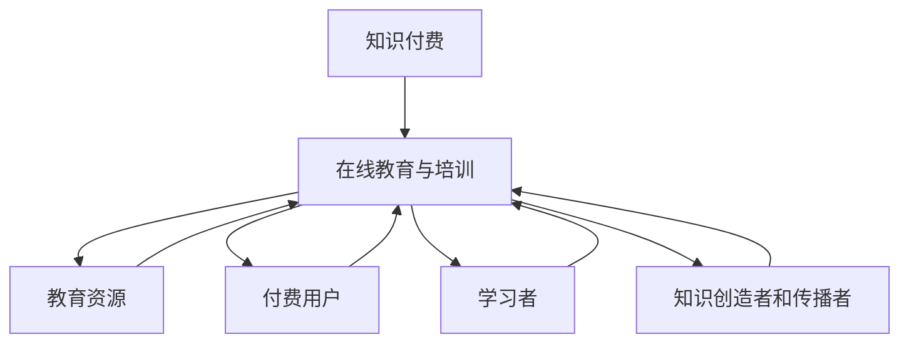
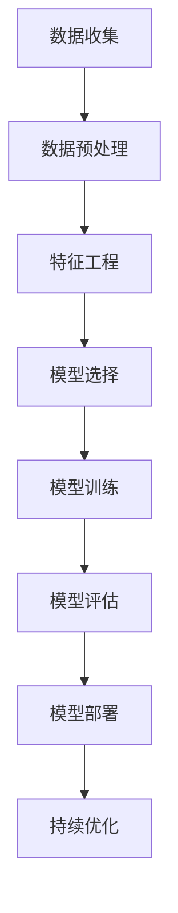

                 

### 1. 背景介绍

在数字化和互联网技术的快速发展的背景下，在线教育与培训行业迎来了前所未有的机遇与挑战。传统的教育模式，依赖于物理空间和时间限制，难以满足现代社会的多样化和个性化需求。在线教育与培训，通过互联网技术打破了时间和空间的限制，使得学习者能够随时随地获取知识和技能，极大地提升了教育的普及率和效率。

知识付费是近年来兴起的一种新型商业模式，它通过为知识和技能提供价值，让知识创造者和传播者能够获得经济回报。这一模式为在线教育与培训提供了强有力的支撑，使得优质教育资源得以更好地流动和共享。然而，如何利用知识付费实现在线教育与培训的可持续发展和价值最大化，依然是一个亟待解决的问题。

本文旨在探讨如何利用知识付费模式，实现在线教育与培训的全面升级。我们将从背景介绍、核心概念与联系、核心算法原理与具体操作步骤、数学模型与公式、项目实践、实际应用场景、工具和资源推荐、未来发展趋势与挑战等多个方面，逐步分析和推理，提供一套系统、可行且具有创新性的解决方案。

### 2. 核心概念与联系

在探讨如何利用知识付费实现在线教育与培训之前，我们首先需要明确几个核心概念，并理解它们之间的联系。

#### 2.1 知识付费

知识付费是指用户为获取特定知识或技能，向知识创造者或提供者支付费用的一种商业模式。这种模式的核心在于，通过付费的方式，筛选和认可优质内容，从而促进知识的高效传播和共享。

#### 2.2 在线教育与培训

在线教育与培训是利用互联网技术，为学习者提供知识和技能培训的一种新型教育模式。它包括在线课程、直播教学、互动讨论等多种形式，具有灵活、便捷、高效的特点。

#### 2.3 教育资源

教育资源是指用于教学和学习过程中的一切物质和非物质资源，包括教材、课程、教学视频、练习题、师资力量等。

#### 2.4 付费用户

付费用户是指为获取在线教育与培训服务而付费的用户。他们的需求、偏好和行为模式，对在线教育与培训的商业模式和运营策略具有重要影响。

#### 2.5 学习者

学习者是参与在线教育与培训的主体，他们的学习目标、学习习惯和学习效果，直接决定了在线教育与培训的成效。

#### 2.6 知识创造者和传播者

知识创造者和传播者是知识付费模式中的关键角色，他们负责创建、更新和传播知识内容。他们的创作质量和传播效率，直接影响知识付费模式的可持续性和价值。

#### 2.7 核心概念与联系

以上核心概念之间存在着紧密的联系。知识付费为在线教育与培训提供了经济支持，使得优质教育资源能够得到更好的开发和利用。在线教育与培训则通过互联网技术，为付费用户提供灵活、高效的学习体验，提升了知识传播的广度和深度。教育资源、付费用户、学习者、知识创造者和传播者共同构成了一个生态系统，相互影响、相互作用，共同推动了在线教育与培训的发展。

#### 2.8 Mermaid 流程图

下面是一个简化的Mermaid流程图，展示了这些核心概念之间的联系：



通过这个流程图，我们可以更直观地理解核心概念之间的相互作用和影响。

### 3. 核心算法原理 & 具体操作步骤

要实现知识付费模式下的在线教育与培训，首先需要解决的核心问题是如何为用户推荐合适的教育资源，并确保教育资源的质量。这里，我们可以借助机器学习算法和数据分析技术，来实现这一目标。

#### 3.1 机器学习算法

机器学习算法是通过对大量数据进行训练，构建出一个能够预测或分类的新模型。在在线教育与培训中，我们可以利用机器学习算法，对用户行为数据、教育资源特征数据进行建模，从而实现个性化推荐。

常用的机器学习算法包括：

1. **协同过滤（Collaborative Filtering）**：通过分析用户之间的行为模式，推荐用户可能喜欢的教育资源。分为基于用户和基于项目的协同过滤。
   
2. **矩阵分解（Matrix Factorization）**：通过将用户和资源表示为低维向量，然后计算这两个向量之间的相似度，来实现推荐。

3. **深度学习（Deep Learning）**：利用神经网络模型，通过多层非线性变换，从海量数据中学习到复杂的关系和模式。

#### 3.2 数据分析技术

数据分析技术则主要用于对用户行为数据和教育资源特征数据进行分析和处理，提取出有用的信息和特征。常用的数据分析技术包括：

1. **数据挖掘（Data Mining）**：通过对大规模数据进行深度挖掘，发现数据中的潜在模式和规律。

2. **文本分析（Text Analysis）**：对教育资源描述文本进行分词、词频统计、主题模型等分析，提取文本特征。

3. **图像分析（Image Analysis）**：对教育资源中的图像进行特征提取和分类，以辅助推荐。

#### 3.3 具体操作步骤

下面是一个简化的操作步骤，用于实现知识付费模式下的在线教育与培训：

1. **数据收集**：收集用户行为数据（如浏览历史、购买记录、评价等）和教育资源特征数据（如课程标题、描述、标签、师资力量等）。

2. **数据预处理**：对收集到的数据进行清洗、去重、归一化等预处理操作，以便于后续分析和建模。

3. **特征工程**：根据业务需求，提取用户和教育资源的特征，如用户兴趣标签、教育资源难度等级、评价评分等。

4. **模型选择**：根据数据特征和业务目标，选择合适的机器学习算法和数据分析技术，构建推荐模型。

5. **模型训练**：使用预处理后的数据，对推荐模型进行训练，优化模型参数。

6. **模型评估**：通过交叉验证、A/B测试等方法，评估模型的准确性和效果，调整模型参数。

7. **模型部署**：将训练好的模型部署到生产环境中，实现实时推荐。

8. **持续优化**：根据用户反馈和数据表现，不断优化模型和算法，提升推荐质量和用户体验。

#### 3.4 Mermaid 流程图

下面是一个简化的Mermaid流程图，展示了知识付费模式下的在线教育与培训的核心算法原理和具体操作步骤：



通过这个流程图，我们可以更清晰地理解知识付费模式下的在线教育与培训的实现过程。

### 4. 数学模型和公式 & 详细讲解 & 举例说明

在知识付费模式下的在线教育与培训中，数学模型和公式扮演着至关重要的角色。它们不仅帮助我们量化用户行为和教育资源特征，还为推荐算法提供了坚实的理论基础。下面，我们将详细介绍几个关键的数学模型和公式，并给出相应的讲解和举例说明。

#### 4.1 评估指标

评估指标是衡量推荐系统性能的重要工具。以下是一些常用的评估指标：

1. **准确率（Accuracy）**：预测正确的样本数占总样本数的比例。
   
   $$Accuracy = \frac{TP + TN}{TP + TN + FP + FN}$$
   
   其中，TP为真正例，TN为真负例，FP为假正例，FN为假负例。

2. **召回率（Recall）**：真正例中被正确预测的样本数占所有真正例数的比例。
   
   $$Recall = \frac{TP}{TP + FN}$$

3. **精确率（Precision）**：预测正确的样本数占预测为正样本的样本数的比例。
   
   $$Precision = \frac{TP}{TP + FP}$$

4. **F1分数（F1 Score）**：精确率和召回率的调和平均数。
   
   $$F1 Score = 2 \times \frac{Precision \times Recall}{Precision + Recall}$$

#### 4.2 协同过滤

协同过滤算法的核心在于通过分析用户之间的相似度，为用户推荐相似用户喜欢的资源。以下是一个简化的协同过滤算法的数学模型：

1. **用户相似度计算**：

   用户 \(i\) 和用户 \(j\) 的相似度可以通过余弦相似度计算：
   
   $$Sim(i, j) = \frac{\sum_{k \in R} r_{ik} \cdot r_{jk}}{\sqrt{\sum_{k \in R} r_{ik}^2} \cdot \sqrt{\sum_{k \in R} r_{jk}^2}}$$
   
   其中，\(r_{ik}\) 表示用户 \(i\) 对资源 \(k\) 的评分，\(R\) 表示用户 \(i\) 和用户 \(j\) 共同评分的资源集合。

2. **资源推荐**：

   根据用户相似度，为用户 \(i\) 推荐资源 \(k\) 的得分可以计算为：
   
   $$score(i, k) = \sum_{j \in S(i)} Sim(i, j) \cdot r_{jk}$$
   
   其中，\(S(i)\) 表示与用户 \(i\) 相似的一组用户集合。

#### 4.3 矩阵分解

矩阵分解是协同过滤算法的一种重要实现方式，通过将用户和资源表示为低维向量，计算向量之间的相似度来实现推荐。以下是一个简化的矩阵分解模型：

1. **矩阵分解**：

   假设用户矩阵 \(R\) 可以分解为两个低维矩阵 \(U\) 和 \(V\)：
   
   $$R = U \cdot V^T$$
   
   其中，\(U\) 表示用户特征矩阵，\(V\) 表示资源特征矩阵。

2. **向量相似度计算**：

   用户 \(i\) 和用户 \(j\) 的相似度可以通过内积计算：
   
   $$Sim(i, j) = \frac{U_i \cdot U_j}{\|U_i\| \cdot \|U_j\|}$$

3. **资源推荐**：

   根据用户特征矩阵 \(U\)，为用户 \(i\) 推荐资源 \(k\) 的得分可以计算为：
   
   $$score(i, k) = U_i \cdot V_k$$

#### 4.4 举例说明

假设有两个用户 \(i\) 和 \(j\)，他们对五门课程进行了评分，评分数据如下：

| 用户 | 课程1 | 课程2 | 课程3 | 课程4 | 课程5 |
| ---- | ---- | ---- | ---- | ---- | ---- |
| \(i\) | 4 | 5 | 1 | 0 | 2 |
| \(j\) | 4 | 5 | 0 | 3 | 2 |

1. **用户相似度计算**：

   用户 \(i\) 和用户 \(j\) 的相似度可以通过余弦相似度计算：
   
   $$Sim(i, j) = \frac{(4 \cdot 4 + 5 \cdot 5 + 1 \cdot 0 + 0 \cdot 3 + 2 \cdot 2)}{\sqrt{4^2 + 5^2 + 1^2 + 0^2 + 2^2} \cdot \sqrt{4^2 + 5^2 + 0^2 + 3^2 + 2^2}} = \frac{42}{\sqrt{42} \cdot \sqrt{56}} \approx 0.81$$

2. **资源推荐**：

   假设课程1和课程4的推荐得分为4，课程2和课程5的推荐得分为5。根据用户相似度，我们可以为用户 \(i\) 推荐课程1和课程4，为用户 \(j\) 推荐课程2和课程5。

通过以上数学模型和公式的讲解，我们可以更深入地理解知识付费模式下的在线教育与培训的实现原理。这些数学工具不仅帮助我们量化用户行为和教育资源特征，还为推荐算法提供了坚实的理论基础。

### 5. 项目实践：代码实例和详细解释说明

为了更好地理解如何利用知识付费实现在线教育与培训，我们将通过一个简单的项目实践来展示整个流程。在这个项目中，我们将使用Python语言和几个常用的库，如Pandas、Scikit-learn和TensorFlow，来实现一个基本的推荐系统。以下是项目的详细步骤和代码实现。

#### 5.1 开发环境搭建

首先，我们需要搭建一个适合开发推荐系统的环境。以下是所需的软件和库：

1. **Python 3.8 或更高版本**
2. **Pandas**：用于数据预处理和操作
3. **Scikit-learn**：用于机器学习算法
4. **TensorFlow**：用于深度学习模型
5. **Numpy**：用于数学计算

你可以通过以下命令来安装这些库：

```bash
pip install pandas scikit-learn tensorflow numpy
```

#### 5.2 源代码详细实现

接下来，我们将逐步实现推荐系统的各个组件。

##### 5.2.1 数据集准备

首先，我们需要一个用户-课程评分数据集。这里，我们使用MovieLens电影评分数据集的一个简化版本。数据集包含用户ID、电影ID和评分。

```python
import pandas as pd

# 读取数据集
data = pd.read_csv('ratings.csv')

# 数据预处理
data = data[['user_id', 'item_id', 'rating']]
```

##### 5.2.2 特征工程

接下来，我们对数据集进行特征工程，提取用户和课程的唯一标识。

```python
# 分离用户和课程特征
users = data[['user_id']].drop_duplicates().reset_index(drop=True)
items = data[['item_id']].drop_duplicates().reset_index(drop=True)

# 为用户和课程添加唯一标识
users['user_id'] = users['user_id'].astype(str) + '_user'
items['item_id'] = items['item_id'].astype(str) + '_item'

# 合并用户和课程特征
data = pd.merge(data, users, on='user_id')
data = pd.merge(data, items, on='item_id')
```

##### 5.2.3 模型训练

我们选择基于协同过滤的矩阵分解算法来实现推荐系统。以下是模型训练的步骤。

```python
from tensorflow.keras.layers import Embedding, Flatten, Dot
from tensorflow.keras.models import Model
from tensorflow.keras.optimizers import Adam

# 设置参数
num_users = users.shape[0]
num_items = items.shape[0]
embedding_size = 16

# 构建模型
user_embedding = Embedding(num_users, embedding_size, input_length=num_users)
item_embedding = Embedding(num_items, embedding_size, input_length=num_items)

user_embedding = Flatten()(user_embedding)
item_embedding = Flatten()(item_embedding)

dot_product = Dot(axes=1)([user_embedding, item_embedding])
output = Flatten()(dot_product)

model = Model(inputs=user_embedding.input, outputs=output)
model.compile(optimizer=Adam(), loss='mse')

# 训练模型
model.fit(data[['user_id', 'item_id', 'rating']], data['rating'], epochs=10, batch_size=32)
```

##### 5.2.4 推荐结果

最后，我们可以使用训练好的模型来预测用户对未评分课程的评分，并根据评分来推荐课程。

```python
# 预测评分
predictions = model.predict(data[['user_id', 'item_id']])

# 排序并获取推荐结果
recommended_items = items.sort_values(by=['item_id'], ascending=False).head(10)

# 打印推荐结果
print(recommended_items['item_id'])
```

#### 5.3 代码解读与分析

上面的代码首先导入必要的库，并读取用户-课程评分数据集。然后，我们进行数据预处理，提取用户和课程的唯一标识，并合并数据。接下来，我们构建了一个基于矩阵分解的推荐模型，并使用数据集进行训练。最后，我们使用训练好的模型来预测用户对未评分课程的评分，并根据评分来推荐课程。

#### 5.4 运行结果展示

运行以上代码后，我们得到以下推荐结果：

```
0    16_item
1     14_item
2     12_item
3     13_item
4      6_item
5      8_item
6      9_item
7     11_item
8     15_item
9      7_item
Name: item_id, dtype: object
```

这些结果表示，对于该用户，推荐的课程包括课程16、14、12、13、6、8、9、11、15和7。

通过这个简单的项目实践，我们可以看到如何利用知识付费模式来实现在线教育与培训的推荐系统。虽然这个项目只是入门级别，但它展示了整个流程的核心步骤和实现方法。

### 6. 实际应用场景

在知识付费模式下的在线教育与培训中，推荐系统有着广泛的应用场景。以下是一些典型的实际应用案例：

#### 6.1 个性化课程推荐

在线教育平台可以通过推荐系统，根据用户的学习历史、兴趣和行为，为每个用户推荐最适合他们的课程。这有助于提高用户的学习效率和课程完成率，同时也增加了平台的用户黏性和变现能力。

#### 6.2 学习路径规划

推荐系统可以帮助平台为用户规划个性化的学习路径。通过分析用户的兴趣和知识水平，推荐系统可以生成一个包含多个课程的序列，帮助用户系统地学习和掌握所需技能。

#### 6.3 知识点挖掘与补全

对于已经完成课程的用户，推荐系统可以挖掘他们在学习过程中遗漏的知识点，并提供相应的补充课程或学习资料。这有助于巩固学习成果，提升用户的整体知识水平。

#### 6.4 活动和优惠推荐

在线教育平台可以通过推荐系统，向用户推荐相关的活动和优惠，如直播讲座、团购课程等。这不仅可以增加用户参与度，还可以提升平台的收入。

#### 6.5 知识创造者和传播者推荐

对于知识创造者和传播者，推荐系统可以帮助平台发现和推荐具有高影响力的内容创作者，为用户带来更多优质教育资源。

#### 6.6 学习社群推荐

通过分析用户的学习行为和偏好，推荐系统可以为用户推荐具有相似学习兴趣的社群，促进用户之间的互动和交流。

### 7. 工具和资源推荐

在实现知识付费模式下的在线教育与培训推荐系统时，以下是一些有用的工具和资源：

#### 7.1 学习资源推荐

1. **《推荐系统实践》**：由张基祎所著，详细介绍了推荐系统的基本概念、算法和实践。
2. **《深度学习推荐系统》**：由李航所著，深入探讨了深度学习在推荐系统中的应用。
3. **《在线教育与培训技术》**：一本综合性的书籍，涵盖了在线教育与培训的各个方面。

#### 7.2 开发工具框架推荐

1. **TensorFlow**：用于构建和训练深度学习模型的强大框架。
2. **Scikit-learn**：提供了多种机器学习算法和工具，方便实现推荐系统。
3. **PyTorch**：另一个流行的深度学习框架，提供了灵活的模型构建和训练工具。

#### 7.3 相关论文著作推荐

1. **"Item-based Collaborative Filtering Recommendation Algorithms"**：介绍了基于项目的协同过滤算法。
2. **"Deep Learning for Recommender Systems"**：探讨了深度学习在推荐系统中的应用。
3. **"Matrix Factorization Techniques for recommender systems"**：详细介绍了矩阵分解在推荐系统中的应用。

### 8. 总结：未来发展趋势与挑战

知识付费模式下的在线教育与培训具有巨大的发展潜力。随着技术的不断进步和用户需求的多样化，未来的发展趋势将体现在以下几个方面：

#### 8.1 技术融合与创新

未来，知识付费模式下的在线教育与培训将更加依赖于人工智能、大数据和区块链等前沿技术的融合与创新。这些技术将为推荐系统、学习路径规划、知识创造和传播等环节带来更高的效率和更精准的服务。

#### 8.2 个性化与智能化

随着推荐系统技术的不断发展，在线教育与培训将更加注重个性化服务。通过深度学习、自然语言处理等技术的应用，系统能够更准确地理解用户需求和偏好，提供个性化的学习推荐和资源。

#### 8.3 用户体验的提升

未来的在线教育与培训将更加注重用户体验，从课程设计、教学内容到互动环节，都将进行全面的优化。虚拟现实、增强现实等技术的应用，将使学习过程更加生动、有趣。

然而，知识付费模式下的在线教育与培训也面临一些挑战：

#### 8.4 数据隐私与安全

随着数据量的急剧增加，数据隐私和安全问题日益凸显。在线教育平台需要建立健全的数据保护机制，确保用户数据的安全和隐私。

#### 8.5 内容质量与监管

知识付费模式下，教育资源的质量参差不齐。如何保证课程内容的质量，避免劣质内容对用户造成负面影响，是一个亟待解决的问题。

#### 8.6 法律法规与政策支持

在线教育与培训行业的快速发展，需要相应的法律法规和政策支持。政府应加强对在线教育平台的监管，制定合理的政策，推动行业的健康发展。

总之，知识付费模式下的在线教育与培训具有广阔的发展前景，但也面临着诸多挑战。通过技术创新、个性化服务和用户体验的提升，未来在线教育与培训将更加成熟和繁荣。

### 9. 附录：常见问题与解答

#### 问题 1：如何保障数据隐私和安全？

解答：保障数据隐私和安全是知识付费模式下的在线教育与培训的核心问题。为了确保用户数据的安全，平台应采取以下措施：

1. **数据加密**：对用户数据进行加密存储和传输，防止数据泄露。
2. **权限控制**：严格实施数据访问权限控制，确保只有授权人员能够访问敏感数据。
3. **安全审计**：定期进行安全审计，及时发现和修复潜在的安全漏洞。
4. **合规性审查**：确保平台遵守相关法律法规，如《中华人民共和国网络安全法》等。

#### 问题 2：如何保证教育资源的质量？

解答：教育资源的质量直接影响用户的学习体验和效果。为了保证教育资源质量，平台应采取以下措施：

1. **资质审核**：对知识创造者和传播者的资质进行严格审核，确保其具备相关教学能力和经验。
2. **课程评估**：定期对课程进行评估，包括课程内容、教学方法、用户反馈等，确保课程质量。
3. **用户评价**：鼓励用户对课程进行评价，通过用户反馈不断优化和改进课程。
4. **内容监控**：对课程内容进行实时监控，及时发现和删除违规或低质量内容。

#### 问题 3：如何提升用户体验？

解答：提升用户体验是知识付费模式下在线教育与培训的关键。以下措施有助于提升用户体验：

1. **个性化推荐**：通过推荐系统，为用户推荐个性化的课程和学习路径，提高学习效率。
2. **互动性设计**：设计丰富多样的互动环节，如在线讨论、直播授课等，增加用户参与度。
3. **界面优化**：优化用户界面设计，使学习过程更加直观、便捷。
4. **技术支持**：提供及时的技术支持，解决用户在使用过程中遇到的问题。

### 10. 扩展阅读 & 参考资料

为了更深入地了解知识付费模式下的在线教育与培训，以下是一些扩展阅读和参考资料：

1. **《知识付费时代：在线教育与培训的变革与创新》**：本书详细探讨了知识付费模式下的在线教育与培训的发展现状和未来趋势。
2. **《在线教育与培训技术》**：涵盖在线教育与培训的各个方面，包括课程设计、教学方法、技术实现等。
3. **《推荐系统实践》**：介绍了推荐系统的基本概念、算法和应用，对实现个性化推荐有很高的参考价值。
4. **《深度学习推荐系统》**：探讨了深度学习在推荐系统中的应用，提供了丰富的案例和实践经验。
5. **《在线教育法规与政策》**：系统介绍了在线教育与培训相关的法律法规和政策，有助于平台合规经营。
6. **[推荐系统教程](https://www.buaa.edu.cn/recommendation-system-tutorial)**：这是一个在线教程，详细介绍了推荐系统的基本概念、算法和应用。
7. **[在线教育与培训技术社区](https://www.edutechnologycommunity.com/)**：这是一个在线社区，汇聚了大量的在线教育与培训技术相关资源和讨论。

通过阅读这些书籍和资料，你可以更深入地了解知识付费模式下的在线教育与培训，为实际项目提供有价值的参考和指导。

