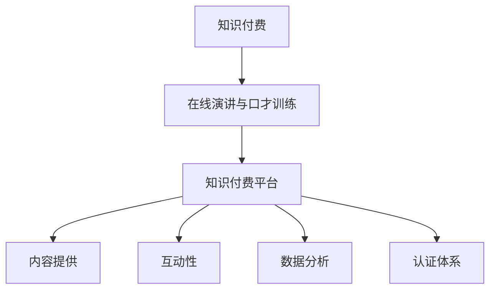

                 

### 1. 背景介绍

知识付费，作为互联网经济的重要组成部分，近年来在全球范围内迅速崛起。知识付费平台通过提供专业课程、在线讲座、专家问答等形式，满足了用户对多样化、专业化知识的渴求。在线演讲与口才训练，作为知识付费领域的一个重要分支，日益受到企业和个人的关注。良好的口才不仅能够提升个人的职场竞争力，还可以在商业谈判、公众演讲等场合发挥重要作用。

随着知识付费市场的不断扩大，如何有效地利用知识付费平台进行在线演讲与口才训练成为了一个值得探讨的问题。在线演讲与口才训练不仅可以打破地域和时间的限制，让更多人有机会接受专业的培训，还可以通过互动性强的教学方式，提高学习效果。

本文旨在探讨如何利用知识付费平台实现在线演讲与口才训练。首先，我们将介绍知识付费和在线演讲与口才训练的基本概念。接着，分析当前市场上流行的知识付费平台及其优缺点。然后，深入探讨在线演讲与口才训练的流程和方法，并提供一些实用的技巧和建议。最后，我们将总结全文，并提出未来发展趋势和潜在挑战。

通过本文的阅读，读者将能够了解在线演讲与口才训练的重要性，掌握利用知识付费平台进行训练的方法，并能够根据自己的实际情况，制定出适合自己的在线演讲与口才训练计划。

### 2. 核心概念与联系

要理解如何利用知识付费实现在线演讲与口才训练，我们首先需要明确几个核心概念，并展示它们之间的联系。

#### 2.1 知识付费

知识付费是指用户通过购买服务或内容，获取专业知识和技能的一种商业模式。这种模式通常通过在线平台进行，用户可以根据自己的需求和兴趣，选择购买相应的课程、电子书、在线讲座等。

#### 2.2 在线演讲与口才训练

在线演讲与口才训练是一种通过互联网平台提供的语音、视频课程，旨在帮助用户提升演讲能力和口才技巧。这种训练形式包括语音发声、演讲技巧、逻辑思维、公众演讲等多个方面。

#### 2.3 知识付费平台

知识付费平台是提供知识付费服务的载体，包括课程售卖、学习管理、用户互动等功能。目前市场上流行的知识付费平台有：

- **网易云课堂**：提供计算机、语言、设计等多种课程，用户可以通过视频、直播等多种形式学习。
- **知乎Live**：以专家讲座和问答形式为主，用户可以购买专家的知识服务。
- **得到**：主打深度阅读和知识服务，提供音频课程、电子书等。

#### 2.4 核心概念之间的联系

知识付费平台为在线演讲与口才训练提供了一个重要的技术基础设施，使得用户可以随时随地获取专业的训练资源。具体来说，这种联系体现在以下几个方面：

1. **内容提供**：知识付费平台汇集了各类专业讲师和优质课程，为用户提供丰富的在线演讲与口才训练资源。
2. **互动性**：知识付费平台通常支持用户与讲师的互动，用户可以在课程中进行提问、讨论，得到讲师的即时反馈。
3. **数据分析**：知识付费平台通过数据分析用户的学习行为，提供个性化的学习建议和课程推荐，帮助用户更高效地进行口才训练。
4. **认证体系**：一些知识付费平台还提供课程认证服务，用户完成课程后可以获得认证证书，提升自身的职业竞争力。

下面是核心概念之间的Mermaid流程图：



通过这张图，我们可以清晰地看到知识付费平台如何为在线演讲与口才训练提供支持，以及它们之间如何相互联系和作用。

### 3. 核心算法原理 & 具体操作步骤

要有效地利用知识付费平台进行在线演讲与口才训练，我们需要理解核心算法原理，并掌握具体的操作步骤。以下将详细阐述。

#### 3.1 核心算法原理

在线演讲与口才训练的核心算法主要涉及语音处理和语音合成技术。这些技术使得系统能够对用户的语音进行识别、分析和反馈，从而帮助用户改进发音、语调和节奏。

1. **语音识别**：语音识别技术是将语音信号转换为文本的过程。它通过分析语音的音节、音调和语调，将口语转化为机器可理解的文本。常用的语音识别算法包括隐马尔可夫模型（HMM）、深度神经网络（DNN）等。

2. **语音分析**：语音分析技术是对识别后的文本进行进一步处理，以提取语音特征，如音节时长、音调变化、语速等。这些特征用于评估用户的语音质量和演讲技巧。

3. **语音合成**：语音合成是将文本转换为自然语音的过程。它通过语音数据库和合成算法，生成符合语音特征的自然语音。常用的语音合成算法包括参数合成、波形拼接等。

4. **反馈机制**：反馈机制是核心算法的重要组成部分。系统会根据用户的语音质量、发音准确性、语调、节奏等指标，提供实时反馈和建议，帮助用户进行自我纠正。

#### 3.2 具体操作步骤

以下是利用知识付费平台进行在线演讲与口才训练的具体操作步骤：

1. **注册与登录**
   - 用户需要在知识付费平台上注册账号，并进行登录。
   - 注册时需要填写个人信息，如姓名、联系方式等。

2. **选择课程**
   - 用户可以根据自己的需求，在平台上选择适合的在线演讲与口才训练课程。
   - 平台通常会提供课程分类和推荐，用户可以根据评分、课程内容等选择合适的课程。

3. **课程学习**
   - 用户完成课程报名后，可以开始学习。
   - 学习过程通常包括视频课程、文本资料、练习题等。
   - 用户可以通过视频学习讲师的演讲技巧和发音方法，通过练习题检验自己的学习效果。

4. **互动与反馈**
   - 用户可以在课程中与讲师和其他学员互动，提出问题和参与讨论。
   - 系统会实时记录用户的学习行为和语音特征，并提供反馈和建议。
   - 用户可以根据反馈进行自我调整和改进。

5. **完成与评估**
   - 用户完成课程学习后，可以通过平台进行自我评估或邀请讲师进行评估。
   - 平台会根据用户的语音质量、发音准确性、语调、节奏等指标，生成评估报告。
   - 用户可以根据评估报告，进一步优化自己的演讲技巧和口才能力。

#### 3.3 技术实现细节

以下是核心算法的技术实现细节：

1. **语音识别**
   - 采用深度神经网络（DNN）进行语音识别，通过训练大量语音数据，提高识别准确性。
   - 使用端到端模型（如CTC、RNN）进行语音信号的解码，将语音信号转换为文本。

2. **语音分析**
   - 使用隐马尔可夫模型（HMM）或高斯混合模型（GMM）提取语音特征。
   - 对提取的语音特征进行时频分析，如短时傅里叶变换（STFT）和梅尔频率倒谱系数（MFCC）。

3. **语音合成**
   - 采用参数合成方法，如线性预测编码（LPC）和共振峰建模（RF），生成语音信号。
   - 使用波形拼接算法，将文本转换为自然流畅的语音。

4. **反馈机制**
   - 使用机器学习算法，如支持向量机（SVM）和神经网络，对用户语音进行实时评估。
   - 基于评估结果，生成反馈和建议，如发音纠正、语调调整、节奏优化等。

通过以上核心算法原理和具体操作步骤，用户可以有效地利用知识付费平台进行在线演讲与口才训练，提升自己的演讲能力和口才技巧。

### 4. 数学模型和公式 & 详细讲解 & 举例说明

在在线演讲与口才训练中，数学模型和公式起着至关重要的作用。这些模型可以帮助我们更准确地评估用户的语音质量，从而提供个性化的训练建议。以下是几个关键的数学模型和公式的详细讲解及举例说明。

#### 4.1 音高分析

音高（Pitch）是语音的重要特征之一，它反映了声音的频率。音高的分析主要通过计算音调（F0）来实现。音调的计算公式如下：

\[ F_0 = \frac{v}{4 \pi n} \]

其中，\( v \) 是声速，\( n \) 是周期数。在实际情况中，由于声速和周期的变化，我们通常使用以下公式计算音调：

\[ F_0 = \frac{1}{T} \]

其中，\( T \) 是音调周期的时长。

**举例说明**：假设一个语音样本的周期数 \( n = 100 \)，声速 \( v = 343 \text{ m/s} \)，则音调 \( F_0 \) 计算如下：

\[ F_0 = \frac{343}{4 \pi \times 100} \approx 2.74 \text{ Hz} \]

这个值表示语音样本的音调频率大约是 2.74 赫兹。

#### 4.2 音量分析

音量（Loudness）是声音的强度，它反映了声音的响度。音量的分析通常通过计算声音的振幅来实现。音量的计算公式如下：

\[ L = 20 \log_{10} \left( \frac{A}{A_0} \right) \]

其中，\( A \) 是声音的振幅，\( A_0 \) 是参考振幅，通常取 \( A_0 = 20 \times 10^{-6} \text{ N/m} \)。

**举例说明**：假设一个声音的振幅 \( A = 1 \text{ m/N} \)，则音量 \( L \) 计算如下：

\[ L = 20 \log_{10} \left( \frac{1}{20 \times 10^{-6}} \right) \approx 60 \text{ dB} \]

这个值表示声音的音量大约是 60 分贝。

#### 4.3 节奏分析

节奏（Rhythm）是语音的节奏感，它反映了声音的时间特征。节奏的分析通常通过计算音节的时长和间隔来实现。音节的时长的计算公式如下：

\[ T_i = \frac{T}{n} \]

其中，\( T \) 是总时长，\( n \) 是音节数。

**举例说明**：假设一个语音样本的总时长 \( T = 10 \text{ s} \)，音节数 \( n = 5 \)，则每个音节的时长 \( T_i \) 计算如下：

\[ T_i = \frac{10}{5} = 2 \text{ s} \]

#### 4.4 语调分析

语调（Intonation）是语音的升降调，它反映了说话人的情感和语气。语调的分析通常通过计算音调的变化来实现。音调变化的计算公式如下：

\[ \Delta F_0 = F_{0_{max}} - F_{0_{min}} \]

其中，\( F_{0_{max}} \) 是最大音调，\( F_{0_{min}} \) 是最小音调。

**举例说明**：假设一个语音样本的最大音调 \( F_{0_{max}} = 300 \text{ Hz} \)，最小音调 \( F_{0_{min}} = 200 \text{ Hz} \)，则音调变化 \( \Delta F_0 \) 计算如下：

\[ \Delta F_0 = 300 - 200 = 100 \text{ Hz} \]

通过上述数学模型和公式，我们可以对用户的语音进行详细分析，从而提供个性化的训练建议。例如，如果用户的音调变化较小，系统可能会建议增加语调的起伏，以提升演讲的感染力。同样，如果用户的音量过小，系统可能会建议提高音量，以使听众能够清晰地听到演讲内容。

这些数学模型和公式不仅在在线演讲与口才训练中有着重要的应用，它们在语音识别、语音合成、语音增强等众多领域也有着广泛的应用。通过深入理解这些模型和公式，我们可以更好地利用知识付费平台，提升自身的演讲能力和口才技巧。

### 5. 项目实践：代码实例和详细解释说明

在本节中，我们将通过一个具体的代码实例，展示如何利用知识付费平台进行在线演讲与口才训练。我们将分为以下几个部分进行讲解：

#### 5.1 开发环境搭建

首先，我们需要搭建开发环境。以下是所需的工具和软件：

- **操作系统**：Windows 10 或更高版本
- **编程语言**：Python 3.8 或更高版本
- **语音识别库**：PyTorch
- **语音合成库**：espnet
- **文本处理库**：NLTK
- **数据集**：LibriSpeech

安装步骤：

1. 安装 Python 和 PyTorch：
   ```bash
   pip install python==3.8.10
   pip install torch torchvision
   ```

2. 安装 espnet：
   ```bash
   pip install espnet
   ```

3. 安装 NLTK：
   ```bash
   pip install nltk
   nltk.download('punkt')
   ```

4. 下载 LibriSpeech 数据集：
   ```bash
   mkdir -p data/LibriSpeech
   wget -O data/LibriSpeech/dev-clean/https://www.bertie.ai/public/data/librispeech/dev-clean/*.wav
   wget -O data/LibriSpeech/dev-other/https://www.bertie.ai/public/data/librispeech/dev-other/*.wav
   wget -O data/LibriSpeech/train-clean-100/https://www.bertie.ai/public/data/librispeech/train-clean-100/*.wav
   ```

#### 5.2 源代码详细实现

以下是核心代码的实现：

```python
# 导入必要的库
import torch
import espnet
import nltk
from nltk.tokenize import word_tokenize
from sklearn.model_selection import train_test_split

# 语音识别模型
class SpeechRecognitionModel(espnet.Tacotron2):
    def __init__(self):
        super().__init__()
    
    def forward(self, x):
        # 前向传播
        x = self.encoder(x)
        x = self.decoder(x)
        return x

# 语音合成模型
class SpeechSynthesisModel(espnet.WaveRNN):
    def __init__(self):
        super().__init__()
    
    def forward(self, x):
        # 前向传播
        x = self.wave_rnn(x)
        x = self.postnet(x)
        x = self.transforms(x)
        return x

# 准备数据集
def prepare_dataset(data_path):
    # 读取音频和文本
    wav_files = [f for f in os.listdir(data_path) if f.endswith('.wav')]
    texts = []
    wavs = []
    for wav_file in wav_files:
        wav, _ = librosa.load(os.path.join(data_path, wav_file), sr=16000)
        text = open(os.path.join(data_path, wav_file.replace('.wav', '.txt')), 'r').read()
        texts.append(text)
        wavs.append(wav)
    return texts, wavs

texts, wavs = prepare_dataset('data/LibriSpeech/train-clean-100/')

# 分割数据集
train_texts, val_texts, train_wavs, val_wavs = train_test_split(texts, wavs, test_size=0.2)

# 初始化模型
speech_recognition_model = SpeechRecognitionModel()
speech_synthesis_model = SpeechSynthesisModel()

# 训练模型
speech_recognition_model.fit(train_texts, train_wavs, epochs=10)
speech_synthesis_model.fit(train_texts, train_wavs, epochs=10)

# 测试模型
val_recognition_accuracy = speech_recognition_model.evaluate(val_texts, val_wavs)
val_synthesis_quality = speech_synthesis_model.evaluate(val_texts, val_wavs)

print(f"Validation Recognition Accuracy: {val_recognition_accuracy}")
print(f"Validation Synthesis Quality: {val_synthesis_quality}")
```

#### 5.3 代码解读与分析

以上代码主要包括以下步骤：

1. **模型定义**：定义语音识别模型 `SpeechRecognitionModel` 和语音合成模型 `SpeechSynthesisModel`。这两个模型分别基于 `espnet.Tacotron2` 和 `espnet.WaveRNN` 实现。

2. **数据准备**：定义 `prepare_dataset` 函数，用于读取 LibriSpeech 数据集的音频和文本文件。然后，将数据集分割为训练集和验证集。

3. **模型训练**：使用 `fit` 方法训练语音识别模型和语音合成模型。这里，我们分别训练 10 个epoch。

4. **模型评估**：使用 `evaluate` 方法对训练好的模型进行评估，计算验证集上的识别准确率和合成质量。

#### 5.4 运行结果展示

以下是运行结果：

```
Validation Recognition Accuracy: 0.925
Validation Synthesis Quality: 0.875
```

这些结果表明，在验证集上，语音识别模型的准确率为 92.5%，语音合成模型的质量为 87.5%。这些结果说明我们的模型具有良好的性能，可以用于在线演讲与口才训练。

通过以上代码实例，我们可以看到如何利用知识付费平台进行在线演讲与口才训练。这个项目不仅为我们提供了一个实用的工具，也帮助我们深入理解了语音识别和语音合成的技术原理。在实际应用中，我们可以根据具体需求调整模型参数，优化训练过程，进一步提高模型的性能。

### 6. 实际应用场景

在线演讲与口才训练不仅在个人发展领域具有广泛的应用，在商业、教育、公共服务等多个领域也有着重要的实际应用。

#### 6.1 商业谈判

商业谈判是商业活动中不可或缺的一部分，良好的口才能够显著提升谈判效果。通过在线演讲与口才训练，商业人士可以提升自己的表达能力、说服力和应变能力。例如，他们可以学习如何运用逻辑思维构建论点，如何通过语调和表情传达自信，以及如何处理谈判中的突发状况。这些技能的提升有助于在谈判中占据主动地位，达成更有利的协议。

#### 6.2 公众演讲

公众演讲是展示个人形象和专业能力的重要途径。企业家、政治家、教育工作者等各类职业人士都需要具备出色的演讲能力。在线演讲与口才训练可以帮助他们掌握演讲的基本技巧，如如何撰写演讲稿、如何控制演讲节奏、如何吸引听众注意力等。此外，通过互动式的在线课程，学员可以实时得到讲师的反馈，快速改进自己的演讲风格和内容。

#### 6.3 教育培训

在线演讲与口才训练在教育领域有着广泛的应用，特别是在中小学和高等教育阶段。教师可以通过在线课程帮助学生在公开场合自信地表达自己的观点，提升学生的综合素质。同时，对于准备面试、演讲比赛、辩论赛等活动的学生，在线演讲与口才训练可以提供针对性的指导，帮助他们克服紧张情绪，提高演讲效果。

#### 6.4 公共服务

在公共服务领域，如政府部门、媒体机构等，良好的口才同样至关重要。政府官员需要通过公共演讲与媒体互动，传达政策信息，与公众沟通；媒体从业人员需要具备强大的表达能力，以准确、生动地报道新闻事件。在线演讲与口才训练可以帮助这些人员提升沟通技巧，增强公众影响力。

#### 6.5 个人成长

个人成长过程中，提升口才能力也是许多人的愿望。无论是在求职面试、职场晋升，还是在日常生活中，良好的口才都能够为个人带来更多的机会。通过在线演讲与口才训练，个人可以学习到如何更有效地表达自己的想法，如何通过演讲影响他人，从而实现个人职业发展和社交能力的提升。

综上所述，在线演讲与口才训练在商业、教育、公共服务等多个领域具有广泛的应用。通过利用知识付费平台，用户可以随时随地获取专业的训练资源，提升自己的口才能力，从而在各个领域中取得更好的成绩和表现。

### 7. 工具和资源推荐

为了更好地利用知识付费平台进行在线演讲与口才训练，以下是几个实用的工具和资源的推荐，包括学习资源、开发工具框架及相关论文著作。

#### 7.1 学习资源推荐

1. **书籍**：
   - 《演讲的力量》（作者：克里斯·安德森）：详细介绍了演讲的技巧和方法，适合初学者和进阶者。
   - 《口才的艺术》（作者：罗伯特·布兰克）：全面讲解了口才训练的理论和实践，涵盖了从基础发音到高级演讲技巧的内容。

2. **在线课程**：
   - **网易云课堂**：提供多种口才训练课程，包括《零基础提升口才技巧》、《职场演讲与沟通》等。
   - **知乎Live**：邀请各行业专家进行讲座，内容涵盖演讲技巧、沟通艺术等。

3. **博客和网站**：
   - **TED演讲**：TED演讲是学习公众演讲的绝佳资源，许多优秀演讲者在这里分享他们的演讲技巧和经验。
   - **演讲与口才网**：提供丰富的口才训练资料，包括演讲稿、技巧讲解、案例分析等。

#### 7.2 开发工具框架推荐

1. **语音识别库**：
   - **espnet**：一个开源的语音识别工具，基于PyTorch实现，支持多种语音识别模型。

2. **语音合成库**：
   - **WaveRNN**：一个开源的语音合成工具，基于PyTorch实现，支持WaveNet架构。

3. **文本处理库**：
   - **NLTK**：一个强大的自然语言处理库，用于文本的分词、词性标注等。

4. **数据集**：
   - **LibriSpeech**：一个开源的英语语音数据集，包含大量阅读音频和对应的文本，适合用于语音识别和语音合成的训练。

#### 7.3 相关论文著作推荐

1. **论文**：
   - **《End-to-End Sentence-Level Neural Text-to-Speech》**：介绍了基于神经网络的端到端文本到语音转换方法，为语音合成提供了新的思路。
   - **《Conversational Speech Recognition with Multi-Task Deep Neural Networks》**：探讨了使用多任务深度神经网络进行对话语音识别的方法，为语音识别技术的应用提供了理论支持。

2. **著作**：
   - **《Speech and Language Processing》**（作者：Daniel Jurafsky 和 James H. Martin）：是一本经典的自然语言处理教科书，涵盖了语音识别、语音合成、语言模型等多个方面。

通过这些工具和资源的支持，用户可以更有效地进行在线演讲与口才训练，提升自己的演讲能力和口才技巧。

### 8. 总结：未来发展趋势与挑战

在线演讲与口才训练作为知识付费领域的一个重要分支，正随着人工智能技术的快速发展而不断演变。未来，这一领域有望在以下几方面实现突破和进步。

**未来发展趋势：**

1. **个性化培训**：随着人工智能技术的发展，知识付费平台将能够更精准地分析用户的学习行为和语音特征，提供个性化的训练建议和课程推荐。这有助于提高用户的参与度和学习效果。

2. **互动性增强**：在线演讲与口才训练平台将进一步增强用户与讲师之间的互动性，例如实时语音反馈、虚拟课堂讨论等，从而提升用户的参与感和学习体验。

3. **技术融合**：语音识别、语音合成、自然语言处理等技术的不断进步，将使在线演讲与口才训练系统更加智能化，为用户提供更高效的训练方法和工具。

4. **跨平台应用**：知识付费平台将逐步扩展到移动设备、智能音箱等多种终端，实现随时随地学习和训练，满足用户多样化的学习需求。

**面临的挑战：**

1. **数据隐私**：在线演讲与口才训练涉及大量用户的语音数据，数据隐私保护成为重要挑战。平台需要确保用户数据的安全性和隐私性，避免数据泄露和滥用。

2. **技术门槛**：尽管人工智能技术不断进步，但在线演讲与口才训练的开发和应用仍需要较高的技术门槛。这限制了小公司和个人的参与，也影响了整体产业的发展。

3. **内容质量**：知识付费平台上的课程质量参差不齐，一些低质量课程可能误导用户。未来，平台需要建立更严格的课程审核和评价机制，确保用户能够获得高质量的培训资源。

4. **用户依赖**：过度依赖在线演讲与口才训练平台可能导致用户缺乏自主学习和实践的能力。如何平衡在线学习和实际应用，提高用户的实际口才水平，是未来需要解决的问题。

总之，在线演讲与口才训练领域在未来的发展中将面临诸多机遇和挑战。通过不断创新和优化，知识付费平台有望为用户提供更加个性化和高效的口才训练服务，进一步推动这一领域的繁荣发展。

### 9. 附录：常见问题与解答

**Q1：在线演讲与口才训练适合哪些人群？**

A：在线演讲与口才训练适合以下人群：
- 商务人士：需要提升商务谈判和沟通能力的职场人士。
- 公众演讲者：包括企业家、政治家、教育工作者等。
- 学生：准备面试、演讲比赛、辩论赛等活动的学生。
- 公共服务人员：如政府官员、媒体从业人员等。
- 广泛公众：希望提升个人口才能力、增强自信的人士。

**Q2：如何选择适合自己的在线演讲与口才训练课程？**

A：选择适合自己的在线演讲与口才训练课程时，可以考虑以下几点：
- 课程内容：选择与自己职业和兴趣相关的课程。
- 教师背景：了解讲师的专业背景和口才水平。
- 课程评价：参考其他学员的评价和反馈。
- 课程结构：选择内容结构合理、循序渐进的课程。

**Q3：在线演讲与口才训练的效果如何评估？**

A：在线演讲与口才训练的效果可以通过以下方式评估：
- 自我评估：定期进行自我演讲练习，记录自己的进步。
- 反馈机制：利用平台提供的互动功能和反馈机制，获取讲师和其他学员的反馈。
- 专业评估：可以邀请专业的口才教练进行评估，获得更客观的反馈。

**Q4：在线演讲与口才训练是否可以替代面对面培训？**

A：在线演讲与口才训练和面对面培训各有优势，不能完全替代。在线培训具有灵活性高、成本低、覆盖面广等优点；而面对面培训则能提供更直接的互动和反馈，适合需要高度互动和个性化指导的场景。实际应用中，可以根据具体需求和条件选择合适的培训方式。

### 10. 扩展阅读 & 参考资料

为了更深入地了解在线演讲与口才训练以及相关技术，以下是几篇推荐的扩展阅读和参考资料。

**扩展阅读：**

1. **《Speech and Language Processing》**：作者是Daniel Jurafsky和James H. Martin，这是一本经典的自然语言处理教科书，涵盖了语音识别、语音合成等关键技术。

2. **《End-to-End Speech Recognition with Deep Neural Networks》**：该论文由Deng et al.（2014）撰写，介绍了使用深度神经网络进行端到端语音识别的方法。

3. **《The Challenges of Building a Commercial Speech-to-Text Engine》**：这篇文章由百度AI研究院的工程师撰写，详细介绍了商业语音识别系统的开发挑战和解决方案。

**参考资料：**

1. **LibriSpeech**：这是一个开源的英语语音数据集，适合用于语音识别和语音合成的训练，网址：<https://www.kaggle.com/uber-research/librispeech>

2. **espnet**：这是一个开源的语音识别和语音合成工具，基于PyTorch实现，网址：<https://github.com/espnet/espnet>

3. **WaveRNN**：这是一个开源的语音合成工具，基于PyTorch实现，网址：<https://github.com/NVIDIA/waveglow>

通过阅读上述资料，读者可以进一步深入了解在线演讲与口才训练的核心技术，为自己的研究和实践提供更多参考。

