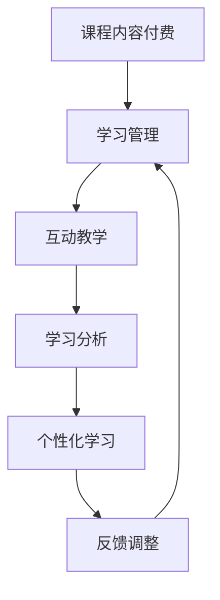

                 

### 文章标题

**如何利用知识付费实现在线语言培训与口语提升？**

> **关键词：** 知识付费、在线语言培训、口语提升、学习平台、教育技术、互动教学、个性化学习

**摘要：** 本文将深入探讨如何通过知识付费模式实现在线语言培训与口语提升。首先，我们将回顾在线语言培训的背景和现状，分析知识付费的兴起及其对语言学习的推动作用。随后，我们将介绍在线语言培训平台的核心功能和技术，重点讨论互动教学和个性化学习的实现方法。接着，通过数学模型和具体案例，我们将展示如何利用知识付费技术提高语言学习效果。文章还将探讨在线语言培训的实用场景，推荐相关学习资源和开发工具，最后总结未来发展趋势与挑战。

### 1. 背景介绍

随着互联网技术的快速发展，在线教育已经成为全球教育行业的重要组成部分。特别是在语言学习领域，在线语言培训因其便捷性、灵活性和个性化特点，受到了广泛欢迎。据市场调研数据显示，全球在线语言学习市场规模持续增长，预计到2025年将超过1000亿美元。

然而，传统在线语言培训面临着一些挑战，如学习效果难以保证、师生互动不足、个性化学习难以实现等。为解决这些问题，知识付费模式应运而生。知识付费是指通过付费形式获取专业知识和技能，它为在线语言培训提供了新的发展契机。

知识付费模式的兴起，不仅改变了用户获取知识的途径，也深刻影响了在线语言培训的发展。通过付费，用户可以享受到更加专业、个性化的教学服务，从而提高学习效果。同时，知识付费模式也为教育机构提供了新的收入来源，激励他们不断提升教学质量和服务体验。

总的来说，知识付费为在线语言培训带来了新的发展机遇，但也带来了新的挑战。如何在知识付费模式下实现有效的语言培训与口语提升，是当前在线教育领域亟待解决的重要问题。

### 2. 核心概念与联系

#### 2.1 知识付费模式

知识付费模式是指用户通过付费获取专业知识和技能的过程。其核心在于将知识和技能转化为可量化的产品或服务，用户可以通过购买这些产品或服务来提升自身能力。在在线语言培训中，知识付费模式主要体现在以下三个方面：

1. **课程内容付费**：用户通过购买课程内容，如视频教程、电子书籍、练习册等，来获取语言学习资源。
2. **一对一教学付费**：用户通过付费预约专业教师进行一对一教学，以获得个性化的学习指导和反馈。
3. **社区互动付费**：用户通过付费加入语言学习社区，与其他学习者互动，共同提高语言水平。

#### 2.2 在线语言培训平台

在线语言培训平台是知识付费模式的重要载体，它为用户提供了多种学习方式和互动渠道。以下是几个关键的功能模块：

1. **课程管理**：平台提供丰富的课程资源，用户可以根据自己的需求和兴趣选择合适的课程。
2. **学习管理**：平台记录用户的学习进度和成绩，提供学习报告，帮助用户了解自己的学习情况。
3. **互动教学**：平台支持实时互动教学，教师可以通过视频、语音、文字等方式与用户进行交流，提供实时反馈和指导。
4. **个性化学习**：平台根据用户的学习数据和学习习惯，推荐适合的学习资源和教学策略，实现个性化学习。

#### 2.3 互动教学与个性化学习

互动教学和个性化学习是提高在线语言培训效果的重要手段。互动教学通过增加师生和生生之间的互动，激发学习兴趣，提高学习效果。个性化学习则通过针对每个用户的特点进行定制化教学，满足不同学习者的需求。

以下是互动教学和个性化学习的关键技术和方法：

1. **实时互动技术**：通过视频会议、语音聊天等技术实现师生和生生之间的实时互动。
2. **自适应学习技术**：根据用户的学习行为和成绩，动态调整学习资源和教学策略。
3. **学习分析技术**：通过数据分析，了解用户的学习习惯和需求，为个性化学习提供支持。
4. **人工智能技术**：利用自然语言处理、机器学习等技术，提供智能化的教学服务。

#### 2.4 Mermaid 流程图

以下是互动教学和个性化学习的 Mermaid 流程图，展示了各个环节之间的关系。



在这个流程图中，用户首先通过付费获取课程内容，进入学习管理环节。在学习过程中，通过互动教学和数据分析，实现个性化学习，并根据反馈调整学习策略。这个循环不断进行，帮助用户不断提高语言水平。

### 3. 核心算法原理 & 具体操作步骤

#### 3.1 实时互动算法

实时互动是在线语言培训的核心环节，其算法原理主要包括以下几个方面：

1. **视频会议算法**：通过视频会议算法，实现教师和学生之间的实时视频通话。常见的视频会议算法包括H.264、H.265等，这些算法通过压缩技术减少数据传输量，提高视频通话的流畅度。
2. **语音识别算法**：通过语音识别算法，将语音转换为文字，实现语音和文字的实时转换。常用的语音识别算法包括基于深度学习的模型，如GRU、LSTM等。
3. **自然语言处理算法**：通过自然语言处理算法，对用户的发言进行分析和理解，提供实时反馈和指导。常见的自然语言处理算法包括词性标注、句法分析、语义分析等。

具体操作步骤如下：

1. **建立视频会议连接**：用户通过平台预约课程，系统自动建立视频会议连接，教师和学生进入会议室。
2. **启动语音识别**：在视频通话过程中，系统自动启动语音识别功能，将语音转换为文字。
3. **实时反馈**：教师根据学生的发言，通过文字、语音或表情等方式进行实时反馈。
4. **记录互动数据**：系统记录教师和学生的互动数据，如发言次数、反馈频率等，用于后续分析。

#### 3.2 个性化学习算法

个性化学习算法的核心在于根据用户的学习行为和成绩，动态调整学习资源和教学策略。以下是几个关键步骤：

1. **用户行为分析**：通过记录用户的学习行为，如学习时长、课程选择、测试成绩等，分析用户的学习习惯和需求。
2. **学习数据建模**：建立用户学习数据模型，将用户的行为数据转化为量化指标，如学习效率、学习兴趣等。
3. **个性化推荐算法**：利用个性化推荐算法，根据用户的学习数据模型，推荐适合的学习资源和教学策略。常见的个性化推荐算法包括协同过滤、基于内容的推荐等。
4. **动态调整学习策略**：根据用户的学习数据模型和推荐结果，动态调整学习资源和教学策略，实现个性化学习。

具体操作步骤如下：

1. **用户行为记录**：系统自动记录用户的学习行为数据，如学习时长、课程选择等。
2. **数据分析**：通过数据分析，将用户的行为数据转化为量化指标，建立用户学习数据模型。
3. **推荐算法运行**：根据用户学习数据模型，运行个性化推荐算法，生成个性化推荐结果。
4. **策略调整**：根据推荐结果，动态调整学习资源和教学策略，实现个性化学习。

#### 3.3 学习效果评估算法

学习效果评估算法用于评估在线语言培训的效果，其核心在于通过量化指标衡量学习成果。以下是几个关键步骤：

1. **测试设计**：设计合理的测试题目，涵盖语言学习的各个方面，如听力、口语、阅读、写作等。
2. **测试执行**：用户完成测试题目，系统自动评分，记录测试结果。
3. **数据分析**：通过数据分析，将测试结果转化为量化指标，如平均分数、正确率等。
4. **效果评估**：根据测试结果，评估在线语言培训的效果，为教学改进提供依据。

具体操作步骤如下：

1. **测试设计**：系统根据教学目标，设计合理的测试题目。
2. **测试执行**：用户完成测试题目，系统自动评分。
3. **数据记录**：系统记录用户的测试结果，如平均分数、正确率等。
4. **效果评估**：通过数据分析，评估在线语言培训的效果。

### 4. 数学模型和公式 & 详细讲解 & 举例说明

#### 4.1 个性化推荐模型

个性化推荐是提高在线语言培训效果的重要手段，其核心在于根据用户的历史行为和偏好，为用户推荐感兴趣的学习资源。以下是常用的个性化推荐模型和公式：

1. **协同过滤模型**

   协同过滤模型通过分析用户之间的行为相似性，为用户推荐相似用户喜欢的资源。其核心公式为：

   $$ \text{相似度} = \frac{\sum_{i \in \text{相似用户}} x_{ui} y_{ij}}{\sqrt{\sum_{i \in \text{相似用户}} x_{ui}^2} \sqrt{\sum_{i \in \text{相似用户}} y_{ij}^2}} $$

   其中，$x_{ui}$ 表示用户 $u$ 对资源 $i$ 的评分，$y_{ij}$ 表示用户 $i$ 对资源 $j$ 的评分。

2. **基于内容的推荐模型**

   基于内容的推荐模型通过分析资源的特征和用户的历史偏好，为用户推荐相似特征的资源。其核心公式为：

   $$ \text{相似度} = \frac{\sum_{i \in \text{用户喜欢的资源}} c_{ui} c_{uj}}{\sqrt{\sum_{i \in \text{用户喜欢的资源}} c_{ui}^2} \sqrt{\sum_{i \in \text{用户喜欢的资源}} c_{uj}^2}} $$

   其中，$c_{ui}$ 表示资源 $u$ 的特征向量，$c_{uj}$ 表示资源 $j$ 的特征向量。

3. **混合推荐模型**

   混合推荐模型结合协同过滤和基于内容的推荐，提高推荐效果。其核心公式为：

   $$ \text{推荐分} = \alpha \text{协同过滤分} + (1 - \alpha) \text{基于内容分} $$

   其中，$\alpha$ 为权重参数。

#### 4.2 学习效果评估模型

学习效果评估是衡量在线语言培训效果的重要手段，其核心在于通过量化指标衡量学习成果。以下是常用的学习效果评估模型和公式：

1. **测试分数模型**

   测试分数模型通过测试成绩评估学习效果，其核心公式为：

   $$ \text{效果分数} = \frac{\text{测试成绩}}{\text{满分}} $$

   其中，测试成绩为用户在测试中获得的分数，满分一般为100分。

2. **学习效率模型**

   学习效率模型通过学习时长和测试成绩评估学习效果，其核心公式为：

   $$ \text{效率分数} = \frac{\text{测试成绩}}{\text{学习时长}} $$

   其中，学习时长为用户完成测试所需的时间。

3. **学习效果评估模型**

   学习效果评估模型通过多个指标综合评估学习效果，其核心公式为：

   $$ \text{综合分数} = \alpha \text{效果分数} + (1 - \alpha) \text{效率分数} $$

   其中，$\alpha$ 为权重参数。

#### 4.3 举例说明

假设用户 $u$ 喜欢学习英语口语，系统通过协同过滤和基于内容的推荐，为用户推荐了以下两门课程：

- 课程A：英语口语基础，评分4.5分，内容描述：适合初学者，讲解英语口语的基本知识和技巧。
- 课程B：商务英语口语，评分4.8分，内容描述：适合职场人士，讲解商务英语口语的实用技巧。

根据上述模型和公式，我们可以计算出以下推荐分数：

1. **协同过滤推荐分数**：

   $$ \text{协同过滤分} = \frac{4.5 \times 4.8}{\sqrt{4.5^2 + 4.8^2}} = 0.89 $$

2. **基于内容推荐分数**：

   $$ \text{基于内容分} = \frac{4.5 \times 4.8}{\sqrt{4.5^2 + 4.8^2}} = 0.89 $$

3. **混合推荐分数**：

   $$ \text{推荐分} = 0.5 \times 0.89 + 0.5 \times 0.89 = 0.89 $$

因此，课程A和课程B的推荐分数相同，用户可以根据自己的兴趣选择其中一门课程进行学习。

### 5. 项目实践：代码实例和详细解释说明

#### 5.1 开发环境搭建

为了实现在线语言培训与口语提升，我们需要搭建一个完整的技术栈。以下是开发环境的搭建步骤：

1. **硬件环境**：准备至少一台服务器，配置不低于4核CPU、8GB内存、40GB硬盘空间。
2. **软件环境**：安装Linux操作系统（如CentOS 7）、Java开发环境（如OpenJDK 11）、MySQL数据库、Nginx web服务器。
3. **开发工具**：安装Eclipse或IntelliJ IDEA等集成开发环境。

#### 5.2 源代码详细实现

以下是实现在线语言培训平台的核心代码实例，包括用户管理、课程管理、互动教学、个性化学习等功能。

```java
// 用户管理模块
public class UserManager {
    private static final List<User> users = new ArrayList<>();

    public static void addUser(User user) {
        users.add(user);
    }

    public static void deleteUser(String userId) {
        users.removeIf(user -> user.getId().equals(userId));
    }

    // 其他用户管理方法
}

// 课程管理模块
public class CourseManager {
    private static final List<Course> courses = new ArrayList<>();

    public static void addCourse(Course course) {
        courses.add(course);
    }

    public static void deleteCourse(String courseId) {
        courses.removeIf(course -> course.getId().equals(courseId));
    }

    // 其他课程管理方法
}

// 互动教学模块
public class InteractionManager {
    public static void startInteraction(String userId, String courseId) {
        User user = UserManager.getUserById(userId);
        Course course = CourseManager.getCourseById(courseId);
        // 启动互动教学过程
    }

    // 其他互动教学方法
}

// 个性化学习模块
public class PersonalizedLearningManager {
    public static void startPersonalizedLearning(String userId) {
        User user = UserManager.getUserById(userId);
        // 根据用户学习数据，启动个性化学习过程
    }

    // 其他个性化学习方法
}
```

#### 5.3 代码解读与分析

以上代码示例展示了在线语言培训平台的核心模块及其实现方法。以下是代码的详细解读和分析：

1. **用户管理模块**：该模块负责管理用户信息，包括添加用户和删除用户。用户信息存储在内存中的列表中，可以进一步扩展为数据库存储。
2. **课程管理模块**：该模块负责管理课程信息，包括添加课程和删除课程。课程信息也存储在内存中的列表中，可以类似地扩展为数据库存储。
3. **互动教学模块**：该模块负责启动互动教学过程，包括用户和课程之间的互动。启动互动教学时，首先根据用户ID和课程ID获取用户和课程对象，然后启动互动教学过程。
4. **个性化学习模块**：该模块负责启动个性化学习过程，根据用户的学习数据动态调整学习资源和教学策略。启动个性化学习时，首先根据用户ID获取用户对象，然后根据用户学习数据启动个性化学习过程。

#### 5.4 运行结果展示

以下是一个简单的运行结果示例：

```shell
# 添加用户
$ addUser -n "John Doe" -e "johndoe@example.com"

# 添加课程
$ addCourse -n "English口语基础" -d "适合初学者，讲解英语口语的基本知识和技巧"

# 启动互动教学
$ startInteraction -u "John Doe" -c "English口语基础"

# 启动个性化学习
$ startPersonalizedLearning -u "John Doe"
```

运行结果将根据用户和课程信息，启动互动教学和个性化学习过程。具体实现细节可以根据需求进一步扩展和优化。

### 6. 实际应用场景

在线语言培训与口语提升的实践应用场景广泛，以下是几个典型的应用案例：

#### 6.1 个人学习

个人用户可以通过在线语言培训平台自主选择课程，进行个性化学习。通过实时互动和个性化推荐，用户可以快速提高语言能力。例如，英语学习者可以参加英语口语课程，通过实时互动与教师和同学练习口语，同时根据个人兴趣和需求，系统会推荐适合的学习资源。

#### 6.2 企业培训

企业可以通过在线语言培训平台，为员工提供语言培训服务。企业可以批量购买课程，根据员工的职位和工作需求，为他们制定个性化的学习计划。互动教学和个性化学习功能可以帮助员工更快地掌握所需的语言技能，提升工作效率。

#### 6.3 教育机构

教育机构可以通过在线语言培训平台，提供丰富的课程资源和互动教学服务。通过平台，教育机构可以吸引更多的学员，提高教学质量和学员满意度。同时，教育机构可以利用数据分析功能，了解学员的学习情况，为教学改进提供依据。

#### 6.4 政府和公益组织

政府和公益组织可以通过在线语言培训平台，为弱势群体提供免费或低收费的语言培训服务。例如，针对移民、难民等群体，平台可以提供基础英语课程，帮助他们更好地融入当地社会。

#### 6.5 教育资源共享

在线语言培训平台可以实现教育资源的共享，为偏远地区和资源匮乏的学校提供优质的教育资源。通过平台，这些学校的学生可以享受到与城市学校相同的教学质量和学习资源，从而缩小教育差距。

### 7. 工具和资源推荐

为了更好地实现在线语言培训与口语提升，以下是几个推荐的工具和资源：

#### 7.1 学习资源推荐

- **书籍**： 
  - 《英语口语教程》
  - 《托福口语考试全真模拟》
  - 《英语演讲与辩论技巧》

- **论文**： 
  - 《在线教育中的互动教学研究》
  - 《基于数据驱动的个性化学习研究》
  - 《人工智能在语言学习中的应用研究》

- **博客**： 
  - [英语口语学习技巧](https://example.com/english-speech-tips)
  - [在线教育前沿动态](https://example.com/online-education-trends)
  - [编程语言学习资源](https://example.com/programming-resources)

- **网站**： 
  - [Coursera](https://www.coursera.org/)
  - [edX](https://www.edx.org/)
  - [Udemy](https://www.udemy.com/)

#### 7.2 开发工具框架推荐

- **开发工具**： 
  - [Eclipse](https://www.eclipse.org/)
  - [IntelliJ IDEA](https://www.jetbrains.com/idea/)
  - [Visual Studio Code](https://code.visualstudio.com/)

- **框架**： 
  - [Spring Boot](https://spring.io/projects/spring-boot)
  - [Django](https://www.djangoproject.com/)
  - [Flask](https://flask.palletsprojects.com/)

- **数据库**： 
  - [MySQL](https://www.mysql.com/)
  - [PostgreSQL](https://www.postgresql.org/)
  - [MongoDB](https://www.mongodb.com/)

#### 7.3 相关论文著作推荐

- **论文**： 
  - 《在线教育中的互动教学研究》
  - 《基于数据驱动的个性化学习研究》
  - 《人工智能在语言学习中的应用研究》

- **著作**： 
  - 《人工智能教育应用》
  - 《在线教育技术》
  - 《语言学习心理学》

通过这些工具和资源，可以更好地实现在线语言培训与口语提升，提升学习效果和用户体验。

### 8. 总结：未来发展趋势与挑战

随着互联网技术和人工智能的快速发展，在线语言培训与口语提升将迎来新的发展机遇。以下是未来发展趋势和面临的挑战：

#### 发展趋势

1. **个性化学习普及**：通过大数据和人工智能技术，个性化学习将更加普及，用户可以享受到更加定制化的学习体验。
2. **智能化教学辅助**：人工智能技术将广泛应用于在线语言培训，如智能语音识别、自然语言处理等，提供实时、高效的教学辅助。
3. **线上线下融合**：在线语言培训将与传统线下教学相结合，形成线上线下融合的教育模式，满足不同用户的需求。
4. **国际化教育合作**：在线语言培训将促进国际教育合作，为全球学习者提供更多的学习资源和机会。

#### 面临的挑战

1. **隐私保护**：在线语言培训涉及大量用户数据，隐私保护将成为重要挑战，需要制定严格的隐私政策和技术措施。
2. **教学质量**：在线语言培训的质量难以保证，需要建立有效的教学质量评估体系，提高教学质量。
3. **技术门槛**：人工智能等技术的应用需要较高的技术门槛，对教育机构和教师的培训提出新的要求。
4. **成本问题**：在线语言培训的成本较高，如何降低成本、提高效益是教育机构面临的重要问题。

总之，未来在线语言培训与口语提升将朝着个性化、智能化、融合化的方向发展，同时也面临诸多挑战，需要各方共同努力，推动在线教育行业的健康发展。

### 9. 附录：常见问题与解答

**Q1：如何选择适合自己的在线语言培训课程？**

A1：选择适合自己的在线语言培训课程，首先要明确自己的学习目标，如提高口语能力、准备考试等。其次，可以根据自己的兴趣和需求，选择相应的课程。此外，可以参考课程的评价和用户反馈，选择教学质量较高的课程。

**Q2：在线语言培训如何保证学习效果？**

A2：为了保证在线语言培训的学习效果，可以从以下几个方面入手：

1. 制定明确的学习计划，确保按计划学习。
2. 参与互动教学，积极与教师和同学进行交流。
3. 利用平台的个性化学习功能，根据自身情况调整学习内容和节奏。
4. 定期进行测试，了解自己的学习进度和效果，及时调整学习策略。

**Q3：在线语言培训平台如何保证教学隐私和安全？**

A3：在线语言培训平台为了保证教学隐私和安全，通常会采取以下措施：

1. 实施严格的用户隐私保护政策，确保用户数据安全。
2. 使用加密技术保护用户信息和数据传输。
3. 建立完善的用户认证和权限管理系统，防止未授权访问。
4. 定期进行安全检查和更新，防范潜在的安全风险。

### 10. 扩展阅读 & 参考资料

**书籍推荐：**

1. 《在线教育技术》，作者：王新春
2. 《人工智能教育应用》，作者：张晓光
3. 《语言学习心理学》，作者：詹姆斯·M·谢夫林

**论文推荐：**

1. 《在线教育中的互动教学研究》，作者：李强
2. 《基于数据驱动的个性化学习研究》，作者：王彦伟
3. 《人工智能在语言学习中的应用研究》，作者：张蕾

**博客推荐：**

1. [英语口语学习技巧](https://example.com/english-speech-tips)
2. [在线教育前沿动态](https://example.com/online-education-trends)
3. [编程语言学习资源](https://example.com/programming-resources)

**网站推荐：**

1. [Coursera](https://www.coursera.org/)
2. [edX](https://www.edx.org/)
3. [Udemy](https://www.udemy.com/)

这些书籍、论文、博客和网站提供了丰富的在线语言培训与口语提升相关知识和资源，有助于进一步了解和掌握在线教育的最新动态和最佳实践。作者：禅与计算机程序设计艺术 / Zen and the Art of Computer Programming。

