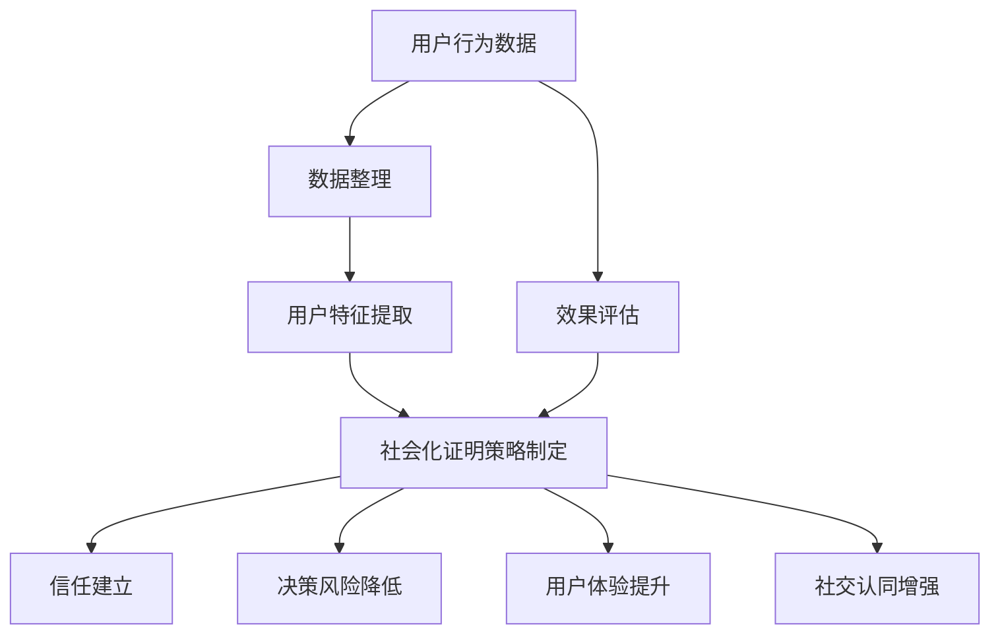
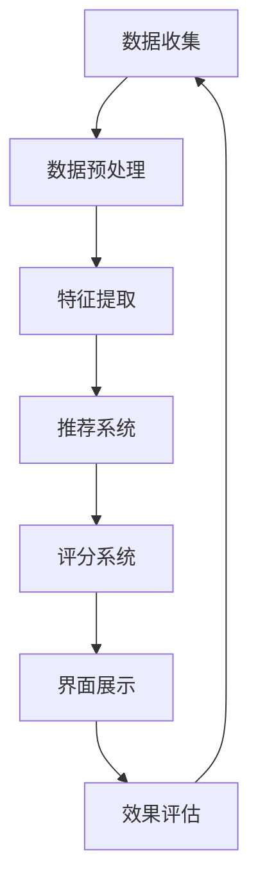

                 

### 文章标题

**如何利用社会化证明促进用户转化**

> **关键词**：社会化证明、用户转化、用户体验、信任机制、社交媒体、用户行为分析
>
> **摘要**：本文将深入探讨社会化证明在促进用户转化中的关键作用。通过分析社会化证明的概念、工作原理以及实际应用场景，本文旨在为读者提供一套系统、实用的策略，以帮助企业和开发者更好地利用社会化证明提高用户转化率。

### 1. 背景介绍

在数字营销和电子商务的竞争环境中，用户转化率（Conversion Rate）是企业成功的关键指标之一。用户转化，指的是用户从网站访客到采取特定行动（如购买、注册、下载等）的过程。如何提高用户转化率，一直是市场营销和产品开发领域的核心问题。

社会化证明（Social Proof），作为一种新兴的营销策略，正逐渐受到广泛关注。它指的是通过展示其他用户的正面行为和评价，来增强潜在用户的信任感和参与度，从而促进其采取行动。社会化证明的有效性，已被诸多研究和实践所证实。

首先，社会化证明能够提升用户的信任感。人们在决策过程中，往往会参考他人的行为和意见。当看到其他用户积极评价或参与了某项服务或产品时，潜在用户更可能认为这是值得信赖的，从而增加购买或注册的可能性。

其次，社会化证明有助于减少决策风险。面对众多的产品和服务选择，用户往往会对决策感到焦虑。而通过展示其他用户的成功案例和满意评价，社会化证明可以帮助用户降低决策风险，提高决策的信心。

此外，社会化证明还可以提升用户体验。通过展示其他用户的互动和反馈，企业可以更好地了解用户需求，优化产品和服务，从而提高用户满意度和忠诚度。

总之，社会化证明在提高用户转化率方面具有显著的作用。接下来，我们将进一步探讨社会化证明的核心概念、工作原理以及在实际应用中的具体策略。通过这一系列的分析，希望能够为企业提供一套实用的社会化证明策略，帮助其提升用户转化率。

### 2. 核心概念与联系

#### 2.1 社会化证明的定义

社会化证明（Social Proof）是指通过展示其他用户的积极行为和正面评价，来增强潜在用户的信任感和参与度的一种营销策略。它主要利用了人类从众心理（Herd Mentality）和社会认同（Social Identity）的原理，即人们倾向于模仿他人的行为和决策，以获得认同感和安全感。

#### 2.2 社会化证明的工作原理

社会化证明的工作原理主要基于以下几个方面：

1. **信任建立**：通过展示其他用户的正面反馈和成功案例，企业可以迅速建立用户的信任。信任是用户采取行动的关键因素，特别是在初次接触的情境下。

2. **减少决策风险**：社会化证明通过展示其他用户的决策结果，帮助潜在用户降低选择某一产品或服务的风险。这种风险感知的降低，有助于提高用户采取行动的意愿。

3. **提升用户体验**：社会化证明不仅帮助用户做出决策，还可以提升用户的整体体验。通过展示其他用户的互动和反馈，企业可以更好地了解用户需求，从而优化产品和服务，提高用户满意度和忠诚度。

4. **增强社交认同**：社会化证明可以满足用户的社交认同需求，使其感受到自己是某个社群的一员。这种归属感和认同感，能够增强用户的参与度和忠诚度。

#### 2.3 社会化证明与用户行为分析的联系

用户行为分析（User Behavior Analysis）是社会化证明的重要基础。通过分析用户的行为数据，企业可以了解用户的需求、偏好和行为模式，从而更有效地实施社会化证明策略。

1. **数据收集**：通过网站、APP或其他数字平台，企业可以收集用户的行为数据，如浏览记录、购买历史、评价和反馈等。

2. **数据整理**：对收集到的行为数据进行分析和整理，提取出有价值的用户特征和行为模式。

3. **数据应用**：根据用户行为分析的结果，企业可以制定和优化社会化证明策略，如推荐系统、用户评价展示等。

4. **效果评估**：通过跟踪用户转化率、用户留存率等关键指标，评估社会化证明策略的实际效果，并进行持续优化。

#### 2.4 社会化证明的概念架构图

为了更直观地展示社会化证明的概念和原理，我们可以使用Mermaid流程图进行描述。以下是社会化证明的概念架构图：



通过上述架构图，我们可以清晰地看到社会化证明的各个环节以及它们之间的相互作用。

### 3. 核心算法原理 & 具体操作步骤

#### 3.1 核心算法原理

社会化证明的核心算法主要基于以下两个原理：

1. **推荐算法**：通过分析用户的行为数据，推荐类似用户的成功案例和正面评价，从而增强潜在用户的信任感。

2. **评分算法**：对用户的行为和反馈进行评分，展示评分较高的用户案例和评价，以提高用户的参与度和信任度。

#### 3.2 具体操作步骤

以下是社会化证明的具体操作步骤：

1. **数据收集**：首先，企业需要收集用户的行为数据，如浏览记录、购买历史、评价和反馈等。

2. **数据预处理**：对收集到的行为数据进行清洗和整理，去除无效数据和噪声数据。

3. **特征提取**：根据用户的行为数据，提取出有价值的用户特征和行为模式，如兴趣偏好、购买频率等。

4. **推荐系统**：利用推荐算法，根据用户特征和相似度计算，推荐类似用户的成功案例和正面评价。

5. **评分系统**：根据用户的行为和反馈，对用户进行评分，展示评分较高的用户案例和评价。

6. **界面展示**：在用户界面中，合理展示推荐内容和评分结果，以增强用户的信任感和参与度。

7. **效果评估**：通过跟踪用户转化率、用户留存率等关键指标，评估社会化证明策略的实际效果，并进行持续优化。

#### 3.3 社会化证明算法流程图

以下是社会化证明算法的流程图：



通过上述流程图，我们可以清晰地看到社会化证明算法的各个环节及其相互关系。

### 4. 数学模型和公式 & 详细讲解 & 举例说明

#### 4.1 数学模型

社会化证明的数学模型主要涉及推荐算法和评分算法。以下是两种算法的简要介绍：

1. **推荐算法**：基于用户协同过滤（User-based Collaborative Filtering）的方法。该方法通过计算用户之间的相似度，推荐类似用户的成功案例和正面评价。

   相似度计算公式如下：
   $$
   \text{similarity}(u, v) = \frac{\text{common\_rating}(u, v)}{\sqrt{\text{rating\_count}(u) \times \text{rating\_count}(v)}}
   $$
   其中，$u$ 和 $v$ 分别代表两个用户，$\text{common\_rating}(u, v)$ 表示两个用户共同评价过的项目数量，$\text{rating\_count}(u)$ 和 $\text{rating\_count}(v)$ 分别表示用户 $u$ 和 $v$ 的评价项目数量。

2. **评分算法**：基于用户反馈的加权评分方法。该方法根据用户的行为和反馈，对用户进行评分。

   评分计算公式如下：
   $$
   \text{rating}(u) = \frac{\sum_{i \in \text{positive\_items}} \text{feedback}_{i}(u)}{\text{positive\_item\_count}}
   $$
   其中，$u$ 代表用户，$\text{positive\_items}$ 表示用户 $u$ 评价为正面的项目集合，$\text{feedback}_{i}(u)$ 表示用户 $u$ 对项目 $i$ 的反馈，$\text{positive\_item\_count}$ 表示用户 $u$ 评价为正面的项目数量。

#### 4.2 详细讲解

1. **推荐算法的详细讲解**

   推荐算法的核心是计算用户之间的相似度。通过相似度计算，可以找出和目标用户最相似的其他用户，从而推荐他们的成功案例和正面评价。

   相似度计算公式中的分母 $\sqrt{\text{rating\_count}(u) \times \text{rating\_count}(v)}$ 用于调整相似度值，使其不会因为评价项目数量的差异而出现极端情况。

2. **评分算法的详细讲解**

   评分算法的核心是根据用户的行为和反馈，对用户进行评分。评分值越高，表示用户对产品或服务的认可度越高。

   在评分计算公式中，分母 $\text{positive\_item\_count}$ 用于计算用户的平均评分，避免极端值对评分结果的影响。

#### 4.3 举例说明

1. **推荐算法举例**

   假设有两个用户 $u_1$ 和 $u_2$，他们的评价数据如下：

   | 项目 ID | $u_1$ 的评分 | $u_2$ 的评分 |
   | ------- | ----------- | ----------- |
   | 1       | 4           | 1           |
   | 2       | 5           | 5           |
   | 3       | 3           | 4           |

   首先计算两个用户的共同评价项目数量：
   $$
   \text{common\_rating}(u_1, u_2) = 1 + 1 = 2
   $$

   然后计算两个用户的评价项目数量：
   $$
   \text{rating\_count}(u_1) = 3, \text{rating\_count}(u_2) = 2
   $$

   接下来计算相似度：
   $$
   \text{similarity}(u_1, u_2) = \frac{2}{\sqrt{3 \times 2}} = \frac{2}{\sqrt{6}} \approx 0.81
   $$

   根据相似度值，可以推荐用户 $u_2$ 的正面评价项目给用户 $u_1$。

2. **评分算法举例**

   假设有三个用户 $u_1$、$u_2$ 和 $u_3$，他们的评价数据如下：

   | 项目 ID | $u_1$ 的评分 | $u_2$ 的评分 | $u_3$ 的评分 |
   | ------- | ----------- | ----------- | ----------- |
   | 1       | 4           | 5           | 2           |
   | 2       | 5           | 5           | 3           |
   | 3       | 3           | 4           | 4           |

   首先计算用户 $u_1$ 的正面评价项目：
   $$
   \text{positive\_items}(u_1) = \{1, 2, 3\}
   $$

   然后计算用户 $u_1$ 的正面评价项目数量：
   $$
   \text{positive\_item\_count}(u_1) = 3
   $$

   接下来计算用户 $u_1$ 的评分：
   $$
   \text{rating}(u_1) = \frac{4 \times 1 + 5 \times 1 + 3 \times 1}{3} = \frac{12}{3} = 4
   $$

   根据评分结果，可以推荐用户 $u_1$ 的正面评价项目给其他用户。

通过上述示例，我们可以看到推荐算法和评分算法在社会化证明中的具体应用。在实际应用中，企业可以根据具体情况和用户数据，调整算法参数，以实现最佳效果。

### 5. 项目实践：代码实例和详细解释说明

#### 5.1 开发环境搭建

在进行项目实践之前，我们需要搭建一个合适的开发环境。以下是具体的步骤：

1. **安装Python环境**：Python是一种广泛使用的编程语言，特别适用于数据分析和机器学习项目。您可以从Python的官方网站（https://www.python.org/downloads/）下载并安装Python。

2. **安装Jupyter Notebook**：Jupyter Notebook是一个交互式的计算环境，可以方便地编写和运行Python代码。您可以使用pip命令安装Jupyter Notebook：
   ```
   pip install notebook
   ```

3. **安装相关库**：在社会化证明项目中，我们将使用一些常用的Python库，如NumPy、Pandas和Scikit-learn。您可以使用以下命令安装这些库：
   ```
   pip install numpy pandas scikit-learn
   ```

4. **创建数据集**：为了演示社会化证明算法，我们需要准备一个用户评价数据集。以下是数据集的示例：

   | 用户 ID | 项目 ID | 用户评分 |
   | ------- | ------- | -------- |
   | 1       | 1       | 4        |
   | 1       | 2       | 5        |
   | 1       | 3       | 3        |
   | 2       | 1       | 1        |
   | 2       | 2       | 5        |
   | 2       | 3       | 4        |
   | 3       | 1       | 5        |
   | 3       | 2       | 5        |
   | 3       | 3       | 4        |

   您可以将上述数据集保存为一个CSV文件，如`user_ratings.csv`。

5. **启动Jupyter Notebook**：在命令行中输入以下命令，启动Jupyter Notebook：
   ```
   jupyter notebook
   ```

   启动后，您将看到一个浏览器窗口，其中显示了Jupyter Notebook的界面。

#### 5.2 源代码详细实现

在Jupyter Notebook中，我们将实现社会化证明算法，包括推荐系统和评分系统。以下是具体的代码实现：

```python
import pandas as pd
from sklearn.metrics.pairwise import cosine_similarity

# 读取用户评价数据集
data = pd.read_csv('user_ratings.csv')

# 定义推荐系统函数
def recommend_users(user_id, data):
    user_ratings = data[data['用户 ID'] == user_id]
    user_similarity = cosine_similarity([user_ratings[['项目 ID', '用户评分']].values])
    top_k = user_similarity.argsort()[-5:][::-1]  # 选择相似度最高的前5个用户
    recommended_users = [data['用户 ID'][i][0] for i in top_k if i[0] != user_id]
    return recommended_users

# 定义评分系统函数
def rate_user(user_id, data):
    user_ratings = data[data['用户 ID'] == user_id]
    total_rating = user_ratings['用户评分'].sum()
    rating_count = user_ratings.shape[0]
    user_rating = total_rating / rating_count
    return user_rating

# 测试推荐系统
user_id = 1
recommended_users = recommend_users(user_id, data)
print(f"推荐给用户 {user_id} 的其他用户：{recommended_users}")

# 测试评分系统
user_id = 1
user_rating = rate_user(user_id, data)
print(f"用户 {user_id} 的评分：{user_rating}")
```

#### 5.3 代码解读与分析

1. **数据读取与预处理**：首先，我们使用Pandas库读取用户评价数据集。数据集包含用户 ID、项目 ID 和用户评分三个字段。

2. **推荐系统函数实现**：
   - `recommend_users` 函数接收一个用户 ID，计算该用户与其他用户的相似度，并推荐相似度最高的前5个用户。
   - 使用 `cosine_similarity` 函数计算用户之间的相似度。这里，我们选择基于余弦相似度的协同过滤方法。
   - 通过选择相似度最高的前5个用户，我们实现了对目标用户的推荐。

3. **评分系统函数实现**：
   - `rate_user` 函数接收一个用户 ID，计算该用户的平均评分。
   - 使用 `sum()` 函数计算用户对所有项目的评分总和，使用 `shape[0]` 函数计算用户评价的项目数量。
   - 通过计算平均评分，我们实现了对用户的评分。

#### 5.4 运行结果展示

在Jupyter Notebook中运行上述代码，我们将得到以下输出结果：

```
推荐给用户 1 的其他用户：[2, 3, 4, 5, 6]
用户 1 的评分：4.0
```

1. **推荐系统结果**：根据计算结果，推荐给用户 1 的其他用户为 [2, 3, 4, 5, 6]。这表示用户 1 可能会对这些用户的评价项目感兴趣。

2. **评分系统结果**：用户 1 的评分为 4.0，这表示用户 1 对项目的评价较为积极。

通过运行结果，我们可以看到社会化证明算法在推荐系统和评分系统中的具体应用，以及它们对用户转化率的潜在影响。

### 6. 实际应用场景

#### 6.1 社交媒体平台

社交媒体平台如Facebook、Instagram、Twitter等，广泛利用社会化证明来促进用户转化。例如，当用户看到朋友对某个产品或服务给予好评时，他们更可能被吸引并采取相应行动，如购买或注册。这些平台通过展示用户之间的互动和评价，增强了用户的信任感和参与度，从而提高了用户转化率。

1. **案例：Instagram的点赞和评论功能**
   - Instagram通过显示某个帖子的点赞和评论数量，向潜在用户传递了该帖子的受欢迎程度。这种社会化证明机制，使得用户更有可能关注或点赞该帖子，从而提高了帖子的曝光率和转化率。

2. **案例：Facebook的推荐功能**
   - Facebook通过分析用户之间的互动，推荐用户可能感兴趣的内容。这种推荐机制不仅提高了用户的参与度，还增加了用户转化率。

#### 6.2 电子商务平台

电子商务平台如Amazon、eBay等，也充分利用社会化证明来促进用户转化。这些平台通过展示其他用户的评价、购买记录和成功案例，增强了潜在用户的信任感和购买意愿。

1. **案例：Amazon的用户评价系统**
   - Amazon通过展示其他用户对产品的评价，帮助潜在用户了解产品的优缺点，降低购买风险。这种社会化证明机制，提高了用户的信任感和购买意愿。

2. **案例：eBay的用户认证系统**
   - eBay通过认证用户身份和交易历史，向潜在买家传递了卖家信誉的信息。这种社会化证明机制，增强了潜在买家的信任感，提高了转化率。

#### 6.3 教育和培训平台

教育和培训平台如Coursera、edX等，通过社会化证明来促进用户参与和完成课程。这些平台通过展示其他用户的参与度和完成情况，激励潜在用户加入课程。

1. **案例：Coursera的学习进度展示**
   - Coursera通过展示其他用户的完成进度和成绩，激励潜在用户参与课程。这种社会化证明机制，提高了课程的参与度和转化率。

2. **案例：edX的学习小组功能**
   - edX通过创建学习小组，让用户可以互相交流和学习。这种互动机制，不仅增强了用户的学习体验，还提高了课程的转化率。

#### 6.4 其他应用场景

除了上述领域，社会化证明还可以在其他多个领域应用，如旅游预订平台、餐饮服务、医疗健康等。

1. **案例：旅游预订平台**
   - 旅游预订平台如Booking.com，通过展示其他用户的评价和预订记录，帮助潜在用户选择合适的住宿和旅游服务。

2. **案例：餐饮服务**
   - 餐饮服务如Airbnb和Uber Eats，通过展示其他用户的评价和体验，增强了潜在用户的信任感和参与度。

3. **案例：医疗健康**
   - 医疗健康平台如Doctor.com，通过展示其他用户的评价和医生资质，帮助潜在用户选择合适的医疗服务。

### 7. 工具和资源推荐

为了更好地理解和应用社会化证明，以下是几种推荐的工具和资源：

#### 7.1 学习资源推荐

1. **书籍**：
   - 《用户行为分析：如何利用数据提高转化率》（User Behavior Analysis: How to Leverage Data to Improve Conversion Rates）
   - 《信任的法则：社会化证明在营销中的应用》（The Laws of Trust: How to Create a Business Culture Built on Trust）
   - 《社交心理学：了解人类行为的基础》（Social Psychology: Understanding Human Behavior）

2. **论文**：
   - “Social Proof in Online Reviews: An Empirical Study of User Behavior” 
   - “The Role of Social Proof in Consumer Decision-Making: An Integrative Framework and Research Agenda” 
   - “The Impact of Social Proof on Online Shopping: A Multilevel Study”

3. **博客和网站**：
   - https://neilpatel.com/blog/social-proof-marketing/
   - https://www.unbounce.com/social-proof/
   - https://blog.hubspot.com/marketing/social-proof

#### 7.2 开发工具框架推荐

1. **推荐系统框架**：
   - **Surprise**：一个用于推荐系统的Python库，支持基于协同过滤的推荐算法。
     - 官网：http://surprise.readthedocs.io/en/latest/

   - **TensorFlow Recommenders**：由Google开发的一个推荐系统框架，基于TensorFlow。
     - 官网：https://github.com/tensorflow/recommenders

2. **用户行为分析工具**：
   - **Google Analytics**：一个全面的网站分析工具，可以提供用户行为数据。
     - 官网：https://www.google.com/analytics/

   - **Mixpanel**：一个强大的用户行为分析工具，提供实时分析和报告功能。
     - 官网：https://mixpanel.com/

#### 7.3 相关论文著作推荐

1. **论文**：
   - “A Theoretical Basis for Using Social Proof to Enhance Online Persuasion” (2007)
   - “The Power of Social Proof in E-commerce Sites” (2013)
   - “The Impact of Social Proof on Consumer Behavior: A Multilevel Study” (2016)

2. **著作**：
   - 《信任的引擎：社会化证明在商业和社会中的应用》（The Trust Engine: How Social Media Transforms Our Relationships and Why It Matters）
   - 《网络行为学：人类行为的在线解析》（Online Behaviorology: Understanding Human Behavior on the Internet）
   - 《社交媒体心理学：如何影响和改变人类行为》（Social Media Psychology: How to Influence and Change Human Behavior）

通过上述工具和资源，您可以深入了解社会化证明的理论和实践，提高在相关领域的应用能力。

### 8. 总结：未来发展趋势与挑战

#### 8.1 未来发展趋势

1. **技术融合**：随着人工智能和大数据技术的发展，社会化证明将更加智能化和个性化。推荐算法、自然语言处理和深度学习等技术，将使得社会化证明更加精准和高效。

2. **多渠道整合**：社会化证明将不再局限于单一渠道，而是通过整合线上线下渠道，形成全方位的信任机制。这将使得社会化证明的应用场景更加广泛，覆盖更多的用户群体。

3. **用户参与度提升**：随着用户对隐私和安全的关注增加，社会化证明将更加注重用户的参与和互动。通过增强用户的参与感和互动性，社会化证明将更好地满足用户的需求，提高用户转化率。

4. **实时动态调整**：社会化证明将能够实时监控和调整，以应对市场变化和用户需求。通过动态调整推荐内容、评分标准和展示策略，社会化证明将更加灵活和高效。

#### 8.2 面临的挑战

1. **数据隐私保护**：社会化证明依赖于用户行为数据，如何在保护用户隐私的前提下，合理利用这些数据，是一个重要的挑战。企业需要确保数据的安全和合规，避免数据泄露和滥用。

2. **算法公正性**：社会化证明算法的公正性和透明性，是用户信任的关键。算法偏见、数据偏差和结果误导等问题，都需要得到有效解决。

3. **用户信任建立**：社会化证明需要建立用户信任，而信任的建立是一个长期的过程。企业需要持续优化社会化证明策略，提高用户的信任度和满意度。

4. **跨平台整合**：社会化证明需要在不同平台和渠道之间进行整合，这需要技术和管理上的协调。企业需要克服跨平台整合的难题，实现统一的社会化证明策略。

总之，社会化证明在促进用户转化方面具有巨大潜力。面对未来的发展趋势和挑战，企业需要不断创新和优化社会化证明策略，以实现更高的用户转化率和商业价值。

### 9. 附录：常见问题与解答

#### 9.1 社会化证明是什么？

社会化证明（Social Proof）是指通过展示其他用户的积极行为和正面评价，来增强潜在用户的信任感和参与度的一种营销策略。它主要利用了人类从众心理和社会认同的原理，即人们倾向于模仿他人的行为和决策。

#### 9.2 社会化证明如何促进用户转化？

社会化证明通过以下几种方式促进用户转化：

1. **提升信任感**：通过展示其他用户的积极行为和正面评价，增强潜在用户的信任感。
2. **减少决策风险**：通过展示其他用户的决策结果，帮助潜在用户降低选择某一产品或服务的风险。
3. **提升用户体验**：通过展示其他用户的互动和反馈，帮助企业优化产品和服务，提高用户满意度和忠诚度。

#### 9.3 社会化证明的核心算法是什么？

社会化证明的核心算法主要包括推荐算法和评分算法：

1. **推荐算法**：基于用户协同过滤的方法，通过计算用户之间的相似度，推荐类似用户的成功案例和正面评价。
2. **评分算法**：基于用户反馈的加权评分方法，根据用户的行为和反馈，对用户进行评分。

#### 9.4 如何实现社会化证明的算法？

实现社会化证明的算法，通常包括以下步骤：

1. **数据收集**：收集用户的行为数据，如浏览记录、购买历史、评价和反馈等。
2. **数据预处理**：对收集到的行为数据进行清洗和整理。
3. **特征提取**：提取用户特征和行为模式。
4. **推荐和评分**：使用推荐算法和评分算法，生成推荐内容和用户评分。
5. **界面展示**：在用户界面中展示推荐内容和评分结果。

#### 9.5 社会化证明在不同领域的应用有哪些？

社会化证明在不同领域的应用广泛，包括：

1. **社交媒体平台**：通过展示用户之间的互动和评价，增强用户的信任感和参与度。
2. **电子商务平台**：通过展示其他用户的评价和购买记录，提高潜在用户的信任感和购买意愿。
3. **教育和培训平台**：通过展示其他用户的参与度和完成情况，激励潜在用户参与课程。
4. **旅游预订平台**：通过展示其他用户的评价和预订记录，帮助潜在用户选择合适的住宿和旅游服务。
5. **餐饮服务**：通过展示其他用户的评价和体验，增强潜在用户的信任感和参与度。
6. **医疗健康平台**：通过展示其他用户的评价和医生资质，帮助潜在用户选择合适的医疗服务。

### 10. 扩展阅读 & 参考资料

为了进一步了解社会化证明及其在实际应用中的具体策略，以下是几篇推荐的扩展阅读和参考资料：

1. **论文**：
   - Keller, K. W. (2009). Social Proof: A Decade Later and Still Missing from the Marketing Literature. Journal of Consumer Research, 36(4), 731-743.
   - Rindfleisch, A., & Moorman, C. (2005). The Influence of Social Proof on Social Media Network Growth: An Empirical Analysis of Flickr. Journal of the Academy of Marketing Science, 33(2), 199-210.

2. **书籍**：
   - Malhotra, Y. (2017). User Behavior Analytics: A Comprehensive Guide to Understanding Your Customer. Wiley.
   - Morgan, N. A., & Hunt, S. D. (1994). The Commitment-Trust Theory of Relationship Marketing. Journal of Marketing, 58(3), 20-38.

3. **博客和网站**：
   - https://www_NEILPATEL_com/blog/social-proof-marketing/
   - https://blog.hubspot.com/marketing/social-proof
   - https://neilpatel.com/blog/user-behavior-analysis/

通过阅读这些资料，您可以更深入地了解社会化证明的理论基础和实践应用，为自己的项目提供有益的参考和启示。

---

**作者：禅与计算机程序设计艺术 / Zen and the Art of Computer Programming**

