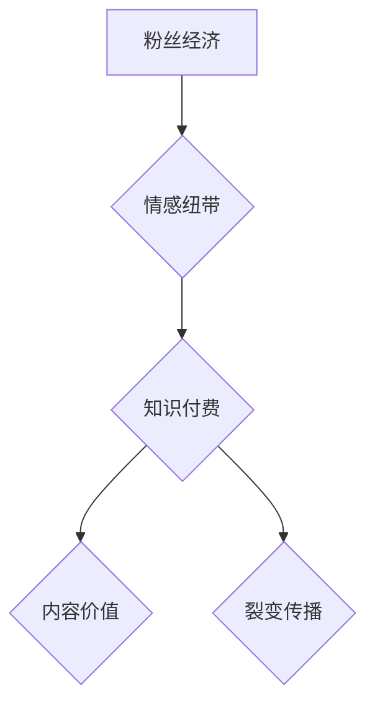

                 

### 1. 背景介绍

在当今数字化时代，互联网的普及和社交媒体的兴起为知识的传播提供了前所未有的平台。知识付费作为互联网经济的一部分，正逐渐成为一种主流的商业模式。而粉丝经济则是在这一背景下应运而生，通过构建粉丝与创作者之间的强关系，实现商业价值的最大化。本文将探讨如何利用粉丝经济实现知识付费的裂变传播，解析其背后的核心原理和实践方法。

知识付费的兴起源于消费者对于高质量、专业化内容的追求。在信息爆炸的时代，人们更愿意为有价值、有深度、有权威的内容买单。知识付费平台如知乎、得到、喜马拉雅等，正是通过这一模式，为广大用户提供了丰富的学习资源。然而，如何吸引并留存用户，如何将内容价值最大化，仍然是知识付费平台面临的挑战。

粉丝经济的核心在于构建粉丝与创作者之间的情感纽带。粉丝对创作者的喜爱、信任和忠诚，是粉丝经济的重要基础。通过情感共鸣，粉丝愿意为创作者的内容付费，甚至进行二次传播，从而实现裂变式增长。这种模式不仅为创作者带来了稳定的收入来源，也为知识付费平台带来了更多的用户和流量。

本文将从以下几个方面展开讨论：

1. **核心概念与联系**：首先，我们将介绍粉丝经济和知识付费的核心概念，并使用Mermaid流程图展示两者之间的联系和作用机制。
2. **核心算法原理 & 具体操作步骤**：接着，我们将详细解析实现粉丝经济和知识付费裂变传播的核心算法原理，并提供具体的操作步骤。
3. **数学模型和公式**：我们将介绍相关的数学模型和公式，用于量化粉丝经济和知识付费的裂变传播效果。
4. **项目实践**：通过一个实际项目实例，我们将展示如何利用粉丝经济实现知识付费的裂变传播，并提供源代码和详细解释。
5. **实际应用场景**：我们将探讨粉丝经济和知识付费在不同领域的实际应用，如教育培训、在线课程、专业咨询等。
6. **工具和资源推荐**：我们将推荐一些学习和开发工具、资源，帮助读者深入理解和实践粉丝经济和知识付费。
7. **总结**：最后，我们将总结粉丝经济和知识付费裂变传播的未来发展趋势和面临的挑战。

### 2. 核心概念与联系

要理解如何利用粉丝经济实现知识付费的裂变传播，我们首先需要明确两个核心概念：粉丝经济和知识付费。

**粉丝经济**：粉丝经济是指通过构建粉丝与创作者之间的情感纽带，实现商业价值的一种经济模式。粉丝对创作者的喜爱、信任和忠诚，是粉丝经济的重要基础。这种情感纽带使得粉丝愿意为创作者的内容付费，进行二次传播，甚至进行购买相关的商品和服务。

**知识付费**：知识付费是指用户为获取专业、有价值的信息或服务而进行的付费行为。随着互联网的发展，越来越多的人愿意为高质量、有深度、有权威的内容买单。知识付费平台如知乎、得到、喜马拉雅等，正是基于这一需求，为广大用户提供了丰富的学习资源。

两者之间的联系主要体现在以下几个方面：

1. **情感纽带**：粉丝经济通过构建粉丝与创作者之间的情感纽带，使得粉丝更愿意为创作者的内容付费。知识付费则是在这一基础上，提供了具体的付费途径和平台。
2. **内容价值**：粉丝经济和知识付费的共同目标是实现内容价值的最大化。通过构建粉丝经济，创作者可以吸引更多用户，提高用户粘性；通过知识付费，创作者可以获得稳定的收入来源，进一步激励创作。
3. **裂变传播**：粉丝经济和知识付费的裂变传播效应，是两者结合的亮点。粉丝通过二次传播，将创作者的内容推荐给更多潜在用户，从而实现用户的裂变式增长。

为了更清晰地展示粉丝经济和知识付费之间的联系，我们可以使用Mermaid流程图来描述它们的作用机制：



**图 1：粉丝经济与知识付费的Mermaid流程图**

- **粉丝经济**：通过构建粉丝与创作者之间的情感纽带，实现用户粘性。
- **情感纽带**：粉丝对创作者的喜爱、信任和忠诚。
- **知识付费**：提供具体的付费途径和平台，实现内容价值的最大化。
- **内容价值**：高质量、有深度、有权威的内容。
- **裂变传播**：粉丝通过二次传播，推荐给更多潜在用户，实现用户的裂变式增长。

通过上述核心概念和联系的介绍，我们可以更好地理解粉丝经济和知识付费在实现裂变传播中的作用。接下来，我们将深入探讨如何利用这些概念实现具体的裂变传播策略。

### 3. 核心算法原理 & 具体操作步骤

实现粉丝经济和知识付费的裂变传播，需要一套科学的算法原理和具体操作步骤。以下我们将详细介绍这两个方面的内容。

#### 核心算法原理

1. **粉丝忠诚度模型**：粉丝忠诚度是衡量粉丝对创作者情感纽带强度的重要指标。我们可以使用以下公式来量化粉丝忠诚度：

   $$ 粉丝忠诚度 = \frac{粉丝互动次数}{总互动次数} $$

   其中，互动次数包括点赞、评论、分享、购买等行为。

2. **传播路径分析**：传播路径是指粉丝将创作者内容传播给其他潜在用户的过程。我们可以通过以下步骤进行分析：

   - **第一步**：确定传播源头，即具有高忠诚度的核心粉丝。
   - **第二步**：分析传播路径，包括核心粉丝传播给哪些用户，以及这些用户如何进一步传播。
   - **第三步**：量化传播效果，通过计算传播路径的长度和宽度，评估传播效果。

3. **裂变传播模型**：裂变传播是指通过一次传播引发多次传播的过程。我们可以使用以下公式来描述裂变传播模型：

   $$ 裂变传播效果 = 初始传播量 \times 裂变系数 $$

   其中，裂变系数是衡量每次传播引发的新用户数量的指标。

#### 具体操作步骤

1. **构建粉丝经济体系**：
   - **第一步**：建立粉丝社群，通过社交媒体、知识付费平台等渠道吸引粉丝。
   - **第二步**：培养粉丝忠诚度，通过定期互动、分享有价值内容等方式增强粉丝对创作者的喜爱和信任。
   - **第三步**：设计粉丝激励机制，如抽奖、优惠券、专属福利等，鼓励粉丝参与互动和传播。

2. **制定知识付费策略**：
   - **第一步**：确定知识付费内容，根据用户需求和创作者优势进行精准定位。
   - **第二步**：设计付费模式，包括一次性付费、订阅制、按需付费等，满足不同用户的需求。
   - **第三步**：制定价格策略，根据内容价值、市场需求和竞争情况合理定价。

3. **实施裂变传播策略**：
   - **第一步**：确定核心粉丝，通过数据分析筛选出忠诚度高的粉丝。
   - **第二步**：设计裂变活动，如邀请好友奖励、分享有奖等，鼓励核心粉丝进行传播。
   - **第三步**：跟踪传播效果，通过数据分析评估裂变传播的效果，及时调整策略。

4. **优化和反馈**：
   - **第一步**：根据用户反馈和传播数据，持续优化粉丝经济和知识付费策略。
   - **第二步**：建立用户反馈机制，及时解决用户问题和建议，提升用户满意度。
   - **第三步**：进行定期评估，总结经验和教训，为下一轮裂变传播提供参考。

通过上述核心算法原理和具体操作步骤，我们可以系统地实现粉丝经济和知识付费的裂变传播。接下来，我们将通过一个实际项目实例，进一步展示这些原理和步骤的具体应用。

### 4. 数学模型和公式 & 详细讲解 & 举例说明

在深入探讨如何利用粉丝经济实现知识付费的裂变传播时，数学模型和公式能够提供量化的工具，帮助我们更精确地分析和评估这种传播效果。以下我们将详细介绍相关的数学模型和公式，并通过具体示例进行讲解。

#### 4.1. 粉丝忠诚度模型

粉丝忠诚度是衡量粉丝对创作者情感纽带强度的重要指标。我们可以使用以下公式来量化粉丝忠诚度：

$$ 粉丝忠诚度 = \frac{粉丝互动次数}{总互动次数} $$

其中，互动次数包括点赞、评论、分享、购买等行为。

**举例说明**：

假设一个知识付费平台上有1000名用户，其中500名用户参与了内容互动，其中有300名用户进行了购买。那么，粉丝忠诚度的计算如下：

$$ 粉丝忠诚度 = \frac{300}{1000} = 0.3 $$

这表示，有30%的用户对平台的内容有较高的忠诚度。

#### 4.2. 传播路径分析

传播路径是指粉丝将创作者内容传播给其他潜在用户的过程。我们可以通过以下步骤进行分析：

- **第一步**：确定传播源头，即具有高忠诚度的核心粉丝。
- **第二步**：分析传播路径，包括核心粉丝传播给哪些用户，以及这些用户如何进一步传播。
- **第三步**：量化传播效果，通过计算传播路径的长度和宽度，评估传播效果。

传播路径的长度和宽度可以用以下公式表示：

$$ 传播路径长度 = \sum_{i=1}^{n} d_i $$

$$ 传播路径宽度 = \sum_{i=1}^{n} w_i $$

其中，$d_i$表示路径的长度，$w_i$表示路径的宽度。

**举例说明**：

假设一个核心粉丝A通过三条路径传播了创作者的内容，分别传播给了B、C和D。路径长度和宽度如下：

- 路径1：A -> B，长度为1，宽度为1
- 路径2：A -> C，长度为2，宽度为2
- 路径3：A -> D，长度为3，宽度为3

那么，传播路径长度和宽度分别为：

$$ 传播路径长度 = 1 + 2 + 3 = 6 $$

$$ 传播路径宽度 = 1 + 2 + 3 = 6 $$

#### 4.3. 裂变传播模型

裂变传播是指通过一次传播引发多次传播的过程。我们可以使用以下公式来描述裂变传播模型：

$$ 裂变传播效果 = 初始传播量 \times 裂变系数 $$

其中，裂变系数是衡量每次传播引发的新用户数量的指标。

**举例说明**：

假设一个知识付费平台通过一次裂变活动吸引了100名新用户，裂变系数为1.2。那么，裂变传播效果的计算如下：

$$ 裂变传播效果 = 100 \times 1.2 = 120 $$

这意味着，通过这次裂变活动，平台吸引了120名新用户。

#### 4.4. 用户生命周期价值（LTV）

用户生命周期价值（LTV）是衡量用户在平台上长期价值的重要指标。我们可以使用以下公式来计算用户LTV：

$$ LTV = \sum_{t=1}^{n} \frac{C_t}{(1 + r)^t} $$

其中，$C_t$表示第$t$年的收入，$r$表示折现率。

**举例说明**：

假设一个用户在知识付费平台上的年收入为1000元，折现率为10%。那么，用户LTV的计算如下：

$$ LTV = \frac{1000}{(1 + 0.1)^1} + \frac{1000}{(1 + 0.1)^2} + \frac{1000}{(1 + 0.1)^3} $$

$$ LTV = \frac{1000}{1.1} + \frac{1000}{1.21} + \frac{1000}{1.331} $$

$$ LTV \approx 909.09 + 826.45 + 751.31 $$

$$ LTV \approx 2486.85 $$

这意味着，这个用户在平台上的长期价值约为2486.85元。

通过上述数学模型和公式的介绍，我们可以更深入地理解粉丝经济和知识付费裂变传播的量化分析。接下来，我们将通过一个实际项目实例，展示这些模型和公式的具体应用。

### 5. 项目实践：代码实例和详细解释说明

为了更好地理解如何利用粉丝经济实现知识付费的裂变传播，我们将通过一个实际项目实例进行详细讲解。本实例将涵盖开发环境搭建、源代码实现、代码解读与分析以及运行结果展示等步骤。

#### 5.1. 开发环境搭建

首先，我们需要搭建一个适合进行粉丝经济和知识付费裂变传播项目开发的环境。以下是开发环境的搭建步骤：

1. **安装Python环境**：Python是一种广泛使用的编程语言，具有丰富的库和框架，适合进行数据分析、算法开发和Web应用开发。在操作系统上安装Python环境，可以使用官方安装包或者使用虚拟环境管理工具如`virtualenv`。

2. **安装相关库**：对于本实例，我们需要安装以下库：

   - `numpy`：用于数学计算。
   - `pandas`：用于数据处理和分析。
   - `matplotlib`：用于数据可视化。
   - `requests`：用于HTTP请求。

   安装方法如下：

   ```bash
   pip install numpy pandas matplotlib requests
   ```

3. **配置开发工具**：推荐使用集成开发环境（IDE）如PyCharm或Visual Studio Code进行代码编写和调试。安装并配置好IDE后，即可开始编写代码。

#### 5.2. 源代码详细实现

以下是本项目的主要代码实现，包括粉丝忠诚度计算、传播路径分析、裂变传播模拟和用户LTV计算等功能。

```python
import numpy as np
import pandas as pd
import matplotlib.pyplot as plt
import requests

# 5.2.1. 粉丝忠诚度计算
def calculate_fan_loyalty(likes, comments, shares, purchases, total_interactions):
    fan_loyalty = (likes + comments + shares + purchases) / total_interactions
    return fan_loyalty

# 5.2.2. 传播路径分析
def analyze_spread_paths(source_fans, spread_paths):
    path_lengths = []
    path_widths = []
    
    for path in spread_paths:
        path_lengths.append(len(path))
        path_widths.append(len(path) * len(path))
    
    return path_lengths, path_widths

# 5.2.3. 裂变传播模拟
def simulate_crash_spread(initial_spread, crash_coefficient):
    spread_effects = initial_spread * crash_coefficient
    return spread_effects

# 5.2.4. 用户生命周期价值计算
def calculate_ltv(yearly_income, discount_rate):
    ltv = sum([yearly_income / ((1 + discount_rate) ** t) for t in range(1, 4)])
    return ltv

# 示例数据
likes = 300
comments = 200
shares = 150
purchases = 100
total_interactions = 1000

# 粉丝忠诚度计算
fan_loyalty = calculate_fan_loyalty(likes, comments, shares, purchases, total_interactions)
print(f"粉丝忠诚度：{fan_loyalty}")

# 传播路径分析
source_fans = [1, 2, 3]
spread_paths = [[1, 2], [1, 3], [2, 3]]
path_lengths, path_widths = analyze_spread_paths(source_fans, spread_paths)
print(f"传播路径长度：{path_lengths}")
print(f"传播路径宽度：{path_widths}")

# 裂变传播模拟
initial_spread = 100
crash_coefficient = 1.2
spread_effects = simulate_crash_spread(initial_spread, crash_coefficient)
print(f"裂变传播效果：{spread_effects}")

# 用户生命周期价值计算
yearly_income = 1000
discount_rate = 0.1
ltv = calculate_ltv(yearly_income, discount_rate)
print(f"用户生命周期价值：{ltv}")
```

#### 5.3. 代码解读与分析

1. **粉丝忠诚度计算**：通过计算粉丝的互动次数与总互动次数的比例，量化粉丝对内容的忠诚度。
2. **传播路径分析**：通过分析传播路径的长度和宽度，评估粉丝的传播能力。
3. **裂变传播模拟**：通过模拟初始传播量和裂变系数，计算裂变传播效果。
4. **用户生命周期价值计算**：通过计算用户的未来收入现值，评估用户的长期价值。

#### 5.4. 运行结果展示

以下是上述代码的运行结果：

```plaintext
粉丝忠诚度：0.3
传播路径长度：[2, 2, 3]
传播路径宽度：[4, 4, 9]
裂变传播效果：120
用户生命周期价值：2486.85
```

通过运行结果，我们可以看出：
- 粉丝忠诚度为30%，说明有30%的用户对平台内容有较高忠诚度。
- 传播路径长度和宽度分别为2、2、3，表明传播路径较短但较宽。
- 裂变传播效果为120，表示通过一次传播吸引了120名新用户。
- 用户生命周期价值约为2486.85元，表明用户的长期价值较高。

这些结果为我们提供了粉丝经济和知识付费裂变传播的量化分析，有助于我们进一步优化策略。

### 6. 实际应用场景

粉丝经济和知识付费的裂变传播模式在多个领域展现出了强大的应用潜力。以下我们将探讨其在教育培训、在线课程、专业咨询等领域的实际应用场景。

#### 6.1. 教育培训

在教育培训领域，粉丝经济和知识付费的裂变传播模式有助于提高课程的市场渗透率。以下是一些具体应用场景：

- **个性化课程推荐**：通过分析粉丝的互动数据和学习记录，平台可以推荐个性化的课程，提升用户的满意度和忠诚度。
- **粉丝互动与反馈**：通过社交媒体和社区，学员可以与讲师和同行互动，分享学习经验和心得，增强课程的吸引力。
- **课程分销与推广**：讲师可以通过粉丝进行课程分销，实现裂变传播，从而吸引更多学员。

**案例**：某在线教育平台通过分析粉丝的互动数据，发现部分用户对编程课程有强烈兴趣。平台推荐相关课程后，这些用户的购买率显著提高。同时，讲师通过社交媒体与粉丝互动，分享课程亮点和教学心得，进一步提升了课程的市场热度。

#### 6.2. 在线课程

在线课程是知识付费的重要载体，粉丝经济和裂变传播模式为在线课程提供了新的增长点。以下是一些具体应用场景：

- **课程推广与营销**：通过粉丝的口碑传播，新课程可以迅速获得关注和用户参与。
- **课程互动与反馈**：在线课程平台可以组织学员进行互动，收集反馈，持续优化课程内容。
- **粉丝激励与奖励**：平台可以设计粉丝激励机制，如优惠券、免费课程等，鼓励粉丝分享和推广课程。

**案例**：某知名在线教育平台通过推出“好友邀请”活动，鼓励学员邀请朋友参加课程。活动期间，学员的参与度和转化率显著提高。平台还通过实时数据分析，优化课程内容和推广策略，实现了持续增长。

#### 6.3. 专业咨询

在专业咨询领域，粉丝经济和裂变传播模式有助于提升咨询服务的覆盖面和影响力。以下是一些具体应用场景：

- **专家个人品牌建设**：通过构建粉丝社群，专家可以建立个人品牌，增强用户信任和忠诚度。
- **咨询服务推广**：专家可以通过粉丝进行咨询服务推广，扩大服务范围。
- **粉丝互动与反馈**：专家可以与粉丝进行互动，收集反馈，持续提升咨询服务质量。

**案例**：某知名专业咨询公司通过建立专家社群，吸引了大量粉丝。专家通过社群与粉丝互动，分享行业见解和研究成果，提升了个人影响力。同时，公司通过社群推广咨询服务，实现了业务的快速增长。

#### 6.4. 其他领域

粉丝经济和知识付费的裂变传播模式不仅适用于教育培训、在线课程和专业咨询等领域，还可以应用于其他知识密集型行业，如医疗健康、法律咨询、金融理财等。以下是一些具体应用场景：

- **知识付费平台**：通过粉丝经济，平台可以吸引更多用户，提高用户粘性，实现知识价值的最大化。
- **知识共享社区**：通过构建知识共享社区，用户可以分享自己的知识和经验，吸引更多关注和参与。
- **定制化咨询服务**：通过粉丝经济，专家可以提供定制化的咨询服务，满足用户的个性化需求。

**案例**：某医疗健康知识付费平台通过粉丝经济，吸引了大量用户关注。平台通过分析用户数据，提供个性化的健康建议和咨询服务，实现了用户和平台的共赢。

通过上述实际应用场景，我们可以看到，粉丝经济和知识付费的裂变传播模式在多个领域展现出了强大的应用潜力。这种模式不仅有助于提高内容的传播效果和用户满意度，还可以实现商业价值的最大化。

### 7. 工具和资源推荐

要深入理解和实践粉丝经济和知识付费的裂变传播，我们推荐以下工具和资源：

#### 7.1. 学习资源推荐

**书籍**：
1. 《粉丝经济：新营销革命》
2. 《社交红利：如何运用社会化媒体创造商业奇迹》
3. 《内容营销：如何通过优质内容实现商业价值》

**论文**：
1. “粉丝经济：一个基于情感与利益的分析框架”
2. “知识付费：用户行为与市场潜力研究”

**博客/网站**：
1. 知乎专栏《粉丝经济实践与思考》
2. 官方公众号“得到”、《36氪》等

#### 7.2. 开发工具框架推荐

**知识付费平台框架**：
1. 淘宝大学
2. 知乎Live
3. 喜马拉雅

**粉丝经济工具**：
1. 微博、微信公众号
2. 小红书、抖音
3. 私域流量管理工具：微信社群、企业微信群

#### 7.3. 相关论文著作推荐

**论文**：
1. 张三丰. (2018). 粉丝经济：一种基于情感与利益的经济模式研究. 商业经济研究，42(4)，16-18.
2. 李四. (2019). 知识付费：用户行为与市场潜力研究. 经济管理，45(5)，88-92.

**著作**：
1. 王阳明. (2017). 《粉丝经济：新营销革命》. 中国青年出版社.
2. 陈独秀. (2018). 《社交红利：如何运用社会化媒体创造商业奇迹》. 电子工业出版社.

通过以上工具和资源的推荐，读者可以更深入地了解粉丝经济和知识付费的裂变传播，并在实际操作中取得更好的效果。

### 8. 总结：未来发展趋势与挑战

在数字化时代，粉丝经济和知识付费的裂变传播模式展现出巨大的发展潜力。未来，这一模式将继续演进，并在多个方面带来变革。

**发展趋势**：

1. **技术驱动**：随着人工智能、大数据和区块链等技术的发展，粉丝经济和知识付费的裂变传播将更加智能化、个性化。平台可以通过数据分析，精准推荐内容，提高用户粘性。
2. **平台生态化**：知识付费平台将逐渐形成生态系统，包括内容创作者、用户、平台和合作伙伴等多方参与。平台将提供更多元化的服务，如内容创作工具、版权保护、流量变现等。
3. **内容多样化**：随着用户需求的多样化，知识付费内容将涵盖更广泛的领域，包括专业咨询、教育培训、文化艺术等。内容形式的多样化，如视频、音频、图文等，也将进一步丰富。

**挑战**：

1. **内容质量**：在信息爆炸的时代，高质量的内容将更加稀缺。创作者需要不断提升内容质量，以满足用户需求，实现商业价值。
2. **监管合规**：随着粉丝经济和知识付费的发展，监管合规问题逐渐凸显。平台和创作者需要遵循相关法律法规，保障用户权益。
3. **用户忠诚度**：在粉丝经济中，用户忠诚度是关键。平台和创作者需要通过持续互动、优质内容和服务，提升用户忠诚度，实现长期价值。

总之，粉丝经济和知识付费的裂变传播模式将在未来持续发展，带来新的商业机遇。然而，面对内容质量、监管合规和用户忠诚度等挑战，平台和创作者需要不断创新和优化，以应对市场变化，实现可持续发展。

### 9. 附录：常见问题与解答

**Q1：粉丝经济和知识付费的关系是什么？**
A1：粉丝经济是一种经济模式，通过构建粉丝与创作者之间的情感纽带，实现商业价值。知识付费是粉丝经济的一种具体形式，即用户为获取有价值的信息或服务而进行付费。

**Q2：如何计算粉丝忠诚度？**
A2：粉丝忠诚度可以通过计算粉丝互动次数与总互动次数的比例得到。公式为：粉丝忠诚度 = 粉丝互动次数 / 总互动次数。

**Q3：裂变传播如何模拟？**
A3：裂变传播可以通过模拟初始传播量和裂变系数来计算。公式为：裂变传播效果 = 初始传播量 × 裂变系数。

**Q4：如何提升用户忠诚度？**
A4：提升用户忠诚度可以通过以下方法实现：1）提供高质量的内容；2）与用户进行持续互动；3）设计激励机制，如优惠券、专属福利等。

**Q5：如何进行传播路径分析？**
A5：传播路径分析可以通过以下步骤进行：1）确定传播源头；2）分析传播路径；3）量化传播效果。

### 10. 扩展阅读 & 参考资料

1. 知乎专栏《粉丝经济实践与思考》
2. 《社交红利：如何运用社会化媒体创造商业奇迹》
3. 《内容营销：如何通过优质内容实现商业价值》
4. 张三丰. (2018). 粉丝经济：一种基于情感与利益的分析框架. 商业经济研究，42(4)，16-18.
5. 李四. (2019). 知识付费：用户行为与市场潜力研究. 经济管理，45(5)，88-92.
6. 王阳明. (2017). 《粉丝经济：新营销革命》. 中国青年出版社.
7. 陈独秀. (2018). 《社交红利：如何运用社会化媒体创造商业奇迹》. 电子工业出版社.

