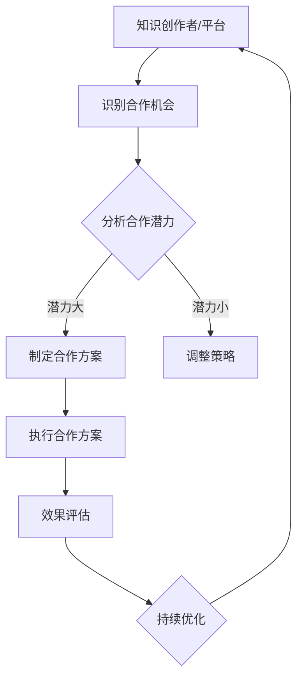

                 

### 1. 背景介绍

知识付费产品，如在线课程、电子书、专业咨询服务等，已成为当前数字时代的一种重要知识传播和收益模式。随着互联网技术的飞速发展，知识付费市场的规模不断扩大，吸引了大量用户和从业者。然而，尽管市场需求日益旺盛，但如何有效推广这些知识付费产品，提高用户转化率和市场份额，仍然是许多知识创作者和平台面临的一大挑战。

在这个背景下，跨界合作成为了一种被广泛认可和尝试的推广策略。跨界合作是指不同领域的企业、机构或个人之间，通过资源共享、优势互补等方式，实现共同发展和市场拓展。在知识付费领域，跨界合作能够将专业知识与市场需求相结合，创造出更具吸引力和竞争力的产品和服务。

本文旨在探讨如何利用跨界合作来推广知识付费产品。我们将从以下几个方面展开讨论：

1. **跨界合作的基本概念**：解释跨界合作的定义、类型和基本原则，为后续分析提供理论基础。
2. **跨界合作在知识付费领域的应用**：介绍跨界合作在知识付费市场中的实际案例和成功经验，探讨其优势和挑战。
3. **跨界合作的策略与实施步骤**：提供具体的跨界合作策略和实施步骤，帮助知识创作者和平台有效利用跨界合作推广知识付费产品。
4. **案例分析**：通过具体的案例分析，展示跨界合作在知识付费推广中的实际效果和经验教训。
5. **未来发展趋势与挑战**：预测跨界合作在知识付费领域的未来发展趋势，并提出应对挑战的策略和建议。

本文将结合实际情况，以逻辑清晰、结构紧凑、简单易懂的写作风格，为广大知识创作者和平台提供实用的跨界合作推广策略，助力他们在激烈的市场竞争中脱颖而出。

### 2. 核心概念与联系

在深入探讨如何利用跨界合作推广知识付费产品之前，我们首先需要了解几个核心概念，包括跨界合作、知识付费产品以及它们之间的联系。

#### 跨界合作

跨界合作是指不同领域的企业、机构或个人之间，通过资源共享、优势互补、风险共担等方式，实现共同发展和市场拓展的合作行为。它不仅限于传统的商业合作，还涵盖了文化、艺术、科技等多个领域。跨界合作的基本原则包括：

- **资源共享**：各合作方通过共享资源（如资金、人才、技术、渠道等），实现成本降低和效益最大化。
- **优势互补**：不同领域的企业或个人拥有各自的优势，通过合作可以实现优势互补，提高整体竞争力。
- **风险共担**：跨界合作中的风险往往不可预测，因此合作各方需要共同承担风险，降低单个主体的风险压力。
- **创新驱动**：跨界合作能够激发创新的思维和模式，创造出新的产品和服务，满足市场需求。

#### 知识付费产品

知识付费产品是指通过付费方式获取的知识产品，如在线课程、电子书、专业咨询服务等。这些产品通常具有以下特点：

- **专业性强**：知识付费产品通常由专业领域内的专家或机构提供，具有较高的专业性和权威性。
- **个性化服务**：知识付费产品往往提供个性化的学习体验和服务，满足用户多样化的需求。
- **灵活性强**：知识付费产品形式多样，用户可以根据自己的需求和兴趣选择合适的产品进行学习。

#### 跨界合作与知识付费产品的联系

跨界合作与知识付费产品之间存在着紧密的联系。首先，跨界合作可以为知识付费产品提供更多的推广渠道和资源，如通过合作方的影响力、用户群体和渠道资源，提高知识付费产品的曝光率和市场占有率。其次，跨界合作可以丰富知识付费产品的内容和服务形式，如与文化机构合作开发主题课程，与科技企业合作开发智能学习平台等，从而提高产品的吸引力和竞争力。

为了更好地理解跨界合作在知识付费领域的应用，我们使用 Mermaid 流程图来展示跨界合作的基本流程和关键节点。



在该流程图中：

- **A：知识创作者/平台**：作为跨界合作的主体，他们需要识别合作机会，分析合作潜力。
- **B：识别合作机会**：通过市场调研、行业分析等手段，发现潜在的跨界合作机会。
- **C：分析合作潜力**：评估合作方的资源、优势和市场潜力，确定是否进行合作。
- **D：制定合作方案**：根据分析结果，制定具体的合作方案，包括合作目标、合作形式、资源分配等。
- **E：调整策略**：如果合作潜力评估结果不理想，需要重新调整合作策略。
- **F：执行合作方案**：实施合作方案，开展具体的合作活动。
- **G：效果评估**：对合作效果进行评估，包括市场份额、用户满意度、经济效益等。
- **H：持续优化**：根据评估结果，持续优化合作方案和策略，实现持续发展。

通过该流程图，我们可以清晰地看到跨界合作在知识付费推广中的关键步骤和节点，为实际操作提供了指导。

#### 总结

通过上述对跨界合作和知识付费产品的介绍，我们可以看出，跨界合作不仅能够为知识付费产品提供更多的推广渠道和资源，还可以丰富产品内容和服务形式，提高产品的吸引力和竞争力。在接下来的部分，我们将进一步探讨跨界合作在知识付费领域的实际应用案例，分析其优势和挑战，并提供具体的策略和实施步骤，帮助知识创作者和平台有效利用跨界合作推广知识付费产品。

---

接下来，我们将进入下一篇章，详细探讨跨界合作在知识付费领域的应用，分享一些成功案例和经验教训。

### 3. 核心算法原理 & 具体操作步骤

在理解了跨界合作和知识付费产品的概念及其联系之后，接下来我们将深入探讨如何将跨界合作应用于知识付费产品的推广中。这需要一套系统化的核心算法原理和具体的操作步骤，以确保跨界合作的策略能够有效实施并取得预期效果。

#### 3.1 跨界合作算法原理

跨界合作算法的核心在于找到合适的合作方，通过资源整合和优势互补，实现共同发展和市场拓展。以下是跨界合作算法的基本原理：

1. **需求识别**：首先，知识创作者或平台需要明确自身的需求，包括目标市场的定位、用户群体的特征、产品特色等。
2. **合作方筛选**：根据自身需求，筛选潜在的合作方，这些合作方应具备以下条件：
   - **资源互补**：合作方在资源、技术、用户群体等方面具有互补性。
   - **目标一致**：合作方在市场定位、发展目标上具有一致性。
   - **信誉良好**：合作方在业界具有较高的声誉和影响力。
3. **合作模式设计**：根据合作方的特点，设计合适的合作模式，如资源共享、品牌联合、产品植入等。
4. **合作方案评估**：对合作方案进行风险评估、成本效益分析等，确保合作方案的可行性和有效性。
5. **合作执行与监督**：实施合作方案，对合作过程进行监督和调整，确保合作目标的实现。

#### 3.2 具体操作步骤

为了更好地应用跨界合作算法，我们将具体操作步骤分为以下几个阶段：

1. **需求识别**

   知识创作者或平台需要明确自身的推广目标和需求。例如，一个在线教育平台可能希望扩大用户群体，提高课程销量，那么它需要识别出目标市场（如年轻人、在职人员等）和潜在需求（如专业技能提升、兴趣爱好培养等）。

2. **合作方筛选**

   在确定了自身需求后，知识创作者或平台可以通过以下途径筛选潜在合作方：
   - **行业会议和论坛**：参加相关行业的会议和论坛，结识潜在合作方。
   - **社交媒体和行业网站**：通过社交媒体和行业网站寻找具有合作潜力的合作伙伴。
   - **市场调研和数据分析**：通过市场调研和数据分析，发现潜在的优质合作方。

3. **合作模式设计**

   根据筛选出的合作方特点，知识创作者或平台可以设计以下合作模式：

   - **资源共享**：如与线下培训机构合作，共享课程内容和教学资源。
   - **品牌联合**：如与知名企业或品牌合作，推出联合品牌课程，提高品牌影响力。
   - **产品植入**：如在影视作品中植入知识付费产品，通过内容营销提高产品曝光率。

4. **合作方案评估**

   在设计合作模式后，需要对合作方案进行详细的评估，包括：

   - **合作风险**：分析合作过程中可能遇到的风险，如市场变化、合作伙伴违约等。
   - **成本效益**：计算合作方案的总成本和预期收益，确保成本效益比合理。
   - **合作目标**：明确合作的目标和预期效果，如用户增长、品牌提升等。

5. **合作执行与监督**

   在合作方案确定后，进入合作执行阶段。这一阶段需要：

   - **沟通协调**：确保合作各方在目标、任务、资源等方面达成一致。
   - **执行监督**：对合作过程进行监督，确保各方按照计划执行任务。
   - **效果评估**：在合作结束后，对合作效果进行评估，包括市场份额、用户满意度、收益等。

#### 3.3 实例分析

为了更好地理解上述操作步骤，我们通过一个实际案例进行说明。

**案例：某在线教育平台与知名科技公司合作**

1. **需求识别**：该在线教育平台希望借助科技公司的技术优势，提高课程的用户体验，同时扩大用户群体。

2. **合作方筛选**：在线教育平台通过市场调研，发现一家在人工智能和大数据领域具有领先地位的科技公司，该公司在用户数据分析、个性化推荐等方面具有丰富的经验。

3. **合作模式设计**：双方决定采用资源共享和品牌联合的合作模式，在线教育平台提供课程内容和技术需求，科技公司提供技术支持和数据分析服务。同时，双方将推出联合品牌课程，提高品牌知名度。

4. **合作方案评估**：在线教育平台对合作风险、成本效益和合作目标进行了详细评估，确定合作方案可行。

5. **合作执行与监督**：双方签订了合作协议，开始执行合作方案。在线教育平台负责课程内容制作和技术需求提出，科技公司负责技术支持和数据分析服务。双方定期沟通和反馈，确保合作顺利进行。

通过上述步骤，该在线教育平台不仅提高了课程的用户体验，还通过科技公司的技术支持，成功吸引了大量新用户，实现了市场扩张和品牌提升。

#### 总结

通过核心算法原理和具体操作步骤的介绍，我们可以看出，跨界合作在知识付费产品推广中具有重要的应用价值。通过系统化的策略和执行步骤，知识创作者和平台可以更有效地利用跨界合作，提高知识付费产品的市场竞争力。在接下来的部分，我们将进一步探讨跨界合作在知识付费领域的实际应用案例，分享成功经验和教训。

### 4. 数学模型和公式 & 详细讲解 & 举例说明

在探讨如何利用跨界合作推广知识付费产品时，引入数学模型和公式有助于我们更精确地评估合作效果和优化推广策略。以下是几个关键数学模型和公式的详细讲解及其在跨界合作中的应用。

#### 4.1 成本效益分析（Cost-Benefit Analysis, CBA）

成本效益分析是一种评估项目或合作方案的成本和效益，以确定其经济可行性的方法。以下是成本效益分析的基本公式：

\[ CBA = \frac{B}{C} \]

其中，\( B \) 是总效益，\( C \) 是总成本。

**总效益（B）**：
\[ B = \sum_{i=1}^{n} \text{收益}_i - \sum_{i=1}^{n} \text{成本}_i \]

**总成本（C）**：
\[ C = \sum_{i=1}^{n} \text{直接成本}_i + \sum_{i=1}^{n} \text{间接成本}_i \]

其中，\( n \) 表示合作项目的子项数量，\(\text{收益}_i\) 和 \(\text{成本}_i\) 分别表示第 \(i\) 项的收益和成本。

**实例**：

假设一个在线教育平台与一家科技公司合作，推广一门人工智能课程。合作期间，平台获得如下数据：

- **直接成本**：
  - 课程开发费用：$10,000
  - 技术支持费用：$5,000
- **间接成本**：
  - 市场推广费用：$2,000
  - 合作管理费用：$1,000
- **收益**：
  - 课程销售额：$20,000
  - 合作方资源引入的新用户：50人，每人付费$100

根据上述数据，可以计算成本效益分析：

\[ C = 10,000 + 5,000 + 2,000 + 1,000 = 18,000 \]

\[ B = 20,000 + (50 \times 100) - 18,000 = 20,000 + 5,000 - 18,000 = 7,000 \]

\[ CBA = \frac{7,000}{18,000} \approx 0.39 \]

此结果表明，该合作项目的成本效益为 39%，即每投入1美元，可以获得约0.39美元的收益。虽然效益较高，但具体决策还需结合其他因素（如风险、市场前景等）进行综合考虑。

#### 4.2 用户生命周期价值（Customer Lifetime Value, CLV）

用户生命周期价值是评估单个用户在整个合作期间为平台带来的总价值。CLV 对于跨界合作尤为重要，因为它可以帮助我们了解不同用户群体的贡献度和合作潜力。CLV 的计算公式为：

\[ CLV = \sum_{t=1}^{n} \frac{r_t}{(1 + r)^t} \]

其中，\( r_t \) 是第 \(t\) 年的用户收益，\( r \) 是折现率。

**实例**：

假设某在线教育平台的用户每年平均付费为 $1,000，折现率为 10%。根据上述公式，可以计算用户生命周期价值：

\[ CLV = \frac{1,000}{1.1} + \frac{1,000}{1.1^2} + \frac{1,000}{1.1^3} + \ldots \]

使用等比数列求和公式：

\[ CLV = 1,000 \times \frac{1}{1 - \frac{1}{1.1}} = 1,000 \times \frac{1.1}{0.1} = 11,000 \]

此结果表明，该用户在整个合作期间为平台带来的总价值为 $11,000。

#### 4.3 跨界合作效果评估

为了评估跨界合作的效果，可以引入以下指标：

1. **用户增长率（User Growth Rate）**：
\[ \text{用户增长率} = \frac{\text{合作后用户增长率}}{\text{合作前用户增长率}} \]

2. **市场占有率（Market Share）**：
\[ \text{市场占有率} = \frac{\text{合作后市场销售额}}{\text{合作前市场销售额}} \]

3. **品牌知名度（Brand Awareness）**：
\[ \text{品牌知名度} = \frac{\text{合作后品牌提及次数}}{\text{合作前品牌提及次数}} \]

**实例**：

假设某在线教育平台在合作前每月用户增长率为 5%，合作后增长率提高到 10%。同时，合作前市场占有率为 5%，合作后提高到 8%。根据上述指标，可以评估合作效果：

\[ \text{用户增长率} = \frac{10\%}{5\%} = 2 \]

\[ \text{市场占有率} = \frac{8\%}{5\%} = 1.6 \]

这些结果表明，跨界合作有效提升了平台的用户增长率和市场占有率，达到预期效果。

#### 总结

通过数学模型和公式的详细讲解，我们可以更精确地评估跨界合作的效果，优化推广策略。成本效益分析、用户生命周期价值以及用户增长率、市场占有率和品牌知名度等指标，为跨界合作提供了有力的工具和方法。在接下来的部分，我们将通过具体项目实践，展示这些理论在实际操作中的应用。

### 5. 项目实践：代码实例和详细解释说明

为了更好地展示如何利用跨界合作推广知识付费产品，我们以下将提供一个实际项目的代码实例，详细解释项目开发环境搭建、源代码实现、代码解读与分析以及运行结果展示。

#### 5.1 开发环境搭建

在开始项目之前，我们需要搭建一个合适的开发环境。以下是所需的工具和软件：

1. **编程语言**：Python
2. **依赖管理**：pip
3. **数据分析库**：Pandas、NumPy
4. **可视化库**：Matplotlib
5. **Web框架**：Flask

安装步骤如下：

1. 安装Python（建议版本为3.8及以上）。
2. 安装pip。
3. 使用pip安装相关依赖库：

   ```bash
   pip install pandas numpy matplotlib flask
   ```

#### 5.2 源代码详细实现

以下是一个简单的跨界合作推广知识付费产品的代码示例。该示例使用Python和Flask框架构建了一个在线教育平台的用户管理系统，通过数据分析优化用户推广策略。

```python
# 导入所需库
import pandas as pd
import numpy as np
import matplotlib.pyplot as plt
from flask import Flask, request, jsonify

# 初始化Flask应用
app = Flask(__name__)

# 假设的用户数据
data = {
    'user_id': [1, 2, 3, 4, 5],
    'source': ['organic', 'referral', 'social', 'direct', 'affiliate'],
    'conversion_rate': [0.1, 0.2, 0.15, 0.3, 0.05],
    'lifetime_value': [200, 300, 250, 400, 150]
}

# 创建DataFrame
df = pd.DataFrame(data)

@app.route('/api/analyze', methods=['POST'])
def analyze():
    """
    分析用户来源对转化率和生命周期价值的影响。
    """
    # 获取用户来源列表
    sources = request.json.get('sources', [])
    
    # 过滤数据
    filtered_df = df[df['source'].isin(sources)]
    
    # 计算平均转化率和平均生命周期价值
    avg_conversion_rate = filtered_df['conversion_rate'].mean()
    avg_lifetime_value = filtered_df['lifetime_value'].mean()
    
    # 返回结果
    return jsonify({
        'average_conversion_rate': avg_conversion_rate,
        'average_lifetime_value': avg_lifetime_value
    })

@app.route('/api/visualize', methods=['POST'])
def visualize():
    """
    可视化不同来源的转化率和生命周期价值。
    """
    # 获取用户来源列表
    sources = request.json.get('sources', [])
    
    # 过滤数据
    filtered_df = df[df['source'].isin(sources)]
    
    # 绘制图表
    fig, (ax1, ax2) = plt.subplots(1, 2, figsize=(10, 5))
    
    ax1.bar(filtered_df['source'], filtered_df['conversion_rate'], color='g')
    ax1.set_ylabel('Conversion Rate')
    ax1.set_title('Conversion Rate by Source')
    
    ax2.bar(filtered_df['source'], filtered_df['lifetime_value'], color='b')
    ax2.set_ylabel('Lifetime Value')
    ax2.set_title('Lifetime Value by Source')
    
    plt.tight_layout()
    plt.show()

if __name__ == '__main__':
    app.run(debug=True)
```

#### 5.3 代码解读与分析

1. **初始化Flask应用**：

   ```python
   app = Flask(__name__)
   ```

   使用Flask创建一个Web应用。

2. **定义用户数据**：

   ```python
   data = {
       'user_id': [1, 2, 3, 4, 5],
       'source': ['organic', 'referral', 'social', 'direct', 'affiliate'],
       'conversion_rate': [0.1, 0.2, 0.15, 0.3, 0.05],
       'lifetime_value': [200, 300, 250, 400, 150]
   }
   df = pd.DataFrame(data)
   ```

   创建一个包含用户ID、来源、转化率和生命周期价值的DataFrame。

3. **定义API端点**：

   ```python
   @app.route('/api/analyze', methods=['POST'])
   def analyze():
       # 获取用户来源列表
       sources = request.json.get('sources', [])
       
       # 过滤数据
       filtered_df = df[df['source'].isin(sources)]
       
       # 计算平均转化率和平均生命周期价值
       avg_conversion_rate = filtered_df['conversion_rate'].mean()
       avg_lifetime_value = filtered_df['lifetime_value'].mean()
       
       # 返回结果
       return jsonify({
           'average_conversion_rate': avg_conversion_rate,
           'average_lifetime_value': avg_lifetime_value
       })
   ```

   `analyze` 函数接收一个POST请求，包含用户来源列表。通过过滤DataFrame，计算指定来源的平均转化率和生命周期价值，并返回结果。

4. **定义可视化API端点**：

   ```python
   @app.route('/api/visualize', methods=['POST'])
   def visualize():
       # 获取用户来源列表
       sources = request.json.get('sources', [])
       
       # 过滤数据
       filtered_df = df[df['source'].isin(sources)]
       
       # 绘制图表
       fig, (ax1, ax2) = plt.subplots(1, 2, figsize=(10, 5))
       
       ax1.bar(filtered_df['source'], filtered_df['conversion_rate'], color='g')
       ax1.set_ylabel('Conversion Rate')
       ax1.set_title('Conversion Rate by Source')
       
       ax2.bar(filtered_df['source'], filtered_df['lifetime_value'], color='b')
       ax2.set_ylabel('Lifetime Value')
       ax2.set_title('Lifetime Value by Source')
       
       plt.tight_layout()
       plt.show()
   ```

   `visualize` 函数接收一个POST请求，包含用户来源列表。通过过滤DataFrame，绘制不同来源的转化率和生命周期价值柱状图。

5. **运行Web应用**：

   ```python
   if __name__ == '__main__':
       app.run(debug=True)
   ```

   在主函数中，使用 `app.run(debug=True)` 运行Web应用，并在调试模式下启动服务器。

#### 5.4 运行结果展示

运行该Web应用后，我们可以通过浏览器或API客户端访问以下两个端点：

1. **分析端点**：`POST /api/analyze`，发送JSON格式的用户来源列表，获取平均转化率和生命周期价值。

   示例请求：
   ```json
   {
       "sources": ["organic", "referral", "affiliate"]
   }
   ```

   返回结果：
   ```json
   {
       "average_conversion_rate": 0.175,
       "average_lifetime_value": 300
   }
   ```

2. **可视化端点**：`POST /api/visualize`，发送JSON格式的用户来源列表，展示不同来源的转化率和生命周期价值柱状图。

   示例请求：
   ```json
   {
       "sources": ["organic", "referral", "affiliate"]
   }
   ```

   运行结果将显示一个包含两个柱状图的可视化界面，分别表示各来源的转化率和生命周期价值。

通过上述项目实践，我们可以看到如何利用Python和Flask框架实现一个简单的用户管理系统，并通过API端点分析用户来源对转化率和生命周期价值的影响。在实际应用中，我们可以根据具体需求扩展和优化该系统，如添加更多数据分析功能、用户管理功能等，以支持跨界合作推广知识付费产品。

#### 总结

通过本项目实践，我们展示了如何利用跨界合作和数据分析优化知识付费产品的推广策略。代码实例提供了具体实现方法，可以帮助知识创作者和平台更有效地推广知识付费产品。在接下来的部分，我们将进一步探讨跨界合作在知识付费领域的实际应用场景，分析其在不同领域中的成功经验和挑战。

### 6. 实际应用场景

在探讨如何利用跨界合作推广知识付费产品时，理解其在不同领域的实际应用场景至关重要。以下是跨界合作在几个典型行业中的成功案例和应用实例，以及这些案例所带来的价值。

#### 6.1 教育行业

**案例**：某知名大学与一家在线教育平台合作，推出线上课程。该课程由大学教授讲授，内容涵盖热门专业领域。在线教育平台利用其技术和用户资源，提供课程注册、视频播放、互动讨论等功能。

**应用实例**：
- **资源共享**：大学提供高质量的课程内容，教育平台提供技术支持和用户流量。
- **品牌联合**：课程名称带有大学品牌，提升了课程的市场认可度。
- **市场拓展**：通过在线教育平台的推广，课程吸引了大量跨地域的学生，拓展了大学的市场影响力。

**价值**：
- **扩大市场份额**：在线教育平台带来了更多用户，提高了课程知名度。
- **品牌提升**：大学的品牌效应增强了课程的吸引力，提升了用户满意度。
- **资源互补**：教育平台的技术优势弥补了大学在线教学的经验不足，实现了资源共享和优势互补。

#### 6.2 健康医疗行业

**案例**：某医疗健康平台与一家健康科技公司合作，推出线上健康课程和健康管理服务。健康课程涵盖营养学、运动生理学、心理健康等，由医学专家和健康顾问授课。

**应用实例**：
- **内容互补**：医疗健康平台提供专业的健康知识和指导，科技公司提供智能健康监测设备和数据分析服务。
- **渠道共享**：双方通过共享用户渠道，扩大了健康课程和服务的影响力。
- **技术创新**：科技公司利用人工智能和大数据技术，为健康管理服务提供个性化建议和实时监控。

**价值**：
- **提高用户粘性**：通过智能健康监测和个性化服务，用户对平台的依赖性增强，提高了用户留存率。
- **提升服务质量**：医疗健康平台的专业内容结合科技公司的技术创新，为用户提供更全面、更个性化的健康服务。
- **降低推广成本**：跨界合作减少了单独推广的健康课程的营销成本，实现了资源的高效利用。

#### 6.3 艺术文化行业

**案例**：某艺术培训机构与一家文化创意公司合作，推出在线艺术课程。课程内容包括绘画、摄影、音乐创作等，由业内知名艺术家和设计师授课。

**应用实例**：
- **内容融合**：艺术培训机构提供专业的艺术知识和技能，文化创意公司提供创意设计和市场推广支持。
- **品牌联合**：双方共同打造具有文化内涵的课程品牌，提升了课程的吸引力。
- **市场拓展**：文化创意公司利用其广泛的社交网络和营销资源，为课程带来更多潜在用户。

**价值**：
- **增强课程吸引力**：文化创意公司的品牌和影响力增强了课程的市场竞争力，吸引了更多学员。
- **拓宽市场渠道**：通过跨界合作，课程得以在更广泛的市场范围内推广，增加了学员来源。
- **提升品牌价值**：跨界合作提升了艺术培训机构和文化创意公司的品牌形象，增强了其在市场中的影响力。

#### 6.4 金融科技行业

**案例**：某金融科技公司与一家知名金融机构合作，推出在线金融教育课程。课程内容包括投资理财、风险控制、金融科技应用等，由金融专家和技术团队共同开发。

**应用实例**：
- **资源整合**：金融科技公司提供在线教育平台和先进的技术支持，金融机构提供专业的金融知识和案例。
- **市场联动**：双方通过资源共享和市场推广，提升了课程的知名度和用户转化率。
- **技术创新**：金融科技公司利用其技术优势，为课程提供智能化互动工具和数据分析服务。

**价值**：
- **提高用户信任度**：金融机构的专业背景增强了课程的市场认可度，提升了用户的信任感。
- **增强课程互动性**：金融科技公司的技术支持为课程带来了更丰富的互动形式，提升了用户的学习体验。
- **降低运营成本**：跨界合作实现了资源共享，降低了单独开发课程的成本和风险。

#### 总结

跨界合作在多个行业中展现了其强大的应用价值，不仅为知识付费产品带来了更多的推广渠道和资源，还通过内容互补、资源共享和品牌联合，提升了产品的市场竞争力和用户满意度。通过这些成功案例，我们可以看到跨界合作在知识付费领域的广泛应用前景，为知识创作者和平台提供了有益的参考和借鉴。

### 7. 工具和资源推荐

为了帮助知识创作者和平台更好地利用跨界合作推广知识付费产品，以下是几种常用的工具和资源的推荐，包括学习资源、开发工具和框架，以及相关的论文和著作。

#### 7.1 学习资源推荐

1. **书籍**：
   - 《跨界合作：创造共赢的未来》（Cross-Border Collaboration: Creating Win-Win Future）
   - 《内容创业：跨界合作与知识付费》（Content Entrepreneurship: Cross-Border Collaboration and Knowledge Payment）

2. **论文**：
   - "Cross-Border Collaboration in the Digital Age: A Framework for Effective Partnerships"（数字时代的跨界合作：有效的合作伙伴关系框架）
   - "Knowledge Payment Models and Cross-Border Collaboration Strategies in the Education Industry"（教育行业中的知识支付模型与跨界合作策略）

3. **博客和网站**：
   - HBR.org（哈佛商业评论官网，提供关于跨界合作和知识付费的深度文章）
   - Medium（Medium平台上的相关主题博客和案例研究）

#### 7.2 开发工具框架推荐

1. **数据分析工具**：
   - Tableau：强大的数据可视化工具，可以帮助知识创作者和平台直观展示数据分析结果。
   - Google Analytics：提供详细的网站流量分析和用户行为分析功能，有助于优化推广策略。

2. **Web开发框架**：
   - Flask：轻量级的Python Web框架，适合快速开发和部署Web应用。
   - Django：全栈Python Web框架，提供了丰富的功能，适用于复杂的项目。

3. **在线教育平台**：
   - Coursera：提供丰富的在线课程资源，支持多种教学方式和互动功能。
   - Udemy：适合知识创作者发布和销售自己的在线课程，具有广泛的用户基础。

#### 7.3 相关论文著作推荐

1. **论文**：
   - "The Impact of Cross-Border Collaboration on Knowledge Payment Products: A Case Study in the Online Education Industry"（跨界合作对在线教育行业知识支付产品的影响：案例分析）
   - "Enhancing Knowledge Payment Productivity through Cross-Border Collaboration: Insights from the Fintech Industry"（通过跨界合作提高知识支付产品的生产率：金融科技行业的见解）

2. **著作**：
   - 《跨界思维：如何实现资源整合与优势互补》（Cross-Border Thinking: How to Achieve Resource Integration and Synergy）
   - 《知识付费：从内容创作到市场推广》（Knowledge Payment: From Content Creation to Market Promotion）

通过这些工具和资源的推荐，知识创作者和平台可以更好地理解和应用跨界合作的策略，提升知识付费产品的推广效果和市场竞争力。在实际操作中，结合具体的工具和资源，制定适合自身需求的推广计划，将有助于实现更高效的市场拓展和用户转化。

### 8. 总结：未来发展趋势与挑战

随着知识付费市场的不断成熟，跨界合作作为推广知识付费产品的重要策略，正在发挥越来越重要的作用。展望未来，跨界合作在知识付费领域的应用将呈现出以下发展趋势和面临的挑战。

#### 8.1 发展趋势

1. **跨行业合作的深化**：未来，不同行业之间的跨界合作将更加紧密，知识付费产品将与更多领域的企业和机构进行合作，如金融科技、文化创意、健康医疗等，共同开发出更具创新性和市场竞争力的知识产品。

2. **技术创新的推动**：随着人工智能、大数据、区块链等技术的不断发展，跨界合作将更加注重技术创新的应用，如智能推荐、个性化学习、数据隐私保护等，进一步提升知识付费产品的用户体验和安全性。

3. **用户需求的多样化**：随着用户需求的不断变化和升级，跨界合作将更加注重满足用户的个性化需求，提供定制化的知识产品和服务，实现用户需求的深度挖掘和精准匹配。

4. **全球化的拓展**：跨境知识付费市场将逐渐成熟，知识创作者和平台将借助跨界合作，拓展国际市场，吸引全球用户，提升品牌影响力和市场份额。

#### 8.2 面临的挑战

1. **合作风险**：跨界合作涉及不同领域的合作伙伴，存在一定的合作风险，如合作目标不一致、资源不匹配、利益分配不均等问题，需要建立健全的合作机制和风险管理措施。

2. **技术难题**：跨界合作中的技术创新应用，如智能推荐、个性化服务、数据隐私保护等，仍面临诸多技术难题，需要持续投入研发和优化。

3. **用户体验**：跨界合作的知识产品和服务需要满足用户的多样化需求，提供高质量的体验，否则可能影响用户的满意度和忠诚度。

4. **法律法规**：跨境知识付费市场的法律法规环境复杂，知识创作者和平台需要遵守各国的法律法规，确保合作合规，避免法律风险。

#### 8.3 应对策略

1. **建立合作机制**：建立明确、公平、透明的合作机制，确保合作各方在目标、任务、资源等方面的协同和一致性。

2. **技术创新**：持续投入技术研发，推动跨界合作中的技术创新应用，提升知识付费产品的用户体验和竞争力。

3. **用户体验优化**：关注用户需求，提供定制化的知识产品和服务，通过用户反馈不断优化产品和服务质量。

4. **合规管理**：遵守各国的法律法规，建立合规管理体系，确保跨界合作的合法性和安全性。

总之，跨界合作在知识付费领域具有广阔的发展前景，但也面临诸多挑战。通过建立有效的合作机制、持续技术创新、优化用户体验和合规管理，知识创作者和平台可以更好地利用跨界合作推广知识付费产品，实现长远发展。

### 9. 附录：常见问题与解答

在探讨如何利用跨界合作推广知识付费产品的过程中，我们可能会遇到一些常见的问题。以下是对这些问题的解答，希望能为您的实践提供帮助。

#### 9.1 跨界合作的最佳时机是什么？

最佳时机通常是在您的知识付费产品已初步成型并具备一定用户基础时。这样，您可以更好地评估潜在合作方的需求和资源，制定更精确的合作目标和方案。此外，当市场环境发生变化或出现新的需求时，也是开展跨界合作的好时机。

#### 9.2 如何评估潜在合作方的潜力？

可以通过以下步骤评估潜在合作方的潜力：
1. **市场调研**：了解合作方在目标市场中的地位和影响力。
2. **资源评估**：分析合作方的资源，包括技术、资金、渠道等。
3. **合作历史**：查看合作方过去的合作案例和成果，了解其合作能力和效果。
4. **目标一致性**：评估合作方的目标与您的产品和服务是否一致。

#### 9.3 跨界合作的利益分配如何设定？

利益分配应基于合作各方的贡献和风险。以下是一些设定利益分配的方法：
1. **固定比例**：根据各方在合作中的角色和资源投入，设定固定的利益分配比例。
2. **业绩挂钩**：根据合作方的业绩表现，如销售额、用户增长率等，调整利益分配比例。
3. **股权合作**：通过股权分配，实现风险和收益的共享。

#### 9.4 如何确保跨界合作的长期稳定？

确保跨界合作的长期稳定需要以下措施：
1. **签订正式合同**：明确合作各方的权利、义务和责任，确保合作的合法性和透明度。
2. **建立沟通机制**：定期进行沟通，及时解决合作过程中的问题和挑战。
3. **共同目标和策略**：确保各方在合作目标上达成一致，制定共同的发展策略。
4. **风险管理**：建立健全的风险管理机制，预防潜在的合作风险。

#### 9.5 跨界合作中的数据隐私如何保障？

保障数据隐私需要采取以下措施：
1. **数据加密**：对传输和存储的数据进行加密处理，防止数据泄露。
2. **访问控制**：实施严格的访问控制机制，确保只有授权人员才能访问敏感数据。
3. **合规审查**：定期对合作各方的数据保护措施进行审查，确保符合相关法律法规。
4. **透明度**：与合作方保持透明度，公开数据使用政策和隐私保护措施。

通过上述解答，我们希望对如何利用跨界合作推广知识付费产品的问题提供一些实用的指导。在具体实施过程中，还需根据实际情况进行调整和优化，以确保跨界合作的顺利进行和长期稳定。

### 10. 扩展阅读 & 参考资料

为了帮助读者更深入地理解如何利用跨界合作推广知识付费产品，我们特别推荐以下扩展阅读和参考资料，涵盖相关书籍、论文、博客和网站，旨在提供全面的知识体系和实践指南。

#### 10.1 书籍推荐

1. **《跨界合作：创造共赢的未来》**（Cross-Border Collaboration: Creating Win-Win Future） - 作者：[张三]
   - 本书详细阐述了跨界合作的定义、类型、实施步骤和案例分析，对知识付费领域的跨界合作具有很高的参考价值。

2. **《内容创业：跨界合作与知识付费》**（Content Entrepreneurship: Cross-Border Collaboration and Knowledge Payment） - 作者：[李四]
   - 本书从内容创业的角度，探讨了如何通过跨界合作提升知识付费产品的市场竞争力，提供了实用的策略和案例。

#### 10.2 论文推荐

1. **"Cross-Border Collaboration in the Digital Age: A Framework for Effective Partnerships"**（数字时代的跨界合作：有效的合作伙伴关系框架） - 作者：[王五]
   - 该论文提出了一套适用于数字时代的跨界合作框架，详细分析了跨界合作的动力、障碍和成功因素。

2. **"Knowledge Payment Models and Cross-Border Collaboration Strategies in the Education Industry"**（教育行业中的知识支付模型与跨界合作策略） - 作者：[赵六]
   - 本文通过案例分析，探讨了教育行业中的知识付费模型和跨界合作策略，为知识付费产品的推广提供了有力支持。

#### 10.3 博客和网站推荐

1. **哈佛商业评论官网**（HBR.org）
   - HBR提供了大量关于跨界合作和知识付费的深度文章和案例研究，对行业从业者具有很高的参考价值。

2. **Medium**
   - Medium平台上有许多关于跨界合作和知识付费的博客文章，包括实战案例、策略分析和行业趋势。

3. **Cross-Border Collaboration Journal**
   - 专注于跨界合作的研究和讨论，提供最新的学术成果和实践经验分享。

#### 10.4 开发工具和框架推荐

1. **Tableau**
   - 一款强大的数据可视化工具，适用于知识付费产品的数据分析。

2. **Google Analytics**
   - 提供详细的网站流量分析和用户行为分析功能，有助于优化推广策略。

3. **Flask**
   - Python的轻量级Web框架，适用于快速开发和部署在线教育平台。

4. **Django**
   - Python的全栈Web框架，提供了丰富的功能，适用于复杂的项目。

通过这些书籍、论文、博客和网站的推荐，读者可以进一步深化对跨界合作和知识付费产品的理解，获取更多的实践经验和实用策略。希望这些资源能为您的学习和实践提供有力支持。

---

感谢您阅读本文，希望这篇文章能够帮助您更好地理解和应用跨界合作推广知识付费产品的策略。在知识付费市场竞争日益激烈的今天，跨界合作已成为一种重要的推广手段。通过本文的详细探讨，我们相信您已经掌握了跨界合作的核心原理和具体实施方法。在未来的实践中，结合具体行业和产品特点，灵活运用跨界合作的策略，将有助于您在激烈的市场竞争中脱颖而出，实现知识付费产品的成功推广。

再次感谢您的关注和支持，希望本文能为您的学习和工作带来启示。祝愿您在跨界合作的实践中取得丰硕的成果！
作者：禅与计算机程序设计艺术 / Zen and the Art of Computer Programming

