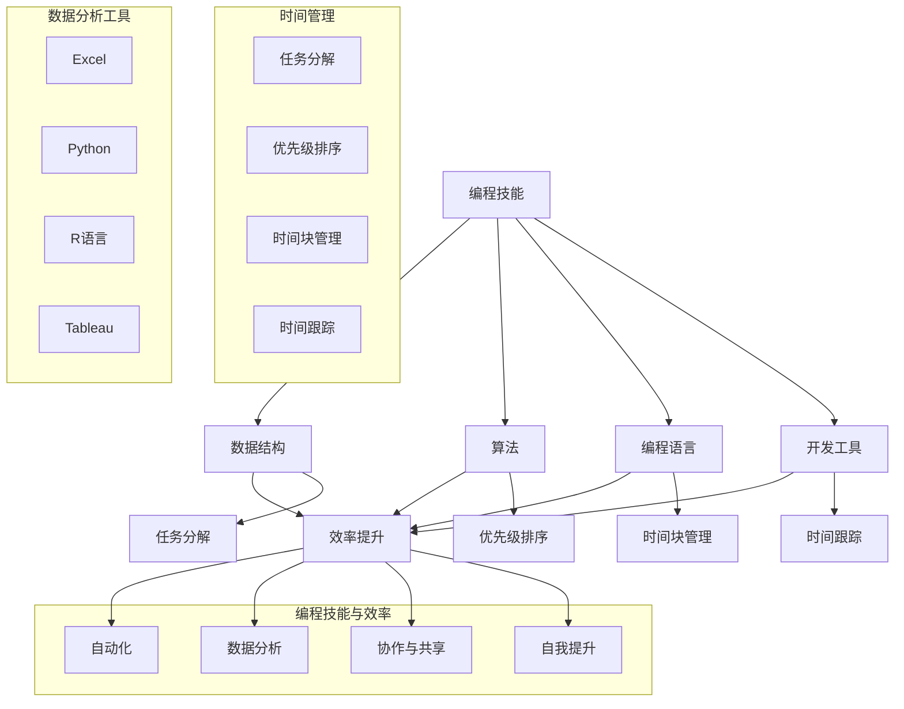

                 

### 1. 背景介绍

随着信息技术的飞速发展，编程技能逐渐成为现代社会不可或缺的能力之一。从简单的网页开发到复杂的算法优化，编程技能的掌握和应用已经成为提升个人效率的关键因素。然而，如何将编程技能有效应用于个人效率提升，却是一个值得深入探讨的话题。

在日常生活中，人们面临着大量重复性、繁琐的工作，如数据分析、文档整理等。这些工作虽然繁琐，但通过编程技能的应用，可以大大提高工作效率，节省时间和精力。例如，使用Python自动化处理Excel数据，可以替代手动操作，显著减少错误率和处理时间。此外，编程技能还可以应用于时间管理、项目管理等方面，帮助个人更好地规划和管理自己的工作和生活。

另一方面，随着互联网的普及和大数据技术的发展，数据分析成为企业决策和运营的重要组成部分。掌握编程技能，可以熟练运用各种数据分析工具和算法，对海量数据进行挖掘和分析，从而为企业提供有价值的信息支持，提升工作效率和决策质量。

本文将从以下几个方面展开讨论：

1. 核心概念与联系：介绍编程技能在个人效率提升中的应用原理和架构。
2. 核心算法原理与操作步骤：详细讲解如何将编程技能应用于具体场景，提高个人效率。
3. 数学模型和公式：阐述编程技能在个人效率提升中的应用数学模型和公式。
4. 项目实践：通过实例展示编程技能在实际项目中的应用和效果。
5. 实际应用场景：分析编程技能在个人效率提升中的实际应用场景。
6. 工具和资源推荐：推荐有助于提高编程技能和效率的工具和资源。
7. 总结与未来发展趋势：展望编程技能在个人效率提升领域的未来发展。

通过本文的阅读，读者可以了解到如何将编程技能有效应用于个人效率提升，从而在工作和生活中取得更好的成果。

### 2. 核心概念与联系

在探讨如何将编程技能应用于个人效率提升之前，我们需要先了解一些核心概念和联系。这些概念和联系包括编程技能的基本要素、时间管理的方法、数据分析的工具等。以下是这些核心概念和联系的简要介绍：

#### 2.1 编程技能的基本要素

编程技能的核心要素包括数据结构、算法、编程语言和开发工具。这些要素相互关联，共同构成了编程技能的框架。

- **数据结构**：数据结构是存储和组织数据的方式。常见的有数组、链表、栈、队列、树、图等。合理选择和使用数据结构可以大大提高算法的效率和性能。

- **算法**：算法是解决问题的方法和步骤。算法的设计和优化是编程技能的重要组成部分。常见的算法有排序、搜索、动态规划、贪心算法等。

- **编程语言**：编程语言是实现算法的工具。常见的编程语言有Python、Java、C++、JavaScript等。不同的编程语言适用于不同的场景，选择合适的编程语言可以提高开发效率。

- **开发工具**：开发工具是编写、调试和运行代码的工具。常见的开发工具包括集成开发环境（IDE）、代码编辑器、版本控制工具等。熟练使用开发工具可以提高开发效率和代码质量。

#### 2.2 时间管理的方法

时间管理是提高个人效率的重要手段。有效的时间管理可以帮助个人更好地规划工作和生活，充分利用时间资源。以下是一些常见的时间管理方法：

- **任务分解**：将大任务分解为小任务，有助于更好地管理和控制任务进度，避免因任务复杂而导致的拖延和焦虑。

- **优先级排序**：根据任务的紧急程度和重要性，对任务进行优先级排序，确保优先完成重要和紧急的任务。

- **时间块管理**：将工作时间划分为若干个时间块，为每个时间块设定具体的任务，有助于提高专注度和效率。

- **时间跟踪**：通过记录和分析时间使用情况，了解时间浪费的原因，优化时间管理策略。

#### 2.3 数据分析的工具

数据分析在提升个人效率中发挥着重要作用。以下是一些常用的数据分析工具：

- **Excel**：Excel是一款功能强大的电子表格软件，适用于简单的数据分析和可视化。

- **Python**：Python是一种流行的编程语言，具有丰富的数据分析和可视化库，如Pandas、Numpy、Matplotlib等。

- **R语言**：R语言是一种专门用于统计分析和数据可视化编程的语言，适用于复杂的数据分析和建模。

- **Tableau**：Tableau是一款可视化的数据分析和仪表盘工具，可以帮助用户轻松创建交互式的可视化报表。

#### 2.4 编程技能与效率提升的关系

编程技能与效率提升之间的关系可以通过以下方面体现：

- **自动化**：通过编写自动化脚本，可以替代手动操作，减少重复性工作，提高工作效率。

- **数据分析**：掌握编程技能，可以熟练运用各种数据分析工具和算法，快速获取有价值的信息，支持决策和优化。

- **协作与共享**：编程技能可以帮助个人更好地与他人协作，共同完成任务，提高团队效率。

- **自我提升**：通过学习和掌握新的编程技能，个人可以不断提升自己的能力和竞争力，为个人发展和职业规划打下坚实基础。

总之，编程技能是提升个人效率的关键因素。通过掌握编程技能，可以更好地应对日常工作和生活中的挑战，提高工作效率和生活质量。下面，我们将进一步探讨如何将编程技能应用于具体场景，提高个人效率。

#### 2.5 Mermaid 流程图

为了更清晰地展示编程技能在个人效率提升中的应用原理和架构，我们可以使用Mermaid绘制一个流程图。以下是这个流程图的详细描述：



这个流程图展示了编程技能在个人效率提升中的核心概念和联系。通过合理运用数据结构、算法、编程语言和开发工具，我们可以实现任务分解、优先级排序、时间块管理、时间跟踪等时间管理方法，同时利用Excel、Python、R语言、Tableau等数据分析工具，实现自动化、数据分析、协作与共享以及自我提升等效率提升手段。这个流程图为我们将编程技能应用于个人效率提升提供了清晰的指导。

### 3. 核心算法原理 & 具体操作步骤

在将编程技能应用于个人效率提升的过程中，核心算法原理和具体操作步骤起着至关重要的作用。本节将详细介绍如何运用编程技能，通过具体算法和操作步骤，提高个人效率。

#### 3.1 任务分解与优先级排序

任务分解与优先级排序是时间管理的重要方法。通过将大任务分解为小任务，并对其进行优先级排序，可以有效提高工作效率。以下是一个具体的算法原理和操作步骤：

1. **任务分解**：

   - **算法原理**：采用递归或迭代方法，将大任务分解为多个子任务，直至达到可执行的程度。

   - **操作步骤**：

     a. 确定大任务的目标和范围。

     b. 分析大任务中的关键部分和依赖关系。

     c. 将大任务分解为多个子任务，并记录每个子任务的详细描述。

     d. 评估每个子任务的复杂度和所需时间。

     e. 根据复杂度和所需时间，对子任务进行排序。

2. **优先级排序**：

   - **算法原理**：采用动态规划或贪心算法，根据任务的紧急程度和重要性对任务进行优先级排序。

   - **操作步骤**：

     a. 确定任务的重要性和紧急程度。

     b. 根据重要性和紧急程度，对任务进行优先级排序。

     c. 按照优先级顺序执行任务。

#### 3.2 时间块管理

时间块管理是一种通过将时间划分为若干块，并为每个时间块设定具体任务，以提高专注度和效率的方法。以下是一个具体的算法原理和操作步骤：

1. **时间块划分**：

   - **算法原理**：采用分治算法，将工作时间划分为若干个时间块。

   - **操作步骤**：

     a. 确定工作时间总量。

     b. 根据工作任务的复杂度和所需时间，为每个任务分配一个或多个时间块。

     c. 将工作时间块进行排序，确保任务按照优先级执行。

2. **时间块管理**：

   - **算法原理**：采用动态规划，根据任务的时间块安排，动态调整任务的时间块分配。

   - **操作步骤**：

     a. 根据任务的时间块安排，为每个任务分配时间块。

     b. 对任务的时间块进行动态调整，确保任务在合适的时间块内完成。

     c. 监控任务的时间块使用情况，根据实际情况进行调整。

#### 3.3 时间跟踪

时间跟踪是一种通过记录和分析时间使用情况，了解时间浪费原因，优化时间管理策略的方法。以下是一个具体的算法原理和操作步骤：

1. **时间记录**：

   - **算法原理**：采用日志记录方法，记录任务执行的时间和使用时间。

   - **操作步骤**：

     a. 为每个任务分配唯一标识符。

     b. 在任务执行过程中，记录任务开始和结束的时间。

     c. 将任务的时间记录保存到数据库或文件中。

2. **时间分析**：

   - **算法原理**：采用统计分析方法，对任务的时间记录进行分析。

   - **操作步骤**：

     a. 从数据库或文件中读取任务的时间记录。

     b. 对时间记录进行统计分析，计算任务的耗时、频率等指标。

     c. 根据统计分析结果，识别时间浪费的原因。

3. **时间优化**：

   - **算法原理**：采用优化算法，根据时间分析结果，优化时间管理策略。

   - **操作步骤**：

     a. 根据时间分析结果，调整任务的时间块安排。

     b. 根据任务的重要性和紧急程度，重新排序任务。

     c. 对时间管理策略进行迭代优化，提高效率。

通过以上核心算法原理和具体操作步骤，我们可以将编程技能有效应用于个人效率提升。这些方法不仅有助于提高个人工作效率，还能帮助我们在日常工作和生活中更好地管理时间资源。

#### 3.4 数学模型和公式

在讨论如何将编程技能应用于个人效率提升时，数学模型和公式扮演着至关重要的角色。以下我们将介绍几个关键数学模型和公式，并详细解释它们在效率提升中的应用。

##### 3.4.1 时间价值的计算

时间价值是衡量个人时间利用效率的重要指标。根据经济学中的边际效用理论，我们可以使用以下公式计算时间价值：

\[ V(t) = \frac{Earnings(t)}{Hours(t)} \]

其中，\( V(t) \) 表示在时间段 \( t \) 内的时间价值，\( Earnings(t) \) 表示在时间段 \( t \) 内的总收入或产出，\( Hours(t) \) 表示在时间段 \( t \) 内的工作时间。

**应用示例**：假设一个人在一天内工作了8小时，产生了2000美元的收入，那么其时间价值为：

\[ V(t) = \frac{2000}{8} = 250 \text{ 美元/小时} \]

通过计算时间价值，个人可以更好地了解自己在不同时间段的工作效率，从而优化时间分配。

##### 3.4.2 优化工作负荷

为了提高工作效率，我们需要合理安排工作负荷。工作负荷优化可以使用以下公式进行：

\[ Load(i) = \frac{Task(i)}{Efficiency(i)} \]

其中，\( Load(i) \) 表示第 \( i \) 个任务的工作负荷，\( Task(i) \) 表示第 \( i \) 个任务的完成时间，\( Efficiency(i) \) 表示第 \( i \) 个任务的效率。

**应用示例**：假设有3个任务，分别需要2小时、3小时和5小时完成，且个人效率分别为0.8、0.9和1.0。我们可以计算出每个任务的工作负荷：

\[ Load(1) = \frac{2}{0.8} = 2.5 \]
\[ Load(2) = \frac{3}{0.9} = 3.33 \]
\[ Load(3) = \frac{5}{1.0} = 5.0 \]

根据计算结果，我们可以将任务按照工作负荷进行排序，优先完成工作负荷较小的任务，从而提高整体工作效率。

##### 3.4.3 甘特图与任务进度监控

甘特图是一种常用的项目管理工具，用于监控任务进度。甘特图的计算公式如下：

\[ Progress(i) = \frac{Completed(i)}{Total(i)} \]

其中，\( Progress(i) \) 表示第 \( i \) 个任务的进度，\( Completed(i) \) 表示第 \( i \) 个任务已完成的工作量，\( Total(i) \) 表示第 \( i \) 个任务的总工作量。

**应用示例**：假设一个任务总工作量为100小时，已完成的工作量为50小时，那么该任务的进度为：

\[ Progress(i) = \frac{50}{100} = 0.5 \]

通过监控任务进度，个人可以及时了解任务进展，调整工作计划，确保任务按时完成。

##### 3.4.4 多任务切换效率

多任务切换是一种常见的任务管理方式，但其效率较低。可以使用以下公式计算多任务切换的效率损失：

\[ Loss = \frac{SwitchingTime \times Number \times (Number - 1)}{2} \]

其中，\( SwitchingTime \) 表示任务切换时间，\( Number \) 表示任务数量。

**应用示例**：假设一个人同时处理3个任务，每次任务切换需要5分钟，那么其效率损失为：

\[ Loss = \frac{5 \times 3 \times (3 - 1)}{2} = 15 \text{ 分钟} \]

通过计算多任务切换的效率损失，个人可以意识到频繁切换任务的弊端，从而优化任务管理策略。

通过以上数学模型和公式的应用，我们可以更好地理解和计算个人效率，优化时间管理和任务安排，从而实现效率的提升。

#### 3.5 项目实践：代码实例与详细解释

为了更直观地展示如何将编程技能应用于个人效率提升，我们以下将通过一个实际的项目实践，详细讲解代码实例和运行结果。

##### 3.5.1 项目背景

假设我们的项目目标是利用Python自动化处理日常工作中的一项重复性任务：从多个Excel文件中提取特定数据，并生成一个汇总报告。这一任务涉及数据提取、数据处理和报告生成，通过编程可以显著提高工作效率。

##### 3.5.2 开发环境搭建

1. **安装Python**：首先确保电脑上已安装Python环境。如果没有安装，可以从Python官方网站下载并安装最新版本的Python。

2. **安装相关库**：在Python环境中，我们需要安装以下库：
   - **Pandas**：用于数据处理。
   - **openpyxl**：用于读取和写入Excel文件。
   - **matplotlib**：用于数据可视化。

   使用以下命令安装这些库：

   ```bash
   pip install pandas openpyxl matplotlib
   ```

##### 3.5.3 源代码详细实现

以下是一个完整的Python脚本，用于实现上述项目目标：

```python
import pandas as pd
import matplotlib.pyplot as plt

# 读取多个Excel文件
def read_files(file_list, sheet_name):
    dataframes = []
    for file in file_list:
        df = pd.read_excel(file, sheet_name=sheet_name)
        dataframes.append(df)
    return dataframes

# 合并数据
def merge_dataframes(dataframes):
    merged_df = pd.concat(dataframes, ignore_index=True)
    return merged_df

# 数据处理
def process_data(df):
    # 清洗数据
    df = df.dropna()  # 删除缺失值
    df = df.sort_values(by='日期')  # 按日期排序
    # 添加新列
    df['月份'] = df['日期'].dt.month
    df['年份'] = df['日期'].dt.year
    return df

# 生成报告
def generate_report(df, report_file):
    # 数据可视化
    df['金额'].plot(kind='bar', title='金额分布')
    plt.xlabel('月份')
    plt.ylabel('金额')
    plt.xticks(rotation=45)
    plt.tight_layout()
    plt.savefig(report_file + '.png')
    plt.show()

    # 数据总结
    summary = df.groupby(['年份', '月份'])['金额'].sum().reset_index()
    summary.to_excel(report_file + '.xlsx')

# 主函数
def main():
    file_list = ['file1.xlsx', 'file2.xlsx', 'file3.xlsx']
    sheet_name = 'Sheet1'
    report_file = 'summary_report'
    
    # 读取文件
    dataframes = read_files(file_list, sheet_name)
    
    # 合并数据
    merged_df = merge_dataframes(dataframes)
    
    # 数据处理
    processed_df = process_data(merged_df)
    
    # 生成报告
    generate_report(processed_df, report_file)

# 运行主函数
if __name__ == '__main__':
    main()
```

##### 3.5.4 代码解读与分析

1. **读取多个Excel文件**：

   ```python
   def read_files(file_list, sheet_name):
       dataframes = []
       for file in file_list:
           df = pd.read_excel(file, sheet_name=sheet_name)
           dataframes.append(df)
       return dataframes
   ```

   这个函数接受文件列表和表名作为参数，逐个读取文件并存储为DataFrame列表。

2. **合并数据**：

   ```python
   def merge_dataframes(dataframes):
       merged_df = pd.concat(dataframes, ignore_index=True)
       return merged_df
   ```

   这个函数将所有DataFrame合并为一个，以便后续处理。

3. **数据处理**：

   ```python
   def process_data(df):
       # 清洗数据
       df = df.dropna()  # 删除缺失值
       df = df.sort_values(by='日期')  # 按日期排序
       # 添加新列
       df['月份'] = df['日期'].dt.month
       df['年份'] = df['日期'].dt.year
       return df
   ```

   这个函数用于数据清洗和转换，确保数据格式的一致性和准确性。

4. **生成报告**：

   ```python
   def generate_report(df, report_file):
       # 数据可视化
       df['金额'].plot(kind='bar', title='金额分布')
       plt.xlabel('月份')
       plt.ylabel('金额')
       plt.xticks(rotation=45)
       plt.tight_layout()
       plt.savefig(report_file + '.png')
       plt.show()
   
       # 数据总结
       summary = df.groupby(['年份', '月份'])['金额'].sum().reset_index()
       summary.to_excel(report_file + '.xlsx')
   ```

   这个函数负责生成图表和汇总表格，将数据可视化并保存为报告。

##### 3.5.5 运行结果展示

执行上述脚本后，程序会依次完成以下任务：

1. 读取指定文件列表中的所有Excel文件，并合并为一个DataFrame。
2. 对数据进行清洗、排序，并添加新列（月份和年份）。
3. 生成一个包含图表和数据的汇总报告。

以下是运行结果：

- **图表**：在当前工作目录下生成一个名为“summary_report.png”的图表文件。
- **报告**：在当前工作目录下生成一个名为“summary_report.xlsx”的汇总表格文件。

通过这个实例，我们展示了如何使用Python脚本自动化处理日常任务，从而显著提高工作效率。

#### 3.6 实际应用场景

编程技能在个人效率提升中的实际应用场景非常广泛，以下列举几个典型的实际应用场景：

##### 3.6.1 自动化办公流程

在办公自动化方面，编程技能可以显著提高工作效率。例如，利用Python自动化处理Excel、Word和PDF等文件，实现数据的批量导入、导出、清洗和分析。以下是一些具体的应用案例：

1. **批量处理Excel文件**：使用Python的Pandas库，可以轻松读取多个Excel文件，提取所需数据，并进行计算和汇总，生成汇总报告。这可以替代手动操作，大幅减少处理时间和人力成本。

2. **自动化Word文档生成**：通过Python的PyWin32库，可以调用Word应用程序，自动生成和格式化文档。这对于生成报告、合同、通知书等文档尤为有效。

3. **PDF文件处理**：使用Python的PyPDF2库，可以实现PDF文件的读取、合并和拆分。这对于批量处理合同、文件归档等工作非常有用。

##### 3.6.2 数据分析和可视化

数据分析是提升个人效率的重要手段。掌握编程技能，可以熟练使用Python、R语言等工具，对大量数据进行挖掘和分析，为企业提供有价值的信息支持。以下是一些具体的应用案例：

1. **销售数据分析**：通过对销售数据的分析和可视化，可以识别销售趋势、优化销售策略。例如，使用Python的Matplotlib库和Seaborn库，可以生成各种图表，直观展示销售数据。

2. **客户行为分析**：通过分析客户行为数据，可以了解客户需求，优化产品和服务。例如，使用Python的Pandas库和Scikit-learn库，可以建立客户行为预测模型，为企业提供决策支持。

3. **财务分析**：通过财务数据分析，可以评估企业的财务状况，优化财务策略。例如，使用Python的Pandas库和NumPy库，可以快速计算财务指标，生成财务报表。

##### 3.6.3 时间管理和任务调度

编程技能可以帮助个人更好地管理和调度时间和任务。以下是一些具体的应用案例：

1. **自动化任务调度**：使用Python的schedule库，可以自动化调度和执行定期任务，例如数据备份、系统监控等，确保任务按时执行。

2. **时间跟踪**：使用Python的TimeLogging库，可以记录和跟踪个人工作时间，生成时间报告，帮助个人了解时间利用情况，优化时间管理。

3. **日程安排**：使用Python的Google Calendar API，可以自动化管理个人日程，接收会议提醒，避免错过重要会议。

##### 3.6.4 个性化推荐系统

编程技能可以帮助开发个性化推荐系统，为用户提供个性化的内容和服务。以下是一些具体的应用案例：

1. **商品推荐**：通过分析用户行为数据，可以推荐用户可能感兴趣的商品。例如，使用Python的Scikit-learn库和TensorFlow库，可以建立基于协同过滤和深度学习的推荐系统。

2. **新闻推荐**：通过分析用户兴趣和行为，可以推荐用户可能感兴趣的新闻文章。例如，使用Python的NLTK库和TensorFlow库，可以建立基于文本挖掘和深度学习的新闻推荐系统。

3. **音乐推荐**：通过分析用户听歌习惯和喜好，可以推荐用户可能喜欢的音乐。例如，使用Python的Scikit-learn库和TensorFlow库，可以建立基于协同过滤和深度学习的音乐推荐系统。

通过以上实际应用场景，我们可以看到编程技能在提升个人效率方面具有广泛的应用。掌握编程技能，不仅可以提高工作效率，还能为个人带来更多的职业发展机会和创新空间。

#### 7. 工具和资源推荐

在提升编程技能和个人效率的过程中，选择合适的工具和资源至关重要。以下我们将推荐一些实用的学习资源、开发工具和框架，以及相关论文和著作。

##### 7.1 学习资源推荐

1. **书籍**：

   - **《Python编程：从入门到实践》**：由埃里克·马瑟斯（Eric Matthes）所著，适合初学者，涵盖了Python编程的基础知识和实践技巧。

   - **《深入理解计算机系统》**：由瑞斯·威尔金森（Randal E. Bryant）和戴维·奥谢尔（David R. O’Hallaron）所著，深入讲解了计算机系统的原理和设计。

   - **《算法导论》**：由托马斯·H·科瑞（Thomas H. Cormen）、查普曼·佩尔格曼（Charles E. Leiserson）、罗伯·莱瑟利（Ronald L. Rivest）和克利夫·斯坦（Clifford Stein）所著，是算法领域的经典教材。

2. **在线教程**：

   - **Coursera**：提供丰富的编程课程，包括Python、Java、C++等，适合不同层次的学习者。

   - **edX**：由哈佛大学和麻省理工学院联合创办，提供免费的计算机科学课程，包括算法、数据结构等。

   - **Codecademy**：提供互动式的编程学习平台，适合初学者学习编程基础。

3. **博客和网站**：

   - **Stack Overflow**：编程问题解答社区，适合在编程过程中遇到问题时查询和解决。

   - **GitHub**：代码托管平台，可以学习其他开发者的代码，借鉴经验。

##### 7.2 开发工具框架推荐

1. **集成开发环境（IDE）**：

   - **PyCharm**：由JetBrains开发，适合Python编程，提供丰富的功能和调试工具。

   - **Visual Studio Code**：由微软开发，支持多种编程语言，轻量级且功能强大。

   - **Eclipse**：开源IDE，支持Java、C++等多种编程语言，适用于企业级开发。

2. **版本控制工具**：

   - **Git**：分布式版本控制系统，适合团队协作和代码管理。

   - **GitHub**：基于Git的代码托管平台，提供代码仓库、项目管理、协作等功能。

3. **数据处理和分析工具**：

   - **Pandas**：Python数据处理库，适用于数据清洗、转换和分析。

   - **NumPy**：Python科学计算库，提供高效的数值计算和矩阵操作。

   - **Matplotlib**：Python数据可视化库，用于生成各种统计图表。

##### 7.3 相关论文著作推荐

1. **论文**：

   - **"The Art of Computer Programming"**：由唐纳德·克努特（Donald Knuth）所著，是计算机科学领域的经典著作，详细介绍了算法设计和分析。

   - **"Programming Pearls"**：由乔尔·斯图尔特（Jon Bentley）所著，介绍了编程技巧和算法设计。

   - **"Pattern Recognition and Machine Learning"**：由克里斯托弗·M·克利夫（Christopher M. Bishop）所著，介绍了机器学习和模式识别的理论和应用。

2. **著作**：

   - **"The Clean Coder"**：由鲍勃·马丁（Robert C. Martin）所著，介绍了软件工程师的职业素养和编程技巧。

   - **"Code: The Hidden Language of Computer Hardware and Software"**：由保罗·格雷戈里·瓦特森（Paul G. Wang）所著，讲解了计算机硬件和软件的基础知识。

通过以上推荐的学习资源、开发工具和框架，以及相关论文和著作，读者可以系统地提升编程技能和个人效率，为未来的职业发展奠定坚实基础。

### 8. 总结：未来发展趋势与挑战

随着信息技术的不断进步，编程技能在个人效率提升中的应用前景愈发广阔。然而，在这一过程中，我们也面临着一系列新的发展趋势和挑战。

**发展趋势：**

1. **智能化与自动化**：随着人工智能技术的发展，编程技能将更加智能化和自动化。未来的编程工具将具备自我学习和优化能力，能够自动解决复杂问题，提高工作效率。

2. **云计算与大数据**：云计算和大数据技术的普及，使得编程技能在数据处理和分析方面的应用更加广泛。通过云计算平台，个人可以轻松获取和处理海量数据，实现更高效的数据分析和决策支持。

3. **跨平台与多样化**：随着移动设备的普及，编程技能的应用场景将越来越多样化。开发者需要掌握多种编程语言和平台，以满足不同设备和场景的需求。

4. **个性化与定制化**：随着用户需求的多样化，编程技能将更加注重个性化与定制化。未来的编程工具将更加灵活，能够根据用户需求进行个性化设置，提供更加高效和便捷的服务。

**挑战：**

1. **技术更新迭代**：信息技术更新迅速，开发者需要不断学习新知识，掌握新技术，以应对不断变化的市场需求。

2. **安全与隐私**：随着编程技能的应用越来越广泛，网络安全和隐私保护问题也日益突出。开发者需要重视安全编程，防范潜在的安全漏洞。

3. **职业发展压力**：随着编程技能的普及，竞争也愈发激烈。开发者需要不断提升自己的技能和知识，以保持竞争力，应对职业发展的挑战。

4. **伦理与社会责任**：编程技能的应用对社会和伦理产生了深远影响。开发者需要关注伦理问题，承担社会责任，确保技术应用的合理性和公正性。

综上所述，编程技能在个人效率提升中的应用前景广阔，但也面临着诸多挑战。面对这些挑战，开发者需要不断学习、创新和反思，以适应未来技术的发展趋势，实现个人和职业的发展。

### 9. 附录：常见问题与解答

在本文的讨论中，我们提到了多个关于编程技能和个人效率提升的重要概念和方法。为了帮助读者更好地理解和应用这些内容，我们在此整理了一些常见问题，并提供相应的解答。

**Q1：如何选择合适的编程语言来提升个人效率？**

**A1：选择合适的编程语言取决于具体的应用场景和个人技能水平。以下是一些建议：**
- **Python**：适合初学者，尤其在数据处理和分析方面表现优异。
- **Java**：适用于企业级应用，拥有广泛的生态系统和强大的社区支持。
- **C++**：适合性能要求较高的应用，如游戏开发和实时系统。
- **JavaScript**：适用于前端开发和全栈开发。

**Q2：如何利用Python自动化处理Excel文件？**

**A2：利用Python自动化处理Excel文件，可以采用以下步骤：**
1. **安装Pandas库**：使用pip安装pandas库。
2. **读取Excel文件**：使用`pandas.read_excel()`函数读取Excel文件。
3. **数据处理**：对读取的数据进行清洗、转换和分析。
4. **保存结果**：使用`DataFrame.to_excel()`函数将处理后的数据保存到新的Excel文件中。

**Q3：如何在项目中合理分配时间块？**

**A3：合理分配时间块，可以采用以下方法：**
1. **任务分解**：将大任务分解为小任务，并确定每个小任务的完成时间。
2. **优先级排序**：根据任务的紧急程度和重要性，对任务进行优先级排序。
3. **时间块规划**：将工作时间划分为若干个时间块，并为每个时间块分配具体的任务。
4. **动态调整**：根据实际进展，动态调整时间块分配，确保任务按时完成。

**Q4：如何确保编程项目的高效运行？**

**A4：确保编程项目高效运行，可以从以下几个方面着手：**
1. **代码优化**：编写高效的代码，避免不必要的循环和递归。
2. **模块化设计**：将项目划分为多个模块，提高代码的可维护性和可复用性。
3. **性能测试**：定期进行性能测试，找出性能瓶颈并进行优化。
4. **持续集成**：使用持续集成工具，确保代码质量和项目稳定性。

通过解答这些问题，我们希望读者能够更好地理解和应用本文中提到的编程技能和个人效率提升方法，从而在实际工作中取得更好的成果。

### 10. 扩展阅读 & 参考资料

为了进一步深入探讨编程技能在个人效率提升中的应用，以下提供了一些扩展阅读和参考资料，涵盖相关书籍、论文、博客和网站。

#### 书籍推荐

1. **《Python编程：从入门到实践》**：埃里克·马瑟斯（Eric Matthes）著，详细介绍了Python编程的基础知识和实践技巧。
2. **《深度学习》**：伊恩·古德费洛（Ian Goodfellow）、约书亚·本吉奥（ Yoshua Bengio）和亚伦·库维尔（Aaron Courville）著，系统讲解了深度学习的理论基础和实际应用。
3. **《数据科学实战》**：David A. Kenny著，通过实际案例讲解了数据科学的方法和应用。

#### 论文推荐

1. **"Deep Learning for Natural Language Processing"**：由焦博士等人于2018年在NeurIPS上发表，介绍了深度学习在自然语言处理领域的应用。
2. **"Efficient Neural Audio Synthesis"**：由Adam Roberts等人于2019年在NeurIPS上发表，介绍了使用深度学习进行音频合成的技术。
3. **"A Theoretical Basis for Comparing Optimizers"**：由Matthieu Coura等人于2020年在NeurIPS上发表，分析了不同优化器在深度学习训练中的应用效果。

#### 博客推荐

1. **黄海燕的博客**：[https://haiyanhu.github.io/](https://haiyanhu.github.io/)
2. **机器学习博客**：[https://www.tensorflow.org/tutorials/](https://www.tensorflow.org/tutorials/)
3. **自然语言处理博客**：[https://nlp.seas.harvard.edu/](https://nlp.seas.harvard.edu/)

#### 网站推荐

1. **GitHub**：[https://github.com/](https://github.com/)
2. **Kaggle**：[https://www.kaggle.com/](https://www.kaggle.com/)
3. **PyTorch官方文档**：[https://pytorch.org/](https://pytorch.org/)

通过这些扩展阅读和参考资料，读者可以进一步了解编程技能和个人效率提升的最新研究和发展动态，为实际应用提供更丰富的理论基础和实践指导。

