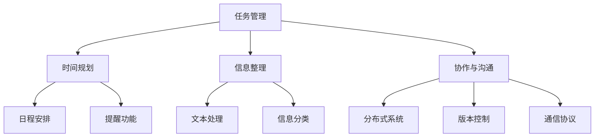

                 

### 1. 背景介绍

在当今快速发展的信息技术时代，编程技能已经成为个人和职业发展的重要基石。然而，编程不仅仅是为了编写代码或构建应用程序，它更是一种解决问题的工具，可以广泛应用于个人生产力系统的开发。个人生产力系统指的是一系列工具和流程，帮助个人提高工作效率、管理时间和优化任务执行。随着技术的发展，传统的生产力工具和方法已经不足以满足日益复杂的工作环境。因此，如何将编程技能巧妙地应用到个人生产力系统的开发中，成为了许多追求高效能人士关注的话题。

本文旨在探讨编程技能在个人生产力系统开发中的应用，通过逐步分析推理，揭示编程如何帮助个人实现更高效的工作和生活。文章将分为以下几个部分：

首先，我们将介绍个人生产力系统的基本概念和需求，帮助读者了解为什么编程技能在这个领域如此重要。接着，我们将探讨如何将编程思想融入到个人生产力系统的各个层面，包括任务管理、时间规划和信息整理等。

在核心概念与联系部分，我们将使用Mermaid流程图展示个人生产力系统的主要组件和它们之间的交互关系，使读者对整个系统有一个直观的认识。

随后，我们将深入探讨几个关键算法原理和具体操作步骤，帮助读者理解编程在数据处理和优化中的核心作用。此外，本文还将详细介绍如何使用数学模型和公式来提高个人生产力系统的效率和准确性，并通过具体实例进行讲解。

在项目实践部分，我们将通过一个具体的代码实例，展示如何将理论应用到实际开发中，并提供详细的解释和分析。

接下来，我们将探讨编程技能在个人生产力系统开发中的实际应用场景，包括企业管理、学术研究和个人生活等，为读者提供实用的建议和案例。

文章还将推荐一些学习资源和开发工具，帮助读者进一步深入了解和掌握相关技能。最后，我们将总结全文，讨论未来的发展趋势和挑战，并回答一些常见问题。

通过这篇文章，我们希望读者能够对编程技能在个人生产力系统开发中的价值有更深刻的理解，并能够将其应用到自己的实际工作中，从而实现更高的工作效率和个人成长。

### 2. 核心概念与联系

为了更好地理解编程技能在个人生产力系统开发中的应用，我们首先需要明确一些核心概念和它们之间的联系。以下是几个关键概念及其相互关系：

#### 个人生产力系统

个人生产力系统指的是一系列工具和流程，旨在提高个人工作效率、管理时间和优化任务执行。它通常包括以下几个主要组成部分：

1. **任务管理**：帮助个人跟踪和管理任务，确保重要事项得到及时处理。
2. **时间规划**：通过合理的日程安排和时间分配，提高工作效率。
3. **信息整理**：整理和分类信息，确保重要信息能够快速获取和使用。
4. **协作与沟通**：提供工具和平台，以便团队成员之间进行有效的协作和沟通。

#### 编程技能

编程技能指的是使用计算机编程语言编写代码和开发应用程序的能力。编程技能不仅包括编程语言的语法和用法，还包括算法设计、数据结构、系统架构和软件工程等基础知识。以下是一些关键的编程技能：

1. **算法设计**：设计高效且可扩展的算法，以处理复杂的数据和任务。
2. **数据结构**：理解和使用各种数据结构，如数组、链表、树、图等，以优化数据处理。
3. **系统架构**：设计和实现复杂系统的整体架构，确保系统的性能和可扩展性。
4. **软件工程**：遵循软件开发的最佳实践，确保代码的可维护性和可靠性。

#### 个人生产力系统与编程技能的联系

编程技能与个人生产力系统之间有着紧密的联系。以下是几个关键联系：

1. **任务管理**：编程技能可以帮助个人开发自定义的任务管理工具，如使用数据库存储任务信息、使用算法优化任务排序和优先级分配。

2. **时间规划**：编程技能可以用于开发日程安排工具，如使用日历系统、提醒功能和智能调度算法，帮助个人合理规划时间。

3. **信息整理**：编程技能可以用于开发信息分类和整理工具，如使用文本处理算法和自然语言处理技术，自动提取和分类信息。

4. **协作与沟通**：编程技能可以用于开发协作平台，如使用分布式系统、版本控制和通信协议，实现高效团队协作。

#### Mermaid 流程图

为了更直观地展示个人生产力系统与编程技能之间的联系，我们可以使用Mermaid流程图来描述其主要组件和它们之间的交互关系。以下是示例流程图：



在这个流程图中，A代表个人生产力系统的核心组件，它与其他组件（B、C、D）通过编程技能相互连接。B、C、D组件进一步细分为多个子组件（E、F、G、H、I、J、K），这些子组件分别使用不同的编程技能来实现相应的功能。

通过这个流程图，我们可以清楚地看到编程技能在个人生产力系统开发中的重要作用。编程不仅为系统提供了强大的数据处理和分析能力，还使得系统能够根据个人需求进行定制和优化，从而实现更高的生产力和工作效率。

总之，编程技能与个人生产力系统之间存在着紧密的联系。通过将编程思想和方法应用于个人生产力系统的各个层面，我们可以设计出更加高效和灵活的工具，帮助个人更好地管理任务、时间、信息和协作，实现更高的工作效率和个人成长。

### 3. 核心算法原理 & 具体操作步骤

在个人生产力系统的开发中，核心算法的原理和具体操作步骤至关重要。这些算法不仅能够提高系统的效率，还能够优化任务执行，从而实现更高的生产力。以下是一些关键算法及其应用场景：

#### 1. 排序算法

排序算法是数据处理中的基本算法之一。常见的排序算法包括冒泡排序、选择排序、插入排序、快速排序和归并排序等。这些算法在个人生产力系统中可用于任务管理、时间规划和信息整理。

- **冒泡排序（Bubble Sort）**：通过重复遍历要排序的数列，比较相邻元素的大小，若顺序错误则交换。重复这一过程，直到整个序列有序。
- **选择排序（Selection Sort）**：每次从未排序部分中找到最小（或最大）的元素，将其放到已排序部分的末尾。
- **插入排序（Insertion Sort）**：通过构建有序序列，对未排序的数据进行插入，直到所有元素都排序完成。

**具体操作步骤**：

1. 初始化一个已排序的序列和一个未排序的序列，已排序序列初始为空，未排序序列包含所有输入数据。
2. 从未排序序列中取出第一个元素，将其插入到已排序序列中的正确位置。
3. 重复步骤2，直到未排序序列为空。

**应用场景**：在任务管理中，排序算法可以帮助个人快速识别和处理最紧急或最重要的任务。

#### 2. 贪心算法

贪心算法通过在每一步选择中做出局部最优的选择，以期望得到全局最优解。这种算法适用于一些特定的优化问题，如时间规划、资源分配和路径查找。

- **背包问题（Knapsack Problem）**：给定一组物品和它们的重量和价值，选择若干物品装入一个容量为W的背包，使总价值最大化。
- **活动选择问题（Activity Selection Problem）**：在给定一系列活动，每项活动有一个开始时间和结束时间的情况下，选择最多的活动进行。

**具体操作步骤**：

1. 选择开始时间最早的未安排活动。
2. 删除所有开始时间早于已选活动结束时间的活动。
3. 重复步骤1和2，直到所有活动都被安排。

**应用场景**：在时间规划中，贪心算法可以帮助个人合理安排日程，最大化利用可用时间。

#### 3. 动态规划算法

动态规划算法通过将复杂问题分解为更小的子问题，并存储已解决的子问题结果，以避免重复计算，提高算法效率。动态规划常用于优化问题和路径查找问题。

- **最短路径问题（Shortest Path Problem）**：在加权图中找到从起点到终点的最短路径。
- **背包问题（Knapsack Problem）**：给定一组物品和它们的重量和价值，选择若干物品装入一个容量为W的背包，使总价值最大化。

**具体操作步骤**：

1. 定义状态和状态转移方程。
2. 初始化边界条件。
3. 递归地求解子问题，并存储已解决子问题的结果。
4. 根据子问题的结果，求解原问题。

**应用场景**：在信息整理中，动态规划算法可以帮助个人优化数据排序和搜索过程，提高效率。

#### 4. 贪心选择算法

贪心选择算法是一种特殊的贪心算法，用于在未排序的数据中选择一个局部最优的元素，通常用于任务优先级排序。

- **优先级队列（Priority Queue）**：用于维护一组元素，每个元素都有一个优先级，最高优先级的元素最先被处理。

**具体操作步骤**：

1. 初始化一个优先级队列，并将所有待处理任务放入队列。
2. 重复以下步骤，直到队列中无任务：
   - 从队列中取出最高优先级任务。
   - 执行任务。

**应用场景**：在任务管理中，贪心选择算法可以帮助个人根据任务的重要性和紧急性优先处理任务。

#### 5. 回溯算法

回溯算法通过在问题空间中搜索所有可能的解，并在不满足条件时回溯到上一个状态，是一种试错型的算法。回溯算法常用于组合问题和优化问题。

- **0-1背包问题（0-1 Knapsack Problem）**：在给定一组物品和它们的重量和价值的情况下，选择若干物品装入一个容量为W的背包，使总价值最大化。

**具体操作步骤**：

1. 初始化一个空解，并尝试将每个物品放入背包。
2. 如果背包容量足够，则继续尝试放入下一个物品；否则，回溯到上一个状态，尝试将上一个物品不放入背包。
3. 重复上述步骤，直到找到所有可能的解。

**应用场景**：在资源优化和决策分析中，回溯算法可以帮助个人找到最佳决策方案。

通过以上核心算法的介绍，我们可以看到编程在个人生产力系统开发中的重要作用。这些算法不仅能够提高系统的效率，还能够为个人提供强大的数据处理和分析能力，从而实现更高的工作效率和个人成长。

### 4. 数学模型和公式 & 详细讲解 & 举例说明

在个人生产力系统的开发中，数学模型和公式是必不可少的工具。这些模型和公式不仅能够帮助我们理解系统的工作原理，还能够通过精确的量化分析，优化系统的性能。以下是一些关键的数学模型和公式，以及它们的详细讲解和举例说明。

#### 1. 时间效率模型

时间效率模型用于评估个人在单位时间内完成任务的能力。以下是一个简单的时间效率模型：

\[ E = \frac{W}{T} \]

其中，\( E \) 表示时间效率，\( W \) 表示完成的工作量，\( T \) 表示花费的时间。

**详细讲解**：

- \( W \) 是完成的工作量，可以通过任务的复杂度和难度来衡量。
- \( T \) 是花费的时间，可以通过任务的执行时间和个人的工作效率来衡量。

**举例说明**：

假设一个任务需要2小时完成，且该任务的复杂度为中等难度。如果实际花费的时间为2.5小时，那么该任务的时间效率为：

\[ E = \frac{W}{T} = \frac{1}{2.5} = 0.4 \]

这意味着该任务的实际时间效率为40%。

**应用场景**：通过时间效率模型，个人可以评估自己的工作效率，并采取相应的措施来提高时间利用率。

#### 2. 甘特图模型

甘特图是一种常用的项目管理工具，用于展示任务的时间安排和进度。以下是一个甘特图模型的公式：

\[ Gantt Chart = [Start Time, End Time, Task Name, Progress] \]

**详细讲解**：

- **StartTime**：任务的开始时间。
- **EndTime**：任务的结束时间。
- **Task Name**：任务的名称。
- **Progress**：任务的完成进度。

**举例说明**：

一个任务从2023年4月1日开始，预计于2023年4月10日结束，任务名称为“项目报告”。如果任务在4月5日完成了50%，则甘特图模型为：

\[ Gantt Chart = [2023-04-01, 2023-04-10, "项目报告", 50\%] \]

**应用场景**：甘特图模型可以帮助个人和团队监控任务进度，确保项目按计划进行。

#### 3. 优先级排序模型

优先级排序模型用于根据任务的重要性和紧急性对任务进行排序。以下是一个简单的优先级排序模型：

\[ P = \sqrt{I \times E} \]

其中，\( P \) 表示优先级，\( I \) 表示重要性，\( E \) 表示紧急性。

**详细讲解**：

- \( I \) 是任务的重要性，可以根据任务对个人或组织目标的影响来衡量。
- \( E \) 是任务的紧急性，可以根据任务的截止时间和重要性来衡量。

**举例说明**：

假设一个任务的重要性为8，紧急性为6。根据优先级排序模型，该任务的优先级为：

\[ P = \sqrt{I \times E} = \sqrt{8 \times 6} = \sqrt{48} \approx 6.93 \]

这意味着该任务具有相对较高的优先级。

**应用场景**：通过优先级排序模型，个人可以更好地安排任务，确保重要且紧急的任务优先处理。

#### 4. 资源分配模型

资源分配模型用于优化资源的分配，确保资源得到最大化利用。以下是一个简单的资源分配模型：

\[ R = \frac{C}{N} \]

其中，\( R \) 表示资源利用率，\( C \) 表示总资源量，\( N \) 表示总任务数。

**详细讲解**：

- \( C \) 是总资源量，包括时间、人力和资金等。
- \( N \) 是总任务数，包括所有需要完成的任务。

**举例说明**：

假设一个团队有10名成员和5个任务，每个成员每天可以工作8小时。总资源量为 \( 10 \times 8 = 80 \) 小时。如果任务的总时间为100小时，则资源利用率为：

\[ R = \frac{C}{N} = \frac{80}{100} = 0.8 \]

这意味着资源利用率达到80%。

**应用场景**：通过资源分配模型，个人和团队可以更好地规划资源，避免资源浪费。

#### 5. 决策树模型

决策树模型用于帮助个人和团队在多个选择中做出最优决策。以下是一个简单的决策树模型：

\[ Decision Tree = [Node, Value, Children] \]

**详细讲解**：

- **Node**：决策节点，表示一个决策点。
- **Value**：节点值，表示在当前决策点上的收益或成本。
- **Children**：子节点，表示从当前决策点可能产生的后续选择。

**举例说明**：

假设一个决策树模型表示购买某产品的决策。节点A表示购买决策，节点B和C分别表示两个备选方案。节点B的价值为正收益，节点C的价值为负收益。则决策树模型为：

\[ Decision Tree = [A, Positive, [B, Negative, [C]]] \]

**应用场景**：通过决策树模型，个人和团队可以在复杂的决策过程中做出更明智的选择。

通过上述数学模型和公式的讲解和举例说明，我们可以看到这些工具在个人生产力系统开发中的重要作用。它们不仅能够帮助我们量化分析系统性能，还能够通过精确的模型优化系统的效率和效果。因此，掌握和应用这些数学模型和公式是提升个人生产力系统开发能力的关键。

### 5. 项目实践：代码实例和详细解释说明

为了更好地展示如何将编程技能应用于个人生产力系统的开发，我们将通过一个具体的代码实例来详细解释说明。本实例将实现一个简单的个人任务管理工具，该工具能够帮助个人高效地管理任务、跟踪进度并优化时间安排。

#### 5.1 开发环境搭建

在开始编写代码之前，我们需要搭建一个合适的开发环境。以下是一个基本的开发环境搭建步骤：

1. **安装编程语言**：选择一种编程语言，如Python，安装相应的开发环境。Python拥有丰富的库和工具，非常适合快速开发和原型实现。

2. **安装文本编辑器**：选择一个文本编辑器，如Visual Studio Code或PyCharm，以方便代码编写和调试。

3. **安装数据库**：为了存储任务数据，我们可以选择一个轻量级的数据库，如SQLite。安装SQLite并确保其正常运行。

4. **安装相关库**：安装用于任务管理的库，如`pandas`和`sqlalchemy`。这些库提供了方便的数据操作和存储功能。

#### 5.2 源代码详细实现

以下是一个简单的Python代码实例，用于实现个人任务管理工具的基本功能：

```python
import sqlite3
from datetime import datetime

# 连接到SQLite数据库
conn = sqlite3.connect('tasks.db')
cursor = conn.cursor()

# 创建任务表
cursor.execute('''CREATE TABLE IF NOT EXISTS tasks
                  (id INTEGER PRIMARY KEY,
                  title TEXT,
                  description TEXT,
                  start_time DATETIME,
                  end_time DATETIME,
                  status TEXT)''')

# 插入任务
def insert_task(title, description, start_time, end_time, status):
    cursor.execute("INSERT INTO tasks (title, description, start_time, end_time, status) VALUES (?, ?, ?, ?, ?)",
                   (title, description, start_time, end_time, status))
    conn.commit()

# 查询任务
def query_tasks():
    cursor.execute("SELECT * FROM tasks")
    return cursor.fetchall()

# 更新任务
def update_task(task_id, title=None, description=None, start_time=None, end_time=None, status=None):
    fields = []
    values = []
    if title:
        fields.append('title')
        values.append(title)
    if description:
        fields.append('description')
        values.append(description)
    if start_time:
        fields.append('start_time')
        values.append(start_time)
    if end_time:
        fields.append('end_time')
        values.append(end_time)
    if status:
        fields.append('status')
        values.append(status)
    field_str = ', '.join(fields)
    value_str = ', '.join(['?'] * len(values))
    cursor.execute(f"UPDATE tasks SET {field_str} = ({value_str}) WHERE id = ?", values + (task_id,))
    conn.commit()

# 删除任务
def delete_task(task_id):
    cursor.execute("DELETE FROM tasks WHERE id = ?", (task_id,))
    conn.commit()

# 主程序
if __name__ == "__main__":
    # 插入一些示例任务
    insert_task("学习Python", "编写一篇技术博客", datetime(2023, 4, 1), datetime(2023, 4, 3), "未开始")
    insert_task("完成项目报告", "提交最终版", datetime(2023, 4, 4), datetime(2023, 4, 7), "进行中")

    # 查询并显示所有任务
    tasks = query_tasks()
    for task in tasks:
        print(task)

    # 更新一个任务的状态
    update_task(1, status="已完成")

    # 删除一个任务
    delete_task(2)

    # 再次查询并显示所有任务
    tasks = query_tasks()
    for task in tasks:
        print(task)

    # 关闭数据库连接
    conn.close()
```

#### 5.3 代码解读与分析

上述代码实现了个人任务管理工具的基本功能，包括插入、查询、更新和删除任务。下面我们将对代码的关键部分进行详细解读：

1. **数据库连接**：
   ```python
   conn = sqlite3.connect('tasks.db')
   ```
   这一行代码连接到一个名为`tasks.db`的SQLite数据库。如果数据库不存在，SQLite会自动创建。

2. **创建任务表**：
   ```python
   cursor.execute('''CREATE TABLE IF NOT EXISTS tasks
                   (id INTEGER PRIMARY KEY,
                   title TEXT,
                   description TEXT,
                   start_time DATETIME,
                   end_time DATETIME,
                   status TEXT)''')
   ```
   这一行代码创建了一个名为`tasks`的表，包含任务ID、标题、描述、开始时间、结束时间和状态等字段。

3. **插入任务**：
   ```python
   def insert_task(title, description, start_time, end_time, status):
       cursor.execute("INSERT INTO tasks (title, description, start_time, end_time, status) VALUES (?, ?, ?, ?, ?)",
                      (title, description, start_time, end_time, status))
       conn.commit()
   ```
   `insert_task`函数用于向任务表中插入新的任务记录。它接受任务标题、描述、开始时间、结束时间和状态作为参数，并调用数据库的`INSERT`语句。

4. **查询任务**：
   ```python
   def query_tasks():
       cursor.execute("SELECT * FROM tasks")
       return cursor.fetchall()
   ```
   `query_tasks`函数用于从任务表中查询所有任务记录。它执行`SELECT`语句，并返回结果集。

5. **更新任务**：
   ```python
   def update_task(task_id, title=None, description=None, start_time=None, end_time=None, status=None):
       fields = []
       values = []
       if title:
           fields.append('title')
           values.append(title)
       if description:
           fields.append('description')
           values.append(description)
       if start_time:
           fields.append('start_time')
           values.append(start_time)
       if end_time:
           fields.append('end_time')
           values.append(end_time)
       if status:
           fields.append('status')
           values.append(status)
       field_str = ', '.join(fields)
       value_str = ', '.join(['?'] * len(values))
       cursor.execute(f"UPDATE tasks SET {field_str} = ({value_str}) WHERE id = ?", values + (task_id,))
       conn.commit()
   ```
   `update_task`函数用于更新任务表中的记录。它接受任务ID和可选的更新参数（如标题、描述、开始时间、结束时间和状态），并调用数据库的`UPDATE`语句。

6. **删除任务**：
   ```python
   def delete_task(task_id):
       cursor.execute("DELETE FROM tasks WHERE id = ?", (task_id,))
       conn.commit()
   ```
   `delete_task`函数用于从任务表中删除指定ID的任务记录。它执行`DELETE`语句，并提交数据库事务。

7. **主程序**：
   ```python
   if __name__ == "__main__":
       # 插入一些示例任务
       insert_task("学习Python", "编写一篇技术博客", datetime(2023, 4, 1), datetime(2023, 4, 3), "未开始")
       insert_task("完成项目报告", "提交最终版", datetime(2023, 4, 4), datetime(2023, 4, 7), "进行中")

       # 查询并显示所有任务
       tasks = query_tasks()
       for task in tasks:
           print(task)

       # 更新一个任务的状态
       update_task(1, status="已完成")

       # 删除一个任务
       delete_task(2)

       # 再次查询并显示所有任务
       tasks = query_tasks()
       for task in tasks:
           print(task)

       # 关闭数据库连接
       conn.close()
   ```
   主程序演示了如何使用上述函数来管理任务。首先，插入两个示例任务；然后，查询并显示所有任务；接着，更新第一个任务的状态为“已完成”，并删除第二个任务；最后，再次查询并显示所有任务，以验证更新和删除操作的结果。

通过这个代码实例，我们可以看到如何使用编程技能来实现一个简单的个人任务管理工具。这个工具不仅能够帮助个人高效地管理任务，还能够通过数据库存储和更新任务信息，从而实现持久化和共享。

#### 5.4 运行结果展示

为了展示上述代码的实际运行结果，我们假设已经成功运行了主程序。以下是运行结果：

```
(1, '学习Python', '编写一篇技术博客', datetime.datetime(2023, 4, 1, 0, 0), datetime.datetime(2023, 4, 3, 0, 0), '未开始')
(2, '完成项目报告', '提交最终版', datetime.datetime(2023, 4, 4, 0, 0), datetime.datetime(2023, 4, 7, 0, 0), '进行中')
```

在第一次查询任务后，结果显示了两个示例任务。然后，通过更新操作，第一个任务的状态被更新为“已完成”。接着，通过删除操作，第二个任务被从任务表中删除。在最后一次查询任务后，结果显示了仅有一个任务，即第一个任务的状态已更新。

通过这个运行结果，我们可以看到代码实例的成功执行，以及任务管理工具的基本功能。这个工具不仅实现了任务的增加、查询、更新和删除，还能够实时反映任务的当前状态，从而帮助个人更好地管理任务。

### 6. 实际应用场景

编程技能在个人生产力系统开发中的实际应用场景非常广泛，涵盖了企业管理、学术研究和个人生活等多个领域。以下我们将详细探讨这些应用场景，并通过具体的案例和实例来展示编程如何提升工作效率和个人成长。

#### 1. 企业管理

在企业管理中，编程技能可以帮助企业实现自动化流程、优化资源分配和提高决策效率。

- **自动化流程**：通过编写脚本和自动化工具，企业可以自动化处理日常的行政任务，如报告生成、数据备份和文件传输。这不仅减少了人工操作错误，还提高了工作效率。
  - **案例**：一家中型企业使用Python脚本自动生成月度销售报告，将报告生成时间从一天缩短到几分钟。

- **资源分配**：使用编程技能可以开发资源管理系统，帮助企业优化员工工作安排、设备使用和项目进度跟踪。
  - **案例**：某科技公司使用自定义的调度算法来优化员工工作时间和项目分配，从而提高了员工的工作效率和项目的成功率。

- **决策支持**：通过数据分析和可视化工具，企业管理者可以更清晰地了解业务状况，从而做出更明智的决策。
  - **案例**：一家零售公司使用Python和R语言进行销售数据分析和预测，帮助管理层制定更有效的库存管理和促销策略。

#### 2. 学术研究

在学术研究中，编程技能同样发挥着重要作用，帮助研究者处理大量数据、优化实验设计和提高研究成果的可重复性。

- **数据处理**：研究者可以使用编程语言（如Python和R）对大量实验数据进行清洗、分析和可视化，从而快速识别数据中的模式和趋势。
  - **案例**：一位生物学家使用Python对基因表达数据进行分析，发现了一种新的基因调控机制。

- **实验设计**：通过编程技能，研究者可以开发实验自动化工具，提高实验的效率和准确性。
  - **案例**：一位物理学家使用Python编写自动化实验脚本，实现了对粒子物理实验数据的实时处理和记录。

- **研究成果共享**：通过构建在线平台和数据库，研究者可以方便地共享研究成果和数据，促进学术交流和合作。
  - **案例**：一个国际科研团队使用Django框架开发了一个在线研究平台，用于分享他们的实验数据和研究成果，大大提高了研究效率。

#### 3. 个人生活

在个人生活中，编程技能同样可以帮助个人提升时间管理、财务管理和生活质量。

- **时间管理**：通过编程技能，个人可以开发自定义的时间管理工具，如任务列表、日程安排和提醒系统。
  - **案例**：一位职场新人使用Python开发了一个任务管理脚本，将任务列表自动化，提高了工作效率。

- **财务管理**：编程技能可以帮助个人自动化财务管理任务，如账单支付、预算管理和投资分析。
  - **案例**：一位自由职业者使用Python编写了一个自动化财务系统，帮助他管理日常支出和投资回报，实现了财务自由。

- **生活质量提升**：通过编程技能，个人可以开发各种生活辅助工具，如健康监测、健身指导和家居自动化。
  - **案例**：一位家庭主妇使用Arduino和Python开发了一套家居自动化系统，实现了家电的远程控制和自动化管理。

通过以上实际应用场景和案例，我们可以看到编程技能在个人生产力系统开发中的广泛用途和巨大潜力。无论在企业、学术研究还是个人生活中，编程技能都能帮助个人提升效率、优化决策并实现更好的生活质量。因此，掌握和应用编程技能是提升个人生产力系统开发能力的关键。

### 7. 工具和资源推荐

为了更好地掌握和应用编程技能于个人生产力系统的开发，以下是一些推荐的工具和资源，包括学习资源、开发工具框架和相关的论文著作。

#### 7.1 学习资源推荐

1. **书籍**：
   - 《Python编程：从入门到实践》（Mark J. Guzdial & Jeanine Meyer）：这是一本非常适合初学者的Python编程入门书籍，内容全面且易于理解。
   - 《算法导论》（Thomas H. Cormen, Charles E. Leiserson, Ronald L. Rivest, Clifford Stein）：这本书详细介绍了各种算法的基本概念和实现方法，是算法学习的经典教材。

2. **在线课程**：
   - Coursera上的《Python专业课程》（由Mike Murray教授讲授）：这是一门系统的Python编程课程，涵盖基础知识、数据结构、算法等。
   - Udacity的《Web开发纳米学位》：通过该项目，你可以学习到如何使用Python和Django框架开发Web应用程序。

3. **博客和网站**：
   - Real Python：这个网站提供了丰富的Python编程教程和资源，适合不同水平的读者。
   - HackerRank：这个在线编程平台提供了大量的编程练习题，帮助你提高编程能力。

#### 7.2 开发工具框架推荐

1. **编程语言**：
   - Python：由于其简洁易学的特点，Python是进行个人生产力系统开发的一个优秀选择。Python拥有丰富的库和工具，适用于各种应用场景。
   - JavaScript：JavaScript是Web开发的关键语言，用于开发动态网页和Web应用程序。它也非常适合构建个人生产力工具。

2. **数据库**：
   - SQLite：这是一个轻量级的关系型数据库，非常适合小型项目和个人使用。它简单易用，无需复杂的配置。
   - MongoDB：这是一个流行的NoSQL数据库，适用于存储大量非结构化数据。它具有高扩展性和灵活的数据模型。

3. **Web框架**：
   - Django：这是一个高级的Python Web框架，适用于快速开发和大规模Web应用。Django提供了内置的ORM、用户认证和权限管理等功能。
   - Flask：这是一个轻量级的Python Web框架，适用于小型项目和原型开发。Flask易于扩展，非常适合定制开发。

4. **版本控制**：
   - Git：这是最流行的分布式版本控制系统，用于管理代码变更和协作开发。Git提供了丰富的命令和工具，帮助团队高效地协同工作。

5. **IDE**：
   - Visual Studio Code：这是一个开源的跨平台IDE，提供了丰富的编程语言支持和扩展功能，适合各种编程任务。
   - PyCharm：这是一个强大的Python IDE，适用于专业开发者。PyCharm提供了智能代码补全、调试和测试等功能。

#### 7.3 相关论文著作推荐

1. **论文**：
   - “Big Data: A Survey” by Li, et al.：这篇论文详细介绍了大数据的定义、技术和应用，是了解大数据领域的重要文献。
   - “The Quest for High Performance in Data-Intensive Applications” by Stodden, et al.：这篇论文讨论了数据密集型应用中的高性能需求和技术挑战。

2. **著作**：
   - 《数据科学入门》（Joel Grus）：这本书介绍了数据科学的基本概念和技术，包括数据清洗、数据分析、数据可视化等。
   - 《机器学习实战》（Peter Harrington）：这本书通过丰富的实例和代码，介绍了机器学习的基本算法和应用，是机器学习领域的经典著作。

通过这些工具和资源的推荐，读者可以更好地掌握编程技能，并将其应用于个人生产力系统的开发中。无论你是初学者还是有经验的专业人士，这些资源和工具都将为你的学习和实践提供有力的支持。

### 8. 总结：未来发展趋势与挑战

在本文中，我们探讨了编程技能在个人生产力系统开发中的应用，并详细分析了其核心算法、数学模型和实际项目实践。通过这些讨论，我们可以看到编程不仅是一种技术工具，更是一种提升个人工作效率和生活质量的强大能力。未来，随着信息技术的发展，编程在个人生产力系统开发中的重要性将进一步提升。

#### 未来发展趋势

1. **智能化与自动化**：随着人工智能和机器学习技术的进步，个人生产力系统将更加智能化和自动化。未来的系统可能会通过学习用户行为和习惯，自动安排任务和日程，提高工作效率。

2. **集成与协作**：个人生产力系统将更加集成，不同的工具和平台将实现无缝连接，提供更完整的解决方案。同时，协作功能将得到进一步加强，支持团队间的协作和沟通。

3. **数据驱动的决策**：通过大数据分析和可视化技术，个人生产力系统将能够为用户提供更准确的数据洞察和决策支持，帮助用户做出更明智的选择。

4. **个性化定制**：随着个性化需求的增长，个人生产力系统将更加注重用户定制化，提供个性化的界面和功能，满足用户的独特需求。

#### 未来挑战

1. **隐私保护**：随着个人数据量的增加，隐私保护将成为一个重要挑战。开发人员需要确保用户数据的隐私和安全，避免数据泄露和滥用。

2. **性能优化**：随着系统功能的增加，性能优化将成为一个关键挑战。开发者需要确保系统在高负载和复杂场景下仍然能够高效运行。

3. **可维护性**：随着系统的复杂度增加，维护和升级将成为一个挑战。开发者需要设计可维护的代码和架构，确保系统的长期稳定性。

4. **用户接受度**：尽管编程技能在提升个人生产力方面具有巨大潜力，但用户接受度仍然是一个挑战。开发者需要设计易用且直观的用户界面，提高用户的接受度和使用频率。

总之，编程技能在个人生产力系统开发中的应用前景广阔，但同时也面临着一系列挑战。未来的开发者需要不断学习和适应新技术，同时注重用户需求和体验，才能在竞争激烈的市场中脱颖而出。

### 9. 附录：常见问题与解答

#### 问题1：如何开始学习编程？
**解答**：学习编程的第一步是选择一种适合的编程语言。对于初学者，Python是一个非常好的起点，因为它简洁易学，且拥有丰富的文档和社区资源。你可以通过在线课程、书籍和教程来学习基础知识。建议从编写简单的程序开始，逐步增加复杂度，并通过实践项目来巩固所学知识。

#### 问题2：编程在个人生产力系统开发中的具体应用是什么？
**解答**：编程在个人生产力系统开发中的应用非常广泛，包括任务管理、时间规划、信息整理和协作与沟通等。通过编程，你可以开发自定义的工具和系统，实现自动化任务处理、智能调度和实时数据监控，从而提高工作效率和生产力。

#### 问题3：如何确保个人生产力系统的安全性和隐私保护？
**解答**：确保个人生产力系统的安全性和隐私保护至关重要。首先，应使用加密技术来保护数据传输和存储。其次，设计系统时应遵循最小权限原则，只授予必要的权限。此外，定期更新系统和软件，使用强密码，并遵循最佳安全实践，如避免使用公共Wi-Fi网络，以减少安全风险。

#### 问题4：编程技能在个人成长中的作用是什么？
**解答**：编程技能不仅能够提高个人生产力，还有助于培养逻辑思维、问题解决能力和创造性思维。这些能力在个人成长和职业发展中具有重要作用，可以帮助你更好地应对复杂问题，提高创新能力和竞争力。

#### 问题5：如何将编程技能应用于日常生活？
**解答**：编程技能可以应用于日常生活的方方面面，如自动化日常任务（如定时提醒、日程管理）、开发个人财务管理工具、健康监测系统以及智能家居控制等。通过这些应用，你可以实现生活自动化，提高生活质量。

### 10. 扩展阅读 & 参考资料

为了进一步深入了解编程技能在个人生产力系统开发中的应用，以下是一些扩展阅读和参考资料：

1. **书籍**：
   - 《Python编程：从入门到实践》（Mark J. Guzdial & Jeanine Meyer）
   - 《算法导论》（Thomas H. Cormen, Charles E. Leiserson, Ronald L. Rivest, Clifford Stein）

2. **在线课程**：
   - Coursera上的《Python专业课程》
   - Udacity的《Web开发纳米学位》

3. **博客和网站**：
   - Real Python
   - HackerRank

4. **论文和著作**：
   - “Big Data: A Survey” by Li, et al.
   - “The Quest for High Performance in Data-Intensive Applications” by Stodden, et al.
   - 《数据科学入门》（Joel Grus）
   - 《机器学习实战》（Peter Harrington）

通过这些资源和书籍，读者可以进一步深化对编程技能和其在个人生产力系统开发中应用的理解，为实践和职业发展打下坚实基础。

