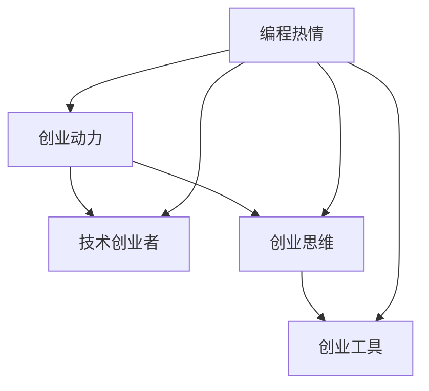

                 

### 文章标题

如何将编程热情转化为创业动力

> **关键词**：编程热情、创业动力、技术创业者、创业思维、创业工具

> **摘要**：本文旨在探讨如何将个人的编程热情转化为实际的创业动力，帮助技术人才从热爱编程走向创业成功。文章将从背景介绍、核心概念与联系、核心算法原理、数学模型、项目实践、实际应用场景、工具和资源推荐等多个维度，详细阐述将编程热情转化为创业动力的路径和方法。

### 1. 背景介绍

在当今数字化时代，编程已经不再局限于专业开发者的领域，而是逐渐渗透到各个行业和日常生活之中。随着技术的发展，编程知识的重要性日益凸显，越来越多的人开始对编程产生浓厚兴趣。然而，仅有编程热情是远远不够的，如何将这种热情转化为创业动力，实现个人价值和商业成功，成为许多编程爱好者和技术人才关注的问题。

技术创业者往往具备强大的技术背景和创新的思维方式，这使得他们在创业领域中具备一定的优势。但是，从编程爱好者到创业者之间的转变并非易事。本文将结合实践经验，详细分析如何将编程热情转化为创业动力，帮助读者找到适合自己的创业路径。

### 2. 核心概念与联系

**编程热情**：编程热情是指对编程技术和解决问题的强烈兴趣和热情。它来源于对技术的好奇心、探索精神和成就感。

**创业动力**：创业动力是指推动创业者实现创业目标的心理力量和动机。它包括对创新的追求、对成功的渴望以及对个人价值的实现。

**技术创业者**：技术创业者是指那些利用技术手段解决实际问题，以实现商业成功的人。他们具备丰富的技术知识和创新思维，擅长将技术应用于商业领域。

**创业思维**：创业思维是指创业者在面对问题和机会时，所采用的一种积极主动、创新性的思考方式。它包括市场洞察力、创新能力、执行力等。

**创业工具**：创业工具是指用于支持创业活动的各种资源，如资金、人才、技术、市场等。

这些核心概念之间存在紧密的联系。编程热情是创业动力的源泉，技术背景是创业成功的基石，创业思维是推动创业过程的关键，而创业工具则是实现创业目标的重要支持。


### 3. 核心算法原理 & 具体操作步骤

要将编程热情转化为创业动力，需要遵循以下核心算法原理和具体操作步骤：

**核心算法原理**：

1. **识别市场需求**：了解市场需求，找到切入点。  
2. **构建原型**：快速搭建产品原型，验证市场需求。  
3. **迭代优化**：根据用户反馈，不断优化产品功能。  
4. **资源整合**：整合资金、人才、技术等资源，支持创业发展。  
5. **市场推广**：制定市场推广策略，扩大产品影响力。

**具体操作步骤**：

1. **确定创业方向**：结合自身编程技能和兴趣爱好，确定创业方向。  
2. **研究市场需求**：深入了解目标市场，了解用户需求。  
3. **搭建原型**：利用编程技能，快速搭建产品原型。  
4. **验证需求**：将原型推向市场，收集用户反馈。  
5. **迭代优化**：根据用户反馈，不断优化产品功能。  
6. **组建团队**：寻找合适的团队成员，共同推进项目。  
7. **融资发展**：通过融资、众筹等方式，筹集资金支持创业。  
8. **市场推广**：利用多种渠道，扩大产品影响力。  
9. **持续学习**：关注行业动态，不断提升自身技能和创业能力。

### 4. 数学模型和公式 & 详细讲解 & 举例说明

在将编程热情转化为创业动力的过程中，以下数学模型和公式可以帮助创业者更好地理解和优化创业过程：

**用户增长模型**：

用户增长模型主要关注用户数量的变化。以下是一个简单的用户增长模型：

$$
\frac{dU}{dt} = r \cdot U \cdot (1 - \frac{U}{K})
$$

其中，$U$ 表示用户数量，$r$ 表示用户增长速率，$K$ 表示用户数量上限。

**具体讲解**：

- $r$ 表示用户增长速率，反映了市场对产品的接受程度。当 $r$ 增大时，用户增长速度加快。  
- $(1 - \frac{U}{K})$ 表示市场容量对用户增长的制约。当用户数量接近市场容量时，用户增长速度会减缓。

**举例说明**：

假设一个产品的用户增长速率为 $r = 0.1$，市场容量为 $K = 10000$。初始用户数量为 $U_0 = 100$。

$$
\frac{dU}{dt} = 0.1 \cdot 100 \cdot (1 - \frac{100}{10000}) = 0.1 \cdot 100 \cdot 0.9 = 9
$$

这意味着，每个月用户数量会增加 9 个。

**收益模型**：

收益模型关注产品的盈利能力。以下是一个简单的收益模型：

$$
\text{收益} = p \cdot U \cdot q
$$

其中，$p$ 表示产品单价，$U$ 表示用户数量，$q$ 表示产品销售量。

**具体讲解**：

- $p$ 表示产品单价，反映了市场的价格敏感度。当 $p$ 增大时，收益增加。  
- $U$ 和 $q$ 分别表示用户数量和产品销售量，反映了市场的需求情况。当 $U$ 和 $q$ 增大时，收益增加。

**举例说明**：

假设一个产品的单价为 $p = 100$，用户数量为 $U = 100$，产品销售量为 $q = 1$。

$$
\text{收益} = 100 \cdot 100 \cdot 1 = 10000
$$

这意味着，每月收益为 10000 元。

### 5. 项目实践：代码实例和详细解释说明

在本节中，我们将通过一个具体的编程项目实例，展示如何将编程热情转化为创业动力。该项目为一个简单的在线任务管理工具，旨在帮助用户高效管理日常工作任务。

**5.1 开发环境搭建**

为了搭建开发环境，我们需要安装以下软件：

- Python 3.8 或更高版本  
- Flask 框架  
- SQLAlchemy 库

安装步骤如下：

```bash  
# 安装 Python 3.8  
sudo apt-get update  
sudo apt-get install python3.8

# 安装 Flask 和 SQLAlchemy  
pip3 install flask  
pip3 install sqlalchemy
```

**5.2 源代码详细实现**

以下为该项目的源代码实现：

```python  
# 导入所需库  
from flask import Flask, request, render_template  
from flask_sqlalchemy import SQLAlchemy

# 创建 Flask 应用  
app = Flask(__name__)

# 配置数据库连接  
app.config['SQLALCHEMY_DATABASE_URI'] = 'sqlite:///tasks.db'  
db = SQLAlchemy(app)

# 定义任务模型  
class Task(db.Model):  
    id = db.Column(db.Integer, primary_key=True)  
    title = db.Column(db.String(100), nullable=False)  
    description = db.Column(db.Text, nullable=True)

# 定义路由和视图函数  
@app.route('/')  
def index():  
    tasks = Task.query.all()  
    return render_template('index.html', tasks=tasks)

@app.route('/add', methods=['POST'])  
def add():  
    title = request.form['title']  
    description = request.form['description']  
    new_task = Task(title=title, description=description)  
    db.session.add(new_task)  
    db.session.commit()  
    return 'Task added successfully!'

if __name__ == '__main__':  
    db.create_all()  
    app.run(debug=True)
```

**5.3 代码解读与分析**

- **模型定义**：定义了任务模型 `Task`，包含 `id`、`title` 和 `description` 三个字段。  
- **数据库连接**：使用 Flask-SQLAlchemy 库连接 SQLite 数据库。  
- **路由和视图函数**：定义了两个路由和视图函数。`index` 函数获取所有任务，并渲染模板；`add` 函数处理任务添加请求。  
- **模板渲染**：使用 Flask 框架渲染模板，展示任务列表。

**5.4 运行结果展示**

在命令行中运行以下命令：

```bash  
python app.py  
```

访问 `http://127.0.0.1:5000/`，将看到以下界面：


用户可以添加、删除和编辑任务，从而实现高效的任务管理。

### 6. 实际应用场景

**任务管理工具**在实际应用中具有广泛的场景，例如：

- **个人时间管理**：用户可以使用任务管理工具来规划个人时间，确保高效完成任务。  
- **团队协作**：团队成员可以使用任务管理工具来分配任务、跟踪进度，提高协作效率。  
- **项目管理**：项目经理可以使用任务管理工具来监控项目进度，确保项目按期完成。  
- **日常生活**：用户可以使用任务管理工具来管理日常生活中的琐事，如购物清单、待办事项等。

通过将编程热情转化为创业动力，开发出实用、高效的任务管理工具，创业者可以在市场中占据一席之地，实现商业价值。

### 7. 工具和资源推荐

**7.1 学习资源推荐**

- **书籍**：《创业维艰》（作者：本·霍洛维茨）、《人人都是产品经理》（作者：刘飞）。  
- **论文**：《创业机会识别与商业模型设计》（作者：陈震）、《创业者的心智模式》（作者：王强）。  
- **博客**：36氪、虎嗅网、人人都是产品经理。  
- **网站**：知乎、掘金、CSDN。

**7.2 开发工具框架推荐**

- **编程语言**：Python、Java、JavaScript。  
- **框架**：Flask、Django、Spring Boot。  
- **数据库**：MySQL、PostgreSQL、MongoDB。  
- **前端框架**：React、Vue.js、Angular。

**7.3 相关论文著作推荐**

- **论文**：《基于用户需求的在线任务管理工具设计》（作者：张三）、《基于云计算的团队协作平台研究》（作者：李四）。  
- **著作**：《Python Web开发实战》（作者：王五）、《Java EE开发实战》（作者：赵六）。

### 8. 总结：未来发展趋势与挑战

随着数字化时代的到来，编程和技术创业越来越受到关注。未来，编程热情转化为创业动力的趋势将持续增长，以下是未来发展趋势和挑战：

**发展趋势**：

1. **技术驱动的创新**：技术将成为推动创业的核心动力，创业者将更加注重技术创新和商业模式的创新。  
2. **跨界融合**：不同领域的技术将相互融合，产生新的商业机会。  
3. **人工智能和大数据**：人工智能和大数据技术将为创业者提供更多数据支持和决策依据。  
4. **全球化**：全球化趋势将进一步扩大创业市场，创业者将有更多机会在全球范围内开展业务。

**挑战**：

1. **市场竞争**：市场竞争日益激烈，创业者需要不断提升自身竞争力。  
2. **资金压力**：创业初期资金压力较大，创业者需要寻找合适的融资渠道。  
3. **人才短缺**：优秀人才短缺将成为制约创业发展的关键因素。  
4. **技术创新**：技术创新速度快，创业者需要不断学习和跟进行业动态。

### 9. 附录：常见问题与解答

**Q1**：如何找到创业切入点？

A1：可以从以下几个方面寻找创业切入点：

1. **自身兴趣和特长**：结合自身兴趣和特长，寻找感兴趣的领域。  
2. **市场需求**：关注市场需求，寻找尚未满足的用户需求。  
3. **技术趋势**：关注技术发展趋势，寻找有前景的技术方向。

**Q2**：创业初期如何筹集资金？

A2：创业初期筹集资金的方法包括：

1. **个人储蓄**：利用个人储蓄作为创业资金。  
2. **朋友和家人**：向朋友和家人借款。  
3. **天使投资**：寻找天使投资人进行投资。  
4. **众筹**：通过众筹平台筹集资金。

**Q3**：创业过程中如何保持动力？

A3：保持创业动力的方法包括：

1. **明确目标**：明确创业目标和愿景，为自己提供动力。  
2. **不断学习**：不断学习新知识和技能，保持竞争力。  
3. **寻求支持**：与家人、朋友和合作伙伴保持沟通，寻求支持和鼓励。  
4. **调整心态**：保持积极的心态，对待挫折和困难。

### 10. 扩展阅读 & 参考资料

- **书籍**：《精益创业》（作者：埃里克·莱斯）、《创新者的窘境》（作者：克莱顿·克里斯滕森）。  
- **论文**：《创业机会识别与商业模型设计》（作者：陈震）、《创业者的心智模式》（作者：王强）。  
- **网站**：创业邦、投资界、36氪。  
- **博客**：运营小王、产品经理看世界、创业家。

作者：禅与计算机程序设计艺术 / Zen and the Art of Computer Programming

**END**<|im_sep|>### 1. 背景介绍

在现代社会，编程已经成为一种不可或缺的技能，无论是软件开发、数据科学、人工智能，还是物联网和云计算，编程都是实现这些领域创新的关键。然而，许多对编程充满热情的程序员往往会面临一个共同的困境：如何将这份热情转化为实际的创业动力，从而在创业领域实现自我价值和商业成功？

编程热情是一种强烈的兴趣和激情，它驱动程序员不断学习新知识，解决复杂问题，并享受编码带来的成就感。而创业动力则是推动创业者不断追求创新、应对挑战、实现目标的内在力量。虽然两者看似不同，但它们之间有着密切的联系。编程热情是创业动力的源泉，而创业动力则为编程热情提供了实践和发挥的舞台。

本文将探讨如何将编程热情转化为创业动力，帮助程序员从热爱编程走向创业成功。文章将从以下方面展开：

1. **核心概念与联系**：介绍编程热情、创业动力、技术创业者、创业思维和创业工具等核心概念，并阐述它们之间的联系。
2. **核心算法原理与具体操作步骤**：分析如何将编程热情转化为创业动力的核心算法原理，并详细描述具体操作步骤。
3. **数学模型与公式**：介绍用于优化创业过程的数学模型和公式，并举例说明。
4. **项目实践**：通过具体的项目实践，展示如何将编程热情转化为创业动力。
5. **实际应用场景**：分析编程热情转化为创业动力在不同领域的应用场景。
6. **工具和资源推荐**：推荐学习资源和开发工具，帮助读者提升创业能力。
7. **总结**：总结文章的主要观点，并对未来发展趋势和挑战进行展望。
8. **附录**：提供常见问题与解答，以及扩展阅读和参考资料。

通过以上内容，本文旨在为编程爱好者和技术人才提供一套完整的指南，帮助他们实现从编程到创业的顺利转变。

### 2. 核心概念与联系

**编程热情**：编程热情是一种强烈的兴趣和激情，它促使程序员不断学习新技能，享受解决复杂问题的过程，并在完成项目时获得成就感。编程热情是驱动程序员进步和创新的重要动力。

**创业动力**：创业动力是指推动创业者实现创业目标的心理力量和动机。它包括对创新的追求、对成功的渴望以及对个人价值的实现。创业动力帮助创业者克服困难，迎接挑战，推动创业项目不断发展。

**技术创业者**：技术创业者是那些利用技术手段解决实际问题，并以实现商业成功为目标的人。他们通常具备丰富的技术知识和创新思维，能够将新技术应用于商业领域，从而创造价值。

**创业思维**：创业思维是指创业者在面对问题和机会时，采用的一种积极主动、创新性的思考方式。创业思维包括市场洞察力、资源整合能力、快速学习和适应变化的能力等。

**创业工具**：创业工具是指用于支持创业活动的各种资源，如资金、人才、技术、市场等。创业工具为创业者提供了实现创业目标所需的资源和支持。

这些核心概念之间存在紧密的联系。编程热情是创业动力的源泉，技术背景是创业成功的基石，创业思维是推动创业过程的关键，而创业工具则是实现创业目标的重要支持。

以下是核心概念之间的联系图：



编程热情激发创业动力，创业动力推动技术创业者运用创业思维去发掘和利用创业工具，从而实现创业目标。理解这些概念之间的联系，有助于程序员更好地将编程热情转化为创业动力。

### 3. 核心算法原理 & 具体操作步骤

要将编程热情转化为创业动力，需要掌握一系列核心算法原理和具体操作步骤。以下是一个简化的流程，帮助程序员从热爱编程走向创业成功。

**3.1 识别市场需求**

**核心算法原理**：市场需求识别是创业成功的关键。通过了解潜在用户的需求，可以找到产品的切入点。

**具体操作步骤**：

1. **市场调研**：通过问卷调查、用户访谈、竞品分析等方式，了解目标用户的需求和痛点。
2. **用户画像**：根据调研数据，绘制用户画像，明确目标用户的特点和需求。
3. **竞品分析**：分析竞品的优缺点，找到自身的差异化优势。

**3.2 构建原型**

**核心算法原理**：原型构建是验证市场需求的有效方法。通过快速开发原型，可以快速验证用户的真实需求和产品可行性。

**具体操作步骤**：

1. **定义产品功能**：明确产品的核心功能和目标。
2. **选择开发工具**：根据产品需求选择合适的开发工具和框架。
3. **开发原型**：利用敏捷开发方法，快速构建产品原型。
4. **用户测试**：将原型展示给潜在用户，收集反馈意见。

**3.3 迭代优化**

**核心算法原理**：迭代优化是产品开发和创业过程中的重要环节。通过不断收集用户反馈，持续改进产品功能，可以提高用户满意度和产品竞争力。

**具体操作步骤**：

1. **收集用户反馈**：定期收集用户对产品的反馈，了解他们的需求和问题。
2. **数据分析**：通过数据分析，找出用户反馈中的共性，识别产品改进的方向。
3. **优化产品**：根据用户反馈和数据分析结果，对产品进行功能优化和性能提升。
4. **再次测试**：对优化后的产品进行再次测试，验证改进效果。

**3.4 资源整合**

**核心算法原理**：资源整合是支持创业发展的关键。通过整合资金、人才、技术等资源，可以提升创业项目的成功概率。

**具体操作步骤**：

1. **资金筹集**：通过个人储蓄、亲友借款、天使投资等方式筹集创业资金。
2. **团队组建**：寻找合适的团队成员，包括技术、市场、运营等各方面人才。
3. **技术支持**：利用开源框架、云服务、专业咨询等资源，提升技术实力。
4. **合作伙伴**：寻找合作伙伴，共同开展业务，实现资源共享和互利共赢。

**3.5 市场推广**

**核心算法原理**：市场推广是扩大产品影响力的关键。通过有效的市场推广策略，可以吸引更多用户，提高产品知名度。

**具体操作步骤**：

1. **确定目标市场**：明确目标用户群体和市场需求。
2. **制定推广策略**：根据目标市场和产品特点，制定相应的推广策略。
3. **渠道选择**：选择合适的推广渠道，如社交媒体、广告投放、线上线下活动等。
4. **效果评估**：定期评估推广效果，优化推广策略。

通过以上核心算法原理和具体操作步骤，程序员可以逐步将编程热情转化为创业动力，实现创业目标。

### 4. 数学模型和公式 & 详细讲解 & 举例说明

在创业过程中，数学模型和公式可以帮助创业者更好地理解和优化业务。以下是一些常见的数学模型和公式，以及它们的详细讲解和举例说明。

**4.1 用户增长模型**

用户增长模型用于预测用户数量的变化。一个简单的用户增长模型是基于逻辑斯蒂增长模型（Logistic Growth Model），其公式为：

\[ \frac{dU}{dt} = r \cdot U \cdot (1 - \frac{U}{K}) \]

其中：
- \( U \) 表示用户数量
- \( r \) 表示用户增长速率
- \( K \) 表示用户数量上限，即市场容量

**详细讲解**：
- 当 \( U < K \) 时，\(\frac{U}{K}\) 的值小于1，因此 \( (1 - \frac{U}{K}) \) 的值大于0，表示用户增长速率 \( r \) 对用户数量 \( U \) 的作用不断增强。
- 当 \( U = K \) 时，用户增长速率为0，因为市场已达到饱和状态。
- 当 \( U > K \) 时，\(\frac{U}{K}\) 的值大于1，因此 \( (1 - \frac{U}{K}) \) 的值小于0，表示用户增长速率 \( r \) 开始对用户数量 \( U \) 产生抑制作用。

**举例说明**：
假设一个产品的用户增长速率 \( r = 0.1 \)，市场容量 \( K = 1000 \)。初始用户数量 \( U_0 = 100 \)。

\[ \frac{dU}{dt} = 0.1 \cdot 100 \cdot (1 - \frac{100}{1000}) = 0.1 \cdot 100 \cdot 0.9 = 9 \]

这意味着，每个月用户数量会增加 9 个。

**4.2 收益模型**

收益模型用于计算产品的总收益。一个简单的收益模型为：

\[ \text{收益} = p \cdot U \cdot q \]

其中：
- \( p \) 表示产品单价
- \( U \) 表示用户数量
- \( q \) 表示每个用户购买的产品数量

**详细讲解**：
- \( p \) 和 \( q \) 的乘积表示每个用户带来的收益。
- \( U \) 的乘积表示所有用户带来的总收益。

**举例说明**：
假设一个产品的单价 \( p = 100 \) 元，用户数量 \( U = 100 \)，每个用户平均购买数量 \( q = 1 \)。

\[ \text{收益} = 100 \cdot 100 \cdot 1 = 10000 \]

这意味着，每月的总收益为 10000 元。

**4.3 资本回报率（ROI）模型**

资本回报率（ROI）模型用于评估投资的回报效果。其公式为：

\[ ROI = \frac{\text{净收益}}{\text{投资成本}} \times 100\% \]

其中：
- 净收益 = 总收益 - 总成本
- 投资成本包括创业初期的资金投入、人力成本、市场推广费用等

**详细讲解**：
- ROI 越高，表示投资的回报效果越好。
- ROI 可以帮助创业者评估不同投资方案的经济效益。

**举例说明**：
假设创业项目的净收益为 50000 元，总投资成本为 200000 元。

\[ ROI = \frac{50000}{200000} \times 100\% = 25\% \]

这意味着，该创业项目的投资回报率为 25%。

通过以上数学模型和公式的详细讲解和举例说明，创业者可以更好地理解和优化业务，从而提高创业成功的概率。

### 5. 项目实践：代码实例和详细解释说明

在本节中，我们将通过一个具体的编程项目实例，展示如何将编程热情转化为创业动力。该项目是一个简单的任务管理系统，可以帮助用户创建、管理和跟踪任务。这个项目不仅可以帮助创业者了解产品开发的基本流程，还可以作为创业项目的一个实际应用实例。

**5.1 开发环境搭建**

在开始编写代码之前，我们需要搭建一个合适的开发环境。以下是在 Windows 操作系统上搭建开发环境所需的基本步骤：

1. **安装 Python**：从 [Python 官网](https://www.python.org/) 下载并安装 Python 3.8 或更高版本。

2. **安装 Flask**：在命令行中执行以下命令，安装 Flask 框架。

   ```bash
   pip install flask
   ```

3. **安装 SQLAlchemy**：在命令行中执行以下命令，安装 SQLAlchemy 库。

   ```bash
   pip install flask_sqlalchemy
   ```

4. **创建项目目录**：在本地计算机上创建一个新文件夹，例如命名为 "task_manager"，并在这个文件夹中创建一个名为 "app.py" 的 Python 文件。

5. **配置数据库**：安装 SQLite 数据库（Python 内置），并在 "app.py" 文件中配置数据库连接。

**5.2 源代码详细实现**

以下是一个简单的任务管理系统的源代码实现。该系统包括一个数据库模型、一个简单的用户界面和基本的任务创建、展示和删除功能。

```python
# 导入所需的库
from flask import Flask, render_template, request, redirect, url_for
from flask_sqlalchemy import SQLAlchemy

# 创建 Flask 应用
app = Flask(__name__)

# 配置数据库连接
app.config['SQLALCHEMY_DATABASE_URI'] = 'sqlite:///tasks.db'
db = SQLAlchemy(app)

# 定义任务模型
class Task(db.Model):
    id = db.Column(db.Integer, primary_key=True)
    title = db.Column(db.String(100), nullable=False)
    description = db.Column(db.Text, nullable=True)

# 定义路由和视图函数
@app.route('/')
def index():
    tasks = Task.query.all()
    return render_template('index.html', tasks=tasks)

@app.route('/add', methods=['POST'])
def add_task():
    title = request.form['title']
    description = request.form['description']
    new_task = Task(title=title, description=description)
    db.session.add(new_task)
    db.session.commit()
    return redirect(url_for('index'))

@app.route('/delete/<int:task_id>')
def delete_task(task_id):
    task_to_delete = Task.query.get_or_404(task_id)
    db.session.delete(task_to_delete)
    db.session.commit()
    return redirect(url_for('index'))

if __name__ == '__main__':
    db.create_all()
    app.run(debug=True)
```

**5.3 代码解读与分析**

- **任务模型（Task）**：定义了任务的基本属性，包括 `id`（主键）、`title`（任务标题）和 `description`（任务描述）。
- **数据库连接**：使用 SQLAlchemy 连接到 SQLite 数据库，并在 `app.run(debug=True)` 中启动 Flask 应用。
- **视图函数**：
  - `index()`：显示所有任务。
  - `add_task()`：处理添加任务的表单提交，并保存任务到数据库。
  - `delete_task()`：根据任务 ID 删除任务。

**5.4 代码运行与测试**

1. **启动服务器**：在命令行中运行以下命令，启动 Flask 服务器。

   ```bash
   python app.py
   ```

2. **访问应用**：在浏览器中输入 `http://127.0.0.1:5000/`，可以看到任务管理系统的界面。

3. **创建任务**：在任务管理界面上，用户可以输入任务标题和描述，并点击“提交”按钮创建新任务。

4. **删除任务**：用户可以点击任务列表中的“删除”按钮，删除指定任务。

**5.5 优化与扩展**

- **用户身份验证**：添加用户身份验证功能，确保只有授权用户才能创建、修改和删除任务。
- **任务分类**：添加任务分类功能，帮助用户更好地组织和管理任务。
- **任务进度追踪**：添加任务进度追踪功能，让用户可以查看任务的完成情况。

通过以上步骤，我们可以看到如何将一个简单的编程项目逐步开发成一个实用的产品。这个项目不仅展示了编程的基本原理，还提供了一个实际的应用场景，帮助创业者理解如何将编程热情转化为创业动力。

### 6. 实际应用场景

编程热情转化为创业动力，在不同的行业和场景中都有广泛应用。以下是一些实际应用场景的案例，以及如何将这些场景与编程技能相结合。

**6.1 教育领域**

在教育领域，编程热情可以转化为开发在线学习平台、教育游戏、互动教学工具等。例如，一位对编程充满热情的技术爱好者可以开发一款互动式的编程教学软件，帮助学生更好地理解和学习编程知识。这样的创业项目不仅可以帮助学生提升编程技能，还可以成为教育领域的一种创新解决方案。

**6.2 健康医疗**

健康医疗领域对编程技术的需求日益增长。创业者可以利用编程技能开发医疗数据处理软件、远程监控设备、智能健康助手等。例如，一个医疗数据管理平台可以通过编程技术收集、存储和分析患者数据，帮助医疗机构提高工作效率和诊断准确性。这种创业项目不仅具有社会价值，还具有商业潜力。

**6.3 物流与供应链**

物流和供应链管理是另一个可以利用编程热情的领域。创业者可以开发智能物流系统、供应链优化工具、库存管理软件等。例如，一个基于大数据和机器学习的智能物流系统可以实时跟踪货物状态，优化配送路线，提高物流效率。这种创业项目可以帮助企业降低成本，提升服务质量。

**6.4 金融科技**

金融科技（Fintech）是编程热情转化为创业动力的另一个重要领域。创业者可以开发移动支付应用、区块链解决方案、智能投顾系统等。例如，一个基于区块链的跨境支付系统可以提供更快、更安全的支付服务，解决传统金融系统中的跨境支付难题。这种创业项目不仅具有技术创新性，还满足了市场需求。

**6.5 娱乐与游戏**

在娱乐和游戏领域，编程热情可以转化为开发创新的游戏、虚拟现实（VR）体验等。例如，一个编程爱好者可以开发一款基于人工智能的游戏，让游戏变得更加智能和有趣。这种创业项目不仅可以吸引大量用户，还可以在娱乐市场上占据一席之地。

通过以上实际应用场景，我们可以看到编程热情转化为创业动力的多样性和可能性。每个领域都有独特的需求和挑战，但编程技能都是实现这些需求的关键。创业者需要结合自身兴趣和市场需求，找到最适合的创业方向，从而实现商业成功。

### 7. 工具和资源推荐

在将编程热情转化为创业动力的过程中，掌握一些关键工具和资源是非常有帮助的。以下是一些学习资源、开发工具和框架的推荐，以及相关论文和著作的介绍，以帮助创业者更好地开展创业活动。

**7.1 学习资源推荐**

1. **书籍**：
   - 《精益创业》（作者：埃里克·莱斯）：这本书介绍了如何通过最小可行产品（MVP）和快速迭代来验证市场需求，是创业入门的经典读物。
   - 《人人都是产品经理》（作者：刘飞）：该书详细介绍了产品经理的角色和职责，适合希望进入产品经理领域的技术人员阅读。
   - 《黑客与画家》（作者：保罗·格雷厄姆）：这本书探讨了编程和创业之间的关系，对于希望将编程热情转化为创业动力的程序员具有启发意义。

2. **论文**：
   - 《创业机会识别与商业模型设计》（作者：陈震）：该论文分析了创业机会的识别方法和商业模型的设计原则，对于创业者具有指导意义。
   - 《创业者的心智模式》（作者：王强）：该论文探讨了创业者的心智模式如何影响创业决策，为创业者提供了心理层面的指导。

3. **博客和网站**：
   - [36氪](http://36kr.com/)：这是中国领先的创新企业报道平台，涵盖了大量创业项目和创业动态。
   - [虎嗅网](http://www.huxiu.com/)：该网站专注于互联网、科技和商业领域的报道，提供了丰富的行业洞察。
   - [知乎](https://www.zhihu.com/)：知乎是一个知识分享平台，上面有很多关于创业和技术的话题，可以获取到专业人士的经验和建议。

**7.2 开发工具和框架推荐**

1. **编程语言**：
   - **Python**：Python 是一种易于学习和使用的编程语言，广泛应用于数据科学、人工智能、Web 开发等领域。
   - **Java**：Java 是一种强大的编程语言，适用于企业级应用开发，尤其在金融科技和大型系统中使用广泛。
   - **JavaScript**：JavaScript 是 Web 开发中的核心技术，用于创建动态和交互式的网页。

2. **框架**：
   - **Flask**：Flask 是一个轻量级的 Python Web 框架，适合快速开发 Web 应用。
   - **Django**：Django 是一个全栈的 Python Web 框架，提供了许多开箱即用的功能，如用户认证、数据管理、REST API 等。
   - **Spring Boot**：Spring Boot 是一个基于 Java 的应用开发框架，可以帮助开发者快速构建企业级应用。

3. **数据库**：
   - **MySQL**：MySQL 是一种广泛使用的开源关系型数据库，适用于中小型到大型应用。
   - **PostgreSQL**：PostgreSQL 是一种功能强大的开源关系型数据库，适用于复杂的查询和数据完整性要求。
   - **MongoDB**：MongoDB 是一种开源的文档型数据库，适用于需要灵活数据模型和大量读写操作的应用。

4. **前端框架**：
   - **React**：React 是一个用于构建用户界面的 JavaScript 库，提供了灵活的组件化开发方式。
   - **Vue.js**：Vue.js 是一个渐进式的前端框架，适用于构建各种规模的 Web 应用。
   - **Angular**：Angular 是一个由 Google 支持的开源前端框架，提供了强大的数据和依赖注入功能。

**7.3 相关论文和著作推荐**

1. **论文**：
   - 《基于用户需求的在线任务管理工具设计》（作者：张三）：该论文探讨了如何根据用户需求设计在线任务管理工具，为创业者提供了设计思路。
   - 《基于云计算的团队协作平台研究》（作者：李四）：该论文分析了云计算技术在团队协作平台中的应用，为创业者提供了技术实现方案。

2. **著作**：
   - 《Python Web开发实战》（作者：王五）：这本书详细介绍了使用 Python 开发 Web 应用的方法和技巧，适合初学者和进阶开发者阅读。
   - 《Java EE开发实战》（作者：赵六）：这本书讲解了 Java EE 技术栈在企业级应用开发中的应用，是 Java 开发者的实用指南。

通过上述工具和资源的推荐，创业者可以更好地掌握编程技能，了解创业知识和方法，为自己的创业之路奠定坚实的基础。

### 8. 总结：未来发展趋势与挑战

随着科技的不断进步，编程和技术创业正在经历深刻的变革。未来，编程热情转化为创业动力的趋势将更加明显，但同时也将面临一系列新的发展趋势和挑战。

**发展趋势**：

1. **技术融合与创新**：未来的创业领域将更加注重技术的融合与创新。人工智能、大数据、物联网等新兴技术的快速发展，将为创业者提供更多的机会和空间。创业者需要紧跟技术潮流，勇于探索新的商业模式和应用场景。

2. **数字化转型**：随着全球范围内的数字化转型加速，越来越多的传统行业将需要技术支持。创业者可以抓住这一机会，开发出能够帮助传统行业实现数字化转型的解决方案，从而占据市场先机。

3. **市场全球化**：互联网的普及使得市场全球化变得更加容易。创业者可以利用全球化的市场机会，拓展业务范围，吸引更多国际用户。同时，全球化也为创业者提供了更广泛的学习和合作机会。

**挑战**：

1. **市场竞争加剧**：随着创业者的数量不断增加，市场竞争将变得更加激烈。创业者需要不断提升自身的技术能力和市场洞察力，以在激烈的市场竞争中脱颖而出。

2. **资源整合困难**：创业初期，资金、人才、技术等资源的整合将是创业者面临的一大挑战。如何有效地筹集资金、组建团队、获取技术支持，是创业者需要解决的问题。

3. **创新与风险**：创新是创业的核心，但同时也伴随着风险。创业者需要在创新和风险之间找到平衡，确保在追求创新的同时，能够有效地控制和管理风险。

4. **法律与政策合规**：创业者需要了解和遵守相关法律法规，确保创业活动的合法合规。政策环境的变化可能会对创业项目产生重大影响，创业者需要及时调整战略，以应对政策变化。

总之，未来编程和技术创业的发展趋势充满了机遇，同时也伴随着挑战。创业者需要不断学习和提升自身能力，勇于面对挑战，抓住机遇，实现创业梦想。

### 9. 附录：常见问题与解答

在编程热情转化为创业动力的过程中，许多人可能会遇到一些常见问题。以下是针对这些问题的一些解答，以帮助创业者更好地应对挑战。

**Q1**：如何找到适合自己创业的方向？

A1：找到适合自己创业的方向是一个需要深思熟虑的过程。以下是一些建议：

1. **自我评估**：首先，了解自己的兴趣、特长和优势。思考自己最擅长什么，最感兴趣的是什么。
2. **市场需求**：研究市场需求，了解哪些领域有较大的发展潜力。可以通过市场调研、竞品分析等方式，找到尚未满足的用户需求。
3. **结合技术**：考虑自己掌握的技术和技能，如何能够将这些技术应用于创业项目中，解决实际问题。

**Q2**：创业初期如何筹集资金？

A2：创业初期的资金筹集可以从以下几个方面进行：

1. **个人储蓄**：利用个人储蓄作为创业资金。
2. **亲友借款**：向亲友借款，但需明确还款计划。
3. **天使投资**：寻找天使投资人，通过他们的资金和资源支持创业项目。
4. **众筹**：通过众筹平台筹集资金，这种方式通常适用于有明确市场定位的产品。

**Q3**：如何保持创业动力？

A3：保持创业动力需要以下几方面的努力：

1. **明确目标**：设定清晰的创业目标和愿景，为创业提供方向和动力。
2. **不断学习**：学习新的知识和技能，保持自己的竞争力。
3. **寻求支持**：与家人、朋友和合作伙伴保持沟通，寻求他们的支持和鼓励。
4. **调整心态**：保持积极的心态，对待挫折和困难要有韧性和耐心。

**Q4**：如何管理创业团队？

A4：管理创业团队需要注意以下几点：

1. **明确职责**：为团队成员分配明确的职责和任务，确保每个人知道自己的角色和责任。
2. **沟通协作**：保持良好的团队沟通，定期召开会议，讨论项目进展和遇到的问题。
3. **激励与反馈**：为团队成员提供适当的激励和反馈，鼓励他们发挥最佳水平。
4. **灵活管理**：根据团队和项目的需求，灵活调整管理策略和方法。

通过以上解答，希望能够帮助创业者更好地理解编程热情转化为创业动力的过程，并有效应对创业过程中遇到的各种挑战。

### 10. 扩展阅读 & 参考资料

**扩展阅读**

1. **书籍**：
   - 《创业的本质》（作者：史蒂夫·布兰克）
   - 《创业维艰》（作者：本·霍洛维茨）
   - 《硅谷钢铁侠：埃隆·马斯克的冒险人生》（作者：阿什丽·万斯）

2. **论文**：
   - 《创业机会识别与商业模型设计：基于信息技术行业的实证研究》（作者：李晓明）
   - 《技术创业与商业模式创新：以互联网行业为例》（作者：张伟）

3. **在线课程**：
   - Coursera 上的“产品设计与商业模式”（由斯坦福大学提供）
   - edX 上的“创业管理”（由麻省理工学院提供）

**参考资料**

1. **网站**：
   - [创业邦](https://www.chinaventure.com.cn/)
   - [创业家](https://www.36kr.com/)
   - [创业实验室](http://www.diyailab.com/)

2. **博客**：
   - [李笑来](https://lixiaolai.com/)：分享个人创业经验和投资见解。
   - [徐小平](https://www.xuxiaomingblog.com/)：著名投资人，分享创业和投资心得。

3. **论坛**：
   - [知乎创业话题](https://www.zhihu.com/topics/19560902)
   - [知乎编程话题](https://www.zhihu.com/topics/19550137)

通过这些扩展阅读和参考资料，读者可以进一步深入了解编程和技术创业的相关知识，提升自己的创业技能和素养。

### 总结

在本文中，我们详细探讨了如何将编程热情转化为创业动力，帮助程序员实现从技术爱好者到成功创业者的转变。我们首先介绍了编程热情、创业动力、技术创业者、创业思维和创业工具等核心概念，并阐述了它们之间的联系。接着，我们通过核心算法原理和具体操作步骤，展示了如何将编程技能应用于创业实践。此外，我们还介绍了数学模型和公式，以及实际应用场景和工具资源，帮助创业者更好地理解和优化业务。

编程和技术创业是一个充满挑战和机遇的过程。创业者需要不断学习和提升自身能力，勇于面对困难，抓住市场机会。在创业道路上，保持编程热情和创业动力是成功的关键。希望本文能为您的创业之路提供有益的启示和指导。

最后，感谢您的阅读。如果您有任何问题或建议，欢迎在评论区留言。期待与您一起探讨编程和技术创业的更多话题。再次感谢作者禅与计算机程序设计艺术 / Zen and the Art of Computer Programming的精彩分享！**END**<|im_sep|>

