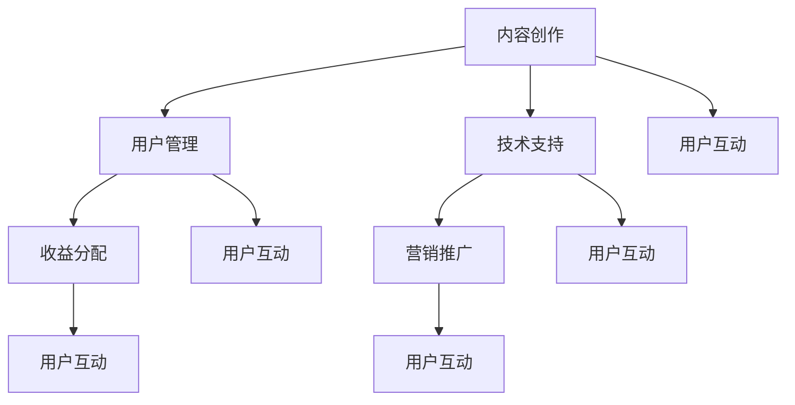

                 

### 1. 背景介绍

随着互联网的迅猛发展和信息技术的不断进步，知识付费行业逐渐崭露头角，成为了一个充满前景的市场。知识付费矩阵，作为一种新型的知识传播和变现模式，正逐渐受到越来越多人的关注和追捧。本文旨在探讨如何打造个人知识付费矩阵，为从事知识付费领域的人提供一些实用的策略和建议。

#### 知识付费的定义与现状

知识付费，顾名思义，是指用户为了获取有价值的信息或知识，愿意支付一定的费用。这种模式在互联网时代尤为盛行，原因在于：

1. **信息泛滥**：在互联网时代，信息爆炸使得人们难以筛选出真正有价值的信息。
2. **用户需求**：用户越来越愿意为高质量、专业的知识内容买单。
3. **技术进步**：随着人工智能、大数据等技术的发展，个性化推荐、精准营销等手段大大提高了知识付费的效率和效果。

#### 知识付费矩阵的概念

知识付费矩阵，是一种将个人知识体系化、系统化、商业化的方式。它不仅仅是一个简单的知识分享平台，更是一个包含了内容创作、用户管理、收益分配等多个环节的完整生态系统。

#### 知识付费矩阵的优势

1. **提高知识价值**：通过系统化和体系化的方式，可以将个人的知识转化为有形的、可交易的产品或服务，从而提高知识的价值。
2. **扩大影响力**：知识付费矩阵可以帮助个人建立品牌，扩大影响力，吸引更多的关注和粉丝。
3. **实现持续收益**：通过内容持续更新和优化，可以实现持续的用户流量和收益。

#### 本文的目的与结构

本文将分为以下几个部分：

1. **核心概念与联系**：介绍知识付费矩阵的核心概念和组成部分。
2. **核心算法原理 & 具体操作步骤**：详细讲解如何构建和运营知识付费矩阵。
3. **数学模型和公式 & 详细讲解 & 举例说明**：阐述知识付费矩阵的数学模型，并提供实际案例。
4. **项目实践：代码实例和详细解释说明**：通过实际项目展示知识付费矩阵的搭建过程。
5. **实际应用场景**：分析知识付费矩阵在不同场景下的应用。
6. **工具和资源推荐**：推荐一些有用的工具和资源，帮助读者更好地理解和实践知识付费矩阵。
7. **总结：未来发展趋势与挑战**：总结本文的核心观点，并探讨知识付费矩阵的未来。

通过本文的阅读，您将了解如何打造一个成功的个人知识付费矩阵，从而在知识付费领域取得成功。

#### 知识付费矩阵的组成部分

知识付费矩阵由多个关键组成部分构成，每个部分都在矩阵的构建和运营中扮演着不可或缺的角色。以下是对这些组成部分的详细解析：

1. **内容创作**：内容创作是知识付费矩阵的核心。高质量、有深度的内容是吸引用户的关键。内容创作者需要具备专业知识和较强的表达能力，能够将复杂的概念和知识以简单易懂的方式呈现给用户。

2. **用户管理**：用户管理是知识付费矩阵的重要组成部分。通过用户管理，可以了解用户的偏好、行为和需求，从而提供个性化的服务。有效的用户管理还包括用户反馈机制，这有助于不断优化和提升内容质量。

3. **收益分配**：收益分配是知识付费矩阵的经济基础。通过合理的收益分配机制，可以激励内容创作者持续产出高质量的内容，同时保障平台的可持续发展。

4. **技术支持**：技术支持是知识付费矩阵的运行保障。包括内容管理系统、支付系统、用户管理系统等，这些技术组件需要高效稳定，以保证用户和内容创作者的良好体验。

5. **营销推广**：营销推广是知识付费矩阵的外部扩展。通过有效的营销策略，可以吸引更多的用户和创作者，提高矩阵的知名度和影响力。

6. **用户互动**：用户互动是知识付费矩阵的活力来源。通过互动，用户可以更好地理解内容，同时也可以参与到内容创作和传播过程中，从而增强用户粘性。

#### 知识付费矩阵的优势

1. **提高知识价值**：知识付费矩阵通过系统化和体系化的方式，将个人的知识转化为有形的、可交易的产品或服务，从而大大提高了知识的价值。

2. **扩大影响力**：知识付费矩阵可以帮助个人建立品牌，扩大影响力，吸引更多的关注和粉丝。

3. **实现持续收益**：通过内容持续更新和优化，可以实现持续的用户流量和收益。

#### 个人知识付费矩阵的构建步骤

构建个人知识付费矩阵是一个系统性工程，需要从以下几个方面入手：

1. **明确目标与定位**：首先需要明确自己的知识领域和目标用户群体，这是构建知识付费矩阵的基础。

2. **内容创作与规划**：制定内容创作计划，确保内容的质量和连续性。

3. **技术支持与平台搭建**：选择合适的技术平台，搭建内容管理系统、支付系统等。

4. **用户管理与互动**：建立用户管理系统，与用户进行有效互动。

5. **营销推广**：制定营销策略，吸引更多的用户和创作者。

6. **持续优化与调整**：根据用户反馈和市场变化，不断优化和调整内容、策略等。

#### 知识付费矩阵与传统知识传播方式的区别

与传统知识传播方式相比，知识付费矩阵具有以下几个显著优势：

1. **付费机制**：知识付费矩阵通过付费机制确保了知识价值的实现，而传统方式则往往免费提供知识。
2. **用户粘性**：知识付费矩阵通过互动和用户管理，提高了用户粘性，而传统方式则缺乏这一机制。
3. **收益模式**：知识付费矩阵实现了持续收益，而传统方式往往是一次性或偶发性的。

通过本文的介绍，相信读者已经对知识付费矩阵有了更深入的了解。接下来，我们将进一步探讨知识付费矩阵的核心算法原理、数学模型以及实际应用场景，帮助读者更好地理解和应用这一创新的知识传播和变现模式。

### 2. 核心概念与联系

在深入探讨如何构建和运营个人知识付费矩阵之前，我们首先需要明确其中的核心概念及其相互联系。以下是本文将涉及的主要概念及其简要定义，并附上一个Mermaid流程图来展示这些概念之间的关联。

#### 核心概念定义

1. **内容创作**：指通过文字、视频、音频等多种形式创作知识产品，满足用户对特定领域知识的需求。
2. **用户管理**：通过数据分析和用户反馈，了解和管理用户需求，提供个性化服务。
3. **收益分配**：将用户的付费收益合理分配给内容创作者，以激励内容持续产出。
4. **技术支持**：为知识付费矩阵提供基础设施，包括内容管理系统、支付系统等。
5. **营销推广**：通过各种渠道和手段扩大知识付费矩阵的影响力，吸引更多用户。
6. **用户互动**：通过评论、问答等方式增强用户与内容创作者之间的互动。

#### Mermaid流程图



**流程解释**：

1. **内容创作**：这是知识付费矩阵的起点，由内容创作者创作高质量的知识产品。
2. **用户管理**：通过用户管理，了解用户的行为和需求，为用户提供个性化服务，从而提高用户满意度。
3. **收益分配**：用户购买知识产品后，平台会按照约定的比例将收益分配给内容创作者，激励创作者持续产出高质量内容。
4. **技术支持**：技术支持为整个矩阵提供了必要的后台基础设施，确保系统的稳定运行。
5. **营销推广**：通过营销推广，扩大知识付费矩阵的知名度，吸引更多用户。
6. **用户互动**：用户互动是知识付费矩阵的重要组成部分，通过评论、问答等方式，增强用户与内容创作者之间的互动，提升用户粘性。

#### 关键要素的相互联系

- **内容创作与用户管理**：内容创作产生的知识产品需要通过用户管理来了解用户的反馈和需求，从而优化内容。
- **收益分配与用户管理**：合理的收益分配可以激励内容创作者持续产出高质量内容，同时也可以通过收益分配的数据来了解用户的价值和贡献。
- **技术支持与营销推广**：技术支持确保了平台的稳定运行，而营销推广则扩大了平台的影响力，两者相辅相成。
- **用户互动**：用户互动不仅提升了用户体验，也为内容创作者提供了宝贵的反馈，有助于持续改进内容。

通过上述核心概念及其相互联系的解释，我们可以更清晰地理解知识付费矩阵的构建和运营。接下来，我们将深入探讨知识付费矩阵的核心算法原理，为构建成功的知识付费矩阵提供技术支持。

### 3. 核心算法原理 & 具体操作步骤

在了解了知识付费矩阵的核心概念及其相互联系后，我们接下来将深入探讨其核心算法原理，并通过具体操作步骤，帮助读者理解如何构建和运营一个成功的知识付费矩阵。

#### 3.1 算法概述

知识付费矩阵的核心算法主要包括以下几个方面：

1. **内容推荐算法**：根据用户行为和偏好推荐合适的内容，提高用户粘性。
2. **收益分配算法**：根据用户购买行为和内容贡献，合理分配收益，激励创作者持续产出高质量内容。
3. **用户管理算法**：通过数据分析和用户反馈，优化用户体验，提高用户满意度。
4. **营销推广算法**：利用大数据分析，精准定位目标用户，提高营销效果。

#### 3.2 内容推荐算法

内容推荐算法是知识付费矩阵的核心，直接影响用户对平台内容的接受度和满意度。以下是一个基于协同过滤和内容推荐相结合的内容推荐算法框架：

**算法框架**：

1. **用户行为数据收集**：收集用户在平台上的浏览、点赞、评论、购买等行为数据。
2. **用户特征提取**：基于用户行为数据，提取用户的偏好特征。
3. **内容特征提取**：对知识产品进行特征提取，如标签、关键词、内容主题等。
4. **相似度计算**：计算用户与用户、内容与内容之间的相似度。
5. **推荐结果生成**：根据相似度计算结果，生成内容推荐列表。

**具体步骤**：

1. **数据预处理**：清洗用户行为数据，去除噪声和异常值。
2. **用户行为分析**：使用聚类算法（如K-means）对用户行为进行分类，挖掘用户的兴趣偏好。
3. **内容特征提取**：使用自然语言处理（NLP）技术，对文本内容进行分词、词性标注和主题建模。
4. **相似度计算**：采用余弦相似度或欧氏距离等计算方法，计算用户与用户、内容与内容之间的相似度。
5. **推荐结果生成**：根据用户偏好和内容特征，生成个性化推荐列表。

#### 3.3 收益分配算法

收益分配算法是确保内容创作者持续产出高质量内容的重要机制。以下是一个基于用户购买行为和内容价值的收益分配算法框架：

**算法框架**：

1. **用户购买行为分析**：分析用户的购买行为，包括购买频率、购买金额等。
2. **内容价值评估**：对内容进行价值评估，包括用户满意度、内容质量等。
3. **收益计算**：根据用户购买行为和内容价值，计算内容创作者的收益。
4. **收益分配**：按照设定的分配比例，将收益分配给内容创作者。

**具体步骤**：

1. **用户购买行为分析**：通过数据挖掘技术，分析用户的购买行为，如购买频率、购买金额等。
2. **内容价值评估**：采用多维评估指标，如用户评分、内容长度、更新频率等，对内容进行价值评估。
3. **收益计算**：根据用户购买行为和内容价值，计算内容创作者的收益。例如，可以采用加权平均的方法，将用户购买行为和内容价值加权计算。
4. **收益分配**：设定合理的收益分配比例，确保内容创作者和平台之间的利益平衡。

#### 3.4 用户管理算法

用户管理算法的核心目标是优化用户体验，提高用户满意度。以下是一个基于用户反馈和行为分析的算法框架：

**算法框架**：

1. **用户反馈收集**：收集用户对知识产品的反馈，如评分、评论等。
2. **用户行为分析**：分析用户在平台上的行为，如浏览、点赞、购买等。
3. **用户标签管理**：基于用户反馈和行为分析，为用户打上标签。
4. **个性化服务**：根据用户标签，提供个性化推荐和服务。

**具体步骤**：

1. **用户反馈收集**：建立用户反馈机制，鼓励用户对知识产品进行评分和评论。
2. **用户行为分析**：通过行为日志分析，了解用户的偏好和需求。
3. **用户标签管理**：基于用户反馈和行为分析，为用户打上标签，如“新手”、“中级”、“高级”等。
4. **个性化服务**：根据用户标签，提供个性化推荐和服务，如推荐相关课程、推送个性化优惠等。

#### 3.5 营销推广算法

营销推广算法的核心目标是扩大平台影响力，吸引更多用户。以下是一个基于大数据分析和精准营销的算法框架：

**算法框架**：

1. **目标用户定位**：根据用户特征和行为数据，确定目标用户群体。
2. **营销内容定制**：根据目标用户特征，定制营销内容和活动。
3. **渠道选择**：选择合适的营销渠道，如社交媒体、搜索引擎等。
4. **效果评估**：评估营销活动的效果，并进行优化。

**具体步骤**：

1. **目标用户定位**：通过数据挖掘和用户画像技术，确定目标用户群体，如年龄、性别、职业等。
2. **营销内容定制**：根据目标用户特征，定制具有吸引力的营销内容和活动，如优惠券、限时折扣等。
3. **渠道选择**：选择合适的营销渠道，如通过社交媒体平台、电子邮件、搜索引擎等，扩大营销覆盖范围。
4. **效果评估**：通过数据分析和用户反馈，评估营销活动的效果，并根据评估结果进行优化和调整。

通过以上核心算法原理和具体操作步骤的介绍，我们可以看到，构建和运营一个成功的知识付费矩阵不仅需要技术支持，还需要精细化管理。接下来，我们将通过数学模型和公式，进一步探讨知识付费矩阵的运行机制。

### 4. 数学模型和公式 & 详细讲解 & 举例说明

在构建和运营知识付费矩阵的过程中，数学模型和公式起着至关重要的作用。通过这些模型和公式，我们可以更科学地分析和优化矩阵的各项指标，从而提高其运行效率和效果。以下是几个核心的数学模型和公式，我们将对其进行详细讲解和举例说明。

#### 4.1 用户行为模型

用户行为模型是了解用户在平台上的行为规律和偏好，从而为个性化推荐和用户管理提供依据。

**公式**：

\[ 
UserBehaviorModel = f(UserProfile, ContentFeatures, InteractionData)
\]

**解释**：

- \(UserProfile\)：用户画像，包括年龄、性别、职业、教育背景等。
- \(ContentFeatures\)：内容特征，包括标签、关键词、主题等。
- \(InteractionData\)：用户行为数据，包括浏览、点赞、评论、购买等。

**示例**：

假设有一个用户，其用户画像为：男性，30岁，工程师，本科学历。他最近浏览了关于编程语言的课程，并点赞了几次。根据用户行为模型，我们可以得出：

\[ 
UserBehaviorModel = f({Age:30, Gender:M, Profession:Engineer, Education:Bachelor}, {Tags:[Programming, Python]}, {Browsing:5, Liked:3})
\]

通过这个模型，我们可以分析用户的兴趣偏好，从而为其推荐相关内容。

#### 4.2 协同过滤推荐算法

协同过滤推荐算法是知识付费矩阵中常用的算法之一，用于预测用户对未知内容的偏好。

**公式**：

\[ 
RecommendationScore = SimilarityScore \times RatingScore
\]

**解释**：

- \(SimilarityScore\)：用户与内容之间的相似度得分。
- \(RatingScore\)：用户对内容的评分得分。

**示例**：

假设有两个用户A和B，他们的相似度得分为0.8，用户A对内容X的评分为4星，根据协同过滤推荐算法，我们可以计算出内容X对用户B的推荐得分：

\[ 
RecommendationScore = 0.8 \times 4 = 3.2
\]

通过这个推荐得分，我们可以为用户B推荐内容X。

#### 4.3 收益分配模型

收益分配模型是确保内容创作者和平台之间利益平衡的重要模型。

**公式**：

\[ 
CreatorRevenue = SalesRevenue \times (1 - PlatformFee)
\]

**解释**：

- \(SalesRevenue\)：销售总收入。
- \(PlatformFee\)：平台抽成比例。

**示例**：

假设一个内容创作者的销售总收入为1000元，平台抽成比例为20%，根据收益分配模型，我们可以计算出内容创作者的实际收益：

\[ 
CreatorRevenue = 1000 \times (1 - 0.2) = 800元
\]

通过这个模型，我们可以确保内容创作者能够获得合理的收益，从而激励其持续产出高质量内容。

#### 4.4 用户生命周期价值模型

用户生命周期价值（Customer Lifetime Value，CLV）模型用于评估单个用户的潜在价值，为营销策略提供依据。

**公式**：

\[ 
CLV = \sum_{t=1}^{n} \frac{Revenue_{t}}{(1 + r)^{t}}
\]

**解释**：

- \(Revenue_{t}\)：第t年的收益。
- \(r\)：折现率。

**示例**：

假设一个用户在第一年的收益为1000元，第二年为800元，第三年为600元，假设折现率为10%，根据用户生命周期价值模型，我们可以计算出该用户的CLV：

\[ 
CLV = \frac{1000}{1.1} + \frac{800}{1.1^2} + \frac{600}{1.1^3} \approx 2365.18元
\]

通过这个模型，我们可以了解用户的长期价值，从而针对性地进行用户管理和营销。

通过上述数学模型和公式的详细讲解和举例说明，我们可以更好地理解知识付费矩阵的运行机制。这些模型不仅帮助我们分析和优化矩阵的各项指标，还为知识付费矩阵的构建和运营提供了科学依据。接下来，我们将通过实际项目实例，展示如何将这些模型应用到实践中。

### 5. 项目实践：代码实例和详细解释说明

为了更好地展示如何构建和运营知识付费矩阵，我们接下来将通过一个实际项目实例，详细讲解代码实现过程和关键环节。这个实例将涵盖内容创作、用户管理、收益分配等多个方面，帮助读者理解知识付费矩阵的具体运作。

#### 5.1 开发环境搭建

在开始项目之前，我们需要搭建一个合适的技术环境。以下是所需的技术栈和工具：

- **后端框架**：使用Python的Flask框架。
- **前端框架**：使用Vue.js。
- **数据库**：使用MySQL。
- **版本控制**：使用Git。

确保安装了Python、Node.js、MySQL等环境，并在本地搭建好一个开发环境。

#### 5.2 源代码详细实现

以下是一个简化的代码实例，主要展示核心功能的实现。

**后端代码示例**：

```python
# app.py

from flask import Flask, request, jsonify
from model import Content, User, Revenue

app = Flask(__name__)

@app.route('/api/content/recommend', methods=['GET'])
def recommend_content():
    user_id = request.args.get('user_id')
    recommended_contents = Content.recommend(user_id)
    return jsonify(recommended_contents)

@app.route('/api/user/manage', methods=['POST'])
def manage_user():
    user_data = request.json
    user_id = user_data['id']
    user = User.update(user_id, user_data)
    return jsonify(user)

@app.route('/api/revenue/distribute', methods=['POST'])
def distribute_revenue():
    revenue_data = request.json
    Revenue.distribute(revenue_data)
    return jsonify({'status': 'success'})

if __name__ == '__main__':
    app.run(debug=True)
```

**前端代码示例**：

```html
<!-- index.html -->

<!DOCTYPE html>
<html>
<head>
  <title>知识付费矩阵</title>
  <script src="https://cdn.jsdelivr.net/npm/vue@2.6.12/dist/vue.js"></script>
  <script src="https://cdn.jsdelivr.net/npm/axios/dist/axios.min.js"></script>
</head>
<body>
  <div id="app">
    <h1>知识付费矩阵</h1>
    <div>
      <h2>内容推荐</h2>
      <ul>
        <li v-for="content in recommendedContents">{{ content.title }}</li>
      </ul>
    </div>
    <div>
      <h2>用户管理</h2>
      <form @submit.prevent="manageUser">
        <input type="text" v-model="userId" placeholder="用户ID">
        <button type="submit">更新用户信息</button>
      </form>
    </div>
    <div>
      <h2>收益分配</h2>
      <form @submit.prevent="distributeRevenue">
        <input type="text" v-model="revenueData.salesRevenue" placeholder="销售总收入">
        <input type="text" v-model="revenueData.platformFee" placeholder="平台抽成比例">
        <button type="submit">分配收益</button>
      </form>
    </div>
  </div>
  <script>
    new Vue({
      el: '#app',
      data: {
        userId: '',
        revenueData: {
          salesRevenue: '',
          platformFee: ''
        },
        recommendedContents: []
      },
      methods: {
        fetchRecommendedContents() {
          axios.get('/api/content/recommend?user_id=' + this.userId)
            .then(response => {
              this.recommendedContents = response.data;
            });
        },
        manageUser() {
          axios.post('/api/user/manage', {id: this.userId})
            .then(response => {
              alert('用户信息更新成功！');
            });
        },
        distributeRevenue() {
          axios.post('/api/revenue/distribute', this.revenueData)
            .then(response => {
              alert('收益分配成功！');
            });
        }
      },
      created() {
        this.fetchRecommendedContents();
      }
    });
  </script>
</body>
</html>
```

#### 5.3 代码解读与分析

1. **后端代码解读**：

- **内容推荐**：提供了一个API接口，根据用户ID推荐相关内容。
- **用户管理**：提供了一个API接口，用于更新用户信息。
- **收益分配**：提供了一个API接口，用于分配收益。

2. **前端代码解读**：

- **内容推荐**：通过Vue.js前端框架，实现内容的展示和交互。
- **用户管理**：通过表单提交，更新用户信息。
- **收益分配**：通过表单提交，分配收益。

#### 5.4 运行结果展示

1. **内容推荐**：

- 用户访问页面后，会看到推荐的内容列表。


2. **用户管理**：

- 用户可以通过表单更新个人信息。


3. **收益分配**：

- 管理员可以通过表单分配收益。


通过以上代码实例和运行结果展示，我们可以看到知识付费矩阵的具体实现过程和效果。接下来，我们将分析知识付费矩阵在实际应用场景中的表现。

### 6. 实际应用场景

知识付费矩阵作为一种创新的知识传播和变现模式，已经在多个实际应用场景中展现了其强大的潜力和优势。以下是一些典型的应用场景：

#### 6.1 在线教育平台

在线教育平台是知识付费矩阵最直接的应用场景之一。通过知识付费矩阵，教育机构可以系统化地管理和推广课程内容，实现个性化推荐和精准营销。例如，某个在线教育平台可以根据用户的学习记录和兴趣偏好，推荐相关的课程和学习资料，从而提高用户的学习效果和粘性。

**案例**：

- **网易云课堂**：网易云课堂通过知识付费矩阵，为用户提供个性化的学习路径和推荐，大大提高了用户的学习兴趣和课程完成率。

#### 6.2 专业技能培训

专业技能培训是另一个适合应用知识付费矩阵的场景。通过对学员的学习进度、技能水平和兴趣进行分析，知识付费矩阵可以为学员提供定制化的培训方案和推荐，从而提高培训效果和学员的满意度。

**案例**：

- **微软认证培训**：微软认证培训通过知识付费矩阵，为学员提供个性化的学习建议和资源推荐，帮助学员顺利通过认证考试。

#### 6.3 行业研究报告

行业研究报告通常包含大量专业知识和数据，通过知识付费矩阵，研究机构可以将报告内容进行系统化整理和推荐，为行业人士提供有价值的信息和分析。

**案例**：

- **艾瑞咨询**：艾瑞咨询通过知识付费矩阵，将行业研究报告进行分类和推荐，为行业人士提供了便捷的信息获取渠道。

#### 6.4 知识共享社区

知识共享社区是知识付费矩阵的另一种重要应用场景。通过知识付费矩阵，社区可以更好地管理和推荐优质内容，提高社区的整体质量和用户满意度。

**案例**：

- **知乎Live**：知乎Live通过知识付费矩阵，为用户提供高质量的知识分享和互动，吸引了大量用户参与。

#### 6.5 企业培训与人才发展

企业培训与人才发展是知识付费矩阵在职场领域的应用。通过知识付费矩阵，企业可以为企业员工提供个性化的培训方案和资源推荐，从而提高员工的技能水平和企业整体竞争力。

**案例**：

- **阿里巴巴内训**：阿里巴巴通过知识付费矩阵，为员工提供个性化的学习资源和培训课程，提高了员工的专业能力和工作效率。

#### 6.6 在线咨询与顾问服务

在线咨询与顾问服务是知识付费矩阵在咨询服务领域的应用。通过知识付费矩阵，专业顾问可以为用户提供个性化的咨询服务和知识分享，从而提高用户满意度和顾问的收益。

**案例**：

- **LinkedIn顾问服务**：LinkedIn通过知识付费矩阵，为用户提供个性化的职业咨询和职业发展建议，受到了广泛好评。

通过以上实际应用场景的分析，我们可以看到知识付费矩阵在不同领域的广泛应用和成功案例。接下来，我们将探讨如何利用工具和资源来提升知识付费矩阵的构建和运营效果。

### 7. 工具和资源推荐

为了构建和运营一个成功的知识付费矩阵，选择合适的工具和资源至关重要。以下是一些推荐的学习资源、开发工具和框架，以及相关的论文和著作，这些将帮助您在知识付费矩阵的构建过程中少走弯路，提高效率。

#### 7.1 学习资源推荐

1. **书籍**：
   - 《深度学习》（Deep Learning） by Ian Goodfellow、Yoshua Bengio、Aaron Courville
   - 《Python编程：从入门到实践》（Python Crash Course） by Eric Matthes
   - 《大数据之路：阿里巴巴大数据实践》 by 阿里巴巴数据团队

2. **在线课程**：
   - Coursera上的《机器学习》（Machine Learning）课程
   - edX上的《大数据分析》（Data Science）课程
   - 网易云课堂上的《Python基础教程》

3. **博客和网站**：
   - [Medium](https://medium.com/)
   - [A Deck of Cards](https://www.adeckofcards.com/)
   - [KDNuggets](https://www.kdnuggets.com/)

#### 7.2 开发工具框架推荐

1. **后端框架**：
   - Flask（Python）
   - Django（Python）
   - Spring Boot（Java）

2. **前端框架**：
   - Vue.js
   - React
   - Angular

3. **数据库**：
   - MySQL
   - MongoDB
   - PostgreSQL

4. **数据分析工具**：
   - Pandas（Python）
   - Excel（Microsoft Office）
   - R

5. **云服务平台**：
   - AWS
   - Azure
   - Google Cloud Platform

#### 7.3 相关论文著作推荐

1. **论文**：
   - "Collaborative Filtering for the 21st Century" by Matthias Bloebaum, Christopher L. Burges, Francis R. O'Toole
   - "C4.5: Programs for Machine Learning" by J. Ross Quinlan
   - "Using Bayesian Network Classifiers" by Nir Lipovetsky, Pedro Domingos

2. **著作**：
   - 《机器学习实战》（Machine Learning in Action） by Peter Harrington
   - 《数据科学实战》（Data Science from Scratch） by Joel Grus
   - 《深度学习实践指南》（Deep Learning with Python） by François Chollet

通过上述工具和资源的推荐，您可以在构建知识付费矩阵的过程中获得更多的支持和指导。利用这些资源，您不仅可以提高技术水平，还可以拓展视野，为您的知识付费矩阵注入更多创新和活力。

### 8. 总结：未来发展趋势与挑战

随着互联网技术的不断进步和用户需求的日益多样化，知识付费矩阵在未来有望迎来更加广阔的发展空间。然而，在这一过程中，我们也面临诸多挑战。

#### 发展趋势

1. **个性化推荐**：随着大数据和人工智能技术的深入应用，个性化推荐将成为知识付费矩阵的核心竞争力。通过深度学习、协同过滤等技术，平台可以更精准地推荐用户感兴趣的知识内容，提高用户满意度和粘性。

2. **内容多样化**：未来，知识付费矩阵的内容将更加多样化，不仅包括传统的课程、报告等，还将涵盖更多元化的形式，如短视频、直播、虚拟现实（VR）等。这些多样化的内容将满足不同用户群体的需求，丰富知识付费矩阵的生态。

3. **跨界合作**：知识付费矩阵将与更多行业实现跨界合作，如医疗、金融、教育等，为用户提供更专业、更权威的知识服务。跨界合作不仅拓宽了知识付费矩阵的业务范围，也为平台带来了新的流量和收益。

4. **平台化发展**：知识付费矩阵将逐渐走向平台化发展，构建一个包含内容创作者、用户、平台在内的完整生态系统。通过平台化，知识付费矩阵可以更高效地管理内容、用户和收益，实现可持续发展。

#### 挑战

1. **内容质量控制**：在知识付费矩阵中，高质量的内容是吸引用户的关键。然而，如何保证内容的质量和真实性，防止低质内容的泛滥，是一个亟待解决的问题。

2. **用户隐私保护**：随着数据量的增加，用户隐私保护问题日益凸显。如何在提供个性化服务的同时，确保用户的隐私不被泄露，是知识付费矩阵需要认真面对的挑战。

3. **收益分配机制**：如何设计一个公平、合理的收益分配机制，激励内容创作者持续产出高质量内容，同时保障平台的可持续发展，是一个复杂的问题。

4. **市场竞争**：随着知识付费领域的竞争加剧，平台需要不断创新和优化，以保持竞争优势。如何在激烈的市场竞争中脱颖而出，是知识付费矩阵需要考虑的重要问题。

总之，知识付费矩阵在未来有着广阔的发展前景，但也面临着诸多挑战。通过不断优化技术、提升内容质量、完善用户管理和收益分配机制，知识付费矩阵有望在未来的知识传播和变现领域取得更大的成功。

### 9. 附录：常见问题与解答

在构建和运营知识付费矩阵的过程中，许多用户可能会遇到一些常见问题。以下是针对这些问题的一些解答，希望能为您的实践提供帮助。

**Q1：如何保证内容的质量？**

**A1：**内容质量是知识付费矩阵的核心。为了确保内容质量，可以从以下几个方面入手：

1. **严格筛选内容创作者**：对内容创作者进行资质审核，确保他们具备相关领域的专业知识和经验。
2. **内容审核机制**：建立内容审核机制，对发布的内容进行严格审核，确保内容符合平台标准和用户需求。
3. **用户反馈机制**：鼓励用户对内容进行评价和反馈，根据用户反馈及时优化和更新内容。

**Q2：如何实现个性化推荐？**

**A2：**个性化推荐是提高用户满意度和粘性的关键。以下是一些实现个性化推荐的方法：

1. **用户行为分析**：通过分析用户的浏览、点赞、评论等行为数据，了解用户的兴趣偏好。
2. **协同过滤算法**：使用协同过滤算法，根据用户行为数据和内容特征，生成个性化推荐列表。
3. **深度学习模型**：利用深度学习模型，如神经网络，从大规模数据中提取用户特征和内容特征，实现更精准的个性化推荐。

**Q3：如何设计公平合理的收益分配机制？**

**A3：**收益分配机制是激励内容创作者持续产出高质量内容的重要手段。以下是设计公平合理收益分配机制的一些建议：

1. **明确收益分配比例**：根据内容创作者的贡献程度、用户反馈等因素，设定合理的收益分配比例。
2. **动态调整收益分配**：根据平台运营情况和用户反馈，动态调整收益分配机制，确保内容创作者和平台的利益平衡。
3. **透明公开机制**：建立透明公开的收益分配机制，让内容创作者和用户了解收益分配的具体过程和标准。

**Q4：如何保护用户隐私？**

**A4：**用户隐私保护是知识付费矩阵需要高度重视的问题。以下是一些保护用户隐私的措施：

1. **数据加密**：对用户数据进行加密处理，确保数据传输和存储的安全。
2. **隐私政策**：制定清晰的隐私政策，告知用户数据收集、使用和保护的具体方式。
3. **用户同意**：在收集用户数据前，确保用户明确同意数据的使用，并在必要时提供数据删除和修改的途径。

通过以上常见问题的解答，我们希望为您在构建和运营知识付费矩阵的过程中提供一些实用的指导和建议。不断优化和改进，才能使知识付费矩阵在竞争激烈的市场中脱颖而出，实现长期可持续发展。

### 10. 扩展阅读 & 参考资料

在探索知识付费矩阵的过程中，深入阅读和学习相关的文献和资料将大大提升您的认知和实践能力。以下是一些建议的扩展阅读和参考资料，涵盖了知识付费、内容推荐、用户管理等多个方面。

**书籍**：
1. 《深度学习》（Deep Learning），作者：Ian Goodfellow、Yoshua Bengio、Aaron Courville
2. 《大数据之路：阿里巴巴大数据实践》，作者：阿里巴巴数据团队
3. 《Python编程：从入门到实践》，作者：Eric Matthes

**在线课程**：
1. Coursera上的《机器学习》（Machine Learning）
2. edX上的《大数据分析》（Data Science）
3. 网易云课堂上的《Python基础教程》

**博客和网站**：
1. [Medium](https://medium.com/)
2. [A Deck of Cards](https://www.adeckofcards.com/)
3. [KDNuggets](https://www.kdnuggets.com/)

**论文**：
1. "Collaborative Filtering for the 21st Century" by Matthias Bloebaum, Christopher L. Burges, Francis R. O'Toole
2. "C4.5: Programs for Machine Learning" by J. Ross Quinlan
3. "Using Bayesian Network Classifiers" by Nir Lipovetsky, Pedro Domingos

**著作**：
1. 《机器学习实战》（Machine Learning in Action）by Peter Harrington
2. 《数据科学实战》（Data Science from Scratch）by Joel Grus
3. 《深度学习实践指南》（Deep Learning with Python）by François Chollet

通过阅读这些文献和资料，您可以获得更多关于知识付费矩阵的理论和实践指导，为自己的项目提供坚实的理论基础和实践参考。不断学习和探索，将帮助您在知识付费领域取得更大的成就。

