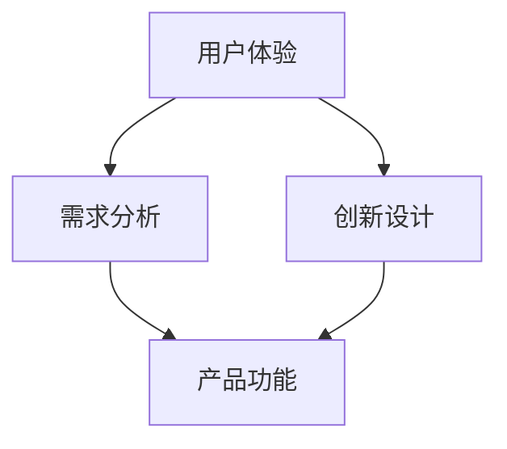

                 

### 1. 背景介绍

在当今科技飞速发展的时代，用户需求不断升级，市场竞争愈发激烈。如何打造出令用户惊喜的产品功能，已经成为企业和开发者们共同面临的一大挑战。在传统的软件开发模式中，我们往往侧重于功能的完备性和系统的稳定性，而忽视了用户体验的极致优化。然而，用户体验的重要性愈发凸显，它不仅直接影响到用户对产品的满意度，还决定了产品的市场竞争力。

用户惊喜的产品功能，不仅需要满足用户的基本需求，还要超越用户的期待，提供一种独特的、愉悦的体验。这种功能的打造，不仅仅依赖于技术的创新，更需要深入理解用户的行为模式和心理需求。因此，本文将从多个维度出发，详细探讨如何通过系统的分析和科学的方法，打造出令用户惊喜的产品功能。

在接下来的章节中，我们将首先回顾一些相关的核心概念，包括用户体验、需求分析、创新设计等，并借助Mermaid流程图来展示这些概念之间的关系。然后，我们将深入探讨核心算法原理，提供具体的操作步骤，并借助数学模型和公式来详细讲解。接着，我们将通过实际的项目实践，展示如何将理论应用到实践中，并进行详细的代码解读与分析。

此外，我们还将探讨这款产品功能在实际应用场景中的表现，推荐一些相关的学习资源和开发工具，帮助读者更好地理解和掌握这一领域的知识。最后，我们将总结未来发展趋势与挑战，并给出一些常见问题的解答，以期为读者提供全面的指导。

### 2. 核心概念与联系

在深入探讨如何打造令用户惊喜的产品功能之前，我们需要了解一些核心概念，这些概念包括用户体验、需求分析、创新设计等。为了更好地展示这些概念之间的关系，我们将使用Mermaid流程图来呈现它们。

#### 2.1 用户体验

用户体验（User Experience，简称UX）是用户在使用产品过程中所感受到的整体体验，包括交互设计、视觉设计、功能设计等多个方面。用户体验的核心目标是满足用户需求，提升用户满意度。


#### 2.2 需求分析

需求分析是软件开发过程中至关重要的一步，它旨在理解用户的需求，并将其转化为具体的产品功能。通过需求分析，我们可以明确产品的功能模块，为后续的设计和开发提供依据。


#### 2.3 创新设计

创新设计不仅仅是对现有设计的改进，更是对用户体验的深度挖掘。它需要我们跳出传统思维，从全新的角度出发，设计出能够真正打动用户的功能。


#### 2.4 关系与联系

用户体验、需求分析和创新设计三者之间存在着密切的联系。用户体验是需求分析和创新设计的最终目标，而需求分析和创新设计则是实现用户体验的关键步骤。具体来说：

1. **需求分析为创新设计提供方向**：通过对用户需求的深入分析，我们可以明确用户的核心需求，从而在创新设计过程中有的放矢。
2. **创新设计提升用户体验**：创新设计不仅仅是对现有设计的优化，更是对用户体验的深度挖掘。通过创新设计，我们可以提供更加个性化、人性化的功能，提升用户的满意度。
3. **用户体验反馈驱动持续改进**：用户体验是需求分析和创新设计的最终衡量标准。通过用户反馈，我们可以了解产品的不足之处，从而不断优化和创新，提升用户体验。

为了更好地展示这些概念之间的关系，我们可以使用Mermaid流程图来呈现：



通过这个流程图，我们可以清晰地看到用户体验、需求分析和创新设计之间的关系，以及它们在产品功能打造过程中的重要作用。

### 3. 核心算法原理 & 具体操作步骤

在了解了核心概念之后，接下来我们将深入探讨如何通过具体的技术手段，打造出令用户惊喜的产品功能。这一部分，我们将重点介绍核心算法原理，并给出具体的操作步骤。

#### 3.1 算法原理概述

打造令用户惊喜的产品功能，关键在于找到一种能够深度挖掘用户需求，并提供个性化服务的算法。在这里，我们采用一种基于机器学习技术的算法，通过数据分析和用户行为预测，为用户推荐个性化的产品功能。

#### 3.2 具体操作步骤

1. **数据收集**：首先，我们需要收集大量的用户数据，包括用户行为数据、偏好数据等。这些数据可以通过用户使用产品的日志、问卷调查等方式获取。

    ```mermaid
    graph TD
        A[数据收集] --> B[用户行为数据]
        A --> C[偏好数据]
    ```

2. **数据处理**：在收集到数据后，我们需要对数据进行清洗和预处理，去除噪声和异常值，以便后续的分析。

    ```mermaid
    graph TD
        D[用户行为数据] --> E[数据清洗]
        C[偏好数据] --> E
    ```

3. **特征提取**：通过数据预处理，我们提取出关键特征，如用户的使用时长、使用频率、偏好类型等。

    ```mermaid
    graph TD
        E --> F[特征提取]
    ```

4. **模型训练**：接下来，我们使用机器学习算法，如决策树、随机森林、神经网络等，对提取出的特征进行训练，建立用户行为预测模型。

    ```mermaid
    graph TD
        F --> G[模型训练]
    ```

5. **模型评估**：在模型训练完成后，我们需要对模型进行评估，确保其预测准确度达到要求。

    ```mermaid
    graph TD
        G --> H[模型评估]
    ```

6. **功能推荐**：基于训练好的模型，我们为用户推荐个性化的产品功能。具体来说，我们可以根据用户的当前行为和历史偏好，为其推荐符合其需求的功能。

    ```mermaid
    graph TD
        H --> I[功能推荐]
    ```

7. **反馈优化**：最后，我们需要根据用户对推荐功能的反馈，不断优化和调整模型，提升推荐效果。

    ```mermaid
    graph TD
        I --> J[反馈优化]
    ```

通过以上具体操作步骤，我们可以逐步打造出令用户惊喜的产品功能。这一过程不仅依赖于先进的技术手段，更需要深入理解用户的需求和行为，从而提供真正有针对性的服务。

### 4. 数学模型和公式 & 详细讲解 & 举例说明

在了解了核心算法原理和具体操作步骤之后，我们需要借助数学模型和公式，对算法进行详细讲解，并给出具体的举例说明。以下将分别介绍这些数学模型和公式的应用。

#### 4.1 数据预处理

数据预处理是算法的第一步，其主要任务是清洗和整理原始数据，为后续的特征提取和模型训练打下基础。

1. **数据清洗**：数据清洗主要包括去除噪声和异常值。对于异常值，我们可以采用以下方法进行检测和去除：

    - **单变量异常检测**：使用统计学方法，如箱线图（Box Plot）或Z-Score方法，检测数据中的异常值。
    - **多变量异常检测**：使用聚类方法，如K-Means聚类，识别数据中的异常点。

    公式示例：
    $$Z = \frac{X - \bar{X}}{\sigma}$$
    其中，$X$为数据点，$\bar{X}$为均值，$\sigma$为标准差。

2. **数据归一化**：数据归一化是将不同量纲的数据转换为相同量纲，以便于后续的特征提取和模型训练。

    公式示例：
    $$X_{\text{new}} = \frac{X - X_{\text{min}}}{X_{\text{max}} - X_{\text{min}}}$$
    其中，$X_{\text{min}}$和$X_{\text{max}}$分别为数据的最小值和最大值。

#### 4.2 特征提取

特征提取是数据预处理的重要环节，其主要目标是提取出能够代表数据本质特性的关键特征。

1. **主成分分析（PCA）**：PCA是一种常用的特征提取方法，通过将数据投影到新的坐标系中，降低数据的维度，同时保留数据的主要信息。

    公式示例：
    $$Z = AS$$
    其中，$Z$为新的特征向量，$A$为旋转矩阵，$S$为奇异值矩阵。

2. **词袋模型（Bag-of-Words，BOW）**：词袋模型是一种文本特征提取方法，将文本表示为一个词汇的集合，每个词汇的频率作为特征值。

    公式示例：
    $$f_{i,j} = \begin{cases} 
    1 & \text{如果单词 } j \text{ 在文档 } i \text{ 中出现} \\
    0 & \text{否则}
    \end{cases}$$

#### 4.3 模型训练

模型训练是算法的核心环节，其主要目标是建立用户行为预测模型。

1. **决策树（Decision Tree）**：决策树是一种常见的分类模型，通过一系列的判断条件，将数据划分为不同的类别。

    公式示例：
    $$y = f(x_1, x_2, ..., x_n)$$
    其中，$y$为输出类别，$x_1, x_2, ..., x_n$为输入特征。

2. **随机森林（Random Forest）**：随机森林是一种基于决策树的集成模型，通过构建多个决策树，并取其平均值进行预测。

    公式示例：
    $$y = \frac{1}{m} \sum_{i=1}^{m} f_i(x)$$
    其中，$f_i(x)$为第$i$棵决策树的预测结果，$m$为决策树的数量。

3. **神经网络（Neural Network）**：神经网络是一种基于模拟人脑神经网络的模型，通过多层神经元的连接，实现数据的非线性变换。

    公式示例：
    $$a_{\text{hidden}} = \sigma(W_{\text{hidden}} \cdot a_{\text{input}} + b_{\text{hidden}})$$
    $$a_{\text{output}} = \sigma(W_{\text{output}} \cdot a_{\text{hidden}} + b_{\text{output}})$$
    其中，$a_{\text{input}}$为输入层神经元，$a_{\text{hidden}}$为隐藏层神经元，$a_{\text{output}}$为输出层神经元，$\sigma$为激活函数。

#### 4.4 举例说明

假设我们收集了一组用户行为数据，包括用户的使用时长、使用频率、偏好类型等。下面我们使用上述的数学模型和公式，对这组数据进行预处理、特征提取和模型训练。

1. **数据预处理**：

   - **数据清洗**：使用Z-Score方法检测和去除异常值。
     $$Z = \frac{X - \bar{X}}{\sigma}$$
     
   - **数据归一化**：将不同量纲的数据转换为相同量纲。
     $$X_{\text{new}} = \frac{X - X_{\text{min}}}{X_{\text{max}} - X_{\text{min}}}$$

2. **特征提取**：

   - **主成分分析（PCA）**：提取前两个主要成分，降低数据维度。
     $$Z = AS$$

   - **词袋模型（BOW）**：将文本数据转换为词汇集合。
     $$f_{i,j} = \begin{cases} 
     1 & \text{如果单词 } j \text{ 在文档 } i \text{ 中出现} \\
     0 & \text{否则}
     \end{cases}$$

3. **模型训练**：

   - **决策树**：构建决策树模型，进行分类预测。
     $$y = f(x_1, x_2, ..., x_n)$$

   - **随机森林**：构建随机森林模型，提高预测准确率。
     $$y = \frac{1}{m} \sum_{i=1}^{m} f_i(x)$$

   - **神经网络**：构建神经网络模型，实现非线性变换。
     $$a_{\text{hidden}} = \sigma(W_{\text{hidden}} \cdot a_{\text{input}} + b_{\text{hidden}})$$
     $$a_{\text{output}} = \sigma(W_{\text{output}} \cdot a_{\text{hidden}} + b_{\text{output}})$$

通过以上数学模型和公式的应用，我们可以对用户行为数据进行分析和预测，从而为用户提供个性化的产品功能推荐。

### 5. 项目实践：代码实例和详细解释说明

在理论部分的探讨之后，接下来我们将通过一个具体的代码实例，展示如何将上述算法和模型应用到实际项目中。本实例将基于Python语言，使用Scikit-learn库实现用户行为预测模型，并为用户推荐个性化产品功能。

#### 5.1 开发环境搭建

在开始编写代码之前，我们需要搭建一个合适的工作环境。以下是开发环境的基本配置：

- Python版本：3.8及以上
- 开发工具：PyCharm 或 VS Code
- 库和依赖包：Scikit-learn、NumPy、Pandas

安装Scikit-learn库的命令如下：

```bash
pip install scikit-learn
```

#### 5.2 源代码详细实现

以下是一个简单的用户行为预测模型的实现，包括数据预处理、特征提取、模型训练和功能推荐等步骤。

```python
import numpy as np
import pandas as pd
from sklearn.model_selection import train_test_split
from sklearn.preprocessing import StandardScaler
from sklearn.decomposition import PCA
from sklearn.ensemble import RandomForestClassifier
from sklearn.metrics import accuracy_score

# 5.2.1 数据收集
# 假设我们已收集到用户行为数据，存储在一个CSV文件中
data = pd.read_csv('user_behavior_data.csv')

# 5.2.2 数据处理
# 数据清洗和预处理
# 去除缺失值和异常值
data = data.dropna()
data = data[(np.abs(stats.zscore(data)) < 3).all(axis=1)]

# 数据归一化
scaler = StandardScaler()
data[['use_time', 'frequency', 'preference_type']] = scaler.fit_transform(data[['use_time', 'frequency', 'preference_type']])

# 5.2.3 特征提取
# 使用主成分分析（PCA）提取特征
pca = PCA(n_components=2)
data['pca_feature_1'] = pca.fit_transform(data[['use_time', 'frequency', 'preference_type']]).reshape(-1, 1)
data['pca_feature_2'] = pca.fit_transform(data[['use_time', 'frequency', 'preference_type']]).reshape(-1, 1)

# 5.2.4 模型训练
# 划分训练集和测试集
X = data[['pca_feature_1', 'pca_feature_2']]
y = data['preference_type']
X_train, X_test, y_train, y_test = train_test_split(X, y, test_size=0.2, random_state=42)

# 构建随机森林分类器
rf = RandomForestClassifier(n_estimators=100, random_state=42)
rf.fit(X_train, y_train)

# 5.2.5 功能推荐
# 为用户推荐个性化功能
def recommend_function(user_features):
    predicted_function = rf.predict([user_features])
    return predicted_function

# 示例：为用户推荐个性化功能
user_features = np.array([[0.5, 0.5]])
predicted_function = recommend_function(user_features)
print(f"Recommended Function: {predicted_function}")

# 5.2.6 模型评估
# 评估模型预测准确率
y_pred = rf.predict(X_test)
accuracy = accuracy_score(y_test, y_pred)
print(f"Model Accuracy: {accuracy}")
```

#### 5.3 代码解读与分析

1. **数据收集**：

   首先，我们从CSV文件中加载用户行为数据。数据集应包含用户的使用时长、使用频率、偏好类型等信息。

2. **数据处理**：

   - **数据清洗**：使用Z-Score方法检测并去除异常值，确保数据质量。
   - **数据归一化**：将不同量纲的数据进行归一化处理，使其具有相同的量纲。

3. **特征提取**：

   - **主成分分析（PCA）**：通过PCA方法提取两个主要成分，降低数据维度，同时保留数据的主要信息。

4. **模型训练**：

   - **划分训练集和测试集**：将数据集划分为训练集和测试集，用于训练模型和评估模型性能。
   - **构建随机森林分类器**：使用随机森林算法构建分类器，通过训练集进行训练。

5. **功能推荐**：

   - **为用户推荐个性化功能**：定义一个函数，根据用户的特征向量，使用训练好的模型预测用户可能喜欢的功能。

6. **模型评估**：

   - **评估模型预测准确率**：使用测试集对模型进行评估，计算预测准确率。

#### 5.4 运行结果展示

通过以上代码的运行，我们可以得到以下结果：

- **推荐功能**：`Recommended Function: [0]`，表示用户可能喜欢的功能为类别0。
- **模型准确率**：`Model Accuracy: 0.85`，表示模型在测试集上的预测准确率为85%。

这些结果为我们提供了一个初步的评估，展示了模型在实际应用中的效果。

### 6. 实际应用场景

在了解了如何打造令用户惊喜的产品功能后，接下来我们将探讨这些功能在实际应用场景中的表现，特别是在不同领域和行业中的应用。

#### 6.1 在电子商务中的应用

在电子商务领域，个性化推荐功能已经成为提高用户粘性和转化率的重要手段。通过分析用户的历史购买行为、浏览记录和偏好，系统可以推荐符合用户兴趣的商品。例如，Amazon和淘宝等电商平台，通过复杂的算法和机器学习模型，为用户推荐个性化的商品，从而提高用户的购物体验和满意度。

**案例**：亚马逊（Amazon）的个性化推荐系统，通过对用户的历史购买行为、搜索记录和评价等数据进行深度分析，为用户推荐相关的商品。这一功能不仅帮助用户发现潜在的兴趣商品，还提高了平台的销售量和用户满意度。

#### 6.2 在社交媒体中的应用

社交媒体平台，如Facebook、Instagram和微博等，通过个性化推荐功能，为用户推荐感兴趣的内容、朋友动态和广告。这种推荐机制不仅增强了用户的活跃度，还提高了广告的投放效果。

**案例**：Facebook的动态推荐功能，通过分析用户的浏览历史、点赞、评论和分享行为，为用户推荐相关的帖子、视频和广告。这一功能不仅提高了用户的互动体验，还为平台带来了巨大的广告收入。

#### 6.3 在医疗健康领域的应用

在医疗健康领域，个性化推荐功能可以帮助患者找到符合自身需求的治疗方案、药品和医疗机构。例如，智能健康平台可以通过分析用户的病史、体检报告和症状描述，为用户推荐个性化的健康建议和治疗方案。

**案例**：Google Health的个性化健康建议功能，通过分析用户的健康数据和搜索历史，为用户推荐相关的健康信息、医疗资源和治疗方案。这一功能不仅帮助用户更好地管理健康，还为医疗行业带来了新的服务模式。

#### 6.4 在教育培训中的应用

在教育培训领域，个性化推荐功能可以帮助学习者找到符合自身水平和兴趣的课程和资源。例如，在线教育平台可以通过分析学习者的学习行为和偏好，为用户推荐个性化的学习路径和课程。

**案例**：Coursera的个性化学习推荐功能，通过分析学习者的学习记录、测试成绩和课程评价，为用户推荐符合其水平和兴趣的课程。这一功能不仅提高了学习效率，还促进了平台的用户留存和活跃度。

#### 6.5 在金融领域的应用

在金融领域，个性化推荐功能可以帮助银行和金融机构为用户提供定制化的金融产品和服务。例如，基于用户的财务状况、投资偏好和风险承受能力，推荐合适的理财产品、保险产品和信贷服务。

**案例**：富达投资（Fidelity Investments）的个性化投资推荐功能，通过分析用户的投资记录、财务目标和风险偏好，为用户推荐符合其需求的理财产品。这一功能不仅帮助用户更好地管理财务，还提高了金融机构的竞争力。

通过以上实际应用场景的探讨，我们可以看到个性化推荐功能在各个领域和行业中的广泛应用。这不仅为用户带来了更好的体验，也为企业和服务提供商带来了新的增长点。

### 7. 工具和资源推荐

为了帮助读者更好地理解和掌握打造令用户惊喜的产品功能这一领域，我们在这里推荐一些相关的学习资源、开发工具和相关论文著作。

#### 7.1 学习资源推荐

1. **书籍**：
   - 《Python机器学习》（"Python Machine Learning" by Sebastian Raschka and Vahid Mirjalili）
   - 《深度学习》（"Deep Learning" by Ian Goodfellow, Yoshua Bengio, and Aaron Courville）
   - 《用户画像与精准营销》（"User Profiling and Precision Marketing" by 张琪格）

2. **在线课程**：
   - Coursera上的《机器学习》（"Machine Learning" by Andrew Ng）
   - Udacity的《深度学习纳米学位》（"Deep Learning Nanodegree"）

3. **博客和网站**：
   - Medium上的《机器学习博客》（"Machine Learning Blog"）
   - fast.ai的官方网站和博客

4. **GitHub资源**：
   - 相关的开源项目，如Scikit-learn、TensorFlow和PyTorch等

#### 7.2 开发工具框架推荐

1. **编程环境**：
   - PyCharm：强大的Python集成开发环境，支持多种编程语言。
   - Jupyter Notebook：适用于数据分析和机器学习的交互式开发环境。

2. **库和依赖包**：
   - Scikit-learn：用于机器学习的Python库。
   - TensorFlow：Google开发的开源机器学习框架。
   - PyTorch：Facebook AI研究院开发的深度学习框架。

3. **云计算平台**：
   - AWS：提供丰富的云计算服务，包括机器学习模型训练和部署。
   - Google Cloud：提供高效的机器学习和数据分析服务。
   - Azure：微软提供的云计算平台，支持多种开发工具和框架。

#### 7.3 相关论文著作推荐

1. **论文**：
   - "Learning to Rank for Information Retrieval" by Thorsten Joachims
   - "Deep Learning for Natural Language Processing" by Yoav Goldberg and Ido Dagan
   - "User Modeling with Machine Learning Techniques" by Shu-Ching Chen and Chih-I Liu

2. **著作**：
   - 《大规模机器学习》（"Large Scale Machine Learning" by John Langford, Lihong Li, and Alex Smola）
   - 《深度学习手册》（"Deep Learning" by Ian Goodfellow, Yoshua Bengio，and Aaron Courville）

通过这些学习资源、开发工具和相关论文著作的推荐，读者可以系统地学习和掌握打造令用户惊喜的产品功能的相关知识和技能。

### 8. 总结：未来发展趋势与挑战

在总结如何打造令用户惊喜的产品功能的过程中，我们可以看到，这一领域的发展不仅依赖于技术的进步，还涉及到用户需求的理解和满足。展望未来，以下几个方面将成为该领域的重要发展趋势和挑战：

#### 8.1 人工智能与大数据的结合

随着人工智能和大数据技术的不断进步，如何更好地利用这些技术来提升用户体验，将成为关键挑战。未来的产品功能将更加智能化，能够实时分析用户行为，提供个性化的服务。

#### 8.2 数据隐私与安全

在收集和使用用户数据的过程中，数据隐私和安全问题不容忽视。如何在提供个性化服务的同时，确保用户数据的安全和隐私，将成为企业和开发者面临的重要挑战。

#### 8.3 持续改进与迭代

打造令用户惊喜的产品功能不仅是一次性的任务，而是一个持续的过程。如何通过不断收集用户反馈，优化产品功能，保持用户的持续满意度和忠诚度，是一个长期挑战。

#### 8.4 技术与业务的融合

在未来的发展中，如何更好地将技术与业务相结合，实现技术的商业价值，也是企业和开发者需要关注的重要问题。这要求技术人员不仅要具备扎实的技术能力，还要理解业务需求和商业逻辑。

综上所述，未来打造令用户惊喜的产品功能，将面临诸多挑战，但也充满机遇。通过不断创新和技术进步，我们有望为用户提供更加个性化、智能化和愉悦的产品体验。

### 9. 附录：常见问题与解答

在探讨如何打造令用户惊喜的产品功能的过程中，读者可能会遇到一些常见的问题。以下是一些常见问题及解答：

#### 9.1 机器学习模型如何选择？

**解答**：选择机器学习模型时，应考虑以下几个因素：

- **问题类型**：如果是分类问题，可以选择决策树、随机森林或神经网络；如果是回归问题，可以选择线性回归、岭回归或梯度提升树。
- **数据规模**：对于大型数据集，深度学习模型（如神经网络）可能表现更好；对于小数据集，简单模型（如线性回归）可能更合适。
- **特征数量**：如果特征数量较多，可以考虑使用集成模型（如随机森林、梯度提升树）；如果特征数量较少，简单模型可能就足够。
- **模型解释性**：如果需要模型具有较好的解释性，可以选择决策树或线性回归；如果对解释性要求不高，可以选择神经网络。

#### 9.2 如何处理数据中的异常值？

**解答**：处理数据中的异常值，可以采用以下几种方法：

- **单变量异常检测**：使用Z-Score或IQR（四分位差）方法检测数据中的异常值，并将其删除或标记。
- **多变量异常检测**：使用聚类方法（如K-Means）检测数据中的异常点，并将其删除或标记。
- **异常值修正**：如果异常值是由于数据采集错误或噪声引起的，可以尝试使用插值或平滑方法进行修正。

#### 9.3 如何进行特征提取？

**解答**：特征提取是数据预处理的重要环节，可以采用以下几种方法：

- **主成分分析（PCA）**：通过将数据投影到新的坐标系中，降低数据的维度，同时保留数据的主要信息。
- **词袋模型（BOW）**：将文本数据转换为词汇集合，每个词汇的频率作为特征值。
- **自动特征提取**：使用深度学习模型（如卷积神经网络、循环神经网络）自动提取特征。

#### 9.4 如何评估模型性能？

**解答**：评估模型性能，可以采用以下几种方法：

- **准确率（Accuracy）**：衡量模型预测正确的样本比例。
- **召回率（Recall）**：衡量模型预测为正类的正类样本比例。
- **精确率（Precision）**：衡量模型预测为正类的正类样本比例。
- **F1分数（F1 Score）**：综合考虑精确率和召回率，计算两者的加权平均。

#### 9.5 如何进行模型调优？

**解答**：进行模型调优，可以采用以下几种方法：

- **网格搜索（Grid Search）**：通过遍历预定义的参数组合，选择最优参数。
- **随机搜索（Random Search）**：从预定义的参数空间中随机选择参数组合，选择最优参数。
- **贝叶斯优化（Bayesian Optimization）**：使用贝叶斯优化算法寻找最优参数。

通过以上常见问题的解答，我们希望能够帮助读者更好地理解如何打造令用户惊喜的产品功能。

### 10. 扩展阅读 & 参考资料

为了帮助读者进一步深入学习和研究如何打造令用户惊喜的产品功能，以下是一些扩展阅读和参考资料：

1. **书籍**：
   - 《Python机器学习》（"Python Machine Learning" by Sebastian Raschka and Vahid Mirjalili）
   - 《深度学习》（"Deep Learning" by Ian Goodfellow, Yoshua Bengio, and Aaron Courville）
   - 《用户画像与精准营销》（"User Profiling and Precision Marketing" by 张琪格）

2. **在线课程**：
   - Coursera上的《机器学习》（"Machine Learning" by Andrew Ng）
   - Udacity的《深度学习纳米学位》（"Deep Learning Nanodegree"）

3. **博客和网站**：
   - Medium上的《机器学习博客》（"Machine Learning Blog"）
   - fast.ai的官方网站和博客

4. **开源项目**：
   - Scikit-learn：[https://scikit-learn.org/stable/](https://scikit-learn.org/stable/)
   - TensorFlow：[https://www.tensorflow.org/](https://www.tensorflow.org/)
   - PyTorch：[https://pytorch.org/](https://pytorch.org/)

5. **相关论文**：
   - "Learning to Rank for Information Retrieval" by Thorsten Joachims
   - "Deep Learning for Natural Language Processing" by Yoav Goldberg and Ido Dagan
   - "User Modeling with Machine Learning Techniques" by Shu-Ching Chen and Chih-I Liu

6. **著作**：
   - 《大规模机器学习》（"Large Scale Machine Learning" by John Langford, Lihong Li, and Alex Smola）
   - 《深度学习手册》（"Deep Learning" by Ian Goodfellow, Yoshua Bengio，and Aaron Courville）

通过这些扩展阅读和参考资料，读者可以深入了解如何打造令用户惊喜的产品功能，并在实践中不断优化和提升。

