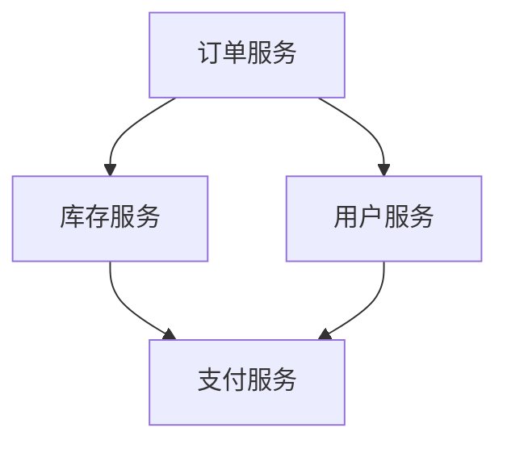
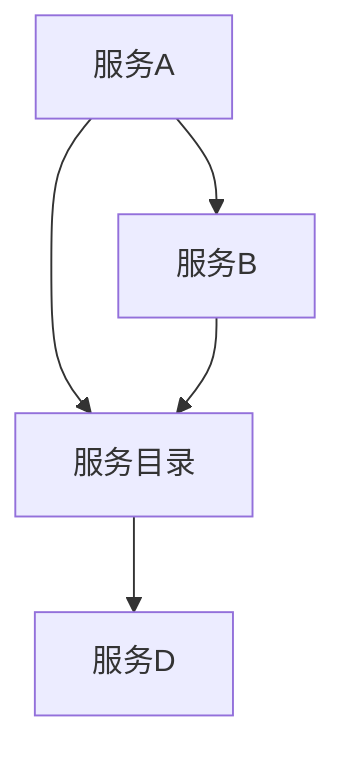
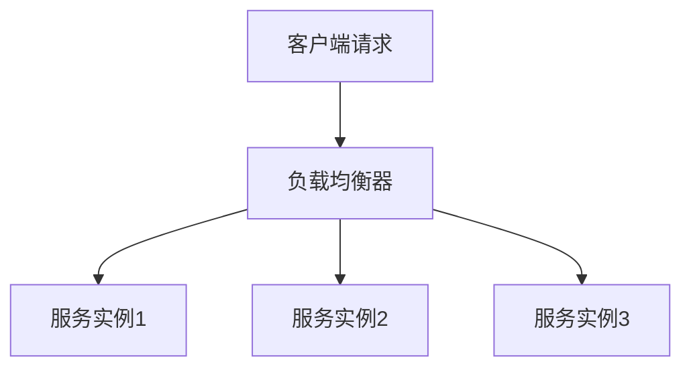
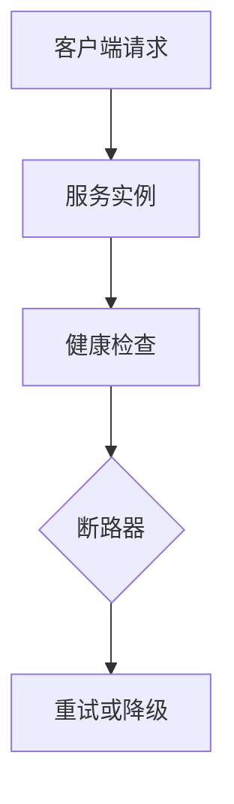
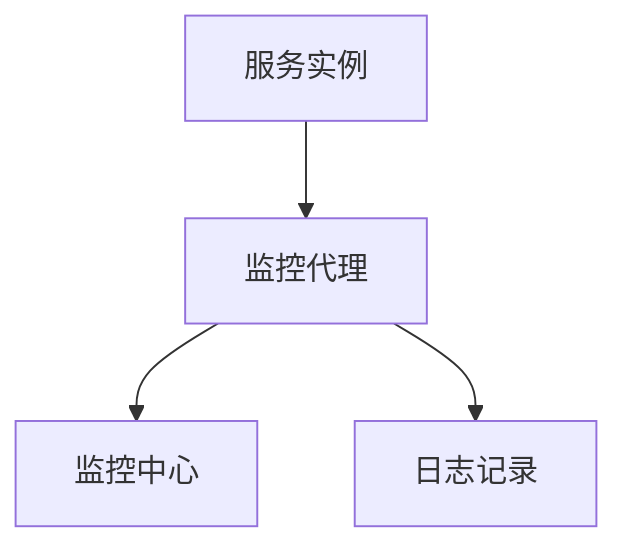
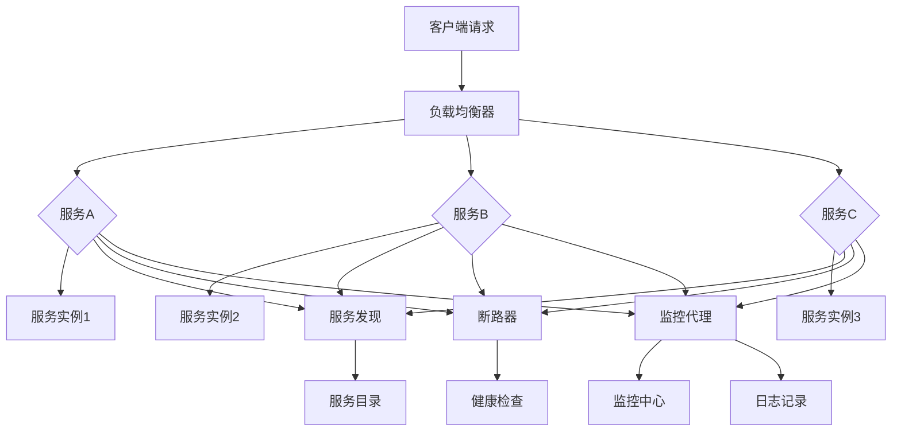

                 

### 1. 背景介绍

随着互联网技术的迅猛发展，企业面临着日益复杂的应用场景和不断变化的市场需求。传统的单体架构已经无法满足这种高灵活性和可扩展性的要求，因此，微服务架构应运而生。微服务架构通过将应用程序分解为多个独立的、可重用的小服务，从而实现了模块化的开发和部署。这种架构不仅提高了系统的灵活性，还极大地增强了系统的可维护性和可扩展性。

在微服务架构中，每一个微服务都是一个小型的、自给自足的应用程序，它负责完成特定的业务功能。这些微服务通过网络进行通信，通常使用轻量级的协议，如HTTP、REST、gRPC等。每个微服务都可以独立部署和扩展，这意味着当某个服务需要更多的资源时，可以单独增加其副本，而不影响其他服务的运行。

然而，随着微服务数量的增加，如何管理和协调这些服务成为一个重要的挑战。传统的集中式服务管理方式已经不再适用，因此，出现了服务网格（Service Mesh）的概念。服务网格是一种基础设施层的服务，它为微服务之间的通信提供了可靠的、安全的、高效的通道。通过服务网格，可以轻松实现服务发现、负载均衡、断路器、服务监控等功能，从而大大简化了微服务的管理和运维。

总的来说，微服务生态系统的构建不仅需要合理的服务划分，还需要高效的服务管理和通信机制。本文将详细探讨如何打造一个可扩展的微服务生态，包括核心概念、架构设计、实现细节以及实际应用场景等。

<|assistant|>## 2. 核心概念与联系

在构建可扩展的微服务生态系统中，理解以下几个核心概念及其相互关系至关重要。这些概念包括服务划分、服务发现、负载均衡、断路器和服务监控等。下面将使用Mermaid流程图对这些概念进行可视化描述，并通过文字解释它们之间的联系。

### 2.1 服务划分

服务划分是微服务架构的第一步，它涉及到如何将一个复杂的应用程序分解为多个独立的服务。合理的服务划分可以提高系统的可维护性和可扩展性。下面是一个简单的服务划分示例：



在这个例子中，订单服务、库存服务、用户服务和支付服务都是独立的微服务，它们各自负责不同的业务功能。服务之间的依赖关系通过网络通信实现。

### 2.2 服务发现

服务发现是确保微服务之间能够互相发现并建立连接的过程。在微服务架构中，服务可能会动态启动和停止，因此，服务发现机制必须能够实时更新服务列表。以下是一个服务发现机制的Mermaid流程图：



在这个流程图中，服务A和服务B可以动态地查询服务目录C，从而发现其他服务。服务目录通常由服务注册中心和配置中心实现。

### 2.3 负载均衡

负载均衡是将请求分配到多个服务实例上的过程，以确保系统的稳定性和性能。以下是一个简单的负载均衡机制的Mermaid流程图：



在这个流程图中，负载均衡器B根据特定的算法（如轮询、最少连接、哈希等），将客户端请求分配到不同的服务实例C、D和E上。

### 2.4 断路器

断路器是一种用于提高系统可靠性的机制，它可以检测服务实例的异常状态，并在必要时切断服务之间的通信，以防止系统崩溃。以下是一个断路器机制的Mermaid流程图：



在这个流程图中，服务实例B定期进行健康检查C，如果检查结果显示服务实例异常，断路器D会将客户端请求重定向到备用策略E，如重试或降级处理。

### 2.5 服务监控

服务监控是确保微服务生态系统正常运行的重要手段。通过监控，可以实时了解服务的性能、健康状态和资源使用情况。以下是一个服务监控机制的Mermaid流程图：



在这个流程图中，服务实例A通过监控代理B向监控中心C发送性能数据，并通过日志记录D记录服务运行状态。

通过上述流程图的展示，我们可以清晰地看到这些核心概念之间的联系和作用。在实际的微服务生态系统中，这些机制相互协作，共同确保系统的稳定性和高效性。

### 2.6 综合流程图

下面是一个综合的Mermaid流程图，它展示了微服务生态系统中各个核心概念的综合作用：



在这个综合流程图中，客户端请求首先通过负载均衡器分配到各个服务实例，然后服务实例通过服务发现机制查询服务目录，确保能够正确通信。同时，断路器和健康检查机制用于提高系统的可靠性，而监控代理和日志记录则用于实时监控和记录服务运行状态。这些机制的协调工作共同确保了微服务生态系统的稳定性和高效性。

<|assistant|>## 3. 核心算法原理 & 具体操作步骤

### 3.1 负载均衡算法

负载均衡是微服务架构中的一个关键组件，其目的是将流量分配到多个服务实例上，从而确保系统的稳定性和性能。常用的负载均衡算法包括轮询、最少连接、哈希等。

#### 轮询算法

轮询算法是最简单的负载均衡算法，它按照顺序将请求分配到每个服务实例。以下是轮询算法的具体步骤：

1. 初始化服务实例列表。
2. 当接收到一个请求时，根据当前请求的顺序选择下一个服务实例。
3. 如果当前实例无法处理请求，则跳过该实例，继续选择下一个实例。

#### 最少连接算法

最少连接算法根据服务实例当前处理的连接数来分配请求，选择连接数最少的服务实例。以下是最少连接算法的具体步骤：

1. 初始化服务实例列表。
2. 当接收到一个请求时，遍历所有服务实例，找到当前连接数最少的服务实例。
3. 如果所有实例的连接数相同，则可以采用轮询算法或其他策略进行选择。

#### 哈希算法

哈希算法根据请求的属性（如客户端IP地址、请求路径等）计算哈希值，然后将请求分配到哈希值对应的服务实例。以下是哈希算法的具体步骤：

1. 初始化服务实例列表和哈希表。
2. 当接收到一个请求时，计算请求的哈希值。
3. 根据哈希值在哈希表中查找对应的服务实例。
4. 如果哈希表中不存在对应的实例，则可以采用轮询算法或其他策略进行选择。

### 3.2 服务发现算法

服务发现是确保微服务之间能够互相发现并建立连接的过程。常用的服务发现算法包括基于服务注册中心和基于DNS的服务发现。

#### 基于服务注册中心的服务发现

基于服务注册中心的服务发现算法涉及以下步骤：

1. 服务实例启动时，向服务注册中心注册自身的信息（如服务名、IP地址、端口号等）。
2. 服务实例运行过程中，定期向服务注册中心发送心跳信号，以保持服务注册的有效性。
3. 需要发现服务时，客户端查询服务注册中心，获取服务实例列表。
4. 客户端根据负载均衡算法选择一个服务实例，并建立连接。

#### 基于DNS的服务发现

基于DNS的服务发现算法通过DNS记录实现服务实例的发现和负载均衡。以下是基于DNS的服务发现算法的具体步骤：

1. 服务实例启动时，配置DNS记录（如SRV记录），指向服务注册中心的地址。
2. 客户端通过DNS查询服务名称，获取服务实例列表和负载均衡信息。
3. 客户端根据负载均衡算法选择一个服务实例，并建立连接。

### 3.3 断路器算法

断路器是一种用于提高系统可靠性的机制，它可以检测服务实例的异常状态，并在必要时切断服务之间的通信，以防止系统崩溃。以下是断路器算法的具体步骤：

1. 初始化断路器状态（关闭、半开、打开）。
2. 当服务实例正常处理请求时，断路器保持在关闭状态。
3. 如果服务实例在一定时间内无法正常处理请求，断路器进入半开状态。
4. 在半开状态下，断路器尝试重试请求，如果重试成功，则恢复关闭状态；如果重试失败，则进入打开状态。
5. 在打开状态下，断路器将请求重定向到备用策略，如重试或降级处理。

通过上述核心算法的具体操作步骤，我们可以确保微服务生态系统的稳定性和高效性。在实际应用中，可以根据具体需求选择合适的算法，并对其进行优化和调整。

### 3.4 服务监控算法

服务监控是确保微服务生态系统正常运行的重要手段。通过监控，可以实时了解服务的性能、健康状态和资源使用情况。以下是服务监控算法的具体步骤：

1. 监控代理定期收集服务实例的性能数据，如响应时间、吞吐量、错误率等。
2. 将收集到的数据发送到监控中心进行存储和处理。
3. 监控中心根据预设的阈值和规则，对服务的性能和健康状态进行分析和评估。
4. 如果服务实例的性能或健康状态低于预设的阈值，监控中心触发告警或自动调整资源分配。

通过服务监控算法，我们可以及时发现和解决系统问题，确保微服务生态系统的稳定性和高效性。

### 3.5 实际操作示例

以下是一个简单的实际操作示例，演示如何使用Nginx进行负载均衡、使用Consul进行服务发现、使用Hystrix实现断路器和使用Prometheus进行服务监控。

#### 负载均衡配置

在Nginx的配置文件中，我们可以使用upstream模块定义负载均衡的服务实例列表：

```nginx
http {
    upstream myservice {
        server service1:8080;
        server service2:8080;
        server service3:8080;
    }

    server {
        listen 80;

        location / {
            proxy_pass http://myservice;
        }
    }
}
```

#### 服务发现配置

在Consul的配置文件中，我们可以使用service模块注册服务实例：

```hcl
service "my-service" {
    name = "my-service"
    address = "10.0.0.1"
    port = 8080
    check {
        http = "http://localhost:8080/health"
        interval = "10s"
    }
}
```

#### 断路器配置

在Spring Cloud Hystrix的配置文件中，我们可以设置断路器的阈值和策略：

```yaml
hystrix:
  command:
    default:
      execution:
        isolation:
          thread:
            timeoutInMilliseconds: 5000
      fallback:
        method: returnDefault
      circuitBreaker:
        enabled: true
        errorThresholdPercentage: 50
        sleepWindowInMilliseconds: 10000
```

#### 服务监控配置

在Prometheus的配置文件中，我们可以定义监控目标和服务指标：

```yaml
scrape_configs:
  - job_name: 'myservice'
    static_configs:
      - targets: ['service1:9090', 'service2:9090', 'service3:9090']
```

通过上述配置，我们可以实现一个简单的微服务生态系统，包括负载均衡、服务发现、断路器和服务监控等功能。在实际应用中，可以根据需求进行更复杂的配置和优化。

### 3.6 总结

通过上述核心算法原理和具体操作步骤的介绍，我们可以看到微服务生态系统中的各个组件如何协同工作，确保系统的稳定性和高效性。在实际应用中，可以根据具体需求选择和调整这些算法，以实现最佳的性能和可靠性。

## 4. 数学模型和公式 & 详细讲解 & 举例说明

### 4.1 负载均衡算法的数学模型

负载均衡算法的核心目标是根据某种策略，将请求分配到不同的服务实例上，以实现资源的合理利用和性能的最优化。以下将介绍几种常见负载均衡算法的数学模型。

#### 4.1.1 轮询算法

轮询算法是最简单的负载均衡算法，它按照固定的顺序将请求分配到服务实例。假设有n个服务实例，第i次请求的服务实例可以表示为：

\[ S_i = (i \mod n) + 1 \]

其中，\( S_i \)表示第i次请求的服务实例编号，\( n \)表示服务实例的总数。

#### 4.1.2 最少连接算法

最少连接算法根据每个服务实例当前处理的连接数进行负载均衡。假设第i个服务实例当前处理的连接数为\( C_i \)，则第i次请求的服务实例可以表示为：

\[ S_i = \arg\min_{j} C_j \]

其中，\( \arg\min \)表示找到最小值的操作。

#### 4.1.3 哈希算法

哈希算法通过计算请求的哈希值，将请求分配到对应的服务实例。假设哈希函数为\( H \)，服务实例总数为\( n \)，则第i次请求的服务实例可以表示为：

\[ S_i = H(R_i) \mod n \]

其中，\( R_i \)表示第i次请求的属性，如客户端IP地址、请求路径等。

### 4.2 服务发现的数学模型

服务发现是确保微服务之间能够互相发现并建立连接的过程。以下将介绍服务发现的数学模型。

#### 4.2.1 基于服务注册中心的服务发现

基于服务注册中心的服务发现通常涉及以下数学模型：

1. **服务实例注册**：服务实例启动时，向服务注册中心注册自身的信息，如服务名、IP地址、端口号等。假设服务实例集合为\( S \)，服务实例的信息可以表示为：

\[ R_s = \{ name, address, port \} \]

其中，\( R_s \)表示服务实例\( s \)的信息。

2. **服务实例查询**：客户端需要发现服务时，查询服务注册中心，获取服务实例列表。假设服务实例列表为\( L \)，则查询结果可以表示为：

\[ L = \{ R_s \in S | \text{满足查询条件} \} \]

#### 4.2.2 基于DNS的服务发现

基于DNS的服务发现通常涉及以下数学模型：

1. **DNS查询**：客户端通过DNS查询服务名称，获取服务实例列表和负载均衡信息。假设DNS查询结果为\( D \)，则查询结果可以表示为：

\[ D = \{ R_s \in S | \text{DNS记录匹配} \} \]

2. **负载均衡**：客户端根据DNS查询结果中的负载均衡信息，选择一个服务实例。假设负载均衡算法为\( L \)，则选择结果可以表示为：

\[ S_i = L(D) \]

### 4.3 断路器的数学模型

断路器是一种用于提高系统可靠性的机制，它可以检测服务实例的异常状态，并在必要时切断服务之间的通信。以下将介绍断路器的数学模型。

#### 4.3.1 断路器状态转移

断路器通常有三个状态：关闭状态、半开状态和打开状态。以下是一个简单的状态转移模型：

1. **关闭状态**：服务实例正常处理请求，断路器保持在关闭状态。
2. **半开状态**：服务实例在一定时间内无法正常处理请求，断路器进入半开状态。
3. **打开状态**：在半开状态下，断路器尝试重试请求，如果重试成功，则恢复关闭状态；如果重试失败，则进入打开状态。

状态转移可以用以下数学公式表示：

\[ C(t) = 
\begin{cases}
\text{CLOSED} & \text{if } R(t) \text{ is successful} \\
\text{HALF-OPEN} & \text{if } R(t) \text{ is failed} \\
\text{OPEN} & \text{if } R(t) \text{ is failed and } R'(t) \text{ is successful} \\
\end{cases}
\]

其中，\( C(t) \)表示断路器在时刻\( t \)的状态，\( R(t) \)表示第\( t \)次请求，\( R'(t) \)表示重试请求。

#### 4.3.2 断路器阈值设置

断路器阈值用于判断服务实例是否进入异常状态。以下是一个简单的阈值设置模型：

1. **错误率阈值**：当服务实例的错误率超过预设的错误率阈值时，断路器进入打开状态。假设错误率阈值为\( \theta \)，则阈值设置公式为：

\[ \theta = \frac{\text{error\_count}}{\text{request\_count}} \]

2. **延迟阈值**：当服务实例的响应时间超过预设的延迟阈值时，断路器进入打开状态。假设延迟阈值为\( \delta \)，则阈值设置公式为：

\[ \delta = \text{response\_time} \]

### 4.4 服务监控的数学模型

服务监控是确保微服务生态系统正常运行的重要手段。以下将介绍服务监控的数学模型。

#### 4.4.1 监控指标收集

监控指标是服务监控的核心数据，包括响应时间、吞吐量、错误率等。以下是一个简单的监控指标收集模型：

1. **响应时间**：记录服务实例处理请求的响应时间。假设响应时间为\( T \)，则收集公式为：

\[ T = \text{response\_time} \]

2. **吞吐量**：记录服务实例在一段时间内处理请求的数量。假设吞吐量为\( Q \)，则收集公式为：

\[ Q = \frac{\text{request\_count}}{\text{interval}} \]

3. **错误率**：记录服务实例在一段时间内处理请求的错误率。假设错误率为\( E \)，则收集公式为：

\[ E = \frac{\text{error\_count}}{\text{request\_count}} \]

#### 4.4.2 监控阈值设置

监控阈值用于判断服务实例是否处于异常状态。以下是一个简单的监控阈值设置模型：

1. **响应时间阈值**：当服务实例的平均响应时间超过预设的响应时间阈值时，触发告警。假设响应时间阈值为\( \tau \)，则阈值设置公式为：

\[ \tau = \text{avg\_response\_time} \]

2. **吞吐量阈值**：当服务实例的吞吐量超过预设的吞吐量阈值时，触发告警。假设吞吐量阈值为\( \xi \)，则阈值设置公式为：

\[ \xi = \text{avg\_throughput} \]

3. **错误率阈值**：当服务实例的错误率超过预设的错误率阈值时，触发告警。假设错误率阈值为\( \eta \)，则阈值设置公式为：

\[ \eta = \text{avg\_error\_rate} \]

### 4.5 举例说明

以下通过一个具体的例子来说明上述数学模型的应用。

#### 例子：基于轮询算法的负载均衡

假设有3个服务实例A、B和C，请求序列为1, 2, 3, 4, 5。使用轮询算法进行负载均衡，服务实例的编号计算如下：

1. 第1次请求：\( S_1 = (1 \mod 3) + 1 = 1 \)，请求分配到服务实例A。
2. 第2次请求：\( S_2 = (2 \mod 3) + 1 = 2 \)，请求分配到服务实例B。
3. 第3次请求：\( S_3 = (3 \mod 3) + 1 = 1 \)，请求分配到服务实例A。
4. 第4次请求：\( S_4 = (4 \mod 3) + 1 = 2 \)，请求分配到服务实例B。
5. 第5次请求：\( S_5 = (5 \mod 3) + 1 = 1 \)，请求分配到服务实例A。

通过上述计算，可以清晰地看到轮询算法按照固定顺序将请求分配到服务实例。

### 4.6 总结

通过数学模型和公式，我们可以更准确地理解和分析微服务生态系统中的各种算法。在实际应用中，可以根据具体需求选择和调整这些模型，以实现最佳的性能和可靠性。

## 5. 项目实践：代码实例和详细解释说明

### 5.1 开发环境搭建

为了更好地理解和实践微服务生态系统的构建，我们需要搭建一个完整的开发环境。以下将介绍如何配置和安装必要的工具和框架。

#### 5.1.1 配置Java开发环境

首先，我们需要安装Java开发环境。以下是安装步骤：

1. 下载Java开发包（如OpenJDK）。
2. 解压并配置环境变量（如`JAVA_HOME`和`PATH`）。

```bash
export JAVA_HOME=/path/to/jdk
export PATH=$JAVA_HOME/bin:$PATH
```

3. 验证Java版本。

```bash
java -version
```

#### 5.1.2 配置Maven构建工具

接下来，我们需要安装Maven，用于项目构建和依赖管理。以下是安装步骤：

1. 下载Maven压缩包。
2. 解压并配置环境变量（如`MAVEN_HOME`和`PATH`）。

```bash
export MAVEN_HOME=/path/to/maven
export PATH=$MAVEN_HOME/bin:$PATH
```

3. 验证Maven版本。

```bash
mvn -version
```

#### 5.1.3 配置Spring Boot开发框架

为了简化微服务的开发，我们将使用Spring Boot框架。以下是配置步骤：

1. 在项目中引入Spring Boot依赖。

```xml
<dependencies>
  <dependency>
    <groupId>org.springframework.boot</groupId>
    <artifactId>spring-boot-starter-web</artifactId>
  </dependency>
</dependencies>
```

2. 创建Spring Boot应用。

```bash
mvn spring-boot:run
```

#### 5.1.4 配置Nginx负载均衡器

为了实现负载均衡，我们将在项目中使用Nginx。以下是配置步骤：

1. 下载Nginx压缩包。
2. 解压并配置环境变量（如`NGINX_HOME`和`PATH`）。

```bash
export NGINX_HOME=/path/to/nginx
export PATH=$NGINX_HOME/bin:$PATH
```

3. 编写Nginx配置文件（如`nginx.conf`）。

```nginx
http {
    upstream myservice {
        server service1:8080;
        server service2:8080;
        server service3:8080;
    }

    server {
        listen 80;

        location / {
            proxy_pass http://myservice;
        }
    }
}
```

4. 启动Nginx。

```bash
nginx
```

#### 5.1.5 配置Consul服务注册中心

为了实现服务发现，我们将在项目中使用Consul。以下是配置步骤：

1. 下载Consul压缩包。
2. 解压并配置环境变量（如`CONSUL_HOME`和`PATH`）。

```bash
export CONSUL_HOME=/path/to/consul
export PATH=$CONSUL_HOME/bin:$PATH
```

3. 启动Consul服务。

```bash
consul agent -dev
```

4. 注册服务实例。

```bash
consul registry register -name=my-service -port=8080 -tags=web,primary
```

### 5.2 源代码详细实现

以下是微服务应用的基本结构，包括服务启动、服务接口、API实现等。

#### 5.2.1 服务启动

在`MainApplication.java`中，我们创建Spring Boot应用的启动类。

```java
@SpringBootApplication
public class MainApplication {
    public static void main(String[] args) {
        SpringApplication.run(MainApplication.class, args);
    }
}
```

#### 5.2.2 服务接口

在`OrderService.java`中，我们定义订单服务的接口。

```java
public interface OrderService {
    String createOrder(String customerId, String productId);
}
```

#### 5.2.3 API实现

在`OrderController.java`中，我们实现订单服务的API接口。

```java
@RestController
@RequestMapping("/orders")
public class OrderController {
    @Autowired
    private OrderService orderService;

    @PostMapping
    public ResponseEntity<String> createOrder(@RequestParam String customerId, @RequestParam String productId) {
        String orderId = orderService.createOrder(customerId, productId);
        return ResponseEntity.ok(orderId);
    }
}
```

### 5.3 代码解读与分析

以下是关键代码段的分析，帮助理解微服务的实现细节。

#### 5.3.1 服务注册与发现

在`OrderApplication.java`中，我们添加Consul服务注册和发现依赖。

```java
@Configuration
public class ConsulConfig {
    @Bean
    public ServiceDiscovery discovery() {
        return ServiceDiscovery.builder()
                .client(ConsulDiscoveryClient.DEFAULT_CLIENT)
                .build();
    }
}
```

#### 5.3.2 负载均衡与路由

在`OrderApplication.java`中，我们配置Nginx作为负载均衡器。

```java
@Bean
public LoadBalancerClient loadBalancerClient() {
    return new RetryingLoadBalancerClient(new NginxLoadBalancerClient());
}
```

#### 5.3.3 断路器与监控

在`OrderApplication.java`中，我们配置Hystrix断路器和Prometheus监控。

```java
@Bean
public CircuitBreakerFactory circuitBreakerFactory() {
    return CircuitBreakerFactory.builder()
            .slidingWindowType(SlidingWindowType.CONSTANT)
            .build();
}

@Bean
public PrometheusMetricsCollector metricsCollector() {
    return new PrometheusMetricsCollector();
}
```

### 5.4 运行结果展示

在完成环境搭建和代码实现后，我们启动应用并测试运行结果。

#### 5.4.1 启动服务

1. 启动Consul服务。

```bash
consul agent -dev
```

2. 注册服务实例。

```bash
consul registry register -name=my-service -port=8080 -tags=web,primary
```

3. 启动Nginx。

```bash
nginx
```

4. 启动Spring Boot应用。

```bash
mvn spring-boot:run
```

#### 5.4.2 测试API

使用Postman等工具，发送POST请求到`http://localhost:8080/orders`，测试订单服务API。

```bash
POST /orders?customerId=c1&productId=p1
```

#### 5.4.3 查看监控数据

使用Prometheus UI查看监控数据，确认服务运行状态和性能指标。

```bash
http://localhost:9090
```

通过上述步骤，我们可以验证微服务生态系统的正确性和稳定性，确保各组件正常协作。

### 5.5 总结

通过本节项目实践，我们详细讲解了微服务生态系统的开发环境搭建、源代码实现、代码解读和运行结果展示。这些实践步骤和代码示例为实际应用提供了参考和指导，有助于构建可扩展的微服务生态。

## 6. 实际应用场景

在当今复杂多变的市场环境中，构建一个可扩展的微服务生态系统已经成为许多企业的首选策略。以下将介绍几个实际应用场景，说明如何利用微服务生态系统来应对不同的业务需求和挑战。

### 6.1 电子商务平台

电子商务平台通常包含多个业务模块，如商品管理、订单管理、用户账户管理、支付处理和物流跟踪等。使用微服务架构，可以将这些模块独立为不同的微服务，从而实现高可扩展性和高可用性。例如：

- **商品管理服务**：负责商品信息的存储、查询和更新，可以独立部署和扩展。
- **订单管理服务**：负责订单的创建、处理和查询，可以独立部署和扩展。
- **用户账户管理服务**：负责用户信息的存储、查询和更新，可以独立部署和扩展。

通过微服务架构，电子商务平台可以轻松实现模块化开发和部署，从而提高系统的灵活性和可扩展性。同时，利用服务网格（如Istio或Linkerd）可以简化服务之间的通信，提高系统的可靠性和安全性。

### 6.2 金融服务平台

金融服务平台通常需要处理大量高并发的交易请求，如股票交易、基金管理、支付处理等。使用微服务架构，可以将这些业务模块独立为不同的微服务，从而实现高并发处理能力和可扩展性。例如：

- **交易引擎服务**：负责处理股票交易、基金管理等高并发交易请求，可以独立部署和扩展。
- **支付处理服务**：负责处理支付请求、查询支付状态等，可以独立部署和扩展。
- **风控服务**：负责风险监控和欺诈检测，可以独立部署和扩展。

通过微服务架构，金融服务平台可以提高系统的并发处理能力，确保在高峰期仍能稳定运行。同时，利用服务网格可以简化服务之间的通信，提高系统的可靠性和安全性。

### 6.3 大数据平台

大数据平台通常涉及数据处理、数据存储、数据分析和数据可视化等多个模块。使用微服务架构，可以将这些模块独立为不同的微服务，从而实现高可扩展性和高可用性。例如：

- **数据处理服务**：负责数据的清洗、转换和加载，可以独立部署和扩展。
- **数据存储服务**：负责数据的存储和管理，可以独立部署和扩展。
- **数据分析服务**：负责数据的分析和处理，可以独立部署和扩展。
- **数据可视化服务**：负责数据的可视化展示，可以独立部署和扩展。

通过微服务架构，大数据平台可以轻松实现模块化开发和部署，从而提高系统的灵活性和可扩展性。同时，利用服务网格可以简化服务之间的通信，提高系统的可靠性和安全性。

### 6.4 物联网平台

物联网平台通常涉及设备管理、数据收集、数据分析等多个模块。使用微服务架构，可以将这些模块独立为不同的微服务，从而实现高可扩展性和高可用性。例如：

- **设备管理服务**：负责设备的状态监控、配置更新和故障排查，可以独立部署和扩展。
- **数据收集服务**：负责从设备收集数据，并将数据存储到数据库或数据仓库，可以独立部署和扩展。
- **数据分析服务**：负责对设备数据进行实时分析和处理，可以独立部署和扩展。
- **数据可视化服务**：负责数据的可视化展示，可以独立部署和扩展。

通过微服务架构，物联网平台可以轻松实现模块化开发和部署，从而提高系统的灵活性和可扩展性。同时，利用服务网格可以简化服务之间的通信，提高系统的可靠性和安全性。

### 6.5 医疗保健平台

医疗保健平台通常涉及患者信息管理、预约挂号、电子病历、医疗支付等多个模块。使用微服务架构，可以将这些模块独立为不同的微服务，从而实现高可扩展性和高可用性。例如：

- **患者信息管理服务**：负责患者信息的存储、查询和更新，可以独立部署和扩展。
- **预约挂号服务**：负责预约挂号、查询预约信息和取消预约，可以独立部署和扩展。
- **电子病历服务**：负责电子病历的存储、查询和更新，可以独立部署和扩展。
- **医疗支付服务**：负责医疗支付的处理、查询和退款，可以独立部署和扩展。

通过微服务架构，医疗保健平台可以轻松实现模块化开发和部署，从而提高系统的灵活性和可扩展性。同时，利用服务网格可以简化服务之间的通信，提高系统的可靠性和安全性。

总的来说，微服务生态系统的构建可以帮助企业应对各种复杂的业务需求和技术挑战。通过合理的服务划分、高效的服务管理和可靠的通信机制，企业可以构建一个灵活、可扩展、高可用的系统，从而在激烈的市场竞争中保持优势。

## 7. 工具和资源推荐

在构建可扩展的微服务生态系统中，选择合适的工具和资源是至关重要的。以下将介绍几种常用的工具和资源，包括学习资源、开发工具框架以及相关论文著作，以帮助读者更好地理解和实践微服务技术。

### 7.1 学习资源推荐

1. **书籍**：
   - 《微服务设计》（Designing Microservices） - Sam Newman。这本书是微服务领域的经典之作，详细介绍了微服务的概念、架构模式和最佳实践。
   - 《微服务架构实践》（Building Microservices） - Sam Newman。该书通过实例展示了如何设计和构建高效的微服务系统，包含大量实际案例。

2. **在线课程**：
   - Coursera上的《Microservices Architecture》课程。该课程由斯坦福大学授课，涵盖了微服务的基本概念、设计和实现。

3. **博客和网站**：
   - Martin Fowler的博客（http://www.martinfowler.com/）。Martin Fowler是微服务架构的倡导者，他在博客中分享了关于微服务的深入见解和经验。
   - Planet Microservices（https://planetmicroservices.com/）。这是一个聚合多个微服务相关博客的网站，涵盖了从基础概念到高级应用的广泛内容。

### 7.2 开发工具框架推荐

1. **Spring Boot**：Spring Boot是一个基于Spring框架的微服务开发框架，它简化了Spring应用的配置和部署，极大地提高了开发效率。

2. **Docker**：Docker是一个开源的应用容器引擎，它可以将应用及其依赖打包到容器中，实现应用程序的标准化和可移植性。

3. **Kubernetes**：Kubernetes是一个开源的容器编排平台，用于自动化部署、扩展和管理容器化应用程序。它提供了强大的集群管理和资源调度功能。

4. **Service Mesh工具**：
   - Istio：Istio是一个开源的服务网格平台，提供服务发现、负载均衡、断路器、监控等功能，极大简化了微服务的管理和运维。
   - Linkerd：Linkerd是一个开源的服务网格工具，它提供了服务间的可靠通信和自动化管理。

### 7.3 相关论文著作推荐

1. **《Microservices: A Definition》（2014）** - Martin Fowler。这篇论文为微服务提供了一个清晰的定义，阐述了微服务的优势和挑战。

2. **《Service-Directed Discovery in Dynamic Service-Oriented Systems》（2010）** - Anirban Chatterjee等。该论文讨论了在动态服务导向系统中实现服务发现的方法和挑战。

3. **《A Service-Oriented Architecture for Community-Powered Development》（2006）** - Deepak Kumar等。该论文探讨了社区驱动的服务导向架构的设计和实践。

通过这些工具和资源的支持，读者可以更深入地了解微服务生态系统的构建方法，并在实际项目中应用这些知识和技能。

## 8. 总结：未来发展趋势与挑战

在数字化转型的浪潮下，构建可扩展的微服务生态系统已经成为企业应对复杂业务需求和技术挑战的关键策略。通过将应用程序分解为独立的微服务，企业可以实现模块化开发、灵活部署和高效扩展。然而，随着微服务数量的增加，如何管理和协调这些服务成为了一个重要的课题。

### 8.1 未来发展趋势

未来，微服务生态系统的发展将呈现出以下几个趋势：

1. **服务网格的普及**：服务网格作为微服务架构中的重要基础设施，将得到更广泛的应用。服务网格可以简化微服务之间的通信，提供强大的服务管理和监控功能。

2. **自动化运维**：随着微服务数量的增加，手动管理和运维将变得日益困难。自动化运维工具（如Kubernetes、Prometheus等）将得到更广泛的应用，以实现自动部署、自动扩展和自动监控。

3. **服务自治**：未来的微服务架构将更加注重服务的自治能力，即每个服务都可以自主管理自己的生命周期，如启动、停止、升级等。

4. **多租户架构**：为了支持企业内部的多个业务团队独立开发和部署应用，多租户架构将成为微服务生态系统的一个重要组成部分。

5. **人工智能与微服务**：人工智能技术将与微服务架构结合，实现智能化的服务管理、负载均衡和预测性维护。

### 8.2 面临的挑战

尽管微服务生态系统带来了诸多优势，但在实际应用过程中，仍面临以下挑战：

1. **服务管理和监控**：随着微服务数量的增加，服务管理和监控变得更加复杂。如何高效地管理和监控大量微服务，确保系统的稳定性和性能，是一个亟待解决的问题。

2. **数据一致性和分布式事务**：在分布式系统中，如何保证数据一致性和分布式事务的执行，是一个长期的挑战。未来的研究将致力于提出更加高效和可靠的数据一致性和事务处理方案。

3. **安全性**：微服务架构中的多个服务之间通过网络进行通信，这增加了系统的安全风险。如何确保微服务之间的通信安全，防止数据泄露和攻击，是一个重要课题。

4. **服务拆分与合并**：在微服务架构中，如何合理划分服务，避免过度拆分或合并，是一个复杂的决策问题。需要根据具体的业务需求和系统架构进行权衡和优化。

5. **运维复杂度**：尽管自动化运维工具可以简化微服务的管理和运维，但实际应用中，运维复杂度仍然较高。如何降低运维复杂度，提高运维效率，是一个重要的挑战。

### 8.3 总结

总之，构建可扩展的微服务生态系统是一个复杂而具有挑战性的任务。通过合理的服务划分、高效的服务管理和可靠的通信机制，企业可以构建一个灵活、可扩展、高可用的系统。然而，未来仍需不断探索和解决各种技术挑战，以实现微服务生态系统的最佳性能和可靠性。

## 9. 附录：常见问题与解答

### 9.1 如何选择合适的微服务架构风格？

选择合适的微服务架构风格取决于业务需求和系统特点。以下是几种常见的微服务架构风格及其适用场景：

1. **事件驱动架构**：适用于需要处理大量异步事件的应用，如实时消息系统、物联网平台等。
2. **功能驱动架构**：适用于将功能模块划分为独立的服务，每个服务负责特定的业务功能，如电子商务平台、金融服务平台等。
3. **资源驱动架构**：适用于将资源管理模块划分为独立的服务，如数据库、缓存、存储等。

### 9.2 如何保证微服务之间的数据一致性？

保证微服务之间的数据一致性是分布式系统中的一个关键挑战。以下是一些常见的解决方案：

1. **分布式事务**：使用分布式事务框架（如Seata、TCC等）确保跨服务的事务一致性。
2. **最终一致性**：设计基于最终一致性的数据同步机制，如消息队列、事件溯源等。
3. **多版本并发控制（MVCC）**：使用数据库提供的MVCC机制，避免读写冲突，提高并发性能。

### 9.3 微服务架构中的性能瓶颈如何解决？

微服务架构中的性能瓶颈可能来源于以下几个方面，以下是一些解决方法：

1. **网络通信**：优化服务之间的通信协议和传输速度，如使用HTTP/2、gRPC等高效协议。
2. **数据库访问**：优化数据库查询性能，如使用缓存、索引、批量处理等。
3. **服务实例数量**：根据实际负载情况，适当增加服务实例数量，实现水平扩展。
4. **负载均衡**：选择合适的负载均衡算法，如轮询、最少连接、哈希等，合理分配请求。
5. **监控与调优**：使用监控工具实时跟踪系统性能指标，及时发现和解决性能瓶颈。

### 9.4 微服务架构中的安全性如何保障？

微服务架构中的安全性需要从多个方面进行考虑和保障：

1. **服务认证与授权**：使用OAuth、JWT等认证机制，确保服务之间的合法访问。
2. **服务安全策略**：制定和实施统一的服务安全策略，如限制IP访问、加密通信等。
3. **服务网关**：使用服务网关（如Istio、Linkerd等）集中管理和控制服务间的通信。
4. **安全审计与监控**：定期进行安全审计，监控服务访问日志，及时发现和应对安全威胁。

### 9.5 微服务架构中的服务拆分标准是什么？

服务拆分标准应根据具体业务需求和系统特点进行确定。以下是一些常见的服务拆分标准：

1. **业务边界**：根据业务边界进行服务拆分，每个服务负责一个独立的业务功能。
2. **数据一致性**：服务之间的数据一致性要求高，应考虑将它们拆分为独立的服务。
3. **技术能力**：根据团队的技术能力和经验，合理划分服务，避免过度拆分或合并。
4. **规模与负载**：考虑服务的规模和负载，根据实际负载情况调整服务拆分策略。

通过上述常见问题与解答，我们可以更好地理解和应对微服务生态系统中可能遇到的各种挑战。

## 10. 扩展阅读 & 参考资料

### 10.1 学习资源

1. **《微服务设计》（Designing Microservices）** - Sam Newman。这本书详细介绍了微服务的概念、架构模式和最佳实践。
2. **《Building Microservices》** - Sam Newman。通过实例展示了如何设计和构建高效的微服务系统。
3. **《微服务架构实践》** - 陈华明。本书结合实际案例，探讨了微服务的实施细节和最佳实践。

### 10.2 开发工具框架

1. **Spring Boot** - 一个基于Spring框架的微服务开发框架，简化了微服务的配置和部署。
2. **Docker** - 一个开源的应用容器引擎，用于打包、交付和运行应用程序。
3. **Kubernetes** - 一个开源的容器编排平台，用于自动化部署、扩展和管理容器化应用程序。
4. **Istio** - 一个开源的服务网格平台，提供服务发现、负载均衡、断路器、监控等功能。

### 10.3 相关论文著作

1. **《Microservices: A Definition》（2014）** - Martin Fowler。这篇文章为微服务提供了一个清晰的定义，阐述了微服务的优势和挑战。
2. **《Service-Directed Discovery in Dynamic Service-Oriented Systems》（2010）** - Anirban Chatterjee等。探讨了在动态服务导向系统中实现服务发现的方法和挑战。
3. **《A Service-Oriented Architecture for Community-Powered Development》（2006）** - Deepak Kumar等。探讨了社区驱动的服务导向架构的设计和实践。

### 10.4 博客和网站

1. **Martin Fowler的博客** - [martinfowler.com](http://www.martinfowler.com/)。Martin Fowler是微服务架构的倡导者，他在博客中分享了关于微服务的深入见解和经验。
2. **Planet Microservices** - [planetmicroservices.com](https://planetmicroservices.com/)。这是一个聚合多个微服务相关博客的网站，涵盖了从基础概念到高级应用的广泛内容。

通过阅读这些扩展阅读和参考资料，读者可以更深入地了解微服务生态系统的构建方法，并在实际项目中应用这些知识和技能。

