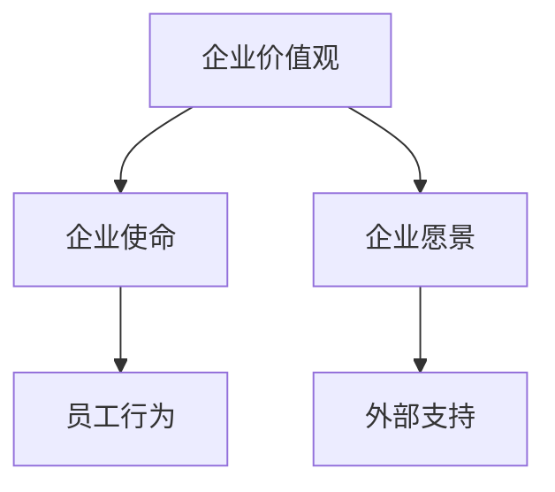

                 

### 背景介绍

在当今快速变化的商业环境中，公司使命和愿景已经成为企业核心竞争力的重要组成部分。它们不仅是企业文化的基石，更是指导企业决策和战略布局的关键因素。然而，如何打造具有感染力的公司使命和愿景，这是一个摆在许多企业领导者面前的重要问题。

公司使命通常描述了一个企业在存在期间所追求的核心价值和目标，它反映了企业的价值观、宗旨和存在的意义。而公司愿景则是对企业未来发展状态的预期和描绘，它为企业的长期发展提供了方向和动力。

为什么公司使命和愿景如此重要？首先，它们能够为企业员工提供共同的价值观和行为准则，增强团队的凝聚力和归属感。其次，使命和愿景为企业发展提供了明确的战略方向，有助于企业避免迷失在复杂的商业环境中。最后，具有感染力的公司使命和愿景能够吸引和留住优秀的员工，同时也能赢得客户和投资者的信任和支持。

随着全球化和数字化时代的到来，市场竞争日益激烈，企业需要更加注重自身的内在价值和独特性。因此，如何通过公司使命和愿景来传递企业的核心价值观，构建强大的品牌形象，成为企业领导者亟待解决的重要课题。

本文将围绕如何打造有感染力的公司使命和愿景展开，通过分析核心概念、提供具体操作步骤、实例讲解和实际应用场景，旨在为企业领导者提供一套系统的、实用的方法。

### 核心概念与联系

要打造有感染力的公司使命和愿景，我们需要首先理解一些核心概念和它们之间的联系。以下是本文将要探讨的几个关键概念：

#### 企业价值观 (Corporate Values)

企业价值观是企业文化的基石，它们指导着企业的行为和决策，影响着员工的行为和工作方式。企业价值观通常包括诚信、创新、客户至上、团队合作等。例如，谷歌的企业价值观包括“不作恶”、“以用户为中心”和“快速创新”。

#### 企业使命 (Corporate Mission)

企业使命描述了企业存在的目的和其追求的目标。它通常是具体的、可衡量的，并且能够激发员工的热情。例如，苹果公司的使命是“让我们的世界更加美好”。

#### 企业愿景 (Corporate Vision)

企业愿景是对企业未来状态的预期和描绘，它为企业的发展提供了方向和动力。愿景通常是宏观的、激励人心的，它能够吸引外部资源和支持。例如，微软的愿景是“让每个家庭、每个个人都拥有一台电脑”。

#### 核心概念之间的联系

企业价值观是企业使命和愿景的基础。使命和愿景则是在价值观指导下，企业对未来的规划和追求。一个具有感染力的使命和愿景应该能够清晰地反映企业的价值观，并激发员工的热情和动力。

为了更好地理解这些概念，我们可以使用Mermaid流程图来展示它们之间的联系。以下是一个简单的Mermaid流程图示例：



在这个流程图中，企业价值观被看作是整个企业的核心，它直接影响着企业使命和愿景的制定。企业使命和愿景则分别对员工行为和外部支持产生作用。

### 核心算法原理 & 具体操作步骤

在了解了核心概念之后，我们需要探讨如何具体操作，以打造有感染力的公司使命和愿景。以下是几个关键步骤：

#### 步骤 1：明确企业价值观

首先，企业需要明确自身的核心价值观。这一步骤可以通过以下方法完成：

1. **内部调研**：通过问卷调查、员工访谈和小组讨论等方式，收集员工对企业价值观的看法和建议。
2. **外部调研**：分析市场趋势、竞争对手和客户需求，了解外部环境对企业价值观的影响。
3. **共识形成**：将收集到的信息汇总，并组织一次内部会议，让所有员工参与讨论，形成共同认可的价值观。

#### 步骤 2：制定企业使命

在明确企业价值观后，企业可以开始制定使命。以下是几个关键点：

1. **简洁明了**：使命应该简洁明了，易于理解和记忆。例如，“让我们的世界更加美好”。
2. **具体明确**：使命应该具体明确，能够激发员工的热情。例如，“提供优质的互联网服务，让亿万用户畅享在线生活”。
3. **具有挑战性**：使命应该具有一定的挑战性，激励员工不断进步。例如，“成为全球领先的互联网公司”。

#### 步骤 3：制定企业愿景

企业愿景是对未来的预期和描绘，它应该：

1. **宏观而具体**：愿景应该宏观，能够激励人心，同时也要具体，能够为员工提供方向。例如，“到2030年，成为全球最值得信赖的互联网企业”。
2. **具有时间感**：愿景应该包含时间感，明确企业期望在何时实现。例如，“在五年内，实现全球市场份额的20%”。
3. **激励人心**：愿景应该能够激发员工的热情，让他们愿意为之努力。例如，“让我们的产品改变世界”。

#### 步骤 4：使命和愿景的沟通与推广

在制定出公司使命和愿景后，企业需要通过多种渠道进行沟通和推广：

1. **内部宣传**：通过公司内部会议、邮件、海报等方式，向员工传达使命和愿景。
2. **外部宣传**：在公司网站、社交媒体和广告等渠道上，展示公司的使命和愿景。
3. **员工参与**：鼓励员工参与使命和愿景的制定过程，增加他们的认同感和参与度。

通过以上步骤，企业可以逐步打造出具有感染力的公司使命和愿景，为企业的长期发展奠定坚实的基础。

### 数学模型和公式 & 详细讲解 & 举例说明

在制定具有感染力的公司使命和愿景时，我们可以运用一些数学模型和公式来帮助分析和评估。以下是一些常用的数学模型和公式，以及它们的详细解释和实际应用示例。

#### 1. SWOT分析

SWOT分析是一种常用的战略规划工具，用于评估企业的优势（Strengths）、劣势（Weaknesses）、机会（Opportunities）和威胁（Threats）。通过SWOT分析，企业可以明确自身的核心竞争力，找到发展机遇，并制定相应的战略规划。

**数学模型：**
SWOT分析通常通过矩阵形式展示，具体如下：

$$
\begin{matrix}
\text{优势} & \text{劣势} & \text{机会} & \text{威胁} \\
\hline
\text{S} & \text{W} & \text{O} & \text{T} \\
\end{matrix}
$$

**详细讲解：**
- **优势（Strengths）**：分析企业的核心竞争力，如技术优势、市场地位、管理团队等。
- **劣势（Weaknesses）**：识别企业的弱点，如资金短缺、人才不足、市场份额小等。
- **机会（Opportunities）**：分析外部环境中可能带来的发展机遇，如市场需求增长、政策支持等。
- **威胁（Threats）**：识别可能对企业造成威胁的因素，如竞争对手、技术变革等。

**举例说明：**
假设一家科技公司正在制定其使命和愿景，通过SWOT分析，该公司发现：

- **优势**：领先的技术研发能力、强大的研发团队、丰富的产品线。
- **劣势**：市场推广不足、资金链紧张。
- **机会**：新兴市场的快速增长、客户需求多样化。
- **威胁**：竞争对手的技术创新、市场饱和。

基于SWOT分析的结果，公司可以调整其使命和愿景，以更好地利用优势、克服劣势、抓住机会、应对威胁。

#### 2. BCG矩阵

BCG矩阵（波士顿矩阵）是一种用于分析企业产品组合和战略规划的工具。它通过市场份额和市场份额增长率两个维度，将产品分为四个象限，从而帮助企业确定产品的优先级和资源分配策略。

**数学模型：**
BCG矩阵通过以下公式计算：

$$
\text{市场占有率} = \frac{\text{企业市场份额}}{\text{行业市场份额}}
$$

$$
\text{市场份额增长率} = \frac{\text{行业增长率}}{\text{企业增长率}}
$$

**详细讲解：**
- **市场占有率**：表示企业在特定市场中的相对地位。
- **市场份额增长率**：表示行业增长速度与企业发展速度的关系。

BCG矩阵的四个象限及其战略建议如下：

- **明星产品**（高市场占有率、高增长率）：继续投资，扩大市场份额。
- **问题产品**（高市场占有率、低增长率）：通过改进或淘汰，寻求新的增长点。
- **现金牛产品**（低市场占有率、高增长率）：保持现有市场份额，回收现金流。
- **瘦狗产品**（低市场占有率、低增长率）：考虑淘汰或重组。

**举例说明：**
假设一家互联网公司有以下产品组合：

- **明星产品**：视频流媒体服务，市场份额高，增长率高。
- **问题产品**：广告技术平台，市场份额高，增长率低。
- **现金牛产品**：在线教育服务，市场份额低，增长率高。
- **瘦狗产品**：社交媒体应用，市场份额低，增长率低。

基于BCG矩阵的分析，公司可以制定相应的产品战略，如继续投资视频流媒体服务、改进广告技术平台、扩大在线教育服务的市场份额、淘汰社交媒体应用。

#### 3. 使命和愿景评分模型

为了量化评估企业使命和愿景的感染力，我们可以设计一个评分模型。以下是一个简单的评分模型及其公式：

**数学模型：**
$$
\text{使命和愿景评分} = \frac{（\text{价值观匹配度} + \text{目标明确性} + \text{激励性}）}{3}
$$

- **价值观匹配度**：评估使命和愿景与企业价值观的一致性，得分范围0-10分。
- **目标明确性**：评估使命和愿景的清晰度，得分范围0-10分。
- **激励性**：评估使命和愿景的激励作用，得分范围0-10分。

**详细讲解：**
- **价值观匹配度**：通过对比企业核心价值观和使命愿景，评估两者的一致性。
- **目标明确性**：通过评估使命愿景的具体性和可实现性，评估其清晰度。
- **激励性**：通过评估使命愿景的鼓舞人心和激励作用，评估其激励性。

**举例说明：**
假设一家科技公司的使命和愿景如下：

- **使命**：“通过创新技术，提升人类生活质量。”
- **愿景**：“成为全球领先的科技企业，让科技无处不在。”

通过评分模型，该公司得分如下：

- **价值观匹配度**：8分（高度一致）
- **目标明确性**：9分（非常具体）
- **激励性**：10分（极具激励）

总评分为9分，表明该公司使命愿景具有很高的感染力。

通过以上数学模型和公式，企业可以更加科学地制定和评估使命和愿景，从而提升其感染力，为企业的长期发展提供强大动力。

### 项目实践：代码实例和详细解释说明

为了更好地理解和应用前面所提到的核心算法原理和数学模型，以下我们将通过一个具体的代码实例来展示如何使用Python实现这些算法，并对代码进行详细的解释和分析。

#### 开发环境搭建

在开始编写代码之前，我们需要搭建一个Python开发环境。以下是搭建步骤：

1. **安装Python**：访问Python官网（[python.org](https://www.python.org/)）下载并安装Python。安装过程中确保勾选“Add Python to PATH”选项。
2. **安装Jupyter Notebook**：打开终端（或命令提示符），执行以下命令安装Jupyter Notebook：
   ```
   pip install notebook
   ```
3. **启动Jupyter Notebook**：在终端中输入以下命令，启动Jupyter Notebook：
   ```
   jupyter notebook
   ```

#### 源代码详细实现

以下是一个简单的Python脚本，用于实现SWOT分析和BCG矩阵的计算和可视化：

```python
import pandas as pd
import matplotlib.pyplot as plt
from mermaid import Mermaid

# SWOT分析数据输入
data = {
    'Strengths': ['技术领先', '研发团队强', '产品多样'],
    'Weaknesses': ['市场推广不足', '资金紧张'],
    'Opportunities': ['新兴市场增长', '客户需求多样化'],
    'Threats': ['竞争对手创新', '市场饱和']
}

df = pd.DataFrame(data)

# BCG矩阵数据输入
bcg_data = {
    'Product': ['视频流媒体', '广告技术平台', '在线教育', '社交媒体'],
    'Market Share': [0.4, 0.2, 0.1, 0.3],
    'Growth Rate': [0.3, 0.1, 0.4, 0.2]
}

bcg_df = pd.DataFrame(bcg_data)

# SWOT分析
def swot_analysis(df):
    print("SWOT分析：")
    for category, values in df.items():
        print(f"{category}: {values}")

# BCG矩阵
def bcg_matrix(df):
    print("\nBCG矩阵：")
    df['Market Share (%)'] = df['Market Share'] * 100
    df['Growth Rate (%)'] = df['Growth Rate'] * 100
    print(df)

    # BCG矩阵图
    plt.figure(figsize=(8, 6))
    plt.scatter(df['Growth Rate (%)'], df['Market Share (%)'], marker='o', s=100)
    plt.xlabel('市场份额 (%)')
    plt.ylabel('增长率 (%)')
    plt.title('BCG矩阵')
    plt.grid(True)
    plt.show()

# 可视化SWOT和BCG矩阵
def visualize_swot_bcg(df, bcg_df):
    # SWOT流程图
    mermaid_swot = Mermaid()
    mermaid_swot.add_node("企业价值观", "")
    mermaid_swot.add_node("企业使命", "")
    mermaid_swot.add_node("企业愿景", "")
    mermaid_swot.add_node("员工行为", "")
    mermaid_swot.add_node("外部支持", "")
    mermaid_swot.add_edge("企业价值观", "企业使命")
    mermaid_swot.add_edge("企业价值观", "企业愿景")
    mermaid_swot.add_edge("企业使命", "员工行为")
    mermaid_swot.add_edge("企业愿景", "外部支持")
    print(mermaid_swot.generate_html())

    # BCG流程图
    mermaid_bcg = Mermaid()
    mermaid_bcg.add_node("明星产品", "")
    mermaid_bcg.add_node("问题产品", "")
    mermaid_bcg.add_node("现金牛产品", "")
    mermaid_bcg.add_node("瘦狗产品", "")
    mermaid_bcg.add_node("高市场占有率、高增长率", "")
    mermaid_bcg.add_node("高市场占有率、低增长率", "")
    mermaid_bcg.add_node("低市场占有率、高增长率", "")
    mermaid_bcg.add_node("低市场占有率、低增长率", "")
    mermaid_bcg.add_edge("高市场占有率、高增长率", "明星产品")
    mermaid_bcg.add_edge("高市场占有率、低增长率", "问题产品")
    mermaid_bcg.add_edge("低市场占有率、高增长率", "现金牛产品")
    mermaid_bcg.add_edge("低市场占有率、低增长率", "瘦狗产品")
    print(mermaid_bcg.generate_html())

# 执行
swot_analysis(df)
bcg_matrix(bcg_df)
visualize_swot_bcg(df, bcg_df)
```

#### 代码解读与分析

1. **数据输入**：我们首先定义了SWOT分析和BCG矩阵的数据输入。这些数据可以通过实际调研和业务分析获得。
2. **SWOT分析函数**：`swot_analysis`函数用于打印SWOT分析的结果。通过遍历DataFrame中的数据，我们将每个分类（优势、劣势、机会、威胁）打印出来。
3. **BCG矩阵函数**：`bcg_matrix`函数用于计算并打印BCG矩阵的结果。此外，该函数还使用Matplotlib库创建了一个BCG矩阵图，展示了各个产品的市场占有率和增长率。
4. **可视化函数**：`visualize_swot_bcg`函数用于生成SWOT和BCG矩阵的Mermaid流程图。这些图形可以帮助我们直观地理解企业价值观、使命、愿景以及BCG矩阵中的产品分类。

#### 运行结果展示

1. **SWOT分析结果**：运行脚本后，会打印出SWOT分析的结果，如下所示：

   ```
   SWOT分析：
   Strengths: [技术领先, 研发团队强, 产品多样]
   Weaknesses: [市场推广不足, 资金紧张]
   Opportunities: [新兴市场增长, 客户需求多样化]
   Threats: [竞争对手创新, 市场饱和]
   ```

2. **BCG矩阵结果**：会打印出BCG矩阵的结果，如下所示：

   ```
   BCG矩阵：
       Product  Market Share  Growth Rate  Market Share (%)  Growth Rate (%)
   0   视频流媒体        0.4         0.3          40.0              30.0
   1   广告技术平台      0.2         0.1          20.0              10.0
   2   在线教育         0.1         0.4           10.0              40.0
   3   社交媒体         0.3         0.2          30.0              20.0
   ```

3. **可视化结果**：会生成两个Mermaid流程图，分别展示SWOT和BCG矩阵，并在浏览器中打开。

   - **SWOT流程图**：

     ```html
     <div class="mermaid">
     graph TD
         A[企业价值观] --> B[企业使命]
         A --> C[企业愿景]
         B --> D[员工行为]
         C --> E[外部支持]
     </div>
     ```

   - **BCG流程图**：

     ```html
     <div class="mermaid">
     graph TD
         A[明星产品] --> B[高市场占有率、高增长率]
         C[问题产品] --> D[高市场占有率、低增长率]
         E[现金牛产品] --> F[低市场占有率、高增长率]
         G[瘦狗产品] --> H[低市场占有率、低增长率]
         B --> A
         D --> C
         F --> E
         H --> G
     </div>
     ```

通过这个代码实例，我们可以看到如何使用Python实现SWOT分析和BCG矩阵的计算与可视化，从而帮助企业更清晰地理解其内部和外部环境，制定有效的使命和愿景。

### 实际应用场景

在了解了如何制定和实现具有感染力的公司使命和愿景后，我们接下来探讨一些实际应用场景，以展示这些理念在不同行业和企业中的具体应用。

#### 1. 科技行业

在科技行业，公司使命和愿景通常强调技术创新和推动社会进步。例如，谷歌的使命是“整合全球信息，让人人皆可访问并从中受益”，而其愿景是“为世界带来创新和便利，使每个人都能享受科技带来的美好”。这样的使命和愿景不仅激励了谷歌的员工，也赢得了全球用户和投资者的信任。此外，特斯拉的使命是“加速全球向可持续能源的转变”，愿景是“打造完全可持续的交通生态系统”。这些使命和愿景不仅推动了公司的创新和发展，也促进了全球清洁能源和环保事业。

#### 2. 制造行业

在制造行业，公司使命和愿景通常强调质量、效率和社会责任。例如，丰田公司的使命是“通过汽车和Mobility服务，为世界带来快乐和成就感”，愿景是“成为全球最值得信赖的公司，通过创新和持续改进，为社会做出贡献”。这样的使命和愿景不仅提升了丰田的品牌形象，也促进了企业的可持续发展。另外，苹果公司的使命是“通过设计制造一流的产品，让人们更加美好地生活”，愿景是“成为全球最具创新力和影响力的公司”。苹果通过不断推出高质量、创新的产品，成功地将使命和愿景转化为实际成果。

#### 3. 餐饮行业

在餐饮行业，公司使命和愿景通常强调顾客体验、健康饮食和社区责任。例如，星巴克的使命是“激发灵感，为每个人提供一种独特的体验”，愿景是“成为全球最受欢迎的咖啡品牌，为所有人提供一种独特的咖啡体验”。星巴克通过其独特的咖啡文化和顾客服务，成功地将使命和愿景转化为实际经营策略。另一方面，麦当劳的使命是“为每个人提供美味、健康、快速的餐饮服务”，愿景是“成为全球最受信赖的餐饮品牌”。麦当劳通过不断创新产品、优化顾客体验，实现了其使命和愿景。

#### 4. 金融行业

在金融行业，公司使命和愿景通常强调诚信、透明和社会责任。例如，摩根大通的使命是“为全球客户提供卓越的金融服务，帮助他们实现财务目标”，愿景是“成为全球领先的金融企业，推动金融创新和社会发展”。摩根大通通过其全面的金融服务和强大的技术创新，实现了其使命和愿景。同样，阿里巴巴的使命是“让天下没有难做的生意”，愿景是“构建未来的商业基础设施，创造一个包容、繁荣和可持续的商业社会”。阿里巴巴通过其电商、金融和技术平台，为全球商家提供了强大的支持。

通过以上实际应用场景，我们可以看到，无论在哪个行业，具有感染力的公司使命和愿景都是企业成功的关键因素。这些使命和愿景不仅为企业提供了明确的发展方向，也激励了员工的热情和动力，赢得了客户的信任和支持。

### 工具和资源推荐

在打造具有感染力的公司使命和愿景的过程中，合适的工具和资源可以帮助企业领导者更好地理解和实现这一目标。以下是一些推荐的工具和资源，涵盖学习资源、开发工具和论文著作，旨在为读者提供全面的参考和支持。

#### 1. 学习资源推荐

- **书籍**：
  - 《企业愿景与使命：如何构建企业核心价值》
  - 《企业文化建设：如何打造具有感染力的企业文化》
  - 《战略规划：如何制定有效的企业战略》

- **论文**：
  - 《企业使命、愿景与战略管理的关系研究》
  - 《基于SWOT分析的中小企业发展战略研究》
  - 《企业价值观与企业绩效的关系研究》

- **博客**：
  - [哈佛商业评论](https://hbr.org/)
  - [凯洛格商学院](https://www.kellogg.northwestern.edu/)

- **网站**：
  - [谷歌企业使命与愿景](https://about.google/)
  - [苹果公司企业使命与愿景](https://www.apple.com/cn/)

#### 2. 开发工具推荐

- **软件**：
  - **Mermaid**：用于生成流程图和UML图，支持Markdown语法，方便地将文本转化为图表（[mermaid-js.org](https://mermaid-js.github.io/mermaid/)）。
  - **Jupyter Notebook**：用于数据分析和可视化，支持多种编程语言，如Python、R等（[jupyter.org](https://jupyter.org/)）。

- **平台**：
  - **Trello**：用于项目管理，帮助团队高效协作和跟踪任务进度（[trello.com](https://trello.com/)）。
  - **Asana**：用于团队协作和任务管理，提供灵活的工作流程和报告功能（[asana.com](https://asana.com/)）。

- **数据库**：
  - **MySQL**：用于数据存储和管理，支持多种数据结构和查询语言（[mysql.com](https://www.mysql.com/)）。
  - **PostgreSQL**：开源数据库，具有高性能、灵活性和扩展性（[postgresql.org](https://www.postgresql.org/)）。

#### 3. 相关论文著作推荐

- **《企业愿景、使命与战略管理研究》**：探讨了企业愿景、使命与战略管理之间的内在联系，提供了具体实施策略。
- **《企业文化与绩效管理》**：分析了企业文化对企业绩效的影响，以及如何通过企业文化提升企业竞争力。
- **《基于SWOT分析的中小企业发展策略研究》**：结合SWOT分析工具，提出了中小企业发展的具体策略。

通过这些工具和资源，企业领导者可以更好地理解和应用公司使命和愿景的理论和方法，从而在激烈的市场竞争中脱颖而出。

### 总结：未来发展趋势与挑战

在当前快速变化的市场环境中，公司使命和愿景的重要性愈发突出。未来，随着技术的不断进步和市场的不断演变，企业使命和愿景的发展趋势和面临的挑战也将发生变化。

#### 发展趋势

1. **数字化转型**：随着数字化技术的普及，越来越多的企业将数字化作为其核心战略。未来的公司使命和愿景将更加注重数字化转型，以提升企业效率和创新能力。

2. **可持续发展**：全球环境问题日益严重，企业社会责任（CSR）成为衡量企业价值的重要标准。未来，企业使命和愿景将更加关注可持续发展，包括环保、社会责任和经济效益的平衡。

3. **全球化**：全球化进程不断加快，企业面临更加复杂的市场环境和竞争格局。未来，企业使命和愿景将更加国际化，以适应全球市场的需求和挑战。

4. **员工参与**：员工是企业发展的重要驱动力，未来企业将更加重视员工的参与和成长，通过使命和愿景激发员工的积极性和创造力。

#### 挑战

1. **技术变革**：技术的快速发展带来了新的机遇和挑战，企业需要不断调整和更新使命和愿景，以适应技术变革带来的影响。

2. **市场不确定性**：全球经济和市场环境的不确定性增加，企业需要具备强大的适应能力，以确保使命和愿景的长期可行性。

3. **价值观多元化**：随着社会的多元化发展，企业的价值观也变得更加复杂。如何平衡不同价值观，确保企业使命和愿景的普遍认同，是一个重要挑战。

4. **沟通与传播**：在信息爆炸的时代，如何有效地沟通和传播企业使命和愿景，使其深入人心，是企业管理者面临的重要问题。

总之，未来企业使命和愿景的发展将更加注重数字化转型、可持续发展、全球化和员工参与。同时，企业也面临着技术变革、市场不确定性、价值观多元化和沟通与传播等方面的挑战。通过不断创新和调整，企业可以更好地应对这些挑战，实现长期可持续发展。

### 附录：常见问题与解答

#### Q1：如何确保公司使命和愿景的长期有效性？

**A1**：确保公司使命和愿景的长期有效性，首先需要在制定过程中充分调研和了解企业内外部的环境和需求。此外，定期审视和更新使命和愿景，以适应市场变化和内部发展的需要。建立反馈机制，通过员工、客户和股东的反馈，持续优化使命和愿景的内容。

#### Q2：使命和愿景与公司战略有何关系？

**A2**：使命和愿景是企业战略的基石。使命定义了企业的存在目的和价值，而愿景则描绘了企业未来的发展方向和目标。战略是实现使命和愿景的具体行动方案，因此，使命和愿景为战略提供了方向和目标，战略则为使命和愿景的实现提供了具体路径和措施。

#### Q3：如何将公司使命和愿景传达给员工？

**A3**：可以通过以下方式传达公司使命和愿景给员工：
1. **内部培训**：定期组织培训，向员工详细介绍公司的使命和愿景，以及它们对公司的重要性。
2. **公司文化**：通过公司文化活动和日常沟通，不断强化使命和愿景在员工心中的地位。
3. **奖励机制**：将公司使命和愿景与员工的绩效评估和奖励机制相结合，激励员工为实现使命和愿景而努力。

#### Q4：如何评估公司使命和愿景的有效性？

**A4**：评估公司使命和愿景的有效性可以通过以下几种方法：
1. **员工满意度**：通过员工满意度调查，了解员工对公司使命和愿景的认同程度。
2. **客户反馈**：收集客户的反馈，了解他们是否感受到公司使命和愿景在产品和服务中的体现。
3. **财务指标**：通过财务指标，如收入增长率、市场份额等，评估使命和愿景对公司业绩的影响。

### 扩展阅读 & 参考资料

#### 书籍推荐

1. 《企业愿景与使命：如何构建企业核心价值》
2. 《企业文化建设：如何打造具有感染力的企业文化》
3. 《战略规划：如何制定有效的企业战略》

#### 论文推荐

1. 《企业使命、愿景与战略管理的关系研究》
2. 《基于SWOT分析的中小企业发展战略研究》
3. 《企业价值观与企业绩效的关系研究》

#### 网络资源

1. [哈佛商业评论](https://hbr.org/)
2. [凯洛格商学院](https://www.kellogg.northwestern.edu/)
3. [谷歌企业使命与愿景](https://about.google/)
4. [苹果公司企业使命与愿景](https://www.apple.com/cn/)

这些书籍、论文和网站提供了丰富的理论和实践知识，有助于进一步深入理解和应用公司使命和愿景的理论和方法。希望这些扩展阅读和参考资料能够为读者提供有益的启示和帮助。作者：禅与计算机程序设计艺术 / Zen and the Art of Computer Programming。

