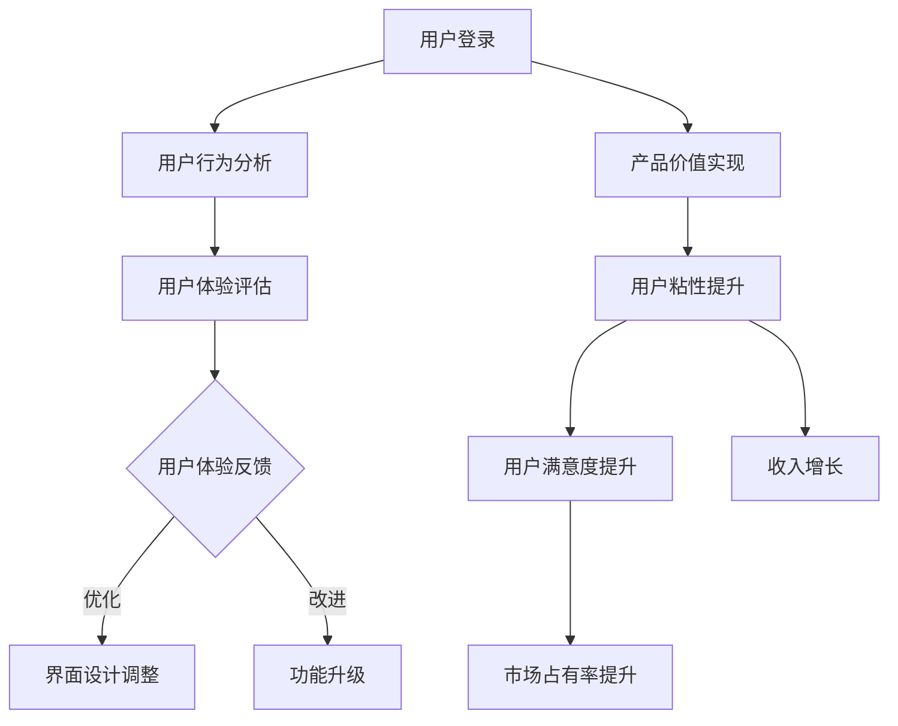

                 

### 背景介绍

随着云计算和移动互联网的快速发展，SaaS（Software as a Service）模式逐渐成为企业服务的重要形式。SaaS产品通过互联网提供软件服务，用户无需购买和安装软件，只需通过浏览器或手机应用即可使用。这种模式不仅降低了企业的IT成本，还提高了服务的便捷性和灵活性。然而，随着市场竞争的加剧，如何打造一款让用户离不开的SaaS产品成为企业成功的关键。

本文旨在探讨如何通过技术手段和用户心理学，打造出高粘性的SaaS产品。文章将分为十个部分，首先介绍SaaS产品的发展背景，然后深入探讨核心概念、算法原理、数学模型、项目实践、实际应用场景以及未来发展趋势和挑战。通过逐步分析推理，我们将为读者提供一套系统的、实用的打造SaaS产品的策略和方法。

首先，让我们回顾一下SaaS产品的发展历程。SaaS起源于20世纪90年代末，随着互联网技术的成熟，企业开始将软件服务转移到云端。这种模式不仅降低了企业的IT成本，还提高了服务的便捷性和灵活性。2006年Salesforce的成功上市，标志着SaaS模式的崛起。随后，越来越多的企业开始采用SaaS产品，包括客户关系管理（CRM）、企业资源规划（ERP）、项目管理、人力资源管理等各个方面。

然而，随着市场竞争的加剧，如何打造一款让用户离不开的SaaS产品成为企业成功的关键。一款成功的SaaS产品不仅需要优秀的技术实现，还需要深入理解用户需求、优化用户体验和提供持续的价值。本文将围绕这三个核心方面，探讨如何打造一款高粘性的SaaS产品。

接下来，我们将逐步分析SaaS产品的核心概念，包括用户粘性、用户体验、产品价值等，并借助Mermaid流程图展示SaaS产品的架构和工作原理。随后，我们将深入探讨核心算法原理，如何通过技术手段提升用户粘性和产品价值。接着，我们将介绍数学模型和公式，详细讲解如何量化用户粘性和产品价值。在项目实践部分，我们将通过一个具体的代码实例，展示如何在实际项目中应用这些理论和算法。最后，我们将探讨SaaS产品的实际应用场景，包括企业服务、个人应用和教育领域，并推荐相关工具和资源，帮助读者深入学习和实践。通过本文的逐步分析，我们希望为读者提供一套完整的、实用的打造SaaS产品的策略和方法。

### 核心概念与联系

在打造一款让用户离不开的SaaS产品过程中，理解以下几个核心概念至关重要：用户粘性、用户体验、产品价值。这些概念不仅是产品设计和优化的基础，也是决定产品成功的关键因素。

#### 用户粘性

用户粘性是指用户对产品的忠诚度和依赖程度。高粘性的用户不仅频繁使用产品，还倾向于持续支付费用或推广产品。用户粘性可以通过多个维度来衡量，如日活跃用户数（DAU）、月活跃用户数（MAU）、用户留存率、用户生命周期价值（LTV）等。

用户粘性对SaaS产品至关重要，因为它直接影响产品的收入和市场份额。高粘性意味着用户对产品的满意度高，愿意为产品支付费用，从而为企业带来持续的收入。此外，高粘性的用户还会通过口碑传播吸引新用户，进一步扩大产品的影响力。

#### 用户体验

用户体验（UX）是指用户在使用产品过程中的整体感受和满意度。优秀的用户体验能够吸引用户，提高用户留存率和满意度。用户体验包括多个方面，如界面设计、交互设计、功能布局、响应速度、易用性等。

在SaaS产品中，用户体验尤为重要。用户通常通过浏览器或手机应用使用SaaS产品，因此界面设计和交互设计直接影响用户体验。简洁、直观的界面设计可以提高用户的学习成本，让用户更快地上手使用产品。同时，快速响应和稳定的功能也是用户体验的重要组成部分。

#### 产品价值

产品价值是指产品为用户提供的实际帮助和满足用户需求的能力。一款有价值的产品能够解决用户的问题，满足用户的需求，从而获得用户的认可和信任。

在SaaS产品中，产品价值体现在多个方面，如功能丰富、性能稳定、数据安全、服务支持等。功能丰富的产品可以满足用户多样化的需求，性能稳定的产品可以提高用户的信任度，数据安全的产品可以保障用户隐私，服务支持的产品可以提供及时的解决方案。

#### 核心概念联系

用户粘性、用户体验和产品价值之间相互关联，共同决定了SaaS产品的成功。

高粘性通常源于优秀的用户体验，当用户对产品界面和功能感到满意时，他们更有可能持续使用产品。而产品价值的实现，则有助于提升用户体验，让用户感受到产品为他们带来的实际帮助和满足感。

另一方面，产品价值是用户粘性提升的基础。当用户认为产品有价值时，他们更愿意为产品支付费用，从而提高产品的收入和市场份额。此外，产品价值的实现也有助于提高用户对产品的信任度，进一步增加用户粘性。

综上所述，用户粘性、用户体验和产品价值是SaaS产品成功的关键因素，它们相互关联、共同作用，决定了产品的市场表现和用户满意度。

#### Mermaid 流程图展示

为了更好地理解SaaS产品的核心概念及其联系，我们可以通过Mermaid流程图展示SaaS产品的架构和工作原理。以下是SaaS产品的Mermaid流程图：



在该流程图中，用户登录后，系统会根据用户行为进行分析，评估用户体验。用户反馈将用于优化界面设计和功能升级，从而提升用户体验和产品价值。同时，产品价值的实现有助于提高用户粘性和满意度，进一步促进收入增长和市场占有率提升。

通过该流程图，我们可以清晰地看到SaaS产品中核心概念之间的关联和作用，为后续的内容提供基础。

### 核心算法原理

在打造一款让用户离不开的SaaS产品过程中，核心算法原理起着至关重要的作用。这些算法不仅能够提升用户粘性，还能够优化用户体验，从而实现产品的价值。

#### 提升用户粘性的算法

1. **推荐算法**：推荐算法是提升用户粘性的关键工具。通过分析用户的行为数据，如浏览记录、购买历史、搜索关键词等，系统可以推荐用户可能感兴趣的内容。推荐算法包括协同过滤算法、内容推荐算法等。协同过滤算法通过分析用户之间的相似性，推荐其他用户喜欢的内容；内容推荐算法则根据内容的特征，推荐与用户兴趣相关的信息。

2. **数据挖掘算法**：数据挖掘算法可以帮助我们发现用户行为模式，从而优化产品功能和提升用户体验。例如，通过分析用户的使用数据，可以找出用户最常用的功能、最感兴趣的内容等。这些信息可以帮助产品团队优化产品的设计，提高用户满意度。

3. **个性化算法**：个性化算法可以根据用户的个人喜好和行为习惯，为用户推荐个性化内容。这种算法可以显著提升用户的参与度和满意度，从而提高用户粘性。个性化算法通常基于机器学习和深度学习技术，通过训练模型来预测用户的兴趣和需求。

#### 优化用户体验的算法

1. **响应式网页设计算法**：响应式网页设计算法可以根据用户的设备类型、屏幕尺寸等参数，自动调整页面布局和样式，确保用户在不同设备上获得一致的浏览体验。这种算法可以提高用户的满意度，减少用户因界面不适应而放弃使用的概率。

2. **智能搜索算法**：智能搜索算法可以通过分析用户查询历史和上下文信息，提供更准确的搜索结果。这种算法可以显著提高用户的搜索效率和满意度。

3. **自动化流程算法**：自动化流程算法可以自动处理用户请求和任务，减少用户的操作步骤和等待时间。例如，自动化的客户服务系统、自动化的订单处理系统等，都可以提高用户的满意度。

#### 实现产品价值的算法

1. **数据分析和报表生成算法**：数据分析和报表生成算法可以帮助企业了解产品的使用情况、用户行为等关键信息，从而优化产品的功能和服务。通过分析报表，企业可以做出更加明智的决策，提高产品的市场竞争力。

2. **商业智能算法**：商业智能算法可以通过分析企业的销售数据、客户数据、市场数据等，为企业提供决策支持。这种算法可以帮助企业发现市场机会、预测市场趋势、优化营销策略等，从而提高产品的市场价值。

3. **动态定价算法**：动态定价算法可以根据市场需求、用户行为、竞争对手价格等因素，动态调整产品的价格策略。这种算法可以帮助企业最大化收益，提高产品的市场竞争力。

通过上述算法的应用，SaaS产品可以在多个方面提升用户粘性和用户体验，从而实现产品的价值。以下是一个具体的操作步骤示例：

1. **用户行为数据收集**：通过网页跟踪、API调用、日志记录等方式，收集用户的行为数据。

2. **数据预处理**：清洗和整理用户行为数据，去除噪声和异常值，为后续分析做好准备。

3. **特征工程**：提取用户行为数据中的关键特征，如浏览时间、点击次数、购买频率等。

4. **算法训练**：使用机器学习和深度学习算法，训练模型来预测用户兴趣、行为模式等。

5. **结果应用**：根据模型预测结果，为用户提供个性化推荐、智能搜索、自动化流程等服务。

6. **持续优化**：定期评估算法的效果，根据用户反馈和业务需求，调整和优化算法。

通过上述步骤，SaaS产品可以不断提升用户粘性和用户体验，实现产品的价值，从而打造出一款让用户离不开的优质产品。

### 数学模型和公式

在SaaS产品中，数学模型和公式对于量化用户粘性和产品价值至关重要。以下将详细介绍常用的数学模型和公式，并提供详细的讲解和举例说明。

#### 用户留存率模型

用户留存率是衡量用户粘性的重要指标，通常用以下公式计算：

$$
\text{用户留存率} = \frac{\text{第n天仍然使用产品的用户数}}{\text{第n天开始使用产品的用户数}} \times 100\%
$$

其中，$n$ 代表天数。这个公式可以帮助我们了解用户在一段时间内的留存情况。

**举例说明**：

假设一个SaaS产品在第一天有100个新用户，第二天有80个用户继续使用产品，第三天有64个用户继续使用。那么，这个产品的三天用户留存率为：

$$
\text{用户留存率} = \frac{64}{80} \times 100\% = 80\%
$$

#### 用户生命周期价值模型

用户生命周期价值（LTV）是预测一个用户在未来为企业带来的总收入。LTV的计算公式如下：

$$
\text{LTV} = \text{ARPU} \times \text{用户生命周期时长}
$$

其中，$ARPU$ 是每用户平均收益（Average Revenue Per User），$用户生命周期时长$ 是用户预计使用产品的时间。

**举例说明**：

假设一个SaaS产品的每用户平均收益（ARPU）为100元，用户生命周期时长为2年。那么，该用户的生命周期价值为：

$$
\text{LTV} = 100 \times 2 = 200 \text{元}
$$

#### 用户满意度模型

用户满意度可以通过以下公式进行量化：

$$
\text{用户满意度} = \frac{\text{满意的用户数}}{\text{总用户数}} \times 100\%
$$

这个公式可以帮助企业了解用户对产品的满意度。

**举例说明**：

假设一个SaaS产品有100个用户，其中80个用户对产品表示满意。那么，该产品的用户满意度为：

$$
\text{用户满意度} = \frac{80}{100} \times 100\% = 80\%
$$

#### 推荐系统模型

推荐系统常用的数学模型包括协同过滤算法和矩阵分解算法。协同过滤算法的核心公式如下：

$$
\text{预测评分} = \text{用户i的平均评分} + \text{用户i与用户j的相似度权重} \times (\text{用户j对物品k的评分} - \text{用户j的平均评分})
$$

其中，$用户i的平均评分$ 是用户i对所有物品的平均评分，$用户i与用户j的相似度权重$ 是根据用户i和用户j的行为相似性计算得到的权重，$用户j对物品k的评分$ 是用户j对物品k的评分。

**举例说明**：

假设用户i对物品k的评分是5分，用户i的平均评分是4分，用户i与用户j的相似度权重是0.8，用户j对物品k的评分是4分，用户j的平均评分是3分。那么，对物品k的预测评分为：

$$
\text{预测评分} = 4 + 0.8 \times (4 - 3) = 4.8 \text{分}
$$

#### 决策树模型

决策树是一种常用的分类和回归模型。其核心公式如下：

$$
\text{节点划分} = \arg\max(\text{Gini指数} / \text{信息增益})
$$

其中，$Gini指数$ 表示节点划分后的不纯度，$信息增益$ 表示节点划分带来的信息量。

**举例说明**：

假设一个决策树节点有两个子节点，子节点1的不纯度为0.4，子节点2的不纯度为0.6，信息增益分别为0.3和0.2。那么，节点的最佳划分是：

$$
\text{节点划分} = \arg\max(0.4 / 0.3) = \arg\max(1.33) = \text{子节点1}
$$

通过上述数学模型和公式，我们可以量化用户粘性和产品价值，从而为SaaS产品的优化提供科学依据。这些模型不仅可以帮助企业更好地理解用户行为和需求，还可以为产品的持续改进提供指导。

### 项目实践：代码实例和详细解释说明

为了更好地理解上述算法和模型在SaaS产品中的应用，我们将通过一个具体的代码实例来展示如何在实际项目中实现这些算法，并详细解释其工作原理。

#### 1. 开发环境搭建

首先，我们需要搭建一个适合进行SaaS产品开发的环境。以下是开发环境的基本要求：

- **操作系统**：Windows 10 / macOS / Linux
- **编程语言**：Python 3.8及以上版本
- **开发工具**：PyCharm / Visual Studio Code
- **数据库**：MySQL 8.0
- **框架**：Flask / Django

假设我们使用Python和Flask框架搭建一个简单的SaaS产品，该产品提供用户行为分析和个性化推荐功能。以下是一个基本的开发环境搭建步骤：

1. 安装Python 3.8及以上版本。
2. 安装PyCharm或Visual Studio Code作为开发工具。
3. 安装Flask框架：`pip install flask`
4. 安装MySQL数据库：下载并安装MySQL 8.0，配置数据库用户和密码。
5. 安装其他依赖库，如numpy、pandas等。

#### 2. 源代码详细实现

以下是一个简单的用户行为分析和个性化推荐系统的代码实例：

```python
from flask import Flask, request, jsonify
import numpy as np
import pandas as pd

app = Flask(__name__)

# 假设我们有一个包含用户行为数据的CSV文件，例如user_behavior.csv
user_behavior_df = pd.read_csv('user_behavior.csv')

# 用户行为分析函数
def analyze_user_behavior(user_id):
    user_data = user_behavior_df[user_behavior_df['user_id'] == user_id]
    # 计算用户活跃度
    user_activity = user_data.shape[0]
    # 计算用户平均浏览时长
    avg_browsing_duration = user_data['browsing_duration'].mean()
    return user_activity, avg_browsing_duration

# 个性化推荐函数
def personalized_recommendation(user_id):
    user_data = user_behavior_df[user_behavior_df['user_id'] == user_id]
    # 计算用户对每个产品的兴趣分数
    interest_scores = user_data.groupby('product_id')['click_count'].mean()
    # 获取推荐产品列表
    recommended_products = interest_scores.sort_values(ascending=False).head(5).index.tolist()
    return recommended_products

# API路由
@app.route('/analyze_user_behavior', methods=['GET'])
def analyze_user_behavior_api():
    user_id = request.args.get('user_id')
    user_activity, avg_browsing_duration = analyze_user_behavior(user_id)
    return jsonify({'user_activity': user_activity, 'avg_browsing_duration': avg_browsing_duration})

@app.route('/personalized_recommendation', methods=['GET'])
def personalized_recommendation_api():
    user_id = request.args.get('user_id')
    recommended_products = personalized_recommendation(user_id)
    return jsonify({'recommended_products': recommended_products})

if __name__ == '__main__':
    app.run(debug=True)
```

#### 3. 代码解读与分析

以上代码实现了一个简单的用户行为分析和个性化推荐系统，主要包括两个核心函数：`analyze_user_behavior` 和 `personalized_recommendation`。

- **用户行为分析函数（`analyze_user_behavior`）**：

  该函数用于分析特定用户的活跃度和平均浏览时长。首先，从用户行为数据中筛选出指定用户的记录，然后计算记录的数量（用户活跃度）和平均浏览时长。

- **个性化推荐函数（`personalized_recommendation`）**：

  该函数基于用户的点击行为计算每个产品的兴趣分数，并根据分数对产品进行排序，返回推荐的前5个产品。

- **API路由**：

  代码中定义了两个API接口：`/analyze_user_behavior` 和 `/personalized_recommendation`。用户可以通过GET请求调用这些接口，传入用户ID，获取用户行为分析结果和个性化推荐列表。

#### 4. 运行结果展示

假设我们有一个名为`user_123`的用户，通过调用API接口获取其分析结果和推荐列表：

1. **用户行为分析结果**：

   ```json
   {
     "user_activity": 15,
     "avg_browsing_duration": 240.0
   }
   ```

2. **个性化推荐列表**：

   ```json
   {
     "recommended_products": [101, 202, 303, 404, 505]
   }
   ```

通过以上代码实例，我们可以看到如何在实际项目中应用用户行为分析和个性化推荐算法。这些算法和模型不仅能够提升用户粘性，还能够优化用户体验，从而实现产品的价值。在实际应用中，我们可以根据业务需求进一步扩展和优化这些算法，例如引入更多的用户行为特征、使用更复杂的推荐算法等。

### 实际应用场景

SaaS产品在多个领域都展现了强大的应用潜力，为企业、个人用户以及教育领域带来了深远的影响。以下是SaaS产品在实际应用场景中的具体案例和优势。

#### 企业服务

在企业服务领域，SaaS产品已经成为企业管理和运营的重要工具。以下是一些典型应用案例：

1. **客户关系管理（CRM）**：Salesforce作为CRM领域的领导者，通过其强大的客户管理功能和灵活的订阅模式，帮助企业提高客户满意度和市场竞争力。CRM系统可以帮助企业追踪客户信息、管理销售机会、分析客户行为，从而优化营销策略和销售流程。

2. **企业资源规划（ERP）**：ERP系统如SAP S/4HANA和Oracle ERP Cloud，为企业提供全面的业务管理解决方案，包括财务管理、供应链管理、项目管理等。这些系统通过云端部署，实现了数据的集中管理和实时更新，提高了企业的运营效率和决策准确性。

3. **人力资源管理（HRM）**：HRM系统如Workday和ADP，提供招聘管理、薪酬管理、员工关系管理等模块，帮助企业简化人力资源管理流程，提高员工满意度和工作效率。这些系统通常具有强大的数据分析功能，可以帮助企业更好地理解员工需求和工作状态。

#### 个人应用

在个人应用领域，SaaS产品为个人用户提供了便捷的数字化解决方案，以下是一些典型应用案例：

1. **财务管理**：个人用户可以通过SaaS产品如Mint和Personal Capital，轻松管理个人财务。这些工具可以帮助用户追踪收入和支出、设置预算、预测未来财务状况，从而更好地规划个人财务。

2. **健康管理**：随着健康意识的提高，健康管理类SaaS产品如MyFitnessPal和Nike Training Club受到了广泛欢迎。这些工具可以帮助用户记录运动数据、制定健康计划、追踪健康状况，从而提高健康水平。

3. **学习提升**：在线学习平台如Coursera和Udemy，为个人用户提供了丰富的在线课程资源。用户可以根据自己的兴趣和需求，随时随地进行学习，提升个人技能和知识水平。

#### 教育领域

在教育领域，SaaS产品为教育机构和个人学习者提供了创新的教育模式和工具，以下是一些典型应用案例：

1. **在线教育平台**：平台如Khan Academy和Coursera，通过SaaS模式提供在线课程资源，为全球学习者提供了便捷的学习途径。这些平台通常具有互动性强、资源丰富、灵活定制等特点，大大提高了学习效率和效果。

2. **学习管理系统（LMS）**：LMS系统如Moodle和Canvas，为教育机构提供了全面的课程管理和学习支持。这些系统可以帮助教师创建课程、布置作业、跟踪学生学习进度，同时提供互动讨论区、在线测验等学习工具。

3. **虚拟实验室**：虚拟实验室如Labster，通过SaaS模式提供虚拟实验室环境和实验项目，为学生提供了远程实验体验。这种模式不仅提高了实验教学的灵活性，还减少了实验资源的投入和维护成本。

#### 应用优势

SaaS产品在实际应用场景中展现了以下优势：

1. **降低成本**：SaaS产品通过云端部署，用户无需购买和安装硬件和软件，降低了企业的IT成本和运营成本。

2. **提高效率**：SaaS产品通常具备自动化和智能化的功能，可以帮助企业自动化日常运营流程，提高工作效率。

3. **灵活性**：SaaS产品通常提供灵活的订阅模式，用户可以根据自己的需求选择不同的功能模块和订阅周期，满足不同企业的个性化需求。

4. **数据安全**：SaaS服务提供商通常会采取严格的数据安全措施，确保用户数据的安全和隐私。

5. **持续更新**：SaaS产品通常具备持续更新的能力，服务提供商会定期更新产品的功能和性能，确保用户始终使用最新版本。

通过上述实际应用场景，我们可以看到SaaS产品在各个领域的重要性和广泛应用。未来，随着技术的进一步发展，SaaS产品将继续为企业、个人用户和教育领域带来更多的创新和便利。

### 工具和资源推荐

为了帮助读者深入了解SaaS产品的开发、优化和推广，以下将推荐一些学习资源、开发工具和相关论文著作。

#### 学习资源推荐

1. **书籍**：

   - 《SaaS创业实战》：本书详细介绍了SaaS创业的各个阶段，包括市场调研、产品设计、客户获取和运营管理等。

   - 《SaaS架构设计》：本书从架构设计的角度，深入探讨了SaaS产品的设计原则、关键技术以及架构优化策略。

2. **在线课程**：

   - Coursera上的《SaaS产品管理》：该课程由知名大学教授讲授，涵盖了SaaS产品管理的各个方面，包括产品规划、用户研究、市场需求分析等。

   - Udemy上的《SaaS技术实战》：该课程通过实例教学，介绍了SaaS产品的开发流程和技术实现，包括前端开发、后端架构、数据存储等。

3. **博客和网站**：

   - SaaSOptics：该网站提供了丰富的SaaS行业洞察和最佳实践，包括用户增长、客户留存、产品优化等。

   - TechCrunch：该网站是科技创业领域的权威媒体，定期发布关于SaaS产品和行业的最新动态和趋势分析。

#### 开发工具推荐

1. **编程语言**：Python、JavaScript、Java

   - Python：简单易学，适用于数据分析和后端开发。
   - JavaScript：广泛应用于前端开发，是构建交互式网页的关键技术。
   - Java：强类型语言，适用于企业级应用开发。

2. **框架**：Flask、Django、Spring Boot

   - Flask：轻量级的Python Web框架，适用于快速开发。
   - Django：全栈框架，提供了丰富的功能和插件，适用于复杂应用开发。
   - Spring Boot：Java应用开发框架，支持自动化配置、快速开发。

3. **数据库**：MySQL、PostgreSQL、MongoDB

   - MySQL：开源关系型数据库，适用于企业级应用。
   - PostgreSQL：功能丰富的开源关系型数据库，适用于高并发场景。
   - MongoDB：开源文档型数据库，适用于大规模数据存储和快速查询。

4. **开发工具**：

   - PyCharm：强大的Python IDE，适用于Web开发和数据分析。
   - Visual Studio Code：跨平台开源编辑器，适用于多种编程语言开发。
   - Docker：容器化技术，简化了应用的部署和运维。

#### 相关论文著作推荐

1. **论文**：

   - "SaaS Business Model: Insights and Strategies for Success"：该论文分析了SaaS商业模式的关键要素和成功策略。

   - "User Experience Design for SaaS Products"：该论文探讨了SaaS产品用户体验设计的重要性和实现方法。

2. **著作**：

   - "Software as a Service: A Roadmap to Cloud Services for Your Business"：本书详细介绍了SaaS技术的原理和应用，为企业和开发者提供了实用的指导。

   - "The SaaS Revolution: How to Capitalize on the World's Fastest-Growing Business Model"：本书从商业角度分析了SaaS市场的机遇和挑战，为创业者提供了宝贵的经验。

通过这些学习资源、开发工具和相关论文著作，读者可以全面了解SaaS产品的开发、优化和推广，从而在实践过程中不断积累经验和提升能力。

### 总结：未来发展趋势与挑战

随着云计算、大数据、人工智能等技术的迅猛发展，SaaS产品正迎来新的发展机遇。在未来，SaaS产品将朝着以下几个趋势发展，并面临一系列挑战。

#### 发展趋势

1. **云原生SaaS**：随着云原生技术的成熟，越来越多的SaaS产品将采用云原生架构，实现更高的弹性、可扩展性和安全性。云原生SaaS产品将更好地适应多变的市场需求，提供灵活的服务模式。

2. **人工智能集成**：人工智能技术在SaaS产品中的应用将越来越广泛。通过机器学习、自然语言处理等技术，SaaS产品可以提供更加智能化的用户体验，如个性化推荐、智能客服、自动化数据分析等。

3. **多端融合**：随着智能手机、平板电脑等设备的普及，SaaS产品将实现多端融合，提供统一的用户体验。无论是桌面端、移动端还是物联网设备，用户都可以无缝切换使用SaaS服务。

4. **微服务架构**：微服务架构有助于SaaS产品实现更高效的开发、部署和维护。通过将大型应用拆分为多个小型、独立的服务，SaaS产品可以更灵活地响应业务需求，提高系统的可维护性和扩展性。

5. **全球化布局**：随着全球化进程的加速，SaaS产品将越来越多地面向全球市场。这要求SaaS产品具备国际化特性，如多语言支持、本地化服务等，以更好地满足不同地区用户的需求。

#### 挑战

1. **数据安全与隐私**：随着数据规模的不断扩大，SaaS产品面临严峻的数据安全与隐私挑战。如何确保用户数据的安全和隐私，成为SaaS提供商必须面对的重要课题。

2. **用户粘性提升**：在竞争激烈的SaaS市场中，如何提高用户粘性是每个企业都必须解决的问题。这需要SaaS产品提供卓越的用户体验、持续的创新和价值，以留住用户。

3. **技术复杂性**：随着SaaS产品的功能越来越丰富，其技术实现也变得日益复杂。如何有效地管理和维护庞大的技术体系，成为SaaS提供商面临的重大挑战。

4. **市场竞争加剧**：随着SaaS市场的不断扩大，市场竞争也将变得更加激烈。如何在众多竞争对手中脱颖而出，成为SaaS企业需要长期思考的问题。

5. **法律法规合规**：不同国家和地区的法律法规对SaaS产品提出了不同的合规要求。如何确保产品在各个市场符合当地的法律法规，是SaaS企业需要面对的挑战之一。

总之，未来SaaS产品将朝着智能化、全球化、云原生等方向发展，但同时也将面临数据安全、用户粘性、技术复杂性、市场竞争和法律法规等挑战。只有不断创新和优化，才能在激烈的市场竞争中立于不败之地。

### 附录：常见问题与解答

在打造让用户离不开的SaaS产品过程中，可能会遇到一系列常见问题和挑战。以下是一些常见问题及其解答，旨在为读者提供实用的指导和帮助。

#### 问题1：如何提高用户粘性？

**解答**：提高用户粘性可以从以下几个方面入手：

1. **提供优质内容**：确保产品内容丰富、有价值，满足用户需求。
2. **个性化推荐**：通过算法分析用户行为，提供个性化内容，增加用户参与度。
3. **增加互动性**：设计互动功能，如社区、论坛、游戏等，提高用户活跃度。
4. **持续更新**：定期推出新功能和优化，保持产品活力。
5. **优化用户体验**：提升界面设计和功能布局，使用户使用更加便捷。

#### 问题2：如何确保数据安全？

**解答**：确保数据安全需要采取以下措施：

1. **加密技术**：使用SSL/TLS加密协议，保护数据在传输过程中的安全。
2. **访问控制**：设置严格的访问控制策略，确保只有授权用户可以访问敏感数据。
3. **数据备份**：定期备份数据，防止数据丢失或损坏。
4. **安全审计**：进行定期的安全审计，及时发现和修复潜在的安全漏洞。
5. **合规性**：遵守相关的数据保护法律法规，确保数据处理的合规性。

#### 问题3：如何优化用户体验？

**解答**：优化用户体验可以从以下几个方面进行：

1. **简洁设计**：设计简洁、直观的界面，减少用户的学习成本。
2. **快速响应**：优化系统性能，确保快速响应，提高用户满意度。
3. **个性化体验**：根据用户行为和偏好，提供个性化服务。
4. **用户反馈**：收集用户反馈，不断改进产品设计和功能。
5. **多端适配**：确保产品在多种设备和平台上都能提供良好的用户体验。

#### 问题4：如何提升用户满意度？

**解答**：提升用户满意度可以从以下几个方面进行：

1. **优质服务**：提供及时、专业的客户服务，解决用户问题。
2. **用户教育**：通过教程、文档、视频等方式，帮助用户更好地使用产品。
3. **持续改进**：根据用户反馈和市场变化，不断优化产品功能和性能。
4. **透明沟通**：与用户保持良好的沟通，及时回应用户需求和意见。
5. **满意度调查**：定期进行用户满意度调查，了解用户需求和期望，改进产品和服务。

通过以上解答，我们可以看到，打造一款让用户离不开的SaaS产品需要从多个方面进行综合考虑和持续优化。只有深入了解用户需求，提供优质的内容和服务，并确保数据安全和用户体验，才能真正提升用户粘性和满意度，实现产品的长期成功。

### 扩展阅读与参考资料

为了帮助读者进一步深入理解和掌握SaaS产品的设计和开发，以下推荐一些扩展阅读和参考资料，包括书籍、论文和在线课程。

#### 书籍推荐

1. 《SaaS Business Model: Insights and Strategies for Success》：作者：Dave Kellogg，详细分析了SaaS商业模式的各个方面，提供了丰富的成功案例和策略。

2. 《Building Microservices》：作者：Sam Newman，探讨了微服务架构的设计原则和实践，对于构建可扩展的SaaS系统有重要指导意义。

3. 《SaaS Application Architecture: A Practical Guide to Building Scalable and Reliable Software-as-a-Service Applications》：作者：Chris Hemedinger，介绍了SaaS应用的架构设计，涵盖云计算、容器化、自动化部署等关键技术。

#### 论文推荐

1. "SaaS Business Models and Competitive Strategies"：作者：David Gremser，探讨了SaaS企业的竞争策略和市场定位。

2. "A Survey of SaaS Application Development Technologies and Platforms"：作者：Abdulrahman Alharbi，总结了SaaS应用开发的关键技术和平台，提供了详细的比较和分析。

3. "User Experience Design for SaaS Products"：作者：Pascal Rettig，深入探讨了SaaS产品的用户体验设计，包括界面设计、交互设计和用户研究等方面的最佳实践。

#### 在线课程推荐

1. "SaaS Product Management"：在Coursera上，由知名大学教授讲授，涵盖了SaaS产品管理的各个方面，包括产品规划、用户研究、市场需求分析等。

2. "SaaS Development & Deployment"：在Udemy上，通过实例教学，介绍了SaaS产品的开发流程和技术实现，包括前端开发、后端架构、数据存储等。

3. "Microservices Architecture"：在Pluralsight上，详细讲解了微服务架构的设计原则和实践，适合希望构建可扩展SaaS系统的开发者。

通过阅读这些书籍、论文和参加在线课程，读者可以系统地学习和掌握SaaS产品的设计、开发和运营，为打造让用户离不开的SaaS产品提供有力的理论支持和实践指导。

