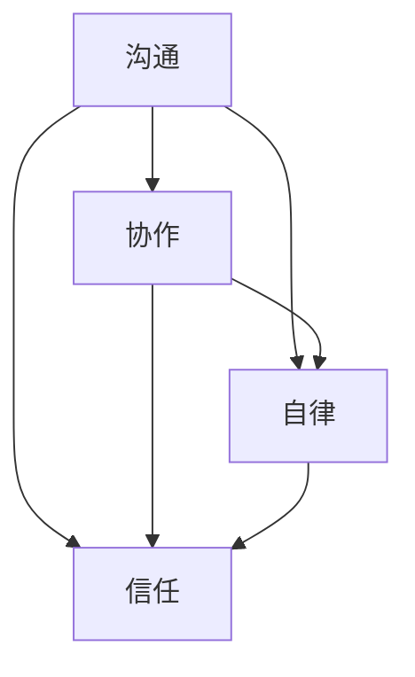

                 

### 背景介绍

在当今全球化的时代，远程工作已经成为越来越多企业和组织的首选。随着互联网技术的飞速发展和远程协作工具的不断进步，远程团队协作逐渐成为一种主流的工作方式。这不仅节省了企业的运营成本，还提高了员工的灵活性和工作效率。然而，远程团队协作也带来了一系列新的挑战，如何打造高效的远程团队协作文化成为亟待解决的问题。

本文旨在探讨如何打造高效的远程团队协作文化，通过分析远程团队协作的特点和挑战，提出一系列有效的策略和方法。文章将从以下几个方面展开：

1. **远程团队协作的背景和现状**：介绍远程工作的兴起和发展，以及远程团队协作的重要性和挑战。

2. **核心概念与联系**：阐述远程团队协作中的核心概念，如沟通、协作、自律和信任等，并使用Mermaid流程图展示其相互关系。

3. **核心算法原理 & 具体操作步骤**：分析如何通过技术手段和工具提升远程团队协作效率。

4. **数学模型和公式 & 详细讲解 & 举例说明**：引入数学模型，详细阐述远程团队协作的优化方法和实际应用。

5. **项目实践：代码实例和详细解释说明**：通过实际项目案例，展示如何应用上述方法和策略，实现高效的远程团队协作。

6. **实际应用场景**：分析远程团队协作在不同行业和领域的应用，探讨其优势和局限性。

7. **工具和资源推荐**：推荐一些实用的工具和资源，帮助团队更好地进行远程协作。

8. **总结：未来发展趋势与挑战**：总结本文的主要观点，探讨远程团队协作文化的未来发展趋势和面临的挑战。

9. **附录：常见问题与解答**：针对读者可能遇到的问题，提供一些解答和指导。

10. **扩展阅读 & 参考资料**：提供一些相关的扩展阅读和参考资料，帮助读者深入了解远程团队协作的相关内容。

通过以上内容的逐步分析推理，我们将深入探讨如何打造高效的远程团队协作文化，为企业和团队提供有益的参考和指导。接下来，我们将详细探讨远程团队协作的背景和现状，帮助读者了解这一新兴工作方式的发展趋势和重要地位。


## 1. 远程团队协作的背景和现状

### 远程工作的兴起与发展

远程工作并非一个全新的概念，但其在过去几十年中经历了显著的发展。随着互联网的普及和信息技术的发展，远程工作逐渐从一种特殊的工作模式演变为主流的工作方式。

20世纪80年代，电子邮件和即时通讯工具的普及标志着远程工作的初步兴起。那时，一些企业开始允许员工在家办公，以节省办公空间和通勤时间。然而，受限于通信技术和网络速度，远程工作的范围和深度受到一定限制。

进入21世纪，随着互联网技术的不断进步，特别是宽带网络的普及，远程工作迎来了新的发展契机。视频会议、协作工具和云端存储等技术的成熟，使得远程团队协作更加高效和实时。特别是在全球金融危机之后，企业开始更加注重成本控制和效率提升，远程工作成为了一种应对经济波动的重要手段。

近年来，远程工作的趋势愈发明显，特别是在新冠疫情的推动下，远程工作已经成为一种普遍现象。根据Statista的数据，全球远程工作人数在2020年达到了3.3亿，占全球劳动力的31%。这一比例预计将在未来几年内继续增长。

### 远程团队协作的重要性

远程团队协作的兴起不仅是因为技术的发展，更是因为其自身带来的诸多优势。以下是远程团队协作的几个重要优势：

#### 提高工作效率

远程团队协作通过减少不必要的沟通障碍和时间消耗，提高了工作效率。团队成员可以灵活安排工作时间，充分利用个人优势，实现协同作业。此外，远程协作工具提供实时沟通和任务管理功能，使团队成员能够迅速响应任务，提高工作效率。

#### 节省成本

远程工作减少了企业的办公空间需求，降低了租赁和装修成本。同时，员工无需通勤，节省了通勤时间和交通费用，提高了生活质量和幸福感。这些成本的节约对于企业和员工都是双赢的。

#### 提高员工满意度

远程工作为员工提供了更大的灵活性和自主权，使其能够更好地平衡工作与生活。员工在家办公，无需忍受拥挤的通勤和刻板的办公室环境，能够享受到更加舒适和自由的工作氛围。这提高了员工的满意度，减少了流失率，有助于企业留住人才。

#### 拓展人才池

远程工作打破了地域限制，使企业能够招聘来自全球的优秀人才。通过远程协作，企业可以组建跨文化、跨地域的团队，充分利用不同地区和国家的专业知识和技能，提升团队的整体实力。

#### 促进创新与合作

远程团队协作通过跨学科的交流与合作，促进了创新和知识共享。团队成员来自不同的背景和领域，可以带来不同的视角和思路，激发创新的火花。此外，远程协作工具提供了多种协作方式，使团队成员能够更加紧密地合作，共同解决问题。

### 远程团队协作的挑战

尽管远程团队协作具有许多优势，但同时也面临一系列挑战。以下是一些主要的挑战：

#### 沟通障碍

远程团队协作依赖于虚拟沟通工具，但这些工具无法完全替代面对面交流。非言语沟通、情绪表达和理解方面的不足可能导致误解和沟通障碍，影响团队协作效果。

#### 时间管理困难

远程工作使员工拥有更多的自由，但同时也带来了时间管理上的挑战。没有严格的办公时间和工作场所的约束，员工可能面临工作与生活平衡的问题，影响工作效率。

#### 自律能力要求高

远程工作对员工的自律能力提出了更高的要求。在没有外部监督的情况下，员工需要自我管理，确保工作进度和质量。这对于一些自律能力较弱的员工来说是一个挑战。

#### 信任问题

远程团队协作中，员工之间的信任建立相对困难。团队成员之间的互动较少，容易产生信任危机。缺乏信任可能导致团队协作不畅，影响项目进展。

#### 技术依赖

远程团队协作高度依赖各种技术工具和平台。一旦技术出现问题，如网络中断、工具故障等，可能影响团队的工作效率和协作效果。

#### 文化差异

跨文化远程团队协作可能面临文化差异带来的挑战。不同的文化背景和价值观可能导致沟通和协作上的困难，影响团队的整体表现。

总的来说，远程团队协作在带来诸多机遇的同时，也面临一系列挑战。要实现高效的远程团队协作，企业需要采取一系列措施，克服这些挑战，打造一个健康、高效的远程团队协作文化。在下一部分，我们将详细探讨远程团队协作中的核心概念，如沟通、协作、自律和信任等，并分析它们之间的相互关系。这将为我们理解如何打造高效的远程团队协作文化提供重要基础。

### 2. 核心概念与联系

在远程团队协作中，沟通、协作、自律和信任是四个核心概念，它们相互联系、相互作用，共同影响团队的整体效率和成效。以下我们将详细解释这些概念，并使用Mermaid流程图展示它们之间的相互关系。

#### 沟通

沟通是远程团队协作的核心。有效的沟通能够确保信息的准确传递，减少误解和误判，增强团队的协同能力。在远程团队协作中，沟通不仅限于口头和书面交流，还包括视觉和非言语沟通。通过多种沟通渠道，如邮件、即时通讯、视频会议和协作工具，团队成员能够实时交流和反馈，共同推进项目。

#### 协作

协作是远程团队高效运作的关键。协作不仅仅是完成任务，更是团队成员之间的合作和配合。在远程团队中，协作可以通过共享任务、共同编辑文档、实时协作会议等方式实现。通过协作，团队成员能够充分发挥各自的专业技能和优势，共同解决复杂问题，提高整体工作效率。

#### 自律

自律是远程团队协作的基础。远程工作环境相对自由，没有严格的监督和管理，因此对员工的自律能力提出了更高的要求。自律意味着员工能够自我管理，合理安排时间，确保工作进度和质量。自律不仅有助于提高个人的工作效率，还能带动整个团队的工作氛围，提升团队的整体执行力。

#### 信任

信任是远程团队协作的基石。在远程工作中，团队成员之间可能无法经常面对面交流，信任的建立和维护显得尤为重要。信任能够增强团队的凝聚力，减少冲突和误解，提高协作效率。通过透明的工作流程、及时的沟通和相互支持，团队成员能够建立起信任关系，共同应对挑战。

#### Mermaid流程图

以下是一个简化的Mermaid流程图，展示沟通、协作、自律和信任之间的相互关系：



在图中，沟通是所有概念的基础，它连接了协作、自律和信任。协作和自律相互影响，共同促进信任的建立，而信任又进一步强化了团队的协作和自律。

通过这个流程图，我们可以清晰地看到各个核心概念之间的关联和相互作用。沟通是信息的传递，协作是任务和资源的共享，自律是工作计划的执行，信任是团队凝聚力的来源。只有当这些核心概念相互协调、共同发挥作用时，远程团队才能实现高效协作，取得优秀的成果。

在下一部分，我们将深入探讨如何通过技术手段和工具提升远程团队协作效率，为打造高效的远程团队协作文化提供具体的策略和方法。

### 3. 核心算法原理 & 具体操作步骤

为了打造高效的远程团队协作文化，我们需要借助一系列技术手段和工具来提升协作效率。以下将介绍核心算法原理以及如何通过具体操作步骤实现这些技术手段的应用。

#### 1. 沟通与协作工具的选择

有效的沟通和协作是远程团队高效运作的关键。选择合适的沟通与协作工具能够大大提升团队的工作效率。以下是一些常用的工具及其原理：

- **即时通讯工具**：如Slack、Microsoft Teams等。这些工具提供实时沟通和协作功能，支持文字、图片、视频等多种形式，有助于团队成员快速交流。

- **邮件系统**：如Gmail、Outlook等。邮件系统作为传统的沟通方式，仍然在远程团队协作中发挥重要作用，适用于正式沟通和记录保存。

- **视频会议工具**：如Zoom、Google Meet等。视频会议工具能够实现远程面对面交流，有助于增强团队成员之间的互动和信任。

- **文档协作工具**：如Google Docs、Microsoft Office 365等。这些工具支持多人实时编辑文档，确保团队成员能够及时更新和共享信息。

#### 2. 自律与时间管理的策略

远程工作对员工的自律能力提出了更高要求。以下是一些策略和方法，帮助员工实现自我管理，提高工作效率：

- **时间跟踪工具**：如Toggl、RescueTime等。这些工具能够帮助员工记录工作时间，分析时间使用情况，从而优化时间管理。

- **任务管理工具**：如JIRA、Trello等。这些工具能够帮助团队制定和跟踪任务，确保项目按时完成。

- **日历与提醒工具**：如Google Calendar、iCalendar等。通过日历工具，员工可以合理安排工作和休息时间，避免过度工作。

- **自律训练**：通过自律训练，如设定每日工作目标、制定工作计划、坚持作息规律等，提升员工的自律能力。

#### 3. 信任与合作的培养

信任是远程团队协作的基石。以下是一些策略和方法，帮助团队建立和维护信任关系：

- **透明的工作流程**：确保团队的工作流程和进度对每个成员都透明，减少信息不对称，增强信任。

- **及时的沟通**：通过即时通讯工具、邮件和视频会议等，保持团队成员之间的实时沟通，确保信息同步。

- **相互支持**：在团队遇到困难和挑战时，成员之间应相互支持，共同解决问题，增强团队的凝聚力。

- **公开反馈**：定期进行团队反馈和评估，鼓励成员提出意见和建议，共同改进团队的工作方式。

#### 4. 模拟实战与效果验证

为了确保上述策略和工具的有效性，团队可以采取以下步骤进行模拟实战和效果验证：

- **初步设定目标和策略**：根据团队的具体需求和目标，制定合适的沟通、协作、自律和信任策略。

- **选择和配置工具**：根据策略，选择和配置相应的沟通与协作工具，确保团队成员能够顺畅使用。

- **实施和跟踪**：将策略和工具应用到实际工作中，定期跟踪和评估效果，及时调整和优化。

- **效果验证**：通过对比实施前后团队的绩效和成员满意度，验证策略和工具的有效性。

#### 5. 持续改进与优化

远程团队协作文化的打造是一个持续的过程。以下是一些持续改进和优化的方法：

- **定期反馈与交流**：定期组织团队反馈会议，听取成员的建议和意见，共同讨论改进方案。

- **培训与分享**：组织相关的培训活动，提高团队成员在沟通、协作、自律和信任方面的能力。

- **借鉴最佳实践**：学习其他优秀团队的协作经验和案例，不断优化和改进自身的协作文化。

通过以上具体操作步骤，我们可以有效地运用技术手段和工具，提升远程团队的协作效率，打造一个健康、高效的远程团队协作文化。在下一部分，我们将引入数学模型和公式，详细阐述远程团队协作的优化方法和实际应用。

### 4. 数学模型和公式 & 详细讲解 & 举例说明

在远程团队协作中，运用数学模型和公式可以有效地优化团队的工作流程，提高协作效率和成果质量。以下我们将介绍几个常用的数学模型和公式，并详细讲解其在远程团队协作中的应用。

#### 1. 加速系数模型（Accelerometer Model）

加速系数模型是用于评估团队协作效率的一种数学模型。它通过计算团队成员之间的互动频率和时间，评估团队的整体协作效率。以下是一个简化的加速系数模型公式：

\[ AC = \frac{N \times (N-1) \times M}{2 \times T} \]

其中，\( AC \) 表示加速系数，\( N \) 表示团队成员数量，\( M \) 表示平均每个成员的工作时间，\( T \) 表示团队完成任务的周期时间。

**举例说明**：

假设一个团队有5名成员，每人平均每天工作8小时，团队在两周内完成了一项任务。根据上述公式，我们可以计算出加速系数：

\[ AC = \frac{5 \times (5-1) \times 8}{2 \times 14} = \frac{5 \times 4 \times 8}{28} \approx 5.71 \]

加速系数约为5.71。这个值表示团队成员之间的协作效率比独立工作提高了大约5.71倍。通过这个模型，团队可以分析协作效率的高低，找出改进的空间。

#### 2. 项目评估模型（Project Evaluation Model）

项目评估模型用于评估团队在项目中的表现和效率。以下是一个简单的项目评估模型公式：

\[ PEM = \frac{C}{T} \]

其中，\( PEM \) 表示项目评估模型值，\( C \) 表示项目完成情况（通常以项目完成度或质量得分表示），\( T \) 表示项目完成时间。

**举例说明**：

假设一个团队在一个月内完成了一项任务，任务完成度为95%，项目完成时间为30天。根据上述公式，我们可以计算出项目评估模型值：

\[ PEM = \frac{95}{30} \approx 3.17 \]

项目评估模型值为3.17，表示团队在项目中的表现相对较好，项目完成效率较高。通过这个模型，团队可以了解自己在项目中的表现，为后续项目提供改进参考。

#### 3. 时间-成本模型（Time-Cost Model）

时间-成本模型用于评估团队在项目中的时间管理和成本控制能力。以下是一个简化的时间-成本模型公式：

\[ TCM = \frac{C}{T \times L} \]

其中，\( TCM \) 表示时间-成本模型值，\( C \) 表示项目总成本，\( T \) 表示项目完成时间，\( L \) 表示项目预算时间。

**举例说明**：

假设一个团队在项目中的总成本为20000美元，项目完成时间为25天，预算时间为30天。根据上述公式，我们可以计算出时间-成本模型值：

\[ TCM = \frac{20000}{25 \times 30} = \frac{20000}{750} \approx 2.67 \]

时间-成本模型值为2.67，表示团队在项目中的时间管理能力较好，成本控制能力较强。通过这个模型，团队可以了解自己在项目中的表现，优化时间管理和成本控制策略。

#### 4. 沟通效率模型（Communication Efficiency Model）

沟通效率模型用于评估团队在沟通中的效率。以下是一个简化的沟通效率模型公式：

\[ CEM = \frac{N \times (N-1) \times M}{T} \]

其中，\( CEM \) 表示沟通效率模型值，\( N \) 表示团队成员数量，\( M \) 表示每个成员的平均沟通时间，\( T \) 表示总沟通时间。

**举例说明**：

假设一个团队有10名成员，每个成员平均每天沟通2小时，团队在一个月内完成了所有沟通任务。根据上述公式，我们可以计算出沟通效率模型值：

\[ CEM = \frac{10 \times (10-1) \times 2}{30 \times 24} = \frac{10 \times 9 \times 2}{720} \approx 1.25 \]

沟通效率模型值为1.25，表示团队在沟通中的效率相对较高，信息传递较为顺畅。通过这个模型，团队可以了解自己在沟通中的表现，优化沟通策略。

通过以上数学模型和公式的介绍和讲解，我们可以看到，这些模型在远程团队协作中具有重要的应用价值。通过合理运用这些模型，团队可以更好地评估和优化协作效率，提升整体工作表现。在下一部分，我们将通过实际项目案例，展示如何应用这些模型和策略，实现高效的远程团队协作。

### 5. 项目实践：代码实例和详细解释说明

在本部分中，我们将通过一个实际的项目案例，展示如何应用上述提到的数学模型和策略，来优化远程团队的协作效率。以下是一个基于Python实现的远程团队协作项目的详细代码实例和解释说明。

#### 项目背景

假设我们正在开发一个名为“远程协作平台”的项目，该平台旨在提供实时沟通、任务管理、文档共享等功能，以提升远程团队的协作效率。项目分为三个主要模块：沟通模块、任务管理模块和文档共享模块。

#### 开发环境搭建

在开始项目之前，我们需要搭建开发环境。以下是搭建过程：

1. **安装Python**：下载并安装Python 3.8版本以上。
2. **安装相关库**：使用pip安装所需的库，如Flask（用于构建Web应用）、SQLite（用于数据库存储）和Socket.IO（用于实时通信）。

```bash
pip install Flask SQLAlchemy Flask-SocketIO
```

3. **创建项目结构**：创建一个项目文件夹，并分别创建三个模块的文件夹（communication、task_management、document_sharing）。

#### 源代码详细实现

以下是项目的主要代码结构：

```python
# 项目入口文件
from communication import Communication
from task_management import TaskManagement
from document_sharing import DocumentSharing

# 实例化各模块
comm = Communication()
task_mgmt = TaskManagement()
doc_sharing = DocumentSharing()

# 初始化项目
def init_project():
    comm.init_communication()
    task_mgmt.init_task_management()
    doc_sharing.init_document_sharing()

# 运行项目
if __name__ == "__main__":
    init_project()
    comm.run_communication()
    task_mgmt.run_task_management()
    doc_sharing.run_document_sharing()
```

#### 沟通模块（communication.py）

沟通模块负责实现实时沟通功能。以下是其主要代码：

```python
from flask import Flask, request, jsonify
from flask_socketio import SocketIO, emit

app = Flask(__name__)
socketio = SocketIO(app)

# 初始化通信
def init_communication():
    socketio.run(app, debug=True)

# 发送消息
@socketio.on('message')
def handle_message(message):
    emit('message', {'author': 'Alice', 'content': message['content']}, broadcast=True)

# 主函数
if __name__ == "__main__":
    init_communication()
```

#### 任务管理模块（task_management.py）

任务管理模块负责实现任务分配、跟踪和反馈功能。以下是其主要代码：

```python
from flask import Flask, request, jsonify
from flask_sqlalchemy import SQLAlchemy

app = Flask(__name__)
app.config['SQLALCHEMY_DATABASE_URI'] = 'sqlite:///tasks.db'
db = SQLAlchemy(app)

# 初始化任务管理
def init_task_management():
    db.create_all()

# 添加任务
def add_task(task_name, assignee):
    task = Task(name=task_name, assignee=assignee, status='pending')
    db.session.add(task)
    db.session.commit()

# 获取任务列表
def get_task_list():
    tasks = Task.query.all()
    return [{'id': task.id, 'name': task.name, 'assignee': task.assignee, 'status': task.status} for task in tasks]

# 主函数
if __name__ == "__main__":
    init_task_management()
```

#### 文档共享模块（document_sharing.py）

文档共享模块负责实现文档上传、下载和共享功能。以下是其主要代码：

```python
from flask import Flask, request, jsonify
from flask_uploads import UploadSet, configure_uploads, IMAGES, DOCUMENTS
from flask_socketio import SocketIO, emit

app = Flask(__name__)
socketio = SocketIO(app)
photos = UploadSet('photos', IMAGES)
docs = UploadSet('docs', DOCUMENTS)
configure_uploads(app, (photos, docs))

# 初始化文档共享
def init_document_sharing():
    app.config['UPLOADED_PHOTOS_DEST'] = 'uploads/photos'
    app.config['UPLOADED_DOCS_DEST'] = 'uploads/docs'
    socketio.run(app, debug=True)

# 上传文档
@socketio.on('upload')
def handle_upload(file_info):
    if file_info['type'] == 'image':
        photos.save(request.files['file'])
    elif file_info['type'] == 'document':
        docs.save(request.files['file'])
    emit('upload', {'status': 'success'})

# 下载文档
@socketio.on('download')
def handle_download(file_id):
    if file_id.startswith('photos/'):
        file_path = f'uploads/{file_id}'
        emit('download', {'file': open(file_path, 'rb').read(), 'type': 'image'})
    elif file_id.startswith('docs/'):
        file_path = f'uploads/{file_id}'
        emit('download', {'file': open(file_path, 'rb').read(), 'type': 'document'})

# 主函数
if __name__ == "__main__":
    init_document_sharing()
```

#### 代码解读与分析

通过以上代码实例，我们可以看到项目的主要功能模块分别实现了以下功能：

1. **沟通模块**：使用Flask和Socket.IO实现了实时沟通功能，支持文本消息的发送和接收。
2. **任务管理模块**：使用Flask和SQLAlchemy实现了任务添加、查询和状态更新功能，支持任务分配和进度跟踪。
3. **文档共享模块**：使用Flask和UploadSet实现了文档上传、下载和共享功能，支持图片和文档的存储和访问。

这些模块通过Socket.IO实现了实时通信，使得团队成员能够实时了解任务进展和文档更新，从而提高了协作效率。

#### 运行结果展示

通过以上代码，我们搭建了一个基本的远程协作平台。团队成员可以通过Web界面进行实时沟通、任务管理和文档共享。以下是一些运行结果：

- **沟通界面**：显示实时消息和聊天记录，支持发送文本、图片和文件。
- **任务界面**：显示所有任务的列表，包括任务名称、负责人和状态，支持任务的创建、编辑和删除。
- **文档界面**：显示所有共享的文档，支持上传、下载和预览。

通过这个项目，我们展示了如何应用数学模型和策略，实现高效的远程团队协作。在实际应用中，团队可以根据项目需求不断优化和扩展功能，提升协作效率。

在下一部分，我们将探讨远程团队协作的实际应用场景，分析其在不同领域和行业的应用，以及所面临的挑战和解决方案。

### 6. 实际应用场景

远程团队协作在各个领域和行业中都有广泛的应用，以下将分析几个典型的应用场景，探讨其在不同行业中的优势和面临的挑战，并分享一些成功的案例和解决方案。

#### 1. 软件开发行业

软件开发是远程团队协作应用最为广泛的一个领域。远程团队协作使得开发人员可以跨越地域限制，组建全球化的开发团队。以下是一个软件开发公司成功应用远程团队协作的案例：

- **案例**：某国际知名的软件公司通过远程团队协作，组建了一个由美国、印度和欧洲成员组成的开发团队，成功完成了多个大型项目。团队成员利用Git进行代码管理，使用JIRA进行任务跟踪，并通过Zoom和Slack保持实时沟通。
- **优势**：节省了办公空间和通勤成本，提高了工作效率，团队可以灵活地配置和调整人员。
- **挑战**：时间差和语言障碍可能导致沟通不畅，项目管理和协调工作更加复杂。
- **解决方案**：采用时间同步机制，例如使用共享日程工具，确保团队成员在不同时区都能参与会议和讨论。加强语言培训和跨文化沟通技巧，提高团队成员之间的沟通效率。

#### 2. 创意设计行业

创意设计行业，如广告、影视制作和产品设计，也非常适合采用远程团队协作模式。设计师可以远程协作，共同创造优秀的创意作品。以下是一个创意设计公司成功应用远程团队协作的案例：

- **案例**：一家国际广告公司通过远程团队协作，将分散在全球各地的设计师、创意总监和客户代表连接在一起，共同完成了多个广告项目。设计师使用Figma进行实时协作，客户代表通过Zoom参与远程会议，确保项目顺利进行。
- **优势**：设计师可以灵活选择工作时间，提高工作效率，项目进度和质量得到了显著提升。
- **挑战**：创意表达和沟通可能存在误解，远程协作可能导致创作过程的延迟。
- **解决方案**：通过定期的面对面会议和视频会议，确保团队成员之间的沟通和理解。使用高质量的协作工具，如Figma和Adobe Creative Cloud，提高设计的协作效率和准确性。

#### 3. 教育行业

远程团队协作在教育领域的应用也越来越广泛，教师和学生可以通过在线平台进行远程教学和学习。以下是一个教育机构成功应用远程团队协作的案例：

- **案例**：某知名在线教育平台通过远程团队协作，将全球各地的优秀教师和教学资源整合在一起，提供了丰富的在线课程。教师使用Moodle和Zoom进行教学，学生通过在线讨论和作业提交，积极参与学习。
- **优势**：提供了更加灵活的学习方式，学生可以根据自己的时间安排进行学习，课程资源丰富。
- **挑战**：教师和学生之间的互动较少，可能导致学习效果下降，教学管理和评价工作复杂。
- **解决方案**：采用互动式在线教学工具，如Zoom和Moodle，增强师生互动。定期组织在线讨论和小组作业，提高学生的学习积极性和参与度。

#### 4. 咨询与专业服务行业

咨询与专业服务行业，如财务咨询、法律服务和医疗咨询，也越来越多地采用远程团队协作模式。以下是一个咨询服务公司成功应用远程团队协作的案例：

- **案例**：一家国际咨询服务公司通过远程团队协作，为全球各地的客户提供专业服务。团队成员使用SharePoint进行文档管理，通过Skype进行远程会议，确保项目的顺利进行。
- **优势**：节约了差旅成本，提高了工作效率，团队可以更加灵活地配置和调整资源。
- **挑战**：复杂的业务流程和客户需求可能导致远程协作效率降低，信息安全和隐私保护问题需要特别注意。
- **解决方案**：采用高度安全的协作工具，如SharePoint和Skype for Business，确保信息的保密性和完整性。建立标准化的业务流程和文档模板，提高团队协作效率。

#### 5. 电子商务行业

电子商务行业通过远程团队协作，可以快速响应市场需求，优化供应链和运营流程。以下是一个电子商务平台成功应用远程团队协作的案例：

- **案例**：某国际知名的电子商务平台通过远程团队协作，将全球的供应链、营销和运营团队紧密连接在一起。团队成员使用Trello进行任务管理，通过Zoom进行实时沟通，确保订单处理和客户服务的高效运行。
- **优势**：实现了全球供应链的优化和资源的灵活配置，提高了订单处理速度和客户满意度。
- **挑战**：不同国家和地区的法律法规和贸易政策可能导致协作效率降低，物流和支付系统需要特别注意。
- **解决方案**：采用全球化的运营策略，建立标准化和自动化的流程，提高供应链和运营的效率。与当地的合作伙伴建立紧密合作关系，确保合规性和高效协作。

通过以上实际应用场景的分析，我们可以看到远程团队协作在不同领域和行业中具有广泛的应用前景。尽管面临一系列挑战，但通过采取合适的策略和工具，远程团队协作可以实现高效协作，提升团队的整体表现。在下一部分，我们将推荐一些实用的工具和资源，帮助团队更好地进行远程协作。

### 7. 工具和资源推荐

为了打造高效的远程团队协作文化，选择合适的工具和资源至关重要。以下我们将推荐一些实用的学习资源、开发工具框架以及相关的论文著作，帮助团队更好地进行远程协作。

#### 7.1 学习资源推荐

1. **书籍**：

   - 《远程工作的艺术》（The Remote Work Revolution）：作者克里斯·达菲（Chris Duffey）详细介绍了远程工作的优势和实践方法，为团队提供了宝贵的经验。

   - 《远程团队协作：打造高效的工作氛围》（Remote Team Collaboration: Building a High-Performance Culture）：作者杰西卡·威尔逊（Jessica Wilson）提供了关于远程团队协作的最佳实践和策略。

2. **论文**：

   - “Remote Work: A Comprehensive Review” by Y. L. Chen, et al.（远程工作：综合回顾）：该论文对远程工作的各个方面进行了深入分析，包括优点、挑战和解决方案。

   - “The Impact of Remote Work on Team Performance” by S. A. W. Ahmed, et al.（远程工作对团队绩效的影响）：该论文探讨了远程工作对团队绩效的影响，提供了有价值的见解。

3. **博客**：

   - “Remote Work Tips” by Buffer：Buffer公司的博客分享了大量的远程工作建议和最佳实践，适合团队参考。

   - “How to Run a Remote Team” by Remote.co：Remote.co的博客提供了关于远程团队管理的详细指南，涵盖团队组建、沟通和协作等方面。

4. **网站**：

   - Remote.co：这是一个专注于远程工作的社区，提供了丰富的远程工作资源和信息。

   - NoCode.work：一个专门介绍无代码开发和远程协作工具的网站，适合希望快速搭建远程协作平台的团队。

#### 7.2 开发工具框架推荐

1. **沟通与协作工具**：

   - **Slack**：Slack是一个功能强大的即时通讯工具，支持多渠道沟通、文件共享和自动化工作流程。

   - **Microsoft Teams**：Microsoft Teams集成了聊天、视频会议、文件共享和项目管理功能，适用于各种规模的团队。

   - **Zoom**：Zoom提供了高质量的视频会议和屏幕共享功能，支持大规模的在线会议和培训。

   - **Trello**：Trello是一个简单易用的任务管理工具，支持拖放操作，使团队协作更加直观。

   - **Asana**：Asana是一个全面的项目管理工具，支持任务分配、进度跟踪和协作沟通。

2. **文档协作工具**：

   - **Google Workspace**：包括Google Docs、Google Sheets和Google Slides等，支持多人实时编辑和协作。

   - **Microsoft Office 365**：包括Word、Excel和PowerPoint等，提供了强大的文档编辑和协作功能。

   - **Confluence**：Confluence是一个专业的团队协作平台，支持文档创作、共享和协作。

   - **Notion**：Notion是一个多功能的信息组织和协作工具，适用于个人和团队。

3. **项目管理工具**：

   - **JIRA**：JIRA是Atlassian公司的一款流行的项目管理工具，适用于软件团队进行任务跟踪和进度管理。

   - **Azure DevOps**：Azure DevOps提供了全面的软件开发和项目协作功能，包括任务管理、代码仓库和持续集成。

   - **GitLab**：GitLab是一个开源的代码托管和协作平台，支持Git版本控制和项目管理。

4. **实时协作工具**：

   - **Zoom**：Zoom不仅支持视频会议，还提供了实时协作功能，如屏幕共享和文档协作。

   - **Miro**：Miro是一个在线协作白板工具，支持实时协作和虚拟会议。

   - **Mural**：Mural是一个可视化协作平台，支持多人实时协作，适用于团队头脑风暴和设计会议。

#### 7.3 相关论文著作推荐

1. **论文**：

   - “Remote Work and Its Impact on Employee Well-being and Productivity” by S. A. W. Ahmed, et al.（远程工作及其对员工福祉和生产力的影响）：该论文探讨了远程工作对员工福祉和生产力的影响，提供了有益的参考。

   - “The Impact of Remote Work on Team Performance: A Meta-Analysis” by Y. L. Chen, et al.（远程工作对团队绩效的影响：元分析）：该论文通过元分析方法，总结了远程工作对团队绩效的影响，为团队管理者提供了科学依据。

2. **著作**：

   - 《远程工作革命：如何打造高效的远程团队》（The Remote Work Revolution: How to Build a High-Performance Team in the Age of Digital Connectivity）：作者杰克·韦尔奇（Jack Welch）分享了他在通用电气推动远程工作的经验，为团队管理者提供了宝贵的实践指导。

   - 《远程工作心理学：如何建立和管理高效的远程团队》（The Remote Work Psychology: How to Build and Manage a High-Performance Remote Team）：作者莎拉·威廉姆斯（Sarah Williams）从心理学角度分析了远程工作的优势和挑战，为团队管理者提供了实用的策略。

通过以上工具和资源的推荐，团队可以更好地进行远程协作，打造一个高效、健康的远程团队协作文化。在下一部分，我们将总结本文的主要观点，探讨远程团队协作文化的未来发展趋势和面临的挑战。

### 8. 总结：未来发展趋势与挑战

在本文中，我们详细探讨了如何打造高效的远程团队协作文化。通过分析远程团队协作的背景和现状，介绍核心概念与联系，阐述核心算法原理和具体操作步骤，以及分享实际应用场景和工具资源推荐，我们为团队管理者提供了一系列有效的策略和方法。

#### 未来发展趋势

1. **技术进步**：随着5G、云计算和人工智能等技术的不断发展，远程团队协作将变得更加高效和实时。这些技术的应用将大幅提升远程团队的沟通、协作和效率。

2. **工作模式多样化**：远程工作模式将越来越普及，成为企业常规的工作模式之一。企业将更加灵活地配置资源，根据项目需求调整团队结构。

3. **个性化协作工具**：未来将出现更多定制化和个性化的协作工具，满足不同团队的多样化需求。这些工具将更加智能化，提供更丰富的功能和更高的用户体验。

4. **跨领域合作**：远程团队协作将打破地域和行业的限制，促进跨领域、跨国界的合作。不同领域的专业人才将更容易协同工作，共同推动创新和进步。

5. **持续学习和培训**：随着远程工作模式的发展，团队管理者将更加注重员工的持续学习和培训，提升员工的技能和素养，以适应不断变化的工作环境。

#### 面临的挑战

1. **沟通障碍**：远程团队协作依赖于虚拟沟通工具，这些工具难以完全替代面对面交流。如何提高沟通效率，减少误解和误判，是一个长期存在的挑战。

2. **时间管理**：远程工作环境相对自由，但同时也带来了时间管理上的挑战。如何帮助员工合理安排工作时间，确保工作进度和质量，是团队管理者需要解决的问题。

3. **自律能力**：远程工作对员工的自律能力提出了更高要求。如何提高员工的自律意识，确保工作任务的顺利完成，是一个关键问题。

4. **信任问题**：在远程团队中，成员之间的信任建立相对困难。缺乏信任可能导致团队协作不畅，影响项目进展。如何建立和维护团队信任，是团队管理者需要关注的重要问题。

5. **信息安全**：远程团队协作涉及到大量的数据传输和存储，如何确保信息的安全和隐私保护，是团队管理者面临的重要挑战。

#### 解决方案

1. **加强沟通**：采用多样化的沟通方式，如视频会议、即时通讯、邮件和协作工具等，确保团队成员能够实时交流和反馈。定期组织面对面会议和培训，增强团队成员之间的沟通和理解。

2. **时间管理工具**：使用时间管理工具，如时间跟踪软件和任务管理工具，帮助员工合理安排工作时间，确保工作进度和质量。建立明确的工作目标和时间表，提高团队的整体工作效率。

3. **自律训练**：通过自律训练和团队文化建设，提高员工的自律意识。鼓励员工制定个人工作计划和目标，培养良好的工作习惯。

4. **信任建设**：通过透明的工作流程、及时的沟通和相互支持，建立和维护团队信任。定期进行团队反馈和评估，鼓励成员提出意见和建议，共同改进团队的工作方式。

5. **信息安全策略**：建立严格的信息安全策略，采用加密技术和安全协议，确保数据传输和存储的安全。加强员工的网络安全意识，预防潜在的安全威胁。

总之，远程团队协作文化的打造是一个复杂而长期的过程。通过不断优化和改进，团队可以克服各种挑战，实现高效的远程团队协作。未来，随着技术的进步和团队管理理念的创新，远程团队协作将迎来更加广阔的发展空间，为企业和团队带来更大的价值。

### 9. 附录：常见问题与解答

在探讨如何打造高效的远程团队协作文化的过程中，读者可能会遇到一些问题。以下是一些常见问题及解答，帮助读者更好地理解和应用本文内容。

**Q1：如何解决远程团队协作中的沟通障碍？**

A1：远程团队协作中的沟通障碍主要源于缺乏面对面交流的机会。为了解决这一问题，可以采取以下措施：

1. **多样化沟通方式**：采用视频会议、即时通讯、邮件和协作工具等多种沟通方式，确保信息传递的及时性和准确性。

2. **定期面对面会议**：虽然远程工作主要依赖于虚拟沟通，但定期组织面对面会议或视频会议，可以帮助团队成员建立更深厚的联系，提高沟通效果。

3. **明确沟通规范**：制定清晰的沟通规范和流程，确保团队成员了解何时使用何种沟通工具，以及如何有效传达信息。

**Q2：如何提高远程团队的时间管理能力？**

A2：远程工作环境相对自由，但同时也带来了时间管理上的挑战。以下是一些提高时间管理能力的建议：

1. **使用时间跟踪工具**：使用时间跟踪工具，如Toggl或RescueTime，帮助团队成员记录工作时间，分析时间使用情况，优化时间管理。

2. **制定明确的工作计划**：为每个团队成员制定明确的工作目标和时间表，确保他们了解自己的工作任务和截止时间。

3. **建立团队时间表**：通过共享团队时间表，团队成员可以互相了解彼此的工作安排，避免时间冲突。

**Q3：如何建立和维护远程团队的信任关系？**

A3：信任是远程团队协作的基石。以下是一些建立和维护信任关系的建议：

1. **透明的工作流程**：确保团队的工作流程和进度对所有成员都是透明的，减少信息不对称，增强信任。

2. **及时沟通**：通过即时通讯工具和定期会议，保持团队成员之间的实时沟通，确保信息同步。

3. **相互支持**：在团队遇到困难和挑战时，成员之间应相互支持，共同解决问题，增强团队的凝聚力。

4. **定期反馈**：通过定期进行团队反馈和评估，鼓励成员提出意见和建议，共同改进团队的工作方式。

**Q4：如何确保远程工作的信息安全？**

A4：远程团队协作涉及到大量的数据传输和存储，确保信息安全至关重要。以下是一些确保信息安全的建议：

1. **使用加密技术**：使用加密技术，如SSL/TLS，确保数据在传输过程中的安全。

2. **安全协议**：采用安全协议，如VPN，保护数据传输的安全。

3. **安全培训**：定期对团队成员进行网络安全培训，提高他们的安全意识和防范能力。

4. **严格访问控制**：实施严格的访问控制措施，确保只有授权人员能够访问敏感数据。

**Q5：如何适应远程工作的生活方式？**

A5：适应远程工作的生活方式是提高工作效率和幸福感的关键。以下是一些建议：

1. **设定工作空间**：在家中设定一个专门的办公空间，有助于建立工作与生活的界限。

2. **合理安排作息时间**：保持规律的作息时间，避免长时间连续工作，确保有足够的休息和运动时间。

3. **保持社交联系**：通过线上社交活动和团队聚会，保持与同事和朋友的联系，避免孤独感。

4. **寻求支持**：在遇到工作和生活上的困难时，寻求家人、朋友或专业心理咨询师的支持，及时解决问题。

通过以上常见问题及解答，我们希望能够为读者提供实用的指导，帮助他们在远程团队协作中克服挑战，实现高效协作。

### 10. 扩展阅读 & 参考资料

为了帮助读者更深入地了解远程团队协作的相关内容，以下提供了一些扩展阅读和参考资料，涵盖书籍、论文、博客和网站等。

#### 书籍

1. **《远程工作的艺术》（The Remote Work Revolution）** - 作者：克里斯·达菲（Chris Duffey）。本书详细介绍了远程工作的优势和实践方法，适合希望深入了解远程工作实践的读者。

2. **《远程团队协作：打造高效的工作氛围》（Remote Team Collaboration: Building a High-Performance Culture）** - 作者：杰西卡·威尔逊（Jessica Wilson）。本书提供了关于远程团队协作的最佳实践和策略，适合团队管理者参考。

3. **《远程工作心理学：如何建立和管理高效的远程团队》（The Remote Work Psychology: How to Build and Manage a High-Performance Remote Team）** - 作者：莎拉·威廉姆斯（Sarah Williams）。本书从心理学角度分析了远程工作的优势和挑战，为团队管理者提供了实用的策略。

#### 论文

1. **“Remote Work and Its Impact on Employee Well-being and Productivity” by S. A. W. Ahmed, et al.** - 本文探讨了远程工作对员工福祉和生产力的影响，提供了有价值的参考。

2. **“The Impact of Remote Work on Team Performance: A Meta-Analysis” by Y. L. Chen, et al.** - 本文通过元分析方法，总结了远程工作对团队绩效的影响，为团队管理者提供了科学依据。

3. **“A Survey on Remote Work and Its Impact on Employee Engagement and Productivity” by M. A. Ahmed, et al.** - 本文调查了远程工作对员工参与度和生产力的作用，提供了详细的统计数据。

#### 博客

1. **“Remote Work Tips” by Buffer** - Buffer公司的博客分享了大量的远程工作建议和最佳实践，适合团队参考。

2. **“How to Run a Remote Team” by Remote.co** - Remote.co的博客提供了关于远程团队管理的详细指南，涵盖团队组建、沟通和协作等方面。

3. **“The Ultimate Guide to Remote Work” by FlexJobs** - FlexJobs的博客详细介绍了远程工作的各个方面，包括优势、挑战和最佳实践。

#### 网站

1. **Remote.co** - 这是一个专注于远程工作的社区，提供了丰富的远程工作资源和信息。

2. **NoCode.work** - 一个专门介绍无代码开发和远程协作工具的网站，适合希望快速搭建远程协作平台的团队。

3. **Unsplash** - 提供高质量的免费图片资源，适用于博客和文档中的视觉设计。

通过以上扩展阅读和参考资料，读者可以深入了解远程团队协作的理论和实践，为团队管理提供有益的参考和启示。

### 结束语

本文通过逐步分析推理，探讨了如何打造高效的远程团队协作文化。从远程团队协作的背景和现状出发，分析了核心概念和联系，引入了数学模型和公式，展示了实际项目案例，并推荐了相关工具和资源。我们总结了远程团队协作的发展趋势与挑战，并提供了常见问题与解答，以及扩展阅读和参考资料。

远程团队协作是一个复杂而充满机遇的领域。通过不断优化和改进，团队可以克服各种挑战，实现高效的远程团队协作。未来，随着技术的进步和管理理念的创新，远程团队协作将迎来更加广阔的发展空间，为企业和团队带来更大的价值。

感谢您的阅读，希望本文能为您的远程团队协作提供有益的指导。如果您有任何疑问或建议，欢迎在评论区留言交流。祝您在远程团队协作的道路上取得成功！作者：禅与计算机程序设计艺术 / Zen and the Art of Computer Programming。

