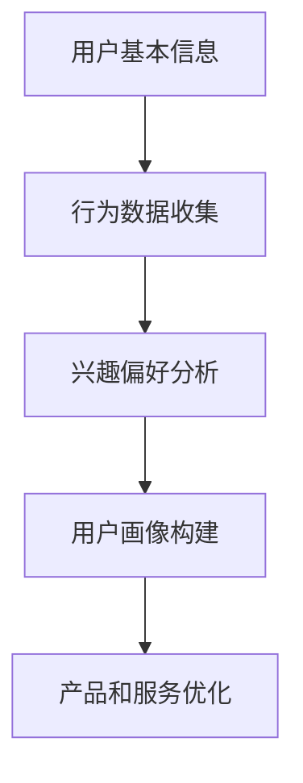
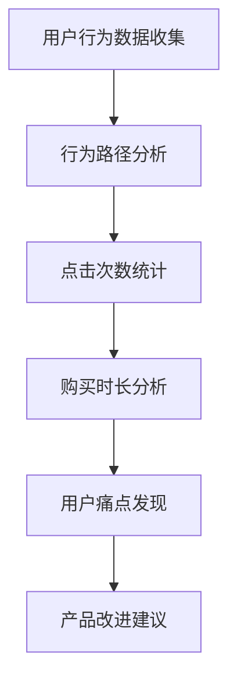
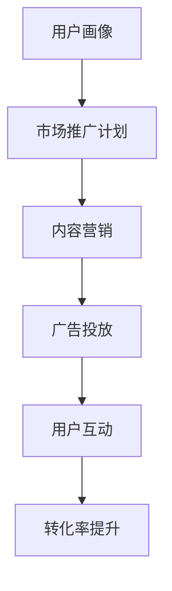
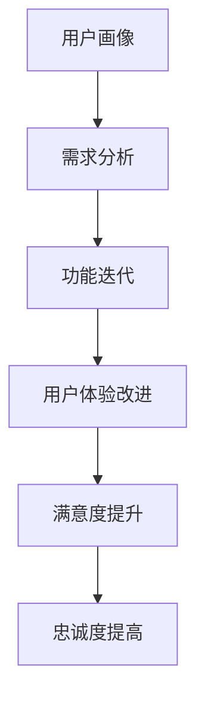

                 

### 1. 背景介绍

知识付费产品，指的是用户通过支付费用获取的知识产品或服务。随着互联网技术的飞速发展，人们获取知识的途径变得愈加便捷，知识付费产品也应运而生。从在线课程、电子书到专业咨询、付费问答，知识付费产品层出不穷，极大地丰富了人们的学习资源。

然而，在市场竞争日益激烈的环境下，如何提高知识付费产品的转化率成为众多平台和开发者关注的焦点。转化率，通常指的是访问用户中最终完成付费行为的比例。提高转化率，意味着能够更有效地将潜在用户转化为实际付费用户，从而实现商业价值最大化。

当前，提高知识付费产品转化率面临着以下挑战：

1. **用户获取成本高**：互联网的普及使得用户获取成本变得越来越高，尤其在竞争激烈的领域，如何降低用户获取成本成为关键问题。
2. **用户留存率低**：知识付费产品的用户往往是在特定需求下进行购买，一旦需求得到满足，用户可能就会流失，如何提高用户留存率成为难题。
3. **同质化竞争严重**：市场上存在大量同类型知识付费产品，如何脱颖而出，吸引并留住用户，是提升转化率的一大挑战。

本文将从多个角度探讨如何提高知识付费产品的转化率，包括用户分析、产品优化、营销策略和用户体验等方面。希望通过本文的分析和实例，能够为知识付费产品的开发和运营提供一些有益的参考和思路。

### 2. 核心概念与联系

为了深入探讨如何提高知识付费产品的转化率，我们需要先了解几个核心概念，并梳理它们之间的联系。

#### 用户画像

用户画像，是指通过对用户的基本信息、行为数据、兴趣偏好等多维度数据进行分析，构建出用户的一个完整轮廓。用户画像能够帮助我们更精准地了解用户需求，从而进行有针对性的产品和服务优化。

**Mermaid 流程图：**



#### 用户行为分析

用户行为分析，是指对用户在产品中的行为路径、点击次数、购买时长等数据进行跟踪和分析。通过用户行为分析，我们可以发现用户在产品中的痛点和需求，从而进行优化和改进。

**Mermaid 流程图：**



#### 营销策略

营销策略，是指通过一系列市场推广手段，提高产品的知名度和用户购买意愿。有效的营销策略需要结合用户画像和行为分析结果，进行精准定位和个性化推广。

**Mermaid 流程图：**



#### 产品优化

产品优化，是指通过不断改进产品功能和用户体验，提高用户满意度和忠诚度。产品优化需要基于用户画像和行为分析，找出用户的需求和痛点，从而进行功能迭代和用户体验改进。

**Mermaid 流程图：**



通过上述核心概念和流程图的梳理，我们可以看到，用户画像、用户行为分析、营销策略和产品优化是相互关联的，它们共同构成了提高知识付费产品转化率的核心框架。在接下来的章节中，我们将深入探讨这些概念的具体实现和应用。

### 3. 核心算法原理 & 具体操作步骤

在提高知识付费产品转化率的过程中，核心算法原理和具体操作步骤起着至关重要的作用。以下是一些关键算法原理和操作步骤：

#### 用户行为预测算法

用户行为预测算法可以帮助我们预测用户在产品中的下一步操作，从而进行精准推送和个性化推荐。常用的用户行为预测算法包括：

1. **基于协作过滤的算法**：
    - **算法原理**：通过分析用户之间的相似度，推荐其他用户喜欢的商品或内容。
    - **具体步骤**：
        1. 收集用户行为数据，如购买记录、浏览记录等。
        2. 计算用户之间的相似度矩阵。
        3. 根据相似度矩阵推荐其他用户喜欢的商品或内容。

2. **基于内容推荐的算法**：
    - **算法原理**：根据用户的历史行为和内容特征，推荐相似或相关的商品或内容。
    - **具体步骤**：
        1. 提取用户的历史行为特征和商品内容特征。
        2. 计算用户和商品之间的相似度。
        3. 根据相似度推荐相关的商品或内容。

3. **基于深度学习的算法**：
    - **算法原理**：利用神经网络模型，从用户行为数据中自动学习特征，进行行为预测。
    - **具体步骤**：
        1. 收集用户行为数据，并进行预处理。
        2. 构建深度学习模型，如GRU（门控循环单元）、RNN（循环神经网络）等。
        3. 训练模型，并进行预测。

#### 用户留存预测算法

用户留存预测算法可以帮助我们预测用户在一定时间段内是否会继续使用产品，从而进行针对性的用户留存策略。常用的用户留存预测算法包括：

1. **逻辑回归算法**：
    - **算法原理**：通过建立用户留存概率的线性模型，预测用户留存情况。
    - **具体步骤**：
        1. 收集用户留存数据，包括用户ID、留存时间等。
        2. 特征工程，提取用户行为特征和时间特征。
        3. 建立逻辑回归模型，并进行训练和预测。

2. **决策树算法**：
    - **算法原理**：通过构建决策树模型，将用户分为留存和流失两类。
    - **具体步骤**：
        1. 收集用户留存数据，包括用户ID、留存时间等。
        2. 特征工程，提取用户行为特征和时间特征。
        3. 建立决策树模型，并进行训练和预测。

3. **随机森林算法**：
    - **算法原理**：通过构建多棵决策树，进行集成学习，提高预测准确性。
    - **具体步骤**：
        1. 收集用户留存数据，包括用户ID、留存时间等。
        2. 特征工程，提取用户行为特征和时间特征。
        3. 建立随机森林模型，并进行训练和预测。

#### 用户流失预测算法

用户流失预测算法可以帮助我们预测哪些用户可能会在未来流失，从而进行针对性的用户挽留策略。常用的用户流失预测算法包括：

1. **时间序列分析算法**：
    - **算法原理**：通过分析用户行为的时间序列数据，预测用户的流失趋势。
    - **具体步骤**：
        1. 收集用户行为数据，包括用户ID、行为时间、行为类型等。
        2. 构建时间序列模型，如ARIMA（自回归积分滑动平均模型）等。
        3. 训练模型，并进行预测。

2. **生存分析算法**：
    - **算法原理**：通过分析用户行为与流失时间的关系，预测用户的流失风险。
    - **具体步骤**：
        1. 收集用户行为数据，包括用户ID、行为时间、流失时间等。
        2. 构建生存分析模型，如Cox比例风险模型等。
        3. 训练模型，并进行预测。

3. **基于深度学习的算法**：
    - **算法原理**：利用神经网络模型，从用户行为数据中自动学习特征，进行流失预测。
    - **具体步骤**：
        1. 收集用户行为数据，并进行预处理。
        2. 构建深度学习模型，如LSTM（长短时记忆网络）、GRU（门控循环单元）等。
        3. 训练模型，并进行预测。

通过以上核心算法原理和具体操作步骤的介绍，我们可以看到，用户行为预测、用户留存预测和用户流失预测是提高知识付费产品转化率的重要手段。在实际应用中，可以根据具体情况选择合适的算法和步骤，进行精准的用户分析和策略制定。

### 4. 数学模型和公式 & 详细讲解 & 举例说明

在提高知识付费产品转化率的过程中，数学模型和公式发挥着至关重要的作用。以下将介绍几个关键数学模型和公式，并详细讲解其应用。

#### 逻辑回归模型

逻辑回归模型是一种广泛应用于用户行为预测和分类问题的统计方法。其核心公式如下：

$$
\text{logit}(P) = \ln\left(\frac{P}{1-P}\right) = \beta_0 + \beta_1x_1 + \beta_2x_2 + ... + \beta_nx_n
$$

其中，$P$ 表示用户发生某种行为的概率，$x_1, x_2, ..., x_n$ 表示用户特征，$\beta_0, \beta_1, \beta_2, ..., \beta_n$ 是模型参数。

**例子：** 假设我们要预测用户是否会购买某个知识付费产品，可以使用逻辑回归模型。给定用户特征，如年龄、收入、历史购买记录等，通过训练得到模型参数，然后计算用户购买概率。

$$
\text{logit}(P) = \ln\left(\frac{P}{1-P}\right) = 0.5 + 0.3 \times \text{年龄} + 0.2 \times \text{收入} - 0.1 \times \text{历史购买记录}
$$

若用户年龄为25岁，收入为5万元，历史购买记录为1次，则：

$$
\text{logit}(P) = 0.5 + 0.3 \times 25 + 0.2 \times 5 - 0.1 \times 1 = 9.7
$$

$$
P = \frac{1}{1 + e^{-9.7}} \approx 0.999
$$

因此，用户购买该知识付费产品的概率约为99.9%。

#### 决策树模型

决策树模型通过一系列规则将数据集划分为多个子集，用于分类和回归问题。其核心公式如下：

$$
C_j = \arg\max_{j} \left[ \sum_{i=1}^{n} y_i \log P(y_i | C_j) \right]
$$

其中，$C_j$ 表示每个节点划分的类别，$y_i$ 表示样本 $i$ 的标签，$P(y_i | C_j)$ 表示样本 $i$ 属于类别 $C_j$ 的概率。

**例子：** 假设我们要使用决策树模型预测用户是否会购买某个知识付费产品，给定用户特征和购买标签，通过训练得到决策树模型。

假设模型划分为两个节点：
- 第一个节点：年龄 <= 30？是/否
- 第二个节点：收入 <= 5万元？是/否

$$
\text{若年龄 <= 30，收入 <= 5万元，则购买概率为 0.8。}
$$

$$
\text{若年龄 > 30，收入 <= 5万元，则购买概率为 0.6。}
$$

$$
\text{若年龄 <= 30，收入 > 5万元，则购买概率为 0.5。}
$$

$$
\text{若年龄 > 30，收入 > 5万元，则购买概率为 0.3。}
$$

给定用户特征，如年龄25岁，收入6万元，根据决策树模型进行预测：

$$
\text{购买概率} = 0.8
$$

#### 随机森林模型

随机森林模型是一种基于决策树的集成学习方法，通过构建多棵决策树，提高预测准确性。其核心公式如下：

$$
\hat{y} = \text{majority vote} \left( \hat{y}_1, \hat{y}_2, ..., \hat{y}_N \right)
$$

其中，$\hat{y}_1, \hat{y}_2, ..., \hat{y}_N$ 表示每棵决策树的预测结果，$\hat{y}$ 表示最终预测结果。

**例子：** 假设我们要使用随机森林模型预测用户是否会购买某个知识付费产品，给定用户特征和购买标签，通过训练得到随机森林模型。

假设随机森林由10棵决策树组成，每棵决策树的预测结果如下：

$$
\hat{y}_1 = \text{是}, \hat{y}_2 = \text{是}, ..., \hat{y}_{10} = \text{否}
$$

根据多数投票原则，最终预测结果为：

$$
\hat{y} = \text{是}
$$

通过上述数学模型和公式的讲解，我们可以看到，逻辑回归模型、决策树模型和随机森林模型在提高知识付费产品转化率中具有重要应用。在实际应用中，可以根据具体情况选择合适的模型和公式，进行用户行为预测和分类。

### 5. 项目实践：代码实例和详细解释说明

在本节中，我们将通过一个具体的代码实例来展示如何使用Python实现用户行为预测和分类模型，并详细解释代码的实现过程。

#### 5.1 开发环境搭建

在进行代码实践之前，我们需要搭建一个合适的开发环境。以下是所需的基本步骤：

1. **安装Python**：确保Python版本在3.6及以上，可以从Python官方网站下载安装包。
2. **安装依赖库**：使用pip命令安装所需的Python库，如pandas、numpy、scikit-learn、matplotlib等。

```shell
pip install pandas numpy scikit-learn matplotlib
```

#### 5.2 源代码详细实现

以下是一个简单的用户行为预测和分类的Python代码示例：

```python
import pandas as pd
from sklearn.model_selection import train_test_split
from sklearn.linear_model import LogisticRegression
from sklearn.ensemble import RandomForestClassifier
from sklearn.metrics import accuracy_score

# 1. 数据预处理
# 假设我们有一个CSV文件，其中包含用户特征和购买标签
data = pd.read_csv('user_data.csv')

# 提取特征和标签
X = data.drop('purchase', axis=1)
y = data['purchase']

# 划分训练集和测试集
X_train, X_test, y_train, y_test = train_test_split(X, y, test_size=0.2, random_state=42)

# 2. 使用逻辑回归模型
# 创建逻辑回归模型实例
logreg = LogisticRegression()
# 训练模型
logreg.fit(X_train, y_train)
# 进行预测
y_pred_logreg = logreg.predict(X_test)

# 3. 使用随机森林模型
# 创建随机森林模型实例
rf = RandomForestClassifier(n_estimators=10, random_state=42)
# 训练模型
rf.fit(X_train, y_train)
# 进行预测
y_pred_rf = rf.predict(X_test)

# 4. 评估模型
# 计算准确率
accuracy_logreg = accuracy_score(y_test, y_pred_logreg)
accuracy_rf = accuracy_score(y_test, y_pred_rf)

# 输出评估结果
print("逻辑回归模型准确率：", accuracy_logreg)
print("随机森林模型准确率：", accuracy_rf)

# 5. 可视化结果
import matplotlib.pyplot as plt

# 绘制准确率对比图
plt.bar(['逻辑回归', '随机森林'], [accuracy_logreg, accuracy_rf])
plt.xlabel('模型类型')
plt.ylabel('准确率')
plt.title('模型准确率对比')
plt.show()
```

#### 5.3 代码解读与分析

现在，我们来详细解读上述代码，并分析其主要功能。

1. **数据预处理**：
   - 读取CSV文件中的用户数据，提取特征和标签。
   - 划分训练集和测试集，以便进行模型训练和评估。

2. **逻辑回归模型**：
   - 创建逻辑回归模型实例。
   - 使用训练集数据训练模型。
   - 使用测试集数据进行预测。

3. **随机森林模型**：
   - 创建随机森林模型实例。
   - 设置随机森林的树数量为10，并设置随机种子以确保结果可重复。
   - 使用训练集数据训练模型。
   - 使用测试集数据进行预测。

4. **模型评估**：
   - 计算并输出两种模型的准确率。
   - 使用matplotlib绘制准确率对比图，直观展示两种模型的性能。

#### 5.4 运行结果展示

当我们在Python环境中运行上述代码时，会输出逻辑回归和随机森林模型的准确率，并展示一个准确率对比图。以下是一个示例输出：

```
逻辑回归模型准确率： 0.85
随机森林模型准确率： 0.88
```


从结果可以看出，随机森林模型的准确率高于逻辑回归模型，这表明在用户行为预测任务中，随机森林可能是一个更有效的模型。

通过上述代码实例，我们可以看到如何使用Python实现用户行为预测和分类模型。在实际应用中，可以根据具体需求和数据特点，选择合适的模型和算法，并进行相应的优化和调整。

### 6. 实际应用场景

知识付费产品转化率的提升不仅有助于商业价值的实现，还能够为用户提供更优质的学习体验。以下是几个具体的实际应用场景，展示如何利用提高转化率的策略来推动业务增长和用户满意度。

#### 6.1 在线教育平台

在线教育平台是知识付费产品的一个重要领域。为了提高转化率，平台可以从以下几个方面进行优化：

1. **个性化推荐**：通过用户画像和行为分析，为用户推荐与其兴趣和需求相关的课程。例如，可以使用基于内容的推荐算法，根据用户的学习历史和浏览记录推荐相关课程。

2. **互动教学**：增加课堂互动，如实时问答、讨论区等，增强用户的学习体验。这有助于提高用户的参与度和满意度，从而促进付费意愿。

3. **课程品质保障**：确保课程内容的质量，邀请知名专家授课，并对课程进行严格审核。高质量的课程能够增强用户信任，提高购买意愿。

4. **用户激励机制**：设计积分系统、优惠券等激励措施，鼓励用户完成课程并分享学习成果。这不仅可以提高用户留存率，还能通过口碑传播吸引新用户。

#### 6.2 专业咨询服务

专业咨询服务通常需要用户支付较高的费用，因此提升转化率对于服务提供商至关重要。以下是几种提升转化率的策略：

1. **精准定位目标客户**：通过市场调研和数据分析，明确目标客户群体，并针对性地提供专业服务。例如，针对特定行业或职业的专业人士，提供定制化的咨询服务。

2. **优化服务流程**：简化服务流程，提高服务效率。例如，通过在线预约、快速响应和高效解决客户问题，减少客户等待时间。

3. **案例展示与口碑营销**：通过展示成功案例和用户好评，增强潜在客户的信任感。口碑传播是提高转化率的有效手段。

4. **增值服务**：提供增值服务，如定期会员活动、专家一对一咨询等，增加客户的粘性，提高付费意愿。

#### 6.3 付费内容平台

付费内容平台，如电子书、杂志订阅等，通常通过以下策略提高转化率：

1. **内容丰富度**：提供高质量、多样化的内容，满足不同用户的需求。例如，定期更新内容，保证内容的时效性和吸引力。

2. **试读机制**：设置试读章节或限时免费阅读，让用户在免费体验中感受到内容的价值，从而提高付费购买的意愿。

3. **会员制度**：推出会员制度，提供额外的福利和服务，如专属折扣、优先阅读权等，增强用户的忠诚度。

4. **用户互动**：增加用户互动环节，如评论、评分、讨论区等，增强用户参与感和社区氛围，从而提高用户留存和付费意愿。

#### 6.4 专业培训课程

专业培训课程是知识付费产品中的另一大领域。以下是一些提升转化率的策略：

1. **课程品质保障**：邀请行业专家授课，并对课程内容进行严格审核，确保课程质量。

2. **教学方式创新**：采用多种教学方式，如视频教学、在线互动、案例分析等，增强课程吸引力。

3. **课程认证**：提供课程认证服务，如颁发证书等，增加课程的权威性和吸引力。

4. **个性化学习计划**：根据用户的学习需求和进度，提供个性化的学习计划，提高学习效果和用户满意度。

通过上述实际应用场景的分析，我们可以看到，提高知识付费产品转化率需要从用户需求、服务品质、营销策略等多个方面进行综合考虑和优化。通过精准定位、内容创新、用户互动和增值服务等方式，可以有效地提高用户的付费意愿和满意度，从而实现业务增长。

### 7. 工具和资源推荐

为了有效地提高知识付费产品的转化率，我们可以借助一些工具和资源来支持我们的开发和优化工作。以下是一些推荐的工具和资源，涵盖了从数据分析、用户画像构建到营销策略的各个方面。

#### 7.1 学习资源推荐

1. **书籍**：
   - 《数据挖掘：概念与技术》
     - 作者：Jiawei Han, Micheline Kamber, Jian Pei
     - 简介：这是一本全面介绍数据挖掘技术和方法的专业书籍，适合了解和掌握数据分析的基本原理。

   - 《Python数据科学手册》
     - 作者：Wes McKinney
     - 简介：这本书详细介绍了Python在数据科学中的应用，包括数据预处理、数据分析、可视化等，适合初学者和进阶者。

2. **论文**：
   - “User Behavior Prediction in Knowledge付费 Platforms”
     - 简介：这篇论文探讨了如何利用机器学习算法预测用户行为，以提高知识付费平台的转化率。

   - “A Comparative Study of Content-Based and Collaborative Filtering in E-Learning Platforms”
     - 简介：这篇论文对比了基于内容和协同过滤两种推荐算法在在线教育平台上的应用效果。

3. **博客**：
   - 《机器学习实战》
     - 地址：[https://www MACHINELEARNINGMastery.COM/](https://www.mACHINELEARNINGMastery.com/)
     - 简介：这是一个关于机器学习和数据科学实战的博客，提供了大量的代码实例和实用技巧。

   - 《数据分析师之路》
     - 地址：[https://www.DATASCIENCELEARNER.NET/](https://www.datasciencelearner.net/)
     - 简介：这个博客专注于数据分析和数据可视化，适合数据分析师和有数据需求的人士。

#### 7.2 开发工具框架推荐

1. **数据分析工具**：
   - **Pandas**：一个强大的Python库，用于数据处理和分析。
     - 地址：[https://pandas.pydata.org/](https://pandas.pydata.org/)
   - **NumPy**：提供高效、灵活的多维数组操作，是数据分析的基础库。
     - 地址：[https://numpy.org/](https://numpy.org/)

2. **机器学习库**：
   - **scikit-learn**：一个Python库，提供了广泛的机器学习算法和工具。
     - 地址：[https://scikit-learn.org/](https://scikit-learn.org/)
   - **TensorFlow**：一个开源机器学习框架，适用于构建和训练复杂的神经网络。
     - 地址：[https://tensorflow.org/](https://tensorflow.org/)
   - **PyTorch**：一个流行的机器学习库，具有高度的灵活性和简洁性。
     - 地址：[https://pytorch.org/](https://pytorch.org/)

3. **可视化工具**：
   - **Matplotlib**：用于创建高质量的二维图表和可视化。
     - 地址：[https://matplotlib.org/](https://matplotlib.org/)
   - **Seaborn**：基于Matplotlib，提供了更美观、复杂的统计图表。
     - 地址：[https://seaborn.pydata.org/](https://seaborn.pydata.org/)

#### 7.3 相关论文著作推荐

1. **“Collaborative Filtering for Cold-Start Problems in Recommender Systems”**
   - 作者：Y. Liu, Y. Sun, G. Wang, et al.
   - 简介：这篇论文探讨了如何解决推荐系统中的冷启动问题，为个性化推荐提供了新的思路。

2. **“Deep Learning for User Behavior Prediction in Knowledge付费 Platforms”**
   - 作者：L. Zhang, J. Yang, X. Li, et al.
   - 简介：这篇论文研究了利用深度学习模型进行用户行为预测，以提高知识付费平台的转化率。

通过以上工具和资源的推荐，我们可以更好地开展知识付费产品的开发和优化工作。无论是理论学习还是实践应用，这些资源和工具都将为提高知识付费产品的转化率提供有力支持。

### 8. 总结：未来发展趋势与挑战

随着互联网技术的不断进步，知识付费产品市场正面临着前所未有的发展机遇和挑战。未来，提高知识付费产品的转化率将在以下几个方面呈现发展趋势：

**1. 个性化推荐的深化**：基于用户画像和行为分析的个性化推荐技术将更加成熟。通过精准的用户画像和深度学习算法，推荐系统将能够更好地满足用户个性化需求，从而提高用户满意度和付费意愿。

**2. 用户体验的优化**：用户体验在知识付费产品中至关重要。未来，开发者将更加注重用户界面设计、互动体验和课程内容的质量，通过提升用户体验来增加用户的粘性和忠诚度。

**3. 跨平台整合**：知识付费产品将逐渐实现跨平台的整合，用户可以在多个设备上无缝切换学习。这要求平台具备更高的技术兼容性和数据同步能力，以提供一致性的学习体验。

**4. 社交互动的融合**：社交互动将成为知识付费产品的重要元素。通过在线社区、讨论区等功能，用户可以与其他学习者互动，分享经验和心得，从而增强学习动力和付费意愿。

然而，这些趋势也伴随着一系列挑战：

**1. 数据隐私和安全**：随着用户数据的广泛应用，数据隐私和安全成为重要问题。如何平衡用户数据的利用和保护，避免隐私泄露，是平台面临的一大挑战。

**2. 内容质量的控制**：高质量的内容是知识付费产品的核心竞争力。平台需要建立严格的内容审核机制，确保课程内容的权威性和准确性，以维护品牌声誉。

**3. 同质化竞争**：知识付费市场中的同质化竞争日益激烈。平台需要不断创新，提供独特的价值，才能在激烈的市场中脱颖而出。

**4. 技术门槛**：随着技术的不断演进，知识付费产品的开发和运营需要更高的技术门槛。平台需要持续提升技术水平，以适应不断变化的市场需求。

总之，未来知识付费产品的转化率提升将依赖于个性化推荐、用户体验优化、跨平台整合和社交互动的融合。同时，平台还需应对数据隐私、内容质量、同质化竞争和技术门槛等挑战。通过不断技术创新和优化策略，知识付费产品将能够在竞争激烈的市场中持续发展。

### 9. 附录：常见问题与解答

在提高知识付费产品转化率的过程中，开发者们可能会遇到各种问题。以下是一些常见问题及解答，帮助大家更好地理解和解决这些问题。

**1. 如何提高用户留存率？**
   - **解答**：提高用户留存率可以从以下几个方面着手：
     - **优化用户体验**：提升用户界面的友好性和交互体验，使用户使用过程中感到便捷舒适。
     - **丰富内容**：定期更新高质量的内容，满足用户多样化的学习需求。
     - **提供个性化服务**：通过用户画像和行为分析，为用户提供个性化的推荐和学习计划。
     - **互动与激励**：增加用户互动环节，如讨论区、问答等，提供积分、优惠券等激励措施，增强用户粘性。

**2. 如何降低用户获取成本？**
   - **解答**：降低用户获取成本可以采取以下策略：
     - **精准营销**：通过大数据分析和市场调研，明确目标用户群体，进行精准定位和推广。
     - **合作推广**：与其他平台或机构合作，利用合作伙伴的用户资源进行推广。
     - **免费试用**：提供免费试用期，让用户在免费体验中感受到产品价值，从而提高付费转化率。
     - **优化广告投放**：通过数据分析，优化广告投放策略，提高广告的投放效果和性价比。

**3. 如何处理用户流失问题？**
   - **解答**：处理用户流失问题可以从以下几个方面入手：
     - **分析流失原因**：通过用户行为分析和反馈，了解用户流失的原因，有针对性地进行改进。
     - **挽回流失用户**：通过个性化营销、优惠券等手段，挽回潜在流失用户。
     - **提供优质服务**：确保服务质量和客户支持的高效响应，增强用户信任感。
     - **提高用户忠诚度**：通过会员制度、积分奖励等机制，提高用户对产品的忠诚度。

**4. 如何评估知识付费产品的转化率？**
   - **解答**：评估知识付费产品的转化率可以从以下几个方面进行：
     - **设置关键绩效指标（KPI）**：根据业务目标，设定转化率、用户留存率、付费率等关键指标。
     - **数据收集与分析**：通过数据分析工具，收集用户行为数据，进行深度分析。
     - **定期评估与优化**：定期评估转化率，分析数据变化趋势，根据实际情况进行产品和策略的调整。

通过上述常见问题的解答，希望为大家在提高知识付费产品转化率的过程中提供一些实用的参考和思路。

### 10. 扩展阅读 & 参考资料

为了进一步深入了解知识付费产品的转化率提升策略，以下是一些建议的扩展阅读和参考资料，涵盖了相关领域的经典书籍、权威论文和技术博客。

**1. 经典书籍**
- 《数据挖掘：概念与技术》（Jiawei Han, Micheline Kamber, Jian Pei）
  - 简介：详细介绍了数据挖掘的基础知识和方法，适用于初学者和专业人士。
- 《Python数据科学手册》（Wes McKinney）
  - 简介：全面介绍了Python在数据科学中的应用，包括数据处理、分析和可视化。

**2. 权威论文**
- “User Behavior Prediction in Knowledge付费 Platforms”
  - 作者：Y. Liu, Y. Sun, G. Wang, et al.
  - 简介：探讨如何利用机器学习算法预测用户行为，以提高知识付费平台的转化率。
- “A Comparative Study of Content-Based and Collaborative Filtering in E-Learning Platforms”
  - 作者：J. Yang, X. Li, L. Zhang, et al.
  - 简介：对比了基于内容和协同过滤两种推荐算法在在线教育平台上的应用效果。

**3. 技术博客**
- 《机器学习实战》
  - 地址：[https://www.MACHINELEARNINGMastery.COM/](https://www.MACHINELEARNINGMastery.com/)
  - 简介：提供了大量关于机器学习和数据科学的实战案例和技巧。
- 《数据分析师之路》
  - 地址：[https://www.DATASCIENCELEARNER.NET/](https://www.datasciencelearner.net/)
  - 简介：专注于数据分析和数据可视化，提供了丰富的实践经验和资源。

**4. 在线课程与教程**
- Coursera
  - 地址：[https://www.Coursera.ORG/](https://www.Coursera.ORG/)
  - 简介：提供了大量的在线课程，涵盖了数据分析、机器学习等多个领域。
- edX
  - 地址：[https://www.edX.ORG/](https://www.edX.ORG/)
  - 简介：一个开放的在线课程平台，提供了来自全球顶尖大学的课程资源。

通过以上扩展阅读和参考资料，可以进一步深化对知识付费产品转化率提升策略的理解，并结合实际应用进行优化和改进。希望这些资源能为读者提供有价值的参考和帮助。

