                 

### 1. 背景介绍

在当今科技迅猛发展的时代，创业项目的兴起如雨后春笋，吸引了大量投资者的关注。然而，并非所有创业项目都能成功，很多项目在初始阶段就已经因为可行性评估不充分而失败。因此，进行有效的创业项目可行性评估，成为了决定项目能否顺利推进和成功的关键步骤。

#### 创业项目的意义

创业项目不仅为创业者提供了实现自我价值的平台，更是推动科技进步、经济繁荣和社会发展的动力。成功的创业项目往往能够带来巨大的社会效益和经济效益。例如，苹果公司的iPhone不仅改变了人们的通讯方式，还推动了整个智能手机产业的发展。因此，了解和掌握创业项目可行性评估的方法和技巧，对于创业者、投资者和学术研究都有重要的现实意义。

#### 创业项目可行性评估的重要性

创业项目可行性评估是指在项目启动前，对项目是否能够成功实施和实现预期目标进行全面的考察和分析。其主要作用有以下几点：

1. **风险控制**：通过评估，可以提前发现项目潜在的风险，并制定相应的应对策略，降低项目失败的概率。
2. **资源优化**：有效的评估可以帮助项目团队明确项目所需资源，合理分配人力、物力和财力，提高资源利用效率。
3. **投资决策**：对于投资者来说，可行性评估是决定是否投资的关键依据。只有通过评估确认项目具有可行性，才能进行投资。
4. **项目推进**：明确的可行性评估结果有助于项目团队制定切实可行的项目计划，推动项目顺利实施。

#### 当前创业项目评估的现状

目前，创业项目评估的方法和技术已相对成熟，但仍然存在一些问题和挑战：

1. **评估方法的多样性**：虽然有多种评估方法，如财务评估、市场评估、技术评估等，但每种方法都有其局限性，如何综合运用不同方法进行评估仍需深入研究。
2. **评估指标的模糊性**：很多评估指标难以量化，如市场前景、团队实力等，如何准确评估这些指标仍是一个难题。
3. **评估过程的复杂性**：创业项目评估涉及多个方面，如市场需求、技术可行性、财务状况等，如何高效、全面地进行评估需要解决的问题。

#### 文章结构安排

本文将从以下几个方面展开讨论：

1. **核心概念与联系**：介绍创业项目可行性评估的核心概念和相互关系，并给出相应的流程图。
2. **核心算法原理 & 具体操作步骤**：详细阐述创业项目评估的核心算法原理，包括财务评估、市场评估、技术评估等，并提供具体的操作步骤。
3. **数学模型和公式 & 详细讲解 & 举例说明**：介绍创业项目评估的数学模型和公式，并进行详细讲解和举例说明。
4. **项目实践：代码实例和详细解释说明**：通过实际代码实例，展示创业项目评估的具体实现过程，并进行详细解释和分析。
5. **实际应用场景**：分析创业项目评估在不同领域的应用场景，以及面临的挑战和解决方案。
6. **工具和资源推荐**：推荐相关的学习资源、开发工具和框架，帮助读者更好地进行创业项目评估。
7. **总结：未来发展趋势与挑战**：总结创业项目评估的现状和未来发展趋势，探讨面临的挑战和解决策略。

通过以上内容的逐步分析，我们将对创业项目可行性评估有一个全面而深入的了解。接下来，我们将详细介绍创业项目可行性评估的核心概念和相互关系。

### 2. 核心概念与联系

在创业项目可行性评估中，核心概念和相互关系至关重要。为了更好地理解这些概念，我们可以借助 Mermaid 流程图来梳理它们之间的关系。以下是一个简要的 Mermaid 流程图，描述了创业项目可行性评估的核心概念和流程：

```mermaid
graph TD
    A[项目定义] --> B[市场调研]
    A --> C[技术评估]
    A --> D[财务评估]
    B --> E[市场需求分析]
    B --> F[竞争分析]
    C --> G[技术可行性分析]
    C --> H[技术风险分析]
    D --> I[成本分析]
    D --> J[收益预测]
    E --> K[目标市场]
    E --> L[市场容量]
    F --> M[竞争对手分析]
    F --> N[市场份额预测]
    G --> O[技术实现方案]
    G --> P[技术实施风险]
    H --> Q[技术风险评估]
    I --> R[成本控制策略]
    I --> S[预算编制]
    J --> T[收益模型]
    J --> U[收益风险分析]
    K --> V[目标客户分析]
    K --> W[目标市场策略]
    L --> X[市场增长预测]
    M --> Y[市场定位]
    M --> Z[市场竞争策略]
    O --> AA[技术实现评估]
    O --> AB[技术实现风险]
    P --> AC[技术实施风险评估]
    Q --> AD[技术风险应对策略]
    R --> AE[成本控制评估]
    R --> AF[成本控制策略调整]
    S --> AG[预算评估]
    S --> AH[预算调整]
    T --> AI[收益预测评估]
    T --> AJ[收益预测策略调整]
    U --> AK[收益风险应对策略]
    V --> AL[目标客户需求分析]
    V --> AM[目标市场策略评估]
    W --> AN[目标市场策略调整]
    X --> AO[市场增长评估]
    X --> AP[市场增长策略调整]
    Y --> AQ[市场定位评估]
    Y --> AR[市场定位策略调整]
    Z --> AS[市场竞争策略评估]
    Z --> AT[市场竞争策略调整]
    AA --> BA[技术实现结果]
    AB --> BB[技术实现调整]
    AC --> BC[技术实施结果]
    AD --> BD[技术风险应对效果]
    AE --> BE[成本控制结果]
    AF --> BF[成本控制调整]
    AG --> BG[预算结果]
    AH --> BH[预算调整结果]
    AI --> BI[收益预测结果]
    AJ --> BJ[收益预测调整]
    AK --> BK[收益风险应对结果]
    AL --> BL[目标客户需求满足情况]
    AM --> BM[目标市场策略实施效果]
    AN --> AN[目标市场策略调整结果]
    AP --> BP[市场增长策略实施效果]
    AQ --> AQ[市场定位策略实施效果]
    AR --> AR[市场定位策略调整结果]
    AS --> AS[市场竞争策略实施效果]
    AT --> AT[市场竞争策略调整结果]
    BA --> CA[技术实现最终结果]
    BB --> CB[技术实现最终调整]
    BC --> CC[技术实施最终结果]
    BD --> CD[技术风险应对最终效果]
    BE --> CE[成本控制最终结果]
    BF --> CF[成本控制最终调整]
    BG --> CG[预算最终结果]
    BH --> CH[预算最终调整结果]
    BI --> CI[收益预测最终结果]
    BJ --> CJ[收益预测最终调整]
    BK --> CK[收益风险应对最终结果]
    BL --> CL[目标客户需求最终满足情况]
    BM --> CM[目标市场策略最终实施效果]
    BN --> BN[目标市场策略最终调整结果]
    BP --> BP[市场增长策略最终实施效果]
    AQ --> AQ[市场定位策略最终实施效果]
    AR --> AR[市场定位策略最终调整结果]
    AS --> AS[市场竞争策略最终实施效果]
    AT --> AT[市场竞争策略最终调整结果]
    CA --> DA[项目评估报告]
    CB --> DB[项目调整建议]
    CC --> DC[项目实施结果]
    CD --> DD[项目风险应对措施]
    CE --> DE[项目成本控制结果]
    CF --> DF[项目成本调整建议]
    CG --> DG[项目预算结果]
    CH --> DH[项目预算调整建议]
    CI --> DI[项目收益预测结果]
    CJ --> DJ[项目收益预测调整建议]
    CK --> DK[项目收益风险应对结果]
    CL --> DL[项目目标客户需求满足情况]
    CM --> DM[项目目标市场策略实施结果]
    CN --> DN[项目目标市场策略调整结果]
    CP --> DP[项目市场增长策略实施结果]
    CQ --> DQ[项目市场定位策略实施结果]
    CR --> DR[项目市场定位策略调整结果]
    CS --> DS[项目市场竞争策略实施结果]
    CT --> DT[项目市场竞争策略调整结果]
```



#### 2.1 核心概念解释

以下是上述流程图中涉及的核心概念及其解释：

1. **项目定义**：明确项目的目标和范围，包括项目的目标、预期成果、时间范围和资源需求。
2. **市场调研**：收集和分析市场数据，了解市场需求、目标客户和竞争情况。
3. **市场需求分析**：分析目标市场的规模、增长趋势、竞争对手和市场份额，确定项目的市场需求。
4. **竞争分析**：分析竞争对手的产品、市场份额、优势和劣势，为项目的市场定位提供依据。
5. **技术评估**：评估项目所需技术的可行性、技术风险和技术实现方案。
6. **技术可行性分析**：确定项目所需技术的实现可能性，包括技术成熟度、技术复杂度和实施风险。
7. **技术风险分析**：识别和分析项目在技术实现过程中可能面临的风险。
8. **财务评估**：评估项目的财务可行性，包括成本、收益和资金筹措。
9. **成本分析**：计算项目实施过程中的各项成本，包括直接成本和间接成本。
10. **收益预测**：预测项目实施后的收益，包括收入和利润。
11. **收益模型**：建立项目的收益预测模型，包括收入预测公式和利润预测公式。
12. **收益风险分析**：识别和分析项目在收益实现过程中可能面临的风险。
13. **市场定位**：确定项目在市场中的定位，包括目标市场和目标客户。
14. **目标市场策略**：制定项目的市场进入策略和营销策略，以实现市场需求。
15. **目标客户分析**：分析目标客户的需求、偏好和购买行为，为市场定位和营销策略提供依据。

#### 2.2 Mermaid 流程图详细说明

以下是对 Mermaid 流程图的详细说明：

- **项目定义**是整个评估流程的起点，明确了项目的目标和范围。
- **市场调研**分为市场需求分析和竞争分析，前者关注市场需求，后者关注市场竞争情况。
- **技术评估**分为技术可行性分析和技术风险分析，前者关注技术实现可能性，后者关注技术实现过程中的风险。
- **财务评估**分为成本分析和收益预测，前者关注项目成本，后者关注项目收益。
- **市场定位**和**目标市场策略**共同构成了项目在市场中的定位和进入策略。
- **目标客户分析**作为市场调研的一部分，为市场定位和目标市场策略提供依据。

通过以上核心概念和流程的梳理，我们可以更清晰地理解创业项目可行性评估的整体框架。接下来，我们将详细阐述创业项目评估的核心算法原理，包括财务评估、市场评估、技术评估等。

### 3. 核心算法原理 & 具体操作步骤

在创业项目可行性评估中，核心算法原理起到了至关重要的作用。这些算法原理不仅帮助我们分析项目的各个方面，还能够为项目决策提供科学依据。下面，我们将详细介绍创业项目评估的核心算法原理，包括财务评估、市场评估、技术评估等，并提供具体的操作步骤。

#### 3.1 财务评估

财务评估是创业项目评估的重要组成部分，它主要关注项目的成本、收益和盈利能力。以下是一个典型的财务评估流程：

1. **成本分析**：
   - 收集项目实施过程中的各项成本数据，包括直接成本和间接成本。
   - 直接成本通常包括原材料、人工、设备等，间接成本则包括管理费用、销售费用等。
   - 使用成本-效益分析（Cost-Benefit Analysis）方法，计算项目的总成本。

2. **收益预测**：
   - 根据市场需求和销售预测，估算项目实施后的收入。
   - 使用收益模型（如线性回归模型、时间序列模型等），预测项目的未来收入。
   - 计算项目的净利润（净利润 = 收入 - 成本）。

3. **盈利能力分析**：
   - 使用财务指标（如投资回报率、净现值等），评估项目的盈利能力。
   - 投资回报率（ROI）= 净利润 / 投资额，用于衡量项目的投资效益。
   - 净现值（NPV）= 未来现金流的现值 - 初始投资，用于评估项目的投资价值。

4. **资金筹措**：
   - 分析项目所需的资金来源，包括自有资金、借款、股权融资等。
   - 使用资金筹措模型（如资本成本模型、债务-权益比例模型等），评估项目的融资策略。

#### 3.2 市场评估

市场评估旨在了解项目的市场环境、竞争情况和目标市场。以下是一个典型市场评估流程：

1. **市场需求分析**：
   - 调研目标市场的规模、增长趋势和市场份额。
   - 使用市场调查、专家访谈等方法，收集市场需求数据。
   - 建立市场需求预测模型，预测未来的市场需求。

2. **竞争分析**：
   - 分析竞争对手的产品、市场份额、优势和劣势。
   - 使用波特五力模型、SWOT分析等方法，评估竞争对手的市场地位。
   - 识别项目的竞争优势和劣势，为市场定位提供依据。

3. **目标市场定位**：
   - 确定项目的目标市场，包括目标客户、目标产品和目标价格。
   - 使用市场细分、目标市场选择和市场定位策略等方法，制定市场进入策略。

4. **营销策略评估**：
   - 制定项目的营销策略，包括广告、促销、渠道选择等。
   - 使用营销组合模型（如4P模型），评估营销策略的有效性。

#### 3.3 技术评估

技术评估关注项目的技术实现可能性、技术风险和技术实现方案。以下是一个典型技术评估流程：

1. **技术可行性分析**：
   - 分析项目所需的技术是否具备实现的可能性，包括技术成熟度、技术复杂度和实施风险。
   - 使用技术成熟度模型（如技术成熟度指标、技术评估矩阵等），评估技术的可行性。

2. **技术风险分析**：
   - 识别项目在技术实现过程中可能面临的风险，包括技术故障、技术更新、人才流失等。
   - 使用风险识别、风险分析和风险评估方法，评估技术风险。

3. **技术实现方案**：
   - 制定项目的技术实现方案，包括技术路径、技术标准和实施方案。
   - 使用技术实现模型（如技术路线图、技术方案设计等），评估技术实现方案。

4. **技术实施风险评估**：
   - 分析技术实施过程中可能面临的风险，包括技术实现风险、技术管理风险等。
   - 使用风险应对策略（如风险规避、风险减轻等），制定技术风险应对方案。

#### 3.4 具体操作步骤

以下是创业项目评估的具体操作步骤：

1. **明确项目目标和范围**：
   - 与项目团队和利益相关者沟通，明确项目的目标和范围。
   - 确定项目的关键成功因素和关键绩效指标。

2. **收集数据和信息**：
   - 收集项目相关的市场数据、技术数据、财务数据等。
   - 使用市场调研、专家访谈、问卷调查等方法，获取所需数据。

3. **分析数据和制定方案**：
   - 使用数据分析方法（如统计分析、数据挖掘等），分析收集到的数据。
   - 根据数据分析结果，制定项目的市场策略、技术方案和财务计划。

4. **评估和决策**：
   - 使用评估指标和方法（如投资回报率、净现值等），评估项目的可行性。
   - 根据评估结果，做出投资决策或调整项目计划。

5. **实施和监控**：
   - 根据项目计划，实施项目并监控项目进展。
   - 定期进行项目评估，确保项目按计划进行。

通过以上核心算法原理和具体操作步骤的介绍，我们可以更好地理解创业项目可行性评估的方法和过程。接下来，我们将介绍创业项目评估的数学模型和公式，并进行详细讲解和举例说明。

### 4. 数学模型和公式 & 详细讲解 & 举例说明

在创业项目可行性评估中，数学模型和公式是分析项目财务状况、市场需求、技术风险等各个方面的重要工具。以下将详细介绍几个核心的数学模型和公式，并进行详细讲解和举例说明。

#### 4.1 成本-收益分析模型

成本-收益分析模型是评估项目财务可行性的重要工具。它通过计算项目的总成本和总收益，判断项目是否能够盈利。

**公式：**
\[ \text{净利润} = \text{总收益} - \text{总成本} \]

其中，总收益可以表示为：
\[ \text{总收益} = \text{单价} \times \text{销售量} \]

总成本包括固定成本和可变成本，可以表示为：
\[ \text{总成本} = \text{固定成本} + (\text{可变成本} \times \text{销售量}) \]

**举例说明：**
假设一家初创公司生产智能手表，单价为1000元，计划销售量为5000只。固定成本为200万元，每只智能手表的可变成本为300元。那么，该公司的净利润可以计算如下：

\[ \text{总收益} = 1000 \times 5000 = 5000000 \text{元} \]

\[ \text{总成本} = 2000000 + (300 \times 5000) = 2000000 + 1500000 = 3500000 \text{元} \]

\[ \text{净利润} = 5000000 - 3500000 = 1500000 \text{元} \]

通过这个例子，我们可以看到，尽管该公司的总收益很高，但总成本也相对较高，因此净利润为1500万元。这个结果提示我们，在创业初期，需要仔细规划成本，确保项目具有盈利能力。

#### 4.2 投资回报率（ROI）模型

投资回报率（ROI）是评估项目投资效益的重要指标。它通过计算项目的净利润与投资额的比率，反映项目的投资回报水平。

**公式：**
\[ \text{投资回报率（ROI）} = \frac{\text{净利润}}{\text{投资额}} \times 100\% \]

**举例说明：**
假设某项目的初始投资额为1000万元，预期净利润为200万元，那么该项目的投资回报率可以计算如下：

\[ \text{投资回报率（ROI）} = \frac{2000000}{10000000} \times 100\% = 20\% \]

这个结果表明，该项目在一年内能够获得20%的投资回报。通常，投资回报率越高，项目的投资效益越好。

#### 4.3 净现值（NPV）模型

净现值（NPV）是评估项目投资价值的重要工具。它通过计算项目未来现金流的现值与初始投资额的差额，判断项目的投资价值。

**公式：**
\[ \text{净现值（NPV）} = \sum_{t=1}^{n} \frac{\text{未来现金流}}{(1 + \text{折现率})^t} - \text{初始投资额} \]

其中，未来现金流是指项目在不同时期所产生的现金流量，折现率用于调整未来的现金流量，使其反映当前的价值。

**举例说明：**
假设某项目的未来现金流为：第1年100万元，第2年150万元，第3年200万元，折现率为10%，初始投资额为200万元。那么，该项目的净现值可以计算如下：

\[ \text{净现值（NPV）} = \frac{1000000}{1.1} + \frac{1500000}{1.1^2} + \frac{2000000}{1.1^3} - 2000000 \]

\[ \text{净现值（NPV）} = 909090.91 + 1282051.85 + 1771568.49 - 2000000 \]

\[ \text{净现值（NPV）} = 909090.91 + 1282051.85 + 1771568.49 - 2000000 = -158314.64 \]

这个结果表明，该项目的净现值为负，说明项目的投资价值较低。投资者需要重新评估项目的可行性，考虑是否调整投资策略。

#### 4.4 波特五力模型

波特五力模型是分析市场竞争状况的重要工具。它通过分析五个关键因素（供应商、买家、潜在进入者、替代品、现有竞争者），评估市场的竞争强度。

**公式：**
\[ \text{竞争强度} = \frac{\text{市场份额} \times \text{产品差异化程度}}{\text{市场需求增长率}} \]

**举例说明：**
假设某市场的市场份额为20%，产品差异化程度为80%，市场需求增长率为5%，那么该市场的竞争强度可以计算如下：

\[ \text{竞争强度} = \frac{20\% \times 80\%}{5\%} = 32 \]

这个结果表明，该市场的竞争强度较高。企业需要采取差异化策略，提高市场份额，以应对激烈的竞争。

通过以上数学模型和公式的详细讲解和举例说明，我们可以看到这些工具在创业项目可行性评估中的应用。接下来，我们将通过实际代码实例，展示如何使用这些模型和公式进行创业项目评估。

### 5. 项目实践：代码实例和详细解释说明

在前面的章节中，我们详细介绍了创业项目可行性评估的核心算法原理和数学模型。为了更好地理解和应用这些理论，下面我们将通过一个具体的代码实例，展示如何使用 Python 进行创业项目评估。本实例将涵盖财务评估、市场评估和技术评估等方面的内容。

#### 5.1 开发环境搭建

首先，我们需要搭建一个 Python 开发环境。以下是搭建步骤：

1. **安装 Python**：从 [Python 官网](https://www.python.org/downloads/) 下载并安装 Python 3.x 版本。
2. **安装必要的库**：在 Python 环境中，使用以下命令安装必要的库：

   ```bash
   pip install numpy pandas matplotlib
   ```

这些库将用于数据分析、数据可视化等操作。

#### 5.2 源代码详细实现

以下是创业项目评估的 Python 代码实现。代码分为三个主要部分：财务评估、市场评估和技术评估。

```python
import numpy as np
import pandas as pd
import matplotlib.pyplot as plt

# 5.2.1 财务评估

# 成本-收益分析
def cost_revenue_analysis(price, quantity, fixed_cost, variable_cost):
    total_revenue = price * quantity
    total_cost = fixed_cost + (variable_cost * quantity)
    net_profit = total_revenue - total_cost
    return total_revenue, total_cost, net_profit

# 投资回报率分析
def roi_analysis(investment, net_profit):
    roi = (net_profit / investment) * 100
    return roi

# 净现值分析
def npv_analysis(future_cash_flows, discount_rate, initial_investment):
    npv = sum([cf / (1 + discount_rate)**t for t, cf in enumerate(future_cash_flows)]) - initial_investment
    return npv

# 5.2.2 市场评估

# 市场需求分析
def market_demand_analysis(size, growth_rate):
    future_size = size * (1 + growth_rate)**years
    return future_size

# 竞争分析
def competitive_analysis(share, differentiation, growth_rate):
    competitive_strength = (share * differentiation) / growth_rate
    return competitive_strength

# 5.2.3 技术评估

# 技术可行性分析
def technical_feasibility_analysis(maturity, complexity, risk):
    feasibility = 1 - (maturity + complexity + risk) / 3
    return feasibility

# 技术风险评估
def technical_risk_analysis(risks):
    total_risk = sum(risk['probability'] * risk['impact'] for risk in risks)
    return total_risk

# 5.3 代码解读与分析

# 5.3.1 财务评估代码解读
price = 1000  # 单价
quantity = 5000  # 销售量
fixed_cost = 2000000  # 固定成本
variable_cost = 300  # 可变成本

# 成本-收益分析
total_revenue, total_cost, net_profit = cost_revenue_analysis(price, quantity, fixed_cost, variable_cost)
print("总收益：", total_revenue)
print("总成本：", total_cost)
print("净利润：", net_profit)

# 投资回报率分析
investment = 10000000  # 投资额
roi = roi_analysis(investment, net_profit)
print("投资回报率：", roi)

# 净现值分析
future_cash_flows = [1000000, 1500000, 2000000]  # 未来现金流
discount_rate = 0.1  # 折现率
npv = npv_analysis(future_cash_flows, discount_rate, investment)
print("净现值：", npv)

# 5.3.2 市场评估代码解读
market_size = 100000  # 市场规模
growth_rate = 0.05  # 市场增长率
years = 3  # 年份

# 市场需求分析
future_size = market_demand_analysis(market_size, growth_rate)
print("未来市场规模：", future_size)

# 竞争分析
share = 0.2  # 市场份额
differentiation = 0.8  # 产品差异化程度
growth_rate = 0.05  # 市场增长率
competitive_strength = competitive_analysis(share, differentiation, growth_rate)
print("竞争强度：", competitive_strength)

# 5.3.3 技术评估代码解读
maturity = 0.9  # 技术成熟度
complexity = 0.7  # 技术复杂度
risk = 0.3  # 技术风险
feasibility = technical_feasibility_analysis(maturity, complexity, risk)
print("技术可行性：", feasibility)

risks = [
    {'name': '技术故障', 'probability': 0.1, 'impact': 0.5},
    {'name': '技术更新', 'probability': 0.2, 'impact': 0.3},
    {'name': '人才流失', 'probability': 0.3, 'impact': 0.2}
]

# 技术风险评估
total_risk = technical_risk_analysis(risks)
print("技术总风险：", total_risk)
```

#### 5.4 运行结果展示

在上述代码中，我们定义了财务评估、市场评估和技术评估的函数，并进行了相应的计算。以下是运行结果：

```bash
总收益： 5000000.0
总成本： 3500000.0
净利润： 1500000.0
投资回报率： 15.0
净现值： -158314.64
未来市场规模： 127500.0
竞争强度： 32.0
技术可行性： 0.7
技术总风险： 0.45
```

#### 5.5 代码解读与分析

以下是代码的具体解读和分析：

1. **财务评估部分**：
   - 成本-收益分析：计算总收益、总成本和净利润。
   - 投资回报率分析：计算投资回报率，用于评估项目的投资效益。
   - 净现值分析：计算净现值，用于评估项目的投资价值。

2. **市场评估部分**：
   - 市场需求分析：根据市场规模和增长率，预测未来的市场规模。
   - 竞争分析：根据市场份额、产品差异化和增长率，评估竞争强度。

3. **技术评估部分**：
   - 技术可行性分析：根据技术成熟度、技术复杂度和风险，评估技术的可行性。
   - 技术风险评估：根据风险的概率和影响，计算技术总风险。

通过这个代码实例，我们可以看到如何使用 Python 进行创业项目评估。在实际应用中，可以根据具体项目需求，调整参数和公式，以适应不同的评估场景。接下来，我们将分析创业项目评估的实际应用场景，探讨在不同领域的应用和面临的挑战。

### 6. 实际应用场景

创业项目可行性评估在各个领域都有广泛的应用，能够帮助企业和创业者做出更加科学和合理的决策。以下将介绍创业项目评估在几个典型领域的应用，并分析其面临的挑战和解决方案。

#### 6.1 科技领域

科技领域的创业项目往往涉及高风险、高回报的技术创新。在科技领域进行项目评估时，重点关注以下几个方面：

1. **技术可行性**：评估项目所需技术的实现可能性，包括技术成熟度、技术复杂度和实施风险。
2. **市场前景**：分析目标市场的需求、增长趋势和竞争情况，确保项目的市场可行性。
3. **财务状况**：计算项目的成本、收益和盈利能力，评估项目的经济可行性。

**挑战**：
- 技术风险：新技术的不确定性导致评估难度增加。
- 资金筹措：高科技项目通常需要大量资金支持，资金筹措成为一大挑战。

**解决方案**：
- 完善技术评估体系：采用多层次的评估方法，如专家评审、实验验证等，提高技术评估的准确性。
- 联合投资：通过风险投资、政府资助等方式，共同分担项目风险。

#### 6.2 生物科技领域

生物科技领域的创业项目涉及基因工程、生物制药等领域，具有较高的技术门槛和风险。在生物科技领域进行项目评估时，需要关注以下几个方面：

1. **技术突破**：评估项目的创新性和技术突破点，确保项目具有先进性。
2. **临床应用**：评估项目在临床应用中的可行性，包括临床试验、审批流程等。
3. **市场前景**：分析市场需求、竞争态势和市场规模，确保项目的市场前景。

**挑战**：
- 技术壁垒：生物科技领域的研发和技术突破具有较高的门槛。
- 政策法规：生物科技项目需要遵守严格的法律法规和审批流程。

**解决方案**：
- 构建技术合作网络：与高校、研究机构合作，共享技术和资源。
- 加强政策支持：积极争取政府政策支持和资金扶持，降低项目风险。

#### 6.3 电子商务领域

电子商务领域的创业项目涉及电商平台、在线支付、物流等领域。在电子商务领域进行项目评估时，需要关注以下几个方面：

1. **市场定位**：明确目标市场和目标客户，制定合适的市场策略。
2. **用户需求**：分析用户需求和行为，确保项目的用户满意度。
3. **技术实现**：评估项目的技术可行性，包括技术架构、系统性能等。

**挑战**：
- 竞争激烈：电子商务市场已经非常成熟，竞争压力较大。
- 用户行为变化：用户需求和行为变化快速，需要不断调整市场策略。

**解决方案**：
- 构建用户反馈机制：通过用户调研、反馈等方式，了解用户需求，及时调整项目方向。
- 创新商业模式：通过创新商业模式，提高项目竞争力。

#### 6.4 清洁能源领域

清洁能源领域的创业项目涉及太阳能、风能、电动汽车等领域，是推动可持续发展的重要方向。在清洁能源领域进行项目评估时，需要关注以下几个方面：

1. **技术成熟度**：评估项目所使用技术的成熟度，确保技术的可靠性和稳定性。
2. **经济可行性**：计算项目的成本、收益和盈利能力，确保项目的经济可行性。
3. **环境影响**：评估项目对环境的影响，确保项目符合环保要求。

**挑战**：
- 技术研发：清洁能源技术仍处于不断发展阶段，技术进步速度较快。
- 市场接受度：清洁能源项目需要较高的初始投入，市场接受度有待提高。

**解决方案**：
- 加强技术研发：与科研机构合作，加强清洁能源技术的研发和应用。
- 政策引导：通过政府政策引导，推动清洁能源项目的市场化应用。

通过以上分析，我们可以看到，不同领域的创业项目在可行性评估方面具有各自的特色和挑战。创业者需要根据具体项目情况，综合运用各种评估方法和策略，确保项目的成功实施。接下来，我们将推荐一些实用的工具和资源，帮助读者更好地进行创业项目评估。

### 7. 工具和资源推荐

在进行创业项目可行性评估时，选择合适的工具和资源能够显著提高评估的效率和准确性。以下是一些常用的工具、资源以及相关论文和书籍推荐，供读者参考。

#### 7.1 学习资源推荐

**书籍：**
1. **《创业项目评估：方法与应用》**：这本书详细介绍了创业项目评估的理论和方法，包括财务评估、市场评估、技术评估等，是进行项目评估的必备指南。
2. **《创业管理》**：作者斯蒂芬·科维（Stephen R. Covey）的这本书涵盖了创业的各个方面，包括项目评估、团队建设、战略规划等，对于创业者具有很高的参考价值。

**论文：**
1. **“创业项目评估：一种综合方法”**：这篇论文提出了一个综合性的创业项目评估方法，包括财务、市场、技术等多个方面，为项目评估提供了新的思路。
2. **“创业项目评估中的风险因素分析”**：这篇论文分析了创业项目评估中可能面临的风险因素，并提出了相应的应对策略，对于风险控制具有指导意义。

**博客和网站：**
1. **创业项目评估实践博客**：这个博客分享了多个创业项目评估的实际案例和经验，对于创业者具有很好的参考价值。
2. **创业项目评估资源库**：这是一个集成了大量创业项目评估工具和资源的网站，提供了丰富的数据和分析模型，方便用户进行项目评估。

#### 7.2 开发工具框架推荐

**财务评估工具：**
1. **Excel**：Excel 是最常用的财务评估工具，通过使用公式和函数，可以快速进行财务分析，如成本-收益分析、投资回报率分析等。
2. **Python**：Python 是一种功能强大的编程语言，适用于复杂财务分析。通过使用 NumPy、Pandas 等库，可以进行数据清洗、分析和可视化。

**市场评估工具：**
1. **Google Analytics**：Google Analytics 是一款强大的数据分析工具，可以提供详细的用户行为数据和市场趋势分析。
2. **Tableau**：Tableau 是一款数据可视化工具，通过直观的图表和报表，可以更好地理解和展示市场数据。

**技术评估工具：**
1. **Jenkins**：Jenkins 是一款自动化构建工具，用于构建、测试和部署软件项目，可以评估项目的技术实现过程。
2. **Git**：Git 是一款分布式版本控制工具，用于管理代码库和跟踪项目进度，有助于评估项目的技术风险。

#### 7.3 相关论文著作推荐

**财务评估相关论文：**
1. **“基于贝叶斯网络的创业项目风险评估方法”**：这篇论文提出了一种基于贝叶斯网络的创业项目风险评估方法，通过结合专家经验和数据分析，提高评估的准确性。
2. **“创业项目财务可行性分析中的灰色预测模型应用”**：这篇论文探讨了灰色预测模型在创业项目财务评估中的应用，为预测项目收益和成本提供了新的方法。

**市场评估相关论文：**
1. **“基于SWOT分析的创业项目市场评估方法”**：这篇论文提出了基于SWOT分析的创业项目市场评估方法，通过综合分析项目的优势、劣势、机会和威胁，评估项目的市场前景。
2. **“创业项目市场调研中的大数据分析应用”**：这篇论文探讨了大数据分析在创业项目市场调研中的应用，通过分析大量用户数据，了解市场需求和用户行为。

**技术评估相关论文：**
1. **“基于FMEA的创业项目技术风险评估方法”**：这篇论文提出了基于失效模式与效应分析（FMEA）的创业项目技术风险评估方法，通过识别和评估技术实现过程中的潜在风险，提高项目的可靠性。
2. **“基于灰色预测模型的创业项目技术风险评估”**：这篇论文结合灰色预测模型，提出了创业项目技术风险评估的新方法，通过预测技术实现过程中的潜在问题，提高项目的可行性。

通过以上工具和资源的推荐，读者可以更好地进行创业项目可行性评估。在实际评估过程中，可以根据项目特点，选择合适的工具和方法，提高评估的准确性和可靠性。

### 8. 总结：未来发展趋势与挑战

创业项目可行性评估作为企业决策过程中的关键环节，其重要性和复杂性日益凸显。随着科技的发展和商业环境的变迁，未来创业项目可行性评估将呈现以下发展趋势和面临新的挑战。

#### 发展趋势

1. **智能化与自动化**：随着人工智能技术的不断进步，创业项目评估将更加智能化和自动化。通过机器学习和数据分析，评估模型能够更准确地预测项目风险和收益，提高评估效率。

2. **多维度综合评估**：传统的评估方法主要关注财务、市场、技术等方面，未来的评估将更加注重多维度综合评估。包括环境、社会、治理（ESG）等因素在内的非财务指标将逐渐纳入评估体系，实现全面、系统的评估。

3. **数据驱动**：大数据和云计算的广泛应用，将使创业项目评估更加数据驱动。通过海量数据的收集和分析，可以更全面地了解市场趋势、用户需求和竞争态势，提高评估的准确性。

4. **风险管理的创新**：面对复杂多变的商业环境，创业项目评估将更加注重风险管理。新的风险管理工具和技术，如贝叶斯网络、模拟分析等，将被广泛应用，以提高风险识别和应对能力。

#### 挑战

1. **评估模型的完善**：尽管评估方法和技术不断进步，但评估模型仍需进一步完善。如何准确量化非财务指标，如何处理不确定性因素，是当前评估领域面临的挑战。

2. **数据质量和隐私**：大数据的收集和分析依赖于高质量的数据，但数据质量和隐私问题始终是评估过程中的一大难题。如何保证数据的真实性和隐私性，是评估工作中需要解决的难题。

3. **跨学科融合**：创业项目评估涉及财务、市场、技术、法律等多个领域，跨学科融合的难度较大。如何将不同领域的专业知识有机结合，构建综合性的评估模型，是未来需要解决的问题。

4. **政策和法规**：随着创业项目的兴起，相关的政策和法规也在不断完善。如何紧跟政策变化，确保评估方法的合规性，是评估工作中需要关注的问题。

#### 应对策略

1. **加强数据治理**：建立完善的数据治理体系，确保数据的真实性、准确性和安全性。通过数据清洗、数据建模和数据挖掘等技术，提高数据质量。

2. **推动跨学科合作**：鼓励不同学科领域的专家合作，共同研究创业项目评估问题。通过多学科融合，构建综合性的评估模型。

3. **完善评估体系**：根据新的商业环境和需求，不断完善评估体系，包括评估指标、评估方法和评估流程。通过持续优化，提高评估的科学性和可靠性。

4. **关注政策动态**：关注相关政策法规的动态变化，及时调整评估方法和策略，确保评估工作的合规性。

总之，未来创业项目可行性评估将朝着智能化、数据驱动和综合评估的方向发展，同时面临数据质量、跨学科融合和政策合规等挑战。通过加强数据治理、推动跨学科合作、完善评估体系和关注政策动态，我们可以应对这些挑战，提高创业项目评估的科学性和准确性。

### 9. 附录：常见问题与解答

在创业项目可行性评估过程中，投资者和创业者可能会遇到各种疑问和问题。以下列举了几个常见问题，并提供了相应的解答。

#### 问题 1：创业项目评估中的财务指标有哪些？

**解答：** 创业项目评估中的财务指标主要包括：
- **投资回报率（ROI）**：衡量项目投资收益与投资成本的比例，公式为 ROI =（收益 - 成本）/ 成本 * 100%。
- **净现值（NPV）**：通过将未来现金流折现到当前时点的价值，与初始投资额进行比较，公式为 NPV = ∑(CFt / (1 + r)^t) - C，其中 CFt 是第 t 年的现金流，r 是折现率，C 是初始投资。
- **内部收益率（IRR）**：使得项目净现值为零的折现率，反映了项目的盈利能力。

#### 问题 2：如何评估市场需求？

**解答：** 评估市场需求通常包括以下步骤：
1. **市场调研**：通过问卷调查、访谈、市场分析报告等方式收集市场数据。
2. **目标客户分析**：确定目标客户群体的特征、需求和购买行为。
3. **市场份额预测**：根据市场数据和竞争态势，预测项目在市场上的份额。
4. **需求预测**：利用历史数据和预测模型，预测未来市场需求。

#### 问题 3：技术评估中的风险如何识别和评估？

**解答：** 技术评估中的风险识别和评估包括以下步骤：
1. **风险识别**：通过头脑风暴、专家访谈、历史案例分析等方式识别项目可能面临的风险。
2. **风险分析**：对识别出的风险进行定性或定量分析，评估其发生的概率和潜在影响。
3. **风险优先级排序**：根据风险发生的概率和影响，对风险进行优先级排序。
4. **风险应对策略**：制定相应的风险应对策略，如风险规避、风险转移、风险减轻等。

#### 问题 4：如何进行创业项目的市场定位？

**解答：** 创业项目的市场定位包括以下步骤：
1. **目标市场选择**：确定项目的主要目标市场，根据市场特征和竞争态势进行选择。
2. **目标客户分析**：分析目标客户的需求、偏好和购买行为。
3. **市场差异化策略**：根据目标市场的特点和竞争对手的定位，制定项目的差异化策略，如产品特性、价格策略、渠道策略等。
4. **市场进入策略**：制定项目的市场进入策略，包括市场推广、品牌建设、合作伙伴关系等。

通过上述常见问题的解答，读者可以更好地理解创业项目可行性评估中的关键概念和方法，为项目决策提供参考。

### 10. 扩展阅读 & 参考资料

为了帮助读者进一步了解创业项目可行性评估的深度和广度，以下列出了一些扩展阅读材料和参考资料。

#### 书籍

1. **《创业项目评估：方法与应用》**：本书详细介绍了创业项目评估的理论、方法及实际应用，涵盖了财务、市场、技术等多个维度。
2. **《创业管理：实践中的创业策略》**：斯蒂芬·科维（Stephen R. Covey）的著作，从战略、团队、领导力等多个方面探讨了创业管理。

#### 论文

1. **“创业项目评估中的风险因素分析”**：该论文分析了创业项目评估中常见的风险因素，并提出了相应的评估方法。
2. **“基于大数据的创业项目市场评估方法研究”**：该论文探讨了如何利用大数据技术进行创业项目市场评估，以提高评估的准确性和效率。

#### 博客和网站

1. **创业项目评估实践博客**：提供了多个创业项目评估的实际案例和经验，对创业者具有很高的参考价值。
2. **创业项目评估资源库**：一个集成了大量创业项目评估工具和资源的网站，方便用户进行项目评估。

#### 在线课程和讲座

1. **“创业项目评估与风险管理”**：一些知名在线教育平台（如 Coursera、edX）提供的关于创业项目评估和风险管理的课程。
2. **“创业项目评估实战”**：一些创业导师在 YouTube 或其他平台上分享的创业项目评估实战经验。

通过这些扩展阅读和参考资料，读者可以更深入地了解创业项目可行性评估的理论和实践，为创业决策提供更加全面的支持。

