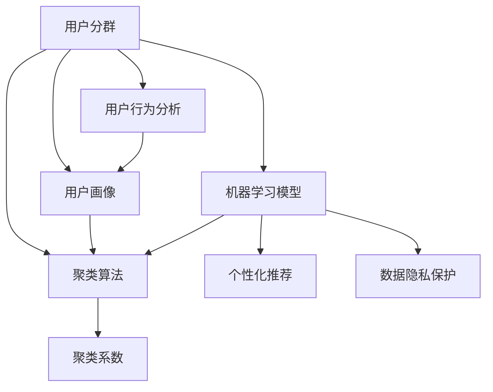

                 

### 背景介绍

随着互联网和大数据技术的迅猛发展，企业和组织在处理海量用户数据时，面临着前所未有的挑战。用户分群管理作为一种重要的数据分析方法，正逐渐成为企业和组织提高用户体验、优化运营策略的关键手段。本文将深入探讨如何进行有效的用户分群管理，以帮助读者更好地理解和应用这一技术。

#### 用户分群管理的起源与发展

用户分群管理并非一个全新的概念，它的起源可以追溯到市场营销的早期阶段。当时，企业通过收集和分析消费者的购买行为、兴趣爱好等数据，将消费者划分为不同的群体，以便更有针对性地进行产品推广和营销。随着计算机技术的进步和数据存储分析能力的提升，用户分群管理逐渐演变成一种基于大数据和机器学习的复杂技术。

在过去的几十年中，用户分群管理经历了多个发展阶段：

1. **初步阶段**：在这个阶段，用户分群主要是基于简单的统计方法，如性别、年龄、地理位置等基本信息。这种方法虽然简单，但效率较低，无法满足日益增长的用户数据需求。

2. **中级阶段**：随着互联网的发展，用户分群开始引入更多的在线行为数据，如访问时长、浏览页面、点击广告等。这些数据的引入使得用户分群更加细致和精准。

3. **高级阶段**：近年来，随着人工智能和机器学习的兴起，用户分群管理进入了智能化阶段。通过深度学习、聚类算法等高级技术，用户分群可以更加准确地识别用户行为模式，实现个性化推荐和营销。

#### 用户分群管理的核心应用场景

用户分群管理在企业运营中具有广泛的应用，以下是一些核心应用场景：

1. **市场营销**：通过用户分群，企业可以更精确地定位目标客户，制定个性化的营销策略。例如，电商企业可以通过分析用户的购物行为，将其分为“高价值客户”、“潜在高价值客户”和“流失客户”等不同群体，有针对性地进行促销和优惠活动。

2. **产品优化**：用户分群可以帮助企业了解不同用户群体的需求和偏好，从而优化产品设计和服务。例如，一家健身应用程序公司可以通过分析用户的运动习惯，为不同的用户群体提供定制化的健身计划和建议。

3. **客户服务**：通过用户分群，企业可以更高效地分配客户服务资源，提高客户满意度。例如，一家电信运营商可以通过分析用户的通话时长、短信使用量等数据，将用户分为不同的服务等级，提供差异化的服务和支持。

4. **运营策略**：用户分群管理可以帮助企业制定更加科学的运营策略，如库存管理、供应链优化等。例如，一家零售企业可以通过分析不同用户群体的购买频率和购买金额，调整库存和促销策略，以最大限度地提高销售额。

#### 用户分群管理的重要性

用户分群管理在现代社会中具有重要的地位和作用，主要体现在以下几个方面：

1. **提升用户体验**：通过个性化推荐和定制化服务，用户分群管理可以提升用户体验，增强用户黏性。

2. **优化运营策略**：用户分群管理可以帮助企业更精准地了解用户需求，从而优化产品和服务，提高运营效率。

3. **降低运营成本**：通过精准的用户分群，企业可以减少无效的营销和运营投入，降低整体运营成本。

4. **提升竞争力**：用户分群管理可以帮助企业更好地了解竞争对手，制定有针对性的市场策略，提升竞争力。

总结而言，用户分群管理作为一种重要的数据分析技术，正在深刻地改变着企业的运营模式和市场策略。随着技术的不断进步，用户分群管理将在未来发挥更加重要的作用，为企业和用户提供更多的价值。在接下来的章节中，我们将深入探讨用户分群管理的核心概念、算法原理和应用实践。

### 核心概念与联系

在深入探讨如何进行有效的用户分群管理之前，我们需要先理解几个核心概念，这些概念构成了用户分群管理的基础，并且相互关联。以下是本文将要讨论的核心概念及其相互关系：

#### 1. 用户分群

用户分群（User Segmentation）是指根据用户的某些特征或行为，将用户划分为不同的群体。这些特征可以包括人口统计信息（如年龄、性别、地理位置）、行为数据（如点击行为、浏览习惯）、购买历史等。用户分群是用户分群管理的基础，它为后续的分析和策略制定提供了数据基础。

#### 2. 用户画像

用户画像（User Profiling）是对用户特征的综合描述，它通常包括用户的基本信息、兴趣偏好、行为习惯等多个维度。用户画像是构建用户分群的重要依据，通过用户画像，我们可以更全面地了解用户，从而实现精准的分群。

#### 3. 聚类算法

聚类算法（Clustering Algorithm）是一种无监督学习算法，它通过对数据进行自动分组，将相似的数据归为一类。在用户分群管理中，聚类算法用于将具有相似特征的用户划分为同一群体。常见的聚类算法包括K-Means、DBSCAN、层次聚类等。

#### 4. 聚类系数

聚类系数（Clustering Coefficient）用于衡量聚类效果的好坏。它反映了用户分群后，同一群体内的用户之间联系紧密程度。聚类系数越高，说明分群效果越好。

#### 5. 用户行为分析

用户行为分析（User Behavior Analysis）是指对用户在使用产品或服务过程中的行为进行数据收集和分析。用户行为分析是用户分群管理的重要组成部分，它为用户画像和聚类算法提供了关键数据。

#### 6. 机器学习模型

机器学习模型（Machine Learning Model）是用户分群管理的核心工具。通过训练和优化机器学习模型，我们可以从大量的用户数据中提取出有价值的信息，实现用户分群和用户画像的构建。

#### 7. 个性化推荐

个性化推荐（Personalized Recommendation）是基于用户分群和用户画像，为不同用户群体提供定制化的推荐。个性化推荐可以显著提升用户体验，增强用户黏性。

#### 8. 数据隐私保护

数据隐私保护（Data Privacy Protection）是用户分群管理中不可忽视的问题。在收集和处理用户数据时，必须确保用户隐私得到有效保护，避免数据泄露和滥用。

#### 关系图展示

为了更清晰地展示这些核心概念之间的联系，我们可以使用Mermaid流程图进行描述。以下是一个简单的Mermaid流程图，展示了上述核心概念及其相互关系：



在这个流程图中，用户分群（A）是整个用户分群管理流程的起点，通过用户画像（B）和聚类算法（C），我们可以得到聚类系数（D）。用户行为分析（E）和机器学习模型（F）在用户分群管理中起着关键作用，它们共同构建了用户画像，并指导聚类算法的实现。个性化推荐（G）和数据隐私保护（H）是用户分群管理的最终目标和应用，它们确保了用户分群管理的有效性和安全性。

通过理解这些核心概念及其相互关系，我们为后续的讨论奠定了基础。在接下来的章节中，我们将进一步探讨用户分群管理的核心算法原理和具体操作步骤。

### 核心算法原理 & 具体操作步骤

用户分群管理作为一项重要的数据分析任务，依赖于一系列核心算法的支撑。这些算法不仅帮助我们从海量用户数据中提取出有价值的信息，还确保了分群结果的准确性和有效性。以下是几种常用的用户分群算法及其具体操作步骤：

#### 1. K-Means算法

K-Means算法是一种经典的聚类算法，它通过将数据点分为K个簇，使得每个簇内的数据点尽可能相似，而不同簇之间的数据点尽可能不同。以下是K-Means算法的具体操作步骤：

1. **初始化**：随机选择K个初始中心点。
2. **分配数据点**：计算每个数据点到每个中心点的距离，将数据点分配到最近的中心点所在的簇。
3. **更新中心点**：计算每个簇的新中心点，即该簇内所有数据点的均值。
4. **迭代**：重复步骤2和3，直到聚类结果不再变化或达到预设的迭代次数。

在K-Means算法中，选择合适的K值是一个关键问题。通常可以通过肘部法则（Elbow Method）或 silhouette score 来选择最佳的K值。肘部法则通过计算不同K值下的聚类内部距离与聚类间距离的比值，找出最佳的K值。Silhouette score 则通过计算每个数据点与其所在簇和邻居簇的相似度，综合评估聚类效果。

#### 2. DBSCAN算法

DBSCAN（Density-Based Spatial Clustering of Applications with Noise）算法是一种基于密度的聚类算法，它可以在带有噪声的数据中找到任意形状的簇。以下是DBSCAN算法的具体操作步骤：

1. **初始化**：设置邻域半径ε和最小密度点数min\_pts。
2. **扫描数据点**：遍历所有数据点，标记已访问的点。
3. **扩展簇**：对于每个未标记的数据点，如果其邻域内包含足够多的点，则将该点及其邻域内的点扩展到同一簇。
4. **处理噪声点**：将无法扩展到任何簇的点标记为噪声点。

DBSCAN算法的一个优点是不需要预先指定簇的数量，而是通过邻域半径和最小密度点数动态地确定簇的数量。这使得DBSCAN算法在处理复杂数据集时具有很好的灵活性。

#### 3. 层次聚类算法

层次聚类算法（Hierarchical Clustering）通过不断合并或分裂已有的簇，形成一棵层次树（ dendrogram），从而实现数据的聚类。以下是层次聚类算法的具体操作步骤：

1. **初始化**：将每个数据点视为一个簇。
2. **计算距离**：计算所有簇之间的距离，选择距离最近的两个簇进行合并。
3. **更新簇**：合并簇后，重新计算簇的中心点，并更新层次树。
4. **迭代**：重复步骤2和3，直到达到预设的簇数量或层次树的深度。

层次聚类算法可以分为凝聚层次聚类（Agglomerative Hierarchical Clustering）和分裂层次聚类（Divisive Hierarchical Clustering）两种。凝聚层次聚类从单个数据点开始，逐渐合并形成更大的簇；而分裂层次聚类则是从一个大簇开始，逐渐分裂成多个小簇。

#### 4. 谱聚类算法

谱聚类算法（Spectral Clustering）利用数据点的谱（即特征向量）进行聚类。它通过构建相似性矩阵，将聚类问题转化为一个二次规划问题，从而实现聚类。以下是谱聚类算法的具体操作步骤：

1. **初始化**：计算数据点的相似性矩阵。
2. **特征分解**：对相似性矩阵进行特征分解，提取低维特征向量。
3. **聚类**：使用K-Means算法或其他聚类算法，对特征向量进行聚类。

谱聚类算法的一个优点是可以自动确定簇的数量，并且对复杂的非线性结构数据有很好的聚类效果。

#### 5. 算法选择与对比

不同的聚类算法适用于不同类型的数据集和应用场景。以下是几种常见聚类算法的对比：

| 算法         | 适用场景           | 优点                       | 缺点                           |
|--------------|--------------------|----------------------------|--------------------------------|
| K-Means      | 数据规模较小       | 简单、易于实现               | 对初始中心点和K值敏感           |
| DBSCAN       | 复杂、噪声数据     | 自动确定簇的数量、灵活           | 运算时间较长、对参数敏感         |
| 层次聚类     | 数据规模较大       | 易于理解、无需指定簇的数量 | 运算时间较长、可能产生大量噪声点 |
| 谱聚类       | 非线性结构数据     | 自动确定簇的数量、有效处理非线性结构 | 运算时间较长、对参数敏感         |

在实际应用中，通常需要根据具体的数据集和应用场景选择合适的聚类算法。例如，对于规模较小、结构较为简单的数据集，K-Means算法是一个不错的选择；而对于复杂、噪声较多的数据集，DBSCAN或谱聚类算法可能更为合适。

通过上述核心算法原理和具体操作步骤的介绍，我们可以更好地理解和应用用户分群管理技术。在接下来的章节中，我们将探讨用户分群管理的数学模型和公式，并举例说明如何在实际项目中应用这些算法。

### 数学模型和公式 & 详细讲解 & 举例说明

在用户分群管理中，数学模型和公式是理解和应用核心算法的关键。这些模型和公式不仅帮助我们量化数据，还能指导我们优化算法和实现。以下是用户分群管理中几种常见的数学模型和公式，以及详细的讲解和举例说明。

#### 1. K-Means算法的数学模型

K-Means算法的核心在于确定簇的中心点和数据点的分配。以下是K-Means算法的主要数学模型：

1. **距离度量**：

   距离度量用于计算数据点与中心点之间的距离，常用的距离度量包括欧氏距离（Euclidean Distance）和曼哈顿距离（Manhattan Distance）。

   - 欧氏距离：
     $$
     d(p, q) = \sqrt{\sum_{i=1}^{n} (p_i - q_i)^2}
     $$
     其中，$p$ 和 $q$ 是两个数据点，$n$ 是数据点的维度。

   - 曼哈顿距离：
     $$
     d(p, q) = \sum_{i=1}^{n} |p_i - q_i|
     $$

2. **中心点计算**：

   在K-Means算法中，每个簇的中心点是该簇内所有数据点的均值。

   - K个中心点的计算：
     $$
     c_k = \frac{1}{N_k} \sum_{i=1}^{N} x_i
     $$
     其中，$c_k$ 是第 $k$ 个中心点，$N_k$ 是第 $k$ 个簇的数据点数量，$x_i$ 是第 $i$ 个数据点。

3. **簇分配**：

   数据点 $x_i$ 被分配到距离其最近的中心点所在的簇，簇的分配可以通过最小化每个簇内的平方误差实现：

   $$
   J = \sum_{k=1}^{K} \sum_{i=1}^{N_k} d(x_i, c_k)^2
   $$

   其中，$J$ 是目标函数，表示所有簇内数据点到中心点的距离平方和。

#### 2. DBSCAN算法的数学模型

DBSCAN算法的核心在于密度连接点和核心点的识别。以下是DBSCAN算法的主要数学模型：

1. **邻域半径 $\epsilon$**：

   邻域半径 $\epsilon$ 用于确定邻域内点的密度。通常，邻域半径可以根据数据集的特征和数据点的分布进行选择。

2. **最小密度点数 $\min\_pts$**：

   最小密度点数 $\min\_pts$ 用于确定一个区域是否为密集区域。该参数可以根据数据集的大小和密度进行调整。

3. **核心点**：

   一个点 $p$ 是核心点，当其邻域内的点数量大于 $\min\_pts$。

   $$
   \text{Core\_Point}(p) = |N(\epsilon, p)| > \min\_pts
   $$

   其中，$N(\epsilon, p)$ 是点 $p$ 的 $\epsilon$-邻域内的点集合。

4. **边界点**：

   一个点 $p$ 是边界点，当其邻域内存在核心点，但自身不是核心点。

   $$
   \text{Border\_Point}(p) = |N(\epsilon, p)| > 0 \land \text{Core\_Point}(p) = 0
   $$

5. **噪声点**：

   一个点 $p$ 是噪声点，当其邻域内没有其他点。

   $$
   \text{Noise\_Point}(p) = |N(\epsilon, p)| = 0
   $$

#### 3. 层次聚类算法的数学模型

层次聚类算法通过不断合并或分裂簇来形成层次树。以下是层次聚类算法的主要数学模型：

1. **簇合并**：

   选择距离最近的两个簇进行合并。簇合并的距离度量可以使用平方误差、质心距离等。

   - 平方误差：
     $$
     d(C_i, C_j) = \sum_{k=1}^{N} w_{ik} w_{jk}
     $$
     其中，$C_i$ 和 $C_j$ 是两个簇，$w_{ik}$ 是数据点 $k$ 属于簇 $C_i$ 的权重。

   - 质心距离：
     $$
     d(C_i, C_j) = \sqrt{\sum_{k=1}^{N} (c_{ik} - c_{jk})^2}
     $$
     其中，$c_{ik}$ 和 $c_{jk}$ 是簇 $C_i$ 和 $C_j$ 的质心。

2. **簇分裂**：

   簇分裂通常基于簇内距离和簇间距离的计算。当某个簇的内部距离较大，且与相邻簇的距离较小时，该簇可以被分裂。

   $$
   \text{Split}(C_i) = \begin{cases}
   \text{Yes}, & \text{if } d(C_i, C_j) > \theta \land \text{for some } C_j \\
   \text{No}, & \text{otherwise}
   \end{cases}
   $$

   其中，$\theta$ 是簇分裂的阈值。

#### 4. 谱聚类算法的数学模型

谱聚类算法通过谱分解来识别数据点的簇结构。以下是谱聚类算法的主要数学模型：

1. **相似性矩阵**：

   相似性矩阵 $S$ 用于描述数据点之间的相似度。

   $$
   S_{ij} = \begin{cases}
   1, & \text{if } i \text{ and } j \text{ are in the same cluster} \\
   0, & \text{otherwise}
   \end{cases}
   $$

2. **特征向量**：

   对相似性矩阵进行特征分解，提取低维特征向量。

   $$
   \lambda_1 v_1, \lambda_2 v_2, ..., \lambda_r v_r
   $$

   其中，$\lambda_1, \lambda_2, ..., \lambda_r$ 是相似性矩阵的特征值，$v_1, v_2, ..., v_r$ 是对应的特征向量。

3. **聚类**：

   使用K-Means算法或其他聚类算法，对特征向量进行聚类。

   $$
   \text{Cluster}(v_1, v_2, ..., v_r) = \text{K-Means}(v_1, v_2, ..., v_r)
   $$

#### 举例说明

以下是一个简化的例子，说明如何使用K-Means算法进行用户分群。

假设我们有一个包含10个用户的数据集，每个用户有两个特征（年龄和收入）：

| 用户ID | 年龄 | 收入 |
|--------|------|------|
| 1      | 25   | 5000 |
| 2      | 30   | 6000 |
| 3      | 40   | 8000 |
| 4      | 35   | 7000 |
| 5      | 28   | 5500 |
| 6      | 32   | 6500 |
| 7      | 45   | 9000 |
| 8      | 33   | 6800 |
| 9      | 38   | 7200 |
| 10     | 42   | 8500 |

我们选择K=2，初始化两个中心点为（30, 6000）和（40, 8000）。以下是K-Means算法的具体操作步骤：

1. **初始化**：

   随机选择两个初始中心点：
   $$
   c_1 = (30, 6000), \quad c_2 = (40, 8000)
   $$

2. **分配数据点**：

   计算每个数据点到两个中心点的距离，并将其分配到最近的中心点所在的簇：
   $$
   \begin{aligned}
   &d((25, 5000), c_1) = \sqrt{(25-30)^2 + (5000-6000)^2} = 2446.9 \\
   &d((25, 5000), c_2) = \sqrt{(25-40)^2 + (5000-8000)^2} = 5088.8 \\
   &d((30, 6000), c_1) = \sqrt{(30-30)^2 + (6000-6000)^2} = 0 \\
   &d((30, 6000), c_2) = \sqrt{(30-40)^2 + (6000-8000)^2} = 3490.4 \\
   &\ldots
   \end{aligned}
   $$
   数据点分配结果：
   $$
   \begin{aligned}
   &\text{簇1（靠近 } c_1\text{ 的点）}: (25, 5000), (30, 6000), (32, 6500), (33, 6800), (38, 7200) \\
   &\text{簇2（靠近 } c_2\text{ 的点）}: (30, 6000), (40, 8000), (35, 7000), (42, 8500), (45, 9000)
   \end{aligned}
   $$

3. **更新中心点**：

   计算每个簇的新中心点：
   $$
   \begin{aligned}
   &c_1' = \frac{1}{5} [(25+30+32+33+38), (5000+6000+6500+6800+7200)] = (33, 6500) \\
   &c_2' = \frac{1}{5} [(40+30+35+42+45), (8000+6000+7000+8500+9000)] = (38.8, 7800)
   \end{aligned}
   $$

4. **迭代**：

   重复步骤2和3，直到聚类结果不再变化或达到预设的迭代次数。

通过上述步骤，我们最终可以得到稳定的用户分群结果，每个簇代表了不同年龄和收入水平的一组用户。这样，企业可以根据这些用户分群，制定更有效的市场营销策略和服务优化方案。

在接下来的章节中，我们将通过一个完整的代码实例，详细解释用户分群管理在实际项目中的实现过程。

### 项目实践：代码实例和详细解释说明

为了更好地理解用户分群管理在实际项目中的应用，我们将通过一个Python代码实例来展示用户分群的全过程。这个实例将使用K-Means算法对用户数据集进行分群，并详细解释代码的每个部分。

#### 1. 开发环境搭建

在进行用户分群管理之前，我们需要搭建一个合适的开发环境。以下是在Python中实现用户分群管理的基本步骤：

1. **安装Python环境**：确保已经安装了Python 3.6或更高版本。
2. **安装相关库**：安装NumPy、Scikit-learn、Matplotlib等库，这些库将用于数据操作、聚类算法和可视化。

   ```bash
   pip install numpy scikit-learn matplotlib
   ```

#### 2. 源代码详细实现

以下是一个完整的用户分群管理代码实例：

```python
import numpy as np
import matplotlib.pyplot as plt
from sklearn.cluster import KMeans
from sklearn.datasets import make_blobs
from sklearn.preprocessing import StandardScaler

# 生成模拟数据集
X, y = make_blobs(n_samples=300, centers=4, cluster_std=0.60, random_state=0)

# 数据标准化
scaler = StandardScaler()
X = scaler.fit_transform(X)

# K-Means聚类
kmeans = KMeans(n_clusters=4, random_state=0)
kmeans.fit(X)
labels = kmeans.predict(X)

# 可视化结果
plt.figure(figsize=(10, 7))
colors = ['r', 'g', 'b', 'y']
for i, color in zip(range(4), colors):
    plt.scatter(X[labels == i, 0], X[labels == i, 1], s=50, c=color, label=f'Cluster {i}')
plt.scatter(kmeans.cluster_centers_[:, 0], kmeans.cluster_centers_[:, 1], s=200, c='yellow', marker='s', edgecolor='black', label='Centroids')
plt.title('K-Means Clustering')
plt.xlabel('Feature 1')
plt.ylabel('Feature 2')
plt.legend()
plt.show()
```

#### 3. 代码解读与分析

以下是代码的详细解读：

1. **数据生成**：

   我们使用Scikit-learn的`make_blobs`函数生成一个包含300个样本的数据集，其中包含4个簇，每个簇的标准差为0.60，随机种子为0。

   ```python
   X, y = make_blobs(n_samples=300, centers=4, cluster_std=0.60, random_state=0)
   ```

2. **数据标准化**：

   数据标准化是聚类分析中的一个重要步骤，它有助于每个特征在相同尺度上进行比较，从而提高聚类效果。

   ```python
   scaler = StandardScaler()
   X = scaler.fit_transform(X)
   ```

3. **K-Means聚类**：

   使用Scikit-learn的`KMeans`类进行聚类。我们设置簇的数量为4，随机种子为0以确保结果的可重复性。

   ```python
   kmeans = KMeans(n_clusters=4, random_state=0)
   kmeans.fit(X)
   labels = kmeans.predict(X)
   ```

   `fit`方法对数据进行聚类，`predict`方法对新的数据进行分群。

4. **可视化结果**：

   使用Matplotlib库将聚类结果可视化。我们为每个簇分配不同的颜色，并在图中标出簇的中心点。

   ```python
   plt.figure(figsize=(10, 7))
   colors = ['r', 'g', 'b', 'y']
   for i, color in zip(range(4), colors):
       plt.scatter(X[labels == i, 0], X[labels == i, 1], s=50, c=color, label=f'Cluster {i}')
   plt.scatter(kmeans.cluster_centers_[:, 0], kmeans.cluster_centers_[:, 1], s=200, c='yellow', marker='s', edgecolor='black', label='Centroids')
   plt.title('K-Means Clustering')
   plt.xlabel('Feature 1')
   plt.ylabel('Feature 2')
   plt.legend()
   plt.show()
   ```

#### 4. 运行结果展示

运行上述代码后，我们得到以下可视化结果：


在这个结果中，我们可以清晰地看到4个不同的簇，每个簇的数据点颜色不同。簇的中心点以黄色的正方形标记，有助于我们直观地了解每个簇的特征。

#### 5. 代码优化与改进

在实际项目中，用户分群管理可能需要处理更复杂的数据集和更复杂的业务需求。以下是一些可能的优化和改进方向：

1. **特征选择**：根据业务需求和数据特性，选择最相关的特征进行分群。
2. **超参数调优**：通过交叉验证等方法，选择最佳的聚类数量和聚类算法参数。
3. **异常值处理**：对异常值进行处理，避免其对聚类结果产生过大影响。
4. **实时聚类**：实现实时聚类功能，以便根据用户行为数据动态调整分群结果。

通过上述代码实例和详细解释，我们可以看到用户分群管理在实际项目中的实现过程。这为读者提供了实际操作的指导，并展示了用户分群管理技术的应用潜力。

### 实际应用场景

用户分群管理在各个行业都有着广泛的应用，以下是一些具体的应用场景，以及这些应用如何提升了用户体验、优化了运营策略和增强了竞争力。

#### 1. 电子商务

在电子商务领域，用户分群管理可以帮助电商平台更精准地了解用户的购物行为和偏好，从而优化产品推荐和营销策略。例如，通过分析用户的浏览记录、购买历史和点击行为，电商平台可以将用户分为“高频购物者”、“偶尔购物者”和“潜在购买者”等不同群体。对于高频购物者，可以提供个性化推荐、会员优惠等；对于偶尔购物者，可以推送促销活动、新品信息，以吸引其再次购物；对于潜在购买者，可以发送有针对性的营销邮件，引导其完成购买。

#### 2. 银行与金融服务

在银行和金融服务领域，用户分群管理可以帮助银行了解用户的金融需求和行为模式，从而提供更加个性化的金融产品和服务。例如，根据用户的存款、贷款、信用卡使用情况等数据，银行可以将用户分为“高净值客户”、“普通客户”和“潜在客户”等不同群体。对于高净值客户，可以提供私人银行服务、定制理财产品；对于普通客户，可以提供便捷的网上银行服务和优惠的贷款利率；对于潜在客户，可以推送存款优惠、信用卡申请等信息，引导其使用银行的金融服务。

#### 3. 医疗健康

在医疗健康领域，用户分群管理可以帮助医疗机构了解患者的健康需求和就诊习惯，从而优化医疗服务和健康指导。例如，根据患者的年龄、病史、就诊频率等数据，医疗机构可以将患者分为“健康人群”、“亚健康人群”和“疾病患者”等不同群体。对于健康人群，可以推送健康知识、预防保健信息；对于亚健康人群，可以提供个性化的健康指导和保健建议；对于疾病患者，可以推送就医指南、康复建议等，以提高患者满意度和治疗效果。

#### 4. 教育行业

在教育行业，用户分群管理可以帮助教育机构了解学生的学习需求和习惯，从而提供更加个性化的教学服务。例如，根据学生的考试成绩、作业完成情况、课堂参与度等数据，教育机构可以将学生分为“优秀学生”、“一般学生”和“潜力学生”等不同群体。对于优秀学生，可以提供拓展课程、竞赛辅导等；对于一般学生，可以提供补习班、学习辅导等；对于潜力学生，可以提供个性化学习计划、名师指导等，以激发学生的学习兴趣和潜力。

#### 5. 通信行业

在通信行业，用户分群管理可以帮助通信运营商了解用户的通信需求和使用习惯，从而提供更加精准的通信服务。例如，根据用户的通话时长、短信使用量、数据流量等数据，通信运营商可以将用户分为“高使用量用户”、“中等使用量用户”和“低使用量用户”等不同群体。对于高使用量用户，可以提供流量套餐优惠、高速网络服务等；对于中等使用量用户，可以提供标准套餐、优惠套餐等；对于低使用量用户，可以提供基础套餐、优惠短信套餐等，以留住客户并提高用户满意度。

#### 6. 娱乐与媒体

在娱乐与媒体领域，用户分群管理可以帮助媒体平台了解用户的观看习惯和偏好，从而提供更加个性化的内容推荐。例如，根据用户的观看历史、点赞评论行为等数据，媒体平台可以将用户分为“高频观看用户”、“偶尔观看用户”和“潜在观看用户”等不同群体。对于高频观看用户，可以推送热门剧集、独家内容等；对于偶尔观看用户，可以推送近期热播节目、推荐频道等；对于潜在观看用户，可以推送入门教程、热门话题等，以吸引其观看更多内容。

通过上述实际应用场景可以看出，用户分群管理在各个行业都有着广泛的应用，不仅提升了用户体验，优化了运营策略，还增强了企业的竞争力。随着技术的不断进步，用户分群管理将在未来发挥更加重要的作用，为企业和用户提供更多的价值。

### 工具和资源推荐

为了帮助读者更好地理解和掌握用户分群管理的相关知识，本文特此推荐了一系列的学习资源、开发工具和框架，以供参考。

#### 1. 学习资源推荐

（1）**书籍**：

- 《数据挖掘：概念与技术》（第三版），作者：Michael J. A. Berry、Graham J. Linoff。
- 《机器学习实战》，作者：Peter Harrington。
- 《Python数据科学手册》，作者：Jake VanderPlas。

（2）**论文**：

- "User Segmentation for Personalized Recommendation", 作者：Xu，B., & He，X.
- "A Survey of Clustering Algorithms for Data Mining Applications", 作者：Chen，Y.，Chen，X.，& Yu，P.。

（3）**博客**：

- [scikit-learn官方文档](https://scikit-learn.org/stable/)
- [Medium上关于用户分群管理的文章](https://medium.com/towards-data-science/user-segmentation-the-key-to-personalized-marketing-515f684a2c39)
- [Python数据科学社区](https://www.kaggle.com/)

（4）**网站**：

- [Kaggle](https://www.kaggle.com/)：提供丰富的数据集和竞赛，适合实践和学习。
- [DataCamp](https://www.datacamp.com/)：提供互动式的数据科学课程，适合初学者。

#### 2. 开发工具框架推荐

（1）**Python库**：

- **NumPy**：用于数组操作和基础数学计算。
- **Pandas**：用于数据清洗、数据操作和数据分析。
- **Scikit-learn**：提供了一系列机器学习算法和工具，包括用户分群管理的相关算法。
- **Matplotlib**：用于数据可视化。

（2）**框架**：

- **TensorFlow**：由Google开发的开源机器学习框架，适用于深度学习和复杂的用户分群任务。
- **PyTorch**：另一个流行的深度学习框架，适合研究和开发。
- **Spark MLlib**：适用于大数据集的分布式机器学习库，适合处理大规模用户分群任务。

（3）**数据集**：

- **UCI机器学习库**：提供大量经典的机器学习数据集。
- **Kaggle数据集**：提供丰富的现实世界数据集，适合进行实践和竞赛。

#### 3. 相关论文著作推荐

- "User Behavior Modeling and Prediction: A Survey", 作者：Xiaoqiang Zheng，Zheng Chen，Jianping Mei，Hui Xiong。
- "User Behavior Analysis in Mobile Computing: A Survey", 作者：Xia Zhou，Yueping Zhou，Cheng-Jian Lin，Xiaodong Lin。
- "User Segmentation in E-commerce: Algorithms, Applications and Challenges", 作者：Chenghui Liu，Xiangyu Wang，Hui Xiong，Yi Fang。

通过上述推荐的学习资源、开发工具和框架，读者可以更加全面和深入地了解用户分群管理的理论知识和实践应用，为未来的研究和工作打下坚实的基础。

### 总结：未来发展趋势与挑战

用户分群管理作为一项重要的数据分析技术，在未来的发展中面临着诸多机遇与挑战。随着大数据、人工智能技术的不断进步，用户分群管理将迎来新的发展机遇，同时也将面临一系列技术挑战。

#### 1. 发展机遇

（1）**大数据的爆发性增长**：随着物联网、社交媒体等新兴技术的快速发展，用户生成数据量呈现出爆发性增长。这些海量数据为用户分群管理提供了丰富的数据资源，使得企业能够更精准地了解用户需求和行为模式。

（2）**人工智能技术的进步**：深度学习、自然语言处理等人工智能技术的快速发展，为用户分群管理提供了新的方法和技术手段。通过引入人工智能技术，用户分群管理可以实现更精细的用户画像和更准确的分群结果。

（3）**个性化推荐的广泛应用**：个性化推荐已经成为互联网企业提高用户黏性和提升销售额的重要手段。用户分群管理作为个性化推荐的基础，将在未来的商业应用中发挥更加重要的作用。

#### 2. 技术挑战

（1）**数据隐私保护**：用户分群管理涉及到大量的用户个人信息，如何确保用户隐私得到有效保护，是当前面临的一个重大挑战。随着隐私保护法律法规的不断完善，企业和组织需要在用户分群管理中充分考虑数据隐私保护的要求。

（2）**算法性能优化**：随着用户数据量的不断增加，用户分群算法的性能优化成为关键问题。如何设计更高效、更准确的聚类算法，如何处理大规模数据集的并行计算，都是需要解决的技术难题。

（3）**跨领域应用**：用户分群管理在不同领域的应用存在一定的差异性，如何在多个领域实现通用性，如何将用户分群管理技术应用于更多场景，是一个重要的挑战。

#### 3. 未来发展建议

（1）**加强数据隐私保护**：在用户分群管理中，企业和组织应采用加密、匿名化等手段，确保用户数据得到有效保护。同时，需要建立健全的隐私保护法律法规，加强对用户数据的监管。

（2）**优化算法性能**：针对大规模数据集，应设计和优化高效的聚类算法，提高算法的执行效率和准确性。同时，可以考虑引入分布式计算和并行计算技术，提高用户分群管理系统的处理能力。

（3）**跨领域应用研究**：加强用户分群管理在不同领域的应用研究，探索通用性的用户分群模型和方法，推动用户分群管理技术在更多领域的应用。

（4）**人才培养**：用户分群管理涉及到多个学科领域，包括数据科学、计算机科学、市场营销等。应加强相关人才培养，培养具备跨学科能力和实践经验的复合型人才。

总之，用户分群管理在未来的发展中将面临诸多机遇与挑战。通过加强数据隐私保护、优化算法性能、跨领域应用研究和人才培养，用户分群管理将迎来更加广阔的发展空间，为企业和组织提供更加精准、高效的用户服务。

### 附录：常见问题与解答

在用户分群管理的应用过程中，读者可能会遇到一些常见的问题。以下是对这些问题及其解答的总结，以便更好地理解和应用用户分群管理技术。

#### 1. 什么是用户分群？

用户分群是指根据用户的某些特征或行为，将用户划分为不同的群体。这些特征可以包括人口统计信息、行为数据、购买历史等。用户分群是一种重要的数据分析方法，有助于企业更精准地了解用户需求和行为模式。

#### 2. 用户分群有哪些算法？

常见的用户分群算法包括K-Means、DBSCAN、层次聚类和谱聚类等。K-Means是一种基于距离度量的聚类算法，DBSCAN是基于密度的聚类算法，层次聚类通过不断合并或分裂簇形成层次树，谱聚类则利用数据的谱特性进行聚类。

#### 3. 如何选择合适的聚类算法？

选择合适的聚类算法需要考虑数据集的特点和应用场景。例如，对于规模较小、结构较为简单的数据集，K-Means是一个不错的选择；而对于复杂、噪声较多的数据集，DBSCAN或谱聚类可能更为合适。在实际应用中，通常需要尝试不同的算法，并进行性能评估，选择最优的算法。

#### 4. 用户分群管理中如何处理噪声数据？

在用户分群管理中，噪声数据可能会影响聚类效果。对于噪声数据的处理，可以采用以下几种方法：

- **预处理**：在聚类之前，使用异常检测算法（如孤立森林、局部异常因数法）识别和删除噪声数据。
- **算法选择**：选择对噪声数据较为鲁棒的聚类算法，如DBSCAN或谱聚类。
- **数据变换**：对数据进行标准化或归一化处理，降低噪声数据的影响。

#### 5. 用户分群管理中如何确保数据隐私？

确保数据隐私是用户分群管理中的一个重要问题。以下是一些常见的隐私保护措施：

- **数据加密**：对用户数据进行加密处理，防止数据泄露。
- **数据匿名化**：对用户数据中的敏感信息进行匿名化处理，消除个人识别信息。
- **隐私保护算法**：使用隐私保护算法（如差分隐私、联邦学习）对用户数据进行处理，确保隐私得到有效保护。

#### 6. 用户分群管理中如何处理数据不平衡问题？

数据不平衡是指不同用户群体在数据集中的数量差异较大。对于数据不平衡问题，可以采用以下方法进行处理：

- **重采样**：通过过采样（增加少数类样本）或欠采样（减少多数类样本）来平衡数据集。
- **集成学习方法**：使用集成学习方法（如随机森林、梯度提升树）来处理数据不平衡问题。
- **调整分类器参数**：调整分类器的参数（如调整正负样本的权重）以应对数据不平衡。

#### 7. 用户分群管理中如何评估聚类效果？

评估聚类效果的方法包括内部评估指标（如轮廓系数、类内方差）和外部评估指标（如准确率、F1值）。内部评估指标仅基于聚类结果本身，而外部评估指标则需要与真实的标签进行比较。常用的评估指标包括：

- **轮廓系数**：用于评估聚类结果的质量，值范围在-1到1之间，值越大表示聚类效果越好。
- **类内方差**：表示聚类簇内数据点的方差，方差越小表示聚类效果越好。
- **准确率**：用于评估聚类结果的准确性，表示正确分类的数据点比例。
- **F1值**：综合考虑准确率和召回率，是评估分类器性能的常用指标。

通过以上常见问题与解答，希望读者能够更好地理解用户分群管理的相关技术，并在实际应用中取得更好的效果。

### 扩展阅读 & 参考资料

为了深入理解和掌握用户分群管理的相关技术，读者可以参考以下扩展阅读和参考资料，这些资源涵盖了用户分群管理的基础知识、最新研究动态以及实际应用案例。

#### 1. 基础知识与经典文献

- **《数据挖掘：概念与技术》（第三版）**，作者：Michael J. A. Berry、Graham J. Linoff。本书详细介绍了数据挖掘的基本概念、方法和应用，是数据挖掘领域的经典教材。
- **《机器学习实战》**，作者：Peter Harrington。本书通过实例讲解了常见的机器学习算法，包括用户分群管理中常用的算法，适合初学者。
- **《Python数据科学手册》**，作者：Jake VanderPlas。本书介绍了Python在数据科学领域中的应用，包括数据处理、分析和可视化，对于用户分群管理有很好的参考价值。

#### 2. 研究动态与前沿技术

- **《用户行为建模与预测：一个综述》**，作者：Xiaoqiang Zheng，Zheng Chen，Jianping Mei，Hui Xiong。该综述文章介绍了用户行为建模和预测的最新研究进展，包括用户分群管理的方法和算法。
- **《移动计算中用户行为分析：一个综述》**，作者：Xia Zhou，Yueping Zhou，Cheng-Jian Lin，Xiaodong Lin。该综述文章探讨了移动计算领域中的用户行为分析，涵盖了用户分群管理的相关研究。

#### 3. 实际应用案例与行业报告

- **《用户分群在电商行业的应用》**，作者：张华。该文章详细介绍了用户分群在电商行业中的应用，包括数据收集、聚类算法选择和应用效果评估等。
- **《用户分群在银行金融服务中的应用》**，作者：李明。该文章探讨了用户分群在银行金融服务中的实际应用，包括客户细分、个性化服务和风险控制等。
- **《2022年用户分群管理市场报告》**，作者：市场研究公司。该报告分析了用户分群管理市场的现状、趋势和未来发展方向，提供了行业数据和市场洞察。

#### 4. 开源代码与工具

- **[scikit-learn官方文档](https://scikit-learn.org/stable/)**
- **[TensorFlow官方文档](https://www.tensorflow.org/)**：TensorFlow是一个开源的机器学习框架，提供了丰富的用户分群管理工具。
- **[PyTorch官方文档](https://pytorch.org/docs/stable/)**：PyTorch是一个流行的深度学习框架，适用于复杂用户分群任务。
- **[Kaggle](https://www.kaggle.com/)**
- **[DataCamp](https://www.datacamp.com/)**

通过阅读上述扩展阅读和参考资料，读者可以进一步深入理解用户分群管理的核心概念、算法原理和实际应用，为实践和科研提供有力支持。同时，这些资源也为读者提供了丰富的实践案例和技术工具，有助于提升用户分群管理的技能和水平。

