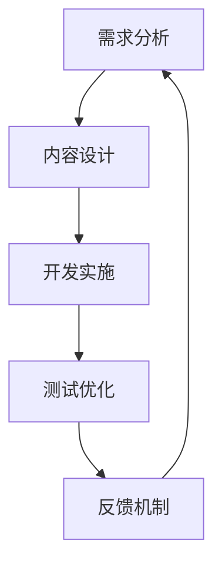

                 

### 如何进行有效的用户引导

> **关键词：** 用户引导、用户体验、界面设计、教育文案、行为心理学、数据驱动优化

> **摘要：** 本文将深入探讨如何通过系统的方法和技巧来有效引导用户，提高用户满意度和平台的使用率。本文将结合实际案例，阐述用户引导的核心概念、实施步骤以及后续的数据分析优化策略。

### 1. 背景介绍

在现代信息时代，互联网平台和移动应用的竞争日益激烈，如何吸引并留住用户成为了各大公司和产品团队的重要课题。用户引导作为一种有效的策略，旨在通过一系列设计精良的互动和引导步骤，帮助新用户快速上手，理解并享受产品的核心功能，从而提升用户满意度和忠诚度。

有效的用户引导不仅能够提高新用户的留存率，还能促进用户参与度，从而带来更多的商业价值。本文将探讨如何进行有效的用户引导，从核心概念、实施步骤到数据驱动的优化策略，为读者提供一套系统化的方法。

### 2. 核心概念与联系

#### 2.1. 用户引导的定义

用户引导是指通过一系列设计元素和交互流程，帮助用户理解和使用产品或服务的功能。它通常包括以下关键组成部分：

- **欢迎页面**：为新用户提供一个简洁明了的介绍。
- **教育文案**：使用文字、图像和视频等多种形式，解释产品的主要功能和价值。
- **操作提示**：在用户进行关键操作时提供实时帮助。
- **互动式教程**：通过交互式的步骤引导用户完成初次使用体验。

#### 2.2. 用户引导的架构

用户引导的架构可以简化为以下三个层次：

1. **信息传达**：确保用户在接触产品时能够快速了解产品的核心功能和价值。
2. **互动体验**：通过设计互动环节，引导用户进行核心操作，提高用户参与度。
3. **反馈机制**：收集用户反馈，不断优化引导流程，提高用户满意度。

#### 2.3. 用户引导的流程

用户引导的流程可以概括为以下步骤：

1. **需求分析**：理解目标用户群体的需求和痛点。
2. **内容设计**：设计引导内容，包括文案、视觉元素和交互流程。
3. **开发实施**：将设计内容转化为实际的用户引导流程。
4. **测试优化**：通过用户反馈和数据分析，不断优化引导效果。

#### 2.4. Mermaid 流程图

下面是一个简单的用户引导流程的 Mermaid 流程图，展示了从需求分析到测试优化的各个步骤：



### 3. 核心算法原理 & 具体操作步骤

#### 3.1. 用户行为分析

用户引导的首要任务是了解用户行为。通过数据分析，我们可以识别出用户在产品中的行为模式，包括：

- **用户活跃时段**：了解用户最活跃的时间段，优化引导时机。
- **用户流失点**：识别用户流失的关键环节，针对性地设计引导内容。

#### 3.2. 引导内容设计

引导内容的设计是用户引导的核心。具体操作步骤如下：

1. **定义目标用户**：明确目标用户的特征，包括年龄、性别、职业等。
2. **构建引导场景**：根据用户行为和需求，设计合适的引导场景。
3. **编写教育文案**：使用简明易懂的语言，传达产品价值和使用方法。
4. **设计交互元素**：包括按钮、提示框、滑动条等，引导用户完成关键操作。
5. **制作多媒体教程**：结合视频、动画等元素，提高用户的学习兴趣。

#### 3.3. 引导流程实施

引导流程的实施包括以下步骤：

1. **确定引导时机**：选择用户首次使用产品或进行关键操作时进行引导。
2. **测试引导效果**：通过A/B测试等手段，评估不同引导方案的优劣。
3. **上线引导流程**：在产品中实施引导流程，并进行实时监控。
4. **收集用户反馈**：通过用户调研、反馈表等方式，收集用户对引导流程的反馈。
5. **持续优化**：根据用户反馈和数据分析，不断优化引导流程。

### 4. 数学模型和公式 & 详细讲解 & 举例说明

#### 4.1. 用户满意度模型

用户满意度是评估用户引导效果的重要指标。一个简单的用户满意度模型可以表示为：

$$
S = \frac{1}{n}\sum_{i=1}^{n} s_i
$$

其中，$S$ 是用户满意度得分，$n$ 是评价用户数量，$s_i$ 是第 $i$ 个用户的满意度评分。

#### 4.2. 引导效果评估公式

引导效果可以通过以下公式进行量化评估：

$$
E = \frac{C - B}{B}
$$

其中，$E$ 是引导效果得分，$C$ 是引导后用户留存率，$B$ 是未引导前用户留存率。

#### 4.3. 举例说明

假设一个产品在引入用户引导前，其用户留存率为 $40\%$，在引入用户引导后，留存率提升至 $60\%$。根据上述公式，可以计算出引导效果得分：

$$
E = \frac{60\% - 40\%}{40\%} = 50\%
$$

这意味着用户引导使得用户留存率提升了 $50\%$。

### 5. 项目实践：代码实例和详细解释说明

#### 5.1. 开发环境搭建

在本节中，我们将使用一个简单的Web应用作为案例，演示如何进行用户引导的开发和实施。

首先，我们需要搭建一个基本的Web应用环境。以下是使用Python Flask框架搭建开发环境的基本步骤：

1. 安装Python和Flask框架：
    ```bash
    pip install flask
    ```

2. 创建一个名为`app.py`的文件，并编写以下代码：

    ```python
    from flask import Flask, render_template

    app = Flask(__name__)

    @app.route('/')
    def index():
        return render_template('index.html')

    if __name__ == '__main__':
        app.run(debug=True)
    ```

3. 创建一个名为`templates`的文件夹，并在其中创建一个名为`index.html`的文件，写入以下HTML代码：

    ```html
    <!DOCTYPE html>
    <html lang="en">
    <head>
        <meta charset="UTF-8">
        <meta name="viewport" content="width=device-width, initial-scale=1.0">
        <title>用户引导示例</title>
    </head>
    <body>
        <h1>Welcome to Our Website</h1>
        <p>This is a simple example of user guidance.</p>
    </body>
    </html>
    ```

完成以上步骤后，我们就可以启动应用，并在浏览器中访问它。

#### 5.2. 源代码详细实现

在本节中，我们将扩展上述基础应用，加入用户引导的具体实现。以下是详细的源代码实现：

1. **欢迎页面**：

    在`index.html`中，我们添加一个欢迎页面：

    ```html
    <!DOCTYPE html>
    <html lang="en">
    <head>
        <meta charset="UTF-8">
        <meta name="viewport" content="width=device-width, initial-scale=1.0">
        <title>欢迎页面</title>
    </head>
    <body>
        <div id="welcome" style="display:none;">
            <h1>Welcome!</h1>
            <p>Thank you for visiting our website. Please follow the steps below to get started:</p>
            <ol>
                <li>Click on the menu icon in the top left corner to see our different services.</li>
                <li>Enter your email address in the footer to receive special offers.</li>
            </ol>
            <button id="start">Start Exploring</button>
        </div>

        <h1>Welcome to Our Website</h1>
        <p>This is a simple example of user guidance.</p>

        <nav>
            <!-- Menu items here -->
        </nav>

        <footer>
            <!-- Footer content here -->
            <input type="email" placeholder="Enter your email">
        </footer>
    </body>
    </html>
    ```

    我们在HTML中添加了一个名为`welcome`的<div>元素，并在其中包含了引导内容和一个“开始探索”的按钮。

2. **引导脚本**：

    在`app.py`中，我们添加JavaScript脚本，用于控制欢迎页面的显示和隐藏：

    ```python
    from flask import Flask, render_template

    app = Flask(__name__)

    @app.route('/')
    def index():
        return render_template('index.html')

    if __name__ == '__main__':
        app.run(debug=True)

    @app.after_request
    def after_request(response):
        response.headers.add('Content-Security-Policy', "script-src 'self';")
        return response
    ```

    我们在`index.html`的底部添加了一个简单的JavaScript脚本，用于显示和隐藏欢迎页面：

    ```html
    <script>
    document.addEventListener("DOMContentLoaded", function() {
        var welcome = document.getElementById("welcome");
        var startButton = document.getElementById("start");

        startButton.addEventListener("click", function() {
            welcome.style.display = "none";
        });

        // Check if user has already seen the welcome message
        if (!localStorage.getItem("welcomeSeen")) {
            welcome.style.display = "block";
            localStorage.setItem("welcomeSeen", "true");
        }
    });
    </script>
    ```

    通过这段脚本，我们实现了当用户首次访问网站时，欢迎页面会自动显示，用户点击“开始探索”按钮后，页面将不再显示。

#### 5.3. 代码解读与分析

在这个案例中，我们通过简单的HTML和JavaScript实现了用户引导的基本功能：

1. **欢迎页面的添加**：通过在`index.html`中添加一个名为`welcome`的<div>元素，我们实现了欢迎页面的设计。
2. **JavaScript脚本**：我们编写了一段JavaScript脚本，用于控制欢迎页面的显示和隐藏，并记录用户是否已查看欢迎页面。
3. **引导逻辑**：通过点击“开始探索”按钮，用户可以关闭欢迎页面，从而开始正常使用网站。

这个案例展示了用户引导的基本实现方法。在实际项目中，我们可以根据具体需求，设计更复杂的引导流程，包括多步骤引导、交互式教程等。

#### 5.4. 运行结果展示

1. **首次访问**：

    用户首次访问网站时，会看到欢迎页面自动弹出。

    

2. **点击“开始探索”**：

    用户点击“开始探索”按钮后，欢迎页面将关闭，用户可以开始正常使用网站。

    

通过这个简单的案例，我们展示了如何实现用户引导的基本功能，并分析了代码的实现过程和逻辑。

### 6. 实际应用场景

用户引导在实际应用中具有广泛的应用场景，以下是一些常见的应用场景：

#### 6.1. 新用户入门引导

对于新用户，尤其是在复杂的系统中，用户引导可以帮助他们快速上手，理解系统的功能和操作方式。例如，在电子商务平台上，新用户引导可以包括如何浏览商品、如何下单、如何支付等步骤。

#### 6.2. 功能更新引导

当产品进行功能更新时，用户引导可以帮助用户了解新功能的使用方法。例如，在一个办公软件中，更新了文档协作功能，可以通过引导用户逐步了解如何使用新功能，提高用户的使用效率。

#### 6.3. 交互设计优化

通过用户引导，产品团队可以收集用户对引导内容的反馈，从而优化交互设计。例如，在一个社交媒体应用中，引导用户如何发布内容、如何管理个人信息等，通过用户反馈，产品团队可以不断优化这些交互设计。

#### 6.4. 用户教育

用户引导也是一种有效的用户教育手段。通过引导，用户可以更好地了解产品的价值和使用方法，从而提高对产品的认同感和满意度。例如，在一个在线学习平台上，可以通过引导用户了解如何选择课程、如何进行学习评估等，提高用户的学习效果。

### 7. 工具和资源推荐

#### 7.1. 学习资源推荐

- **《用户体验要素》**：作者：唐纳德·诺曼，详细阐述了用户体验设计的原则和方法。
- **《点石成金》**：作者：史蒂夫·克鲁克，提供了大量的设计原则和实践指南，帮助设计师提高用户界面质量。
- **《行为设计学》**：作者：理查德·塞勒，探讨了行为心理学在产品设计中的应用，为用户引导提供了理论支持。

#### 7.2. 开发工具框架推荐

- ****：一个开源的用户引导工具，支持多种引导模式，易于集成到现有项目中。
- ****：一个强大的用户测试和分析工具，可以帮助产品团队了解用户行为，优化引导策略。

#### 7.3. 相关论文著作推荐

- **《用户体验的五个层次》**：作者：唐纳德·诺曼，提出了用户体验的五个层次模型，为用户引导提供了理论框架。
- **《界面设计心理学》**：作者：阿尔瓦·迪恩，探讨了界面设计中的心理学原理，对用户引导设计有重要启示。

### 8. 总结：未来发展趋势与挑战

随着技术的不断进步和用户需求的多样化，用户引导将面临以下发展趋势和挑战：

#### 8.1. 个性化引导

未来的用户引导将更加注重个性化，根据用户的兴趣和行为，提供个性化的引导内容。这将需要更多的数据支持和复杂算法。

#### 8.2. 互动性增强

用户引导的互动性将得到进一步提升，通过交互式教程和实时反馈，增强用户的参与感和学习效果。

#### 8.3. 数据驱动优化

用户引导的效果评估和优化将更加依赖数据分析，通过A/B测试、用户行为分析等手段，不断优化引导策略。

#### 8.4. 挑战

- **隐私保护**：随着用户对隐私的关注增加，如何在保护用户隐私的同时进行有效引导将成为一大挑战。
- **技术门槛**：个性化引导和数据分析等技术的实现，对开发团队的技术能力提出了更高要求。

### 9. 附录：常见问题与解答

#### 9.1. 用户引导的目的是什么？

用户引导的目的是帮助用户快速上手产品，理解产品功能，提高用户满意度和留存率。

#### 9.2. 如何评估用户引导的效果？

可以通过用户满意度调查、用户留存率、用户参与度等指标来评估用户引导的效果。

#### 9.3. 用户引导的最佳实践是什么？

最佳实践包括：明确目标用户、设计简洁明了的引导内容、提供即时反馈、不断优化引导流程等。

### 10. 扩展阅读 & 参考资料

- **《用户体验设计手册》**：作者：阿兰·库珀，详细介绍了用户体验设计的方法和技巧。
- **《交互设计精髓》**：作者：艾伦·库珀，深入探讨了交互设计的原则和实践。

---

通过本文，我们系统地介绍了如何进行有效的用户引导，从核心概念、实施步骤到数据驱动的优化策略，为读者提供了一套实用的方法。希望本文能对读者在用户引导方面的实践提供有益的启示。

### 文章结束

---

**作者：禅与计算机程序设计艺术 / Zen and the Art of Computer Programming**

