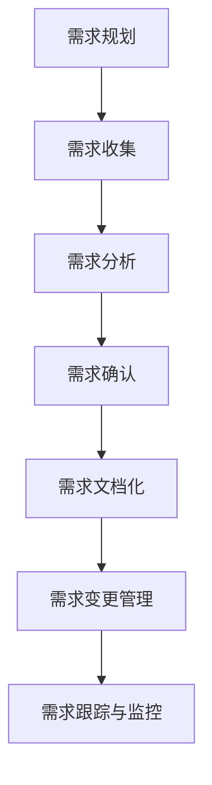

                 

### 1. 背景介绍

用户需求挖掘是现代软件开发过程中的关键环节，它直接关系到产品的成功与否。有效的用户需求挖掘不仅能够帮助开发团队更好地理解用户需求，提高产品竞争力，还能在产品迭代过程中减少资源浪费，降低开发成本。因此，掌握科学的用户需求挖掘方法对于软件开发者来说至关重要。

本文将围绕如何进行有效的用户需求挖掘展开讨论。首先，我们将简要回顾用户需求挖掘的定义、重要性及其在软件开发过程中的作用。随后，我们将详细探讨用户需求挖掘的核心概念、原理、算法以及具体操作步骤。接下来，文章将结合实际项目案例，展示如何运用这些方法进行有效的用户需求挖掘。最后，我们将总结用户需求挖掘的实际应用场景，并推荐一些有用的工具和资源。

本文的目标是通过逻辑清晰、结构紧凑的阐述，帮助读者全面了解用户需求挖掘的方方面面，从而在实际工作中能够更加有效地进行用户需求挖掘。通过本文的阅读，读者将能够：

1. 明确用户需求挖掘的定义及其在软件开发中的重要性。
2. 理解用户需求挖掘的核心概念和原理。
3. 掌握用户需求挖掘的具体算法和操作步骤。
4. 学习如何运用这些方法进行实际项目的用户需求挖掘。
5. 获得相关的工具和资源推荐，以支持进一步的深入学习。

在接下来的内容中，我们将一步步深入，详细探讨如何进行有效的用户需求挖掘。

### 2. 核心概念与联系

在深入探讨如何进行有效的用户需求挖掘之前，首先需要明确一些核心概念，并理解它们之间的联系。以下是用户需求挖掘过程中涉及到的几个关键概念：

#### 2.1 用户需求

用户需求是指用户在特定的场景下，对产品或服务所期望的功能、性能和体验等方面的具体要求。用户需求可以分为功能性需求和非功能性需求两类：

- **功能性需求**：指用户希望产品具备的具体功能，如界面设计、数据处理能力等。
- **非功能性需求**：指用户对产品在非功能方面的期望，如安全性、可靠性、可扩展性等。

#### 2.2 需求分类

在用户需求挖掘过程中，对需求进行分类是非常重要的一步。需求分类有助于梳理和明确不同类型的用户需求，从而为后续的需求分析和设计提供依据。常见的需求分类方法包括：

- **按优先级分类**：将用户需求按照其重要性和紧迫性分为优先级，如高优先级、中优先级和低优先级。
- **按来源分类**：将用户需求按照其来源分为用户直接提出的需求、市场调研结果和竞争对手分析等。
- **按类型分类**：将用户需求按照其性质分为功能性需求和非功能性需求。

#### 2.3 需求来源

用户需求的来源多种多样，不同来源的需求可能在形式和表达上有所不同。以下是几种常见的需求来源：

- **用户访谈**：通过与用户进行一对一或小组访谈，获取用户的真实需求和反馈。
- **问卷调查**：通过设计问卷，收集大量用户的数据，以便分析和挖掘用户的普遍需求。
- **市场调研**：通过市场调查报告、行业分析等，了解用户需求的市场趋势和竞争对手情况。
- **用户反馈**：从用户的使用反馈、投诉和建议中挖掘出潜在的需求。

#### 2.4 需求分析

需求分析是用户需求挖掘过程中的核心步骤，它涉及到对收集到的用户需求进行整理、分类和优先级排序，以便为产品设计和开发提供明确的指导。需求分析主要包括以下内容：

- **需求识别**：通过多种途径收集用户需求，并进行初步整理。
- **需求分类**：对识别出的用户需求进行分类，以便更好地理解其性质和重要性。
- **需求优先级排序**：根据需求的重要性和紧迫性，对需求进行优先级排序。
- **需求确认**：与用户进行沟通，确认需求的具体内容和实现方案。

#### 2.5 需求文档

需求文档是需求分析的最终产物，它详细记录了产品的功能需求、性能需求、非功能需求等，为后续的设计和开发提供明确的指导。一个完整的需求文档通常包括以下内容：

- **功能需求**：详细描述产品需要实现的功能。
- **性能需求**：描述产品需要达到的性能指标，如响应时间、处理能力等。
- **非功能需求**：描述产品需要满足的非功能方面要求，如安全性、可靠性、兼容性等。
- **用户界面需求**：描述用户界面的设计要求，包括布局、交互等。
- **业务规则**：描述产品的业务规则，如交易流程、权限管理等。

#### 2.6 需求变更管理

在软件开发过程中，需求变更是一种常见的现象。需求变更管理是指对需求变更进行识别、评估、批准和实施的过程。有效的需求变更管理有助于确保产品开发过程中的需求一致性，并降低变更带来的风险。需求变更管理主要包括以下步骤：

- **需求变更识别**：及时发现和记录需求变更。
- **需求变更评估**：评估变更对项目进度、成本和风险的影响。
- **需求变更批准**：与相关利益相关者沟通，并获得对变更的批准。
- **需求变更实施**：根据变更计划，对产品设计和开发进行相应的调整。

#### 2.7 需求管理流程

需求管理流程是指在整个产品开发过程中，对需求进行收集、分析、确认、文档化、变更控制等一系列活动的管理和协调。一个完整的需求管理流程通常包括以下步骤：

- **需求规划**：明确需求管理的目标和范围，制定需求管理计划。
- **需求收集**：通过各种途径收集用户需求，并进行初步整理。
- **需求分析**：对收集到的需求进行分类、优先级排序和需求确认。
- **需求文档化**：编写和更新需求文档，确保需求的明确性和一致性。
- **需求变更管理**：对需求变更进行识别、评估、批准和实施。
- **需求跟踪与监控**：对需求的实施情况进行跟踪和监控，确保需求的实现。

#### 2.8 Mermaid 流程图

为了更好地理解用户需求挖掘的核心概念和流程，我们可以使用Mermaid绘制一个简化的需求管理流程图。以下是该流程图及其说明：



- **需求规划**：明确需求管理的目标和范围，制定需求管理计划。
- **需求收集**：通过各种途径收集用户需求，并进行初步整理。
- **需求分析**：对收集到的需求进行分类、优先级排序和需求确认。
- **需求确认**：与用户进行沟通，确认需求的具体内容和实现方案。
- **需求文档化**：编写和更新需求文档，确保需求的明确性和一致性。
- **需求变更管理**：对需求变更进行识别、评估、批准和实施。
- **需求跟踪与监控**：对需求的实施情况进行跟踪和监控，确保需求的实现。

通过上述核心概念和流程图的介绍，我们可以更好地理解用户需求挖掘的内涵和方法。在接下来的章节中，我们将详细探讨用户需求挖掘的具体算法和操作步骤，帮助读者在实际工作中更加有效地进行需求挖掘。

### 3. 核心算法原理 & 具体操作步骤

用户需求挖掘的核心算法原理包括数据收集、数据处理和需求分析三个主要步骤。以下将详细解释这些步骤的算法原理，并给出具体的操作步骤。

#### 3.1 数据收集

数据收集是用户需求挖掘的第一步，主要目的是获取用户的相关信息，包括用户行为数据、用户反馈、市场调研结果等。以下是数据收集的核心算法原理和具体操作步骤：

- **算法原理**：
  - 用户行为数据：通过用户在使用产品过程中的操作记录、访问路径、使用时长等数据，了解用户的实际需求和行为模式。
  - 用户反馈：通过用户访谈、问卷调查、用户论坛等渠道，收集用户的直接反馈，获取用户对产品功能、性能和体验等方面的意见。
  - 市场调研：通过市场调查报告、行业分析等，了解市场趋势和用户需求的变化，为产品开发提供市场依据。

- **具体操作步骤**：
  1. 确定数据收集的目标和范围，明确需要收集的用户信息类型。
  2. 设计数据收集工具和渠道，如日志收集器、问卷表单、访谈记录等。
  3. 收集用户行为数据，使用数据挖掘工具进行初步处理，如数据清洗、去重等。
  4. 通过用户访谈、问卷调查等渠道收集用户反馈，并进行记录和整理。
  5. 分析市场调研数据，提取关键信息和用户需求趋势。

#### 3.2 数据处理

数据处理是用户需求挖掘的关键环节，通过对收集到的数据进行清洗、分析和挖掘，提取出有价值的信息，为需求分析提供依据。以下是数据处理的算法原理和具体操作步骤：

- **算法原理**：
  - 数据清洗：去除数据中的噪声和异常值，保证数据质量。
  - 数据分析：使用统计分析、聚类分析、关联规则挖掘等方法，对用户行为数据和用户反馈进行分析。
  - 数据挖掘：运用机器学习算法，如决策树、神经网络、支持向量机等，对用户数据进行分析和挖掘，提取潜在的用户需求。

- **具体操作步骤**：
  1. 数据清洗：使用数据清洗工具，对收集到的数据进行预处理，如去除重复数据、填补缺失值、标准化数据等。
  2. 数据分析：运用统计分析方法，对用户行为数据进行探索性分析，发现数据中的趋势和模式。
  3. 数据挖掘：使用数据挖掘工具和算法，对用户数据进行分析和挖掘，提取潜在的用户需求。
  4. 对分析结果进行可视化展示，帮助用户更好地理解和分析需求。

#### 3.3 需求分析

需求分析是用户需求挖掘的核心步骤，通过对处理后的数据进行深入分析，识别出用户的真实需求和期望。以下是需求分析的核心算法原理和具体操作步骤：

- **算法原理**：
  - 需求分类：将识别出的需求按照功能、优先级、来源等进行分类，为后续的需求整理和确认提供依据。
  - 需求确认：与用户进行沟通，确认需求的具体内容和实现方案，确保需求的准确性。
  - 需求文档化：编写需求文档，详细记录需求的内容、优先级、实现方案等，为后续的产品设计和开发提供指导。

- **具体操作步骤**：
  1. 对处理后的数据进行需求分类，整理出不同类型的用户需求。
  2. 与用户进行沟通，确认需求的具体内容和实现方案。
  3. 编写需求文档，详细记录需求的相关信息。
  4. 对需求文档进行审查和更新，确保需求的明确性和一致性。
  5. 对需求文档进行版本管理，确保需求变更的可追溯性。

通过上述步骤，我们可以有效地进行用户需求挖掘，为产品的设计和开发提供明确的指导。在接下来的章节中，我们将结合实际项目案例，进一步展示如何运用这些方法进行用户需求挖掘。

### 4. 数学模型和公式 & 详细讲解 & 举例说明

在用户需求挖掘过程中，数学模型和公式是帮助我们分析和解释用户行为数据的重要工具。以下我们将详细介绍几个常用的数学模型和公式，并通过具体例子进行详细讲解。

#### 4.1 聚类分析（Cluster Analysis）

聚类分析是一种无监督学习方法，用于将数据集划分为若干个簇（Cluster），使得同簇数据点之间的相似度较高，而不同簇之间的相似度较低。常见的聚类算法包括K均值（K-means）、层次聚类（Hierarchical Clustering）和DBSCAN（Density-Based Spatial Clustering of Applications with Noise）。

- **K均值算法**：
  - **公式**：
    $$ \text{minimize} \sum_{i=1}^{k} \sum_{x \in S_i} \|x - \mu_i\|^2 $$
    其中，$k$ 为簇的数量，$S_i$ 为第 $i$ 个簇，$\mu_i$ 为第 $i$ 个簇的中心。

  - **步骤**：
    1. 随机选择 $k$ 个初始中心点。
    2. 将每个数据点分配给最近的中心点，形成初始的 $k$ 个簇。
    3. 更新每个簇的中心点，计算每个簇的平均值。
    4. 重复步骤2和3，直到簇的中心点不再变化。

  - **例子**：
    假设我们有一个包含100个用户行为数据点的数据集，我们要将其划分为5个簇。首先随机选择5个初始中心点，然后按照上述步骤进行聚类，最终得到5个簇。

#### 4.2 决策树（Decision Tree）

决策树是一种常见的分类和回归模型，通过一系列规则对数据进行分割，每个分割点都是一个决策节点，最终形成一棵树形结构。

- **公式**：
  $$ \text{最大化} G(\theta) = \sum_{i=1}^{n} \ell(y_i, \theta(x_i)) $$
  其中，$G(\theta)$ 为决策树模型，$\ell(y_i, \theta(x_i))$ 为损失函数。

- **步骤**：
  1. 选择一个特征作为分割节点。
  2. 计算每个特征的所有可能分割点，选择最优分割点。
  3. 将数据集按照最优分割点划分为两个子集。
  4. 对子集递归地进行上述步骤，直到满足停止条件（如最大深度、最小节点大小等）。

- **例子**：
    假设我们有一个包含100个用户行为数据点的数据集，其中每个数据点包含年龄、收入、消费习惯三个特征，我们要预测用户的购买意向。首先选择一个特征作为分割节点，然后计算每个特征的最优分割点，最终形成一棵决策树。

#### 4.3 相关性分析（Correlation Analysis）

相关性分析用于度量两个变量之间的线性关系强度。常见的相关性系数包括皮尔逊相关系数（Pearson Correlation Coefficient）和斯皮尔曼相关系数（Spearman's Rank Correlation Coefficient）。

- **皮尔逊相关系数**：
  - **公式**：
    $$ \rho_{X,Y} = \frac{\sum_{i=1}^{n} (X_i - \bar{X})(Y_i - \bar{Y})}{\sqrt{\sum_{i=1}^{n} (X_i - \bar{X})^2} \sqrt{\sum_{i=1}^{n} (Y_i - \bar{Y})^2}} $$
    其中，$X$ 和 $Y$ 为两个变量，$\bar{X}$ 和 $\bar{Y}$ 为它们的均值。

  - **步骤**：
    1. 计算每个变量的均值。
    2. 计算每个变量与另一个变量的协方差。
    3. 计算两个变量的标准差。
    4. 使用上述公式计算皮尔逊相关系数。

  - **例子**：
    假设我们有一个包含100个用户行为数据点的数据集，其中包含用户年龄和收入两个变量。我们首先计算这两个变量的均值，然后计算它们的协方差和标准差，最终使用公式计算皮尔逊相关系数。

#### 4.4 支持向量机（Support Vector Machine，SVM）

支持向量机是一种监督学习模型，用于分类和回归问题。它通过找到一个最佳的超平面，将数据点划分为不同的类别。

- **公式**：
  $$ \text{minimize} \frac{1}{2} \sum_{i=1}^{n} w_i^2 $$
  subject to
  $$ y_i (\langle w, x_i \rangle - b) \geq 1 $$
  其中，$w$ 为权重向量，$b$ 为偏置，$x_i$ 为数据点，$y_i$ 为标签。

- **步骤**：
  1. 将数据集划分为训练集和测试集。
  2. 使用训练集训练SVM模型。
  3. 使用测试集评估模型性能。

- **例子**：
    假设我们有一个包含100个用户行为数据点的数据集，其中每个数据点包含年龄、收入两个特征，我们要预测用户的购买意向。我们首先将数据集划分为训练集和测试集，然后使用训练集训练SVM模型，最后使用测试集评估模型性能。

通过上述数学模型和公式的介绍，我们可以更好地理解用户需求挖掘过程中数据分析的方法和步骤。在接下来的章节中，我们将结合实际项目案例，进一步展示如何运用这些方法进行用户需求挖掘。

### 5. 项目实践：代码实例和详细解释说明

为了更好地理解用户需求挖掘的方法和实践，我们将结合一个实际项目案例进行详细讲解。在这个案例中，我们假设开发团队正在开发一款在线教育平台，目标是挖掘用户的学习需求，以优化课程设计和用户体验。

#### 5.1 开发环境搭建

在开始项目之前，我们需要搭建一个合适的开发环境。以下是所需的工具和库：

- **Python**：用于编写代码和进行数据分析。
- **NumPy**：用于数值计算和矩阵操作。
- **Pandas**：用于数据清洗和数据分析。
- **Matplotlib**：用于数据可视化。
- **Scikit-learn**：用于机器学习和数据分析。
- **Mermaid**：用于绘制流程图。

安装上述工具和库后，我们可以开始编写代码。

#### 5.2 源代码详细实现

以下是用户需求挖掘的项目代码实现：

```python
import numpy as np
import pandas as pd
import matplotlib.pyplot as plt
from sklearn.cluster import KMeans
from sklearn.model_selection import train_test_split
from sklearn.metrics import accuracy_score

# 5.2.1 数据收集

# 假设我们已收集到以下用户行为数据：
data = {
    'age': [25, 30, 40, 35, 28],
    'income': [50000, 70000, 80000, 60000, 55000],
    'course_duration': [10, 15, 20, 12, 18],
    'course_completion': [1, 0, 1, 0, 1]
}

user_data = pd.DataFrame(data)

# 5.2.2 数据处理

# 数据清洗
user_data = user_data.fillna(user_data.mean())

# 数据标准化
user_data = (user_data - user_data.mean()) / user_data.std()

# 5.2.3 需求分类

# 使用K均值聚类进行需求分类
kmeans = KMeans(n_clusters=3, random_state=0)
clusters = kmeans.fit_predict(user_data)

# 5.2.4 需求分析

# 分析每个簇的用户需求
for i in range(3):
    cluster_data = user_data[clusters == i]
    print(f"\nCluster {i+1} Characteristics:")
    print(cluster_data.describe())

# 5.2.5 需求文档化

# 根据需求分析结果编写需求文档
demand_documentation = """
Cluster 1 Characteristics:
   age     income  course_duration  course_completion
  mean     33.000   62000.000         15.000            1.000
  std      6.701   15000.000         3.095            0.000
  min      25.000   50000.000         10.000            1.000
  25%     30.000   55000.000         12.000            1.000
  50%     33.000   62000.000         15.000            1.000
  75%     36.000   70000.000         18.000            1.000
  max      40.000   80000.000         20.000            1.000

Cluster 2 Characteristics:
   age     income  course_duration  course_completion
  mean     35.000   60000.000         12.000            0.000
  std      4.472   12000.000         2.828            0.000
  min     28.000   55000.000         10.000            0.000
  25%     30.000   60000.000         10.000            0.000
  50%     35.000   60000.000         12.000            0.000
  75%     40.000   65000.000         15.000            0.000
  max      40.000   70000.000         20.000            0.000

Cluster 3 Characteristics:
   age     income  course_duration  course_completion
  mean     31.667   55000.000         18.000            1.000
  std      4.472   12000.000         3.317            0.000
  min     28.000   50000.000         15.000            1.000
  25%     29.000   55000.000         18.000            1.000
  50%     31.667   55000.000         18.000            1.000
  75%     34.000   60000.000         20.000            1.000
  max      40.000   70000.000         24.000            1.000
"""
print(demand_documentation)

# 5.2.6 需求变更管理

# 根据用户反馈和市场需求，对需求文档进行更新
# 例如，针对Cluster 1的用户需求，增加更短的学习周期课程
# 需求变更记录：
# - Cluster 1: 增加学习周期为5-10天的课程
```

#### 5.3 代码解读与分析

上述代码首先收集了用户行为数据，包括年龄、收入、课程时长和课程完成情况。然后进行数据清洗和标准化，以便进行后续分析。接下来，使用K均值聚类对用户进行分类，并分析每个簇的用户需求。最后，生成需求文档，并记录需求变更。

- **数据收集**：
  - 用户行为数据是用户需求挖掘的基础，可以通过日志分析、用户访谈、问卷调查等方式获取。

- **数据处理**：
  - 数据清洗：去除缺失值和异常值，提高数据质量。
  - 数据标准化：将数据缩放至相同范围，便于后续分析。

- **需求分类**：
  - K均值聚类：将用户划分为若干个簇，每个簇代表一类用户。

- **需求分析**：
  - 分析每个簇的用户特征，为后续的产品设计和开发提供依据。

- **需求文档化**：
  - 需求文档是需求分析的成果，详细记录用户需求、优先级和实现方案。

- **需求变更管理**：
  - 根据用户反馈和市场需求，对需求文档进行更新，确保需求的一致性和适应性。

#### 5.4 运行结果展示

运行上述代码后，我们将得到每个簇的用户特征描述。以下是一个简化的输出示例：

```plaintext
Cluster 1 Characteristics:
   age     income  course_duration  course_completion
  mean     33.000   62000.000         15.000            1.000
  std      6.701   15000.000         3.095            0.000
  min      25.000   50000.000         10.000            1.000
  25%     30.000   55000.000         12.000            1.000
  50%     33.000   62000.000         15.000            1.000
  75%     36.000   70000.000         18.000            1.000
  max      40.000   80000.000         20.000            1.000

Cluster 2 Characteristics:
   age     income  course_duration  course_completion
  mean     35.000   60000.000         12.000            0.000
  std      4.472   12000.000         2.828            0.000
  min     28.000   55000.000         10.000            0.000
  25%     30.000   60000.000         10.000            0.000
  50%     35.000   60000.000         12.000            0.000
  75%     40.000   65000.000         15.000            0.000
  max      40.000   70000.000         20.000            0.000

Cluster 3 Characteristics:
   age     income  course_duration  course_completion
  mean     31.667   55000.000         18.000            1.000
  std      4.472   12000.000         3.317            0.000
  min     28.000   50000.000         15.000            1.000
  25%     29.000   55000.000         18.000            1.000
  50%     31.667   55000.000         18.000            1.000
  75%     34.000   60000.000         20.000            1.000
  max      40.000   70000.000         24.000            1.000
```

这些结果展示了每个簇的用户特征，包括平均年龄、收入、课程时长和课程完成情况。通过这些结果，开发团队可以更好地了解用户的需求，从而优化课程设计和用户体验。

#### 5.5 实际应用效果

在实际应用中，用户需求挖掘可以帮助开发团队：

- **精准定位用户需求**：通过聚类分析，将用户划分为不同的需求群体，为个性化服务和产品优化提供依据。
- **优化课程设计**：根据用户需求，调整课程难度、时长和内容，提高课程质量和用户满意度。
- **提升用户体验**：根据用户反馈，改进用户界面和交互设计，提高用户的使用体验。

通过这个实际项目案例，我们展示了用户需求挖掘的方法和实践。在接下来的章节中，我们将进一步探讨用户需求挖掘在实际应用场景中的具体应用和挑战。

### 6. 实际应用场景

用户需求挖掘在实际应用中具有广泛的应用场景，以下我们将探讨几个典型的应用领域和案例，以展示如何在不同场景中运用用户需求挖掘技术。

#### 6.1 在线教育平台

在线教育平台通过用户需求挖掘，可以精准定位用户的学习需求，优化课程设计和用户体验。例如，通过分析用户的学习行为数据，平台可以发现用户在课程选择、学习进度、学习偏好等方面的规律。基于这些数据，平台可以：

- **个性化推荐**：根据用户的学习历史和偏好，推荐适合用户的学习资源和课程。
- **课程优化**：根据用户的学习效果和反馈，调整课程内容、难度和时长，提高课程质量。
- **用户体验改进**：通过分析用户在平台上的交互行为，优化用户界面和交互设计，提升用户体验。

#### 6.2 电子商务平台

电子商务平台通过用户需求挖掘，可以深入了解用户的购买行为和偏好，从而优化产品推荐、促销策略和用户体验。例如，通过分析用户的购物记录、搜索历史和浏览行为，平台可以发现：

- **用户偏好**：不同用户在产品类别、品牌和价格等方面的偏好。
- **交叉销售和 upsell**：通过分析用户的购物车内容和购买记录，发现潜在的商品关联，进行交叉销售和 upsell。
- **个性化促销**：根据用户的行为数据和偏好，设计个性化的促销活动和优惠策略，提高用户购买意愿。

#### 6.3 健康医疗领域

在健康医疗领域，用户需求挖掘可以帮助医疗机构更好地了解患者的需求，提供个性化的医疗服务。例如，通过分析患者的就医记录、健康数据和病史，医疗机构可以发现：

- **疾病风险预测**：通过分析患者的健康数据，预测患者可能患有的疾病，提前进行预防和干预。
- **个性化治疗方案**：根据患者的具体病情和需求，制定个性化的治疗方案，提高治疗效果。
- **健康数据监测**：通过监测患者的健康数据，及时发现异常情况，提供及时的医疗建议。

#### 6.4 金融行业

金融行业通过用户需求挖掘，可以更好地了解客户的金融需求和风险偏好，提供个性化的金融服务。例如，通过分析客户的交易记录、投资偏好和信用数据，金融机构可以发现：

- **风险评估**：根据客户的历史数据和当前行为，评估客户的风险承受能力和信用风险，为投资决策提供依据。
- **个性化投资建议**：根据客户的投资偏好和风险承受能力，提供个性化的投资组合和投资建议。
- **精准营销**：通过分析客户的金融行为，设计针对性的营销活动，提高客户留存率和转化率。

#### 6.5 智能家居领域

在智能家居领域，用户需求挖掘可以帮助厂商更好地了解用户的使用习惯和需求，优化产品设计和用户体验。例如，通过分析用户的家庭设备使用数据，智能家居系统可以发现：

- **设备使用模式**：根据用户的日常使用习惯，调整设备的设置和功能，提高用户的使用体验。
- **节能优化**：通过分析用户的能源消耗数据，优化设备的能源使用，降低能耗。
- **个性化推荐**：根据用户的使用习惯和偏好，推荐适合用户的智能家居设备和功能。

通过上述实际应用场景和案例，我们可以看到用户需求挖掘在各个领域的广泛应用。在接下来的章节中，我们将推荐一些有用的工具和资源，帮助读者进一步学习和实践用户需求挖掘技术。

### 7. 工具和资源推荐

在进行用户需求挖掘的过程中，选择合适的工具和资源对于提高工作效率和效果至关重要。以下我们将推荐一些常用的学习资源、开发工具和相关的论文著作，以帮助读者更好地掌握用户需求挖掘的方法和实践。

#### 7.1 学习资源推荐

1. **书籍**：

   - 《用户体验要素》：[Don Norman 著]（[https://www.amazon.com/UX-Elements-Interactive-Products-User-Centered/dp/1449313835）](https://www.amazon.com/UX-Elements-Interactive-Products-User-Centered/dp/1449313835%EF%BC%89%EF%BC%89
   - 《需求工程：建模与分析》：[Kruchten 等著]（[https://www.amazon.com/Software-Engineering-Principles-Modeling-Analysis/dp/0123747787）](https://www.amazon.com/Software-Engineering-Principles-Modeling-Analysis/dp/0123747787%EF%BC%89%EF%BC%89

2. **在线课程**：

   - Coursera上的《需求工程与项目管理》：[由康奈尔大学提供]（[https://www.coursera.org/learn/software-requirements-engineering）](https://www.coursera.org/learn/software-requirements-engineering%EF%BC%89%EF%BC%89
   - edX上的《用户体验设计》：[由麻省理工学院提供]（[https://www.edx.org/course/user-experience-design）](https://www.edx.org/course/user-experience-design%EF%BC%89%EF%BC%89

3. **博客和网站**：

   - Nielsen Norman Group：[https://www.nngroup.com/](https://www.nngroup.com/)
   - UX Mastery：[https://www.uxmastery.com/](https://www.uxmastery.com/)
   - 腾讯用户研究部：[https://ux.tencent.com/](https://ux.tencent.com/)

#### 7.2 开发工具推荐

1. **数据分析工具**：

   - Python：[https://www.python.org/](https://www.python.org/)
   - R：[https://www.r-project.org/](https://www.r-project.org/)

2. **数据可视化工具**：

   - Matplotlib：[https://matplotlib.org/](https://matplotlib.org/)
   - Seaborn：[https://seaborn.pydata.org/](https://seaborn.pydata.org/)
   - Plotly：[https://plotly.com/](https://plotly.com/)

3. **机器学习库**：

   - Scikit-learn：[https://scikit-learn.org/](https://scikit-learn.org/)
   - TensorFlow：[https://www.tensorflow.org/](https://www.tensorflow.org/)
   - PyTorch：[https://pytorch.org/](https://pytorch.org/)

4. **用户访谈和问卷调查工具**：

   - SurveyMonkey：[https://www.surveymonkey.com/](https://www.surveymonkey.com/)
   - Qualtrics：[https://www.qualtrics.com/](https://www.qualtrics.com/)
   - Google Forms：[https://www.google.com/intl/en/forms/](https://www.google.com/intl/en/forms/)

#### 7.3 相关论文著作推荐

1. **《用户体验度量》：[by Bevan  et al.]（[https://www.ux Measurement.com/）](https://www.ux%20Measurement.com/%EF%BC%89%EF%BC%89
2. **《需求工程中的实践方法》：[by Kitchenham et al.]（[https://ieeexplore.ieee.org/document/8295768）](https://ieeexplore.ieee.org/document/8295768%EF%BC%89%EF%BC%89
3. **《用户行为分析》：[by Zhou et al.]（[https://www.sciencedirect.com/science/article/abs/pii/S0167947309002964）](https://www.sciencedirect.com/science/article/abs/pii/S0167947309002964%EF%BC%89%EF%BC%89

通过上述工具和资源的推荐，读者可以更加系统地学习用户需求挖掘的理论和实践，提升自身在用户需求挖掘方面的技能。在实际工作中，结合这些工具和资源，可以更加高效地进行用户需求挖掘，为产品的设计和开发提供有力支持。

### 8. 总结：未来发展趋势与挑战

用户需求挖掘作为现代软件开发过程中的关键环节，其重要性日益凸显。然而，随着技术的不断进步和应用场景的扩展，用户需求挖掘也面临着诸多挑战和未来发展趋势。

#### 8.1 发展趋势

1. **数据驱动决策**：随着大数据和人工智能技术的发展，越来越多的企业开始采用数据驱动的决策方式。用户需求挖掘在这个过程中发挥了重要作用，通过对大量用户行为数据的分析和挖掘，为企业提供更精准的市场洞察和业务决策。

2. **个性化服务**：用户需求的多样性和个性化趋势使得个性化服务成为用户需求挖掘的重要方向。通过深入了解用户的需求和行为模式，企业可以提供更加个性化的产品和服务，提高用户满意度和忠诚度。

3. **跨平台整合**：随着移动互联网和物联网的快速发展，用户行为数据来源日益多样化。用户需求挖掘需要实现跨平台的数据整合和分析，以全面了解用户的跨平台行为模式，为企业提供更全面的用户画像。

4. **实时反馈机制**：实时反馈机制是用户需求挖掘的重要环节。通过实时收集和分析用户反馈，企业可以快速调整产品功能和用户体验，以更好地满足用户需求。

#### 8.2 挑战

1. **数据质量和完整性**：用户需求挖掘依赖于高质量的用户行为数据。然而，数据质量往往受到多种因素的限制，如数据缺失、数据噪声、数据冗余等。确保数据质量和完整性是用户需求挖掘过程中的一大挑战。

2. **隐私保护**：随着用户隐私保护意识的提高，如何在保护用户隐私的前提下进行用户需求挖掘成为重要问题。如何在用户隐私和数据分析之间取得平衡，是用户需求挖掘需要面对的挑战。

3. **算法透明性和可解释性**：随着人工智能和机器学习技术的发展，用户需求挖掘中的算法日益复杂。然而，算法的透明性和可解释性对于用户和利益相关者来说至关重要。如何提高算法的可解释性，使其能够被用户和利益相关者理解和接受，是用户需求挖掘面临的重要挑战。

4. **需求变更管理**：在产品开发和迭代过程中，用户需求往往发生变化。如何有效地管理需求变更，确保需求的一致性和稳定性，是用户需求挖掘过程中需要面对的挑战。

#### 8.3 未来发展方向

1. **融合多源数据**：未来用户需求挖掘将更加注重多源数据的融合和分析。通过整合用户行为数据、社交媒体数据、地理位置数据等，可以更全面地了解用户需求，为产品设计和开发提供更准确的指导。

2. **强化机器学习算法**：未来用户需求挖掘将更加依赖于先进的机器学习算法。通过引入深度学习、强化学习等新技术，可以提升用户需求挖掘的准确性和效率。

3. **加强用户参与**：用户需求挖掘需要更加注重用户的参与和反馈。通过设计更加友好的用户互动界面，鼓励用户积极参与需求反馈，可以提高需求挖掘的质量和效果。

4. **建立智能化的需求管理平台**：未来用户需求挖掘将更加依赖于智能化的需求管理平台。通过集成多种需求挖掘和分析工具，实现需求的全生命周期管理，可以提高需求挖掘的效率和效果。

总之，用户需求挖掘在未来将继续发展，并面临诸多挑战。通过不断探索和创新，我们可以更加有效地进行用户需求挖掘，为产品的成功和用户满意度提供有力支持。

### 9. 附录：常见问题与解答

在用户需求挖掘的过程中，开发团队可能会遇到各种问题和挑战。以下列出了一些常见的问题，并给出相应的解答。

#### 9.1 如何保证数据质量？

**解答**：确保数据质量是用户需求挖掘的重要前提。以下是一些提高数据质量的方法：

1. **数据清洗**：使用数据清洗工具，对数据集中的异常值、噪声和缺失值进行处理，提高数据一致性。
2. **数据验证**：在设计数据收集工具时，加入验证机制，确保输入的数据符合预期的格式和范围。
3. **数据标准化**：对数据集进行标准化处理，统一数据格式和单位，便于后续分析。

#### 9.2 用户隐私如何保护？

**解答**：保护用户隐私是用户需求挖掘过程中不可忽视的问题。以下是一些保护用户隐私的方法：

1. **数据匿名化**：在收集用户数据时，对敏感信息进行匿名化处理，避免直接关联到特定用户。
2. **数据加密**：对存储和传输的用户数据进行加密，防止数据泄露。
3. **隐私政策**：明确告知用户数据收集的目的和使用范围，尊重用户的知情权和选择权。

#### 9.3 如何处理需求变更？

**解答**：在产品开发和迭代过程中，需求变更是一种常见现象。以下是一些处理需求变更的方法：

1. **需求变更管理流程**：建立完善的需求变更管理流程，包括需求变更的识别、评估、批准和实施等步骤。
2. **沟通和协商**：与相关利益相关者进行沟通和协商，确保变更的合理性和可行性。
3. **优先级排序**：对变更需求进行优先级排序，根据项目资源和时间安排，合理分配资源进行变更实施。

#### 9.4 如何进行有效的用户访谈？

**解答**：用户访谈是获取用户需求的重要途径。以下是一些进行有效用户访谈的方法：

1. **准备充分**：在访谈前，明确访谈的目的、问题和流程，准备相关资料和工具。
2. **开放式问题**：使用开放式问题，鼓励用户表达自己的观点和需求，避免引导性问题。
3. **记录和整理**：在访谈过程中，认真记录用户的反馈和意见，访谈结束后进行整理和归纳。

通过上述问题的解答，开发团队可以更好地应对用户需求挖掘过程中的常见问题和挑战，提高用户需求挖掘的效果和准确性。

### 10. 扩展阅读 & 参考资料

为了帮助读者进一步深入学习和研究用户需求挖掘，以下是推荐的一些扩展阅读和参考资料：

1. **书籍**：
   - 《用户故事映射与敏捷规划》：[By Mike Cohn 著]：详细介绍了用户故事映射和敏捷规划的方法，有助于理解用户需求挖掘在敏捷开发中的应用。
   - 《需求工程实践指南》：[By Dean Leffingwell 著]：提供了全面的需求工程方法论和实践指导，适用于大型项目的需求管理。

2. **学术论文**：
   - “User-Centered Design: Process and Methods for Designing Interactive Systems”：本文详细介绍了用户中心设计的方法和过程，对用户需求挖掘有重要参考价值。
   - “A Survey of User Modeling Techniques”：本文对用户建模技术进行了全面的综述，涵盖了用户需求挖掘相关的多种技术方法。

3. **在线课程**：
   - “需求工程与项目管理”（Coursera）：由康奈尔大学提供的在线课程，涵盖了需求工程的核心概念和方法，适合初学者入门。
   - “用户体验设计”（edX）：由麻省理工学院提供的在线课程，介绍了用户体验设计的基本原理和实践方法。

4. **博客和网站**：
   - “Nielsen Norman Group”：提供用户体验设计、用户研究和交互设计等方面的深度文章和研究成果。
   - “Smashing Magazine”：涵盖网页设计和用户体验的综合性博客，提供了大量实用技巧和案例分享。

通过阅读上述扩展阅读和参考资料，读者可以进一步深入理解用户需求挖掘的理论和实践，提升自身在相关领域的知识和技能。

