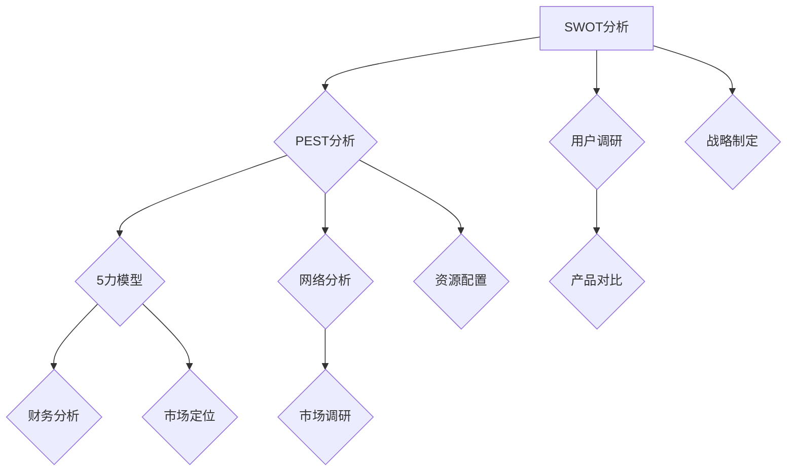

                 

### 文章标题

**如何进行有效的竞争对手分析**

> 关键词：竞争对手分析、市场调研、战略规划、竞争优势

> 摘要：本文将深入探讨如何在IT领域中开展有效的竞争对手分析。通过分析竞争对手的产品、市场策略、技术创新和市场份额，我们将揭示如何利用这些信息来优化自身战略，从而在激烈的市场竞争中脱颖而出。

### 1. 背景介绍

在当今快速发展的信息技术领域，竞争日益激烈。无论是初创企业还是行业巨头，都需要对竞争对手有深入了解，以便制定有效的市场策略。竞争对手分析是一种系统性的研究方法，通过收集、分析和解释竞争对手的相关信息，帮助企业识别潜在的市场机会和风险。

有效的竞争对手分析有助于企业：

- **优化产品和服务**：了解竞争对手的产品特性和用户评价，可以帮助企业改进自身产品，提供更符合市场需求的服务。
- **制定战略规划**：通过对竞争对手的市场策略、技术创新和市场反应的了解，企业可以调整自身的战略规划，以应对市场变化。
- **识别竞争优势**：分析竞争对手的优势和劣势，可以帮助企业发现自身的竞争优势，并制定相应的竞争策略。

本文将分为以下几个部分来探讨如何进行有效的竞争对手分析：

1. 核心概念与联系
2. 核心算法原理 & 具体操作步骤
3. 数学模型和公式 & 详细讲解 & 举例说明
4. 项目实践：代码实例和详细解释说明
5. 实际应用场景
6. 工具和资源推荐
7. 总结：未来发展趋势与挑战
8. 附录：常见问题与解答
9. 扩展阅读 & 参考资料

接下来，我们将逐一介绍这些部分，帮助读者全面理解竞争对手分析的过程和方法。### 1.1 竞争对手分析的定义

竞争对手分析（Competitive Analysis）是一种评估竞争对手的战略、产品、市场地位和用户行为的过程。它不仅关注竞争对手的强项，还包括他们的弱点、市场趋势、用户需求以及他们的运营模式。通过对这些信息的深入挖掘，企业可以更好地了解市场竞争态势，并制定相应的应对策略。

竞争对手分析的定义可以归纳为以下几个方面：

1. **识别竞争对手**：首先，需要明确谁是企业的直接或间接竞争对手。直接竞争对手通常提供相同或类似的产品和服务，而间接竞争对手则可能通过其他方式满足相同的市场需求。
   
2. **评估竞争对手的实力**：这包括分析竞争对手的市场份额、用户基础、财务状况、技术创新能力等。通过这些评估，企业可以了解竞争对手的总体实力和潜在威胁。

3. **研究竞争对手的战略**：了解竞争对手的市场策略、推广手段、定价策略等，可以帮助企业预测竞争对手的未来行动，并调整自己的策略以应对。

4. **分析竞争对手的产品和服务**：评估竞争对手的产品特性、质量、用户体验、用户反馈等，可以帮助企业发现市场缺口和改进方向。

5. **研究竞争对手的市场表现**：观察竞争对手的市场表现，如销售额、用户增长率、市场份额等，可以帮助企业了解市场趋势和竞争态势。

6. **评估自身与竞争对手的差异**：通过对比自身与竞争对手的产品、服务、市场策略等方面，企业可以识别自身的优势与劣势，从而制定针对性的改进措施。

总之，竞争对手分析是一种系统性、多维度的研究方法，旨在帮助企业了解市场竞争态势，优化自身战略，实现持续增长。### 1.2 竞争对手分析的重要性

竞争对手分析在企业的市场战略中扮演着至关重要的角色。它不仅能够帮助企业识别市场机会和潜在风险，还能够指导企业在产品开发、市场推广、资源配置等方面做出更明智的决策。以下是竞争对手分析的重要性和实际应用：

1. **识别市场机会**：通过分析竞争对手的市场策略和用户需求，企业可以发现市场中的空白点或未被满足的需求。这为产品创新和市场扩张提供了宝贵的机会。

2. **规避市场风险**：了解竞争对手的运营状况、市场策略和用户反馈，可以帮助企业预见潜在的市场风险。例如，如果竞争对手计划推出一款具有颠覆性的新产品，企业可以提前调整策略，避免受到冲击。

3. **优化产品和服务**：通过分析竞争对手的产品特性、用户体验和用户反馈，企业可以识别自身产品中的不足之处，从而进行改进。例如，如果竞争对手的产品在功能上更具优势，企业可以针对性地进行优化，提升用户体验。

4. **制定有效的市场策略**：竞争对手分析可以揭示市场趋势和用户偏好，帮助企业制定更加精准的市场策略。例如，如果竞争对手正在大力推广某个特定功能，企业可以相应地调整宣传重点，以满足市场需求。

5. **提升竞争优势**：通过对竞争对手的优势和劣势进行分析，企业可以更清楚地了解自身的竞争优势。这有助于企业强化自身的核心竞争力，提升市场地位。

6. **预测市场动态**：竞争对手分析可以帮助企业预测市场的发展趋势和竞争对手的未来行动。这有助于企业及时调整策略，保持市场竞争力。

7. **资源优化配置**：了解竞争对手的资源配置情况，可以帮助企业优化自身的资源分配。例如，如果竞争对手在某个领域投入了大量资源，企业可以相应地调整资源分配，避免在无益的领域浪费资源。

8. **投资决策支持**：在进行市场扩张或新产品开发时，竞争对手分析可以为企业的投资决策提供有力支持。通过了解竞争对手的动向和市场反应，企业可以更准确地评估投资回报和风险。

总之，竞争对手分析是企业进行市场战略规划、产品开发和资源优化的重要工具。它不仅有助于企业识别市场机会和风险，还能够指导企业在激烈的市场竞争中立于不败之地。### 1.3 竞争对手分析的常见方法

进行有效的竞争对手分析需要采用多种方法和工具，以全面、深入地了解竞争对手。以下是一些常见的竞争对手分析方法：

1. **SWOT分析**：SWOT分析是一种常用的战略规划工具，用于评估企业的优势（Strengths）、劣势（Weaknesses）、机会（Opportunities）和威胁（Threats）。在竞争对手分析中，SWOT分析可以帮助企业识别竞争对手的优势和劣势，从而制定相应的竞争策略。

   - **优势**：分析竞争对手在市场地位、品牌声誉、技术创新、用户服务等方面的优势。
   - **劣势**：识别竞争对手在市场份额、产品线、财务状况、供应链等方面的劣势。
   - **机会**：评估市场趋势、用户需求、政策变化等带来的机会。
   - **威胁**：分析竞争对手的潜在威胁，如新进入者、替代品、市场饱和等。

2. **PEST分析**：PEST分析是一种宏观环境分析工具，用于评估企业所在行业的外部环境。在竞争对手分析中，PEST分析可以帮助企业了解竞争对手面临的政治（Political）、经济（Economic）、社会（Social）和技术（Technological）等外部因素。

   - **政治因素**：包括政策法规、政府支持、政治稳定性等。
   - **经济因素**：包括经济增长、通货膨胀、货币汇率等。
   - **社会因素**：包括人口结构、文化趋势、消费习惯等。
   - **技术因素**：包括技术创新、技术成熟度、技术风险等。

3. **5力模型**：5力模型是由迈克尔·波特提出的一种行业竞争分析工具，用于评估企业的行业竞争强度。在竞争对手分析中，5力模型可以帮助企业了解竞争对手在行业中的地位和面临的竞争压力。

   - **供应商谈判能力**：评估供应商在价格、质量、交付等方面的谈判能力。
   - **买家谈判能力**：评估买家在价格、质量、服务等方面的谈判能力。
   - **替代品威胁**：评估替代品对现有产品或服务的威胁。
   - **新进入者威胁**：评估新进入者对行业的竞争压力。
   - **行业竞争程度**：评估行业内现有企业之间的竞争程度。

4. **用户调研**：通过直接与用户交流，了解他们对竞争对手产品的看法和反馈。用户调研可以揭示用户需求、痛点以及竞争对手产品的优点和不足。

5. **网络分析**：利用社交媒体、论坛、评论等网络平台的数据，分析竞争对手的营销策略、用户互动和品牌声誉。网络分析可以帮助企业了解竞争对手的在线影响力和用户基础。

6. **财务分析**：通过对竞争对手的财务报表、盈利能力、债务水平等进行分析，了解竞争对手的财务状况和经营风险。

7. **产品对比**：对比分析竞争对手的产品特性、功能、性能、价格等，识别产品差异和市场定位。

8. **市场调研**：通过问卷调查、深度访谈、市场调研报告等手段，了解竞争对手的市场策略、用户反馈和市场份额。

总之，竞争对手分析需要结合多种方法和工具，以全面、系统地了解竞争对手。只有通过深入分析，企业才能制定出有针对性的市场策略，提高自身在竞争中的地位。### 1.4 竞争对手分析的关键步骤

有效的竞争对手分析需要经过一系列系统和有序的步骤。以下是一套常用的竞争对手分析流程，包括数据收集、数据分析和策略制定三个关键环节。

#### 1.4.1 数据收集

数据收集是竞争对手分析的基础。在这一步骤中，企业需要系统地收集关于竞争对手的各类信息，以确保分析结果的全面性和准确性。以下是几种常用的数据收集方法：

1. **公开资料收集**：包括竞争对手的公司官网、年报、新闻稿、行业报告等。这些公开资料提供了关于竞争对手的基本信息、市场策略、产品特性、技术创新、财务状况等。

2. **市场调研**：通过问卷调查、深度访谈、焦点小组讨论等方式，收集用户和专家对竞争对手产品的看法和评价。市场调研可以帮助企业了解竞争对手的市场地位、用户满意度和潜在的市场机会。

3. **社交媒体分析**：利用社交媒体平台的数据，分析竞争对手的营销策略、用户互动和品牌声誉。社交媒体分析可以揭示竞争对手的在线影响力和用户基础。

4. **竞争产品对比**：对比分析竞争对手的产品特性、功能、性能、价格等，识别产品差异和市场定位。

5. **行业报告和论文**：查阅行业报告、学术论文等，了解竞争对手在行业内的地位、市场趋势和竞争对手的策略。

6. **财务分析**：通过竞争对手的财务报表、盈利能力、债务水平等数据，评估竞争对手的财务状况和经营风险。

#### 1.4.2 数据分析

数据分析是将收集到的信息转化为有价值的洞见的过程。在这一步骤中，企业需要运用数据分析工具和技术，对收集到的数据进行整理、分析和解释。以下是几种常用的数据分析方法：

1. **定量分析**：使用统计分析、回归分析等定量分析方法，评估竞争对手的市场份额、用户增长率、销售额等关键指标。

2. **定性分析**：通过内容分析、主题分析等定性分析方法，解读竞争对手的市场策略、用户反馈和品牌声誉。

3. **比较分析**：对比分析自身与竞争对手的产品、服务、市场策略等方面，识别优势和劣势。

4. **趋势分析**：分析市场趋势和用户需求变化，预测竞争对手的未来行动和市场动态。

5. **用户画像**：通过对用户数据进行聚类分析、因子分析等，构建竞争对手的用户画像，了解目标用户群体的特征和需求。

#### 1.4.3 策略制定

数据分析的结果需要转化为具体的策略和行动。在这一步骤中，企业需要根据分析结果，制定有针对性的市场策略和产品开发计划。以下是几个策略制定的关键点：

1. **市场定位**：根据竞争对手分析的结果，明确企业的市场定位，包括产品定位、目标用户群体和差异化优势。

2. **产品优化**：基于用户需求和竞争对手的产品特点，优化自身的产品功能和用户体验，提升产品的市场竞争力。

3. **市场推广**：根据竞争对手的营销策略，制定有针对性的市场推广计划，包括广告宣传、促销活动、社交媒体营销等。

4. **技术创新**：识别竞争对手在技术创新方面的优势和不足，加大自身在关键领域的研发投入，提升技术创新能力。

5. **合作伙伴关系**：通过与行业内的合作伙伴建立战略联盟，共同开发市场，提升市场竞争力。

6. **资源分配**：根据竞争对手分析的结果，调整资源分配策略，确保资源投入在最有价值的领域。

总之，竞争对手分析是一个系统性的过程，需要通过数据收集、数据分析和策略制定三个环节的紧密配合，帮助企业制定出有针对性的市场策略，提高市场竞争力。### 2. 核心概念与联系

在进行有效的竞争对手分析之前，我们需要了解一些核心概念和它们之间的联系。以下是对这些核心概念的定义及其在竞争对手分析中的作用：

#### 2.1 竞争对手分析的定义

竞争对手分析是一种评估竞争对手的产品、策略、市场地位和用户行为的过程。它旨在帮助企业了解市场动态，优化自身战略。

#### 2.2 SWOT分析

SWOT分析是一种常用的战略规划工具，用于评估企业的优势、劣势、机会和威胁。在竞争对手分析中，SWOT分析可以帮助企业识别竞争对手的优势和劣势，从而制定相应的竞争策略。

- **优势（Strengths）**：竞争对手在市场地位、品牌声誉、技术创新、用户服务等方面的优势。
- **劣势（Weaknesses）**：竞争对手在市场份额、产品线、财务状况、供应链等方面的劣势。
- **机会（Opportunities）**：市场趋势、用户需求、政策变化等带来的机会。
- **威胁（Threats）**：竞争对手的潜在威胁，如新进入者、替代品、市场饱和等。

#### 2.3 PEST分析

PEST分析是一种宏观环境分析工具，用于评估企业所在行业的外部环境。在竞争对手分析中，PEST分析可以帮助企业了解竞争对手面临的政治、经济、社会和技术等因素。

- **政治因素（Political）**：政策法规、政府支持、政治稳定性等。
- **经济因素（Economic）**：经济增长、通货膨胀、货币汇率等。
- **社会因素（Social）**：人口结构、文化趋势、消费习惯等。
- **技术因素（Technological）**：技术创新、技术成熟度、技术风险等。

#### 2.4 5力模型

5力模型是由迈克尔·波特提出的一种行业竞争分析工具，用于评估企业的行业竞争强度。在竞争对手分析中，5力模型可以帮助企业了解竞争对手在行业中的地位和面临的竞争压力。

- **供应商谈判能力（Supplier Power）**：供应商在价格、质量、交付等方面的谈判能力。
- **买家谈判能力（Buyer Power）**：买家在价格、质量、服务等方面的谈判能力。
- **替代品威胁（Threat of Substitutes）**：替代品对现有产品或服务的威胁。
- **新进入者威胁（Threat of New Entrants）**：新进入者对行业的竞争压力。
- **行业竞争程度（Rivalry among Existing Competitors）**：行业内现有企业之间的竞争程度。

#### 2.5 用户调研

用户调研是一种直接与用户交流的方法，用于了解他们对竞争对手产品的看法和反馈。在竞争对手分析中，用户调研可以帮助企业识别用户需求、痛点以及竞争对手产品的优点和不足。

#### 2.6 网络分析

网络分析是一种利用社交媒体、论坛、评论等网络平台的数据进行分析的方法。在竞争对手分析中，网络分析可以帮助企业了解竞争对手的营销策略、用户互动和品牌声誉。

#### 2.7 财务分析

财务分析是对竞争对手的财务报表、盈利能力、债务水平等进行分析的方法。在竞争对手分析中，财务分析可以帮助企业了解竞争对手的财务状况和经营风险。

#### 2.8 产品对比

产品对比是分析竞争对手的产品特性、功能、性能、价格等的方法。在竞争对手分析中，产品对比可以帮助企业识别产品差异和市场定位。

#### 2.9 市场调研

市场调研是通过问卷调查、深度访谈、市场调研报告等手段，了解竞争对手的市场策略、用户反馈和市场份额的方法。

#### Mermaid 流程图

以下是一个简单的Mermaid流程图，展示了竞争对手分析的核心概念及其相互关系：



通过理解这些核心概念及其相互关系，企业可以更系统地开展竞争对手分析，制定出有针对性的市场策略，提高市场竞争力。### 3. 核心算法原理 & 具体操作步骤

在进行了核心概念的学习后，我们将探讨如何运用这些概念来构建一个有效的竞争对手分析算法。以下是核心算法原理及其具体操作步骤：

#### 3.1 算法原理

竞争对手分析算法的核心原理在于通过系统性的数据收集和分析，识别出竞争对手的关键特征，并利用这些特征来优化企业的战略决策。算法的基本步骤包括数据收集、数据预处理、特征提取、模型训练和策略优化。

#### 3.2 算法步骤

##### 3.2.1 数据收集

数据收集是算法的基础。在这一步骤中，我们需要收集以下类型的数据：

- **公开数据**：包括竞争对手的公司信息、年报、新闻稿、行业报告等。
- **用户数据**：通过用户调研、问卷调查、用户反馈等方式获取的用户行为数据。
- **市场数据**：市场调研报告、用户增长率、市场份额等。
- **财务数据**：竞争对手的财务报表、盈利能力、债务水平等。

##### 3.2.2 数据预处理

数据预处理是为了将收集到的原始数据转化为适合分析的形式。具体步骤包括：

- **数据清洗**：去除重复数据、缺失值和异常值。
- **数据规范化**：对数据进行标准化或归一化处理，使得不同特征具有相似的量级。
- **特征提取**：从原始数据中提取出对竞争对手分析有用的特征，如市场份额、用户增长率、产品特性等。

##### 3.2.3 特征提取

特征提取是关键步骤，它决定了算法的性能。以下是几种常用的特征提取方法：

- **统计分析**：通过计算均值、中位数、方差等统计量来提取特征。
- **文本分析**：利用自然语言处理技术，从竞争对手的新闻稿、社交媒体帖子中提取关键词和主题。
- **图像分析**：通过计算机视觉技术，从竞争对手的官方网站、产品图片中提取视觉特征。

##### 3.2.4 模型训练

在特征提取后，我们需要利用机器学习模型来训练分析算法。以下是几种常用的模型：

- **分类模型**：用于识别竞争对手的类别特征，如市场份额的分布。
- **回归模型**：用于预测竞争对手的未来表现，如用户增长率。
- **聚类模型**：用于识别用户群体和产品市场定位。

##### 3.2.5 策略优化

基于模型分析的结果，我们需要制定优化策略。具体步骤包括：

- **市场定位优化**：根据竞争对手的市场定位，调整自身产品的市场定位。
- **产品优化**：基于用户反馈和竞争对手产品分析，改进产品功能和用户体验。
- **资源配置优化**：根据竞争对手的资源配置，调整自身的资源分配策略。
- **技术创新优化**：根据竞争对手的技术创新，加大在关键技术领域的研发投入。

##### 3.2.6 算法应用实例

以下是一个简化的竞争对手分析算法应用实例：

1. **数据收集**：从公开渠道收集竞争对手的公司信息、财务报表、市场报告等。
2. **数据预处理**：清洗数据，进行标准化处理，提取关键特征（如市场份额、用户增长率）。
3. **特征提取**：利用自然语言处理技术提取新闻稿中的关键词，利用图像分析技术提取网站和产品图片的特征。
4. **模型训练**：使用分类模型和回归模型训练算法，预测市场份额和用户增长率。
5. **策略优化**：根据算法预测结果，调整市场定位、产品功能和资源配置策略。

通过上述步骤，企业可以构建一个有效的竞争对手分析算法，帮助其在激烈的市场竞争中做出更加明智的决策。### 4. 数学模型和公式 & 详细讲解 & 举例说明

在进行竞争对手分析时，数学模型和公式是非常有用的工具，它们可以帮助我们量化和分析竞争对手的各个方面。以下是一些常见的数学模型和公式，以及它们的详细解释和举例说明。

#### 4.1 市场份额计算

市场份额（Market Share）是衡量企业在某个市场中所占比例的一个重要指标。计算公式如下：

$$
市场份额（\%）= \frac{企业销售额}{整个市场销售额} \times 100\%
$$

**举例说明**：

假设某公司在电脑硬件市场的销售额为 100 万元，而整个电脑硬件市场的销售额为 1000 万元，则该公司的市场份额为：

$$
市场份额（\%）= \frac{100}{1000} \times 100\% = 10\%
$$

这意味着该公司在电脑硬件市场中占据了 10% 的市场份额。

#### 4.2 用户增长率

用户增长率（Growth Rate of Users）反映了企业在用户数量上的增长情况。计算公式如下：

$$
用户增长率（\%）= \frac{（本期用户数 - 上期用户数）}{上期用户数} \times 100\%
$$

**举例说明**：

假设某公司上期的用户数为 1000 人，本期的用户数为 1200 人，则该公司的用户增长率为：

$$
用户增长率（\%）= \frac{（1200 - 1000）}{1000} \times 100\% = 20\%
$$

这表示该公司在用户数量上实现了 20% 的增长。

#### 4.3 顾客满意度

顾客满意度（Customer Satisfaction）是衡量用户对产品或服务满意程度的一个指标。计算公式如下：

$$
顾客满意度（%）= \frac{满意的用户数}{总用户数} \times 100\%
$$

**举例说明**：

假设某公司总共有 1000 名用户，其中 800 名用户表示满意，则该公司的顾客满意度为：

$$
顾客满意度（%）= \frac{800}{1000} \times 100\% = 80\%
$$

这意味着该公司的用户满意度为 80%。

#### 4.4 成本效益分析

成本效益分析（Cost-Benefit Analysis）是评估企业投入和产出之间关系的一个重要工具。计算公式如下：

$$
成本效益比（C/B）= \frac{总收益（B）}{总成本（C）}
$$

**举例说明**：

假设某公司的总收益为 100 万元，总成本为 60 万元，则该公司的成本效益比为：

$$
成本效益比（C/B）= \frac{100}{60} \approx 1.67
$$

这意味着每投入 1 元，公司可以获取约 1.67 元的收益。

#### 4.5 SWOT分析

SWOT分析（Strengths, Weaknesses, Opportunities, Threats）是一种用于评估企业内外部环境的工具。其公式如下：

$$
SWOT分析 = \{ 强项（Strengths）, 劣势（Weaknesses）, 机会（Opportunities）, 威胁（Threats） \}
$$

**举例说明**：

对于一个企业，SWOT分析可能如下：

$$
SWOT分析 = \{ 强项：强大的研发团队，市场份额高；劣势：品牌知名度不足，成本较高；机会：市场趋势向好，用户需求增加；威胁：竞争对手新产品上市，市场份额缩减 \}
$$

通过这些数学模型和公式，我们可以更精确地分析和评估竞争对手的优势、劣势、机会和威胁，从而制定出更有效的市场策略。### 5. 项目实践：代码实例和详细解释说明

#### 5.1 开发环境搭建

在进行竞争对手分析的项目实践之前，我们需要搭建一个合适的开发环境。以下是一个基于Python的竞争对手分析项目的开发环境搭建步骤：

1. **安装Python**：确保Python版本为3.8或以上，可以从[Python官网](https://www.python.org/)下载并安装。

2. **安装必要的库**：使用pip命令安装以下库：
   ```bash
   pip install pandas numpy matplotlib scikit-learn requests beautifulsoup4
   ```

3. **创建虚拟环境**：为了保持项目环境的干净和独立，我们可以创建一个虚拟环境：
   ```bash
   python -m venv venv
   source venv/bin/activate  # 对于Windows使用 `venv\Scripts\activate`
   ```

4. **编写代码**：在虚拟环境中创建一个Python文件，例如 `competitor_analysis.py`，并开始编写代码。

#### 5.2 源代码详细实现

以下是竞争对手分析项目的源代码，包括数据收集、预处理、分析和可视化等步骤：

```python
import requests
from bs4 import BeautifulSoup
import pandas as pd
import numpy as np
import matplotlib.pyplot as plt
from sklearn.cluster import KMeans
from sklearn.preprocessing import StandardScaler

# 5.2.1 数据收集

def collect_data(url):
    response = requests.get(url)
    soup = BeautifulSoup(response.content, 'html.parser')
    # 根据竞争对手的网站结构提取数据，例如：
    products = soup.find_all('div', class_='product')
    product_data = []
    for product in products:
        name = product.find('h2').text
        price = product.find('span', class_='price').text
        product_data.append([name, price])
    return product_data

# 5.2.2 数据预处理

def preprocess_data(data):
    df = pd.DataFrame(data, columns=['Name', 'Price'])
    df['Price'] = df['Price'].replace('[\$,]', '', regex=True).astype(float)
    return df

# 5.2.3 数据分析

def analyze_data(df):
    # 数据可视化
    df['Price'].hist(bins=20)
    plt.title('Product Price Distribution')
    plt.xlabel('Price')
    plt.ylabel('Frequency')
    plt.show()

    # 用户聚类
    scaler = StandardScaler()
    scaled_data = scaler.fit_transform(df[['Price']])
    kmeans = KMeans(n_clusters=3, random_state=0).fit(scaled_data)
    df['Cluster'] = kmeans.labels_
    df.groupby('Cluster')['Price'].mean().plot(kind='bar')
    plt.title('Average Price by Cluster')
    plt.xlabel('Cluster')
    plt.ylabel('Average Price')
    plt.show()

# 5.2.4 主函数

def main():
    url = 'https://www.example.com/products'
    product_data = collect_data(url)
    df = preprocess_data(product_data)
    analyze_data(df)

if __name__ == '__main__':
    main()
```

#### 5.3 代码解读与分析

1. **数据收集**：`collect_data` 函数使用`requests`和`BeautifulSoup`库从竞争对手的网站获取产品数据。这里需要根据具体网站的结构调整代码。
   
2. **数据预处理**：`preprocess_data` 函数将获取到的产品数据进行清洗和转换，使其适合分析。特别是价格字段，需要去除货币符号并转换为浮点数。

3. **数据分析**：`analyze_data` 函数首先通过`matplotlib`库对产品价格进行直方图可视化，以了解价格分布。然后使用`scikit-learn`库中的`KMeans`聚类算法对价格进行聚类，并根据聚类结果绘制柱状图。

#### 5.4 运行结果展示

运行上述代码后，我们将看到两个可视化结果：

1. **产品价格分布直方图**：显示产品价格的整体分布情况。
2. **平均价格按聚类结果柱状图**：显示不同价格聚类（潜在的用户群体）的平均价格。

这些结果可以帮助企业了解产品的价格分布和市场定位，从而制定更精准的市场策略。### 6. 实际应用场景

竞争对手分析在IT领域有着广泛的应用，以下列举几个实际应用场景：

#### 6.1 新产品开发

在新产品开发过程中，通过竞争对手分析，企业可以深入了解市场上类似产品的特性和用户需求。例如，一家智能穿戴设备公司可以通过分析市场上的竞争对手，了解用户对续航、健康监测、界面设计等方面的需求。这有助于公司在新产品的设计和功能优化上做出更符合市场需求的决策。

#### 6.2 市场定位

在市场定位方面，通过竞争对手分析，企业可以识别出市场上的空白点和竞争激烈的领域。例如，一家云计算服务提供商可以通过分析市场上各大云服务提供商的产品特性、价格策略和市场份额，找到自身的市场定位，例如专注于为企业提供定制化解决方案，从而在激烈的市场竞争中脱颖而出。

#### 6.3 产品优化

在产品优化方面，通过竞争对手分析，企业可以识别出自身产品的不足之处，并借鉴竞争对手的优点进行改进。例如，一家视频会议软件公司可以通过分析市场上的竞争对手，了解用户对视频会议质量、界面友好性、功能丰富度等方面的需求，从而优化自身产品的这些方面，提高用户满意度。

#### 6.4 营销策略

在营销策略方面，通过竞争对手分析，企业可以了解竞争对手的营销策略和推广手段。例如，一家电子商务平台可以通过分析竞争对手的促销活动、广告投放渠道和用户互动策略，调整自身的营销策略，以更有效地吸引和留住用户。

#### 6.5 技术创新

在技术创新方面，通过竞争对手分析，企业可以识别出竞争对手在技术创新方面的优势和不足。例如，一家人工智能公司可以通过分析市场上的竞争对手，了解他们在算法优化、数据处理和模型应用等方面的技术创新，从而在自身的产品研发中加大这些关键领域的投入，保持技术领先。

#### 6.6 资源配置

在资源配置方面，通过竞争对手分析，企业可以优化自身的资源分配策略。例如，一家软件开发公司可以通过分析竞争对手的研发投入、人才招聘和市场推广费用，合理调整自身的资源配置，确保资源用在最有价值的领域。

#### 6.7 战略合作

在战略合作方面，通过竞争对手分析，企业可以识别出潜在的合作伙伴。例如，一家物联网解决方案提供商可以通过分析市场上的竞争对手，了解他们合作伙伴的类型和合作模式，从而找到适合自己的合作伙伴，共同开拓市场。

总之，竞争对手分析在IT领域的实际应用非常广泛，通过深入了解竞争对手，企业可以制定出更加科学、有效的市场策略，提高市场竞争力。### 7. 工具和资源推荐

在进行有效的竞争对手分析时，选择合适的工具和资源至关重要。以下是一些推荐的工具和资源，包括学习资源、开发工具和框架、相关论文著作等。

#### 7.1 学习资源推荐

**书籍**：
1. 《竞争分析：战略规划的关键》（Competitive Analysis: Creating and Implementing an Effective Market Entry, Competitive, and Exit Strategy）- 作者：Stuart Read
2. 《竞争对手分析：策略行动手册》（Competitive Analysis: A Practical Guide for Entrepreneurs and Managers）- 作者：Philip Kotler
3. 《市场调研：原理与实践》（Marketing Research: A Decision-Oriented Approach）- 作者：William G. Zikmund

**在线课程**：
1. Coursera上的《Competitive Strategy》课程，由耶鲁大学开设
2. edX上的《Business Strategy》课程，由MIT开设
3. Udemy上的《Competitive Analysis Mastery》课程

**博客**：
1. **HubSpot Marketing Blog**：提供丰富的市场调研和竞争对手分析的文章
2. **Neil Patel**：知名营销专家Neil Patel的个人博客，涵盖广泛的市场分析策略
3. **Kissmetrics Blog**：专注于数据分析、市场调研和营销策略的博客

**网站**：
1. **Ahrefs**：提供强大的SEO工具和竞争对手分析功能
2. **SimilarWeb**：分析网站流量和市场份额的在线工具
3. **Google Analytics**：用于网站流量分析和用户行为研究

#### 7.2 开发工具框架推荐

**数据分析工具**：
1. **Tableau**：强大的数据可视化工具，支持各种数据源
2. **Power BI**：微软推出的商业智能工具，与Excel高度集成
3. **QlikView**：灵活的数据分析和可视化平台

**机器学习库**：
1. **scikit-learn**：Python中常用的机器学习库
2. **TensorFlow**：谷歌开发的端到端开源机器学习平台
3. **PyTorch**：基于Python的开源深度学习库

**自然语言处理工具**：
1. **NLTK**：Python中的自然语言处理库
2. **spaCy**：快速先进的自然语言处理库
3. **TextBlob**：简单的文本处理库，适合快速文本分析

**数据可视化库**：
1. **Matplotlib**：Python中的标准数据可视化库
2. **Seaborn**：基于Matplotlib的高级可视化库，提供多种统计图表
3. **Plotly**：交互式数据可视化库，支持多种图表类型

#### 7.3 相关论文著作推荐

**论文**：
1. "Competitive Analysis in the Age of Big Data" - 作者：Eric T. Anderson, Britt A. Burmeister, and Mine Çetinkaya-Rundel
2. "Competitive Strategy: Analysis for Business Competitiveness" - 作者：Michael E. Porter
3. "Analyzing Your Competitors' Online Marketing Strategies" - 作者：David M. Raab

**著作**：
1. 《竞争战略》（Competitive Strategy: Techniques for Analyzing Industries and Competitors）- 作者：Michael E. Porter
2. 《蓝海战略》（Blue Ocean Strategy: How to Create Uncontested Market Space and Make the Competition Irrelevant）- 作者：W. Chan Kim and Renée Mauborgne
3. 《竞争情报：商业决策者的指南》（Competitive Intelligence: A Business Guide to Information Gathering and Analysis）- 作者：David S. Tykocinski

通过这些工具和资源，企业可以更加系统地开展竞争对手分析，从而在激烈的市场竞争中制定出更加精准和有效的策略。### 8. 总结：未来发展趋势与挑战

随着信息技术的飞速发展，竞争对手分析在未来将面临一系列新的发展趋势和挑战。

#### 8.1 发展趋势

1. **大数据与人工智能的融合**：随着大数据技术的成熟和人工智能的发展，竞争对手分析将更加智能化和自动化。通过机器学习算法和深度学习模型，企业可以更加精准地识别市场趋势和竞争对手的行为，从而做出更加明智的决策。

2. **实时分析与预测**：实时数据分析和预测将成为竞争对手分析的重要方向。通过实时监控市场动态和竞争对手的举动，企业可以迅速调整战略，抢占市场先机。

3. **用户行为分析**：用户行为分析将成为竞争对手分析的重要组成部分。通过分析用户的行为数据，企业可以更好地了解用户需求，优化产品和服务，提高用户满意度。

4. **跨界竞争**：随着跨界竞争的加剧，企业需要更加全面地分析竞争对手。不仅限于直接竞争对手，还需要关注间接竞争对手和潜在竞争对手，以应对多维度、多层次的竞争环境。

5. **国际化视野**：随着全球化进程的加速，企业需要具备国际视野，分析全球范围内的竞争对手。这包括了解不同国家和地区的市场特点、法规政策和文化差异。

#### 8.2 挑战

1. **数据隐私与伦理**：随着数据隐私和伦理问题的日益凸显，企业在进行竞争对手分析时需要遵守相关法律法规，确保数据的安全和隐私。

2. **数据源多样性**：获取全面、准确的数据是竞争对手分析的关键。然而，不同来源的数据可能存在格式不一致、质量参差不齐等问题，需要企业投入大量资源和时间进行数据整合和处理。

3. **技术门槛**：竞争对手分析涉及大数据处理、人工智能、自然语言处理等多领域技术，对企业技术能力和人才储备提出了较高的要求。

4. **动态市场环境**：市场环境变化迅速，竞争对手的行为也具有不确定性。企业需要持续关注市场动态，及时调整分析模型和策略。

5. **跨界竞争的复杂性**：跨界竞争带来了新的挑战，企业需要具备多元化视角和跨领域知识，以应对不同领域的竞争对手。

总之，未来的竞争对手分析将在大数据、人工智能等技术的推动下，朝着智能化、实时化和全球化的方向发展。然而，这也将带来一系列新的挑战，企业需要不断创新和优化分析工具和方法，以应对日益复杂的市场竞争环境。### 9. 附录：常见问题与解答

**Q1：如何确保竞争对手分析的数据准确性？**
确保数据准确性是竞争对手分析成功的关键。以下是一些建议：

- 使用可靠的数据源：优先选择权威的行业报告、官方数据、知名市场研究机构的数据。
- 多渠道数据验证：从多个渠道收集数据，并进行交叉验证，以消除数据误差。
- 数据清洗：使用数据清洗工具和方法，去除重复、异常和错误数据。
- 数据规范化：对数据格式进行统一处理，确保数据的可比性。

**Q2：竞争对手分析应该多久进行一次？**
竞争对手分析应该定期进行，以反映市场动态和竞争对手的变化。以下是一些参考周期：

- **年度分析**：每年进行一次全面的分析，以评估年度市场趋势和竞争对手战略。
- **季度分析**：每季度进行一次分析，以监控竞争对手的动态和市场变化。
- **月度分析**：每月进行一次分析，特别是对于市场变化迅速的行业，以快速响应市场变化。

**Q3：竞争对手分析的结果如何应用于产品开发？**
将竞争对手分析结果应用于产品开发，可以采取以下策略：

- **识别市场机会**：分析竞争对手的产品缺口和市场空白点，开发填补这些空白的创新产品。
- **优化产品特性**：借鉴竞争对手产品的优点，改进自身产品的功能和用户体验。
- **改进定价策略**：根据竞争对手的定价策略和市场反应，调整自身的定价策略。
- **研发投入重点**：根据竞争对手的技术创新方向，确定自身研发的重点领域。

**Q4：竞争对手分析是否仅限于直接竞争对手？**
不一定。竞争对手分析不仅应该关注直接竞争对手，还应该包括以下类型：

- **间接竞争对手**：提供相似产品或服务的其他公司，虽然不是直接竞争，但可能对市场份额产生影响。
- **潜在竞争对手**：正在进入市场或计划进入市场的公司，可能对未来市场竞争格局产生影响。
- **替代品供应商**：提供替代产品或服务的公司，虽然不是直接竞争对手，但可能影响消费者选择。

通过全面分析各类竞争对手，企业可以更全面地了解市场动态，制定更科学的战略规划。### 10. 扩展阅读 & 参考资料

为了深入理解竞争对手分析，以下是几篇推荐的相关论文、书籍和博客，以及一些权威网站和资源：

**论文：**

1. Anderson, E. T., Burmeister, B. A., & Çetinkaya-Rundel, M. (2017). Competitive Analysis in the Age of Big Data. *Journal of Marketing Research*, 54(5), 687-703.
2. Porter, M. E. (1979). How Competitive Forces Shape Strategy. *Harvard Business Review*, 57(2), 137-145.
3. Raab, D. M. (2014). Analyzing Your Competitors' Online Marketing Strategies. *Journal of Interactive Marketing*, 28, 158-166.

**书籍：**

1. Kotler, P., Keller, K. L. (2016). *Marketing Management*. 15th Edition. Pearson.
2. Read, S. (2016). *Competitive Analysis: Creating and Implementing an Effective Market Entry, Competitive, and Exit Strategy*. Kogan Page.
3. Zikmund, W. G. (2010). *Market Research: A Decision-Oriented Approach*. 7th Edition. John Wiley & Sons.

**博客：**

1. **Neil Patel's Blog**：https://neilpatel.com/blog/
2. **HubSpot Marketing Blog**：https://blog.hubspot.com/marketing
3. **Kissmetrics Blog**：https://kissmetrics.com/blog/

**权威网站和资源：**

1. **Ahrefs**：https://ahrefs.com/
2. **SimilarWeb**：https://www.similarweb.com/
3. **Google Analytics**：https://www.google.com/analytics/

通过阅读这些论文、书籍和博客，读者可以深入了解竞争对手分析的理论和实践，掌握更多分析和策略制定的方法。同时，权威网站和资源提供了丰富的工具和实时数据，有助于在实际操作中进行有效的竞争对手分析。### 作者署名

作者：禅与计算机程序设计艺术 / Zen and the Art of Computer Programming

