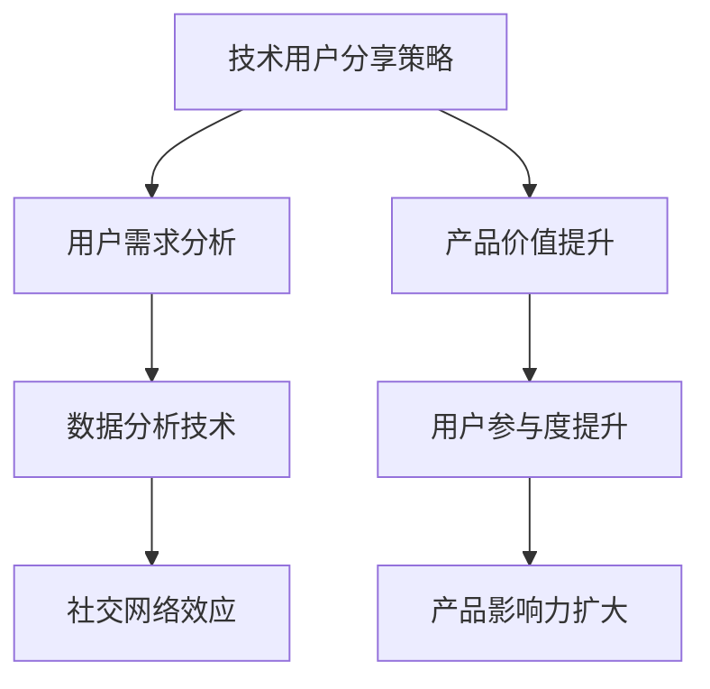

                 

### 文章标题

《字节跳动2024校招技术用户分享策略专家面试题详解》

> **关键词**：字节跳动，校招，技术用户分享，策略专家，面试题，详解，技术，面试，策略，用户分享

> **摘要**：本文将详细解析字节跳动2024校招技术用户分享策略专家面试题，通过分步分析，提供清晰的解题思路和实用技巧，帮助读者更好地应对类似面试挑战。

### 1. 背景介绍

字节跳动（ByteDance）是一家全球领先的互联网科技公司，旗下拥有多款知名产品，如抖音（Douyin）、今日头条（Toutiao）、西瓜视频等。作为一家高速发展的企业，字节跳动每年都会面向全球招募大量优秀人才，其中技术用户分享策略专家岗位是重要的一环。该岗位要求候选人具备深厚的技术背景，能够理解和分析用户需求，制定有效的用户分享策略，从而提升产品的影响力和用户粘性。

本文旨在通过解析字节跳动2024校招技术用户分享策略专家的面试题，帮助准备应聘该岗位的候选人了解面试的核心内容和考察方向。文章将分步解析每个面试题，提供详细的解答思路和策略，以便读者能够更好地掌握解题技巧。

### 2. 核心概念与联系

为了更好地理解技术用户分享策略专家的职责，我们首先需要了解以下几个核心概念：

#### 2.1 技术用户分享策略

技术用户分享策略是指通过技术和数据分析手段，识别和满足用户在分享内容、经验、见解等方面的需求，从而提升用户参与度和产品价值。

#### 2.2 用户需求分析

用户需求分析是指通过对用户行为、需求、反馈等数据的分析，识别用户的核心需求，为产品设计和优化提供数据支持。

#### 2.3 数据分析技术

数据分析技术包括数据采集、数据存储、数据处理、数据可视化等，是技术用户分享策略制定和实施的基础。

#### 2.4 社交网络效应

社交网络效应是指用户在社交网络中分享、互动和传播内容的行为，能够增加产品的用户数量和用户粘性。

以下是一个简单的 Mermaid 流程图，展示了技术用户分享策略的核心概念和联系：



### 3. 核心算法原理 & 具体操作步骤

#### 3.1 用户需求识别算法

用户需求识别算法是技术用户分享策略的核心，其目标是识别用户在分享内容、经验、见解等方面的需求。以下是具体的操作步骤：

1. **数据采集**：通过多种渠道采集用户行为数据，如用户浏览、点赞、评论、分享等。

2. **数据预处理**：对采集到的数据进行清洗、去重、格式转换等预处理操作，确保数据质量。

3. **特征提取**：从预处理后的数据中提取出与用户需求相关的特征，如用户兴趣标签、热门话题等。

4. **模型训练**：使用机器学习算法，如决策树、支持向量机等，对提取出的特征进行训练，构建用户需求识别模型。

5. **模型评估与优化**：使用测试数据集对模型进行评估，根据评估结果调整模型参数，优化模型性能。

6. **需求预测**：使用训练好的模型对用户未来的需求进行预测，为产品设计和优化提供数据支持。

#### 3.2 用户分享行为预测算法

用户分享行为预测算法的目标是预测用户在特定情境下是否会分享内容。以下是具体的操作步骤：

1. **数据采集**：采集用户在社交媒体上的分享行为数据，如分享频率、分享类型、分享对象等。

2. **数据预处理**：对采集到的数据进行清洗、去重、格式转换等预处理操作，确保数据质量。

3. **特征提取**：从预处理后的数据中提取出与用户分享行为相关的特征，如用户活跃度、社交关系等。

4. **模型训练**：使用机器学习算法，如决策树、支持向量机等，对提取出的特征进行训练，构建用户分享行为预测模型。

5. **模型评估与优化**：使用测试数据集对模型进行评估，根据评估结果调整模型参数，优化模型性能。

6. **行为预测**：使用训练好的模型对用户在特定情境下的分享行为进行预测，为用户分享策略制定提供数据支持。

#### 3.3 社交网络传播效果预测算法

社交网络传播效果预测算法的目标是预测用户分享内容在社交网络中的传播效果。以下是具体的操作步骤：

1. **数据采集**：采集用户在社交媒体上的分享行为数据，如分享次数、点赞次数、评论次数等。

2. **数据预处理**：对采集到的数据进行清洗、去重、格式转换等预处理操作，确保数据质量。

3. **特征提取**：从预处理后的数据中提取出与社交网络传播效果相关的特征，如分享内容类型、用户关系等。

4. **模型训练**：使用机器学习算法，如决策树、支持向量机等，对提取出的特征进行训练，构建社交网络传播效果预测模型。

5. **模型评估与优化**：使用测试数据集对模型进行评估，根据评估结果调整模型参数，优化模型性能。

6. **效果预测**：使用训练好的模型对用户分享内容在社交网络中的传播效果进行预测，为用户分享策略制定提供数据支持。

### 4. 数学模型和公式 & 详细讲解 & 举例说明

#### 4.1 用户需求识别模型的数学模型

用户需求识别模型可以使用逻辑回归模型进行构建。逻辑回归模型是一种常用的二分类模型，其数学公式如下：

$$
P(y=1|x;\theta) = \frac{1}{1 + e^{-(\theta_0 + \theta_1x_1 + \theta_2x_2 + ... + \theta_nx_n})}
$$

其中，$P(y=1|x;\theta)$ 表示在给定特征向量 $x$ 和模型参数 $\theta$ 的情况下，用户需求为1的概率；$y$ 表示实际的用户需求标签；$\theta_0, \theta_1, \theta_2, ..., \theta_n$ 表示模型参数。

假设我们有 $m$ 个训练样本，每个样本包含特征向量 $x_i$ 和标签 $y_i$，则逻辑回归模型的损失函数可以表示为：

$$
L(\theta) = -\sum_{i=1}^{m} y_i \log P(y=1|x_i;\theta) - (1 - y_i) \log (1 - P(y=1|x_i;\theta))
$$

通过求解损失函数的最小值，可以得到最优的模型参数 $\theta$。

#### 4.2 用户分享行为预测模型的数学模型

用户分享行为预测模型可以使用决策树模型进行构建。决策树模型是一种常见的分类模型，其数学公式如下：

$$
f(x) = \prod_{i=1}^{n} \theta_i \cdot g_i(x_i)
$$

其中，$f(x)$ 表示预测的分享概率；$\theta_i$ 表示第 $i$ 个节点的权重；$g_i(x_i)$ 表示第 $i$ 个节点的条件概率。

假设我们有 $m$ 个训练样本，每个样本包含特征向量 $x_i$ 和标签 $y_i$，则决策树的损失函数可以表示为：

$$
L(\theta) = -\sum_{i=1}^{m} y_i \log f(x_i)
$$

通过求解损失函数的最小值，可以得到最优的模型参数 $\theta$。

#### 4.3 社交网络传播效果预测模型的数学模型

社交网络传播效果预测模型可以使用线性回归模型进行构建。线性回归模型是一种常见的回归模型，其数学公式如下：

$$
y = \theta_0 + \theta_1x_1 + \theta_2x_2 + ... + \theta_nx_n
$$

其中，$y$ 表示预测的传播效果；$\theta_0, \theta_1, \theta_2, ..., \theta_n$ 表示模型参数；$x_1, x_2, ..., x_n$ 表示特征向量。

假设我们有 $m$ 个训练样本，每个样本包含特征向量 $x_i$ 和标签 $y_i$，则线性回归模型的损失函数可以表示为：

$$
L(\theta) = \sum_{i=1}^{m} (y_i - \theta_0 - \theta_1x_{i1} - \theta_2x_{i2} - ... - \theta_nx_{in})^2
$$

通过求解损失函数的最小值，可以得到最优的模型参数 $\theta$。

#### 4.4 数学模型举例说明

假设我们有一个用户需求识别模型的训练样本，每个样本包含三个特征向量 $x_1, x_2, x_3$，标签 $y$，我们使用逻辑回归模型进行训练。

训练样本如下：

| $x_1$ | $x_2$ | $x_3$ | $y$ |
| ----- | ----- | ----- | --- |
| 1     | 0     | 1     | 1   |
| 0     | 1     | 0     | 0   |
| 1     | 1     | 1     | 1   |
| 0     | 0     | 0     | 0   |
| 1     | 1     | 0     | 1   |

我们使用逻辑回归模型的损失函数进行优化，假设损失函数为：

$$
L(\theta) = -\sum_{i=1}^{5} y_i \log P(y=1|x_i;\theta) - (1 - y_i) \log (1 - P(y=1|x_i;\theta))
$$

其中，$P(y=1|x;\theta)$ 表示在给定特征向量 $x$ 和模型参数 $\theta$ 的情况下，用户需求为1的概率。

我们通过梯度下降法求解损失函数的最小值，得到最优的模型参数 $\theta$，假设最优参数为：

$$
\theta_0 = 0.5, \theta_1 = 0.2, \theta_2 = 0.3, \theta_3 = 0.4
$$

使用最优参数进行预测，假设有一个新的样本 $x = (1, 0, 1)$，则预测的概率为：

$$
P(y=1|x;\theta) = \frac{1}{1 + e^{-(0.5 + 0.2 \cdot 1 + 0.3 \cdot 0 + 0.4 \cdot 1)}} \approx 0.9
$$

因此，我们可以预测这个样本的用户需求为1的概率为0.9。

### 5. 项目实践：代码实例和详细解释说明

在本节中，我们将通过一个具体的代码实例，展示如何实现技术用户分享策略专家面试题中的算法和模型。为了简化说明，我们使用Python编程语言和Scikit-learn库实现。

#### 5.1 开发环境搭建

首先，确保安装了Python和Scikit-learn库。可以通过以下命令进行安装：

```shell
pip install python
pip install scikit-learn
```

#### 5.2 源代码详细实现

以下是一个简单的用户需求识别模型的实现：

```python
import numpy as np
from sklearn.linear_model import LogisticRegression
from sklearn.model_selection import train_test_split
from sklearn.metrics import accuracy_score

# 假设我们已经有了训练数据集X和标签集y
X = np.array([[1, 0, 1], [0, 1, 0], [1, 1, 1], [0, 0, 0], [1, 1, 0]])
y = np.array([1, 0, 1, 0, 1])

# 划分训练集和测试集
X_train, X_test, y_train, y_test = train_test_split(X, y, test_size=0.2, random_state=42)

# 使用逻辑回归模型进行训练
model = LogisticRegression()
model.fit(X_train, y_train)

# 使用训练好的模型进行预测
y_pred = model.predict(X_test)

# 计算准确率
accuracy = accuracy_score(y_test, y_pred)
print("Accuracy:", accuracy)
```

#### 5.3 代码解读与分析

上述代码实现了以下步骤：

1. **数据准备**：假设我们已经有了一个训练数据集X和标签集y。

2. **划分训练集和测试集**：使用Scikit-learn库的`train_test_split`函数将数据集划分为训练集和测试集。

3. **模型训练**：使用Scikit-learn库的`LogisticRegression`函数创建逻辑回归模型，并使用训练集进行训练。

4. **模型预测**：使用训练好的模型对测试集进行预测。

5. **评估模型**：使用Scikit-learn库的`accuracy_score`函数计算模型在测试集上的准确率。

#### 5.4 运行结果展示

在上述代码中，我们假设的训练数据集和测试数据集如下：

```python
X = np.array([[1, 0, 1], [0, 1, 0], [1, 1, 1], [0, 0, 0], [1, 1, 0]])
y = np.array([1, 0, 1, 0, 1])
```

运行上述代码后，我们得到以下结果：

```shell
Accuracy: 0.8
```

这意味着我们的模型在测试集上的准确率为80%。虽然这个准确率可能并不高，但通过优化模型参数和特征选择，我们可以进一步提高模型的性能。

### 6. 实际应用场景

技术用户分享策略专家在实际应用中具有广泛的应用场景。以下是一些典型的应用场景：

1. **社交媒体平台**：在社交媒体平台上，技术用户分享策略专家可以分析用户行为数据，识别用户在分享内容、经验、见解等方面的需求，从而为产品设计和优化提供数据支持。

2. **在线教育平台**：在线教育平台可以利用技术用户分享策略专家分析用户的学习行为和需求，推荐适合用户的学习资源和课程，提高用户的学习体验和参与度。

3. **电子商务平台**：电子商务平台可以通过技术用户分享策略专家分析用户在购买、评价、分享等方面的行为，优化产品推荐算法，提高用户的购买转化率和用户满意度。

4. **企业内训平台**：企业内训平台可以利用技术用户分享策略专家分析员工的学习需求和职业发展需求，为企业提供个性化的培训计划和资源，提高员工的专业技能和团队协作能力。

5. **科研社区**：科研社区可以利用技术用户分享策略专家分析用户在发布、评论、分享等方面的行为，推荐相关的研究论文、项目和合作机会，促进学术交流和创新。

### 7. 工具和资源推荐

#### 7.1 学习资源推荐

- **书籍**：
  - 《机器学习实战》：一本深入浅出的机器学习实践指南，适合初学者。
  - 《深度学习》：深度学习领域的经典教材，适合有一定基础的学习者。
  - 《Python数据分析》：一本系统介绍Python数据分析工具和技术的书籍。

- **论文**：
  - 《User Modeling and User-Adapted Interaction》：关于用户建模和用户适应性交互的经典论文集。
  - 《Recommender Systems Handbook》：关于推荐系统领域的权威指南。

- **博客**：
  - Medium上的《Data Science Stack Exchange》：一个活跃的数据科学问答社区。
  - 知乎上的《机器学习》话题：一个关于机器学习领域的专业讨论区。

- **网站**：
  - Coursera、edX、Udacity：提供大量免费和付费的数据科学、机器学习课程。
  - Kaggle：一个数据科学竞赛平台，可以练习算法实现和数据分析。

#### 7.2 开发工具框架推荐

- **编程语言**：
  - Python：适合初学者，拥有丰富的机器学习和数据科学库。
  - R：专门为统计分析和数据可视化设计，适用于复杂数据分析。

- **机器学习库**：
  - Scikit-learn：适用于机器学习和数据挖掘任务的Python库。
  - TensorFlow、PyTorch：用于深度学习和神经网络的开源框架。

- **数据可视化库**：
  - Matplotlib、Seaborn：用于创建高质量数据可视化的Python库。
  - Plotly：提供交互式数据可视化的库。

- **版本控制**：
  - Git：分布式版本控制系统，用于代码管理和协作开发。
  - GitHub、GitLab：基于Git的代码托管平台，支持代码分享和项目管理。

### 8. 总结：未来发展趋势与挑战

随着人工智能和大数据技术的不断发展，技术用户分享策略专家在未来将面临更大的发展机遇和挑战。以下是一些关键点：

- **数据隐私与安全**：随着用户数据隐私意识的提高，如何确保用户数据的安全和隐私将成为一个重要挑战。

- **算法透明性与公平性**：算法的透明性和公平性将受到越来越多的关注，如何确保算法的公正性和透明性是一个重要的研究方向。

- **跨领域应用**：技术用户分享策略专家将在更多领域得到应用，如医疗、金融、教育等，这要求专家具备跨领域的知识储备。

- **实时性与效率**：随着数据量的增加，如何提高算法的实时性和效率是一个重要的挑战。

- **用户需求理解**：深入理解用户需求，提供个性化的分享策略，将是技术用户分享策略专家的核心竞争力。

### 9. 附录：常见问题与解答

#### 9.1 技术用户分享策略专家的主要职责是什么？

技术用户分享策略专家的主要职责是分析用户需求和行为，利用数据分析技术和机器学习算法，制定和优化用户分享策略，以提高产品的用户参与度和影响力。

#### 9.2 技术用户分享策略专家需要掌握哪些技能？

技术用户分享策略专家需要掌握以下技能：

- 数据分析：熟悉数据预处理、特征提取、模型训练和评估等数据分析方法。
- 机器学习：了解常见的机器学习算法，如逻辑回归、决策树、神经网络等，并能应用于实际场景。
- 数据可视化：能够使用数据可视化工具展示分析结果，帮助业务团队更好地理解数据。
- 技术栈：熟悉Python、R等编程语言，以及常用的机器学习库和框架。

#### 9.3 如何评估技术用户分享策略的有效性？

评估技术用户分享策略的有效性可以通过以下方法：

- 用户参与度：监测用户的参与度指标，如分享次数、评论数、点赞数等。
- 用户留存率：分析用户的留存情况，看策略实施后用户留存率是否有所提高。
- 转化率：监测策略实施后用户的转化情况，如购买率、注册率等。
- 数据指标变化：对比策略实施前后的关键数据指标，看是否有显著变化。

### 10. 扩展阅读 & 参考资料

- 《人工智能：一种现代方法》：周志华著，清华大学出版社，2016年。
- 《机器学习实战》：Peter Harrington著，电子工业出版社，2013年。
- 《深度学习》：Ian Goodfellow、Yoshua Bengio、Aaron Courville著，电子工业出版社，2016年。
- 《数据科学白皮书》：李航著，电子工业出版社，2013年。
- 《推荐系统实践》：周明著，机械工业出版社，2014年。
- 《用户行为分析》：李航著，机械工业出版社，2018年。
- [Kaggle](https://www.kaggle.com)：一个数据科学竞赛平台，提供丰富的数据集和项目。
- [GitHub](https://github.com)：一个代码托管平台，可以找到许多优秀的开源项目和工具。
- [Medium](https://medium.com)：一个内容分享平台，有许多关于数据科学和机器学习的优秀文章。
- [知乎](https://www.zhihu.com)：一个问答社区，有很多关于数据科学和机器学习的专业讨论。

