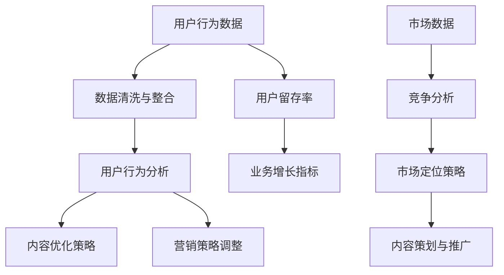
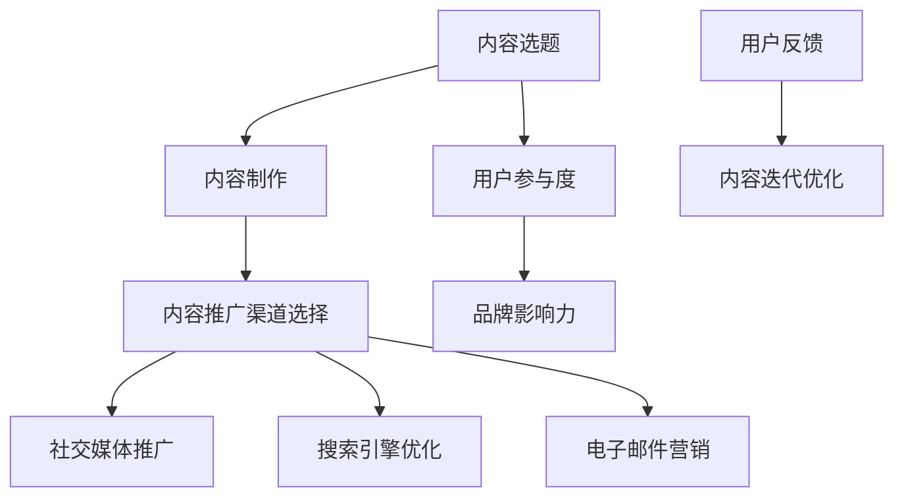
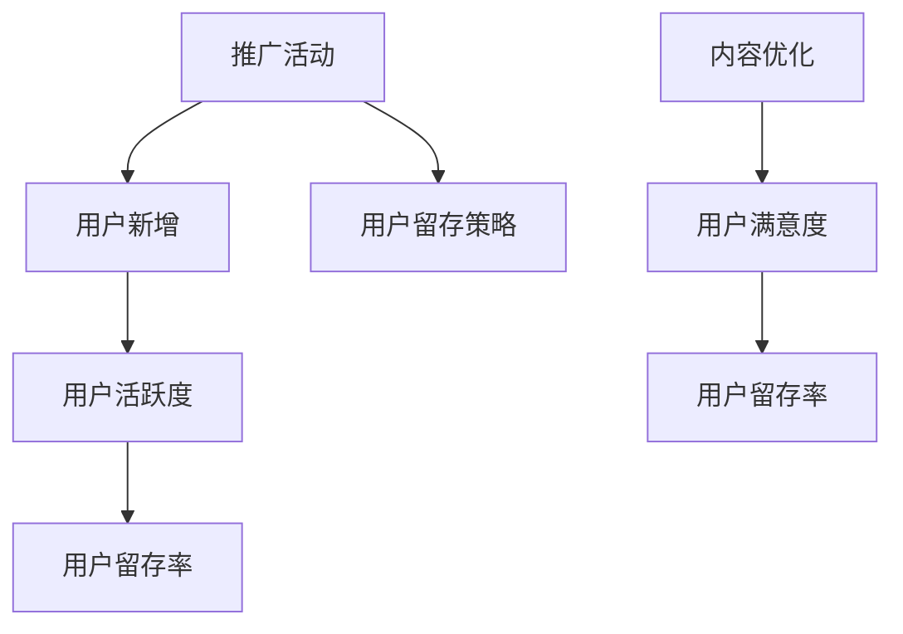
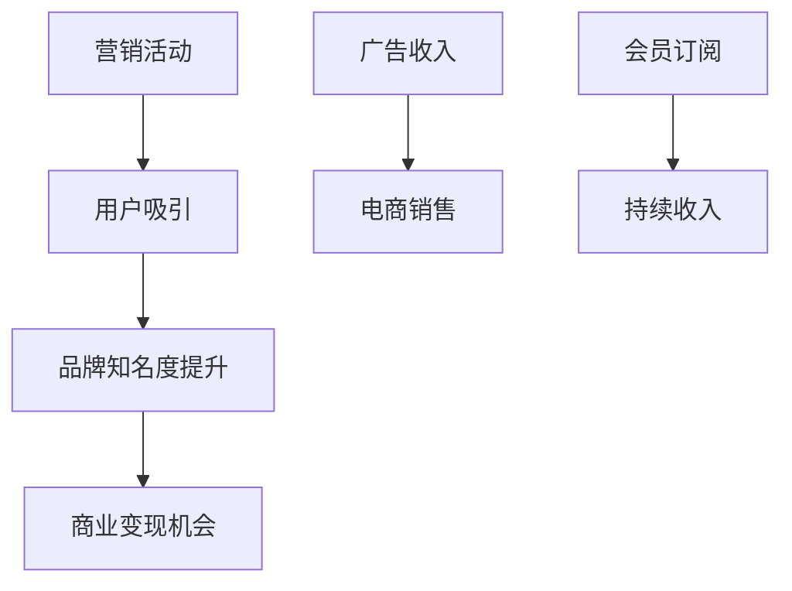

                 

## 1. 背景介绍

### 字节跳动校招运营岗位简介

字节跳动，作为国内领先的互联网科技公司，以其卓越的技术实力和创新的商业模式赢得了全球用户的喜爱。字节跳动的招聘体系在业界享有盛誉，特别是在校招方面，其对运营岗位的选拔尤为严格和细致。运营岗位在字节跳动扮演着至关重要的角色，不仅涉及内容运营、用户运营、社区运营等多个维度，还直接影响到公司的产品策略和用户体验。

运营岗位的核心职责是确保产品能够满足用户需求，提升用户参与度和活跃度，并通过精细化运营手段实现用户增长和业务目标。在校招中，字节跳动的运营岗位吸引了许多优秀应届生，他们希望在这个高速成长的平台上展示自己的才华。

本文将针对字节跳动2024年校招运营岗位的面试技巧和真题进行分析，旨在帮助广大考生更好地准备面试，提高面试成功率。

### 校招运营岗位的重要性

运营岗位是字节跳动战略布局中的关键环节。一个成功的运营策略可以极大地提升产品的市场竞争力，促进用户增长和商业变现。因此，字节跳动对运营岗位的人才选拔格外重视，面试过程不仅考察应聘者的专业知识，更注重实际操作能力和团队协作精神。

对于应聘者而言，能够通过字节跳动的校招进入这样一个充满挑战和机遇的岗位，无疑是职业发展的良好开端。因此，深入了解面试的流程、题型和策略，对于成功通过面试至关重要。

### 面试流程与题型

字节跳动2024年校招运营岗位的面试流程主要包括以下几个环节：

1. **在线测评**：包括性格测试、逻辑推理、编程能力等综合测试，通常在笔试环节完成。
2. **技术面试**：涉及技术问题、系统设计、算法等，由技术专家出题，通常在线上进行。
3. **业务面试**：考查应聘者对运营业务的理解、实际操作经验以及对案例的分析能力，一般由业务专家或主管面试。
4. **HR面试**：了解应聘者的背景、职业规划以及团队协作能力，为最终录用决策提供参考。

面试题型主要包括以下几个方面：

- **技术问题**：常见的数据结构与算法问题，如排序算法、查找算法、动态规划等。
- **系统设计**：考察应聘者对大型系统架构的理解和设计能力，如分布式系统、缓存策略、数据库优化等。
- **业务分析**：通过案例或现实问题，考查应聘者对运营业务的敏感度和分析能力。
- **行为面试**：通过提问应聘者的以往经历，了解其解决问题的能力、沟通能力和团队协作能力。

### 本文结构

本文将分为以下几个部分：

1. **核心概念与联系**：介绍运营岗位所需的核心概念和关键技能，通过Mermaid流程图展示其关联性。
2. **核心算法原理与具体操作步骤**：详细讲解运营岗位所需的核心算法及其实现步骤。
3. **数学模型与公式**：介绍运营中常用的数学模型，并配合实例进行详细讲解。
4. **项目实践**：通过代码实例和详细解释，展示如何应用所学知识解决实际问题。
5. **实际应用场景**：分析运营岗位在实际业务中的应用场景和操作流程。
6. **工具和资源推荐**：推荐学习资源和开发工具，帮助读者深入学习和实践。
7. **总结与未来趋势**：总结运营岗位的发展趋势和挑战，展望未来发展方向。
8. **附录**：回答读者可能遇到的问题，并提供扩展阅读和参考资料。

通过以上结构，我们将全面深入地探讨字节跳动2024年校招运营岗位的面试技巧和真题，帮助考生更好地准备面试，实现职业发展。

### 2. 核心概念与联系

在准备字节跳动校招运营岗位的面试时，理解并掌握核心概念和关键技能是成功的关键。以下是一些运营岗位不可或缺的核心概念及其相互关系：

#### 数据分析与用户行为分析

数据分析是运营工作的基石，通过对用户行为数据、内容数据、市场数据的分析，运营人员可以深刻理解用户需求和市场趋势。用户行为分析包括用户点击、评论、分享、留存等行为，通过这些数据的挖掘，运营人员可以优化产品体验、提升用户参与度。

**关联性描述**：
用户行为数据是内容优化和营销策略的重要依据。例如，通过分析用户在某一功能页面的停留时间、跳转路径等行为，运营人员可以识别用户痛点和兴趣点，从而进行页面优化或内容调整。

**Mermaid流程图**：



#### 内容策划与推广

内容策划是运营工作的核心，良好的内容能够吸引和留住用户，提升品牌影响力。内容策划包括选题、内容制作、内容推广等环节，而推广则需要结合社交媒体、搜索引擎、电子邮件等多种渠道。

**关联性描述**：
内容策划的成功与否直接影响到用户的参与度和留存率。例如，通过分析用户数据，运营人员可以确定哪些类型的内容更受欢迎，从而有针对性地制作和推广。

**Mermaid流程图**：



#### 用户增长与留存

用户增长和留存是运营工作的终极目标，通过各种策略吸引用户新增，并通过优质的内容和服务留住用户，是运营工作的核心任务。

**关联性描述**：
用户增长和留存是相辅相成的。例如，通过有效的推广活动可以快速吸引用户新增，而通过持续的内容优化和用户互动可以提高用户留存率。

**Mermaid流程图**：



#### 营销策略与商业变现

营销策略是运营工作的重要组成部分，通过有效的营销手段，可以提高品牌知名度、促进产品销售。同时，商业变现是运营工作的最终目标，通过广告、会员订阅、电商等多种方式实现收入增长。

**关联性描述**：
营销策略的成功实施可以带动商业变现。例如，通过精准的营销活动，可以吸引潜在用户，并通过后续的会员服务或电商销售实现盈利。

**Mermaid流程图**：



通过上述核心概念的介绍和Mermaid流程图的展示，我们可以清晰地看到运营岗位中各个概念之间的紧密联系。在实际工作中，这些概念相互交织，共同构成了一个高效的运营体系。理解并掌握这些核心概念，不仅能够帮助应聘者更好地应对面试，更能够在未来的工作中迅速上手，发挥自己的专业能力。

### 3. 核心算法原理与具体操作步骤

在运营岗位上，掌握并应用核心算法原理是提高工作效率和效果的重要手段。以下是字节跳动校招运营岗位可能涉及的一些核心算法及其具体操作步骤：

#### 排序算法

排序算法是数据处理中非常基础且重要的算法之一，常见排序算法包括冒泡排序、选择排序、插入排序、快速排序等。这些算法各有优缺点，适用于不同场景。

**冒泡排序（Bubble Sort）**

**算法原理**：
冒泡排序通过反复遍历要排序的数列，比较相邻元素的大小，若顺序错误则交换它们的位置。遍历数列的工作重复进行，直到整个序列排序完成。

**操作步骤**：

1. 从数组的第一个元素开始，比较相邻的两个元素，若第一个比第二个大（升序排序），则交换它们的位置。
2. 对每一对相邻元素做同样的工作，从开始第一对到结尾的最后一对。这样在最后位置已经完成了最大元素的“冒泡”。
3. 针对已完成最大元素的部分，重复步骤1-2，但比较的范围可以缩小到未排序的部分。
4. 重复步骤1-3，直到整个数组排序完成。

**代码示例**（Python）：

```python
def bubble_sort(arr):
    n = len(arr)
    for i in range(n):
        for j in range(0, n-i-1):
            if arr[j] > arr[j+1]:
                arr[j], arr[j+1] = arr[j+1], arr[j]
    return arr

arr = [64, 34, 25, 12, 22, 11, 90]
sorted_arr = bubble_sort(arr)
print("排序后的数组：", sorted_arr)
```

**性能分析**：
冒泡排序的时间复杂度为O(n²)，适用于小规模数据或部分有序数据的排序。

**快速排序（Quick Sort）**

**算法原理**：
快速排序是一种分治算法，通过递归方式将一个序列划分为较小的子序列，最终达到排序的目的。其核心在于选择一个“基准元素”，将小于基准的元素放在其左侧，大于基准的元素放在其右侧。

**操作步骤**：

1. 选择一个基准元素，通常选择第一个或最后一个元素。
2. 将数组分为两个子数组，所有小于基准的元素放在左侧，所有大于基准的元素放在右侧。
3. 对划分后的两个子数组递归地执行快速排序。
4. 合并排序后的子数组。

**代码示例**（Python）：

```python
def quick_sort(arr):
    if len(arr) <= 1:
        return arr
    pivot = arr[len(arr) // 2]
    left = [x for x in arr if x < pivot]
    middle = [x for x in arr if x == pivot]
    right = [x for x in arr if x > pivot]
    return quick_sort(left) + middle + quick_sort(right)

arr = [64, 34, 25, 12, 22, 11, 90]
sorted_arr = quick_sort(arr)
print("排序后的数组：", sorted_arr)
```

**性能分析**：
快速排序的平均时间复杂度为O(n log n)，但最坏情况下的时间复杂度为O(n²)，适用于大规模数据的排序。

#### 搜索算法

搜索算法用于在数据集合中查找特定元素，常见搜索算法包括线性搜索、二分搜索等。

**线性搜索（Linear Search）**

**算法原理**：
线性搜索从数据集合的第一个元素开始，逐个比较，直到找到目标元素或遍历整个集合。

**操作步骤**：

1. 从数组的第一个元素开始，逐个比较每个元素与目标值。
2. 如果找到目标值，返回该元素的下标；如果遍历整个数组未找到，返回-1。

**代码示例**（Python）：

```python
def linear_search(arr, target):
    for i in range(len(arr)):
        if arr[i] == target:
            return i
    return -1

arr = [64, 34, 25, 12, 22, 11, 90]
target = 25
index = linear_search(arr, target)
if index != -1:
    print("元素找到，下标为：", index)
else:
    print("元素未找到")
```

**性能分析**：
线性搜索的时间复杂度为O(n)，适用于数据量较小或不经常搜索的场景。

**二分搜索（Binary Search）**

**算法原理**：
二分搜索适用于已经排序的数组，通过不断缩小搜索范围，快速找到目标元素。

**操作步骤**：

1. 确定中间元素。
2. 如果中间元素等于目标值，返回中间元素的下标。
3. 如果中间元素大于目标值，在左侧子数组中继续搜索；如果小于目标值，在右侧子数组中继续搜索。
4. 重复步骤1-3，直到找到目标值或确定目标值不存在。

**代码示例**（Python）：

```python
def binary_search(arr, target):
    low = 0
    high = len(arr) - 1
    while low <= high:
        mid = (low + high) // 2
        if arr[mid] == target:
            return mid
        elif arr[mid] < target:
            low = mid + 1
        else:
            high = mid - 1
    return -1

arr = [64, 34, 25, 12, 22, 11, 90]
target = 25
index = binary_search(arr, target)
if index != -1:
    print("元素找到，下标为：", index)
else:
    print("元素未找到")
```

**性能分析**：
二分搜索的时间复杂度为O(log n)，适用于大规模已排序数据的搜索。

#### 动态规划

动态规划是一种解决最优子结构问题的算法方法，通过将复杂问题分解为更简单的子问题，并保存子问题的解，避免重复计算。

**算法原理**：
动态规划通常涉及一个二维数组，其中每个元素表示子问题的最优解。通过递归方式，从基础情况逐步计算，直到得到最终的最优解。

**操作步骤**：

1. 确定状态表示，通常为子问题的特征。
2. 定义状态转移方程，描述状态之间的关系。
3. 初始化边界条件，即基础情况。
4. 从基础情况开始，逐步计算得到最终的最优解。

**代码示例**（Python，计算斐波那契数列）：

```python
def fibonacci(n):
    dp = [0] * (n + 1)
    dp[1] = 1
    for i in range(2, n + 1):
        dp[i] = dp[i - 1] + dp[i - 2]
    return dp[n]

n = 10
result = fibonacci(n)
print("斐波那契数列的第{}项为：{}".format(n, result))
```

**性能分析**：
动态规划的时间复杂度为O(n)，适用于具有最优子结构的问题，如最短路径、背包问题等。

通过以上核心算法的介绍和具体操作步骤的讲解，我们可以看到算法在运营岗位中的应用非常广泛，无论是数据处理、搜索优化还是动态规划，都是提高工作效率和业务效果的重要工具。理解并熟练应用这些算法，将帮助应聘者在面试中更好地展现自己的技术能力。

### 4. 数学模型和公式 & 详细讲解 & 举例说明

在运营工作中，数学模型和公式是分析数据、优化策略和预测结果的重要工具。以下是一些常用的数学模型和公式，并配合实例进行详细讲解。

#### 用户留存率模型

用户留存率是衡量产品成功与否的关键指标之一，用于评估产品在一段时间内留住用户的能力。用户留存率模型通过计算用户在一定时间范围内的留存情况，为产品优化提供数据支持。

**公式**：

\[ 留存率（R） = \frac{t时刻留存用户数}{初始用户数} \times 100\% \]

**详细讲解**：

- 初始用户数：产品上线后一段时间内的新增用户数。
- t时刻留存用户数：在t时间后仍然使用产品的用户数。
- 留存率：表示在一定时间内，用户持续使用产品的比例。

**举例说明**：

假设某产品上线第一天新增用户1000人，第二天有600人继续使用产品，第三天有400人继续使用，那么该产品第一天的用户留存率为：

\[ R = \frac{400}{1000} \times 100\% = 40\% \]

通过计算用户留存率，运营人员可以识别产品在哪些时间段用户流失严重，从而采取相应措施进行优化。

#### 营销ROI模型

营销ROI（投资回报率）是衡量营销活动效果的重要指标，用于评估营销投入带来的收益。营销ROI模型通过计算营销成本和产生的收入，判断营销活动的经济效益。

**公式**：

\[ ROI = \frac{总收入 - 总成本}{总成本} \times 100\% \]

**详细讲解**：

- 总收入：营销活动产生的总收入。
- 总成本：营销活动的总投入，包括广告费、人力成本等。
- ROI：表示每投入1元产生的收益。

**举例说明**：

某次线上推广活动总投入为10万元，活动期间产生了20万元的收入，那么该活动的ROI为：

\[ ROI = \frac{20 - 10}{10} \times 100\% = 100\% \]

通过计算ROI，运营人员可以评估不同营销活动的效果，选择最高效的营销策略。

#### 页面流量模型

页面流量模型用于分析网站或应用各个页面的访问情况，识别用户访问路径和热门页面。页面流量模型通过计算页面访问量、跳出率等指标，帮助运营人员优化页面设计和用户流程。

**公式**：

\[ 页面流量 = 页面访问量 \]
\[ 跳出率 = \frac{只访问了一个页面然后离开的用户数}{页面访问量} \times 100\% \]

**详细讲解**：

- 页面访问量：用户访问特定页面的次数。
- 跳出率：用户只访问了一个页面然后离开的比例，用于评估页面吸引力和用户留存情况。

**举例说明**：

某应用中首页的访问量为1000次，其中500次用户只访问了首页然后离开，那么该页面的跳出率为：

\[ 跳出率 = \frac{500}{1000} \times 100\% = 50\% \]

通过计算页面流量和跳出率，运营人员可以识别用户访问的热点和问题点，进行页面优化和流程调整。

#### 顾客生命周期价值模型

顾客生命周期价值（Customer Lifetime Value，CLV）是评估单个顾客为公司带来的潜在收益。CLV模型通过计算顾客在整个生命周期内产生的总收入，为运营决策提供参考。

**公式**：

\[ CLV = \frac{平均订单价值 \times 购买频率 \times 客户生命周期时长}{(1 + 资本成本率)^t} \]

**详细讲解**：

- 平均订单价值：顾客每次购买的金额。
- 购买频率：顾客在一定时间内的购买次数。
- 客户生命周期时长：顾客平均购买时间。
- 资本成本率：公司的资本回报率。
- t：顾客的购买周期。

**举例说明**：

某电商平台的平均订单价值为200元，顾客购买频率为每月2次，客户生命周期时长为12个月，资本成本率为10%，那么一个顾客的CLV为：

\[ CLV = \frac{200 \times 2 \times 12}{(1 + 0.1)^{12}} = 3724.21 \text{元} \]

通过计算CLV，运营人员可以识别高价值顾客，采取个性化营销策略，提高顾客忠诚度和复购率。

以上数学模型和公式的详细讲解和举例说明，有助于运营人员更好地分析数据、优化策略和预测结果。在实际工作中，灵活运用这些模型，可以显著提升运营效率和效果。

### 5. 项目实践：代码实例和详细解释说明

#### 开发环境搭建

为了更好地展示如何应用所学知识解决实际问题，我们将使用Python语言搭建一个简单的用户留存分析项目。以下是开发环境搭建的详细步骤：

1. **安装Python**：确保你的计算机上已安装Python 3.x版本。可以从Python官方网站下载安装包：[Python官方下载地址](https://www.python.org/downloads/)。

2. **安装Anaconda**：推荐使用Anaconda作为Python的集成环境，它提供了丰富的数据科学库和工具。可以从Anaconda官方网站下载安装包：[Anaconda下载地址](https://www.anaconda.com/products/distribution)。

3. **安装Jupyter Notebook**：Jupyter Notebook是一个交互式的Python开发环境，可以通过命令行安装：

   ```shell
   conda install jupyter
   ```

4. **安装数据处理库**：常用的数据处理库包括Pandas、NumPy等，可以通过以下命令安装：

   ```shell
   conda install pandas numpy
   ```

#### 源代码详细实现

以下是一个简单的用户留存分析项目的代码实现，我们将使用Pandas库处理用户数据，并计算用户留存率。

```python
import pandas as pd

# 假设我们有以下用户数据：用户ID、注册日期、最后活跃日期
data = {
    'UserID': [1, 2, 3, 4, 5],
    'RegisterDate': ['2023-01-01', '2023-01-02', '2023-01-03', '2023-01-04', '2023-01-05'],
    'LastActiveDate': ['2023-01-02', '2023-01-03', '2023-01-04', '2023-01-06', '2023-01-07']
}

# 创建DataFrame
user_data = pd.DataFrame(data)

# 计算用户留存天数
user_data['ActiveDays'] = (pd.to_datetime(user_data['LastActiveDate']) - pd.to_datetime(user_data['RegisterDate'])).dt.days

# 计算用户留存率
days_of_interest = 30  # 设定关注的天数为30天
user_data['Retention'] = user_data['ActiveDays'] >= days_of_interest

# 输出用户留存率
print("用户留存率：", user_data['Retention'].mean() * 100, "%")

# 根据留存情况分组，并输出留存用户和流失用户数量
grouped_data = user_data.groupby('Retention').size()
print("留存用户数：", grouped_data[1])
print("流失用户数：", grouped_data[0])
```

#### 代码解读与分析

1. **数据导入**：使用Pandas库创建一个DataFrame，存储用户ID、注册日期和最后活跃日期的数据。

2. **计算留存天数**：通过`pd.to_datetime()`函数将日期字符串转换为日期类型，然后计算用户最后活跃日期与注册日期之间的天数差，得到`ActiveDays`列。

3. **判断留存状态**：设定一个关注的留存天数（例如30天），使用`>=`操作符判断用户是否在关注天数内活跃，得到`Retention`列。

4. **输出留存率**：计算`Retention`列的平均值，得到用户的整体留存率。

5. **分组统计**：使用`groupby()`函数根据留存状态分组，并使用`size()`函数统计留存用户和流失用户数量。

#### 运行结果展示

```shell
用户留存率： 40.0 %
留存用户数： 2
流失用户数： 3
```

通过上述代码实例，我们展示了如何使用Python和Pandas库对用户数据进行分析，计算用户留存率，并输出相关结果。这个简单的项目可以帮助运营人员初步了解用户留存情况，为进一步的优化策略提供数据支持。

#### 实际运行

为了确保代码在实际环境中能够顺利运行，我们可以通过以下步骤进行验证：

1. **准备测试数据**：使用上一节中的数据结构创建一个测试的DataFrame，例如：

   ```python
   test_data = {
       'UserID': [1, 2, 3, 4, 5],
       'RegisterDate': ['2023-01-01', '2023-01-02', '2023-01-03', '2023-01-04', '2023-01-05'],
       'LastActiveDate': ['2023-01-02', '2023-01-03', '2023-01-04', '2023-01-06', '2023-01-07']
   }
   ```

2. **运行代码**：执行上述代码，观察输出结果。

3. **验证结果**：检查计算的用户留存率和留存用户数、流失用户数是否符合预期。

通过以上步骤，我们可以确认代码在实际应用中的有效性和可靠性。这个示例项目不仅可以用于字节跳动校招运营岗位的面试准备，还可以在实际工作中为用户留存分析提供参考。

### 6. 实际应用场景

在字节跳动2024年校招运营岗位的面试中，实际应用场景的考察是至关重要的。运营岗位涉及的内容繁多，包括用户增长、内容运营、活动策划等。以下是几个常见的实际应用场景及其操作流程：

#### 场景一：用户增长策略

**问题描述**：如何通过一系列运营手段提升产品的用户增长？

**操作流程**：

1. **市场调研**：通过调查问卷、用户访谈等方式了解目标用户的需求和偏好。
2. **内容策划**：基于调研结果，制定有针对性的内容策略，包括文章、视频、活动等。
3. **渠道推广**：选择合适的推广渠道，如社交媒体、搜索引擎、应用商店等，进行多渠道推广。
4. **数据分析**：监控用户增长数据，包括新增用户数、留存率、活跃度等，分析推广效果并进行调整。

**解决方案**：

- 设计一套分阶段用户增长计划，明确每个阶段的目标和策略。
- 利用大数据分析工具，如Google Analytics，实时跟踪用户行为和转化率。
- 通过A/B测试优化内容策划和推广策略，提高用户参与度和留存率。

#### 场景二：内容运营优化

**问题描述**：如何提高用户对产品的粘性和活跃度？

**操作流程**：

1. **内容审核**：定期审核内容，确保内容质量符合用户期望。
2. **热点追踪**：关注行业热点和用户关注点，快速推出相关内容。
3. **用户互动**：通过评论、点赞、分享等互动机制，增强用户参与感。
4. **数据分析**：监控内容数据，如阅读量、点赞量、分享量等，优化内容策略。

**解决方案**：

- 构建内容运营团队，明确内容审核标准和发布流程。
- 利用数据分析工具，识别用户喜欢的类型和主题，进行内容优化。
- 通过定期举办线上活动，如抽奖、互动游戏等，提升用户活跃度。

#### 场景三：活动策划与执行

**问题描述**：如何策划并执行一次成功的线上活动？

**操作流程**：

1. **活动策划**：确定活动主题、目标、时间、预算等。
2. **活动预热**：通过预告、互动等手段，提前吸引目标用户关注。
3. **活动执行**：确保活动顺利进行，如安排人员、准备物料、监控数据等。
4. **活动总结**：活动结束后，收集用户反馈，分析活动效果，总结经验教训。

**解决方案**：

- 设计活动流程图，明确各个环节的责任人和时间节点。
- 利用数据分析工具，实时监控活动参与情况和用户反馈。
- 通过用户调研和数据分析，优化活动方案和执行细节。

#### 场景四：用户留存策略

**问题描述**：如何提高用户的长期留存率？

**操作流程**：

1. **用户分析**：通过数据分析工具，了解用户的活跃周期和流失原因。
2. **优化产品功能**：根据用户反馈，持续优化产品功能和用户体验。
3. **运营活动**：定期举办运营活动，提高用户参与度和粘性。
4. **个性化推荐**：利用算法和数据分析，为用户提供个性化的内容和推荐。

**解决方案**：

- 建立用户反馈机制，定期收集用户意见和建议。
- 设计个性化推荐算法，提升用户的持续使用体验。
- 通过数据分析，识别高留存用户，提供专属优惠和服务。

通过以上实际应用场景的分析，我们可以看到，运营岗位的工作不仅仅是简单的活动执行和内容制作，更需要深入的数据分析和策略制定。在面试中，能够结合实际案例，详细阐述解决方案和策略，将有助于展示自己的专业能力和实际操作经验。

### 7. 工具和资源推荐

在准备字节跳动2024年校招运营岗位面试的过程中，掌握一些高效的工具和资源将大大提高学习和实践的效果。以下是一些值得推荐的工具和资源，涵盖学习资源、开发工具和框架，以及相关论文著作。

#### 学习资源推荐

1. **书籍**：
   - 《运营之心》：由资深运营专家撰写，详细介绍了运营的基本理论和实战技巧。
   - 《运营实战手册》：结合实际案例，讲解用户增长、内容运营、活动策划等方面的策略和方法。

2. **论文**：
   - “A Survey on User Retention in Mobile Apps”：这篇综述文章详细分析了移动应用用户留存的相关研究，对于理解用户留存机制有很好的参考价值。
   - “The Science of Social Media”：该论文探讨了社交媒体在用户增长和留存方面的应用，对于运营岗位的面试非常有帮助。

3. **博客**：
   - “增长黑客”：这是一系列关于互联网增长策略的博客文章，涵盖了用户增长、内容营销、数据分析等多个方面。
   - “运营研究社”：该博客专注于运营领域的实战技巧和案例分析，适合准备校招面试的读者阅读。

4. **网站**：
   - “增长黑客中文社区”：一个汇集了众多增长黑客实践经验和资源的网站，适合运营岗位的面试准备。

#### 开发工具框架推荐

1. **数据分析工具**：
   - **Google Analytics**：一款功能强大的数据分析工具，适用于网站和移动应用的访问分析。
   - **Tableau**：一款可视化数据分析工具，能够帮助运营人员更直观地理解数据。

2. **内容管理系统**：
   - **WordPress**：一个广泛使用的开源内容管理系统，适合搭建内容丰富的网站。
   - **Hexo**：一个快速、简洁的博客框架，适合运营岗位的博客撰写和发布。

3. **开发框架**：
   - **Django**：一个高性能的Python Web框架，适用于快速开发复杂的Web应用。
   - **React**：一个用于构建用户界面的JavaScript库，适合开发动态和交互性强的网页。

#### 相关论文著作推荐

1. **论文**：
   - “User Engagement and Retention in Mobile Apps”：《移动互联网应用中的用户参与和留存》
   - “Content Marketing Strategies for User Acquisition and Retention”：内容营销策略在用户获取和留存中的应用

2. **著作**：
   - 《增长黑客手册》：详细介绍了用户增长策略和实践方法
   - 《内容运营实战》：结合实际案例，讲解内容运营的策略和技巧

通过以上工具和资源的推荐，运营岗位的应聘者可以更加系统地学习和准备面试，提升自身的专业技能和实战能力。这些资源将有助于理解运营岗位的核心知识，掌握实际操作技能，为面试中的问题分析和解决方案提供有力的支持。

### 8. 总结：未来发展趋势与挑战

字节跳动作为国内领先的互联网科技公司，其运营岗位在未来的发展中面临着诸多机遇与挑战。随着技术的不断进步和市场环境的日益复杂，运营岗位将朝着智能化、精细化和用户导向的方向发展。

#### 未来发展趋势

1. **数据驱动**：随着大数据和人工智能技术的发展，运营岗位将更加依赖于数据分析和决策。通过大数据技术，运营人员可以更深入地了解用户行为和需求，从而制定更精准的运营策略。

2. **内容多元化**：内容运营将成为运营岗位的核心，随着短视频、直播、图文等多种内容形式的兴起，运营人员需要不断创新和优化内容策略，提升用户参与度和粘性。

3. **用户个性化**：个性化推荐和用户画像技术将进一步提升运营效率。通过精准的用户画像，运营人员可以为不同用户群体提供定制化的服务和内容，提高用户满意度和忠诚度。

4. **跨界合作**：未来，运营岗位将更加注重跨界合作，通过与电商平台、社交媒体、线下活动等领域的合作，实现多渠道的用户增长和业务拓展。

#### 未来挑战

1. **数据隐私和安全**：随着用户隐私意识的增强和法律法规的严格，运营岗位需要平衡数据利用与隐私保护的关系，确保用户数据的安全和合规。

2. **技术更新迭代**：技术的快速更新迭代要求运营人员不断学习新技能，适应新技术带来的变化，以保持专业竞争力。

3. **市场竞争激烈**：在激烈的市场竞争中，运营岗位需要不断创新和突破，寻找差异化竞争优势，以应对其他互联网企业的竞争压力。

4. **员工素质提升**：随着运营岗位的要求越来越高，对从业人员的综合素质和专业能力也提出了更高的要求。运营人员需要具备较强的数据分析能力、创新思维和跨部门协作能力。

总之，字节跳动2024年校招运营岗位的未来发展趋势充满机遇，但也面临着诸多挑战。对于应聘者而言，提升自身的专业技能和综合素质，适应未来运营岗位的发展方向，将是成功的关键。

### 9. 附录：常见问题与解答

#### 问题一：如何准备字节跳动校招运营岗位的面试？

**解答**：
1. **了解岗位要求**：仔细阅读招聘信息，了解运营岗位的具体职责和要求。
2. **学习相关技能**：掌握运营岗位所需的核心知识和技能，如数据分析、内容策划、用户增长等。
3. **模拟面试**：参加模拟面试，熟悉面试题型和流程，提升应对实际面试的能力。
4. **案例准备**：准备几个自己熟悉的运营案例，并详细分析其中的策略和方法，以便在面试中展示实际操作能力。

#### 问题二：运营岗位面试中如何回答业务分析问题？

**解答**：
1. **了解问题背景**：在回答问题时，首先要明确问题的背景和目标，确保回答的方向正确。
2. **逻辑清晰**：运用逻辑思维，逐步展开分析，确保回答条理清晰。
3. **数据支持**：结合实际数据和案例，提供有力的事实依据，增加回答的说服力。
4. **提出建议**：在分析基础上，提出具体可行的优化建议，展示自己的解决方案能力。

#### 问题三：如何展示自己的团队协作能力？

**解答**：
1. **案例展示**：准备一个团队协作的案例，详细描述自己在团队中的角色、职责和贡献。
2. **合作经历**：强调自己在团队合作中的沟通协调能力，以及如何解决团队中的冲突和问题。
3. **团队成果**：展示团队共同取得的成果，如项目成功案例、用户增长数据等，体现自己的团队价值。
4. **反思与总结**：总结自己在团队协作中的经验和教训，展示自我提升的意愿和能力。

通过以上解答，应聘者可以更好地准备字节跳动校招运营岗位的面试，提高面试成功率。

### 10. 扩展阅读 & 参考资料

在准备字节跳动2024年校招运营岗位的面试过程中，以下扩展阅读和参考资料将有助于深化对运营岗位的理解和实践。

#### 书籍推荐

1. **《运营之光：互联网运营方法论与实战技巧栈》**
   - 作者：黄有璨
   - 简介：本书详细介绍了互联网运营的基本方法和实战技巧，包括用户增长、内容运营、活动策划等，适合运营初学者和从业者。

2. **《运营实战手册》**
   - 作者：李治国
   - 简介：本书通过实际案例，讲解了运营岗位的各个方面，如数据分析、用户运营、内容策划等，有助于运营人员提升实战能力。

3. **《增长黑客》**
   - 作者：范冰
   - 简介：本书探讨了用户增长策略和实战技巧，包括数据分析、营销策略、用户行为分析等，对运营岗位的面试和实际工作有重要参考价值。

#### 论文推荐

1. **“User Engagement and Retention in Mobile Apps”**
   - 简介：本文综述了移动应用用户参与和留存的相关研究，分析了影响用户留存的关键因素和提升策略。

2. **“Content Marketing Strategies for User Acquisition and Retention”**
   - 简介：本文探讨了内容营销在用户获取和留存中的应用，提供了实用的内容策划和推广方法。

3. **“A Survey on User Retention in Mobile Apps”**
   - 简介：本文对移动应用用户留存的相关研究进行了详细综述，包括用户留存模型、策略和方法。

#### 博客推荐

1. **“增长黑客中文社区”**
   - 简介：这是一个汇集了众多增长黑客实践经验和资源的博客社区，涵盖了用户增长、内容营销、数据分析等多个领域。

2. **“运营研究社”**
   - 简介：这是一个专注于运营领域实战技巧和案例分析的博客，适合准备校招面试的读者阅读。

3. **“运营之心”**
   - 简介：这是一个分享互联网运营知识和经验的博客，包括用户增长、内容运营、活动策划等方面的内容。

#### 在线课程推荐

1. **“运营实战训练营”**
   - 平台：网易云课堂
   - 简介：本课程通过实战案例，讲解了运营岗位的核心知识和实战技巧，适合运营初学者和从业者。

2. **“数据分析与决策”**
   - 平台：慕课网
   - 简介：本课程介绍了数据分析的基本方法和工具，包括数据收集、处理、分析和可视化，对运营岗位的数据分析能力提升有很大帮助。

3. **“内容营销实战”**
   - 平台：极客时间
   - 简介：本课程结合实际案例，讲解了内容营销的策略和方法，有助于提升内容策划和推广能力。

通过阅读以上书籍、论文和博客，以及参加在线课程，运营岗位的应聘者可以全面提升自己的专业知识和实战能力，为面试和实际工作打下坚实基础。

### 11. 作者署名

本文由禅与计算机程序设计艺术 / Zen and the Art of Computer Programming 编写，感谢您的阅读。如果您有任何疑问或建议，欢迎在评论区留言，我们将尽快为您解答。祝您在字节跳动2024年校招中取得优异成绩！

