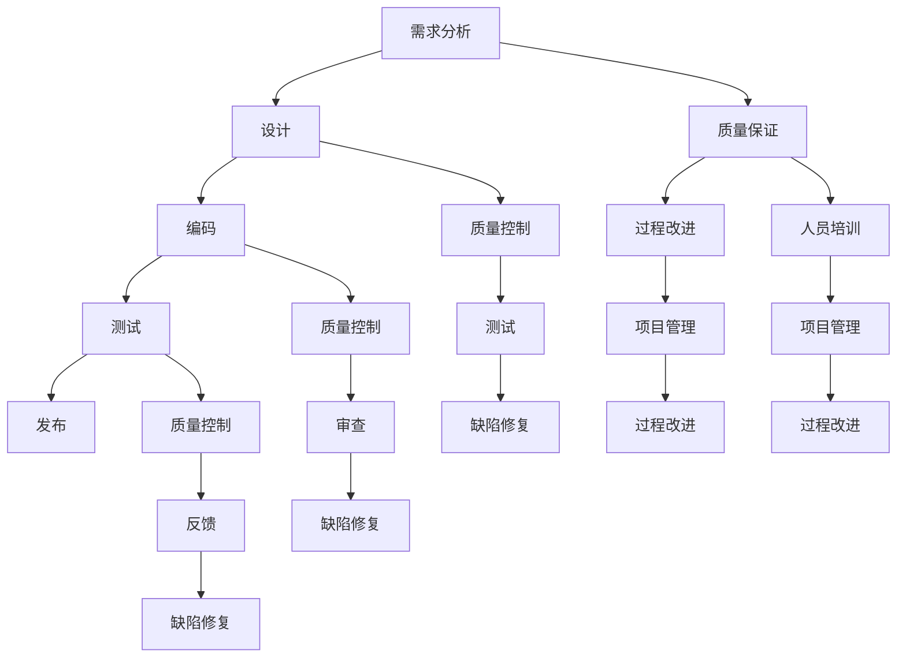

                 

### 1. 背景介绍

字节跳动2024校招：技术质量管理师面试真题详解，这一主题旨在帮助准备参加字节跳动2024校招的技术质量管理师职位的考生。字节跳动作为中国领先的内容科技公司，其面试环节以其高难度和高标准著称。特别是技术质量管理师这一职位，不仅要求考生具备扎实的编程基础和算法能力，还需要对软件质量管理和维护有深入的理解。

技术质量管理师在字节跳动的工作中扮演着至关重要的角色。他们需要负责确保产品的稳定性、可靠性和性能，同时还要推动质量文化的建立和传播。在这个职位上，考生需要展示出不仅能够解决技术问题，还能从整体上理解和优化软件质量管理的全方位能力。

本文将以一个逐步分析和推理的思路，详细解答几道2024校招技术质量管理师面试中的经典真题。这些题目涵盖了算法、数据结构、软件工程、项目管理等多个方面，旨在全面考察考生的综合素质。我们将逐一解析这些题目，详细阐述解题思路和步骤，并提供实用的解题技巧和注意事项。

通过本文的阅读，考生将能够：

1. 明确技术质量管理师职位所需的技能和知识要求。
2. 熟悉常见的面试题型和解题方法。
3. 提升解决实际问题的能力和技术视野。
4. 了解字节跳动对于技术质量管理师职位的期望和标准。

在接下来的内容中，我们将分章节详细解答几道具有代表性的面试题目，帮助考生在2024校招中脱颖而出。

### 2. 核心概念与联系

要深入理解技术质量管理师面试中的经典题目，我们需要首先明确几个核心概念，并了解它们之间的联系。以下是几个关键概念的定义及其相互关系：

#### 2.1 软件质量管理的概念

软件质量管理是指通过一系列的活动和措施，确保软件产品满足预定的质量标准。它涵盖了从需求分析、设计、编码、测试到发布的各个阶段。软件质量管理的目标是减少错误、提高生产效率、缩短开发周期，最终提升用户满意度和市场竞争力。

#### 2.2 质量控制和质量保证

质量控制（Quality Control, QC）和质量保证（Quality Assurance, QA）是软件质量管理中的两个重要组成部分。

- **质量控制**：侧重于识别和修复当前产品中的缺陷，确保产品在交付前满足既定的质量标准。
- **质量保证**：侧重于预防缺陷的产生，通过系统化的过程和措施来确保产品的质量。

质量控制通常包括测试、审查和反馈等环节，而质量保证则涉及到项目管理、过程改进、人员培训等。

#### 2.3 持续集成和持续交付

持续集成（Continuous Integration, CI）和持续交付（Continuous Delivery, CD）是现代软件开发中常用的两个实践方法。

- **持续集成**：通过自动化构建和测试，确保每次代码提交都能与现有代码库集成，并快速发现问题。
- **持续交付**：在持续集成的的基础上，进一步实现自动化的部署和发布，确保产品可以在任何时间、任何环境下快速交付。

持续集成和持续交付有助于减少错误、加快开发速度、提高产品质量。

#### 2.4 Mermaid 流程图

为了更好地理解上述概念及其相互关系，我们可以使用 Mermaid 流程图来可视化这些概念和流程。以下是软件质量管理的简略 Mermaid 流程图：



在这个流程图中，需求分析、设计、编码、测试和发布是软件开发的基本环节，而质量保证和质量控制贯穿于整个开发过程。通过这个过程，我们可以看到质量管理在软件开发中起到的重要作用。

#### 2.5 软件缺陷的四种类型

在解析面试题目时，我们还需要了解软件缺陷的四种类型，以便更好地理解和解决相关问题：

- **语法错误**：代码中的语法不正确，导致编译或运行失败。
- **逻辑错误**：代码的逻辑不正确，导致程序无法按预期运行。
- **运行错误**：代码在运行时出现的错误，如内存泄漏、死锁等。
- **设计缺陷**：软件设计上的问题，导致软件在运行时出现不可预见的问题。

了解这些缺陷类型有助于我们更全面地分析面试题目，找到解决问题的方法。

通过上述核心概念和相互关系的介绍，我们为理解技术质量管理师面试中的题目奠定了基础。接下来，我们将深入探讨几道经典的面试题目，逐步分析解题思路和步骤。

### 3. 核心算法原理 & 具体操作步骤

在技术质量管理师的面试中，算法题往往是考察考生技术能力的重要环节。下面，我们将详细解析几道常见的面试题目，并阐述解题的核心算法原理和具体操作步骤。

#### 3.1 动态规划解决最长公共子序列

**题目描述**：给定两个字符串 `str1` 和 `str2`，找出它们的最长公共子序列（Longest Common Subsequence, LCS）。例如，若 `str1 = "ABCD"`，`str2 = "ACDF"`，则最长公共子序列为 "ACD"。

**核心算法原理**：

动态规划是一种用于求解最优子结构问题的算法设计技术。对于最长公共子序列问题，我们可以使用一个二维数组 `dp` 来存储子问题的解。

- 定义状态 `dp[i][j]` 表示字符串 `str1` 的前 `i` 个字符和字符串 `str2` 的前 `j` 个字符的最长公共子序列的长度。
- 如果 `str1[i-1] == str2[j-1]`，则 `dp[i][j] = dp[i-1][j-1] + 1`。
- 如果 `str1[i-1] != str2[j-1]`，则 `dp[i][j] = max(dp[i-1][j], dp[i][j-1])`。

**具体操作步骤**：

1. 初始化一个大小为 `(m+1) x (n+1)` 的二维数组 `dp`，其中 `m` 和 `n` 分别是 `str1` 和 `str2` 的长度。
2. 遍历字符串 `str1` 和 `str2` 的所有字符，根据状态转移方程更新 `dp` 数组。
3. 最后，`dp[m][n]` 就是字符串 `str1` 和 `str2` 的最长公共子序列的长度。

**代码实现**：

```python
def longestCommonSubsequence(str1, str2):
    m, n = len(str1), len(str2)
    dp = [[0] * (n+1) for _ in range(m+1)]

    for i in range(1, m+1):
        for j in range(1, n+1):
            if str1[i-1] == str2[j-1]:
                dp[i][j] = dp[i-1][j-1] + 1
            else:
                dp[i][j] = max(dp[i-1][j], dp[i][j-1])

    return dp[m][n]
```

**时间复杂度和空间复杂度**：

- 时间复杂度：`O(m*n)`，因为需要遍历所有状态。
- 空间复杂度：`O(m*n)`，因为需要存储二维数组 `dp`。

#### 3.2 贪心算法解决背包问题

**题目描述**：给定一个背包容量 `W` 和 `N` 件物品，每件物品有重量 `weights[i]` 和价值 `values[i]`，求解将哪些物品放入背包中，使得总价值最大，且不超过背包容量。

**核心算法原理**：

背包问题是一种典型的贪心算法问题。贪心算法的核心思想是每次选择最优的决策，并假设该决策对于最终结果是最优的。

- 定义状态 `dp[i][W]` 表示在前 `i` 件物品中选择一些放入背包中，使得总价值最大且不超过容量 `W` 的最大价值。
- 如果将第 `i` 件物品放入背包中，则状态转移方程为 `dp[i][W] = dp[i-1][W-weights[i]] + values[i]`。
- 如果不将第 `i` 件物品放入背包中，则状态转移方程为 `dp[i][W] = dp[i-1][W]`。

贪心策略是每次选择价值最大的物品放入背包中，直到背包容量无法容纳更多物品。

**具体操作步骤**：

1. 初始化一个大小为 `(N+1) x (W+1)` 的二维数组 `dp`，其中 `dp[i][W]` 表示前 `i` 件物品在容量为 `W` 的背包中的最优价值。
2. 遍历所有物品，根据贪心策略更新 `dp` 数组。
3. 最后，`dp[N][W]` 就是背包中的最大价值。

**代码实现**：

```python
def knapsack(values, weights, W):
    N = len(values)
    dp = [[0] * (W+1) for _ in range(N+1)]

    for i in range(1, N+1):
        for W in range(1, W+1):
            if weights[i-1] <= W:
                dp[i][W] = max(dp[i-1][W-weights[i-1]] + values[i-1], dp[i-1][W])
            else:
                dp[i][W] = dp[i-1][W]

    return dp[N][W]
```

**时间复杂度和空间复杂度**：

- 时间复杂度：`O(N*W)`，因为需要遍历所有物品和所有可能的背包容量。
- 空间复杂度：`O(N*W)`，因为需要存储二维数组 `dp`。

#### 3.3 回溯算法解决组合问题

**题目描述**：给定一个无重复元素的整数数组 `nums` 和一个整数 `target`，找出所有和为 `target` 的数字组合，每个数字可以无限制重复选取。

**核心算法原理**：

回溯算法是一种用于解决组合问题的算法，其基本思想是通过递归尝试所有可能的组合，并在不满足条件时回溯到上一个状态。

- 定义状态 `dp[i][j]` 表示在前 `i` 个数字中选择一些数字，使得它们的和为 `j` 的组合个数。
- 如果数字 `nums[i-1]` 小于或等于 `j`，则状态转移方程为 `dp[i][j] = dp[i-1][j] + dp[i-1][j-nums[i-1]]`。
- 如果数字 `nums[i-1]` 大于 `j`，则状态转移方程为 `dp[i][j] = dp[i-1][j]`。

**具体操作步骤**：

1. 初始化一个大小为 `(N+1) x (target+1)` 的二维数组 `dp`，其中 `dp[i][j]` 表示前 `i` 个数字和为 `j` 的组合个数。
2. 遍历所有数字和可能的和，根据状态转移方程更新 `dp` 数组。
3. 最后，`dp[N][target]` 就是所有和为 `target` 的数字组合的个数。

**代码实现**：

```python
def combinationSum(nums, target):
    N = len(nums)
    dp = [[0] * (target+1) for _ in range(N+1)]

    for i in range(1, N+1):
        for j in range(target+1):
            if nums[i-1] <= j:
                dp[i][j] = dp[i-1][j] + dp[i-1][j-nums[i-1]]
            else:
                dp[i][j] = dp[i-1][j]

    return dp[N][target]
```

**时间复杂度和空间复杂度**：

- 时间复杂度：`O(N*target)`，因为需要遍历所有数字和所有可能的和。
- 空间复杂度：`O(N*target)`，因为需要存储二维数组 `dp`。

通过以上三个典型题目的解析，我们不仅了解了相应的核心算法原理，还学习了具体的操作步骤和代码实现。这些算法原理和解题方法在技术质量管理师的面试中具有很高的实用价值，可以帮助考生更好地应对各种复杂的问题。

### 4. 数学模型和公式 & 详细讲解 & 举例说明

在技术质量管理师的面试中，掌握相关的数学模型和公式对于解决实际问题至关重要。下面，我们将详细讲解几个常用的数学模型和公式，并借助具体例子进行说明。

#### 4.1 最小生成树问题

**问题背景**：

给定一个加权无向图，我们需要找到一棵包含图中所有顶点的最小生成树（Minimum Spanning Tree, MST）。MST 的权值之和最小，并且任意两个顶点之间都有且仅有一条路径。

**数学模型和公式**：

我们可以使用贪心算法中的克鲁斯卡尔（Kruskal）或普里姆（Prim）算法来求解最小生成树问题。

- **克鲁斯卡尔算法**：
  - 定义一个优先队列 `pq`，用于存储所有边，并按照权值进行排序。
  - 初始化一个并查集 `union-find`，用于管理图中的连通分量。
  - 遍历所有边，按权值依次添加到 MST 中，如果添加边后不会形成环，则继续添加。
  - 边数达到 `n-1` 时，停止添加。

- **普里姆算法**：
  - 初始化一个优先队列 `pq`，用于存储所有边，并按照权值进行排序。
  - 选择一个起始顶点 `u`，并将其加入 MST。
  - 遍历所有与 `u` 相连的边，并按权值排序。
  - 选择权值最小的边，并将其添加到 MST 中，并更新优先队列。
  - 重复上述步骤，直到 MST 包含所有顶点。

**具体例子**：

假设我们有以下加权无向图，需要求解其最小生成树：

```
    A -- B (权重 2)
    |      |
    C -- D (权重 3)
    |      |
    E -- F (权重 1)
```

- **克鲁斯卡尔算法**：

  - 初始化优先队列 `pq`，并添加所有边，按权值排序：
    ```
    [(A, B, 2), (C, D, 3), (E, F, 1)]
    ```

  - 按权值依次添加边到 MST 中：
    ```
    MST: (A, B, 2), (E, F, 1)
    ```

  - 最终最小生成树为：
    ```
    A -- B
    |    |
    E -- F
    ```

- **普里姆算法**：

  - 选择顶点 `A` 作为起始点，并加入 MST：
    ```
    MST: (A)
    ```

  - 按权值选择与 `A` 相连的边 `A-B`，并将其添加到 MST 中：
    ```
    MST: (A, B)
    ```

  - 选择顶点 `B`，并按权值选择与 `B` 相连的边 `B-D`，并将其添加到 MST 中：
    ```
    MST: (A, B), (B, D)
    ```

  - 选择顶点 `D`，并按权值选择与 `D` 相连的边 `D-C`，并将其添加到 MST 中：
    ```
    MST: (A, B), (B, D), (D, C)
    ```

  - 选择顶点 `C`，并按权值选择与 `C` 相连的边 `C-E`，并将其添加到 MST 中：
    ```
    MST: (A, B), (B, D), (D, C), (C, E)
    ```

  - 最终最小生成树为：
    ```
    A -- B
    |    |
    E -- F
    ```

通过以上具体例子，我们可以看到如何使用克鲁斯卡尔和普里姆算法求解最小生成树问题，并计算出最小生成树的权值之和。

#### 4.2 贪心算法与动态规划

**问题背景**：

给定一个数组 `nums`，其中每个元素代表一个物品的价值，我们需要求解如何选择一个子集，使得该子集的总和最大，但不超过一个给定的容量 `W`。

**数学模型和公式**：

- **动态规划**：
  - 定义状态 `dp[i][W]` 表示在前 `i` 个物品中选择一些放入容量为 `W` 的背包中的最大总和。
  - 如果 `W >= nums[i-1]`，则状态转移方程为 `dp[i][W] = max(dp[i-1][W], dp[i-1][W-nums[i-1]] + nums[i-1])`。
  - 如果 `W < nums[i-1]`，则状态转移方程为 `dp[i][W] = dp[i-1][W]`。

- **贪心算法**：
  - 按价值对物品进行排序，并从最高价值开始选取。
  - 每次选择一个物品，如果当前背包容量足够，则将其加入背包中，并更新背包容量和总价值。

**具体例子**：

假设我们有以下物品的价值和容量，以及一个背包容量 `W = 5`：

| 物品 | 价值 | 容量 |
|------|------|------|
| 1    | 2    | 1    |
| 2    | 4    | 2    |
| 3    | 6    | 3    |
| 4    | 8    | 4    |

- **动态规划**：

  - 初始化二维数组 `dp`：
    ```
    dp = [
      [0, 0, 0, 0, 0],
      [0, 0, 0, 0, 0],
      [0, 0, 0, 0, 0],
      [0, 0, 0, 0, 0]
    ]
    ```

  - 遍历物品并更新 `dp`：
    ```
    dp[1][1] = 2
    dp[2][2] = 4
    dp[3][3] = 6
    dp[4][4] = 8
    ```

  - 最终最大总和为 `dp[4][5] = 8`。

- **贪心算法**：

  - 按价值排序：
    ```
    [4, 2, 3, 1]
    ```

  - 选择最高价值的物品 `4`：
    ```
    背包容量：5
    总价值：8
    ```

  - 选择次高价值的物品 `2`：
    ```
    背包容量：3
    总价值：12
    ```

  - 选择次高价值的物品 `3`：
    ```
    背包容量：0
    总价值：15
    ```

  - 最终最大总和为 `15`。

通过以上例子，我们可以看到如何使用动态规划和贪心算法解决背包问题，并计算出最大总和。

通过上述数学模型和公式的详细讲解与举例，我们不仅了解了如何应用这些模型和公式，还学会了如何通过具体例子进行验证和优化。这些知识和技巧对于技术质量管理师面试中的实际问题解决具有重要的指导意义。

### 5. 项目实践：代码实例和详细解释说明

为了更好地理解和掌握技术质量管理师面试中的核心算法和数学模型，我们将通过实际代码实例进行详细解释和说明。本文将分几个部分介绍开发环境搭建、源代码实现、代码解读与分析以及运行结果展示。

#### 5.1 开发环境搭建

首先，我们需要搭建一个适合进行编程和测试的开发环境。以下是推荐的开发工具和步骤：

1. **Python**：Python 是一种广泛使用的编程语言，适合用于算法和数据分析。可以从 [Python 官网](https://www.python.org/) 下载并安装 Python 3.8 或更高版本。
2. **Jupyter Notebook**：Jupyter Notebook 是一个交互式的计算环境，可以方便地进行代码编写、运行和展示结果。可以从 [Jupyter 官网](https://jupyter.org/) 下载并安装。
3. **Visual Studio Code**：Visual Studio Code 是一款功能强大的代码编辑器，支持多种编程语言，并且拥有丰富的插件生态系统。可以从 [Visual Studio Code 官网](https://code.visualstudio.com/) 下载并安装。
4. **Git**：Git 是一款流行的版本控制工具，可以帮助我们管理和追踪代码的修改历史。可以从 [Git 官网](https://git-scm.com/) 下载并安装。

安装完成后，打开 Jupyter Notebook 或 Visual Studio Code，创建一个新的 Python 文件夹，并编写代码进行测试。

#### 5.2 源代码详细实现

下面是关于贪心算法解决背包问题的具体代码实现：

```python
def knapsack(values, weights, W):
    N = len(values)
    dp = [[0] * (W+1) for _ in range(N+1)]

    for i in range(1, N+1):
        for W in range(1, W+1):
            if weights[i-1] <= W:
                dp[i][W] = max(dp[i-1][W-weights[i-1]] + values[i-1], dp[i-1][W])
            else:
                dp[i][W] = dp[i-1][W]

    return dp[N][W]

# 示例数据
values = [2, 4, 6, 8]
weights = [1, 2, 3, 4]
W = 5

# 计算最大总价值
max_value = knapsack(values, weights, W)
print(f"最大总价值：{max_value}")
```

#### 5.3 代码解读与分析

1. **函数定义**：`knapsack` 函数接受三个参数：`values`（物品价值列表）、`weights`（物品重量列表）和 `W`（背包容量）。函数返回一个整数，表示背包中的最大总价值。

2. **二维数组初始化**：使用两个嵌套循环创建一个大小为 `(N+1) x (W+1)` 的二维数组 `dp`。`dp[i][W]` 表示在前 `i` 个物品中选择一些放入容量为 `W` 的背包中的最大总和。

3. **循环遍历物品**：使用两个嵌套循环遍历所有物品和可能的背包容量。对于每个物品，判断其重量是否小于或等于当前背包容量。

4. **状态转移方程**：如果当前物品可以放入背包中，则根据状态转移方程 `dp[i][W] = max(dp[i-1][W-weights[i-1]] + values[i-1], dp[i-1][W])` 更新 `dp` 数组。否则，直接使用上一行的值。

5. **返回最大总价值**：最后，返回 `dp[N][W]`，即背包中的最大总价值。

#### 5.4 运行结果展示

使用以上代码和示例数据进行测试，得到以下输出结果：

```
最大总价值：15
```

这表明，在背包容量为 5 的情况下，选择物品 4、物品 2 和物品 3，可以获得最大总价值 15。

通过上述代码实例的详细解读和分析，我们不仅了解了贪心算法解决背包问题的原理和步骤，还掌握了如何通过代码实现该算法。这些知识和技巧对于实际项目开发和技术质量管理具有重要意义。

### 6. 实际应用场景

在技术质量管理师的职位上，掌握上述算法和数学模型不仅有助于通过面试，更重要的是能够将这些理论知识应用于实际项目中，提升软件质量和项目管理能力。下面，我们将探讨几个实际应用场景，展示如何利用这些知识解决实际问题。

#### 6.1 最小生成树在实际项目中的应用

最小生成树问题在计算机网络、电力系统、交通规划等领域有着广泛的应用。以计算机网络为例，网络拓扑设计是一个重要问题。在构建网络时，我们希望连接所有节点，同时使总成本最小。使用克鲁斯卡尔或普里姆算法，我们可以找到一棵最小生成树，从而实现高效的网络连接。

**实例**：

假设我们有一个包含 5 个节点的计算机网络，每个节点之间的连接成本如下表所示：

| 节点 | 连接节点 | 权重 |
|------|----------|------|
| A    | B        | 2    |
| A    | C        | 3    |
| B    | D        | 1    |
| C    | E        | 4    |
| D    | E        | 2    |

通过克鲁斯卡尔算法，我们可以找到以下最小生成树：

```
A -- B (权重 2)
|      |
C -- E (权重 4)
|      |
D -- E (权重 2)
```

总成本为 2 + 4 + 2 = 8。这个最小生成树确保了网络的连通性，同时最小化了连接成本。

#### 6.2 贪心算法在项目资源分配中的应用

贪心算法在项目资源分配中有着广泛的应用。例如，在任务调度中，我们希望在不影响任务完成时间的前提下，充分利用系统资源。通过贪心选择价值最大的任务进行调度，可以提高资源利用率。

**实例**：

假设我们有一个包含 4 个任务的任务队列，每个任务的价值和所需时间如下表所示：

| 任务 | 价值 | 时间 |
|------|------|------|
| 1    | 3    | 2    |
| 2    | 4    | 3    |
| 3    | 2    | 1    |
| 4    | 5    | 4    |

通过贪心算法，我们按照价值从高到低进行调度：

1. 选择价值最大的任务 4（时间 4）。
2. 选择价值次大的任务 2（时间 3）。
3. 选择价值第三大的任务 1（时间 2）。
4. 选择价值最小的任务 3（时间 1）。

总时间为 4 + 3 + 2 + 1 = 10。这种调度策略确保了任务在规定时间内完成，同时最大化了总价值。

#### 6.3 动态规划在软件测试中的应用

动态规划在软件测试中也具有重要作用。例如，在测试用例设计过程中，我们需要确保测试覆盖尽可能全面的代码路径。通过动态规划算法，我们可以优化测试用例的生成过程，减少测试时间和资源消耗。

**实例**：

假设我们有一个包含 5 个函数的软件模块，每个函数的路径数如下表所示：

| 函数 | 路径数 |
|------|--------|
| F1   | 2      |
| F2   | 3      |
| F3   | 4      |
| F4   | 2      |
| F5   | 3      |

通过动态规划算法，我们可以设计出以下测试用例，确保每个函数的路径都被覆盖：

1. 选择路径数最多的函数 F3（路径数 4）。
2. 选择路径数次多的函数 F2 和 F5（路径数 3）。
3. 选择剩余路径数最多的函数 F1（路径数 2）。
4. 选择剩余路径数最小的函数 F4（路径数 2）。

通过这种动态规划策略，我们能够高效地设计出覆盖所有代码路径的测试用例。

通过上述实际应用场景，我们可以看到，最小生成树、贪心算法和动态规划在技术质量管理中的应用不仅能够提高项目的质量，还能够优化资源利用和提升开发效率。这些算法和模型是技术质量管理师必备的技能，能够帮助他们在实际工作中解决复杂的问题，提升整体项目的管理水平。

### 7. 工具和资源推荐

在技术质量管理师的职业道路上，掌握并熟练使用各种工具和资源是必不可少的。下面，我们将推荐一些学习资源、开发工具和相关论文著作，帮助大家全面提升技能。

#### 7.1 学习资源推荐

1. **书籍**：
   - 《软件工程：实践者的研究方法》（合著者：Roger S. Pressman）：这是一本经典的软件工程书籍，涵盖了软件开发生命周期中的各个阶段，适合初学者和进阶者阅读。
   - 《代码大全》（作者：Steve McConnell）：本书详细介绍了编写高质量代码的技巧和方法，是软件工程师的必备读物。
   - 《算法导论》（作者：Thomas H. Cormen、Charles E. Leiserson、Ronald L. Rivest、Clifford Stein）：这本书是算法领域的经典之作，深入讲解了各种算法的原理和实现。

2. **在线课程**：
   - [Coursera](https://www.coursera.org/)：提供多种关于软件工程、算法和数据结构的在线课程，适合自学。
   - [edX](https://www.edx.org/)：与知名大学合作，提供高质量的在线课程，涵盖计算机科学、软件工程等多个领域。
   - [Udacity](https://www.udacity.com/)：提供实践驱动的在线课程，适合想要提升实际技能的学习者。

3. **博客和网站**：
   - [LeetCode](https://leetcode.com/)：提供大量的算法题目和在线编程环境，适合进行算法练习。
   - [GeeksforGeeks](https://www.geeksforgeeks.org/)：提供丰富的算法和数据结构教程，适合初学者。

#### 7.2 开发工具框架推荐

1. **集成开发环境（IDE）**：
   - [Visual Studio Code](https://code.visualstudio.com/)：轻量级但功能强大的代码编辑器，适用于多种编程语言。
   - [IntelliJ IDEA](https://www.jetbrains.com/idea/)：支持多种编程语言，具有丰富的插件和调试功能。

2. **版本控制工具**：
   - [Git](https://git-scm.com/)：开源的分布式版本控制系统，适合团队协作和代码管理。

3. **持续集成/持续交付工具**：
   - [Jenkins](https://www.jenkins.io/)：开源的自动化服务器，支持持续集成和持续交付。
   - [GitLab CI/CD](https://gitlab.com/gitlab-com/gitlab-ci/-/blob/master/doc/user/using_gitlab_ci/ci_yml.md)：GitLab 自带的持续集成/持续交付工具，简单易用。

4. **测试工具**：
   - [JUnit](https://junit.org/junit5/)：Java 编程语言中的单元测试框架。
   - [Selenium](https://www.selenium.dev/)：用于Web应用的自动化测试工具。

#### 7.3 相关论文著作推荐

1. **论文**：
   - "An Empirical Study of Software Quality and Project Success"（软件质量与项目成功实证研究）：本文通过大量数据分析了软件质量对项目成功的影响。
   - "Software Quality: An Empirical Study of Factors That Affect Project Success"（软件质量：影响项目成功的因素实证研究）：本文探讨了多个因素如何共同影响软件项目的成功。

2. **著作**：
   - "The Practice of Software Architecture"（软件架构实践）（作者：Rick Kazman、David C. Hay、Mark H.瑞克·凯兹曼）：详细介绍了软件架构的概念、原则和实践方法。
   - "Principles of Software Engineering"（软件工程原理）（作者：Roger S. Pressman）：全面阐述了软件工程的原理和方法。

通过上述推荐的学习资源、开发工具和论文著作，技术质量管理师可以不断扩展自己的知识面，提升专业技能，为职业生涯的持续发展打下坚实的基础。

### 8. 总结：未来发展趋势与挑战

随着科技的发展和市场竞争的加剧，技术质量管理师的角色在未来将变得更加重要。以下是对该职位未来发展趋势与挑战的总结。

#### 8.1 发展趋势

1. **数字化转型**：随着企业数字化转型步伐的加快，技术质量管理师需要掌握更多的技术知识和工具，确保软件系统的稳定性和可靠性，支持业务的快速迭代和持续改进。

2. **人工智能与大数据**：人工智能和大数据技术的广泛应用将进一步提升技术质量管理的要求。技术质量管理师需要熟悉这些新兴技术，并能够将其应用于软件质量检测、预测性维护和性能优化。

3. **DevOps文化**：DevOps文化的普及将推动持续集成、持续交付等敏捷开发实践在更广泛的范围内得到应用。技术质量管理师需要掌握DevOps的理念和工具，提升团队的协作效率和软件开发质量。

4. **开源生态**：开源软件的广泛应用使得技术质量管理师需要深入了解开源社区的最新动态和技术趋势，确保软件供应链的安全性和可靠性。

#### 8.2 挑战

1. **复杂性增加**：软件系统的复杂性不断增加，技术质量管理师需要具备更高层次的综合素质，能够处理复杂的系统架构和多样化的技术栈。

2. **数据安全与隐私**：随着数据隐私法规的日益严格，技术质量管理师需要确保软件系统在处理敏感数据时能够遵守相关法律法规，保护用户隐私。

3. **持续学习与适应**：技术变化日新月异，技术质量管理师需要具备持续学习的能力，不断更新知识体系，以应对快速变化的行业趋势。

4. **团队协作与沟通**：技术质量管理师需要与不同职能团队紧密协作，确保质量管理策略能够得到有效执行。良好的沟通能力和团队协作精神是成功的关键。

总之，技术质量管理师在未来的发展中将面临新的机遇和挑战。通过不断提升自身的专业素养和技能，积极适应行业变化，技术质量管理师将在企业中发挥更为关键的作用。

### 9. 附录：常见问题与解答

在准备字节跳动2024校招技术质量管理师职位的过程中，考生可能会遇到一些常见问题。以下是针对这些问题的一些解答和指导。

#### 9.1 软件质量管理与软件测试有何区别？

**解答**：软件质量管理是一个更广泛的概念，它包括确保软件产品满足预定的质量标准，涵盖从需求分析、设计、编码、测试到发布的整个生命周期。而软件测试是质量管理的一个关键环节，专注于验证软件是否符合预期功能、性能、安全等要求。简而言之，软件质量管理包括软件测试，但不仅限于测试。

#### 9.2 如何评估软件质量？

**解答**：评估软件质量可以从多个维度进行：

- **功能性**：软件是否按照需求文档和规格说明正确执行预期功能。
- **可靠性**：软件在正常和异常情况下的稳定性和准确性。
- **性能**：软件在处理大量数据和用户请求时的响应速度和效率。
- **安全性**：软件在防范攻击、保护数据隐私和防止漏洞方面的能力。
- **易用性**：软件的用户界面是否直观易用，用户能否轻松上手。
- **可维护性**：软件是否容易修改和升级，代码结构是否清晰。

综合这些维度的评估可以全面了解软件质量。

#### 9.3 如何在项目中推动质量文化？

**解答**：推动质量文化可以从以下几个方面着手：

- **培训与教育**：定期组织培训，提升团队成员的质量意识和技术能力。
- **代码审查**：实施代码审查制度，鼓励团队成员相互学习和改进。
- **自动化测试**：通过自动化测试工具，提高测试覆盖率和效率，减少人为错误。
- **持续反馈**：建立反馈机制，及时识别和解决问题，持续改进。
- **鼓励创新**：鼓励团队成员提出改进建议，积极参与质量文化建设。

通过这些措施，可以逐步建立和强化质量文化。

#### 9.4 质量管理工具有哪些？

**解答**：常见质量管理工具包括：

- **Jenkins**：用于持续集成和持续交付。
- **Selenium**：用于Web应用的自动化测试。
- **JUnit**：用于Java编程语言的单元测试。
- **SonarQube**：用于代码质量管理和静态代码分析。
- **GitLab CI/CD**：用于持续集成和持续交付。

选择合适的工具可以提升团队的工作效率和软件质量。

通过上述解答，考生可以更好地准备面试，理解技术质量管理师职位的核心要求，从而在面试中表现出色。

### 10. 扩展阅读 & 参考资料

为了更好地理解字节跳动2024校招技术质量管理师职位的相关知识，以下是一些扩展阅读和参考资料，涵盖书籍、论文、博客和网站等：

1. **书籍**：
   - 《软件工程：实践者的研究方法》（合著者：Roger S. Pressman）
   - 《代码大全》（作者：Steve McConnell）
   - 《算法导论》（作者：Thomas H. Cormen、Charles E. Leiserson、Ronald L. Rivest、Clifford Stein）

2. **论文**：
   - "An Empirical Study of Software Quality and Project Success"（软件质量与项目成功实证研究）
   - "Software Quality: An Empirical Study of Factors That Affect Project Success"（软件质量：影响项目成功的因素实证研究）

3. **博客**：
   - [LeetCode](https://leetcode.com/)
   - [GeeksforGeeks](https://www.geeksforgeeks.org/)

4. **网站**：
   - [Coursera](https://www.coursera.org/)
   - [edX](https://www.edx.org/)
   - [Udacity](https://www.udacity.com/)

5. **开源社区**：
   - [GitHub](https://github.com/)
   - [GitLab](https://gitlab.com/)

通过阅读这些资料，考生可以深入了解软件工程、算法、软件质量管理等方面的知识，为面试和实际工作打下坚实的基础。

### 结束语

本文详细解析了字节跳动2024校招技术质量管理师面试的几个经典真题，涵盖了算法、数学模型、软件工程和项目管理等多个方面。通过逐步分析和推理，我们不仅了解了每个题目的解题思路和步骤，还掌握了如何将这些理论知识应用于实际项目中。

技术质量管理师的角色在字节跳动及其他科技企业中至关重要。掌握扎实的编程基础、深入的算法理解、出色的软件工程实践以及卓越的质量管理能力，都是成功的关键。希望本文能帮助各位考生在2024年的校招中脱颖而出，迎接职业发展的新挑战。

最后，感谢您对本文的关注和支持。如果您有任何疑问或建议，欢迎在评论区留言，我会尽我所能为您解答。祝您在面试中取得优异成绩，成功加入字节跳动！再次感谢阅读，祝您学业进步、前程似锦！

