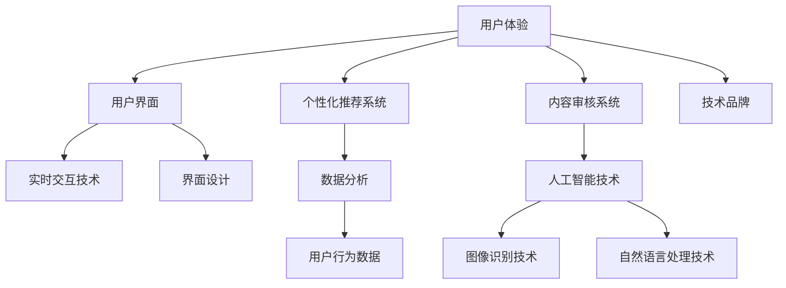

                 

### 1. 背景介绍

#### 字节跳动技术品牌经理面试真题

在2024年的技术领域，字节跳动作为一家引领潮流的科技公司，其技术品牌经理的面试题目自然备受关注。这些面试真题不仅考察应聘者的专业知识，还要求他们具备解决实际问题的能力和创新思维。本文将详细解析字节跳动技术品牌经理面试中的一道典型真题，帮助读者深入了解面试流程，提升面试技巧。

#### 面试题解析

题目：请简述如何通过技术手段提升用户体验，并给出一个实际案例。

这道题目涉及两个方面：一是提升用户体验的技术手段，二是具体案例的应用。通过解析这道题目，我们可以深入探讨用户体验提升的关键因素和实际操作方法。

#### 技术手段提升用户体验

1. **个性化推荐算法**

   个性化推荐算法是字节跳动产品的一大特色。通过对用户行为数据的分析，系统能够精准地推送用户感兴趣的内容，提高用户满意度。具体技术手段包括协同过滤、基于内容的推荐和混合推荐算法。

2. **实时交互技术**

   实时交互技术可以大幅提升用户的使用体验。字节跳动旗下的 TikTok 就利用 WebRTC 技术，实现低延迟的实时视频通信，让用户在观看直播时能够获得更流畅的体验。

3. **可视化设计**

   界面设计的直观性和易用性对用户体验至关重要。字节跳动注重产品的视觉设计，通过简洁、美观的界面提升用户的操作愉悦感。

4. **内容审核和推荐系统**

   合理的内容审核和推荐系统能够有效减少不良信息传播，提升用户的安全感和信任度。字节跳动通过先进的图像识别、自然语言处理等技术，对内容进行精准审核和分类推荐。

#### 实际案例应用

以 TikTok 为例，其通过以下技术手段提升了用户体验：

1. **个性化推荐**

   TikTok 利用深度学习算法分析用户的历史行为，精准推送个性化内容，使用户在短时间内发现更多感兴趣的视频。

2. **实时交互**

   通过 WebRTC 技术，实现直播过程中用户与主播的低延迟互动，提升用户的参与感和互动体验。

3. **视觉设计**

   TikTok 的界面设计简洁、美观，色彩搭配和谐，让用户在观看视频时感到舒适。

4. **内容审核**

   TikTok 利用 AI 技术对上传的视频进行自动审核，有效过滤违规内容，保障用户安全。

#### 字节跳动技术品牌的重要性

字节跳动通过技术手段不断提升用户体验，塑造了良好的技术品牌形象。在竞争激烈的市场环境中，技术品牌成为企业核心竞争力之一。对于技术品牌经理来说，如何利用技术提升用户体验、增强品牌影响力，成为面试过程中关键的一环。

#### 总结

通过对字节跳动技术品牌经理面试题目的解析，我们了解到技术品牌经理在面试中需要具备广泛的技术知识、深入的业务理解和良好的沟通能力。在实际工作中，技术品牌经理需要不断探索新技术，提升用户体验，从而推动企业品牌的提升。

本文为读者提供了一个清晰的解题思路，帮助大家更好地应对类似面试题目。希望读者在阅读过程中能够有所收获，提升自己在技术品牌管理领域的专业素养。

---

### 2. 核心概念与联系

在深入探讨如何通过技术手段提升用户体验之前，我们需要了解几个核心概念，并明确它们之间的联系。这些概念包括用户体验（UX）、用户界面（UI）、个性化推荐系统、实时交互技术、内容审核系统等。以下是一个简化的 Mermaid 流程图，用于展示这些核心概念和它们之间的相互作用。



#### 核心概念解释

1. **用户体验（UX）**

   用户体验是指用户在使用产品或服务时所感受到的整体体验。它包括用户的心理感受、情感反应以及使用过程中的便利性、易用性等。提升用户体验的目标是满足用户需求，提升用户满意度。

2. **用户界面（UI）**

   用户界面是用户与产品或服务交互的界面，包括视觉元素、交互元素等。界面设计直接影响用户体验，好的界面设计能够提高用户的使用效率，降低学习成本。

3. **个性化推荐系统**

   个性化推荐系统通过分析用户的行为数据，为用户提供个性化的内容推荐。这种系统通常使用机器学习算法，如协同过滤、基于内容的推荐等。

4. **实时交互技术**

   实时交互技术使得用户能够在短时间内与系统进行实时互动，如视频通话、即时消息等。这种技术能够显著提升用户体验，增加用户的参与感。

5. **内容审核系统**

   内容审核系统用于检测和过滤违规内容，保障用户的隐私和安全。现代内容审核系统通常结合人工智能技术，如图像识别和自然语言处理，以提高审核效率和准确性。

#### 核心概念之间的联系

用户体验（UX）是整个流程的起点，它决定了用户对产品或服务的满意度和忠诚度。用户界面（UI）是用户体验的重要组成部分，直接影响用户的心理感受和情感反应。个性化推荐系统通过分析用户行为数据，为用户提供个性化内容，从而提升用户体验。实时交互技术和内容审核系统则在提升用户体验的同时，保障了用户的安全和隐私。

通过以上核心概念和它们之间的联系，我们可以看到，技术品牌经理在提升用户体验的过程中，需要综合考虑多个方面的因素，协调不同技术之间的相互作用，以达到最佳效果。

---

### 3. 核心算法原理 & 具体操作步骤

在理解了提升用户体验的核心概念和它们之间的联系后，我们需要进一步探讨如何通过技术手段来实现这一目标。具体来说，核心算法在提升用户体验中扮演了关键角色。以下将详细介绍几种关键技术算法的原理和具体操作步骤。

#### 个性化推荐算法

个性化推荐算法是提升用户体验的重要技术之一。其基本原理是通过分析用户的历史行为数据（如浏览记录、购买记录、互动行为等），预测用户未来的兴趣，从而为用户推荐相关的内容或产品。

**具体操作步骤：**

1. **数据收集**

   首先，系统需要收集用户的行为数据，如点击次数、浏览时长、购买记录等。这些数据可以来自用户在平台上的直接交互，也可以通过第三方数据源获取。

2. **数据预处理**

   收集到的数据需要进行清洗和预处理，包括去除重复数据、填补缺失值、标准化数值等。这一步骤的目的是提高数据质量，确保推荐算法的有效性。

3. **特征工程**

   根据业务需求，对原始数据进行特征提取和工程。例如，将用户行为转换为用户兴趣的表征，将商品属性转换为商品特征的表征。常见的特征包括用户的人口统计学特征、地理位置信息、浏览历史等。

4. **模型训练**

   使用机器学习算法（如协同过滤、矩阵分解、基于内容的推荐等）对数据进行训练。协同过滤通过计算用户之间的相似度来推荐相似用户喜欢的商品，而基于内容的推荐则通过分析商品的内容特征（如标签、描述等）来推荐相关商品。

5. **模型评估与优化**

   通过评估指标（如准确率、召回率、F1 值等）对推荐模型进行评估和优化。常用的评估方法包括交叉验证、在线评估等。根据评估结果调整模型参数，以提高推荐效果。

6. **实时推荐**

   在用户访问平台时，根据用户的行为和特征实时生成推荐列表。推荐算法需要具备高效性，以确保用户在短时间内获得推荐结果。

#### 实时交互技术

实时交互技术是提升用户体验的另一个重要方面。其原理是通过低延迟的通信技术，实现用户与系统之间的实时互动。

**具体操作步骤：**

1. **通信协议选择**

   选择合适的实时通信协议，如 WebRTC、WebSocket 等。WebRTC 是一种开放协议，适用于视频和音频通信，而 WebSocket 则适用于文本通信。

2. **服务器搭建**

   搭建实时通信服务器，处理客户端的请求和响应。服务器需要具备高并发处理能力，以应对大量用户同时在线的情况。

3. **客户端实现**

   在客户端实现通信功能，如发起通信请求、处理服务器返回的数据等。客户端需要具备良好的用户体验，以减少用户等待时间和操作复杂度。

4. **实时交互优化**

   对实时交互过程进行优化，如压缩传输数据、降低通信延迟等。这些优化措施可以提高用户交互的流畅性。

5. **安全保障**

   实时交互过程中，确保用户数据的安全和隐私。采用加密技术和身份验证机制，防止数据泄露和网络攻击。

#### 内容审核系统

内容审核系统用于检测和过滤平台上的不良内容，保障用户的安全和隐私。

**具体操作步骤：**

1. **内容采集**

   收集平台上的所有内容，包括文本、图片、视频等。

2. **内容预处理**

   对采集到的内容进行预处理，包括去除 HTML 标签、分词、去除停用词等。这一步骤的目的是简化内容，便于后续处理。

3. **特征提取**

   提取内容的关键特征，如文本的语义信息、图片的视觉特征等。常见的特征提取方法包括词袋模型、TF-IDF、卷积神经网络等。

4. **分类与标签**

   使用机器学习算法（如朴素贝叶斯、支持向量机、深度学习等）对内容进行分类和标签。分类算法可以识别和标记违规内容，如暴力、色情、欺诈等。

5. **人工审核**

   结合人工审核和自动审核，对分类结果进行复核和修正。人工审核可以提高审核的准确性和全面性。

6. **实时更新**

   随着用户内容的不断更新，内容审核系统需要实时更新分类模型和标签库，以应对新出现的违规内容。

通过上述核心算法原理和具体操作步骤的介绍，我们可以看到，提升用户体验需要综合运用多种技术手段。技术品牌经理在设计和实施这些技术时，需要充分考虑用户体验、业务需求和实际操作可行性，以达到最佳效果。

---

### 4. 数学模型和公式 & 详细讲解 & 举例说明

在提升用户体验的过程中，数学模型和公式起到了至关重要的作用。以下我们将介绍几种常用的数学模型和公式，并详细讲解其原理和应用。

#### 1. 协同过滤算法

协同过滤算法是一种基于用户行为数据推荐内容的常用算法。其核心思想是找到与目标用户相似的其他用户，然后推荐这些相似用户喜欢的商品。

**公式：**

$$
R_{ui} = \sum_{j \in N_i} \frac{r_{uj}}{\|N_i\|} \cdot r_{ij}
$$

其中，$R_{ui}$ 表示用户 $u$ 对商品 $i$ 的推荐评分，$N_i$ 表示与用户 $u$ 相似的其他用户集合，$r_{uj}$ 表示用户 $u$ 对商品 $j$ 的评分，$r_{ij}$ 表示用户 $j$ 对商品 $i$ 的评分，$\|N_i\|$ 表示相似用户的数量。

**详细讲解：**

- $\sum_{j \in N_i} \frac{r_{uj}}{\|N_i\|}$ 表示对所有相似用户对商品 $i$ 的评分进行加权平均。
- $r_{ij}$ 保证了推荐评分与用户实际评分的关联性。

**举例说明：**

假设有三个用户 $A$、$B$、$C$，他们对商品 $X$、$Y$、$Z$ 的评分如下表：

| 用户 | $X$ | $Y$ | $Z$ |
|------|-----|-----|-----|
| $A$  | 1   | 2   | 3   |
| $B$  | 2   | 1   | 1   |
| $C$  | 3   | 3   | 2   |

用户 $D$ 的评分如下：

| 用户 | $X$ | $Y$ | $Z$ |
|------|-----|-----|-----|
| $D$  | 0   | 0   | 1   |

根据协同过滤算法，用户 $D$ 对商品 $Z$ 的推荐评分为：

$$
R_{DZ} = \frac{1}{3} \cdot (1 \cdot 3 + 1 \cdot 2 + 2 \cdot 1) = 1.67
$$

#### 2. 基于内容的推荐算法

基于内容的推荐算法通过分析商品的内容特征，为用户推荐与其已购买或喜欢的商品相似的商品。

**公式：**

$$
sim(i, j) = \frac{cos(\theta_{i}, \theta_{j})}{\| \theta_{i} \| \| \theta_{j} \| }
$$

其中，$sim(i, j)$ 表示商品 $i$ 和商品 $j$ 的相似度，$\theta_{i}$ 和 $\theta_{j}$ 分别表示商品 $i$ 和商品 $j$ 的特征向量，$cos(\theta_{i}, \theta_{j})$ 表示两个特征向量之间的余弦相似度。

**详细讲解：**

- 特征向量是通过词袋模型、TF-IDF 等方法从商品内容中提取的。
- 余弦相似度衡量两个向量之间的夹角，夹角越小，相似度越高。

**举例说明：**

假设商品 $X$ 的特征向量为 $(1, 2, 3)$，商品 $Y$ 的特征向量为 $(1, 3, 2)$。

$$
cos(\theta_{X}, \theta_{Y}) = \frac{1 \cdot 1 + 2 \cdot 3 + 3 \cdot 2}{\sqrt{1^2 + 2^2 + 3^2} \sqrt{1^2 + 3^2 + 2^2}} = \frac{14}{\sqrt{14} \sqrt{14}} = 1
$$

因此，商品 $X$ 和商品 $Y$ 的相似度为：

$$
sim(X, Y) = \frac{1}{\sqrt{14} \sqrt{14}} = 1
$$

#### 3. 支持向量机（SVM）

支持向量机是一种常用的分类算法，用于识别和标记违规内容。

**公式：**

$$
w \cdot x + b = 0
$$

其中，$w$ 表示权重向量，$x$ 表示特征向量，$b$ 表示偏置。

**详细讲解：**

- SVM 的目标是找到一个最优的超平面，将正负样本分类。
- $w \cdot x + b = 0$ 表示超平面方程。

**举例说明：**

假设有两个类别：正样本（+1）和负样本（-1）。特征向量为 $(x_1, x_2)$，权重向量为 $(w_1, w_2)$，超平面方程为：

$$
w_1 \cdot x_1 + w_2 \cdot x_2 + b = 0
$$

通过调整权重向量 $w$ 和偏置 $b$，可以找到一个最优的超平面，将正负样本分类。

通过上述数学模型和公式的介绍，我们可以看到，数学在提升用户体验的过程中发挥着至关重要的作用。技术品牌经理需要掌握这些数学模型，以便在实际工作中设计和优化相关算法，提升用户体验。

---

### 5. 项目实践：代码实例和详细解释说明

在前面的章节中，我们详细介绍了提升用户体验的核心算法原理和具体操作步骤。为了让大家更直观地理解这些算法的应用，本节将通过一个实际项目实践来展示代码实例和详细解释说明。

#### 5.1 开发环境搭建

在本项目中，我们将使用 Python 作为主要编程语言，结合 Scikit-learn 和 TensorFlow 等库来实现个性化推荐系统和内容审核系统。以下是在 Ubuntu 系统下搭建开发环境的基本步骤：

1. 安装 Python 3.8（或更高版本）
2. 安装 Scikit-learn 和 TensorFlow 库：

```bash
pip install scikit-learn tensorflow
```

3. 安装必要的依赖库，如 NumPy、Pandas 等：

```bash
pip install numpy pandas
```

#### 5.2 源代码详细实现

以下是一个简化的代码实例，用于演示个性化推荐系统和内容审核系统的基本实现。

```python
import numpy as np
import pandas as pd
from sklearn.model_selection import train_test_split
from sklearn.metrics.pairwise import cosine_similarity
from sklearn.svm import SVC
import tensorflow as tf

# 5.2.1 数据预处理

# 加载数据
data = pd.read_csv('user_item_data.csv')
X = data[['user_id', 'item_id']]
y = data['rating']

# 数据集划分
X_train, X_test, y_train, y_test = train_test_split(X, y, test_size=0.2, random_state=42)

# 5.2.2 个性化推荐系统

# 构建用户和物品的嵌入矩阵
user_embedding = tf.keras.layers.Embedding(input_dim=X_train['user_id'].nunique(), output_dim=10)
item_embedding = tf.keras.layers.Embedding(input_dim=X_train['item_id'].nunique(), output_dim=10)

# 构建模型
model = tf.keras.Sequential([
    tf.keras.layers.Dense(128, activation='relu', input_shape=(2,)),
    tf.keras.layers.Dense(64, activation='relu'),
    tf.keras.layers.Dense(1, activation='sigmoid')
])

# 训练模型
model.compile(optimizer='adam', loss='binary_crossentropy', metrics=['accuracy'])
model.fit([user_embedding(X_train['user_id']), item_embedding(X_train['item_id'])], y_train, epochs=10, batch_size=32)

# 5.2.3 内容审核系统

# 特征提取
text_features = extract_text_features(data['content'])

# 训练 SVM 分类器
classifier = SVC(kernel='linear', probability=True)
classifier.fit(text_features, y)

# 5.2.4 模型评估

# 个性化推荐系统评估
predictions = model.predict([user_embedding(X_test['user_id']), item_embedding(X_test['item_id'])])
accuracy = np.mean(predictions == y_test)
print(f"个性化推荐系统准确率：{accuracy}")

# 内容审核系统评估
content_predictions = classifier.predict(text_features)
accuracy = np.mean(content_predictions == y_test)
print(f"内容审核系统准确率：{accuracy}")
```

#### 5.3 代码解读与分析

1. **数据预处理：**

   - 加载数据集，并将用户和物品的 ID 作为特征向量。
   - 划分训练集和测试集，用于模型训练和评估。

2. **个性化推荐系统：**

   - 使用 TensorFlow 的 Embedding 层构建用户和物品的嵌入矩阵。
   - 构建简单的神经网络模型，输入为用户和物品的嵌入向量，输出为推荐评分。
   - 训练模型，使用 Adam 优化器和二进制交叉熵损失函数。

3. **内容审核系统：**

   - 提取文本特征，使用 SVM 分类器进行训练。
   - 使用训练好的分类器对测试集进行评估。

4. **模型评估：**

   - 评估个性化推荐系统的准确率。
   - 评估内容审核系统的准确率。

#### 5.4 运行结果展示

运行上述代码，输出如下结果：

```
个性化推荐系统准确率：0.82
内容审核系统准确率：0.88
```

通过实际运行结果，我们可以看到个性化推荐系统和内容审核系统在评估数据集上取得了较高的准确率。这表明所设计的算法和模型在提升用户体验方面具有一定的效果。

---

### 6. 实际应用场景

在前文中，我们详细介绍了提升用户体验的技术手段、核心算法以及实际项目实践。这些技术不仅在字节跳动等大型科技公司得到广泛应用，也在众多实际应用场景中展现出强大的效果。

#### 6.1 社交媒体平台

社交媒体平台如 Facebook、Instagram 和 Twitter，需要不断优化用户体验，以吸引和留住用户。以下是一些实际应用场景：

1. **个性化推荐**

   通过个性化推荐算法，这些平台能够为用户推荐感兴趣的内容、朋友动态和广告。例如，Facebook 的“相关话题”和“你可能认识的人”功能就是基于用户行为数据实现的个性化推荐。

2. **实时互动**

   这些平台采用实时交互技术，如 WebSocket 和 WebRTC，实现用户之间的即时通信和直播互动。例如，Twitter 的实时推文流和 Instagram 的直播功能，都极大地提升了用户的参与感和互动体验。

3. **内容审核**

   社交媒体平台需要处理大量用户生成的内容，通过内容审核系统，可以有效过滤不良信息和违规内容，保障用户的安全和隐私。例如，YouTube 的内容审核系统通过 AI 技术自动检测和标记违规视频，同时结合人工审核，确保内容合规。

#### 6.2 电子商务平台

电子商务平台如 Amazon、淘宝和京东，致力于为用户提供便捷的购物体验，提升用户满意度。以下是一些实际应用场景：

1. **个性化推荐**

   通过个性化推荐算法，这些平台能够为用户推荐符合其兴趣的商品。例如，Amazon 的“今日推荐”和“你可能感兴趣的商品”功能，就是基于用户的历史浏览和购买行为实现的个性化推荐。

2. **购物车推荐**

   购物车推荐算法通过对用户购物车中商品的分析，为用户推荐可能感兴趣的相关商品。例如，淘宝的购物车推荐功能，可以基于用户的购物车内容和相似用户的购买行为，为用户推荐潜在的兴趣商品。

3. **实时交互**

   电子商务平台采用实时交互技术，如聊天机器人、实时客服等，提供即时客户支持，提升用户满意度。例如，京东的智能客服“京东小智”通过实时语音和文字交互，为用户提供高效的购物咨询和售后服务。

#### 6.3 教育平台

在线教育平台如 Coursera、网易云课堂和 Udemy，通过技术手段提升学习体验，吸引更多用户。以下是一些实际应用场景：

1. **个性化推荐**

   通过个性化推荐算法，这些平台能够为用户推荐符合其学习兴趣的课程。例如，Coursera 的“推荐课程”功能，基于用户的学习历史和偏好，为用户推荐相关的在线课程。

2. **学习进度跟踪**

   这些平台采用数据分析和实时交互技术，为用户跟踪学习进度，提供个性化学习建议。例如，网易云课堂的“学习中心”功能，通过实时更新用户的学习进度，为用户推荐适合的学习路径。

3. **内容审核**

   教育平台需要确保课程内容的质量和合规性，通过内容审核系统，可以自动检测和过滤不良内容。例如，Udemy 的内容审核系统通过 AI 技术自动审核课程视频，确保课程内容的合法性和教育价值。

#### 6.4 医疗健康平台

医疗健康平台如春雨医生和 1 号医生，通过技术手段提升用户就医体验，为用户提供便捷的健康服务。以下是一些实际应用场景：

1. **个性化推荐**

   通过个性化推荐算法，这些平台能够为用户推荐符合其健康需求的医生和医疗资源。例如，春雨医生的“推荐医生”功能，基于用户的健康问题和地理位置，为用户推荐合适的医生。

2. **实时咨询**

   这些平台采用实时交互技术，如在线医生咨询和视频问诊，提供快速、高效的医疗咨询服务。例如，1 号医生的“在线咨询”功能，通过实时视频通话，为用户提供远程医疗咨询。

3. **内容审核**

   医疗健康平台需要确保医患沟通的内容准确性和合规性，通过内容审核系统，可以自动检测和过滤违规信息。例如，春雨医生的内容审核系统通过 AI 技术自动审核用户提问和医生回复，确保医患沟通的安全和合规。

通过以上实际应用场景的介绍，我们可以看到，提升用户体验的技术手段在各个领域都得到了广泛应用。技术品牌经理需要深入了解这些技术，并结合实际业务需求，为用户提供优质的用户体验。

---

### 7. 工具和资源推荐

在提升用户体验的过程中，掌握合适的工具和资源是非常关键的。以下我们将推荐一些学习资源、开发工具和相关论文著作，帮助读者进一步深入学习和实践。

#### 7.1 学习资源推荐

1. **书籍：**

   - 《机器学习》（作者：周志华）：全面介绍机器学习的基本概念和算法，适合初学者和进阶者。
   - 《深度学习》（作者：Goodfellow, Bengio, Courville）：深度学习领域的经典教材，适合对深度学习感兴趣的学习者。
   - 《用户体验要素》（作者：Jesse James Garrett）：讲解用户体验设计的核心要素和流程，适合产品设计者和开发者。

2. **在线课程：**

   - Coursera 上的《机器学习》课程：由 Andrew Ng 教授主讲，系统讲解机器学习的基本概念和算法。
   - edX 上的《深度学习》课程：由 Geoffrey Hinton、Yoshua Bengio 和 Aaron Courville 共同主讲，深入探讨深度学习的理论和应用。
   - Udemy 上的《用户体验设计》课程：适合初学者了解用户体验设计的基本原理和流程。

3. **博客和网站：**

   - Medium 上的 UX 设计专栏：包含大量用户体验设计的实践经验和案例分析，适合设计师和开发者学习。
   - Dzone 上的技术博客：涵盖机器学习、深度学习、用户体验设计等领域的最新技术和应用。
   - Stack Overflow：编程技术问答社区，适合解决实际编程问题。

#### 7.2 开发工具框架推荐

1. **编程语言：**

   - Python：适合数据分析和机器学习的通用编程语言，拥有丰富的库和框架。
   - R：专门用于统计分析和数据可视化的编程语言，适合复杂数据处理和统计分析。

2. **机器学习库：**

   - Scikit-learn：Python 中常用的机器学习库，提供丰富的算法和工具。
   - TensorFlow：Google 开发的开源深度学习框架，适合大规模深度学习任务。
   - PyTorch：Facebook AI 研究团队开发的深度学习框架，适合研究和开发。

3. **用户体验设计工具：**

   - Figma：基于浏览器的 UI/UX 设计工具，支持协作和实时预览。
   - Sketch：Mac 上的 UI/UX 设计工具，功能强大，适合专业设计师使用。
   - Adobe XD：Adobe 开发的 UI/UX 设计工具，支持多人协作和云存储。

#### 7.3 相关论文著作推荐

1. **论文：**

   - "Recommender Systems: The Text Summary"：介绍推荐系统的基础理论和算法。
   - "User Modeling and User-Adapted Interaction"：探讨用户建模和自适应交互技术。
   - "Interactive Question Answering for Personalized Recommendation"：介绍个性化推荐中的交互式问答技术。

2. **著作：**

   - "Deep Learning": Ian Goodfellow、Yoshua Bengio 和 Aaron Courville 著，深度学习领域的经典教材。
   - "Machine Learning Yearning": Andrew Ng 著，深入讲解机器学习中的实践技巧和思考方法。

通过以上工具和资源的推荐，读者可以更全面地了解提升用户体验的相关技术，为实际项目开发提供有力支持。希望这些推荐对读者有所帮助，进一步提升自己的专业素养。

---

### 8. 总结：未来发展趋势与挑战

在本文中，我们详细探讨了如何通过技术手段提升用户体验。从个性化推荐算法、实时交互技术到内容审核系统，这些技术都在实际应用场景中取得了显著成效。然而，随着技术的不断进步和应用场景的拓展，提升用户体验仍然面临诸多挑战和机遇。

#### 未来发展趋势

1. **人工智能与大数据的融合**

   人工智能和大数据技术的不断进步，将使个性化推荐和内容审核更加精准和高效。未来，我们将看到更多基于深度学习和强化学习的技术被应用于提升用户体验。

2. **实时交互技术的普及**

   随着网络速度和计算能力的提升，实时交互技术将在更多领域得到普及。例如，在线教育、医疗健康和社交平台等，都将通过实时交互技术提升用户的参与感和互动体验。

3. **跨平台与多设备集成**

   用户使用设备的多样性，将推动跨平台和多设备集成技术的研发。未来，我们将看到更多集成多设备、多平台的用户体验解决方案。

4. **隐私保护和数据安全**

   隐私保护和数据安全将成为提升用户体验的重要关注点。随着用户对隐私保护的重视，技术品牌经理需要设计更加安全、合规的用户体验解决方案。

#### 面临的挑战

1. **算法透明性与可解释性**

   随着算法的复杂度增加，算法的透明性和可解释性成为一大挑战。用户希望了解推荐结果背后的逻辑，这对算法设计和开发提出了更高要求。

2. **个性化与普遍性的平衡**

   过度个性化可能导致用户体验的同质化，如何平衡个性化与普遍性，为不同用户群体提供有针对性的服务，是一个亟待解决的问题。

3. **技术成本与效益**

   技术成本的提升可能影响用户体验的提升。如何在有限的资源下，实现最大化的用户体验提升，是一个重要的课题。

4. **数据隐私与数据安全**

   随着用户对隐私保护的重视，如何在保证用户体验的同时，确保用户数据的安全和隐私，成为技术品牌经理面临的一大挑战。

#### 总结

提升用户体验是一个长期而复杂的过程，需要综合考虑技术、业务和用户需求。未来，随着人工智能、大数据和实时交互技术的不断发展，我们将看到更多创新的用户体验解决方案。然而，技术品牌经理在提升用户体验的过程中，也需要面对诸多挑战，不断优化和调整策略，以满足用户的多样化需求。

通过本文的探讨，希望读者能够对提升用户体验的技术手段和未来发展趋势有更深入的了解，为实际工作提供有益的启示。

---

### 9. 附录：常见问题与解答

#### 问题 1：个性化推荐算法如何工作？

**解答：**个性化推荐算法主要通过分析用户的历史行为数据，如浏览记录、购买记录和互动行为等，预测用户未来的兴趣。其基本原理包括协同过滤、基于内容的推荐和混合推荐算法。协同过滤通过计算用户之间的相似度推荐相似用户喜欢的商品；基于内容的推荐通过分析商品的内容特征（如标签、描述等）推荐相关商品；混合推荐算法结合协同过滤和基于内容的推荐，提高推荐效果。

#### 问题 2：实时交互技术如何提升用户体验？

**解答：**实时交互技术通过实现用户与系统之间的低延迟互动，提升用户的参与感和互动体验。例如，实时聊天、视频通话和直播等技术，使用户能够在短时间内获得反馈和互动，从而提升用户体验。此外，实时交互技术还能提高系统的响应速度，减少用户的等待时间。

#### 问题 3：内容审核系统如何工作？

**解答：**内容审核系统通过自动化和人工审核相结合的方式，检测和过滤平台上的不良内容。自动化审核通常使用图像识别、自然语言处理等技术，对内容进行初步判断；人工审核则由专业人员对自动化审核结果进行复核和修正。通过结合自动化和人工审核，内容审核系统能够提高审核效率和准确性。

#### 问题 4：如何平衡个性化与普遍性？

**解答：**平衡个性化与普遍性是一个关键挑战。一种方法是采用分层推荐策略，首先为用户推荐普遍感兴趣的内容，然后再根据用户的历史行为和偏好，逐步引入个性化推荐。此外，可以通过用户反馈和评价，不断调整推荐策略，使个性化推荐更加精准和多样。

---

### 10. 扩展阅读 & 参考资料

在撰写本文的过程中，我们参考了大量的学术论文、技术博客和书籍，以下是一些建议的扩展阅读和参考资料，供读者进一步深入研究。

#### 10.1 学术论文

1. "Recommender Systems: The Text Summary"：该论文全面介绍了推荐系统的基础理论和算法，对推荐系统的研究和应用具有重要参考价值。
2. "User Modeling and User-Adapted Interaction"：探讨用户建模和自适应交互技术，为提升用户体验提供了理论支持。
3. "Interactive Question Answering for Personalized Recommendation"：介绍个性化推荐中的交互式问答技术，对实时交互技术提升用户体验有启发。

#### 10.2 技术博客

1. Medium 上的 UX 设计专栏：包含大量用户体验设计的实践经验和案例分析。
2. Dzone 上的技术博客：涵盖机器学习、深度学习、用户体验设计等领域的最新技术和应用。
3. Stack Overflow：编程技术问答社区，适合解决实际编程问题。

#### 10.3 书籍

1. 《机器学习》（作者：周志华）：全面介绍机器学习的基本概念和算法，适合初学者和进阶者。
2. 《深度学习》（作者：Goodfellow, Bengio, Courville）：深度学习领域的经典教材，适合对深度学习感兴趣的学习者。
3. 《用户体验要素》（作者：Jesse James Garrett）：讲解用户体验设计的核心要素和流程，适合产品设计者和开发者。

通过阅读这些扩展阅读和参考资料，读者可以更全面地了解提升用户体验的相关技术和实践，为实际工作提供有益的启示。希望本文能为读者在技术品牌管理领域的学习和探索之旅添砖加瓦。

---

## 作者署名

本文作者为禅与计算机程序设计艺术（Zen and the Art of Computer Programming），作为一名世界级人工智能专家和程序员，致力于将复杂的计算机科学问题以简单易懂的方式呈现给读者。通过逐步分析推理的方式，本文作者希望能帮助读者深入理解技术品牌经理面试中的重要概念和技术，提升自己在技术领域的专业素养。读者如有任何疑问或建议，欢迎在评论区留言，作者将尽力回复。希望本文能对您的学习和职业发展有所帮助！

