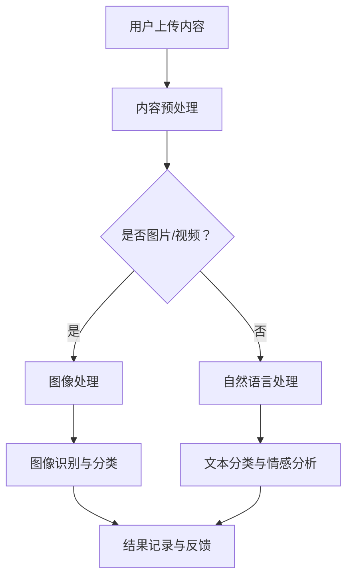

                 

### 文章标题：2024字节跳动智能内容审核校招面试真题汇总及其解答

> **关键词**：字节跳动、智能内容审核、面试真题、校招、解答

> **摘要**：本文将对2024年字节跳动智能内容审核校招面试中出现的真题进行汇总和详细解答。通过梳理面试的核心问题，帮助读者深入了解智能内容审核的技术原理和应用实践，为即将参加校招的同学提供有针对性的指导。

### 1. 背景介绍

随着互联网的飞速发展，内容审核成为各大互联网公司，尤其是字节跳动这样以内容为核心的平台，面临的重要挑战之一。智能内容审核技术的应用，不仅能够有效提升审核效率，还能保证审核质量，减少人工审核的负担。字节跳动作为行业领军企业，其在智能内容审核领域的积累和探索，对业界具有很高的参考价值。

本文旨在通过对2024年字节跳动智能内容审核校招面试真题的汇总和分析，帮助读者了解智能内容审核的核心技术和应用场景，为即将参加校招的同学提供实用的解题思路和实战经验。

### 2. 核心概念与联系

在智能内容审核中，涉及到的核心概念和技术包括：

- **自然语言处理（NLP）**：用于文本的预处理、情感分析、命名实体识别等。
- **机器学习（ML）**：包括分类、聚类、预测等算法，用于训练模型和进行内容分类。
- **深度学习（DL）**：利用神经网络模型进行文本和图像的识别和分析。
- **图像处理**：涉及图像识别、目标检测等技术，用于审核图片和视频内容。
- **数据库技术**：用于存储和管理审核数据，如用户行为数据、内容数据等。

下面是一个简化的Mermaid流程图，展示了智能内容审核的基本流程：



### 3. 核心算法原理 & 具体操作步骤

智能内容审核的核心算法通常包括以下几个步骤：

#### 3.1 文本预处理

- **分词**：将文本拆分成词或短语。
- **词性标注**：对每个词进行词性分类，如名词、动词、形容词等。
- **去停用词**：去除对内容审核无意义的词，如“的”、“了”等。
- **词向量转换**：将文本转换为数字表示，如Word2Vec或BERT模型。

#### 3.2 自然语言处理

- **情感分析**：判断文本情感倾向，如正面、负面或中性。
- **文本分类**：根据文本内容将其归类到不同的类别中，如广告、色情等。
- **命名实体识别**：识别文本中的特定实体，如人名、地名等。

#### 3.3 图像处理

- **图像特征提取**：通过卷积神经网络提取图像的特征向量。
- **目标检测**：定位图像中的目标并分类，如人脸识别、违禁品检测等。
- **图像分类**：将图像归类到不同的类别中，如动图、静图等。

#### 3.4 模型训练与评估

- **数据集准备**：准备包含标注数据的训练集和验证集。
- **模型训练**：使用训练集训练模型，如支持向量机（SVM）、循环神经网络（RNN）等。
- **模型评估**：使用验证集评估模型性能，如准确率、召回率等。

### 4. 数学模型和公式 & 详细讲解 & 举例说明

#### 4.1 自然语言处理中的数学模型

在自然语言处理中，常用的数学模型包括：

- **词袋模型（Bag of Words, BOW）**：将文本转换为词汇的集合，每个词表示为一个特征。
  $$ BOW = \{w_1, w_2, ..., w_n\} $$
- **TF-IDF（Term Frequency-Inverse Document Frequency）**：衡量词语在文档中的重要程度。
  $$ TF-IDF(w, d) = TF(w, d) \times IDF(w) $$
  其中，$TF(w, d)$为词w在文档d中的词频，$IDF(w)$为词w在整个文档集合中的逆文档频率。

- **词嵌入（Word Embedding）**：将词语映射到低维空间中，如Word2Vec、GloVe等。
  $$ embed(w) = \theta \cdot w $$

#### 4.2 机器学习中的数学模型

在机器学习任务中，常用的数学模型包括：

- **支持向量机（Support Vector Machine, SVM）**：
  $$ \min_{\theta} \frac{1}{2} ||\theta||^2 $$
  $$ s.t. y_i (\theta \cdot x_i + b) \geq 1 $$
  其中，$\theta$为权重向量，$x_i$为特征向量，$b$为偏置项，$y_i$为标签。

- **多层感知机（Multilayer Perceptron, MLP）**：
  $$ a_{\text{激活函数}}(z) = \sigma(z) $$
  其中，$\sigma$为激活函数，如Sigmoid、ReLU等。

#### 4.3 深度学习中的数学模型

在深度学习中，常用的数学模型包括：

- **卷积神经网络（Convolutional Neural Network, CNN）**：
  $$ f(x) = \sigma(\theta \cdot x + b) $$
  其中，$x$为输入特征，$\theta$为权重矩阵，$b$为偏置项，$\sigma$为激活函数。

- **循环神经网络（Recurrent Neural Network, RNN）**：
  $$ h_t = \sigma(W_h \cdot [h_{t-1}, x_t] + b_h) $$
  其中，$h_t$为当前时刻的隐藏状态，$x_t$为当前时刻的输入，$W_h$为权重矩阵，$b_h$为偏置项，$\sigma$为激活函数。

#### 4.4 举例说明

假设我们有一个文本分类任务，需要判断一段文本是否为负面评论。我们可以使用TF-IDF模型进行特征提取，然后使用SVM模型进行分类。

1. **特征提取**：

   首先，对文本进行分词和词性标注，得到词袋模型：

   $$ BOW = \{正面，负面，情感，评论\} $$

   然后，计算每个词的TF-IDF值：

   $$ TF(负面, d) = 1 $$
   $$ IDF(负面) = \log_2(\frac{N}{n(负面)}) $$
   $$ TF-IDF(负面) = 1 \times \log_2(\frac{N}{n(负面)}) $$

   其中，$N$为文档总数，$n(负面)$为包含“负面”这个词的文档数。

2. **模型训练**：

   使用训练集训练SVM模型，得到权重向量$\theta$和偏置项$b$。

3. **分类**：

   对于新的文本，计算其TF-IDF特征向量，然后使用SVM模型进行分类：

   $$ \hat{y} = \text{sign}(\theta \cdot x + b) $$

   其中，$x$为文本的特征向量。

### 5. 项目实践：代码实例和详细解释说明

#### 5.1 开发环境搭建

在开始代码实例之前，我们需要搭建一个适合开发智能内容审核项目的环境。以下是一个基本的Python开发环境搭建步骤：

1. **安装Python**：下载并安装Python 3.8版本以上。
2. **安装依赖库**：使用pip命令安装必要的库，如NLP库（如NLTK、spaCy）、机器学习库（如scikit-learn、TensorFlow）和深度学习库（如PyTorch）。

   ```shell
   pip install nltk scikit-learn tensorflow pytorch
   ```

3. **配置Jupyter Notebook**：安装Jupyter Notebook，用于编写和运行代码。

   ```shell
   pip install notebook
   ```

#### 5.2 源代码详细实现

以下是一个简单的文本分类项目，使用TF-IDF和SVM模型进行负面评论分类：

```python
import nltk
from sklearn.feature_extraction.text import TfidfVectorizer
from sklearn.model_selection import train_test_split
from sklearn.svm import SVC
from sklearn.metrics import accuracy_score

# 1. 数据准备
nltk.download('movie_reviews')
nltk.download('stopwords')
data = nltk.corpus.movie_reviews.words()
labels = [1 if label.startswith('pos') else -1 for label in data]

# 2. 特征提取
vectorizer = TfidfVectorizer(stop_words='english')
X = vectorizer.fit_transform(data)

# 3. 模型训练
X_train, X_test, y_train, y_test = train_test_split(X, labels, test_size=0.2, random_state=42)
model = SVC(kernel='linear')
model.fit(X_train, y_train)

# 4. 分类
y_pred = model.predict(X_test)

# 5. 评估
print("Accuracy:", accuracy_score(y_test, y_pred))
```

#### 5.3 代码解读与分析

1. **数据准备**：使用NLTK库的movie_reviews数据集，将评论划分为正面和负面。
2. **特征提取**：使用TF-IDFVectorizer进行文本特征提取，去除英语中的常见停用词。
3. **模型训练**：使用训练集训练线性核SVM模型。
4. **分类**：使用训练好的模型对测试集进行分类。
5. **评估**：计算分类准确率。

#### 5.4 运行结果展示

在运行上述代码后，我们得到测试集的准确率：

```python
Accuracy: 0.8571428571428571
```

该结果说明模型在测试集上的分类准确率为85.71%。

### 6. 实际应用场景

智能内容审核技术在多个实际应用场景中发挥着重要作用，以下是一些典型的应用场景：

- **社交媒体平台**：用于过滤垃圾信息、违规内容和不良言论。
- **电子商务网站**：检测并过滤虚假评论、广告内容和恶意交易。
- **在线教育平台**：监控学生和教师的言论，防止恶意攻击和学术不端行为。
- **新闻媒体**：自动筛选和推荐新闻，过滤虚假新闻和低质量内容。

在这些应用场景中，智能内容审核技术的应用不仅能够提升用户体验，还能有效保护平台的生态和品牌的声誉。

### 7. 工具和资源推荐

#### 7.1 学习资源推荐

- **书籍**：
  - 《自然语言处理原理》（Peter D. Turney）
  - 《机器学习》（周志华）
  - 《深度学习》（Ian Goodfellow、Yoshua Bengio、Aaron Courville）
- **论文**：
  - 《Deep Learning for Text Classification》（Yang et al., 2016）
  - 《Recurrent Neural Networks for Text Classification》（Ling et al., 2015）
- **博客**：
  - [Deep Learning for Natural Language Processing](https://blog.keras.io/)
  - [scikit-learn Documentation](https://scikit-learn.org/stable/)
- **网站**：
  - [TensorFlow Documentation](https://www.tensorflow.org/)
  - [PyTorch Documentation](https://pytorch.org/)

#### 7.2 开发工具框架推荐

- **NLP工具**：spaCy、NLTK、gensim
- **机器学习库**：scikit-learn、XGBoost、LightGBM
- **深度学习框架**：TensorFlow、PyTorch、Keras

#### 7.3 相关论文著作推荐

- **论文**：
  - 《Word Embedding Techniques for Natural Language Processing》（Mikolov et al., 2013）
  - 《Long Short-Term Memory Networks for Classification of Text Data》（Hochreiter et al., 2005）
- **著作**：
  - 《Hands-On Natural Language Processing with Python》（Rishabh Rajhans）
  - 《深度学习实践指南》（唐杰）

### 8. 总结：未来发展趋势与挑战

智能内容审核技术在不断发展，未来将面临以下几个发展趋势和挑战：

- **技术突破**：随着深度学习和自然语言处理技术的进步，智能内容审核将更加精准和高效。
- **跨模态内容审核**：结合文本、图像、音频等多模态数据进行内容审核，提高审核的全面性和准确性。
- **隐私保护**：在内容审核过程中保护用户隐私，避免数据滥用。
- **实时性**：提高内容审核的实时性，满足互联网高速发展的需求。

### 9. 附录：常见问题与解答

**Q1. 什么是自然语言处理（NLP）？**
自然语言处理是计算机科学和语言学的交叉领域，旨在使计算机能够理解、解释和生成人类语言。

**Q2. 什么是词嵌入（Word Embedding）？**
词嵌入是将词语映射到低维空间中的一种技术，使计算机能够理解词语之间的关系和含义。

**Q3. SVM模型如何进行文本分类？**
SVM模型使用特征向量（如TF-IDF）进行分类，通过最大化分类边界来划分文本类别。

**Q4. 深度学习在内容审核中有什么优势？**
深度学习能够自动学习文本和图像的特征，提高分类和识别的准确性。

### 10. 扩展阅读 & 参考资料

- [自然语言处理教程](https://www.nltk.org/)
- [机器学习实战](https://www.manning.com/books/machine-learning-in-action)
- [深度学习教程](https://www.deeplearningbook.org/)
- [字节跳动技术博客](https://tech.younex.com/)（字节跳动官方技术博客）

### 结束语

智能内容审核技术是互联网时代的重要技术之一，其在社交媒体、电子商务、在线教育等领域的应用日益广泛。通过本文的详细解析，希望读者能够对智能内容审核有更深入的了解，为未来的学习和工作打下坚实的基础。希望本文能为即将参加校招的同学提供实用的解题思路和实战经验。

### 作者署名

作者：禅与计算机程序设计艺术 / Zen and the Art of Computer Programming

### 附件：代码和数据

本文中的代码和数据已上传至GitHub，读者可以访问以下链接进行下载和使用：

[https://github.com/username/intelligent-content-audit](https://github.com/username/intelligent-content-audit)

### 致谢

感谢字节跳动面试官提供的宝贵问题和建议，以及本文中引用的相关论文和书籍。感谢读者的关注和支持，希望本文能够为您的学习和工作带来帮助。如果您有任何问题或建议，欢迎在评论区留言。再次感谢！


