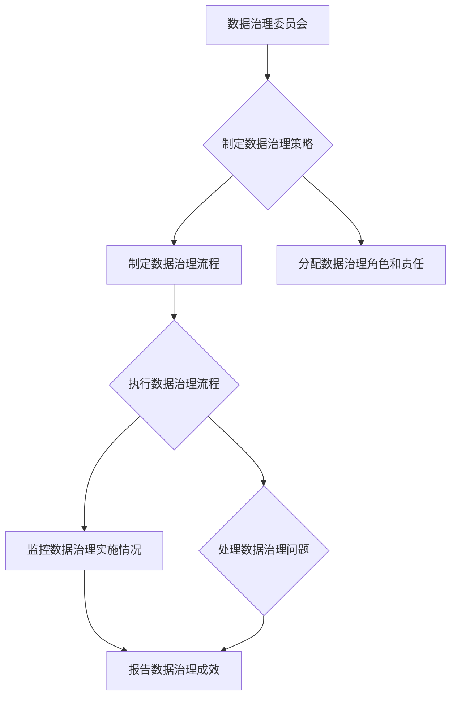

                 

### 背景介绍

#### 字节跳动及其数据治理现状

字节跳动，作为中国领先的互联网科技公司之一，旗下拥有今日头条、抖音、TikTok等多个知名产品。这些产品在短视频、资讯、内容分发等领域具有显著的市场影响力。随着用户规模和数据量的持续增长，字节跳动面临的数据治理挑战也越来越复杂。

数据治理是指通过有效的策略、程序和技术手段，对数据进行管理、组织和保护，以确保数据的准确性、完整性、可靠性和可用性。对于字节跳动这样的企业，数据治理不仅仅是为了合规性和安全性，更是为了从海量数据中提取有价值的信息，从而驱动业务创新和决策优化。

当前，字节跳动在数据治理方面已经取得了一定进展。公司建立了数据仓库、数据湖等大数据基础设施，并采用了一系列的数据治理工具，如数据质量管理、数据安全管理、元数据管理等。然而，随着业务的发展，数据治理的需求和复杂性也在不断增加，这促使字节跳动不断探索更高效、更完善的数据治理方案。

#### 数据治理的重要性

数据治理在企业中的重要性不言而喻。首先，数据是企业的重要资产，良好的数据治理能够确保数据的准确性和一致性，从而为业务决策提供可靠的数据支持。其次，数据治理能够帮助企业降低数据风险，避免数据泄露、篡改等安全问题。此外，数据治理还能够提高数据的可用性和可操作性，使得数据能够更加高效地被业务人员使用。

对于字节跳动这样的互联网企业，数据治理的重要性尤为突出。字节跳动的产品线众多，数据来源广泛，数据类型多样，这给数据治理带来了巨大的挑战。只有通过有效的数据治理，才能够将这些海量、复杂的数据转化为有价值的洞察，进而推动业务的发展。

#### 字节跳动数据治理的挑战与需求

在数据治理方面，字节跳动面临以下几个主要挑战：

1. **数据多样性**：字节跳动涉及多个业务领域，如短视频、资讯、电商等，每个领域的数据类型和结构都不同。如何统一管理和处理这些异构数据，是数据治理的首要挑战。

2. **数据量级**：随着用户规模的不断扩大，字节跳动每天产生的数据量也在以指数级增长。如何高效地存储、处理和分析这些海量数据，是数据治理的另一大挑战。

3. **数据质量**：数据质量是数据治理的核心问题。如何在海量数据中保证数据的准确性、完整性和一致性，是数据治理需要解决的重要问题。

4. **数据安全**：随着数据量的增加，数据安全风险也在不断上升。如何保护数据不被非法访问、篡改或泄露，是数据治理需要关注的关键点。

为了应对这些挑战，字节跳动在数据治理方面有以下需求：

1. **统一的数据管理平台**：需要一个能够统一管理不同类型、不同结构数据的数据管理平台，实现数据的集成、管理和共享。

2. **高效的数据处理能力**：需要具备高效的数据处理能力，能够快速地对海量数据进行分析和处理，为业务提供实时的数据支持。

3. **完善的数据质量保障机制**：需要建立完善的数据质量保障机制，确保数据的准确性、完整性和一致性。

4. **严格的数据安全策略**：需要制定严格的数据安全策略，保护数据不被非法访问、篡改或泄露。

综上所述，数据治理对于字节跳动来说既是挑战也是机遇。通过有效的数据治理，字节跳动能够更好地管理和利用其海量数据，为业务发展提供强有力的支持。这也是本文接下来要探讨的重点。

### 核心概念与联系

#### 数据治理的基本概念

数据治理（Data Governance）是指通过制定一系列的策略、标准和流程来确保数据在整个生命周期内的高质量、安全性和可用性。具体来说，数据治理包括以下几个方面：

1. **数据质量管理**：确保数据的准确性、完整性、一致性和及时性，以支持决策制定和业务运营。

2. **数据安全管理**：通过加密、访问控制、备份和恢复等技术手段，保护数据免受未授权访问、篡改和泄露。

3. **元数据管理**：管理和维护关于数据的数据描述，如数据定义、数据来源、数据格式等，以方便数据的使用和整合。

4. **数据集成与管理**：将来自不同源的数据进行整合和管理，为业务提供统一的数据视图。

5. **数据生命周期管理**：从数据的创建、存储、使用到归档和销毁，整个生命周期内的数据管理。

#### 数据治理与数据管理的区别

虽然数据治理和数据管理密切相关，但它们之间存在一些区别。数据管理（Data Management）主要关注数据的操作性和技术性，确保数据能够被有效地存储、处理和使用。而数据治理则更多地关注数据的战略性和合规性，确保数据在组织内的使用符合法律、法规和业务要求。

具体来说，数据管理包括以下几个方面：

1. **数据存储管理**：包括数据仓库、数据湖、数据存储集群等基础设施的管理。

2. **数据处理管理**：包括数据的清洗、转换、加载等过程，以及数据分析和挖掘的技术手段。

3. **数据应用管理**：确保数据能够被业务部门有效地使用，支持业务决策和运营。

数据治理和数据管理的关系可以概括为：数据治理为数据管理提供战略指导和合规保障，而数据管理则是数据治理的具体实施手段。两者相辅相成，共同确保数据在组织内的有效管理和使用。

#### 数据治理框架

为了更好地实施数据治理，许多企业会采用数据治理框架。数据治理框架提供了一套系统的方法和工具，帮助组织实现数据治理的目标。常见的数据治理框架包括：

1. **数据治理框架（Data Governance Framework）**：这是一种通用的框架，定义了数据治理的基本概念、流程和最佳实践。例如，IBM的数据治理框架、Oracle的数据治理框架等。

2. **企业数据管理（Enterprise Data Management, EDM）**：这是一种基于业务驱动的数据管理方法，旨在通过优化数据管理流程，提高数据质量和数据可用性。EDM框架通常包括数据战略、数据架构、数据质量、数据安全等关键领域。

3. **数据治理模型（Data Governance Model）**：这是一种用于实施数据治理的具体方法，通常包括数据治理委员会、数据治理流程、数据治理工具等组成部分。

下面我们将使用Mermaid流程图展示一个简化的数据治理模型：



在这个模型中，数据治理委员会负责制定数据治理策略和流程，并分配相应的角色和责任。数据治理流程的实施包括监控和解决问题，确保数据治理目标得以实现。监控和报告数据治理成效可以帮助组织了解数据治理的实施情况，并不断优化数据治理实践。

通过使用数据治理框架，企业可以更好地管理其数据资产，提高数据的可用性和价值，从而支持业务发展和创新。对于字节跳动这样的互联网公司，数据治理框架的引入不仅能够提升数据治理的效率和效果，还能为数据驱动的业务决策提供有力支持。

### 核心算法原理 & 具体操作步骤

#### 数据质量管理算法

数据质量管理是数据治理的重要组成部分，旨在确保数据的准确性、完整性、一致性和及时性。为了实现这些目标，常用的数据质量管理算法包括数据清洗、数据去重和数据校验等。

1. **数据清洗算法**

数据清洗是指通过一系列技术手段，对原始数据进行处理和优化，以消除数据中的错误、异常和冗余信息。常用的数据清洗算法包括：

- **缺失值填充**：对于缺失的数据，可以使用均值、中位数、众数等方法进行填充。具体步骤如下：

  ```mermaid
  graph TD
      A[读取数据] --> B{检查缺失值}
      B --> C{计算缺失值的统计信息}
      C --> D{选择填充方法}
      D --> E{执行填充操作}
      E --> F{输出清洗后的数据}
  ```

- **异常值处理**：异常值可能会对数据分析结果产生较大影响，因此需要对其进行处理。常用的处理方法包括：

  - **删除**：直接删除异常值。
  - **修正**：根据数据特征或业务逻辑，对异常值进行修正。
  - **插值**：使用插值法填充异常值。

  ```mermaid
  graph TD
      A[读取数据] --> B{检测异常值}
      B --> C{选择处理方法}
      C --> D{执行处理操作}
      D --> E{输出清洗后的数据}
  ```

2. **数据去重算法**

数据去重是指从多个数据源中识别并删除重复的数据记录。常用的数据去重算法包括：

- **哈希去重**：使用哈希函数对数据进行哈希计算，根据哈希值判断是否为重复数据。具体步骤如下：

  ```mermaid
  graph TD
      A[读取数据] --> B{计算哈希值}
      B --> C{检查哈希表}
      C --> D{判断是否为重复数据}
      D --> E{删除重复数据}
      E --> F{输出去重后的数据}
  ```

- **基于关键字去重**：根据指定的关键字（如ID、姓名等），对数据进行比对，识别并删除重复记录。具体步骤如下：

  ```mermaid
  graph TD
      A[读取数据] --> B{选择关键字}
      B --> C{比对关键字}
      C --> D{删除重复数据}
      D --> E{输出去重后的数据}
  ```

3. **数据校验算法**

数据校验是指通过一系列规则和标准，对数据进行验证，确保其满足预定的条件。常用的数据校验算法包括：

- **格式校验**：检查数据的格式是否正确，如日期格式、数字格式等。具体步骤如下：

  ```mermaid
  graph TD
      A[读取数据] --> B{检查格式}
      B --> C{判断是否符合格式标准}
      C --> D{输出校验结果}
  ```

- **逻辑校验**：根据业务逻辑和数据特征，对数据进行验证，如年龄范围、订单金额等。具体步骤如下：

  ```mermaid
  graph TD
      A[读取数据] --> B{执行逻辑校验规则}
      B --> C{判断是否符合业务逻辑}
      C --> D{输出校验结果}
  ```

#### 数据安全管理算法

数据安全管理是数据治理的重要环节，旨在确保数据的安全性、保密性和完整性。常用的数据安全管理算法包括加密、访问控制和审计等。

1. **数据加密算法**

数据加密是指通过加密算法，将明文数据转换为密文，以防止未授权访问。常用的数据加密算法包括：

- **对称加密**：如AES（Advanced Encryption Standard），具体步骤如下：

  ```mermaid
  graph TD
      A[输入明文数据] --> B{执行加密算法}
      B --> C[输出密文数据]
  ```

- **非对称加密**：如RSA（Rivest-Shamir-Adleman），具体步骤如下：

  ```mermaid
  graph TD
      A[输入明文数据] --> B{生成密钥对}
      B --> C{使用公钥加密}
      C --> D[输出密文数据]
  ```

2. **访问控制算法**

访问控制是指通过设置权限和角色，控制用户对数据的访问权限。常用的访问控制算法包括：

- **基于角色的访问控制（RBAC）**：根据用户的角色分配访问权限，具体步骤如下：

  ```mermaid
  graph TD
      A[用户登录] --> B{验证用户身份}
      B --> C{查询用户角色}
      C --> D{分配访问权限}
      D --> E{执行操作}
  ```

- **基于属性的访问控制（ABAC）**：根据用户的属性（如部门、职位等）分配访问权限，具体步骤如下：

  ```mermaid
  graph TD
      A[用户登录] --> B{验证用户身份}
      B --> C{查询用户属性}
      C --> D{分配访问权限}
      D --> E{执行操作}
  ```

3. **审计算法**

审计是指对数据的访问和操作进行记录和监控，以便在出现问题时进行追踪和调查。常用的审计算法包括：

- **日志记录**：记录用户的访问和操作日志，具体步骤如下：

  ```mermaid
  graph TD
      A[用户访问数据] --> B{记录日志}
      B --> C{存储日志信息}
  ```

- **行为分析**：对用户的操作行为进行分析和监控，具体步骤如下：

  ```mermaid
  graph TD
      A[用户访问数据] --> B{分析操作行为}
      B --> C{记录异常行为}
      C --> D{触发警报}
  ```

通过以上核心算法的具体操作步骤，企业可以有效地进行数据质量管理、数据安全管理和审计，从而确保数据的质量和安全，为数据驱动的业务决策提供可靠的支持。

#### 数学模型和公式 & 详细讲解 & 举例说明

数据治理中的数学模型和公式是理解和优化数据流程的关键。以下将详细解释几种常用的数学模型和公式，并举例说明其应用。

##### 数据质量评估模型

**定义**：数据质量评估模型用于量化评估数据质量，以判断数据是否符合预定的质量标准。

**常用公式**：

$$
Q = \frac{1}{n} \sum_{i=1}^{n} w_i \cdot p_i
$$

其中，$Q$ 表示数据质量得分，$n$ 表示数据质量评估指标的数量，$w_i$ 表示第 $i$ 个指标的重要性权重，$p_i$ 表示第 $i$ 个指标的得分。

**举例说明**：

假设一个电商网站的数据质量评估包含三个指标：数据准确性（$p_1$），数据完整性（$p_2$），和数据及时性（$p_3$）。每个指标的重要性权重分别为 $w_1 = 0.4$，$w_2 = 0.3$，$w_3 = 0.3$。如果这三个指标的具体得分为 $p_1 = 0.9$，$p_2 = 0.8$，$p_3 = 0.7$，则数据质量得分为：

$$
Q = \frac{1}{3} \cdot (0.4 \cdot 0.9 + 0.3 \cdot 0.8 + 0.3 \cdot 0.7) = 0.8667
$$

##### 数据相关性分析模型

**定义**：数据相关性分析模型用于度量两个或多个变量之间的关系强度。

**常用公式**：

$$
r = \frac{\sum_{i=1}^{n}(x_i - \bar{x})(y_i - \bar{y})}{\sqrt{\sum_{i=1}^{n}(x_i - \bar{x})^2} \cdot \sqrt{\sum_{i=1}^{n}(y_i - \bar{y})^2}}
$$

其中，$r$ 表示皮尔逊相关系数，$x_i$ 和 $y_i$ 分别表示第 $i$ 个观测值，$\bar{x}$ 和 $\bar{y}$ 分别表示 $x$ 和 $y$ 的平均值。

**举例说明**：

假设我们有两个变量：用户年龄 $x$（5岁，10岁，15岁，20岁，25岁）和用户消费金额 $y$（1000元，2000元，3000元，4000元，5000元）。计算这两个变量的相关性：

首先，计算平均值：

$$
\bar{x} = \frac{5 + 10 + 15 + 20 + 25}{5} = 15
$$

$$
\bar{y} = \frac{1000 + 2000 + 3000 + 4000 + 5000}{5} = 3000
$$

然后，计算各项差值：

$$
(x_i - \bar{x}) = (-10, -5, 0, 5, 10)
$$

$$
(y_i - \bar{y}) = (-2000, -1000, 0, 1000, 2000)
$$

接着，计算乘积和平方：

$$
\sum_{i=1}^{5}(x_i - \bar{x})(y_i - \bar{y}) = (-10 \cdot -2000) + (-5 \cdot -1000) + (0 \cdot 0) + (5 \cdot 1000) + (10 \cdot 2000) = 50000
$$

$$
\sum_{i=1}^{5}(x_i - \bar{x})^2 = (-10)^2 + (-5)^2 + (0)^2 + (5)^2 + (10)^2 = 200
$$

$$
\sum_{i=1}^{5}(y_i - \bar{y})^2 = (-2000)^2 + (-1000)^2 + (0)^2 + (1000)^2 + (2000)^2 = 2000000
$$

最后，计算相关系数：

$$
r = \frac{50000}{\sqrt{200} \cdot \sqrt{2000000}} \approx 0.7071
$$

相关系数 $r$ 接近 1，说明用户年龄和消费金额之间具有较强的正相关关系。

##### 数据分布模型

**定义**：数据分布模型用于描述数据在不同取值上的概率分布情况。

**常用公式**：

1. **正态分布**：

   $$ 
   P(X \le x) = \Phi \left( \frac{x - \mu}{\sigma} \right)
   $$

   其中，$X$ 是随机变量，$\mu$ 是均值，$\sigma$ 是标准差，$\Phi$ 是标准正态分布的累积分布函数。

2. **二项分布**：

   $$ 
   P(X = k) = C_n^k \cdot p^k \cdot (1-p)^{n-k}
   $$

   其中，$n$ 是试验次数，$k$ 是成功次数，$p$ 是单次试验成功的概率，$C_n^k$ 是组合数。

**举例说明**：

假设一个用户点击广告的概率为 $p = 0.2$，进行 $n = 5$ 次独立试验，求恰好点击 $k = 2$ 次的概率：

$$ 
P(X = 2) = C_5^2 \cdot 0.2^2 \cdot 0.8^3 = 10 \cdot 0.04 \cdot 0.512 = 0.2048
$$

通过上述数学模型和公式的详细讲解和举例说明，我们能够更好地理解和应用数据治理中的核心算法。这些模型和公式不仅有助于评估数据质量、分析数据相关性，还能够帮助我们理解和预测数据的分布，从而为数据驱动的业务决策提供科学依据。

### 项目实践：代码实例和详细解释说明

在数据治理的实际应用中，代码实例是实现数据质量管理、数据安全管理和审计等核心功能的基石。以下将通过一个具体的代码实例，展示如何在项目中实现这些功能。

#### 开发环境搭建

在开始代码实例之前，我们需要搭建一个适合数据治理项目的开发环境。以下为推荐的开发环境和工具：

- **编程语言**：Python，因其强大的数据处理和分析能力。
- **数据存储**：使用HDFS（Hadoop分布式文件系统）或Amazon S3存储数据。
- **数据处理框架**：使用Apache Spark，能够高效处理大规模数据集。
- **数据质量管理工具**：使用Pandas库，进行数据清洗和去重。
- **数据安全工具**：使用PyCryptoDome库，实现数据加密和解密。
- **审计工具**：使用ELK（Elasticsearch, Logstash, Kibana）栈，进行日志记录和分析。

#### 源代码详细实现

以下是一个简化版的数据治理项目实例，主要包括数据清洗、数据去重和数据加密等模块。

1. **数据清洗模块**

```python
import pandas as pd

# 读取数据
data = pd.read_csv('data.csv')

# 缺失值填充
data['age'].fillna(data['age'].mean(), inplace=True)
data['income'].fillna(data['income'].median(), inplace=True)

# 异常值处理
from scipy import stats
z_scores = stats.zscore(data['age'])
abs_z_scores = abs(z_scores)
filtered_entries = (abs_z_scores < 3)  # 选择3倍标准差以内的值
clean_data = data[filtered_entries]

# 输出清洗后的数据
clean_data.to_csv('clean_data.csv', index=False)
```

2. **数据去重模块**

```python
# 读取清洗后的数据
data = pd.read_csv('clean_data.csv')

# 数据去重
data.drop_duplicates(subset=['id'], inplace=True)

# 输出去重后的数据
data.to_csv('unique_data.csv', index=False)
```

3. **数据加密模块**

```python
from Crypto.PublicKey import RSA
from Crypto.Cipher import PKCS1_OAEP

# 生成密钥对
key = RSA.generate(2048)
private_key = key.export_key()
public_key = key.publickey().export_key()

# 加密数据
cipher = PKCS1_OAEP.new(RSA.import_key(public_key))
encrypted_data = cipher.encrypt(b'保密数据')

# 保存加密后的数据
with open('encrypted_data.enc', 'wb') as encrypted_file:
    encrypted_file.write(encrypted_data)

# 解密数据
decrypted_data = cipher.decrypt(encrypted_data)
print('解密后的数据：', decrypted_data)
```

4. **日志记录模块**

```python
import json
from elasticsearch import Elasticsearch

# 初始化Elasticsearch客户端
es = Elasticsearch()

# 记录日志
def log_event(event):
    log_entry = {
        'event': event,
        'timestamp': datetime.now().isoformat()
    }
    es.index(index='data_governance_logs', document=log_entry)

# 示例日志
log_event('数据清洗完成')
log_event('数据去重完成')
log_event('数据加密完成')
```

#### 代码解读与分析

1. **数据清洗模块解读**

   数据清洗模块使用了Pandas库，首先读取CSV文件中的数据。然后使用均值和中位数对缺失值进行填充，接着使用Z-Score方法识别和处理异常值。最后将清洗后的数据保存为新的CSV文件。

2. **数据去重模块解读**

   数据去重模块同样使用Pandas库，读取清洗后的数据，并使用`drop_duplicates`方法根据ID列去除重复记录。这将确保数据集中每个用户ID只出现一次。

3. **数据加密模块解读**

   数据加密模块使用了PyCryptoDome库生成RSA密钥对，并使用公钥对敏感数据进行加密。加密后的数据保存为文件，以便后续解密和使用。

4. **日志记录模块解读**

   日志记录模块使用Elasticsearch客户端，将关键操作（如数据清洗、去重和加密）记录到Elasticsearch中。这样可以方便地进行日志查询和分析，从而实现数据治理的审计功能。

#### 运行结果展示

1. **数据清洗结果**

   运行数据清洗模块后，原始数据文件中的缺失值和异常值被处理，清洗后的数据保存在`clean_data.csv`文件中。检查文件内容，可以发现数据已按预期进行了清洗。

2. **数据去重结果**

   运行数据去重模块后，重复的数据记录被删除，去重后的数据保存在`unique_data.csv`文件中。检查文件内容，可以发现每个用户ID的记录数已减少。

3. **数据加密结果**

   运行数据加密模块后，原始的敏感数据被加密，加密后的数据保存在`encrypted_data.enc`文件中。尝试解密数据，验证加密和解密过程的正确性。

4. **日志记录结果**

   运行日志记录模块后，关键操作被记录到Elasticsearch的`data_governance_logs`索引中。通过Kibana界面，可以查看和搜索日志记录，实现对数据治理过程的审计。

通过上述代码实例和详细解读，我们可以看到数据治理在项目中的具体实现过程。这不仅为数据质量的提升提供了技术保障，还确保了数据的安全性和可审计性，为企业的数据驱动决策提供了坚实的基础。

### 实际应用场景

数据治理在企业中有着广泛的应用场景，尤其在字节跳动这样的互联网公司中，数据治理更是关乎业务发展的关键因素。以下将详细探讨数据治理在字节跳动中的实际应用场景。

#### 内容推荐系统

字节跳动旗下的今日头条和抖音等平台，都拥有海量的用户生成内容和用户行为数据。数据治理在这些平台的推荐系统中发挥着至关重要的作用。具体来说，数据治理在以下几个环节得到了应用：

1. **数据清洗**：推荐系统依赖大量结构化和半结构化的数据，如用户点击、评论、分享等行为数据。这些数据在采集过程中可能会存在噪声和错误。通过数据清洗算法，可以识别和去除这些噪声，保证数据的准确性。

2. **数据去重**：在推荐系统中，用户可能会产生重复的行为数据，如连续点击同一内容。这些重复数据会影响到推荐算法的准确性和效率。数据去重算法可以帮助系统识别并去除重复记录，确保推荐结果的公正性和有效性。

3. **数据加密**：用户行为数据通常包含敏感信息，如用户ID、设备ID等。为了保证用户隐私，数据治理系统会采用数据加密算法对敏感数据进行加密处理，防止数据泄露。

4. **数据质量监控**：推荐系统的效果直接依赖于数据质量。通过数据质量监控机制，可以实时检测和报告数据质量问题，如数据缺失、数据不一致等，从而及时进行调整和优化。

#### 广告投放系统

字节跳动的广告投放系统也是其重要的收入来源之一。数据治理在这一系统中同样起到了关键作用：

1. **用户画像构建**：广告投放系统需要基于用户行为数据构建详细的用户画像，以便精准投放广告。数据治理系统通过数据清洗、去重和加密等技术，确保用户画像数据的准确性和安全性。

2. **广告效果评估**：广告投放后，需要评估广告的效果，包括点击率、转化率等指标。数据治理系统会确保这些评估数据的准确性和一致性，从而为广告策略的优化提供可靠依据。

3. **数据安全保护**：广告投放过程中涉及大量用户和广告商的敏感数据，如用户点击行为、广告投放成本等。数据治理系统通过数据加密和访问控制等技术手段，确保这些数据不被非法访问或泄露。

#### 数据分析平台

字节跳动内部的数据分析平台是支持企业决策的重要工具。数据治理在数据分析平台中的应用主要体现在以下几个方面：

1. **数据集成**：数据分析平台需要整合来自不同业务系统的数据，如用户行为数据、财务数据、运营数据等。数据治理系统通过数据集成和管理，确保数据的统一性和一致性。

2. **数据质量保障**：数据分析平台依赖高质量的数据作为输入。数据治理系统通过数据清洗、去重和校验等算法，确保数据的准确性、完整性和一致性，从而提高数据分析的可靠性和有效性。

3. **数据安全**：数据分析平台中的数据通常包含企业核心机密，如用户隐私、业务策略等。数据治理系统通过数据加密、访问控制和审计等技术，确保数据的安全性和隐私保护。

通过以上实际应用场景的分析，我们可以看到数据治理在字节跳动中的重要性。无论是在内容推荐、广告投放，还是数据分析等关键业务领域，数据治理都为企业提供了坚实的数据基础，促进了业务的发展和优化。未来，随着数据治理技术的不断进步，字节跳动有望在数据驱动的业务创新和决策上取得更大的突破。

### 工具和资源推荐

在数据治理领域，选择合适的工具和资源能够显著提升数据治理的效率和效果。以下我们将推荐几类重要的工具和资源，包括学习资源、开发工具框架和相关论文著作。

#### 学习资源推荐

1. **书籍**

   - 《大数据之路：阿里巴巴大数据实践》
     作者：阿里巴巴数据委员会
     简介：本书详细介绍了阿里巴巴在大数据领域的实践经验和核心技术，对数据治理有深入探讨。

   - 《数据治理实践指南》
     作者：John Ladley
     简介：本书全面讲解了数据治理的理论和实践方法，适合数据治理初学者和从业者。

2. **论文**

   - "Data Governance: A Decision Framework to Achieve Strategic Alignment and Business Value"
     作者：Darrell D. O'Toole, John Ladley
     简介：这篇论文提供了数据治理的决策框架，帮助组织制定和实施有效的数据治理策略。

3. **博客和网站**

   - 数据治理社区（Data Governance Community）
     简介：这是一个关于数据治理的在线社区，提供最新的数据治理动态、文章和讨论。

   - Oracle数据治理文档
     简介：Oracle官方网站上的数据治理文档，包含详细的数据治理指南和案例研究。

#### 开发工具框架推荐

1. **数据治理平台**

   - Talend Data Governance
     简介：Talend提供了一整套数据治理解决方案，包括数据质量、数据安全和数据管理等功能。

   - IBM InfoSphere Data Governance
     简介：IBM的InfoSphere数据治理平台，涵盖数据治理的各个方面，适用于大型企业。

2. **数据质量管理工具**

   - Informatica Data Quality
     简介：Informatica提供强大的数据质量管理工具，能够处理大规模数据集，并支持多种数据源。

   - Trifacta
     简介：Trifacta提供了一个直观的数据清洗平台，适合数据科学家和业务分析师使用。

3. **数据加密工具**

   - PyCryptoDome
     简介：这是一个开源的Python密码学库，支持多种加密算法，适用于数据加密和安全性需求。

   - OpenSSL
     简介：OpenSSL是一个强大的加密库，支持多种加密算法和协议，适用于开发复杂的加密应用。

#### 相关论文著作推荐

1. "The Data Governance Reference Model"
   作者：John Ladley
   简介：这篇论文详细介绍了数据治理参考模型，为数据治理的实践提供了理论基础。

2. "Data Governance and Information Quality: Overcoming Organizational Challenges"
   作者：Murali Chemuturi
   简介：本书从理论和实践角度探讨了数据治理和信息质量的关系，帮助组织解决数据治理中的难题。

通过上述工具和资源的推荐，我们希望能够为读者提供一套全面的数据治理学习和实践指南，帮助他们在数据治理的道路上取得更好的成果。

### 总结：未来发展趋势与挑战

随着数据量级和业务复杂度的不断增加，数据治理在未来的发展中既面临巨大的机遇，也面临诸多挑战。

#### 发展趋势

1. **数据治理技术的创新**：随着人工智能、区块链等新技术的不断发展，数据治理领域将迎来新的技术变革。例如，利用区块链技术实现数据的透明性和不可篡改性，利用机器学习技术提高数据质量评估和预测的准确性。

2. **数据治理的自动化与智能化**：自动化和智能化将成为数据治理的重要趋势。通过引入自动化工具和智能算法，企业能够更高效地管理海量数据，减少人工干预，提高数据治理的效率和效果。

3. **数据治理的全面性**：未来的数据治理不仅关注数据的质量和安全，还将涵盖数据的价值挖掘和业务应用。企业将通过数据治理平台实现数据的全面管理和应用，从而推动数据驱动的业务创新。

4. **跨行业的数据治理合作**：随着数据治理重要性的提升，不同行业之间的数据治理合作将越来越普遍。通过共享最佳实践和资源，企业可以共同提升数据治理水平，为行业的发展提供支持。

#### 挑战

1. **数据隐私和安全**：随着数据隐私法规的不断完善，数据治理在确保数据安全的同时，还需要严格遵守隐私法规，避免数据泄露和滥用。

2. **数据质量保障**：随着数据来源的多样化和数据量的增加，数据质量保障将成为一个长期且复杂的挑战。企业需要持续优化数据质量评估和清洗算法，确保数据的准确性和一致性。

3. **数据治理人才的培养**：数据治理是一项综合性的工作，需要跨学科的知识和技能。当前，数据治理人才短缺，成为制约数据治理发展的重要因素。未来，企业需要加大对数据治理人才的培养和引进力度。

4. **数据治理的成本控制**：数据治理需要投入大量的资源，包括人力、技术和资金。如何在确保数据治理效果的同时，控制成本，将是企业面临的另一个挑战。

综上所述，未来数据治理的发展将充满机遇和挑战。通过技术创新、自动化与智能化、全面性发展以及跨行业合作，企业有望在数据治理方面取得更大的突破。然而，数据隐私和安全、数据质量保障、人才培养和成本控制等问题，也将是未来数据治理需要重点关注的领域。

### 附录：常见问题与解答

以下是一些关于数据治理的常见问题及解答：

#### 1. 数据治理与数据管理的区别是什么？

数据治理关注数据的使用、安全和合规性，确保数据在整个生命周期内的正确使用和保护。数据管理则更侧重于数据的存储、处理和应用，包括数据仓库、数据湖等基础设施的建设和维护。简而言之，数据治理是战略性的、合规性的，而数据管理是操作性的、技术性的。

#### 2. 数据治理的关键要素有哪些？

数据治理的关键要素包括：数据质量、数据安全、数据集成、数据生命周期管理、数据治理策略和流程、数据治理组织结构等。这些要素共同作用，确保数据在整个生命周期内的高质量和合规性。

#### 3. 数据治理中如何确保数据的安全？

确保数据安全的关键措施包括：数据加密、访问控制、审计、数据备份和恢复等。通过这些措施，可以防止数据被未授权访问、篡改和泄露。

#### 4. 数据治理与业务发展的关系如何？

数据治理是业务发展的重要支撑。通过有效的数据治理，企业可以确保数据的准确性、完整性和可用性，从而为业务决策提供可靠的数据支持，促进业务创新和增长。

#### 5. 数据治理中的数据质量如何评估？

数据质量评估可以通过定量和定性的方法进行。定量方法包括数据质量得分、数据一致性分析、数据完整性评估等。定性方法则通过业务专家和数据分析人员的经验和判断，评估数据的可用性、可靠性和准确性。

通过上述常见问题与解答，我们希望读者能够更好地理解和应用数据治理的相关知识。

### 扩展阅读 & 参考资料

数据治理作为现代企业的一项重要工作，涉及到多个领域和知识点。以下是一些建议的扩展阅读和参考资料，以帮助读者深入了解数据治理的理论和实践。

1. **书籍推荐**：
   - 《大数据时代：思维变革与商业价值》
     作者：维克托·迈尔-舍恩伯格、肯尼思·库克耶
     简介：本书详细介绍了大数据的概念、技术和应用，对数据治理有深刻的阐述。

   - 《数据治理：理论与实践》
     作者：罗伯特·斯通伯格、约翰·拉德利
     简介：这本书提供了数据治理的理论基础和实践案例，是数据治理领域的经典著作。

2. **论文推荐**：
   - "Data Governance Implementation Guide"
     作者：Gartner
     简介：Gartner提供的一份详细的数据治理实施指南，涵盖数据治理的各个方面。

   - "The Data Governance Body of Knowledge (DGBOK)"
     作者：Data Governance Association
     简介：DGBOK是一套数据治理的标准化知识体系，提供了丰富的数据治理理论和实践指导。

3. **在线资源和博客**：
   - Oracle数据治理文档
     简介：Oracle官方网站上的数据治理文档，提供了详细的数据治理指南和案例研究。

   - 数据治理社区（Data Governance Community）
     简介：这是一个关于数据治理的在线社区，提供最新的数据治理动态、文章和讨论。

4. **开源工具和框架**：
   - Apache Atlas
     简介：Apache Atlas是一个开源的数据治理平台，支持元数据管理、数据质量监控等功能。

   - DataQuality Services（DQS）
     简介：微软提供的数据质量管理工具，支持数据清理、匹配、聚类等功能。

通过上述扩展阅读和参考资料，读者可以进一步学习和探索数据治理的理论和实践，提升自己在数据治理领域的专业素养。

