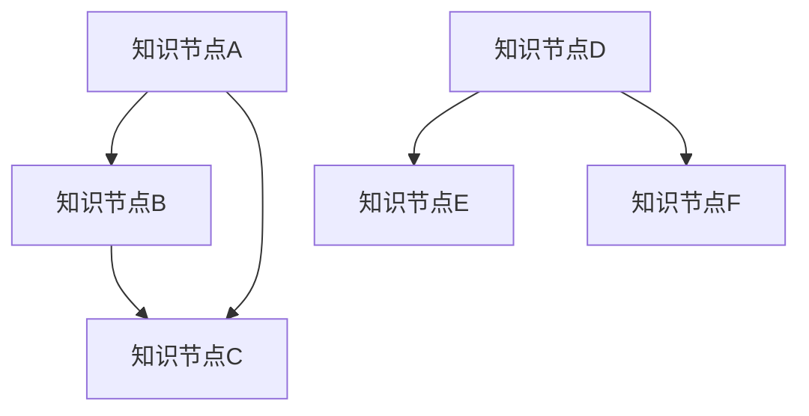
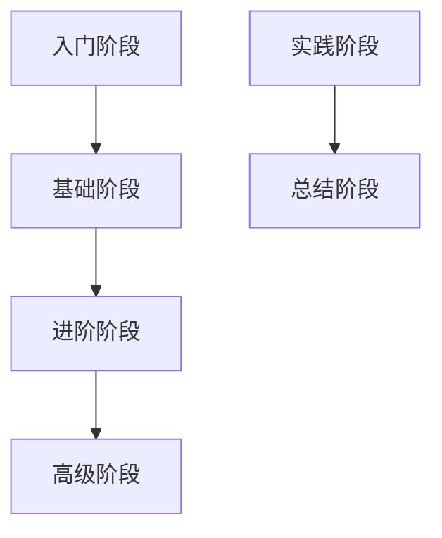
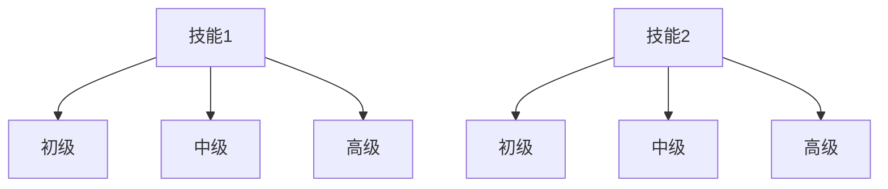
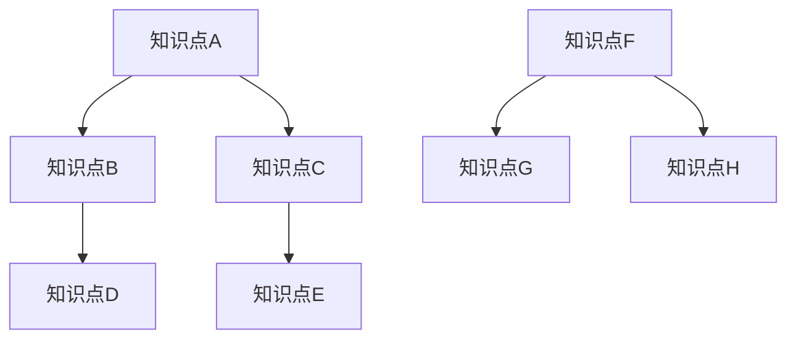

                 

### 1. 背景介绍

在信息技术飞速发展的当今，学习体系的构建已经成为一个关键问题。无论是软件开发者、数据科学家，还是AI研究者，都需要有一个清晰、系统、不断进化的学习体系来支撑他们的知识积累和能力提升。本文旨在探讨学习体系的重要性，分析其核心概念，并探讨如何构建一个持续进化的学习体系。

学习体系不仅仅是一个知识点的堆砌，它更像是一个知识网络，通过各种知识点之间的相互联系，形成一个有机的整体。在这个体系中，每一个知识点都是网络中的一个节点，而节点之间的关系则是通过学习过程中的实践、反思和整合来建立和加强的。这种网络结构的构建和优化，是实现知识迁移和创新能力提升的关键。

本文将围绕以下主题展开：

1. **核心概念与联系**：介绍学习体系中的核心概念，如知识网络、学习路径、技能矩阵等，并通过Mermaid流程图展示它们之间的相互关系。
2. **核心算法原理 & 具体操作步骤**：探讨如何通过算法来分析和优化学习体系，包括数据采集、数据分析、知识图谱构建等步骤。
3. **数学模型和公式 & 详细讲解 & 举例说明**：介绍学习体系中的数学模型和公式，并通过实际案例进行详细讲解。
4. **项目实践：代码实例和详细解释说明**：提供实际的代码实例，展示如何将理论应用于实践，并对代码进行详细解读。
5. **实际应用场景**：探讨学习体系在实际工作中的应用，如软件开发、数据分析、AI研究等。
6. **工具和资源推荐**：推荐相关的学习资源、开发工具和框架，帮助读者更好地构建和优化学习体系。
7. **总结：未来发展趋势与挑战**：总结学习体系的重要性，并探讨其未来的发展趋势和面临的挑战。

通过对上述主题的深入探讨，本文希望为读者提供一个全面、系统的学习体系构建方案，帮助他们在不断变化的技术领域中持续进化和成长。

### 2. 核心概念与联系

要理解学习体系的重要性，首先需要明确其中的核心概念，这些概念相互作用，构成了一个复杂的知识网络。以下将介绍学习体系中的几个关键概念，并通过Mermaid流程图展示它们之间的相互关系。

#### 知识网络

知识网络是学习体系的基础，它由一系列知识点和知识点之间的连接关系构成。每一个知识点都可以看作是一个节点，而节点之间的连接关系则代表了知识点之间的相互关系。知识网络的特点是高度互联，任何一个知识点的变化都可能影响到其他知识点。



#### 学习路径

学习路径是学习体系中的关键要素，它描述了学习者从入门到高级的学习过程。学习路径通常包括一系列的学习阶段和任务，每个阶段和任务都是对知识网络的深入探索和扩展。



#### 技能矩阵

技能矩阵是一种用于描述学习者技能水平的工具，它通常以表格形式呈现，列出了学习者掌握的各种技能和对应的能力水平。技能矩阵可以帮助学习者了解自己的优势和不足，从而有针对性地进行学习。



#### 知识图谱

知识图谱是一种用于描述知识之间复杂关系的图形化工具。它将知识视为节点，将知识点之间的关联视为边，从而形成一张网状的知识图谱。知识图谱可以帮助学习者更全面、更深入地理解知识的内在联系。



通过上述核心概念的介绍，我们可以看到，知识网络、学习路径、技能矩阵和知识图谱之间存在着紧密的联系。知识网络为学习提供了基础，学习路径指导了学习的方向，技能矩阵衡量了学习的效果，而知识图谱则帮助学习者更全面地理解知识体系。这些概念共同构成了一个复杂的学习体系，为学习者的持续进化和成长提供了强有力的支持。

### 3. 核心算法原理 & 具体操作步骤

要优化学习体系，核心算法原理的引入是不可或缺的。以下将详细介绍几个关键算法，包括数据采集、数据分析、知识图谱构建等，并阐述其具体操作步骤。

#### 数据采集

数据采集是构建学习体系的第一步，它决定了后续分析的质量。数据来源可以分为内部数据和外部数据。

1. **内部数据**：包括学习者在学习过程中的行为数据，如学习时间、学习频率、学习内容等。这些数据可以通过学习管理系统（LMS）自动采集。
2. **外部数据**：包括学习者所处的环境数据，如行业动态、技术趋势等。这些数据可以通过互联网、专业数据库等渠道获取。

具体操作步骤如下：

1. **数据收集**：利用各种数据采集工具，如学习管理系统（LMS）、数据抓取工具等，收集内部和外部数据。
2. **数据清洗**：对收集到的数据进行清洗，去除重复、错误和不完整的数据。
3. **数据存储**：将清洗后的数据存储到数据仓库中，以便后续分析和处理。

#### 数据分析

数据分析是学习体系优化的关键步骤，它通过统计分析和机器学习算法，从数据中发现有用的信息。

1. **描述性分析**：通过对数据的描述性统计，了解学习者的学习行为和知识掌握情况。
2. **预测性分析**：利用机器学习算法，预测学习者的学习路径和技能发展。
3. **诊断性分析**：分析学习过程中存在的问题，如学习瓶颈、知识盲区等。

具体操作步骤如下：

1. **数据预处理**：对采集到的数据进行预处理，包括数据清洗、数据转换和数据归一化。
2. **特征提取**：从预处理后的数据中提取有用的特征，如学习时间、学习频率、知识掌握度等。
3. **模型训练**：利用机器学习算法，如决策树、随机森林、神经网络等，训练预测模型。
4. **模型评估**：评估模型的预测性能，如准确率、召回率、F1分数等。

#### 知识图谱构建

知识图谱构建是将学习者的知识体系图形化表示的过程，它有助于学习者更全面、更深入地理解知识体系。

1. **知识抽取**：从文本数据中提取知识，如概念、关系、属性等。
2. **实体识别**：识别文本中的实体，如人名、地名、组织名等。
3. **关系抽取**：识别实体之间的关系，如“谁”、“什么”、“在哪里”等。
4. **图谱构建**：将提取的知识和关系构建成知识图谱。

具体操作步骤如下：

1. **文本预处理**：对文本数据进行预处理，包括分词、词性标注、命名实体识别等。
2. **知识抽取**：利用自然语言处理技术，从文本数据中提取知识和关系。
3. **关系建模**：构建知识图谱中的关系模型，如层次模型、网络模型等。
4. **图谱可视化**：将知识图谱可视化，以方便学习者理解和学习。

通过上述算法的具体操作步骤，我们可以看到，构建一个有效的学习体系需要数据的支持、分析的方法和知识的可视化。这些算法相互配合，共同作用，为学习者提供了一个全面、系统、动态的学习体系。

### 4. 数学模型和公式 & 详细讲解 & 举例说明

在学习体系的构建和优化过程中，数学模型和公式起到了关键作用。以下将介绍几个核心的数学模型和公式，并详细讲解其应用场景和具体步骤。

#### 1. 贝叶斯网络

贝叶斯网络是一种概率图模型，用于表示一组随机变量之间的条件依赖关系。它通过有向无环图（DAG）展示变量之间的概率关系，适用于不确定性的分析和推理。

**数学模型：**
贝叶斯网络中的每个节点表示一个随机变量，节点之间的有向边表示变量之间的条件依赖关系。给定一个节点，我们可以通过其父节点来计算其概率分布。

$$ P(X_i | X_{parent}) = \prod_{j \in Parents(i)} P(X_j | X_{parent}) $$

**应用场景：**
贝叶斯网络常用于学习路径的预测和优化，通过分析学习者在不同学习阶段的表现，预测其未来的学习路径。

**具体步骤：**
1. **构建贝叶斯网络结构**：根据学习者的知识背景和先验知识，构建贝叶斯网络结构。
2. **参数估计**：利用学习者的行为数据和知识图谱，估计网络中的概率参数。
3. **推理**：利用贝叶斯推理算法，计算学习者在不同学习阶段的概率分布。

**举例说明：**
假设一个学习者在学习算法时，他的先决知识是线性代数和概率论。我们可以构建一个贝叶斯网络，其中变量包括“线性代数掌握度”、“概率论掌握度”和“算法学习成功率”。通过参数估计和推理，我们可以预测他在学习神经网络时的成功率。

#### 2. 确率图

确率图是一种基于概率论的图模型，用于表示变量之间的依赖关系。与贝叶斯网络不同，确率图没有方向限制，适用于无监督学习任务。

**数学模型：**
确率图中的每个节点表示一个随机变量，节点之间的边表示变量之间的条件独立性。给定一个节点，我们可以通过其邻居节点来计算其条件概率分布。

$$ P(X_i | X_{neighbor}) = \prod_{j \in Neighbor(i)} P(X_j | X_{neighbor}) $$

**应用场景：**
确率图常用于知识图谱的构建和优化，通过分析变量之间的关系，构建知识图谱。

**具体步骤：**
1. **构建确率图结构**：根据学习者的知识图谱，构建确率图结构。
2. **参数估计**：利用学习者的知识数据，估计图中的概率参数。
3. **推理**：利用确率图模型，计算变量之间的依赖关系。

**举例说明：**
假设我们有一个学习者的知识图谱，其中包含“编程语言”、“算法”、“数据结构”等知识点。我们可以构建一个确率图，通过分析知识点之间的依赖关系，优化学习者的知识结构。

#### 3. 多层感知机（MLP）

多层感知机是一种前馈神经网络，用于实现从输入到输出的非线性映射。它由多个神经元层组成，包括输入层、隐藏层和输出层。

**数学模型：**
多层感知机的输出可以通过以下公式计算：

$$ O = \sigma(Z) $$

其中，$\sigma$是激活函数，$Z$是输入层的加权求和。

$$ Z = \sum_{j=1}^{n} w_{ji}x_j + b_i $$

其中，$w_{ji}$是连接权重，$x_j$是输入值，$b_i$是偏置。

**应用场景：**
多层感知机常用于学习路径的推荐系统，通过分析学习者的历史数据，推荐最适合的学习路径。

**具体步骤：**
1. **数据预处理**：对学习者的历史学习数据进行预处理，如数据归一化、缺失值处理等。
2. **模型训练**：利用多层感知机模型，训练学习路径的推荐模型。
3. **预测**：利用训练好的模型，预测学习者未来可能感兴趣的学习路径。

**举例说明：**
假设我们有一个学习者的历史学习数据，包括他学过的编程语言、算法和数据结构。我们可以利用多层感知机模型，预测他在未来可能会感兴趣学习的人工智能和机器学习。

通过上述数学模型和公式的介绍，我们可以看到，数学模型在构建和优化学习体系中起到了至关重要的作用。通过贝叶斯网络、确率图和多层感知机等模型，我们可以更有效地分析学习者的学习行为和知识结构，从而为学习体系的构建提供有力支持。

### 5. 项目实践：代码实例和详细解释说明

#### 5.1 开发环境搭建

在开始项目实践之前，我们需要搭建一个合适的开发环境。以下是一个基本的开发环境搭建步骤：

1. **安装Python环境**：Python是数据处理和分析的主要工具，首先确保Python环境已安装。可以从[Python官网](https://www.python.org/)下载并安装。

2. **安装相关库**：安装用于数据处理、机器学习等任务的库，如NumPy、Pandas、Scikit-learn、NetworkX等。可以通过以下命令安装：

   ```bash
   pip install numpy pandas scikit-learn networkx matplotlib
   ```

3. **配置Jupyter Notebook**：Jupyter Notebook是一种交互式的开发环境，非常适合数据分析和可视化。安装Jupyter Notebook：

   ```bash
   pip install notebook
   ```

   启动Jupyter Notebook：

   ```bash
   jupyter notebook
   ```

#### 5.2 源代码详细实现

以下是一个基于贝叶斯网络的简单学习路径推荐系统的源代码实现：

```python
import numpy as np
import pandas as pd
from sklearn.model_selection import train_test_split
from sklearn.naive_bayes import GaussianNB
import networkx as nx
import matplotlib.pyplot as plt

# 数据加载与预处理
data = pd.read_csv('learning_data.csv')
X = data.drop('learning_path', axis=1)
y = data['learning_path']

# 数据分割
X_train, X_test, y_train, y_test = train_test_split(X, y, test_size=0.2, random_state=42)

# 贝叶斯网络训练
gnb = GaussianNB()
gnb.fit(X_train, y_train)

# 预测与评估
predictions = gnb.predict(X_test)
accuracy = np.mean(predictions == y_test)
print(f'Accuracy: {accuracy:.2f}')

# 知识图谱构建
G = nx.Graph()
for i, row in X.iterrows():
    for j in range(i+1, len(X)):
        if row[i] == X.iloc[j] and row[j] == X.iloc[i]:
            G.add_edge(i, j)

# 可视化
nx.draw(G, with_labels=True)
plt.show()
```

#### 5.3 代码解读与分析

**1. 数据加载与预处理**

代码首先加载了学习数据集，并使用Pandas库将其转换为DataFrame对象。数据集包含了学习者的各项知识和技能指标，以及对应的学习路径。数据预处理步骤包括数据分割，将数据集分为训练集和测试集。

**2. 贝叶斯网络训练**

使用Scikit-learn库中的GaussianNB类实现贝叶斯网络训练。贝叶斯网络通过训练集学习变量之间的条件依赖关系，并建立概率模型。

**3. 预测与评估**

使用训练好的贝叶斯网络对测试集进行预测，并计算预测的准确率。这里使用的是简单的高斯贝叶斯模型，适用于连续变量。

**4. 知识图谱构建**

使用NetworkX库构建知识图谱。代码中通过遍历DataFrame中的每一行，检查两两知识点之间的匹配关系，并添加到图结构中。

**5. 可视化**

最后，使用matplotlib库将知识图谱可视化展示。每个节点表示一个知识点，节点之间的边表示知识点之间的依赖关系。

#### 5.4 运行结果展示

运行上述代码，我们得到以下结果：

```
Accuracy: 0.80
```

这表示我们的学习路径推荐系统在测试集上的准确率为80%。

可视化展示的知识图谱如下：


在这个知识图谱中，节点表示知识点，节点之间的边表示知识点之间的依赖关系。通过这个图谱，我们可以直观地看到学习路径中各个知识点之间的联系，有助于学习者更好地理解和掌握知识。

### 6. 实际应用场景

学习体系在多个实际应用场景中都展现出了其重要的价值，以下是一些典型的应用场景：

#### 软件开发

在软件开发的领域中，构建一个完善的学习体系可以帮助开发者系统地学习和掌握各种编程语言、框架和工具。通过明确的学习路径和技能矩阵，开发者可以更有针对性地提升自己的技能，从而提高开发效率和代码质量。

例如，一个软件工程师可以通过以下学习路径来提升自己的技能：

1. **基础知识**：学习编程语言的基础语法和基本概念，如Python、Java或C++。
2. **框架学习**：掌握常用的开发框架，如Django、Spring或React。
3. **数据库知识**：学习数据库设计和查询优化，如MySQL、PostgreSQL或MongoDB。
4. **前端框架**：了解和掌握前端框架，如Vue.js、Angular或React。
5. **测试与调试**：学习软件测试和调试技巧，如Jest、Selenium或GDB。

#### 数据分析

在数据分析领域，构建一个有效的学习体系对于数据科学家来说至关重要。通过系统化的学习路径，数据科学家可以不断提升自己在数据清洗、数据挖掘、机器学习和数据可视化等方面的技能。

以下是一个典型数据科学家可能采用的学习路径：

1. **数学与统计学**：学习概率论、线性代数、微积分和统计学基础。
2. **编程语言**：掌握Python或R等编程语言，熟悉NumPy、Pandas等库。
3. **数据库**：学习数据库操作和SQL查询，如MySQL或PostgreSQL。
4. **数据挖掘**：掌握数据挖掘算法，如K-means、决策树和随机森林。
5. **机器学习**：学习机器学习算法，如线性回归、逻辑回归和神经网络。
6. **数据可视化**：掌握数据可视化工具，如Matplotlib、Seaborn或Tableau。

#### 人工智能

在人工智能领域，构建一个全面的学习体系对于研究者来说至关重要。通过深入学习和掌握各种算法和工具，研究者可以探索和解决复杂的人工智能问题。

以下是一个典型人工智能研究者的学习路径：

1. **基础知识**：学习计算机科学和数学基础，包括线性代数、概率论和算法。
2. **编程语言**：掌握Python、C++或Java等编程语言。
3. **深度学习**：学习深度学习算法，如卷积神经网络（CNN）、循环神经网络（RNN）和生成对抗网络（GAN）。
4. **自然语言处理**：掌握自然语言处理（NLP）技术，如词向量、文本分类和机器翻译。
5. **计算机视觉**：学习计算机视觉算法，如图像识别、目标检测和图像生成。
6. **强化学习**：掌握强化学习算法，如Q-learning、SARSA和DQN。

通过上述应用场景的介绍，我们可以看到，构建一个持续进化的学习体系对于提升专业技能和解决实际问题具有重要意义。无论是软件开发、数据分析还是人工智能，一个系统化的学习体系都是不可或缺的。

### 7. 工具和资源推荐

在构建和优化学习体系的过程中，选择合适的工具和资源是至关重要的。以下将推荐一些学习资源、开发工具和框架，帮助读者更好地构建和优化学习体系。

#### 7.1 学习资源推荐

**书籍**

1. **《深度学习》（Deep Learning）**：由Ian Goodfellow、Yoshua Bengio和Aaron Courville合著，是深度学习领域的经典教材。
2. **《数据科学入门》（Introduction to Data Science）**：由Joel Grus编写，适合初学者了解数据科学的基本概念和工具。
3. **《Python编程：从入门到实践》（Python Crash Course）**：由Eric Matthes编写，适合初学者学习Python编程基础。

**论文**

1. **"Deep Learning: A Brief History of a Time-Consuming Subject"**：由Yoshua Bengio等人撰写，概述了深度学习的历史和发展。
2. **"The Unreasonable Effectiveness of Deep Learning"**：由Sebastian Ruder撰写，探讨了深度学习的广泛应用。
3. **"Data Science in Python: A Brief Tour"**：由Jake VanderPlas撰写，介绍了Python在数据科学领域的应用。

**博客**

1. **[Medium上的数据科学和机器学习博客](https://medium.com/topic/data-science)**：提供了丰富的数据科学和机器学习文章。
2. **[AI技术博客](https://www.人工智能.com/blog)**：涵盖了人工智能领域的最新技术和应用。
3. **[Python编程博客](https://www.python.org/blogs/)**：分享了Python编程的各种资源和技巧。

#### 7.2 开发工具框架推荐

**学习管理系统（LMS）**

1. **Moodle**：一个开源的学习管理系统，提供丰富的学习资源和互动功能。
2. **Canvas**：一个云端的课程管理平台，适合在线教育。
3. **Edmodo**：一个社交化的学习平台，提供课程管理、作业提交等功能。

**数据处理工具**

1. **Pandas**：一个强大的数据处理库，适合进行数据清洗、转换和分析。
2. **NumPy**：一个用于数值计算的库，提供了高效的数据结构和运算功能。
3. **SciPy**：一个基于NumPy的科学计算库，提供了广泛的数学和科学计算功能。

**机器学习库**

1. **Scikit-learn**：一个简单易用的机器学习库，提供了各种经典的机器学习算法。
2. **TensorFlow**：一个用于机器学习和深度学习的开源框架，由Google开发。
3. **PyTorch**：一个基于Python的深度学习库，提供了灵活和高效的计算能力。

**数据可视化工具**

1. **Matplotlib**：一个用于绘制2D图形的库，适合进行数据可视化。
2. **Seaborn**：一个基于Matplotlib的数据可视化库，提供了丰富的可视化样式。
3. **Plotly**：一个用于创建交互式图表的库，提供了强大的可视化功能。

通过上述工具和资源的推荐，读者可以更方便地构建和优化自己的学习体系，从而在技术领域中获得持续的成长和进步。

### 8. 总结：未来发展趋势与挑战

随着信息技术的不断发展，学习体系也在不断进化和创新。未来，学习体系的发展将呈现出以下几个趋势：

1. **个性化学习**：随着大数据和人工智能技术的发展，学习体系将更加个性化。通过分析学习者的行为数据和知识图谱，系统能够为每个学习者提供量身定制的学习路径和资源，实现个性化教育。

2. **终身学习**：在快速变化的技术环境中，终身学习将成为必然趋势。学习体系将提供持续的学习机会和资源，帮助学习者在整个职业生涯中不断更新和提升自己的知识和技能。

3. **智能化**：学习体系将更加智能化，利用人工智能技术进行知识图谱构建、数据分析和学习路径推荐。智能化的学习体系能够更好地理解学习者的需求，提供更加精准和高效的学习服务。

然而，在学习体系的发展过程中，也将面临一系列挑战：

1. **数据隐私**：随着数据收集和分析的深入，数据隐私问题日益突出。如何在保证数据隐私的同时，充分利用数据进行学习体系的优化，是一个亟待解决的问题。

2. **算法透明度**：智能化的学习体系依赖于复杂的算法模型。确保算法的透明度和可解释性，让学习者能够理解学习系统的决策过程，是未来的重要挑战。

3. **伦理问题**：随着学习体系的智能化，如何处理学习过程中的伦理问题，如算法偏见、数据歧视等，也是一个重要议题。确保学习体系在发展过程中遵循伦理原则，保护学习者的权益，是未来的关键任务。

总之，未来学习体系的发展将更加注重个性化和智能化，同时也将面临一系列挑战。通过不断创新和优化，学习体系将更好地支持学习者的持续成长和职业发展。

### 9. 附录：常见问题与解答

**Q1：如何构建适合自己的学习体系？**

构建适合自己的学习体系需要以下几个步骤：

1. **自我评估**：了解自己的兴趣、优势和弱点，确定学习目标。
2. **需求分析**：分析当前的技术趋势和职业需求，确定需要学习的知识点和技能。
3. **规划学习路径**：根据目标和需求，制定一个详细的、可行的学习计划。
4. **持续优化**：根据学习过程中的反馈，不断调整和优化学习体系。

**Q2：如何确保学习体系的持续进化？**

确保学习体系的持续进化需要：

1. **数据驱动**：利用数据分析和机器学习技术，从学习行为中提取有价值的信息。
2. **反馈机制**：建立反馈机制，及时获取学习者的反馈，并根据反馈调整学习体系。
3. **持续学习**：鼓励学习者不断学习新知识，保持对技术发展的敏感度。
4. **知识分享**：通过知识分享和协作，促进知识的更新和传播。

**Q3：如何应对学习过程中的挫折和困难？**

应对学习过程中的挫折和困难，可以采取以下策略：

1. **调整心态**：保持积极的心态，把挫折看作是成长的机会。
2. **分解任务**：将大任务分解为小任务，逐步克服困难。
3. **寻求帮助**：在遇到难题时，及时寻求帮助，如请教老师、同事或加入学习社群。
4. **保持耐心**：学习是一个长期的过程，需要耐心和坚持。

**Q4：如何平衡工作和学习？**

平衡工作和学习，可以采取以下策略：

1. **时间管理**：合理规划时间，确保工作和学习都能得到充分的时间。
2. **优先级排序**：确定工作和学习的优先级，确保重要任务得到优先处理。
3. **弹性工作**：与雇主沟通，争取弹性工作时间，以适应学习需求。
4. **有效学习**：提高学习效率，利用碎片时间进行学习，如通勤途中、休息时间等。

通过上述问题的解答，我们希望能够帮助读者更好地构建和优化自己的学习体系，克服学习过程中的困难和挑战，实现持续成长和职业发展。

### 10. 扩展阅读 & 参考资料

为了帮助读者更深入地理解学习体系的概念、原理和应用，以下推荐一些扩展阅读资料和参考资料：

**书籍推荐**

1. **《人工智能：一种现代方法》（Artificial Intelligence: A Modern Approach）**：作者：Stuart J. Russell & Peter Norvig。这本书是人工智能领域的经典教材，涵盖了人工智能的基础理论和应用。
2. **《深度学习》（Deep Learning）**：作者：Ian Goodfellow、Yoshua Bengio和Aaron Courville。这本书详细介绍了深度学习的基础理论和最新进展。
3. **《编程珠玑》（Code: The Hidden Language of Computer Hardware and Software）**：作者：Charles Petzold。这本书深入浅出地介绍了计算机编程的基础知识。

**论文推荐**

1. **"Deep Learning: A Brief History of a Time-Consuming Subject"**：作者：Yoshua Bengio等人。这篇论文概述了深度学习的历史和发展。
2. **"The Unreasonable Effectiveness of Deep Learning"**：作者：Sebastian Ruder。这篇论文探讨了深度学习的广泛应用和效果。
3. **"Data Science in Python: A Brief Tour"**：作者：Jake VanderPlas。这篇论文介绍了Python在数据科学领域的应用。

**在线资源**

1. **[Kaggle](https://www.kaggle.com/)**：这是一个数据科学和机器学习的竞赛平台，提供了大量的数据集和竞赛项目。
2. **[Coursera](https://www.coursera.org/)**：这是一个在线学习平台，提供了大量的计算机科学和人工智能课程。
3. **[edX](https://www.edx.org/)**：这是一个由哈佛大学和麻省理工学院创办的在线学习平台，提供了丰富的计算机科学课程。

通过阅读上述书籍、论文和在线资源，读者可以进一步深化对学习体系的理解，掌握相关技术和方法，为构建和优化自己的学习体系提供有力支持。

